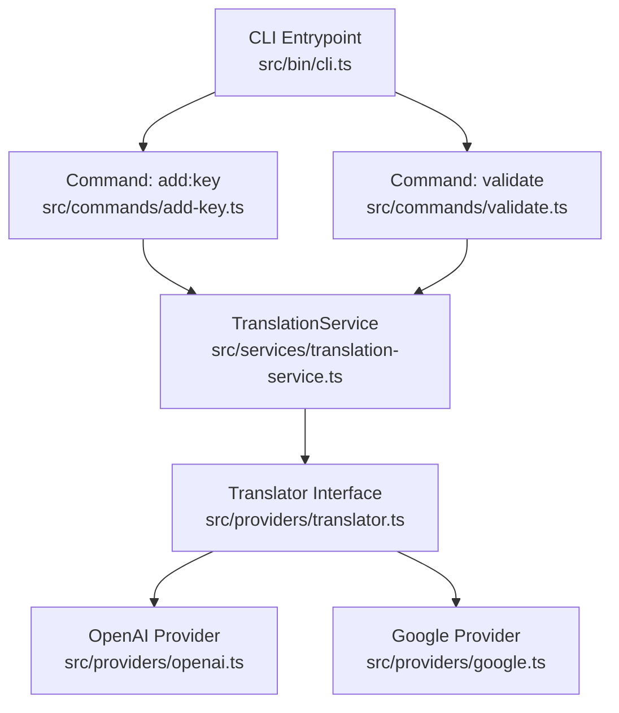
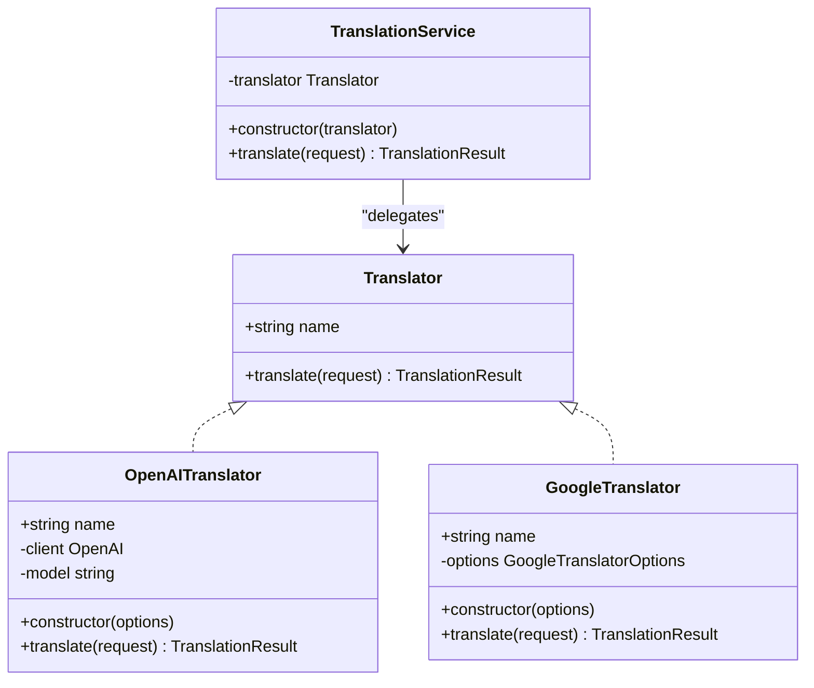
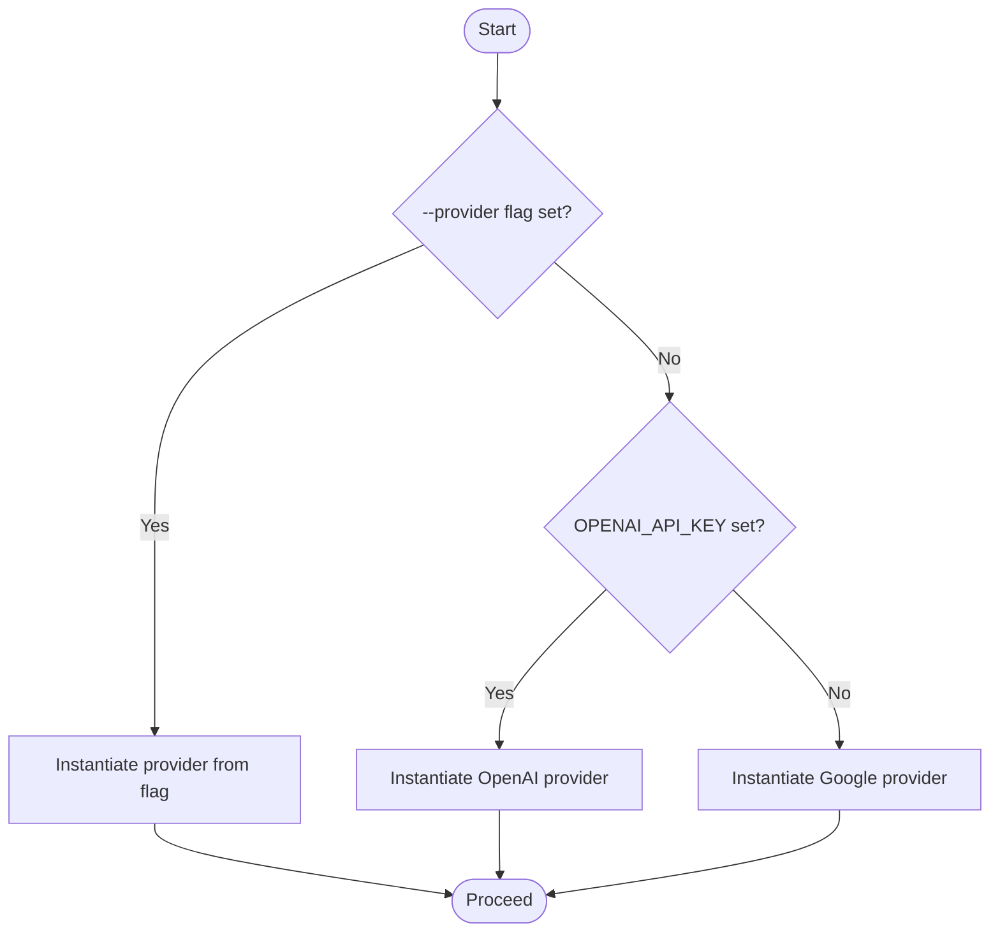
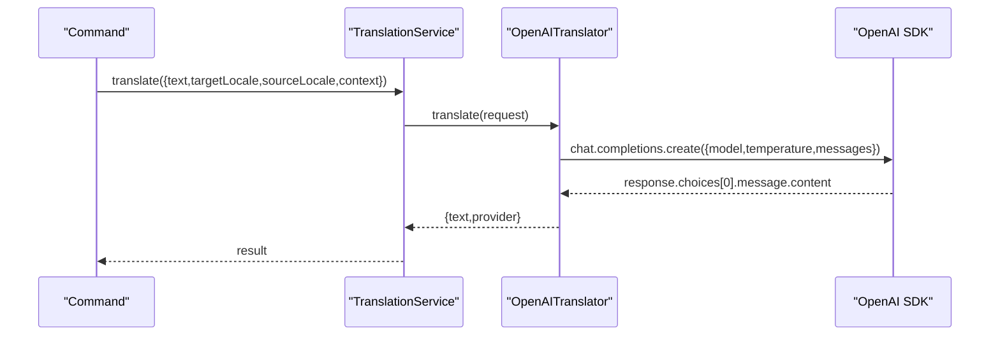
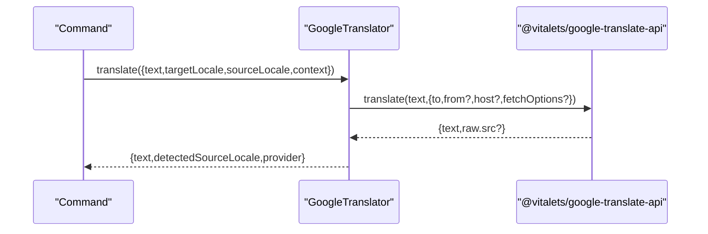
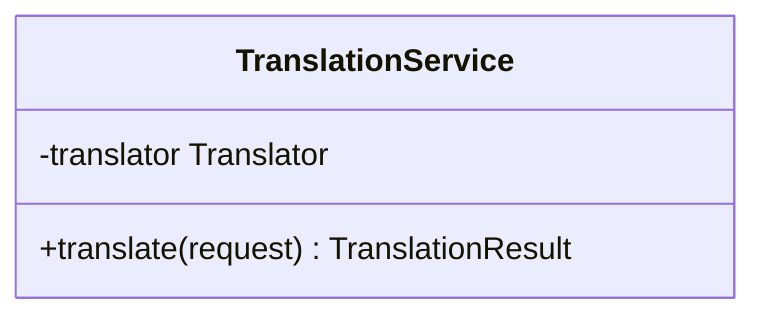
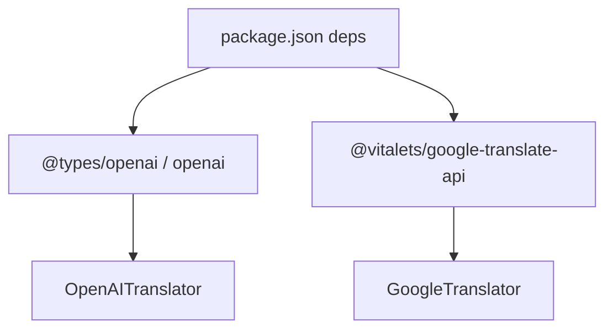

# AI Translation Integration

<cite>
**Referenced Files in This Document**
- [README.md](file://README.md)
- [package.json](file://package.json)
- [src/bin/cli.ts](file://src/bin/cli.ts)
- [src/providers/translator.ts](file://src/providers/translator.ts)
- [src/providers/openai.ts](file://src/providers/openai.ts)
- [src/providers/google.ts](file://src/providers/google.ts)
- [src/services/translation-service.ts](file://src/services/translation-service.ts)
- [src/commands/add-key.ts](file://src/commands/add-key.ts)
- [src/commands/validate.ts](file://src/commands/validate.ts)
- [unit-testing/providers/translator.test.ts](file://unit-testing/providers/translator.test.ts)
- [unit-testing/services/translation-service.test.ts](file://unit-testing/services/translation-service.test.ts)
</cite>

## Table of Contents
1. [Introduction](#introduction)
2. [Project Structure](#project-structure)
3. [Core Components](#core-components)
4. [Architecture Overview](#architecture-overview)
5. [Detailed Component Analysis](#detailed-component-analysis)
6. [Dependency Analysis](#dependency-analysis)
7. [Performance Considerations](#performance-considerations)
8. [Troubleshooting Guide](#troubleshooting-guide)
9. [Conclusion](#conclusion)

## Introduction
This document explains the AI translation integration in i18n-ai-cli, focusing on the translation provider architecture and how providers are selected, configured, and used. It covers the abstraction layer, provider implementations for OpenAI and Google Translate, provider selection logic, configuration requirements, fallback mechanisms, and practical guidance for production usage.

## Project Structure
The translation integration spans a small set of focused modules:
- CLI entrypoint wires provider selection and command execution
- A shared Translator interface defines the contract for all providers
- Provider implementations encapsulate external service integrations
- A thin TranslationService wraps a Translator for programmatic use
- Commands orchestrate translation during key management and validation

**Diagram sources**
- [src/bin/cli.ts:1-209](file://src/bin/cli.ts#L1-L209)
- [src/commands/add-key.ts:1-120](file://src/commands/add-key.ts#L1-L120)
- [src/commands/validate.ts:1-254](file://src/commands/validate.ts#L1-L254)
- [src/services/translation-service.ts:1-18](file://src/services/translation-service.ts#L1-L18)
- [src/providers/translator.ts:1-60](file://src/providers/translator.ts#L1-L60)
- [src/providers/openai.ts:1-60](file://src/providers/openai.ts#L1-L60)
- [src/providers/google.ts:1-50](file://src/providers/google.ts#L1-L50)

**Section sources**
- [src/bin/cli.ts:1-209](file://src/bin/cli.ts#L1-L209)
- [src/providers/translator.ts:1-60](file://src/providers/translator.ts#L1-L60)
- [src/providers/openai.ts:1-60](file://src/providers/openai.ts#L1-L60)
- [src/providers/google.ts:1-50](file://src/providers/google.ts#L1-L50)
- [src/services/translation-service.ts:1-18](file://src/services/translation-service.ts#L1-L18)
- [src/commands/add-key.ts:1-120](file://src/commands/add-key.ts#L1-L120)
- [src/commands/validate.ts:1-254](file://src/commands/validate.ts#L1-L254)

## Core Components
- Translator interface: Defines a uniform contract for translation providers, including a name and translate method that accepts a structured request and returns a standardized result.
- OpenAI provider: Implements Translator using the official OpenAI SDK, supporting explicit API key configuration, model selection, optional base URL override, and context-aware prompting.
- Google provider: Implements Translator using @vitalets/google-translate-api, supporting optional host and fetch options, and returning detected source locale when available.
- TranslationService: Thin wrapper around Translator exposing a single translate method for programmatic usage.
- CLI provider selection: Determines which Translator to instantiate based on explicit flags, environment variables, and defaults.

**Section sources**
- [src/providers/translator.ts:14-17](file://src/providers/translator.ts#L14-L17)
- [src/providers/openai.ts:9-28](file://src/providers/openai.ts#L9-L28)
- [src/providers/google.ts:9-15](file://src/providers/google.ts#L9-L15)
- [src/services/translation-service.ts:7-16](file://src/services/translation-service.ts#L7-L16)
- [src/bin/cli.ts:75-101](file://src/bin/cli.ts#L75-L101)
- [src/bin/cli.ts:104-140](file://src/bin/cli.ts#L104-L140)
- [src/bin/cli.ts:165-198](file://src/bin/cli.ts#L165-L198)

## Architecture Overview
The translation subsystem follows a clear separation of concerns:
- Abstraction: Translator interface decouples consumers from provider specifics.
- Implementation: OpenAI and Google providers implement Translator.
- Orchestration: CLI commands construct translators based on user intent and environment.
- Execution: Commands call TranslationService.translate (when used) or provider.translate directly.

**Diagram sources**
- [src/providers/translator.ts:14-17](file://src/providers/translator.ts#L14-L17)
- [src/providers/openai.ts:9-28](file://src/providers/openai.ts#L9-L28)
- [src/providers/google.ts:9-15](file://src/providers/google.ts#L9-L15)
- [src/services/translation-service.ts:7-16](file://src/services/translation-service.ts#L7-L16)

## Detailed Component Analysis

### Provider Selection Logic
Provider selection is centralized in the CLI entrypoint and applied consistently across commands that require translation:
- Explicit provider flag takes highest precedence
- If OPENAI_API_KEY is present, OpenAI is selected
- Otherwise, Google is used as the default

**Diagram sources**
- [src/bin/cli.ts:75-101](file://src/bin/cli.ts#L75-L101)
- [src/bin/cli.ts:104-140](file://src/bin/cli.ts#L104-L140)
- [src/bin/cli.ts:165-198](file://src/bin/cli.ts#L165-L198)

**Section sources**
- [src/bin/cli.ts:75-101](file://src/bin/cli.ts#L75-L101)
- [src/bin/cli.ts:104-140](file://src/bin/cli.ts#L104-L140)
- [src/bin/cli.ts:165-198](file://src/bin/cli.ts#L165-L198)

### OpenAI Provider
- Configuration
  - API key resolution order: constructor option overrides environment variable; otherwise throws if neither is available
  - Model selection: defaults to a specific model but can be overridden
  - Optional base URL override for alternate endpoints
- Translation behavior
  - Constructs a system prompt indicating translation task and output constraints
  - Optionally includes context in the user message
  - Returns provider name and translated text; gracefully handles empty content
- Error handling
  - Propagates underlying SDK errors to callers

**Diagram sources**
- [src/services/translation-service.ts:14-16](file://src/services/translation-service.ts#L14-L16)
- [src/providers/openai.ts:30-58](file://src/providers/openai.ts#L30-L58)

**Section sources**
- [src/providers/openai.ts:14-28](file://src/providers/openai.ts#L14-L28)
- [src/providers/openai.ts:30-58](file://src/providers/openai.ts#L30-L58)
- [unit-testing/providers/translator.test.ts:218-408](file://unit-testing/providers/translator.test.ts#L218-L408)

### Google Provider
- Configuration
  - Accepts optional from, host, and fetchOptions
  - Resolves source locale precedence: request.sourceLocale overrides constructor from
- Translation behavior
  - Delegates to @vitalets/google-translate-api
  - Returns detected source locale when available
- Error handling
  - Propagates underlying API errors

**Diagram sources**
- [src/providers/google.ts:17-48](file://src/providers/google.ts#L17-L48)

**Section sources**
- [src/providers/google.ts:13-48](file://src/providers/google.ts#L13-L48)
- [unit-testing/providers/translator.test.ts:29-184](file://unit-testing/providers/translator.test.ts#L29-L184)

### TranslationService Abstraction Layer
- Purpose: Provide a stable programmatic interface delegating to any Translator implementation
- Behavior: Mirrors the Translator.translate signature and returns the same result shape
- Usage: Enables swapping providers without changing higher-level code

**Diagram sources**
- [src/services/translation-service.ts:7-16](file://src/services/translation-service.ts#L7-L16)

**Section sources**
- [src/services/translation-service.ts:7-16](file://src/services/translation-service.ts#L7-L16)
- [unit-testing/services/translation-service.test.ts:11-184](file://unit-testing/services/translation-service.test.ts#L11-L184)

### Command Integration and Manual Provider Selection
- add:key: Supports --provider flag to force a specific provider; falls back to environment-driven selection if not provided
- update:key: Supports --provider and --sync; when syncing, constructs a translator similarly
- validate: Supports --provider to auto-translate missing keys during correction

Manual selection examples:
- Force Google: add:key ... --provider google
- Force OpenAI: add:key ... --provider openai
- Environment-driven: ensure OPENAI_API_KEY is set to use OpenAI automatically

**Section sources**
- [src/bin/cli.ts:75-101](file://src/bin/cli.ts#L75-L101)
- [src/bin/cli.ts:104-140](file://src/bin/cli.ts#L104-L140)
- [src/bin/cli.ts:165-198](file://src/bin/cli.ts#L165-L198)
- [README.md:268-305](file://README.md#L268-L305)

### Provider-Specific Features and Limitations
- OpenAI
  - Context-aware prompting improves accuracy for ambiguous terms
  - Model selection influences quality and latency
  - Requires API key; supports custom base URL
- Google Translate
  - Free tier usage via @vitalets/google-translate-api
  - Can auto-detect source language when not explicitly provided
  - Allows overriding host and fetch options

**Section sources**
- [src/providers/openai.ts:30-58](file://src/providers/openai.ts#L30-L58)
- [src/providers/google.ts:17-48](file://src/providers/google.ts#L17-L48)
- [README.md:268-305](file://README.md#L268-L305)

## Dependency Analysis
External dependencies relevant to translation:
- OpenAI SDK: Used by OpenAITranslator
- Google Translate API: Used by GoogleTranslator

**Diagram sources**
- [package.json:48-58](file://package.json#L48-L58)
- [src/providers/openai.ts:1](file://src/providers/openai.ts#L1)
- [src/providers/google.ts:1](file://src/providers/google.ts#L1)

**Section sources**
- [package.json:48-58](file://package.json#L48-L58)
- [src/providers/openai.ts:1](file://src/providers/openai.ts#L1)
- [src/providers/google.ts:1](file://src/providers/google.ts#L1)

## Performance Considerations
- Batch operations: Commands iterate locales sequentially; consider batching or concurrency controls if extending to many locales
- Prompt stability: OpenAI provider uses a fixed system prompt and low temperature to reduce variance
- Network latency: Provider choice affects latency; select appropriate models and providers per environment
- Dry runs: Use --dry-run to preview changes before applying

[No sources needed since this section provides general guidance]

## Troubleshooting Guide
Common issues and strategies:
- Missing OpenAI API key
  - Symptom: Instantiation error indicating API key requirement
  - Resolution: Provide apiKey option or set OPENAI_API_KEY environment variable
- Provider mismatch
  - Symptom: Unknown provider error when using --provider
  - Resolution: Use supported values (openai or google)
- Translation failures
  - Symptom: API errors propagated from provider
  - Resolution: Inspect network connectivity, credentials, and provider quotas; retry with smaller payloads
- Empty or unexpected translations
  - Symptom: Empty text returned
  - Resolution: Verify input text length and provider behavior; check response handling

**Section sources**
- [src/providers/openai.ts:17-21](file://src/providers/openai.ts#L17-L21)
- [src/bin/cli.ts:89-93](file://src/bin/cli.ts#L89-L93)
- [src/bin/cli.ts:126-130](file://src/bin/cli.ts#L126-L130)
- [src/bin/cli.ts:185-189](file://src/bin/cli.ts#L185-L189)
- [unit-testing/providers/translator.test.ts:346-351](file://unit-testing/providers/translator.test.ts#L346-L351)
- [unit-testing/providers/translator.test.ts:376-389](file://unit-testing/providers/translator.test.ts#L376-L389)

## Conclusion
i18n-ai-cli integrates AI translation through a clean, extensible abstraction layer. Provider selection is explicit and predictable, with sensible defaults and environment-driven behavior. OpenAI offers advanced context-aware translation, while Google Translate provides a free alternative. The TranslationService and Translator interface enable straightforward substitution and testing. For production, prefer explicit provider selection, monitor quotas and costs, and leverage dry runs and CI-friendly flags to maintain reliability.