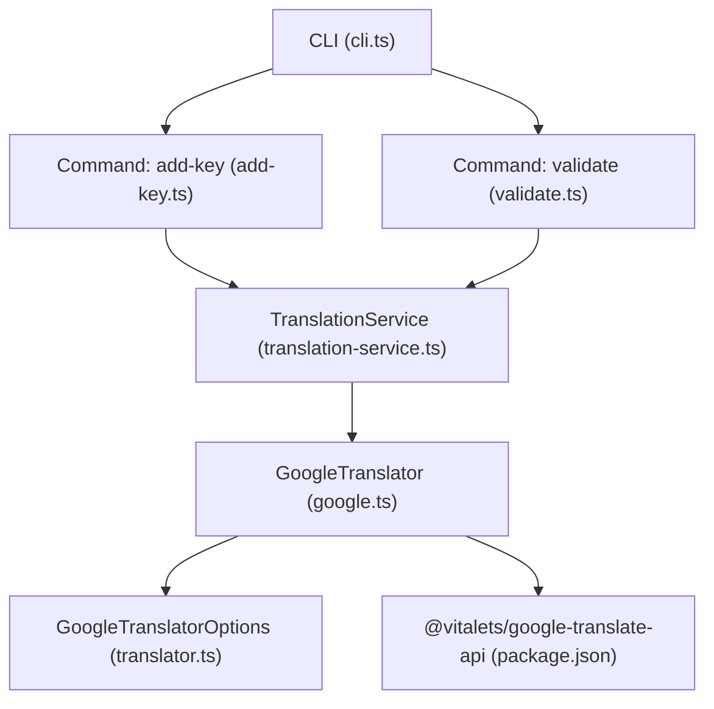
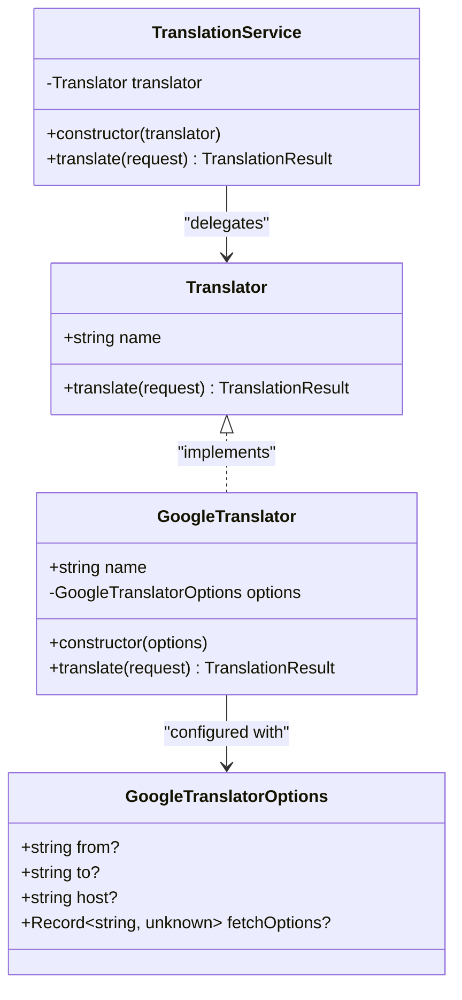
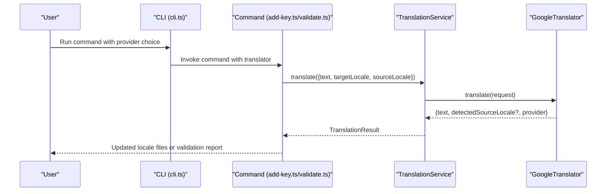
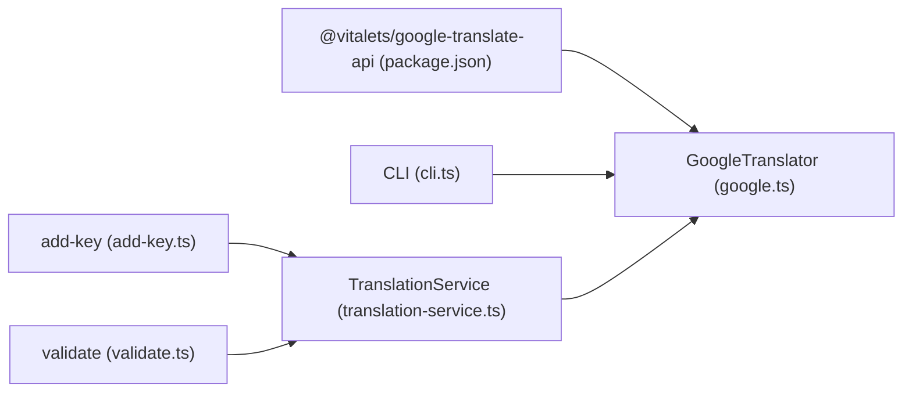

# Google Translate Provider Integration

<cite>
**Referenced Files in This Document**
- [google.ts](file://src/providers/google.ts)
- [translator.ts](file://src/providers/translator.ts)
- [translation-service.ts](file://src/services/translation-service.ts)
- [cli.ts](file://src/bin/cli.ts)
- [add-key.ts](file://src/commands/add-key.ts)
- [validate.ts](file://src/commands/validate.ts)
- [translator.test.ts](file://unit-testing/providers/translator.test.ts)
- [package.json](file://package.json)
- [README.md](file://README.md)
</cite>

## Table of Contents
1. [Introduction](#introduction)
2. [Project Structure](#project-structure)
3. [Core Components](#core-components)
4. [Architecture Overview](#architecture-overview)
5. [Detailed Component Analysis](#detailed-component-analysis)
6. [Dependency Analysis](#dependency-analysis)
7. [Performance Considerations](#performance-considerations)
8. [Troubleshooting Guide](#troubleshooting-guide)
9. [Conclusion](#conclusion)

## Introduction
This document explains how Google Translate is integrated as a translation provider in the i18n-ai-cli. It covers configuration options, workflow differences from OpenAI, language detection, context handling, and practical guidance for proxy settings, regional restrictions, and cost optimization. It also documents rate limiting, quotas, and error handling considerations specific to Google Translate.

## Project Structure
The Google Translate integration lives in the providers module and is wired through the CLI and commands. The key files are:
- Provider interface and options: [translator.ts](file://src/providers/translator.ts)
- Google provider implementation: [google.ts](file://src/providers/google.ts)
- Translation service wrapper: [translation-service.ts](file://src/services/translation-service.ts)
- CLI wiring and provider selection: [cli.ts](file://src/bin/cli.ts)
- Commands that use translation providers: [add-key.ts](file://src/commands/add-key.ts), [validate.ts](file://src/commands/validate.ts)
- Tests validating behavior: [translator.test.ts](file://unit-testing/providers/translator.test.ts)
- Dependencies: [package.json](file://package.json)

**Diagram sources**
- [cli.ts:14-100](file://src/bin/cli.ts#L14-L100)
- [add-key.ts:75-82](file://src/commands/add-key.ts#L75-L82)
- [validate.ts:102-119](file://src/commands/validate.ts#L102-L119)
- [translation-service.ts:14-16](file://src/services/translation-service.ts#L14-L16)
- [google.ts:9-49](file://src/providers/google.ts#L9-L49)
- [translator.ts:19-24](file://src/providers/translator.ts#L19-L24)
- [package.json:49](file://package.json#L49)

**Section sources**
- [cli.ts:14-100](file://src/bin/cli.ts#L14-L100)
- [translator.ts:1-60](file://src/providers/translator.ts#L1-L60)
- [google.ts:1-50](file://src/providers/google.ts#L1-L50)
- [translation-service.ts:1-18](file://src/services/translation-service.ts#L1-L18)
- [package.json:49](file://package.json#L49)

## Core Components
- GoogleTranslatorOptions: Controls default source language, host override, and fetch options passed to the underlying translation library.
- GoogleTranslator: Implements the Translator interface, translating text with optional source language override and returning detected source language when available.
- TranslationService: Thin wrapper delegating translation requests to the configured Translator.
- CLI provider selection: Chooses Google as the default provider when OpenAI is not configured.

Key configuration highlights:
- Host customization: The host option allows pointing to a specific Google Translate endpoint.
- Fetch options: Arbitrary fetch options can be forwarded to the underlying HTTP client.
- Source language precedence: Request-level sourceLocale overrides default from option.

**Section sources**
- [translator.ts:19-24](file://src/providers/translator.ts#L19-L24)
- [google.ts:17-48](file://src/providers/google.ts#L17-L48)
- [translation-service.ts:7-17](file://src/services/translation-service.ts#L7-L17)
- [cli.ts:85-98](file://src/bin/cli.ts#L85-L98)

## Architecture Overview
The Google Translate provider integrates via a pluggable Translator interface. Commands construct a translator (Google by default) and delegate translation work to it. The Google implementation wraps @vitalets/google-translate-api and exposes options for host and fetch customization.

**Diagram sources**
- [translator.ts:14-24](file://src/providers/translator.ts#L14-L24)
- [translator.ts:19-24](file://src/providers/translator.ts#L19-L24)
- [google.ts:9-15](file://src/providers/google.ts#L9-L15)
- [translation-service.ts:7-12](file://src/services/translation-service.ts#L7-L12)

## Detailed Component Analysis

### GoogleTranslatorOptions Configuration
- from: Default source language code used when request does not specify sourceLocale.
- host: Optional hostname override for the translation endpoint.
- fetchOptions: Arbitrary options passed to the underlying fetch-like client.

Behavior:
- If sourceLocale is provided in the translation request, it takes precedence over the default from option.
- host and fetchOptions are forwarded to the translation library call.

**Section sources**
- [translator.ts:19-24](file://src/providers/translator.ts#L19-L24)
- [google.ts:19-39](file://src/providers/google.ts#L19-L39)

### GoogleTranslator Implementation
Responsibilities:
- Build translation options from defaults and request.
- Call the underlying translation function with text, target locale, and optional source/host/fetch options.
- Return normalized result including detected source language when available.

Detected source language:
- The provider surfaces detectedSourceLocale from the raw response when present.

**Section sources**
- [google.ts:17-48](file://src/providers/google.ts#L17-L48)

### TranslationService Wrapper
- Delegates translation requests to the configured Translator.
- Keeps the system decoupled from specific providers.

**Section sources**
- [translation-service.ts:7-17](file://src/services/translation-service.ts#L7-L17)

### CLI Provider Selection and Workflow
- Default behavior: If OPENAI_API_KEY is not set, Google is used automatically.
- Explicit override: --provider flag selects Google or OpenAI.
- Commands: add:key and validate use the selected translator to populate or correct translations.

**Diagram sources**
- [cli.ts:85-98](file://src/bin/cli.ts#L85-L98)
- [add-key.ts:75-82](file://src/commands/add-key.ts#L75-L82)
- [validate.ts:102-119](file://src/commands/validate.ts#L102-L119)
- [translation-service.ts:14-16](file://src/services/translation-service.ts#L14-L16)
- [google.ts:17-48](file://src/providers/google.ts#L17-L48)

**Section sources**
- [cli.ts:85-98](file://src/bin/cli.ts#L85-L98)
- [add-key.ts:75-90](file://src/commands/add-key.ts#L75-L90)
- [validate.ts:102-119](file://src/commands/validate.ts#L102-L119)

### Language Detection and Context Handling
- Language detection: Detected source locale is returned when available from the underlying response.
- Context: The TranslationRequest supports a context field, but GoogleTranslator does not currently pass it to the underlying translation function. OpenAI implementation demonstrates context usage.

Implications:
- For context-sensitive translations, prefer OpenAI when domain specificity matters.
- Google can auto-detect source language when none is provided.

**Section sources**
- [google.ts:43-47](file://src/providers/google.ts#L43-L47)
- [translator.ts:1-6](file://src/providers/translator.ts#L1-L6)
- [openai.ts:30-58](file://src/providers/openai.ts#L30-L58)

### Workflow Differences from OpenAI
- Provider selection: Google is automatic fallback; OpenAI requires API key or explicit provider flag.
- Context: OpenAI supports contextual prompting; Google does not forward context to the translation call.
- Quality: OpenAI often produces more nuanced translations; Google is fast and free.
- Cost: Google is free; OpenAI is paid.

**Section sources**
- [README.md:268-304](file://README.md#L268-L304)
- [openai.ts:30-58](file://src/providers/openai.ts#L30-L58)
- [google.ts:17-48](file://src/providers/google.ts#L17-L48)

### Proxy Settings and Regional Restrictions
- Host customization: Use the host option to route traffic through a proxy or alternate endpoint.
- Fetch options: Use fetchOptions to set headers or other client-specific settings compatible with the underlying library.

Note: The exact behavior depends on the underlying @vitalets/google-translate-api library. Ensure your proxy or host configuration aligns with the library’s expectations.

**Section sources**
- [translator.ts:23](file://src/providers/translator.ts#L23)
- [google.ts:27-33](file://src/providers/google.ts#L27-L33)

### Cost-Effectiveness and Rate Limiting
- Google Translate is free, making it ideal for prototyping, low-volume tasks, and cost-conscious workflows.
- Rate limits and quotas are governed by the external service and may vary by region and usage patterns. Monitor for throttling and consider staggering requests if needed.

**Section sources**
- [README.md:272-276](file://README.md#L272-L276)

### Error Handling
- API-level errors propagate up from the translation call. Commands catch and log warnings, falling back to empty values when translation fails.
- Tests demonstrate error propagation and graceful handling when raw metadata is absent.

**Section sources**
- [add-key.ts:82-89](file://src/commands/add-key.ts#L82-L89)
- [translator.test.ts:156-166](file://unit-testing/providers/translator.test.ts#L156-L166)
- [google.ts:43-47](file://src/providers/google.ts#L43-L47)

## Dependency Analysis
- GoogleTranslator depends on @vitalets/google-translate-api for HTTP translation requests.
- CLI constructs GoogleTranslator when OpenAI is unavailable.
- Commands depend on TranslationService, which depends on the Translator interface.

**Diagram sources**
- [package.json:49](file://package.json#L49)
- [google.ts:1](file://src/providers/google.ts#L1)
- [cli.ts:85-98](file://src/bin/cli.ts#L85-L98)
- [add-key.ts:75-82](file://src/commands/add-key.ts#L75-L82)
- [validate.ts:102-119](file://src/commands/validate.ts#L102-L119)
- [translation-service.ts:14-16](file://src/services/translation-service.ts#L14-L16)

**Section sources**
- [package.json:49](file://package.json#L49)
- [google.ts:1](file://src/providers/google.ts#L1)
- [cli.ts:85-98](file://src/bin/cli.ts#L85-L98)

## Performance Considerations
- Prefer Google for bulk, low-cost tasks where speed and availability are priorities.
- For nuanced translations, consider OpenAI when budget permits.
- Batch operations: The CLI performs per-locale translations; consider staggering or retry logic if encountering transient failures.

## Troubleshooting Guide
Common scenarios and resolutions:
- Missing detected source language: Occurs when the underlying response lacks raw metadata. The provider handles this gracefully.
- Translation failures: Commands log warnings and leave keys empty; inspect network connectivity and proxy settings.
- Context not applied: Google does not use context; switch to OpenAI for context-aware translations.

**Section sources**
- [translator.test.ts:168-183](file://unit-testing/providers/translator.test.ts#L168-L183)
- [add-key.ts:82-89](file://src/commands/add-key.ts#L82-L89)
- [openai.ts:39-41](file://src/providers/openai.ts#L39-L41)

## Conclusion
Google Translate provides a free, easy-to-use translation backend suitable for many i18n workflows. Configure host and fetch options for proxying or regional needs, rely on automatic source detection, and prefer OpenAI when context and quality are paramount. The CLI seamlessly falls back to Google when OpenAI is not configured, enabling cost-effective automation.