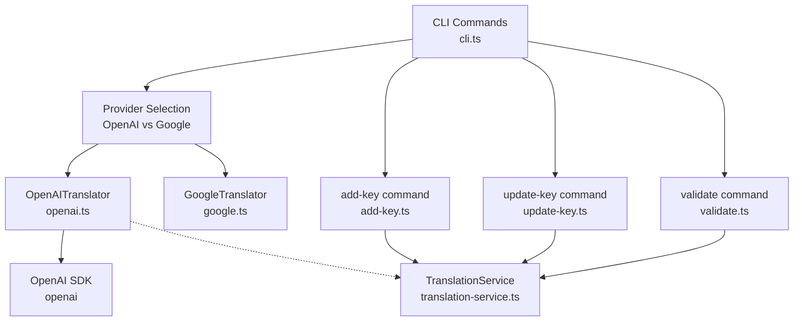
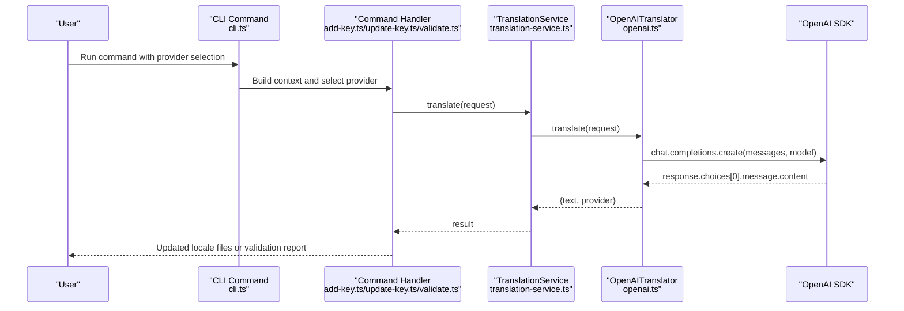
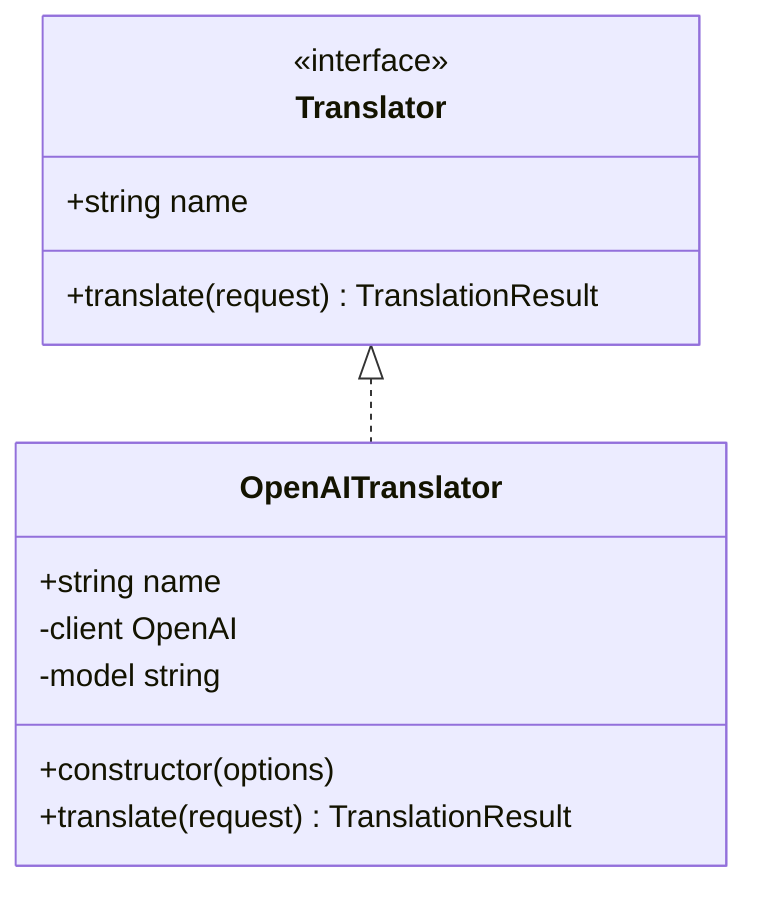
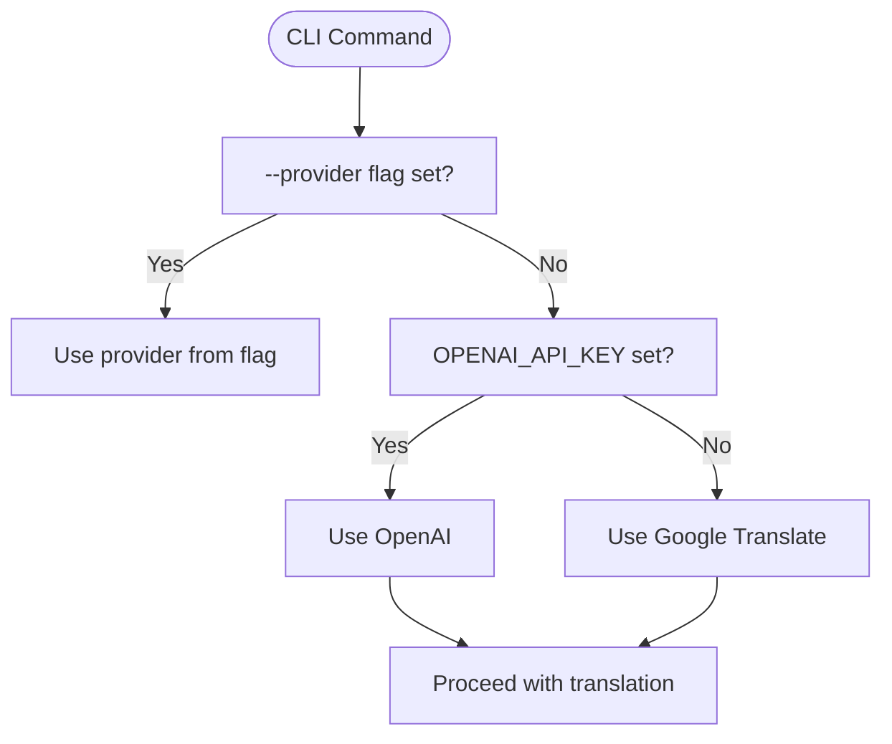
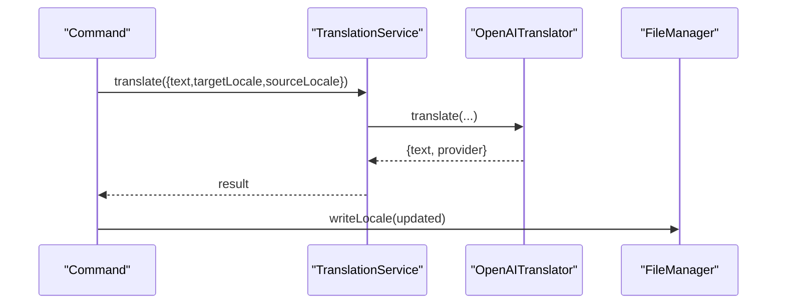
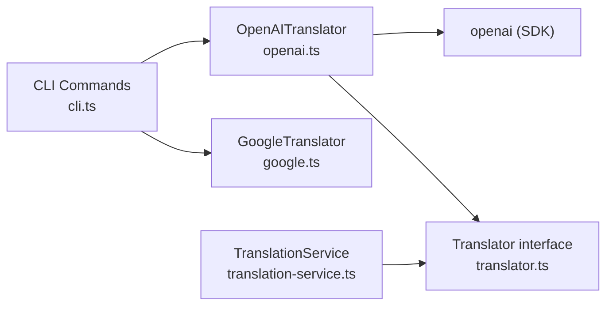

# OpenAI Provider Integration

<cite>
**Referenced Files in This Document**
- [openai.ts](file://src/providers/openai.ts)
- [translator.ts](file://src/providers/translator.ts)
- [cli.ts](file://src/bin/cli.ts)
- [translation-service.ts](file://src/services/translation-service.ts)
- [add-key.ts](file://src/commands/add-key.ts)
- [update-key.ts](file://src/commands/update-key.ts)
- [validate.ts](file://src/commands/validate.ts)
- [config-loader.ts](file://src/config/config-loader.ts)
- [types.ts](file://src/config/types.ts)
- [README.md](file://README.md)
- [SECURITY.md](file://SECURITY.md)
- [package.json](file://package.json)
- [translator.test.ts](file://unit-testing/providers/translator.test.ts)
</cite>

## Table of Contents
1. [Introduction](#introduction)
2. [Project Structure](#project-structure)
3. [Core Components](#core-components)
4. [Architecture Overview](#architecture-overview)
5. [Detailed Component Analysis](#detailed-component-analysis)
6. [Dependency Analysis](#dependency-analysis)
7. [Performance Considerations](#performance-considerations)
8. [Troubleshooting Guide](#troubleshooting-guide)
9. [Conclusion](#conclusion)
10. [Appendices](#appendices)

## Introduction
This document explains the OpenAI provider integration in i18n-ai-cli, focusing on configuration, translation workflow, cost considerations, and operational best practices. It covers how the OpenAI translator is configured and used across CLI commands, how context is preserved during translation, and how to manage API keys securely. It also outlines strategies for cost optimization, token usage awareness, and robust fallback handling.

## Project Structure
The OpenAI integration is implemented as a pluggable translator that adheres to a shared interface. The CLI selects the provider based on explicit flags or environment variables, and commands orchestrate translation requests.

**Diagram sources**
- [cli.ts:70-102](file://src/bin/cli.ts#L70-L102)
- [openai.ts:9-28](file://src/providers/openai.ts#L9-L28)
- [translation-service.ts:7-17](file://src/services/translation-service.ts#L7-L17)
- [add-key.ts:67-90](file://src/commands/add-key.ts#L67-L90)
- [update-key.ts:116-139](file://src/commands/update-key.ts#L116-L139)
- [validate.ts:202-218](file://src/commands/validate.ts#L202-L218)

**Section sources**
- [cli.ts:70-102](file://src/bin/cli.ts#L70-L102)
- [openai.ts:9-28](file://src/providers/openai.ts#L9-L28)
- [translation-service.ts:7-17](file://src/services/translation-service.ts#L7-L17)

## Core Components
- OpenAITranslator: Implements the Translator interface for OpenAI GPT models. It supports API key configuration, model selection, and optional base URL override. It constructs system and user messages to preserve context and returns provider metadata.
- Translator interface: Defines the contract for translation providers, including the translate method and shared types.
- TranslationService: Thin wrapper around Translator that exposes a uniform translate method for consumers.
- CLI provider selection: Chooses OpenAI when an explicit provider flag is used or when the OPENAI_API_KEY environment variable is present; otherwise falls back to Google Translate.

Key configuration options:
- apiKey: Provided via constructor option or OPENAI_API_KEY environment variable.
- model: Defaults to a GPT-3.5 model; commonly used models include gpt-4o, gpt-4o-mini, and gpt-3.5-turbo.
- baseUrl: Optional override for OpenAI-compatible endpoints.

**Section sources**
- [translator.ts:26-30](file://src/providers/translator.ts#L26-L30)
- [openai.ts:14-28](file://src/providers/openai.ts#L14-L28)
- [cli.ts:82-98](file://src/bin/cli.ts#L82-L98)

## Architecture Overview
The translation workflow integrates CLI commands with the selected provider. Commands prepare translation requests and delegate to the provider, which interacts with the OpenAI SDK to produce translated text.

**Diagram sources**
- [cli.ts:70-102](file://src/bin/cli.ts#L70-L102)
- [add-key.ts:75-90](file://src/commands/add-key.ts#L75-L90)
- [update-key.ts:120-127](file://src/commands/update-key.ts#L120-L127)
- [validate.ts:210-217](file://src/commands/validate.ts#L210-L217)
- [translation-service.ts:14-16](file://src/services/translation-service.ts#L14-L16)
- [openai.ts:30-58](file://src/providers/openai.ts#L30-L58)

## Detailed Component Analysis

### OpenAITranslator Implementation
- Constructor handles API key resolution precedence (constructor option over environment variable), sets the model, and initializes the OpenAI client with optional base URL.
- translate builds a concise system message that includes source and target locales and instructs the model to return only translated text. It optionally prepends context to the user message.
- Returns a standardized TranslationResult with provider metadata.

**Diagram sources**
- [translator.ts:14-17](file://src/providers/translator.ts#L14-L17)
- [openai.ts:9-28](file://src/providers/openai.ts#L9-L28)

**Section sources**
- [openai.ts:14-28](file://src/providers/openai.ts#L14-L28)
- [openai.ts:30-58](file://src/providers/openai.ts#L30-L58)

### Provider Selection and CLI Integration
- The CLI determines the provider based on explicit flags or environment variables, ensuring predictable behavior across commands.
- Commands that require translation (add-key, update-key, validate) pass a Translator instance to the translation service.

**Diagram sources**
- [cli.ts:82-98](file://src/bin/cli.ts#L82-L98)
- [cli.ts:118-136](file://src/bin/cli.ts#L118-L136)
- [cli.ts:178-194](file://src/bin/cli.ts#L178-L194)

**Section sources**
- [cli.ts:82-98](file://src/bin/cli.ts#L82-L98)
- [cli.ts:118-136](file://src/bin/cli.ts#L118-L136)
- [cli.ts:178-194](file://src/bin/cli.ts#L178-L194)

### Translation Workflow in Commands
- add-key: Translates default locale value into all non-default locales using the selected provider. It handles failures gracefully by logging warnings and leaving placeholders.
- update-key: Optionally syncs a key’s updated value to all other locales via translation, with similar error handling.
- validate: Auto-translates missing or mismatched keys into target locales and writes corrected files.

**Diagram sources**
- [add-key.ts:75-90](file://src/commands/add-key.ts#L75-L90)
- [update-key.ts:120-127](file://src/commands/update-key.ts#L120-L127)
- [validate.ts:210-217](file://src/commands/validate.ts#L210-L217)
- [translation-service.ts:14-16](file://src/services/translation-service.ts#L14-L16)

**Section sources**
- [add-key.ts:75-90](file://src/commands/add-key.ts#L75-L90)
- [update-key.ts:120-127](file://src/commands/update-key.ts#L120-L127)
- [validate.ts:210-217](file://src/commands/validate.ts#L210-L217)

### Configuration and Context Preservation
- Configuration is validated and loaded from a JSON file with zod schema enforcement. While not directly part of OpenAI configuration, it influences how translation results are applied (e.g., key style).
- Context passed in translation requests is embedded into the user message to improve accuracy for domain-specific terms.

**Section sources**
- [config-loader.ts:24-67](file://src/config/config-loader.ts#L24-L67)
- [types.ts:3-11](file://src/config/types.ts#L3-L11)
- [openai.ts:39-41](file://src/providers/openai.ts#L39-L41)

## Dependency Analysis
- OpenAITranslator depends on the OpenAI SDK and the Translator interface.
- CLI commands depend on TranslationService and the Translator implementations.
- The project’s package.json declares the OpenAI SDK as a dependency.

**Diagram sources**
- [openai.ts:1-7](file://src/providers/openai.ts#L1-L7)
- [translator.ts:14-17](file://src/providers/translator.ts#L14-L17)
- [cli.ts:14-16](file://src/bin/cli.ts#L14-L16)
- [translation-service.ts:1-5](file://src/services/translation-service.ts#L1-L5)
- [package.json:57](file://package.json#L57)

**Section sources**
- [package.json:57](file://package.json#L57)
- [openai.ts:1-7](file://src/providers/openai.ts#L1-L7)
- [translator.ts:14-17](file://src/providers/translator.ts#L14-L17)

## Performance Considerations
- Model selection: The default model is suitable for most tasks. For cost-sensitive scenarios, consider lighter models; for highest quality, choose stronger models. The CLI README documents model options.
- Batch processing: The current implementation translates keys sequentially per locale. For large-scale operations, consider batching at the caller level (outside the CLI) or using the programmatic API to parallelize requests with controlled concurrency.
- Token usage: The OpenAI SDK manages token accounting internally. Monitor costs by reviewing provider billing dashboards and consider setting budget alerts. There is no built-in token counter in the CLI; track usage externally.
- Rate limits: The OpenAI SDK handles retries and rate-limiting behavior according to upstream policies. Implement local backoff and retry strategies if invoking the SDK programmatically at scale.

[No sources needed since this section provides general guidance]

## Troubleshooting Guide
Common issues and resolutions:
- Missing API key: The translator throws an error if neither the constructor option nor the environment variable is set. Ensure OPENAI_API_KEY is exported or passed explicitly.
- Empty response content: The translator safely returns an empty string if the response lacks content.
- API errors: Translation failures surface as thrown errors; commands log warnings and either keep existing values or leave placeholders depending on the command.
- Provider selection confusion: Verify the --provider flag and OPENAI_API_KEY environment variable to ensure the intended provider is used.

**Section sources**
- [openai.ts:17-21](file://src/providers/openai.ts#L17-L21)
- [openai.ts:52-57](file://src/providers/openai.ts#L52-L57)
- [translator.test.ts:353-363](file://unit-testing/providers/translator.test.ts#L353-L363)
- [add-key.ts:82-89](file://src/commands/add-key.ts#L82-L89)
- [update-key.ts:127-137](file://src/commands/update-key.ts#L127-L137)

## Conclusion
The OpenAI provider integration in i18n-ai-cli offers a straightforward, configurable translation pathway with strong context preservation and robust fallback behavior. By selecting the appropriate model, managing API keys securely, and applying the recommended operational practices, teams can achieve reliable, cost-conscious internationalization workflows.

[No sources needed since this section summarizes without analyzing specific files]

## Appendices

### OpenAITranslatorOptions Reference
- apiKey: Optional. Overrides OPENAI_API_KEY if provided.
- model: Optional. Defaults to a GPT-3.5 model; commonly used values include gpt-4o, gpt-4o-mini, and gpt-3.5-turbo.
- baseUrl: Optional. Allows routing through compatible endpoints.

**Section sources**
- [translator.ts:26-30](file://src/providers/translator.ts#L26-L30)
- [openai.ts:23-27](file://src/providers/openai.ts#L23-L27)
- [README.md:296](file://README.md#L296)

### Security and Production Best Practices
- Store API keys in environment variables or .env files and exclude them from version control.
- Rotate keys periodically and restrict file permissions on configuration and translation files.
- Use CI/CD secrets to inject OPENAI_API_KEY during automated runs.

**Section sources**
- [SECURITY.md:51-68](file://SECURITY.md#L51-L68)
- [SECURITY.md:70-75](file://SECURITY.md#L70-L75)
- [SECURITY.md:88-93](file://SECURITY.md#L88-L93)

### Cost Optimization Strategies
- Choose models aligned with quality and cost targets (see README model notes).
- Minimize unnecessary translation calls by leveraging dry-run modes and selective provider usage.
- Monitor provider billing and set budget alerts.

**Section sources**
- [README.md:272-276](file://README.md#L272-L276)
- [README.md:296](file://README.md#L296)

### Customizing Translation Prompts and Context
- Context preservation: Include contextual information in the translation request to guide accurate translations for domain-specific terminology.
- System message: The translator constructs a concise system instruction that specifies source/target locales and output formatting.

**Section sources**
- [openai.ts:37-41](file://src/providers/openai.ts#L37-L41)
- [openai.ts:46-49](file://src/providers/openai.ts#L46-L49)

### Handling Rate Limits and Fallback Mechanisms
- Provider fallback: When OPENAI_API_KEY is not set, the CLI automatically uses Google Translate.
- Error handling: Commands catch translation errors, log warnings, and continue with conservative defaults.

**Section sources**
- [cli.ts:94-98](file://src/bin/cli.ts#L94-L98)
- [cli.ts:131-135](file://src/bin/cli.ts#L131-L135)
- [cli.ts:190-194](file://src/bin/cli.ts#L190-L194)
- [add-key.ts:82-89](file://src/commands/add-key.ts#L82-L89)
- [update-key.ts:127-137](file://src/commands/update-key.ts#L127-L137)

### Namespace Handling and Key Styles
- Key style: The configuration supports nested or flat key styles. Commands apply keys accordingly when writing locale files.
- Namespaces: Hierarchical keys (e.g., auth.login.title) are supported and written based on the configured key style.

**Section sources**
- [types.ts:1-11](file://src/config/types.ts#L1-L11)
- [add-key.ts:98-101](file://src/commands/add-key.ts#L98-L101)
- [validate.ts:230-233](file://src/commands/validate.ts#L230-L233)