# Provider Architecture and Abstraction

<cite>
**Referenced Files in This Document**
- [translator.ts](file://src/providers/translator.ts)
- [translation-service.ts](file://src/services/translation-service.ts)
- [google.ts](file://src/providers/google.ts)
- [openai.ts](file://src/providers/openai.ts)
- [deepl.ts](file://src/providers/deepl.ts)
- [cli.ts](file://src/bin/cli.ts)
- [add-key.ts](file://src/commands/add-key.ts)
- [validate.ts](file://src/commands/validate.ts)
- [translator.test.ts](file://unit-testing/providers/translator.test.ts)
- [translation-service.test.ts](file://unit-testing/services/translation-service.test.ts)
- [README.md](file://README.md)
</cite>

## Table of Contents
1. [Introduction](#introduction)
2. [Project Structure](#project-structure)
3. [Core Components](#core-components)
4. [Architecture Overview](#architecture-overview)
5. [Detailed Component Analysis](#detailed-component-analysis)
6. [Dependency Analysis](#dependency-analysis)
7. [Performance Considerations](#performance-considerations)
8. [Troubleshooting Guide](#troubleshooting-guide)
9. [Conclusion](#conclusion)

## Introduction
This document explains the AI translation provider architecture in i18n-ai-cli. It focuses on how the Translator interface abstracts different AI providers behind a unified contract, how the AIProvider interface enables key suggestion functionality, and how TranslationRequest and TranslationResult models carry optional context and detected source locale information. It also documents provider selection logic, the role of TranslationService in orchestrating providers, and practical guidance for implementing custom providers, lifecycle management, error handling, and performance considerations.

## Project Structure
The provider abstraction lives under src/providers, with concrete implementations for Google Translate and OpenAI, and a placeholder for DeepL. The TranslationService wraps a Translator to expose a simple translate method. Provider selection logic is centralized in the CLI entry point and reused by commands that require translation.

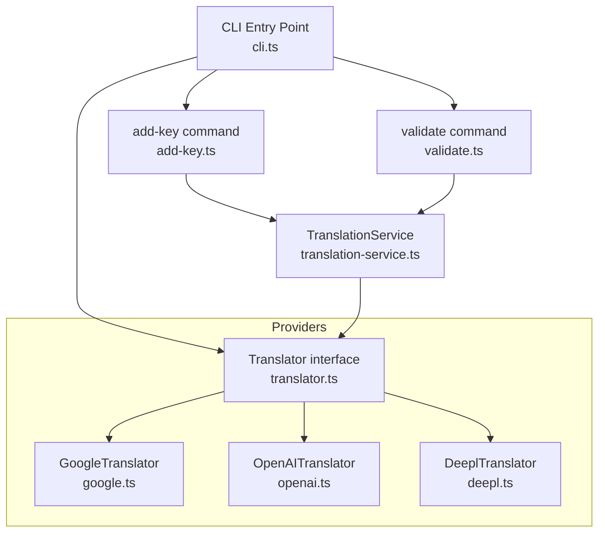

**Diagram sources**
- [translator.ts:14-17](file://src/providers/translator.ts#L14-L17)
- [google.ts:9-15](file://src/providers/google.ts#L9-L15)
- [openai.ts:9-28](file://src/providers/openai.ts#L9-L28)
- [deepl.ts:12-18](file://src/providers/deepl.ts#L12-L18)
- [translation-service.ts:7-17](file://src/services/translation-service.ts#L7-L17)
- [cli.ts:80-101](file://src/bin/cli.ts#L80-L101)
- [add-key.ts:76-80](file://src/commands/add-key.ts#L76-L80)
- [validate.ts:112-118](file://src/commands/validate.ts#L112-L118)

**Section sources**
- [translator.ts:1-60](file://src/providers/translator.ts#L1-L60)
- [translation-service.ts:1-18](file://src/services/translation-service.ts#L1-L18)
- [google.ts:1-50](file://src/providers/google.ts#L1-L50)
- [openai.ts:1-60](file://src/providers/openai.ts#L1-L60)
- [deepl.ts:1-26](file://src/providers/deepl.ts#L1-L26)
- [cli.ts:1-209](file://src/bin/cli.ts#L1-L209)
- [add-key.ts:1-120](file://src/commands/add-key.ts#L1-L120)
- [validate.ts:1-254](file://src/commands/validate.ts#L1-L254)

## Core Components
- Translator interface: Defines a provider-agnostic contract with a name and translate method that accepts a TranslationRequest and returns a TranslationResult.
- TranslationRequest: Carries text, targetLocale, optional sourceLocale, and optional context.
- TranslationResult: Carries translated text, optional detectedSourceLocale, and provider identity.
- TranslationService: Thin wrapper around Translator that exposes translate(request) and delegates to the injected provider.
- AIProvider: A separate interface for higher-level suggestions (e.g., key naming) used in validation scenarios.

These components form a cohesive abstraction layer that lets commands remain provider-agnostic while enabling pluggable AI providers.

**Section sources**
- [translator.ts:14-17](file://src/providers/translator.ts#L14-L17)
- [translator.ts:1-12](file://src/providers/translator.ts#L1-L12)
- [translator.ts:32-44](file://src/providers/translator.ts#L32-L44)
- [translation-service.ts:7-17](file://src/services/translation-service.ts#L7-L17)

## Architecture Overview
The system separates concerns:
- CLI determines which provider to use based on flags and environment.
- Commands receive a Translator instance and call TranslationService.translate.
- Providers implement Translator and encapsulate external SDKs or APIs.
- Optional AIProvider is used for key suggestion during validation.

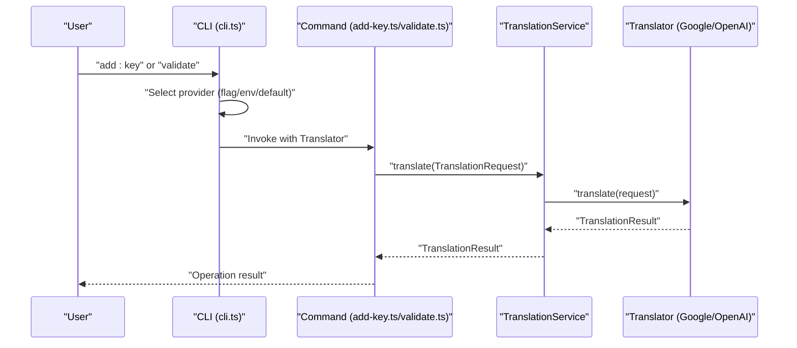

**Diagram sources**
- [cli.ts:80-101](file://src/bin/cli.ts#L80-L101)
- [add-key.ts:76-80](file://src/commands/add-key.ts#L76-L80)
- [validate.ts:112-118](file://src/commands/validate.ts#L112-L118)
- [translation-service.ts:14-16](file://src/services/translation-service.ts#L14-L16)
- [translator.ts:14-17](file://src/providers/translator.ts#L14-L17)

## Detailed Component Analysis

### Translator Interface and Data Models
- Translator: Provides a uniform translate method and a name identifier. Implementations encapsulate provider-specific logic.
- TranslationRequest: Supports optional sourceLocale and context to improve translation quality.
- TranslationResult: Returns translated text and optionally detectedSourceLocale and provider name.

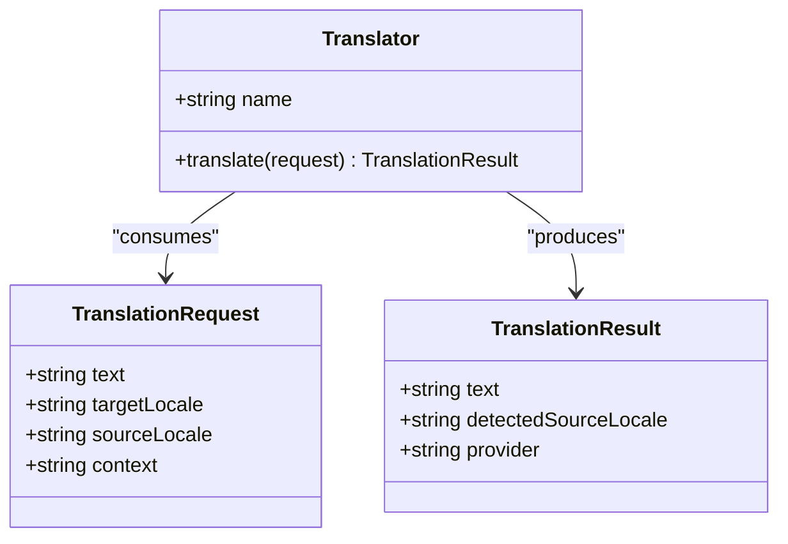

**Diagram sources**
- [translator.ts:14-17](file://src/providers/translator.ts#L14-L17)
- [translator.ts:1-12](file://src/providers/translator.ts#L1-L12)

**Section sources**
- [translator.ts:14-17](file://src/providers/translator.ts#L14-L17)
- [translator.ts:1-12](file://src/providers/translator.ts#L1-L12)

### TranslationService Orchestration
- TranslationService holds a Translator and forwards translate requests to it.
- It preserves all request fields and propagates provider results, including detectedSourceLocale and provider identity.

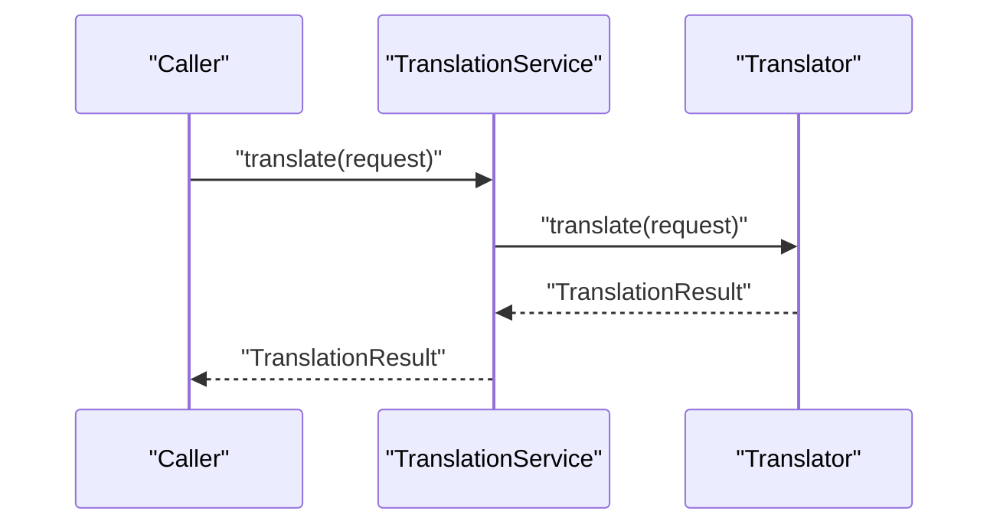

**Diagram sources**
- [translation-service.ts:7-17](file://src/services/translation-service.ts#L7-L17)
- [translator.ts:14-17](file://src/providers/translator.ts#L14-L17)

**Section sources**
- [translation-service.ts:7-17](file://src/services/translation-service.ts#L7-L17)
- [translation-service.test.ts:20-40](file://unit-testing/services/translation-service.test.ts#L20-L40)

### Provider Implementations

#### GoogleTranslator
- Implements Translator and integrates with @vitalets/google-translate-api.
- Honors optional sourceLocale and context via request; falls back to default options when unspecified.
- Returns detectedSourceLocale when available.

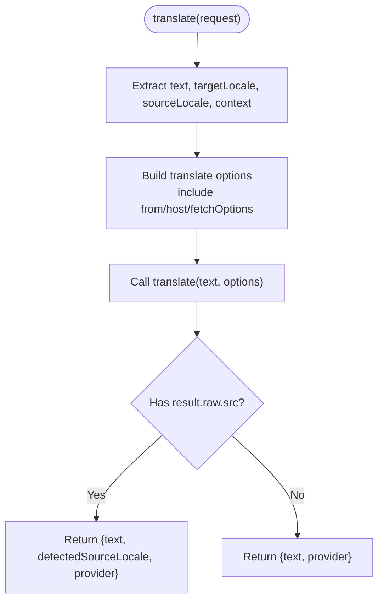

**Diagram sources**
- [google.ts:17-48](file://src/providers/google.ts#L17-L48)
- [translator.ts:1-12](file://src/providers/translator.ts#L1-L12)

**Section sources**
- [google.ts:9-49](file://src/providers/google.ts#L9-L49)
- [translator.test.ts:39-85](file://unit-testing/providers/translator.test.ts#L39-L85)

#### OpenAITranslator
- Implements Translator and uses OpenAI chat completions.
- Builds a system prompt that includes optional sourceLocale and constructs a user message that may include context.
- Resolves API key from options or environment, preferring options.

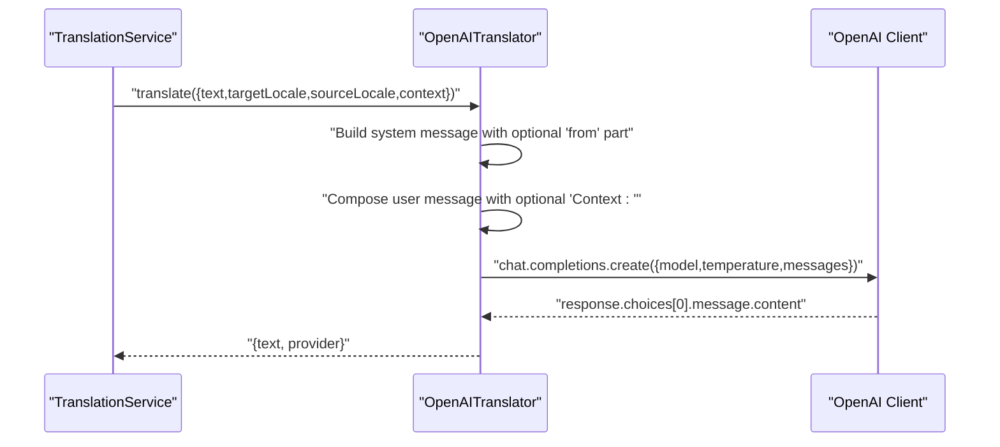

**Diagram sources**
- [openai.ts:30-58](file://src/providers/openai.ts#L30-L58)
- [translator.ts:1-12](file://src/providers/translator.ts#L1-L12)

**Section sources**
- [openai.ts:9-59](file://src/providers/openai.ts#L9-L59)
- [translator.test.ts:248-300](file://unit-testing/providers/translator.test.ts#L248-L300)

#### DeeplTranslator
- Implements Translator but throws a not-implemented error; intended as a placeholder for future integration.
- Accepts options in constructor for future expansion.

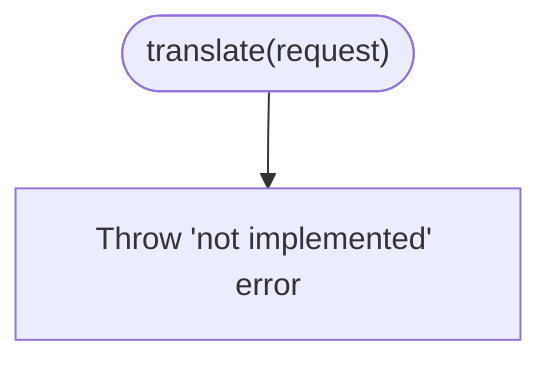

**Diagram sources**
- [deepl.ts:20-24](file://src/providers/deepl.ts#L20-L24)

**Section sources**
- [deepl.ts:12-25](file://src/providers/deepl.ts#L12-L25)
- [translator.test.ts:192-202](file://unit-testing/providers/translator.test.ts#L192-L202)

### AIProvider Interface for Suggestions
- AIProvider defines translate and suggestKey methods for higher-level suggestions (e.g., generating key names).
- Validation logic uses AIProvider to suggest keys when needed.

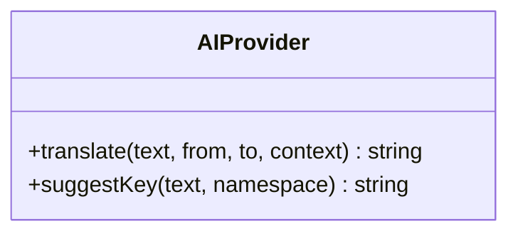

**Diagram sources**
- [translator.ts:32-44](file://src/providers/translator.ts#L32-L44)

**Section sources**
- [translator.ts:32-44](file://src/providers/translator.ts#L32-L44)
- [validate.ts:102-119](file://src/commands/validate.ts#L102-L119)

### Provider Selection Logic
Provider selection is centralized in the CLI and applied consistently across commands:
- Explicit --provider flag takes highest priority.
- If OPENAI_API_KEY is present, OpenAI is chosen.
- Otherwise, Google is used as the fallback.

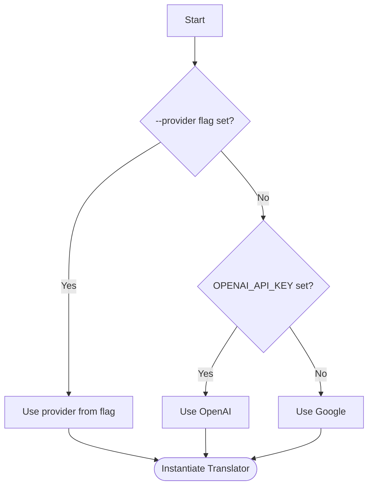

**Diagram sources**
- [cli.ts:80-98](file://src/bin/cli.ts#L80-L98)
- [cli.ts:116-136](file://src/bin/cli.ts#L116-L136)
- [cli.ts:176-194](file://src/bin/cli.ts#L176-L194)

**Section sources**
- [cli.ts:80-98](file://src/bin/cli.ts#L80-L98)
- [cli.ts:116-136](file://src/bin/cli.ts#L116-L136)
- [cli.ts:176-194](file://src/bin/cli.ts#L176-L194)
- [README.md:277-282](file://README.md#L277-L282)

### Command Integration and Error Handling
- add-key translates values for non-default locales and logs warnings on failure while continuing.
- validate uses TranslationService.translate to fill missing or mismatched keys when a Translator is provided; otherwise, it fills with empty strings.

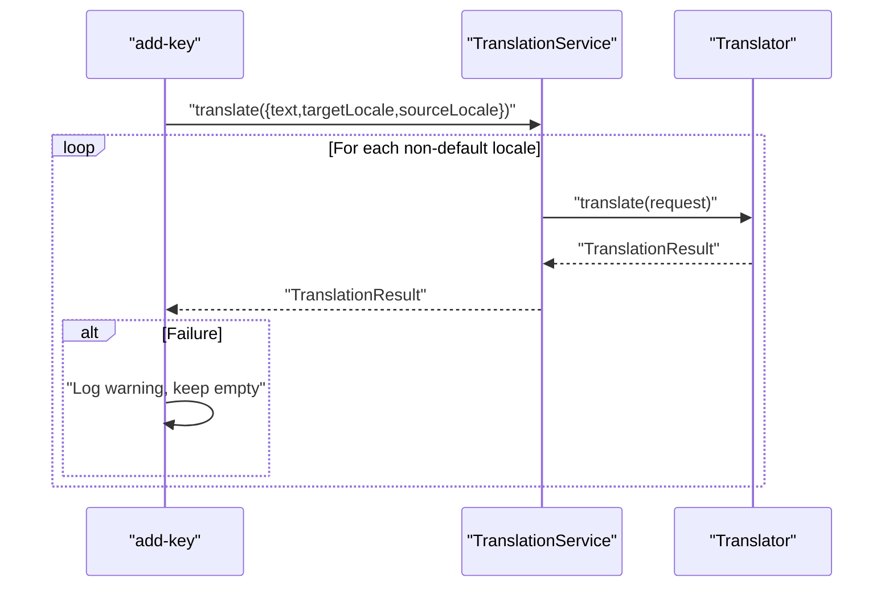

**Diagram sources**
- [add-key.ts:76-90](file://src/commands/add-key.ts#L76-L90)
- [translation-service.ts:14-16](file://src/services/translation-service.ts#L14-L16)
- [translator.ts:14-17](file://src/providers/translator.ts#L14-L17)

**Section sources**
- [add-key.ts:76-90](file://src/commands/add-key.ts#L76-L90)
- [validate.ts:202-223](file://src/commands/validate.ts#L202-L223)

## Dependency Analysis
- Commands depend on TranslationService and receive a Translator instance from the CLI.
- Providers depend on external SDKs (Google Translate API and OpenAI SDK).
- TranslationService depends only on the Translator interface, preserving loose coupling.

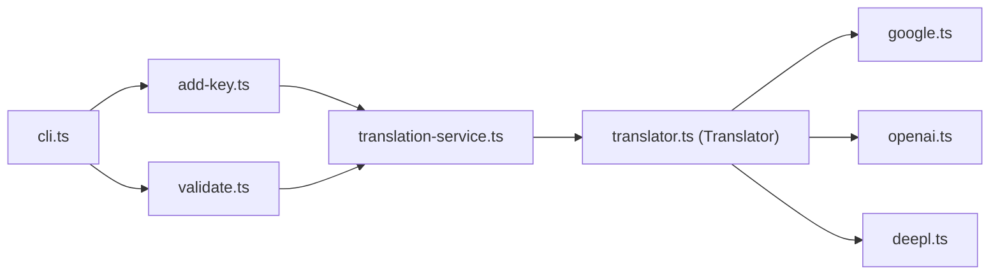

**Diagram sources**
- [cli.ts:80-101](file://src/bin/cli.ts#L80-L101)
- [add-key.ts:76-80](file://src/commands/add-key.ts#L76-L80)
- [validate.ts:112-118](file://src/commands/validate.ts#L112-L118)
- [translation-service.ts:7-17](file://src/services/translation-service.ts#L7-L17)
- [translator.ts:14-17](file://src/providers/translator.ts#L14-L17)
- [google.ts:1-50](file://src/providers/google.ts#L1-L50)
- [openai.ts:1-60](file://src/providers/openai.ts#L1-L60)
- [deepl.ts:1-26](file://src/providers/deepl.ts#L1-L26)

**Section sources**
- [cli.ts:80-101](file://src/bin/cli.ts#L80-L101)
- [add-key.ts:76-80](file://src/commands/add-key.ts#L76-L80)
- [validate.ts:112-118](file://src/commands/validate.ts#L112-L118)
- [translation-service.ts:7-17](file://src/services/translation-service.ts#L7-L17)
- [translator.ts:14-17](file://src/providers/translator.ts#L14-L17)

## Performance Considerations
- Provider selection prioritization reduces unnecessary initialization costs.
- TranslationService is stateless and lightweight, minimizing overhead.
- GoogleTranslate is free but may have rate limits; OpenAI offers higher quality at cost.
- Consider batching or caching strategies at higher layers if translating large volumes.
- Use dry-run mode to preview impact before applying changes.

[No sources needed since this section provides general guidance]

## Troubleshooting Guide
Common issues and resolutions:
- Missing API key for OpenAI: Ensure OPENAI_API_KEY is set or pass apiKey via options; the provider validates presence and throws a clear error if absent.
- Provider not implemented: DeepL throws a not-implemented error; supply a compatible implementation or choose another provider.
- Translation failures: Commands log warnings and continue; inspect network connectivity, quotas, or provider-specific constraints.
- Provider switching: Use --provider flag to explicitly select a provider; verify environment variables if relying on automatic selection.

**Section sources**
- [openai.ts:17-21](file://src/providers/openai.ts#L17-L21)
- [deepl.ts:21-23](file://src/providers/deepl.ts#L21-L23)
- [add-key.ts:82-89](file://src/commands/add-key.ts#L82-L89)
- [cli.ts:89-93](file://src/bin/cli.ts#L89-L93)

## Conclusion
The provider architecture cleanly abstracts AI translation behind the Translator interface, enabling commands to remain provider-agnostic while supporting multiple providers. TranslationService centralizes orchestration, and provider selection logic ensures predictable behavior across commands. The optional AIProvider interface supports advanced features like key suggestions. With clear error handling and straightforward extension points, the system is easy to customize and maintain.