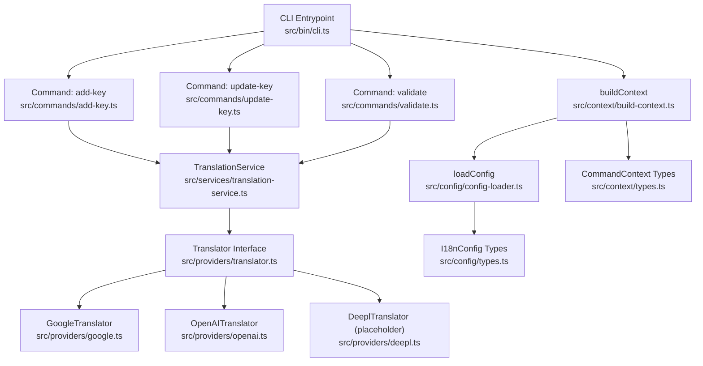
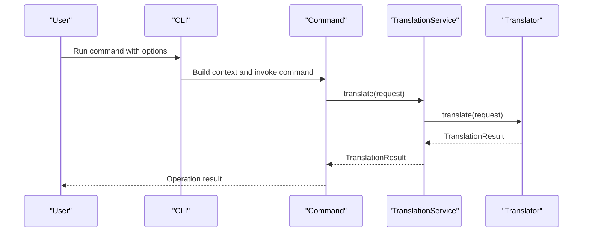
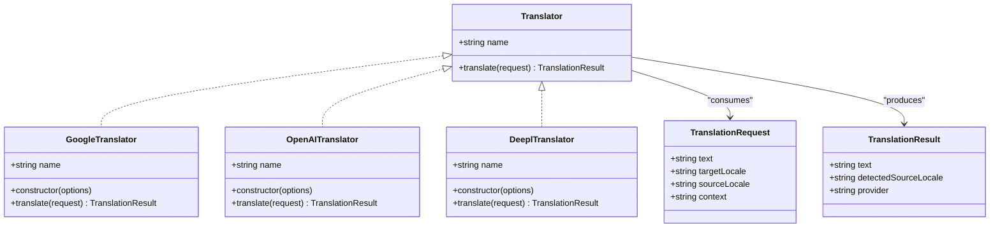
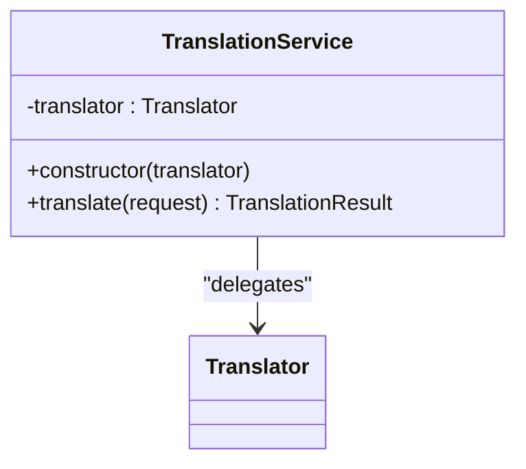
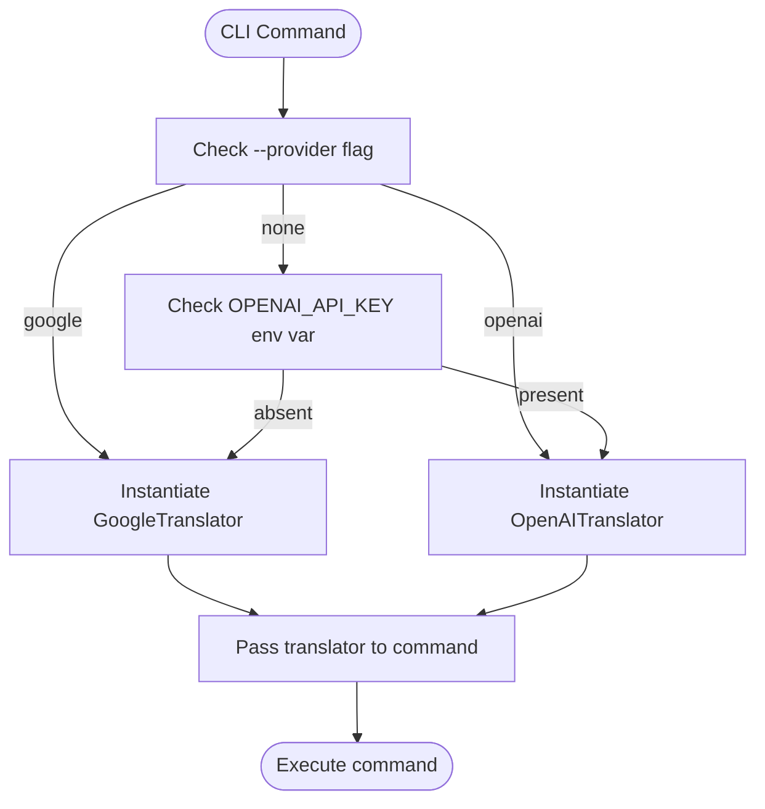
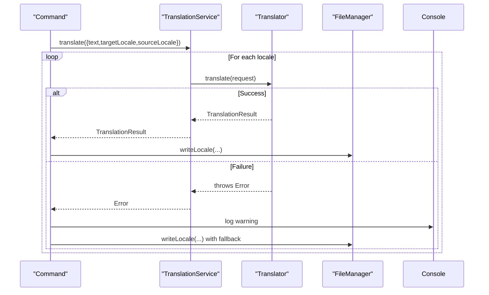
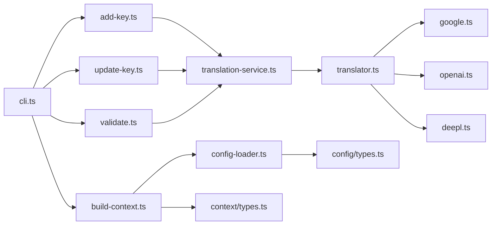

# Translation Service Orchestration

<cite>
**Referenced Files in This Document**
- [cli.ts](file://src/bin/cli.ts)
- [translation-service.ts](file://src/services/translation-service.ts)
- [translator.ts](file://src/providers/translator.ts)
- [google.ts](file://src/providers/google.ts)
- [openai.ts](file://src/providers/openai.ts)
- [deepl.ts](file://src/providers/deepl.ts)
- [add-key.ts](file://src/commands/add-key.ts)
- [update-key.ts](file://src/commands/update-key.ts)
- [validate.ts](file://src/commands/validate.ts)
- [build-context.ts](file://src/context/build-context.ts)
- [config-loader.ts](file://src/config/config-loader.ts)
- [types.ts](file://src/config/types.ts)
- [types.ts](file://src/context/types.ts)
</cite>

## Table of Contents
1. [Introduction](#introduction)
2. [Project Structure](#project-structure)
3. [Core Components](#core-components)
4. [Architecture Overview](#architecture-overview)
5. [Detailed Component Analysis](#detailed-component-analysis)
6. [Dependency Analysis](#dependency-analysis)
7. [Performance Considerations](#performance-considerations)
8. [Troubleshooting Guide](#troubleshooting-guide)
9. [Conclusion](#conclusion)
10. [Appendices](#appendices)

## Introduction
This document describes the TranslationService orchestration layer that powers translation workflows in the i18n CLI. It explains how provider selection, load balancing, and failover are handled, how translators are instantiated and configured, and how error handling, retries, circuit breakers, and graceful degradation are applied. It also covers performance optimizations such as request batching, caching strategies, and concurrent processing, along with examples for manual provider selection, custom provider registration, and monitoring translation quality. Scalability, resource management, and integration patterns for high-volume translation workloads are addressed.

## Project Structure
The translation orchestration spans several layers:
- CLI entrypoint parses commands and selects a translator based on flags or environment.
- Commands orchestrate translation tasks and call the translator abstraction.
- Providers implement the Translator interface for Google and OpenAI, with a placeholder for DeepL.
- TranslationService wraps a Translator for a unified translation call.
- Context and configuration loaders supply runtime configuration and environment.

**Diagram sources**
- [cli.ts:1-209](file://src/bin/cli.ts#L1-L209)
- [add-key.ts:1-120](file://src/commands/add-key.ts#L1-L120)
- [update-key.ts:1-178](file://src/commands/update-key.ts#L1-L178)
- [validate.ts:1-254](file://src/commands/validate.ts#L1-L254)
- [translation-service.ts:1-18](file://src/services/translation-service.ts#L1-L18)
- [translator.ts:1-60](file://src/providers/translator.ts#L1-L60)
- [google.ts:1-50](file://src/providers/google.ts#L1-L50)
- [openai.ts:1-60](file://src/providers/openai.ts#L1-L60)
- [deepl.ts:1-26](file://src/providers/deepl.ts#L1-L26)
- [build-context.ts:1-16](file://src/context/build-context.ts#L1-L16)
- [config-loader.ts:1-176](file://src/config/config-loader.ts#L1-L176)
- [types.ts:1-12](file://src/config/types.ts#L1-L12)
- [types.ts:1-15](file://src/context/types.ts#L1-L15)

**Section sources**
- [cli.ts:1-209](file://src/bin/cli.ts#L1-L209)
- [build-context.ts:1-16](file://src/context/build-context.ts#L1-L16)
- [config-loader.ts:1-176](file://src/config/config-loader.ts#L1-L176)
- [types.ts:1-12](file://src/config/types.ts#L1-L12)
- [types.ts:1-15](file://src/context/types.ts#L1-L15)

## Core Components
- Translator interface defines the contract for translation providers, including a name and translate method.
- GoogleTranslator implements translation using a third-party library with configurable options.
- OpenAITranslator implements translation using an LLM with optional model and base URL configuration.
- DeeplTranslator is a placeholder with a descriptive error indicating it is not implemented.
- TranslationService is a thin wrapper around a Translator, delegating translate requests.
- CLI commands select a translator based on flags or environment and pass it to commands.
- Commands orchestrate translation tasks, handle per-locale translation, and manage failures gracefully.

Key implementation references:
- Translator interface and options: [translator.ts:1-60](file://src/providers/translator.ts#L1-L60)
- Google implementation: [google.ts:1-50](file://src/providers/google.ts#L1-L50)
- OpenAI implementation: [openai.ts:1-60](file://src/providers/openai.ts#L1-L60)
- DeepL placeholder: [deepl.ts:1-26](file://src/providers/deepl.ts#L1-L26)
- TranslationService wrapper: [translation-service.ts:1-18](file://src/services/translation-service.ts#L1-L18)
- CLI provider selection and command wiring: [cli.ts:75-101](file://src/bin/cli.ts#L75-L101), [cli.ts:118-139](file://src/bin/cli.ts#L118-L139), [cli.ts:178-196](file://src/bin/cli.ts#L178-L196)
- Command orchestration and error handling: [add-key.ts:75-90](file://src/commands/add-key.ts#L75-L90), [update-key.ts:120-139](file://src/commands/update-key.ts#L120-L139), [validate.ts:102-119](file://src/commands/validate.ts#L102-L119)

**Section sources**
- [translator.ts:1-60](file://src/providers/translator.ts#L1-L60)
- [google.ts:1-50](file://src/providers/google.ts#L1-L50)
- [openai.ts:1-60](file://src/providers/openai.ts#L1-L60)
- [deepl.ts:1-26](file://src/providers/deepl.ts#L1-L26)
- [translation-service.ts:1-18](file://src/services/translation-service.ts#L1-L18)
- [cli.ts:75-101](file://src/bin/cli.ts#L75-L101)
- [cli.ts:118-139](file://src/bin/cli.ts#L118-L139)
- [cli.ts:178-196](file://src/bin/cli.ts#L178-L196)
- [add-key.ts:75-90](file://src/commands/add-key.ts#L75-L90)
- [update-key.ts:120-139](file://src/commands/update-key.ts#L120-L139)
- [validate.ts:102-119](file://src/commands/validate.ts#L102-L119)

## Architecture Overview
The orchestration follows a layered design:
- CLI layer parses arguments and determines the translator.
- Command layer orchestrates translation across locales and handles per-operation error recovery.
- Provider layer encapsulates external translation APIs behind a single interface.
- Context and configuration layers supply runtime settings and environment.

**Diagram sources**
- [cli.ts:75-101](file://src/bin/cli.ts#L75-L101)
- [add-key.ts:75-90](file://src/commands/add-key.ts#L75-L90)
- [translation-service.ts:14-16](file://src/services/translation-service.ts#L14-L16)
- [translator.ts:14-17](file://src/providers/translator.ts#L14-L17)

## Detailed Component Analysis

### Translator Abstraction and Providers
The Translator interface defines a uniform contract for translation providers. Concrete implementations:
- GoogleTranslator: Uses a translation library with options for host and fetch behavior.
- OpenAITranslator: Uses an LLM with configurable model and base URL; validates API key presence.
- DeeplTranslator: Placeholder with a descriptive error.

**Diagram sources**
- [translator.ts:1-60](file://src/providers/translator.ts#L1-L60)
- [google.ts:1-50](file://src/providers/google.ts#L1-L50)
- [openai.ts:1-60](file://src/providers/openai.ts#L1-L60)
- [deepl.ts:1-26](file://src/providers/deepl.ts#L1-L26)

**Section sources**
- [translator.ts:1-60](file://src/providers/translator.ts#L1-L60)
- [google.ts:1-50](file://src/providers/google.ts#L1-L50)
- [openai.ts:1-60](file://src/providers/openai.ts#L1-L60)
- [deepl.ts:1-26](file://src/providers/deepl.ts#L1-L26)

### TranslationService Wrapper
TranslationService delegates translation to a configured Translator. This enables swapping providers without changing command logic.

**Diagram sources**
- [translation-service.ts:1-18](file://src/services/translation-service.ts#L1-L18)
- [translator.ts:14-17](file://src/providers/translator.ts#L14-L17)

**Section sources**
- [translation-service.ts:1-18](file://src/services/translation-service.ts#L1-L18)

### CLI Provider Selection and Manual Selection
The CLI supports manual provider selection via flags and falls back to environment detection:
- Flags: --provider google or --provider openai.
- Environment fallback: Uses OpenAI if OPENAI_API_KEY is present; otherwise Google.

**Diagram sources**
- [cli.ts:75-101](file://src/bin/cli.ts#L75-L101)
- [cli.ts:118-139](file://src/bin/cli.ts#L118-L139)
- [cli.ts:178-196](file://src/bin/cli.ts#L178-L196)

**Section sources**
- [cli.ts:75-101](file://src/bin/cli.ts#L75-L101)
- [cli.ts:118-139](file://src/bin/cli.ts#L118-L139)
- [cli.ts:178-196](file://src/bin/cli.ts#L178-L196)

### Command Orchestration and Failover
Commands iterate over locales and call translate per locale. Failures are caught and handled gracefully:
- add-key: On failure, logs a warning and leaves the target locale blank for that key.
- update-key: On failure, retains the existing value in the target locale.
- validate: Optionally translates missing/type-mismatched keys; otherwise fills with empty strings.

**Diagram sources**
- [add-key.ts:75-90](file://src/commands/add-key.ts#L75-L90)
- [update-key.ts:120-139](file://src/commands/update-key.ts#L120-L139)
- [validate.ts:102-119](file://src/commands/validate.ts#L102-L119)
- [translation-service.ts:14-16](file://src/services/translation-service.ts#L14-L16)
- [translator.ts:14-17](file://src/providers/translator.ts#L14-L17)

**Section sources**
- [add-key.ts:75-90](file://src/commands/add-key.ts#L75-L90)
- [update-key.ts:120-139](file://src/commands/update-key.ts#L120-L139)
- [validate.ts:102-119](file://src/commands/validate.ts#L102-L119)

### Dynamic Provider Instantiation and Configuration Management
- GoogleTranslator options include host and fetch options; sourceLocale is optional and defaults to configured from option if absent.
- OpenAITranslator requires an API key (via constructor or environment) and supports model and base URL customization.
- DeepL placeholder indicates non-implemented state with a descriptive error.

Configuration and context:
- buildContext loads configuration and constructs FileManager for locale operations.
- loadConfig validates and compiles usage patterns, ensuring supported locales include default locale and no duplicates.

**Section sources**
- [google.ts:13-48](file://src/providers/google.ts#L13-L48)
- [openai.ts:14-28](file://src/providers/openai.ts#L14-L28)
- [deepl.ts:16-24](file://src/providers/deepl.ts#L16-L24)
- [build-context.ts:5-16](file://src/context/build-context.ts#L5-L16)
- [config-loader.ts:24-67](file://src/config/config-loader.ts#L24-L67)
- [config-loader.ts:69-82](file://src/config/config-loader.ts#L69-L82)

### Error Handling Strategies
- Retry logic: Not implemented in current code.
- Circuit breaker: Not implemented in current code.
- Graceful degradation:
  - add-key: Leaves target locale blank when translation fails.
  - update-key: Retains existing value when translation fails.
  - validate: Falls back to empty strings for missing keys when no translator is provided.

These behaviors enable robust operation under partial provider outages.

**Section sources**
- [add-key.ts:82-90](file://src/commands/add-key.ts#L82-L90)
- [update-key.ts:127-139](file://src/commands/update-key.ts#L127-L139)
- [validate.ts:218-223](file://src/commands/validate.ts#L218-L223)

### Monitoring Translation Quality
Quality monitoring is not implemented in the current codebase. Recommendations:
- Track provider latency and success rates per locale.
- Capture detected source locale and compare against expectations.
- Log translation provider metadata for auditability.
- Integrate metrics collection and alerting in production deployments.

[No sources needed since this section provides general guidance]

## Dependency Analysis
The CLI depends on commands, which depend on TranslationService and the Translator interface. Providers implement the interface. Context and configuration loaders supply runtime settings.

**Diagram sources**
- [cli.ts:1-209](file://src/bin/cli.ts#L1-L209)
- [add-key.ts:1-120](file://src/commands/add-key.ts#L1-L120)
- [update-key.ts:1-178](file://src/commands/update-key.ts#L1-L178)
- [validate.ts:1-254](file://src/commands/validate.ts#L1-L254)
- [translation-service.ts:1-18](file://src/services/translation-service.ts#L1-L18)
- [translator.ts:1-60](file://src/providers/translator.ts#L1-L60)
- [google.ts:1-50](file://src/providers/google.ts#L1-L50)
- [openai.ts:1-60](file://src/providers/openai.ts#L1-L60)
- [deepl.ts:1-26](file://src/providers/deepl.ts#L1-L26)
- [build-context.ts:1-16](file://src/context/build-context.ts#L1-L16)
- [config-loader.ts:1-176](file://src/config/config-loader.ts#L1-L176)
- [types.ts:1-15](file://src/context/types.ts#L1-L15)
- [types.ts:1-12](file://src/config/types.ts#L1-L12)

**Section sources**
- [cli.ts:1-209](file://src/bin/cli.ts#L1-L209)
- [add-key.ts:1-120](file://src/commands/add-key.ts#L1-L120)
- [update-key.ts:1-178](file://src/commands/update-key.ts#L1-L178)
- [validate.ts:1-254](file://src/commands/validate.ts#L1-L254)
- [translation-service.ts:1-18](file://src/services/translation-service.ts#L1-L18)
- [translator.ts:1-60](file://src/providers/translator.ts#L1-L60)
- [google.ts:1-50](file://src/providers/google.ts#L1-L50)
- [openai.ts:1-60](file://src/providers/openai.ts#L1-L60)
- [deepl.ts:1-26](file://src/providers/deepl.ts#L1-L26)
- [build-context.ts:1-16](file://src/context/build-context.ts#L1-L16)
- [config-loader.ts:1-176](file://src/config/config-loader.ts#L1-L176)
- [types.ts:1-15](file://src/context/types.ts#L1-L15)
- [types.ts:1-12](file://src/config/types.ts#L1-L12)

## Performance Considerations
Current implementation characteristics:
- Concurrency: Commands iterate locales sequentially; no concurrency pooling is implemented.
- Batching: No request batching is implemented.
- Caching: No caching of translation results is implemented.
- Resource management: Providers allocate resources internally (e.g., HTTP clients); no shared pool or connection reuse is implemented.

Recommendations for high-volume workloads:
- Introduce concurrency limits and per-provider rate limiting.
- Implement request batching for multiple keys within a locale.
- Add a cache layer keyed by (text, sourceLocale, targetLocale) with TTL.
- Centralize provider clients and reuse connections where applicable.
- Instrument latency and throughput metrics per provider.

[No sources needed since this section provides general guidance]

## Troubleshooting Guide
Common issues and remedies:
- Unknown provider flag: Ensure --provider is either google or openai.
- Missing OpenAI API key: Provide apiKey in constructor or set OPENAI_API_KEY environment variable.
- Configuration errors: Ensure defaultLocale is included in supportedLocales and there are no duplicate locales.
- Translation failures: Commands log warnings and apply graceful degradation (leave blank or retain existing value).

Operational tips:
- Use --dry-run to preview changes.
- Use --ci mode to enforce non-interactive behavior in automated environments.
- Validate locales after operations to catch structural mismatches.

**Section sources**
- [cli.ts:89-93](file://src/bin/cli.ts#L89-L93)
- [openai.ts:17-21](file://src/providers/openai.ts#L17-L21)
- [config-loader.ts:70-82](file://src/config/config-loader.ts#L70-L82)
- [add-key.ts:82-90](file://src/commands/add-key.ts#L82-L90)
- [update-key.ts:127-139](file://src/commands/update-key.ts#L127-L139)

## Conclusion
The TranslationService orchestration layer cleanly separates concerns between CLI commands, the Translator abstraction, and provider implementations. Provider selection is explicit via flags or environment, while commands implement robust error handling and graceful degradation. Current limitations include the absence of retry logic, circuit breakers, concurrency, batching, and caching—recommendations for scaling and reliability are provided. The modular design allows straightforward extension with additional providers and monitoring capabilities.

## Appendices

### Examples Index
- Manual provider selection:
  - Add key with Google: [cli.ts:82-93](file://src/bin/cli.ts#L82-L93)
  - Update key with OpenAI: [cli.ts:119-131](file://src/bin/cli.ts#L119-L131)
  - Validate with Google: [cli.ts:178-189](file://src/bin/cli.ts#L178-L189)
- Custom provider registration:
  - Implement a new class conforming to Translator interface: [translator.ts:14-17](file://src/providers/translator.ts#L14-L17)
  - Instantiate and pass to commands: [cli.ts:80-93](file://src/bin/cli.ts#L80-L93)
- Monitoring translation quality:
  - Capture provider metadata and latency in a metrics layer: [translation-service.ts:14-16](file://src/services/translation-service.ts#L14-L16), [translator.ts:8-12](file://src/providers/translator.ts#L8-L12)