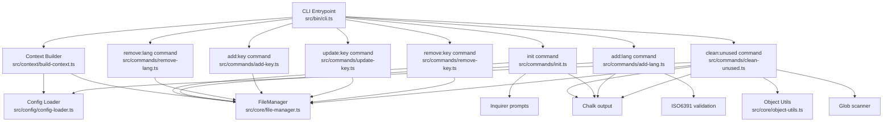
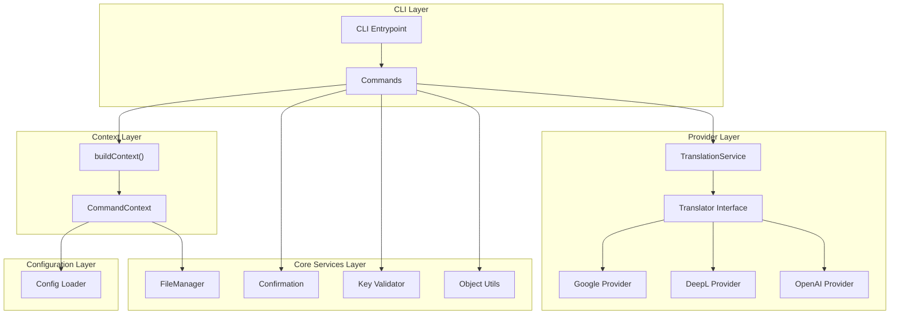
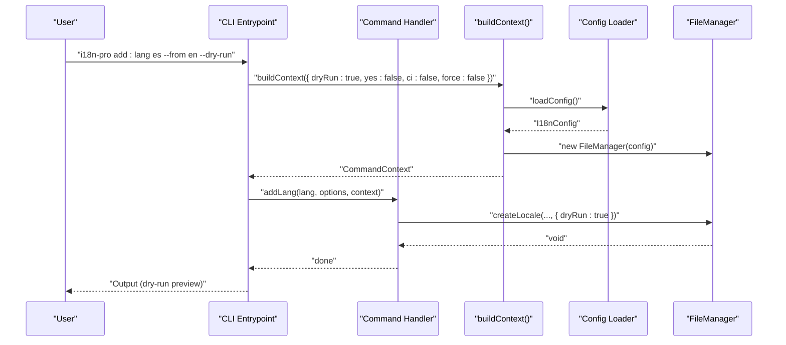
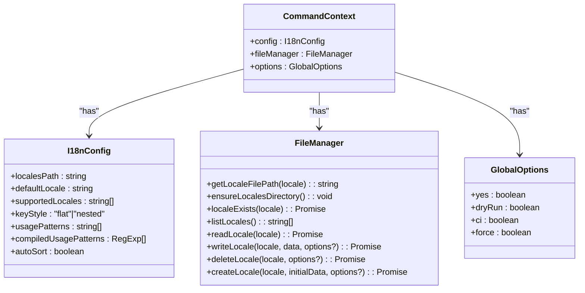
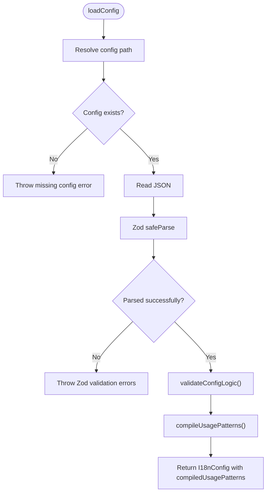
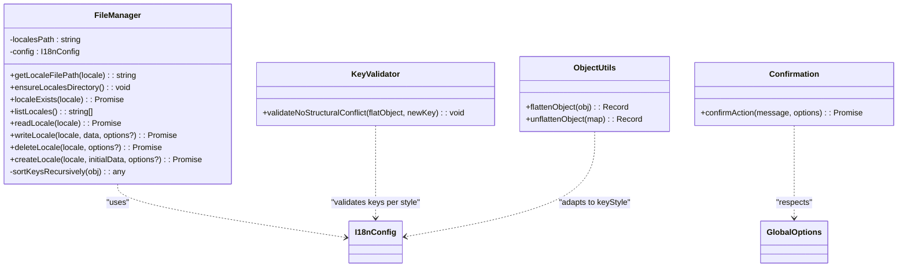
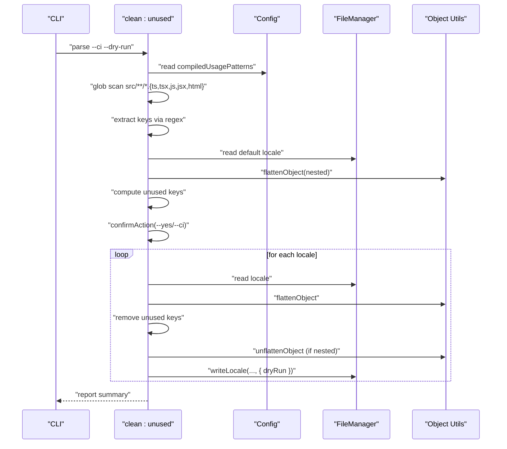
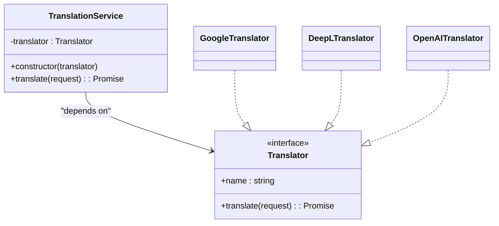
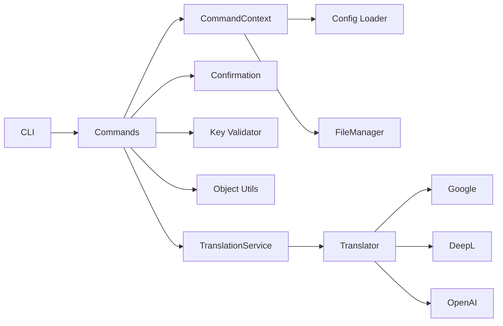
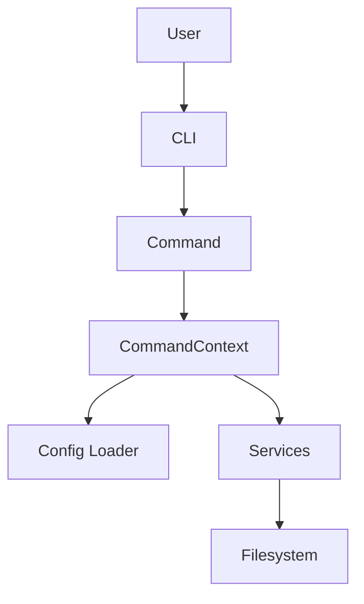

# Architecture & Core Concepts

<cite>
**Referenced Files in This Document**
- [README.md](file://README.md)
- [package.json](file://package.json)
- [src/bin/cli.ts](file://src/bin/cli.ts)
- [src/context/build-context.ts](file://src/context/build-context.ts)
- [src/context/types.ts](file://src/context/types.ts)
- [src/config/config-loader.ts](file://src/config/config-loader.ts)
- [src/config/types.ts](file://src/config/types.ts)
- [src/core/file-manager.ts](file://src/core/file-manager.ts)
- [src/core/confirmation.ts](file://src/core/confirmation.ts)
- [src/core/key-validator.ts](file://src/core/key-validator.ts)
- [src/core/object-utils.ts](file://src/core/object-utils.ts)
- [src/providers/translator.ts](file://src/providers/translator.ts)
- [src/providers/deepl.ts](file://src/providers/deepl.ts)
- [src/providers/google.ts](file://src/providers/google.ts)
- [src/providers/openai.ts](file://src/providers/openai.ts)
- [src/services/translation-service.ts](file://src/services/translation-service.ts)
- [src/commands/init.ts](file://src/commands/init.ts)
- [src/commands/add-lang.ts](file://src/commands/add-lang.ts)
- [src/commands/remove-lang.ts](file://src/commands/remove-lang.ts)
- [src/commands/add-key.ts](file://src/commands/add-key.ts)
- [src/commands/update-key.ts](file://src/commands/update-key.ts)
- [src/commands/remove-key.ts](file://src/commands/remove-key.ts)
- [src/commands/clean-unused.ts](file://src/commands/clean-unused.ts)
</cite>

## Table of Contents
1. [Introduction](#introduction)
2. [Project Structure](#project-structure)
3. [Core Components](#core-components)
4. [Architecture Overview](#architecture-overview)
5. [Detailed Component Analysis](#detailed-component-analysis)
6. [Dependency Analysis](#dependency-analysis)
7. [Performance Considerations](#performance-considerations)
8. [Troubleshooting Guide](#troubleshooting-guide)
9. [Conclusion](#conclusion)
10. [Appendices](#appendices)

## Introduction
This document explains the architecture and core design patterns of i18n-pro, a professional CLI tool for managing translation files. It focuses on:
- Modular command pattern implementation
- Dependency injection via a central context builder
- Separation of concerns across CLI, configuration, and core services
- Data flows from CLI input to file operations
- Validation mechanisms, dry-run operations, and CI/CD-friendly behavior
- Pluggable translation provider architecture
- Technology stack and architectural trade-offs

## Project Structure
The project is organized by functional domains:
- CLI entrypoint and command wiring
- Context builder for dependency injection
- Configuration loading and validation
- Core services for file operations and utilities
- Commands implementing domain actions
- Providers and services enabling translation integrations

**Diagram sources**
- [src/bin/cli.ts:1-122](file://src/bin/cli.ts#L1-L122)
- [src/context/build-context.ts:1-16](file://src/context/build-context.ts#L1-L16)
- [src/config/config-loader.ts:1-176](file://src/config/config-loader.ts#L1-L176)
- [src/core/file-manager.ts:1-118](file://src/core/file-manager.ts#L1-L118)
- [src/commands/init.ts:1-236](file://src/commands/init.ts#L1-L236)
- [src/commands/add-lang.ts:1-98](file://src/commands/add-lang.ts#L1-L98)
- [src/commands/remove-lang.ts](file://src/commands/remove-lang.ts)
- [src/commands/add-key.ts](file://src/commands/add-key.ts)
- [src/commands/update-key.ts](file://src/commands/update-key.ts)
- [src/commands/remove-key.ts](file://src/commands/remove-key.ts)
- [src/commands/clean-unused.ts:1-138](file://src/commands/clean-unused.ts#L1-L138)
- [src/core/object-utils.ts](file://src/core/object-utils.ts)
- [src/core/confirmation.ts:1-43](file://src/core/confirmation.ts#L1-L43)

**Section sources**
- [README.md:1-346](file://README.md#L1-L346)
- [package.json:1-45](file://package.json#L1-L45)

## Core Components
- CLI Entrypoint: Defines commands, registers global options, parses arguments, and delegates to commands with a built context.
- Context Builder: Centralizes dependency injection by assembling configuration and services into a single context object.
- Configuration System: Loads, validates, compiles usage patterns, and ensures logical consistency.
- Core Services:
  - FileManager: Encapsulates filesystem operations for locales, including read/write/create/delete with dry-run support and optional sorting.
  - Confirmation Utility: Handles interactive prompts respecting global flags and CI constraints.
  - Key Validator: Prevents structural conflicts when adding keys under flat/nested key styles.
  - Object Utilities: Flatten/unflatten translation objects to support both key styles.
- Commands: Implement domain actions (init, add/remove languages, add/update/remove keys, clean unused) using the context.
- Translation Provider System: Pluggable translators (Google, DeepL, OpenAI stubs) orchestrated by a simple service.

**Section sources**
- [src/bin/cli.ts:1-122](file://src/bin/cli.ts#L1-L122)
- [src/context/build-context.ts:1-16](file://src/context/build-context.ts#L1-L16)
- [src/context/types.ts:1-15](file://src/context/types.ts#L1-L15)
- [src/config/config-loader.ts:1-176](file://src/config/config-loader.ts#L1-L176)
- [src/config/types.ts:1-12](file://src/config/types.ts#L1-L12)
- [src/core/file-manager.ts:1-118](file://src/core/file-manager.ts#L1-L118)
- [src/core/confirmation.ts:1-43](file://src/core/confirmation.ts#L1-L43)
- [src/core/key-validator.ts:1-33](file://src/core/key-validator.ts#L1-L33)
- [src/core/object-utils.ts](file://src/core/object-utils.ts)
- [src/providers/translator.ts:1-18](file://src/providers/translator.ts#L1-L18)
- [src/services/translation-service.ts:1-18](file://src/services/translation-service.ts#L1-L18)

## Architecture Overview
The system follows a layered architecture with a clear separation of concerns:
- CLI Layer: Parses user input, applies global options, and invokes commands.
- Command Layer: Orchestrates domain logic using injected services from the context.
- Core Services Layer: Provides filesystem operations, validation, and utilities.
- Configuration Layer: Centralizes configuration loading and validation.
- Provider Layer: Enables pluggable translation integrations.

**Diagram sources**
- [src/bin/cli.ts:1-122](file://src/bin/cli.ts#L1-L122)
- [src/context/build-context.ts:1-16](file://src/context/build-context.ts#L1-L16)
- [src/context/types.ts:1-15](file://src/context/types.ts#L1-L15)
- [src/config/config-loader.ts:1-176](file://src/config/config-loader.ts#L1-L176)
- [src/core/file-manager.ts:1-118](file://src/core/file-manager.ts#L1-L118)
- [src/core/confirmation.ts:1-43](file://src/core/confirmation.ts#L1-L43)
- [src/core/key-validator.ts:1-33](file://src/core/key-validator.ts#L1-L33)
- [src/core/object-utils.ts](file://src/core/object-utils.ts)
- [src/services/translation-service.ts:1-18](file://src/services/translation-service.ts#L1-L18)
- [src/providers/translator.ts:1-18](file://src/providers/translator.ts#L1-L18)
- [src/providers/google.ts](file://src/providers/google.ts)
- [src/providers/deepl.ts](file://src/providers/deepl.ts)
- [src/providers/openai.ts](file://src/providers/openai.ts)

## Detailed Component Analysis

### CLI Entrypoint and Command Wiring
- Registers global options: skip prompts, dry-run preview, CI mode, and force overrides.
- Wires commands for initialization, language management, key management, and cleanup.
- Delegates to commands with a context built from global options.

**Diagram sources**
- [src/bin/cli.ts:1-122](file://src/bin/cli.ts#L1-L122)
- [src/context/build-context.ts:1-16](file://src/context/build-context.ts#L1-L16)
- [src/config/config-loader.ts:1-176](file://src/config/config-loader.ts#L1-L176)
- [src/core/file-manager.ts:1-118](file://src/core/file-manager.ts#L1-L118)
- [src/commands/add-lang.ts:1-98](file://src/commands/add-lang.ts#L1-L98)

**Section sources**
- [src/bin/cli.ts:1-122](file://src/bin/cli.ts#L1-L122)

### Context Builder and Dependency Injection
- Assembles a CommandContext from loaded configuration and a FileManager instance.
- Ensures commands receive consistent dependencies and global options.

**Diagram sources**
- [src/context/types.ts:1-15](file://src/context/types.ts#L1-L15)
- [src/config/types.ts:1-12](file://src/config/types.ts#L1-L12)
- [src/core/file-manager.ts:1-118](file://src/core/file-manager.ts#L1-L118)

**Section sources**
- [src/context/build-context.ts:1-16](file://src/context/build-context.ts#L1-L16)
- [src/context/types.ts:1-15](file://src/context/types.ts#L1-L15)

### Configuration System and Validation
- Loads configuration from a JSON file in the project root.
- Validates shape and logic using Zod, ensuring supported locales include the default locale and no duplicates.
- Compiles usage patterns into RegExp objects and verifies capturing groups.
- Exposes compiled patterns to commands for scanning.

**Diagram sources**
- [src/config/config-loader.ts:1-176](file://src/config/config-loader.ts#L1-L176)

**Section sources**
- [src/config/config-loader.ts:1-176](file://src/config/config-loader.ts#L1-L176)
- [src/config/types.ts:1-12](file://src/config/types.ts#L1-L12)

### Core Services: FileManager and Utilities
- FileManager encapsulates filesystem operations with:
  - Path resolution and existence checks
  - Read, write, create, and delete operations
  - Optional dry-run mode
  - Recursive key sorting when enabled
- Confirmation utility handles interactive prompts respecting global flags and CI constraints.
- Key validator prevents structural conflicts between flat and nested key styles.
- Object utilities support flattening and unflattening translation objects to align with configured key style.

**Diagram sources**
- [src/core/file-manager.ts:1-118](file://src/core/file-manager.ts#L1-L118)
- [src/core/confirmation.ts:1-43](file://src/core/confirmation.ts#L1-L43)
- [src/core/key-validator.ts:1-33](file://src/core/key-validator.ts#L1-L33)
- [src/core/object-utils.ts](file://src/core/object-utils.ts)
- [src/config/types.ts:1-12](file://src/config/types.ts#L1-L12)

**Section sources**
- [src/core/file-manager.ts:1-118](file://src/core/file-manager.ts#L1-L118)
- [src/core/confirmation.ts:1-43](file://src/core/confirmation.ts#L1-L43)
- [src/core/key-validator.ts:1-33](file://src/core/key-validator.ts#L1-L33)

### Commands: Domain Actions and Data Flow
- Initialization command:
  - Builds configuration interactively or non-interactively
  - Validates and compiles usage patterns
  - Optionally creates default locale file
  - Supports dry-run and CI modes
- Language commands:
  - Validate locale codes using ISO standards
  - Clone content from a base locale when requested
  - Respect dry-run and confirmation policies
- Key commands:
  - Add/update/remove keys across locales
  - Enforce structural integrity for flat/nested styles
- Cleanup command:
  - Scans source files using compiled usage patterns
  - Identifies unused keys and removes them from all locales
  - Preserves key style during rebuild

**Diagram sources**
- [src/commands/clean-unused.ts:1-138](file://src/commands/clean-unused.ts#L1-L138)
- [src/config/config-loader.ts:1-176](file://src/config/config-loader.ts#L1-L176)
- [src/core/file-manager.ts:1-118](file://src/core/file-manager.ts#L1-L118)
- [src/core/object-utils.ts](file://src/core/object-utils.ts)

**Section sources**
- [src/commands/init.ts:1-236](file://src/commands/init.ts#L1-L236)
- [src/commands/add-lang.ts:1-98](file://src/commands/add-lang.ts#L1-L98)
- [src/commands/clean-unused.ts:1-138](file://src/commands/clean-unused.ts#L1-L138)

### Translation Provider System
- Translator interface defines a contract for translation providers.
- TranslationService delegates translation requests to the configured provider.
- Providers include Google, DeepL, and OpenAI stubs, enabling extensibility.

**Diagram sources**
- [src/providers/translator.ts:1-18](file://src/providers/translator.ts#L1-L18)
- [src/services/translation-service.ts:1-18](file://src/services/translation-service.ts#L1-L18)
- [src/providers/google.ts](file://src/providers/google.ts)
- [src/providers/deepl.ts](file://src/providers/deepl.ts)
- [src/providers/openai.ts](file://src/providers/openai.ts)

**Section sources**
- [src/providers/translator.ts:1-18](file://src/providers/translator.ts#L1-L18)
- [src/services/translation-service.ts:1-18](file://src/services/translation-service.ts#L1-L18)

## Dependency Analysis
- CLI depends on commands and the context builder.
- Commands depend on the context (configuration and services).
- FileManager depends on configuration and filesystem utilities.
- Configuration loader depends on Zod and filesystem utilities.
- Translation providers depend on the Translator interface.

**Diagram sources**
- [src/bin/cli.ts:1-122](file://src/bin/cli.ts#L1-L122)
- [src/context/build-context.ts:1-16](file://src/context/build-context.ts#L1-L16)
- [src/config/config-loader.ts:1-176](file://src/config/config-loader.ts#L1-L176)
- [src/core/file-manager.ts:1-118](file://src/core/file-manager.ts#L1-L118)
- [src/core/confirmation.ts:1-43](file://src/core/confirmation.ts#L1-L43)
- [src/core/key-validator.ts:1-33](file://src/core/key-validator.ts#L1-L33)
- [src/core/object-utils.ts](file://src/core/object-utils.ts)
- [src/services/translation-service.ts:1-18](file://src/services/translation-service.ts#L1-L18)
- [src/providers/translator.ts:1-18](file://src/providers/translator.ts#L1-L18)
- [src/providers/google.ts](file://src/providers/google.ts)
- [src/providers/deepl.ts](file://src/providers/deepl.ts)
- [src/providers/openai.ts](file://src/providers/openai.ts)

**Section sources**
- [package.json:1-45](file://package.json#L1-L45)

## Performance Considerations
- Filesystem operations are synchronous and straightforward; batching writes can reduce I/O overhead.
- Sorting keys is recursive and scales with object depth; consider disabling autoSort for very large translation files if needed.
- Glob scanning and regex matching are linear in file size and count; ensure usagePatterns are precise to minimize false positives.
- Dry-run mode avoids disk writes, reducing performance impact to memory and CPU for previews.

## Troubleshooting Guide
- Missing configuration file: The loader throws a clear error instructing to run initialization.
- Invalid JSON or schema violations: Zod produces structured errors listing path and messages.
- Invalid regex in usagePatterns: The compiler validates patterns and capturing groups, throwing descriptive errors.
- CI mode constraints: Without --yes, CI mode requires explicit confirmation; otherwise, it fails with an error.
- Dry-run mode: Changes are previewed; confirm by removing --dry-run and rerunning.
- Locale operations: Existence checks prevent overwriting or deleting non-existent files; ensure supportedLocales alignment.

**Section sources**
- [src/config/config-loader.ts:1-176](file://src/config/config-loader.ts#L1-L176)
- [src/core/file-manager.ts:1-118](file://src/core/file-manager.ts#L1-L118)
- [src/core/confirmation.ts:1-43](file://src/core/confirmation.ts#L1-L43)
- [src/commands/init.ts:1-236](file://src/commands/init.ts#L1-L236)
- [src/commands/clean-unused.ts:1-138](file://src/commands/clean-unused.ts#L1-L138)

## Conclusion
i18n-pro’s architecture emphasizes modularity, testability, and extensibility:
- The CLI delegates to commands that consume a unified context, enabling clean separation of concerns.
- Configuration is validated early and centrally, ensuring reliable downstream operations.
- FileManager abstracts filesystem concerns and integrates dry-run and sorting capabilities.
- The translation provider system offers a clear extension point for integrating external services.
- Cross-cutting concerns like confirmation, validation, and CI-friendly behavior are consistently enforced across commands.

## Appendices

### System Context Diagrams

[No sources needed since this diagram shows conceptual workflow, not actual code structure]

### Technology Stack and Dependencies
- Core runtime: Node.js with ES modules
- CLI framework: commander
- Filesystem: fs-extra
- Prompts: inquirer
- Validation: zod
- Formatting: chalk
- Regex scanning: glob
- Locales: iso-639-1
- Translation providers: @vitalets/google-translate-api (external dependency)

**Section sources**
- [package.json:1-45](file://package.json#L1-L45)
- [README.md:1-346](file://README.md#L1-L346)

### Architectural Trade-offs
- TypeScript provides strong typing and developer experience but increases build complexity.
- Zod validation centralizes configuration validation but adds parsing overhead.
- Pluggable providers enable flexibility but require careful interface design and testing.
- Dry-run and CI modes improve safety and automation but introduce conditional logic across commands.