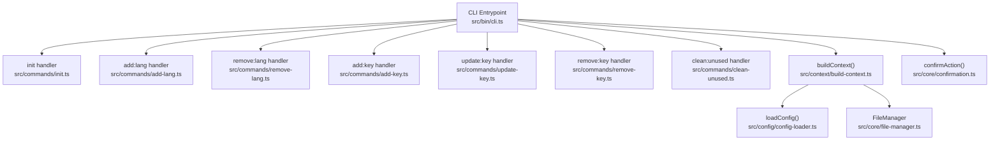
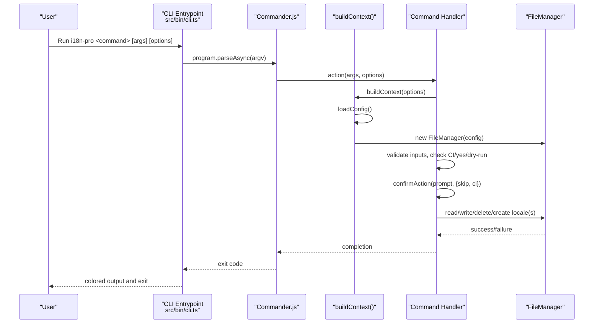
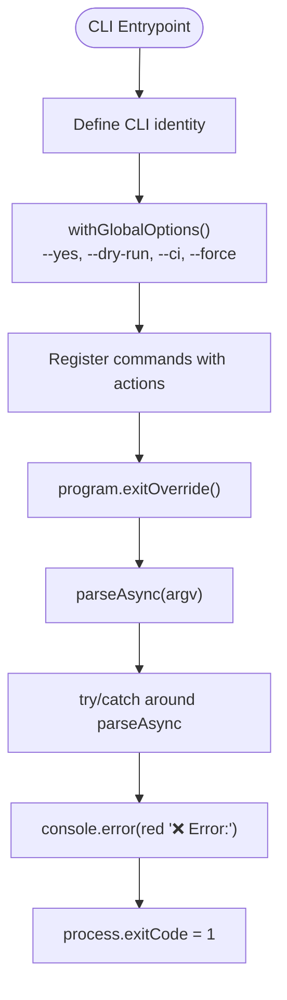
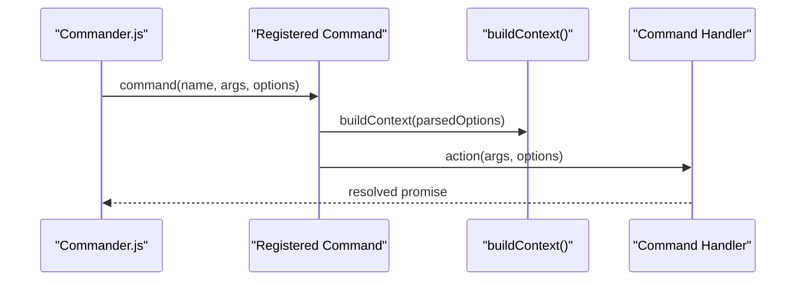
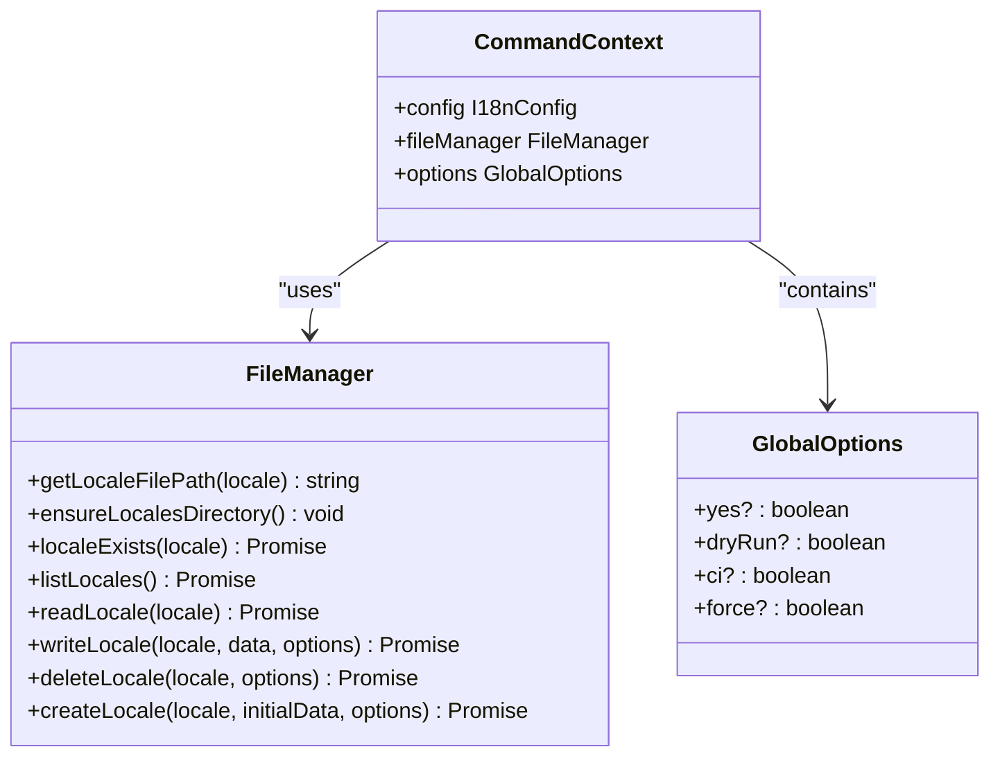
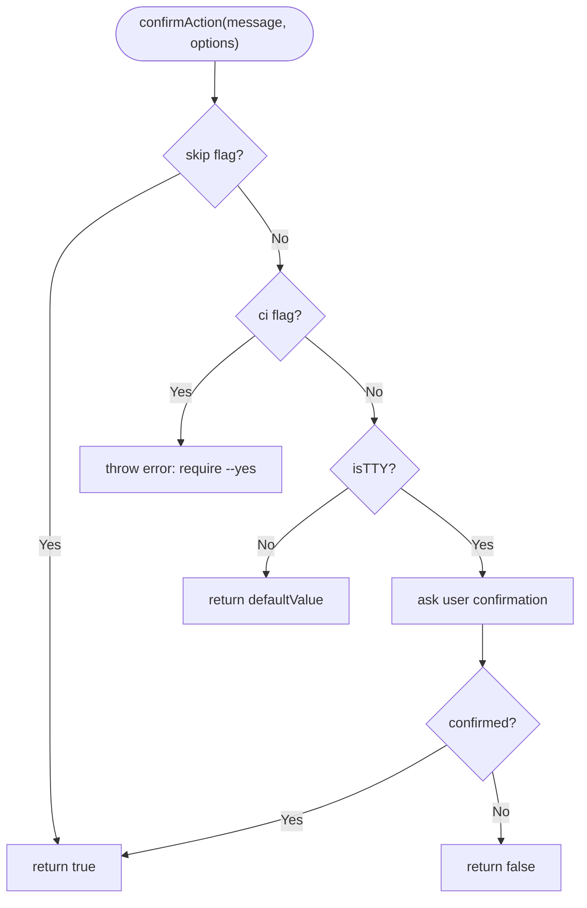
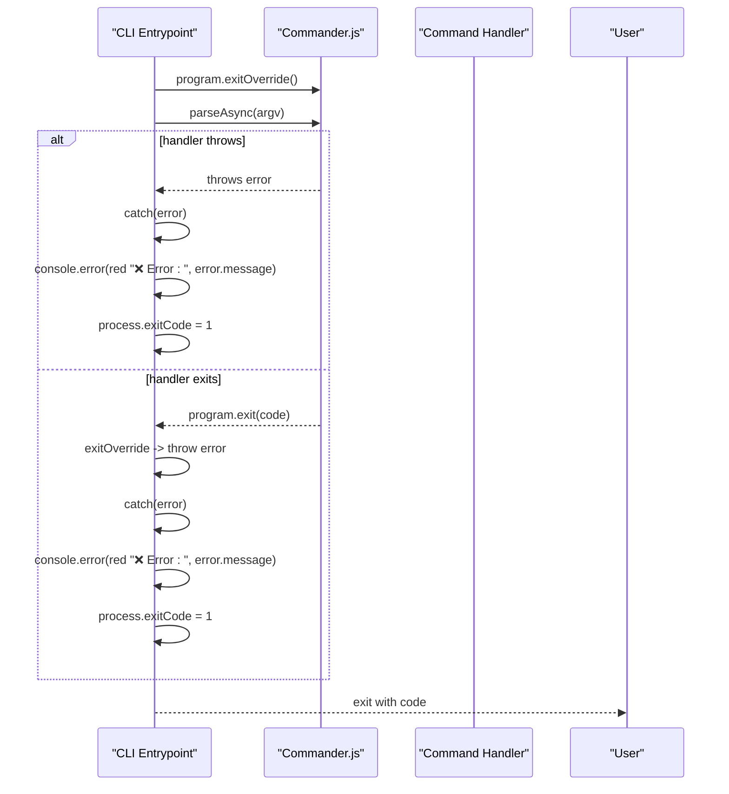
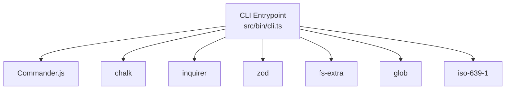

# CLI Layer & Command Routing

<cite>
**Referenced Files in This Document**
- [cli.ts](file://src/bin/cli.ts)
- [build-context.ts](file://src/context/build-context.ts)
- [types.ts](file://src/context/types.ts)
- [confirmation.ts](file://src/core/confirmation.ts)
- [file-manager.ts](file://src/core/file-manager.ts)
- [config-loader.ts](file://src/config/config-loader.ts)
- [init.ts](file://src/commands/init.ts)
- [add-key.ts](file://src/commands/add-key.ts)
- [add-lang.ts](file://src/commands/add-lang.ts)
- [remove-lang.ts](file://src/commands/remove-lang.ts)
- [update-key.ts](file://src/commands/update-key.ts)
- [remove-key.ts](file://src/commands/remove-key.ts)
- [clean-unused.ts](file://src/commands/clean-unused.ts)
- [package.json](file://package.json)
</cite>

## Table of Contents
1. [Introduction](#introduction)
2. [Project Structure](#project-structure)
3. [Core Components](#core-components)
4. [Architecture Overview](#architecture-overview)
5. [Detailed Component Analysis](#detailed-component-analysis)
6. [Dependency Analysis](#dependency-analysis)
7. [Performance Considerations](#performance-considerations)
8. [Troubleshooting Guide](#troubleshooting-guide)
9. [Conclusion](#conclusion)

## Introduction
This document explains the CLI layer architecture and command routing for the i18n-pro tool. It focuses on the modular command pattern implemented with Commander.js, where each CLI operation is encapsulated as a dedicated command handler. The CLI exposes global options for dry-run previews, CI mode enforcement, and confirmation skipping. The router delegates to specific handlers after building a shared execution context that includes configuration, file management utilities, and parsed options. The document also covers exit overrides, global error handling, and the relationship between CLI commands and their handlers.

## Project Structure
The CLI entrypoint defines commands and registers them with Commander.js. Each command resides under src/commands and implements a handler function that receives a shared CommandContext. The CommandContext is built from global options and loaded configuration, and it provides access to FileManager for filesystem operations.

**Diagram sources**
- [cli.ts](file://src/bin/cli.ts)
- [build-context.ts](file://src/context/build-context.ts)
- [config-loader.ts](file://src/config/config-loader.ts)
- [file-manager.ts](file://src/core/file-manager.ts)
- [confirmation.ts](file://src/core/confirmation.ts)
- [init.ts](file://src/commands/init.ts)
- [add-key.ts](file://src/commands/add-key.ts)
- [add-lang.ts](file://src/commands/add-lang.ts)
- [remove-lang.ts](file://src/commands/remove-lang.ts)
- [update-key.ts](file://src/commands/update-key.ts)
- [remove-key.ts](file://src/commands/remove-key.ts)
- [clean-unused.ts](file://src/commands/clean-unused.ts)

**Section sources**
- [cli.ts](file://src/bin/cli.ts)
- [build-context.ts](file://src/context/build-context.ts)
- [types.ts](file://src/context/types.ts)

## Core Components
- CLI Entrypoint and Router: Defines the CLI name, description, version, and registers commands. Implements a global options helper and a try/catch around parseAsync with exitOverride to centralize error handling.
- Command Handlers: Each handler implements a specific operation (init, add/remove language, add/update/remove key, clean unused). They receive a CommandContext and operate on configuration and files.
- CommandContext Builder: Loads configuration, constructs FileManager, and injects parsed global options into the context.
- Confirmation Utility: Centralizes prompting logic with support for --yes, CI mode, and non-interactive environments.
- FileManager: Provides CRUD operations for locale files with optional dry-run behavior and automatic key sorting.

**Section sources**
- [cli.ts](file://src/bin/cli.ts)
- [build-context.ts](file://src/context/build-context.ts)
- [types.ts](file://src/context/types.ts)
- [confirmation.ts](file://src/core/confirmation.ts)
- [file-manager.ts](file://src/core/file-manager.ts)

## Architecture Overview
The CLI layer follows a modular command pattern:
- The router (Commander.js) parses arguments and routes to a command handler.
- The handler receives a CommandContext containing configuration, FileManager, and global options.
- Handlers perform validation, optionally prompt for confirmation, and then mutate files via FileManager.
- Global options are consistently applied across commands for dry-run, CI enforcement, and confirmation skipping.

**Diagram sources**
- [cli.ts](file://src/bin/cli.ts)
- [build-context.ts](file://src/context/build-context.ts)
- [config-loader.ts](file://src/config/config-loader.ts)
- [file-manager.ts](file://src/core/file-manager.ts)
- [confirmation.ts](file://src/core/confirmation.ts)
- [init.ts](file://src/commands/init.ts)
- [add-key.ts](file://src/commands/add-key.ts)
- [add-lang.ts](file://src/commands/add-lang.ts)
- [remove-lang.ts](file://src/commands/remove-lang.ts)
- [update-key.ts](file://src/commands/update-key.ts)
- [remove-key.ts](file://src/commands/remove-key.ts)
- [clean-unused.ts](file://src/commands/clean-unused.ts)

## Detailed Component Analysis

### CLI Entrypoint and Global Options
- Registers the CLI identity (name, description, version).
- Defines a global options helper that adds --yes, --dry-run, --ci, and --force to every command.
- Registers commands for language and key operations, attaching actions that:
  - Build a CommandContext from parsed options.
  - Invoke the corresponding handler with context and arguments.
- Installs an exit override to intercept program.exit and convert exits into thrown errors for centralized handling.
- Wraps parseAsync in a try/catch to print a red error message and set a non-zero exit code.

**Diagram sources**
- [cli.ts](file://src/bin/cli.ts)

**Section sources**
- [cli.ts](file://src/bin/cli.ts)

### Command Registration, Argument Parsing, and Action Execution
- Each command is registered with a description and action. Actions:
  - Build a CommandContext using the parsed options.
  - Call the handler with the context and any positional arguments.
- Arguments and options are parsed by Commander.js; required options are enforced per command.
- Actions are async to support I/O and prompt flows.

**Diagram sources**
- [cli.ts](file://src/bin/cli.ts)
- [build-context.ts](file://src/context/build-context.ts)

**Section sources**
- [cli.ts](file://src/bin/cli.ts)
- [build-context.ts](file://src/context/build-context.ts)

### Command Handlers and Delegation
Each handler receives a CommandContext and performs:
- Validation of inputs and configuration.
- Optional confirmation prompts via confirmAction.
- File operations through FileManager with dry-run support.
- Colored output for UX.

**Diagram sources**
- [types.ts](file://src/context/types.ts)
- [file-manager.ts](file://src/core/file-manager.ts)

**Section sources**
- [types.ts](file://src/context/types.ts)
- [file-manager.ts](file://src/core/file-manager.ts)

### Global Options System
- --yes: Skips confirmation prompts.
- --dry-run: Previews changes without writing files.
- --ci: Disables interactive prompts; requires --yes to proceed.
- --force: Allows overwriting existing resources when applicable.

Handlers consistently read options from the CommandContext and enforce policies:
- CI mode throws if confirmation is required and --yes is not provided.
- Dry-run mode bypasses writes and logs preview messages.
- Confirmation is skipped when --yes is present.

**Section sources**
- [cli.ts](file://src/bin/cli.ts)
- [confirmation.ts](file://src/core/confirmation.ts)
- [init.ts](file://src/commands/init.ts)
- [add-key.ts](file://src/commands/add-key.ts)
- [add-lang.ts](file://src/commands/add-lang.ts)
- [remove-lang.ts](file://src/commands/remove-lang.ts)
- [update-key.ts](file://src/commands/update-key.ts)
- [remove-key.ts](file://src/commands/remove-key.ts)
- [clean-unused.ts](file://src/commands/clean-unused.ts)

### Confirmation Prompt Strategy
- confirmAction centralizes prompting behavior:
  - If --yes is set, returns true immediately.
  - If running in CI mode, throws requiring --yes.
  - If stdout is not a TTY, returns a default value or proceeds without prompt.
  - Otherwise, asks the user for confirmation.

**Diagram sources**
- [confirmation.ts](file://src/core/confirmation.ts)

**Section sources**
- [confirmation.ts](file://src/core/confirmation.ts)

### Command Handlers Overview
- init: Creates configuration and initializes default locale file; supports interactive prompts and defaults for non-interactive environments.
- add:lang: Adds a new locale file, optionally cloning from an existing locale; validates locale codes and prevents duplicates.
- remove:lang: Removes a locale file with safety checks against default locale and existence.
- add:key: Adds a translation key to all locales with structural validation and key-style handling.
- update:key: Updates a key’s value in a specific or default locale with validation and optional locale targeting.
- remove:key: Removes a key from all locales with structural safety and cleanup of empty objects.
- clean:unused: Scans project usage patterns to find unused keys and removes them from all locales.

**Section sources**
- [init.ts](file://src/commands/init.ts)
- [add-lang.ts](file://src/commands/add-lang.ts)
- [remove-lang.ts](file://src/commands/remove-lang.ts)
- [add-key.ts](file://src/commands/add-key.ts)
- [update-key.ts](file://src/commands/update-key.ts)
- [remove-key.ts](file://src/commands/remove-key.ts)
- [clean-unused.ts](file://src/commands/clean-unused.ts)

### Error Boundary and Exit Override
- The CLI installs program.exitOverride to convert program.exit calls into thrown errors.
- parseAsync is wrapped in a try/catch block to:
  - Print a red error message.
  - Set process.exitCode to 1.
- Handlers themselves throw descriptive errors for invalid inputs, missing configuration, or structural conflicts.

**Diagram sources**
- [cli.ts](file://src/bin/cli.ts)

**Section sources**
- [cli.ts](file://src/bin/cli.ts)

## Dependency Analysis
- CLI depends on Commander.js for routing and option parsing.
- CLI depends on chalk for colored output.
- CLI depends on inquirer indirectly via confirmation logic.
- CLI depends on zod for configuration validation.
- CLI depends on fs-extra and glob for filesystem operations.
- CLI depends on ISO6391 for locale validation.

**Diagram sources**
- [cli.ts](file://src/bin/cli.ts)
- [package.json](file://package.json)

**Section sources**
- [package.json](file://package.json)

## Performance Considerations
- Dry-run mode avoids filesystem writes, reducing I/O overhead.
- Key sorting is applied during write operations; disabling autoSort reduces CPU work when not needed.
- Glob scanning for clean:unused can be expensive in large projects; consider narrowing search paths or caching patterns.
- Confirmation prompts are skipped in non-interactive environments, avoiding blocking I/O.

## Troubleshooting Guide
Common issues and resolutions:
- Configuration not found: Ensure i18n-pro.config.json exists in the project root or run init to create it.
- Invalid locale code: Use valid BCP 47 codes (e.g., en or en-US) recognized by iso-639-1.
- Key conflicts: Structural conflicts occur when adding keys that would break existing parent/child relationships; adjust keys accordingly.
- CI mode failures: Add --yes to approve operations without prompts.
- Permission errors: Verify write permissions to the locales directory and configuration file location.
- Dry-run mode: Remember that --dry-run previews changes without writing; use without --dry-run to apply.

**Section sources**
- [config-loader.ts](file://src/config/config-loader.ts)
- [add-key.ts](file://src/commands/add-key.ts)
- [add-lang.ts](file://src/commands/add-lang.ts)
- [remove-lang.ts](file://src/commands/remove-lang.ts)
- [update-key.ts](file://src/commands/update-key.ts)
- [remove-key.ts](file://src/commands/remove-key.ts)
- [clean-unused.ts](file://src/commands/clean-unused.ts)

## Conclusion
The CLI layer employs a clean, modular architecture centered on Commander.js. Each operation is a self-contained handler receiving a shared CommandContext, ensuring consistent access to configuration, file management, and global options. The global options system provides predictable behavior across commands for dry-run previews, CI enforcement, and confirmation skipping. Centralized error handling and exit overrides improve reliability and user feedback. This design scales to new commands by following the established pattern of building context, validating inputs, prompting when appropriate, and delegating to FileManager for I/O.