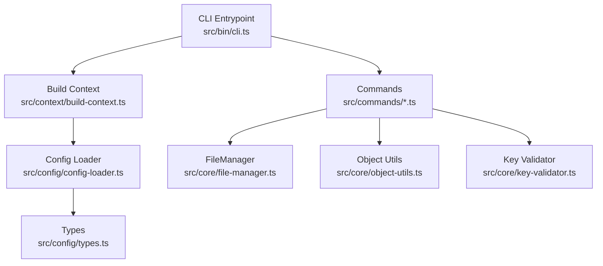
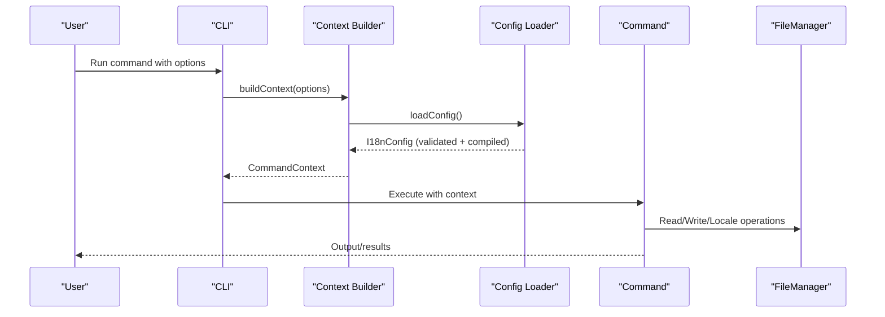
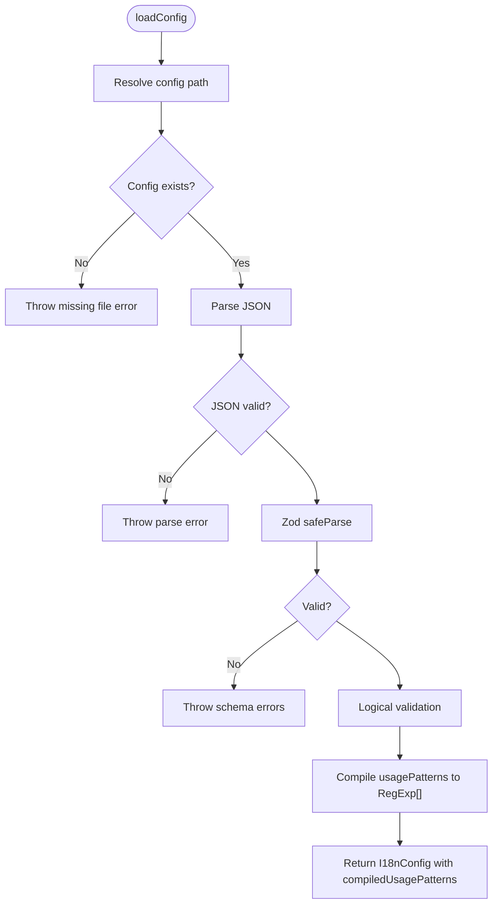
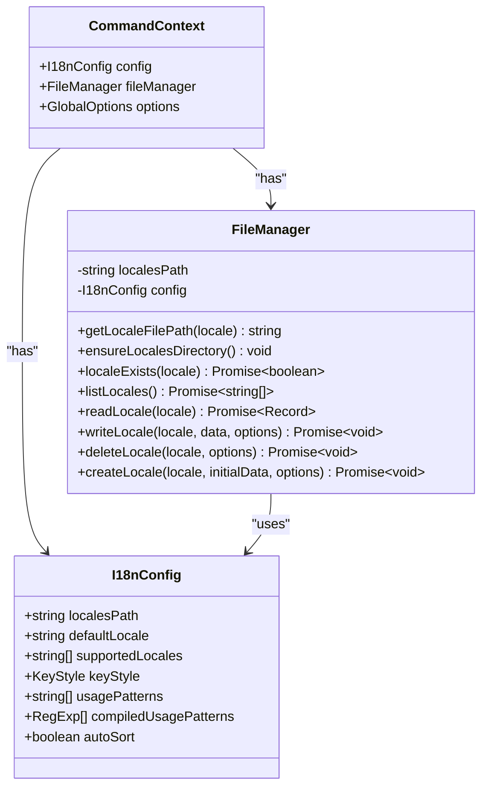
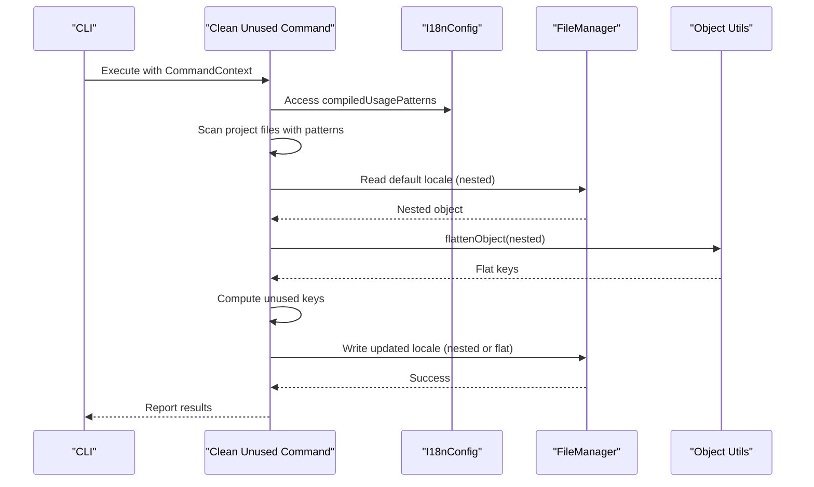
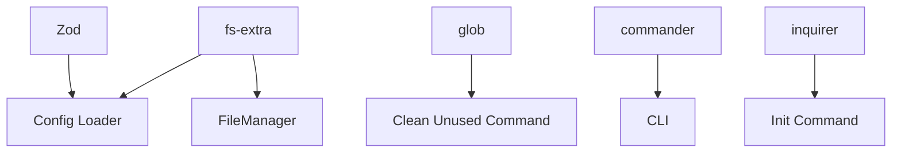

# Configuration System

<cite>
**Referenced Files in This Document**
- [config-loader.ts](file://src/config/config-loader.ts)
- [types.ts](file://src/config/types.ts)
- [build-context.ts](file://src/context/build-context.ts)
- [types.ts](file://src/context/types.ts)
- [cli.ts](file://src/bin/cli.ts)
- [init.ts](file://src/commands/init.ts)
- [clean-unused.ts](file://src/commands/clean-unused.ts)
- [file-manager.ts](file://src/core/file-manager.ts)
- [object-utils.ts](file://src/core/object-utils.ts)
- [key-validator.ts](file://src/core/key-validator.ts)
- [config-loader.test.ts](file://src/config/config-loader.test.ts)
- [package.json](file://package.json)
</cite>

## Table of Contents
1. [Introduction](#introduction)
2. [Project Structure](#project-structure)
3. [Core Components](#core-components)
4. [Architecture Overview](#architecture-overview)
5. [Detailed Component Analysis](#detailed-component-analysis)
6. [Dependency Analysis](#dependency-analysis)
7. [Performance Considerations](#performance-considerations)
8. [Troubleshooting Guide](#troubleshooting-guide)
9. [Conclusion](#conclusion)

## Introduction
This document explains the configuration system architecture with a focus on Zod-based schema validation and runtime configuration management. It covers how configuration files are loaded, validated, and transformed into runtime configuration, including dynamic regex compilation for usage pattern detection. It documents the I18nConfig interface, default values, logical validation, and how configuration influences command behavior. The document also outlines error handling mechanisms, configuration inheritance patterns, and the relationship between configuration and context building.

## Project Structure
The configuration system spans several modules:
- Configuration loader and schema validation
- Types for configuration and context
- CLI entrypoint and command orchestration
- Command implementations that consume validated configuration
- Core utilities that act on configuration-driven behavior

**Diagram sources**
- [cli.ts:1-122](file://src/bin/cli.ts#L1-L122)
- [build-context.ts:1-16](file://src/context/build-context.ts#L1-L16)
- [config-loader.ts:1-176](file://src/config/config-loader.ts#L1-L176)
- [types.ts:1-12](file://src/config/types.ts#L1-L12)
- [file-manager.ts:1-118](file://src/core/file-manager.ts#L1-L118)
- [object-utils.ts:1-95](file://src/core/object-utils.ts#L1-L95)
- [key-validator.ts:1-33](file://src/core/key-validator.ts#L1-L33)

**Section sources**
- [cli.ts:1-122](file://src/bin/cli.ts#L1-L122)
- [build-context.ts:1-16](file://src/context/build-context.ts#L1-L16)
- [config-loader.ts:1-176](file://src/config/config-loader.ts#L1-L176)
- [types.ts:1-12](file://src/config/types.ts#L1-L12)
- [file-manager.ts:1-118](file://src/core/file-manager.ts#L1-L118)
- [object-utils.ts:1-95](file://src/core/object-utils.ts#L1-L95)
- [key-validator.ts:1-33](file://src/core/key-validator.ts#L1-L33)

## Core Components
- Configuration Schema and Loader: Validates configuration against a Zod schema, applies defaults, performs logical checks, compiles usage patterns into regex, and returns a runtime configuration object.
- I18nConfig Interface: Defines the shape of validated configuration, including derived compiledUsagePatterns.
- Context Builder: Loads configuration and constructs a CommandContext containing config, file manager, and global options.
- Commands: Use the validated configuration to drive behavior such as scanning usage patterns, managing locales, and sorting keys.

Key responsibilities:
- Schema validation ensures required fields and types are present.
- Logical validation enforces relationships like defaultLocale inclusion in supportedLocales and uniqueness of supportedLocales.
- Dynamic regex compilation validates and compiles usagePatterns into executable regex objects.
- Runtime configuration drives command behavior (e.g., key flattening/unflattening, sorting, file operations).

**Section sources**
- [config-loader.ts:8-67](file://src/config/config-loader.ts#L8-L67)
- [types.ts:3-11](file://src/config/types.ts#L3-L11)
- [build-context.ts:5-16](file://src/context/build-context.ts#L5-L16)
- [clean-unused.ts:17-46](file://src/commands/clean-unused.ts#L17-L46)

## Architecture Overview
The configuration system follows a layered approach:
- CLI parses arguments and builds a CommandContext.
- Context loads validated configuration.
- Commands operate using the validated configuration and FileManager.

**Diagram sources**
- [cli.ts:47-75](file://src/bin/cli.ts#L47-L75)
- [build-context.ts:5-16](file://src/context/build-context.ts#L5-L16)
- [config-loader.ts:24-67](file://src/config/config-loader.ts#L24-L67)
- [file-manager.ts:31-61](file://src/core/file-manager.ts#L31-L61)

## Detailed Component Analysis

### Configuration Loading and Validation Pipeline
The configuration loading pipeline performs:
- File existence check and JSON parsing
- Zod schema validation with typed inference
- Logical validation (defaultLocale in supportedLocales, unique supportedLocales)
- Dynamic regex compilation for usagePatterns
- Return of runtime configuration with compiledUsagePatterns

**Diagram sources**
- [config-loader.ts:19-67](file://src/config/config-loader.ts#L19-L67)

**Section sources**
- [config-loader.ts:24-67](file://src/config/config-loader.ts#L24-L67)
- [config-loader.test.ts:28-110](file://src/config/config-loader.test.ts#L28-L110)

### I18nConfig Interface and Defaults
The I18nConfig interface defines:
- localesPath: Path to locale files
- defaultLocale: Base locale identifier
- supportedLocales: List of supported locales
- keyStyle: "flat" or "nested"
- usagePatterns: Raw regex patterns
- compiledUsagePatterns: Compiled regex array
- autoSort: Whether to sort keys

Defaults applied during validation:
- keyStyle defaults to "nested"
- usagePatterns defaults to []
- autoSort defaults to true

These defaults ensure commands can rely on consistent configuration shapes.

**Section sources**
- [types.ts:3-11](file://src/config/types.ts#L3-L11)
- [config-loader.ts:8-15](file://src/config/config-loader.ts#L8-L15)
- [config-loader.test.ts:112-155](file://src/config/config-loader.test.ts#L112-L155)

### Logical Validation and Error Handling
Logical validation ensures:
- defaultLocale is included in supportedLocales
- supportedLocales contains no duplicates

Errors thrown during validation include:
- Missing defaultLocale in supportedLocales
- Duplicate entries in supportedLocales

These validations prevent inconsistent configurations that could break downstream operations.

**Section sources**
- [config-loader.ts:69-82](file://src/config/config-loader.ts#L69-L82)
- [config-loader.test.ts:56-86](file://src/config/config-loader.test.ts#L56-L86)

### Dynamic Regex Compilation for Usage Pattern Detection
Usage patterns are compiled into RegExp arrays:
- Empty patterns return an empty array
- Each pattern is compiled with global flag
- Capturing groups are validated:
  - Standard capturing groups (e.g., (...))
  - Named capturing groups (e.g., (?<key>...))
  - Non-capturing groups and lookahead/lookbehind are rejected
- Invalid regex throws descriptive errors
- Group count is computed without counting non-capturing constructs

Compiled patterns power command behavior such as scanning project files for translation keys.

**Section sources**
- [config-loader.ts:84-109](file://src/config/config-loader.ts#L84-L109)
- [config-loader.ts:111-161](file://src/config/config-loader.ts#L111-L161)
- [config-loader.test.ts:174-259](file://src/config/config-loader.test.ts#L174-L259)

### Relationship Between Configuration and Context Building
Context building:
- Loads configuration via loadConfig
- Creates a FileManager bound to the validated configuration
- Returns a CommandContext with config, fileManager, and global options

This ensures commands receive a fully validated and ready-to-use configuration.

**Diagram sources**
- [types.ts:3-11](file://src/config/types.ts#L3-L11)
- [types.ts:11-15](file://src/context/types.ts#L11-L15)
- [file-manager.ts:5-12](file://src/core/file-manager.ts#L5-L12)

**Section sources**
- [build-context.ts:5-16](file://src/context/build-context.ts#L5-L16)
- [file-manager.ts:5-12](file://src/core/file-manager.ts#L5-L12)

### How Configuration Affects Command Behavior
- Clean Unused Keys: Uses compiledUsagePatterns to scan project files and remove unused keys from all locales.
- Add/Remove Language: Enforces supportedLocales membership and prevents removal of defaultLocale.
- Sorting and Flattening: autoSort controls whether keys are sorted; keyStyle determines whether keys remain flat or are unflattened to nested form.
- FileManager Operations: All file operations depend on localesPath and supportedLocales.

**Diagram sources**
- [clean-unused.ts:8-137](file://src/commands/clean-unused.ts#L8-L137)
- [file-manager.ts:31-61](file://src/core/file-manager.ts#L31-L61)
- [object-utils.ts:17-64](file://src/core/object-utils.ts#L17-L64)

**Section sources**
- [clean-unused.ts:17-124](file://src/commands/clean-unused.ts#L17-L124)
- [file-manager.ts:52-61](file://src/core/file-manager.ts#L52-L61)
- [object-utils.ts:17-64](file://src/core/object-utils.ts#L17-L64)

### Configuration File Structure and Examples
Example configuration file structure (described):
- localesPath: Directory containing locale JSON files
- defaultLocale: Base locale code
- supportedLocales: Array of locale codes
- keyStyle: "nested" or "flat"
- usagePatterns: Array of regex strings to detect translation keys
- autoSort: Boolean to enable/disable key sorting

Runtime configuration adds:
- compiledUsagePatterns: Compiled RegExp array derived from usagePatterns

Validation errors commonly include:
- Missing required fields
- Invalid JSON
- defaultLocale not in supportedLocales
- Duplicate supportedLocales
- Invalid regex in usagePatterns
- Missing capturing group in usagePatterns

**Section sources**
- [config-loader.ts:8-15](file://src/config/config-loader.ts#L8-L15)
- [config-loader.ts:44-54](file://src/config/config-loader.ts#L44-L54)
- [config-loader.test.ts:37-86](file://src/config/config-loader.test.ts#L37-L86)

### Runtime Configuration Overrides
Global options passed to commands influence behavior:
- yes: Skip confirmation prompts
- dryRun: Preview changes without writing files
- ci: CI mode behavior
- force: Force initialization even if config exists

These options are part of GlobalOptions and are available in CommandContext.

**Section sources**
- [cli.ts:21-28](file://src/bin/cli.ts#L21-L28)
- [types.ts:4-9](file://src/context/types.ts#L4-L9)
- [build-context.ts:5-16](file://src/context/build-context.ts#L5-L16)

## Dependency Analysis
External dependencies relevant to configuration:
- Zod: Schema validation and typed inference
- fs-extra: File system operations for config and locale files
- glob: File discovery for usage pattern scanning
- commander: CLI argument parsing and command orchestration
- inquirer: Interactive prompts for configuration initialization

**Diagram sources**
- [config-loader.ts:1-4](file://src/config/config-loader.ts#L1-L4)
- [file-manager.ts:1-3](file://src/core/file-manager.ts#L1-L3)
- [clean-unused.ts:1-3](file://src/commands/clean-unused.ts#L1-L3)
- [cli.ts:3-5](file://src/bin/cli.ts#L3-L5)
- [init.ts:3-8](file://src/commands/init.ts#L3-L8)

**Section sources**
- [package.json:26-35](file://package.json#L26-L35)
- [config-loader.ts:1-4](file://src/config/config-loader.ts#L1-L4)
- [file-manager.ts:1-3](file://src/core/file-manager.ts#L1-L3)
- [clean-unused.ts:1-3](file://src/commands/clean-unused.ts#L1-L3)
- [cli.ts:3-5](file://src/bin/cli.ts#L3-L5)
- [init.ts:3-8](file://src/commands/init.ts#L3-L8)

## Performance Considerations
- Regex compilation cost: Compiled usagePatterns are reused across scans; avoid recompiling in hot loops.
- File operations: FileManager operations are I/O-bound; batch writes when possible.
- Sorting: autoSort triggers recursive sorting; consider disabling for very large datasets if acceptable.
- Scanning scope: Limit glob patterns to relevant directories to reduce I/O.

## Troubleshooting Guide
Common issues and resolutions:
- Configuration file not found: Ensure the configuration file exists in the project root and is valid JSON.
- Invalid JSON: Fix syntax errors in the configuration file.
- Schema validation failures: Address reported field issues (missing required fields, wrong types).
- Logical validation failures:
  - defaultLocale must be included in supportedLocales
  - supportedLocales must not contain duplicates
- Invalid regex in usagePatterns:
  - Ensure patterns compile successfully
  - Include a capturing group (standard or named)
  - Avoid non-capturing groups and lookahead/lookbehind constructs
- Clean Unused Keys:
  - Ensure usagePatterns are configured and compiled
  - Verify supportedLocales and localesPath are correct

**Section sources**
- [config-loader.ts:27-54](file://src/config/config-loader.ts#L27-L54)
- [config-loader.ts:69-109](file://src/config/config-loader.ts#L69-L109)
- [config-loader.test.ts:28-86](file://src/config/config-loader.test.ts#L28-L86)

## Conclusion
The configuration system employs Zod for robust schema validation, applies sensible defaults, and performs logical checks to ensure consistent runtime behavior. Dynamic regex compilation enables flexible usage pattern detection, while the validated configuration drives command actions such as scanning, sorting, and file management. The context builder guarantees commands receive a fully prepared configuration, promoting reliability and predictable behavior across the CLI.