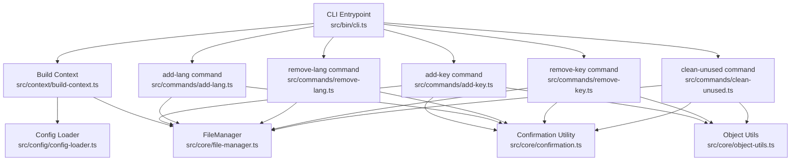
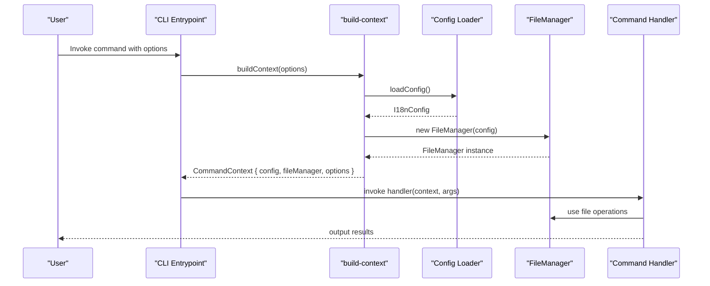
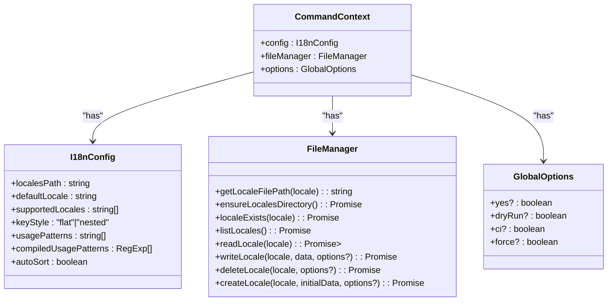
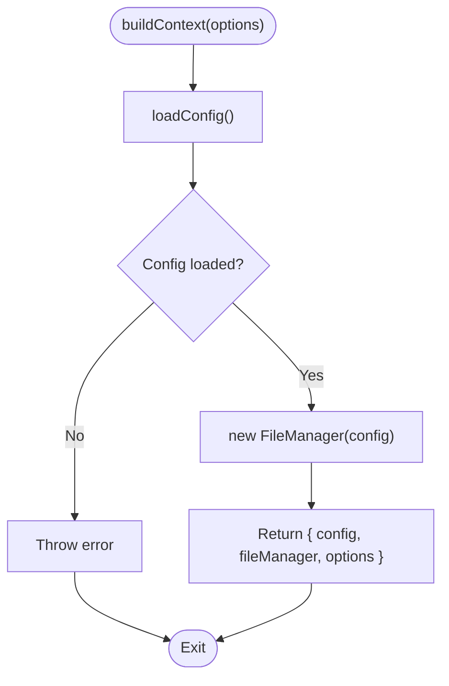
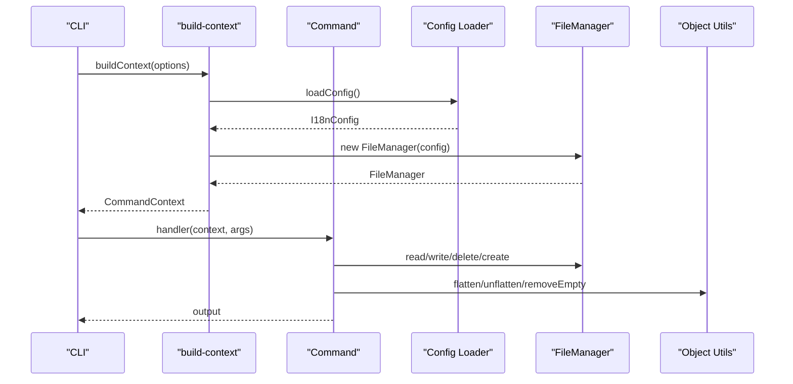
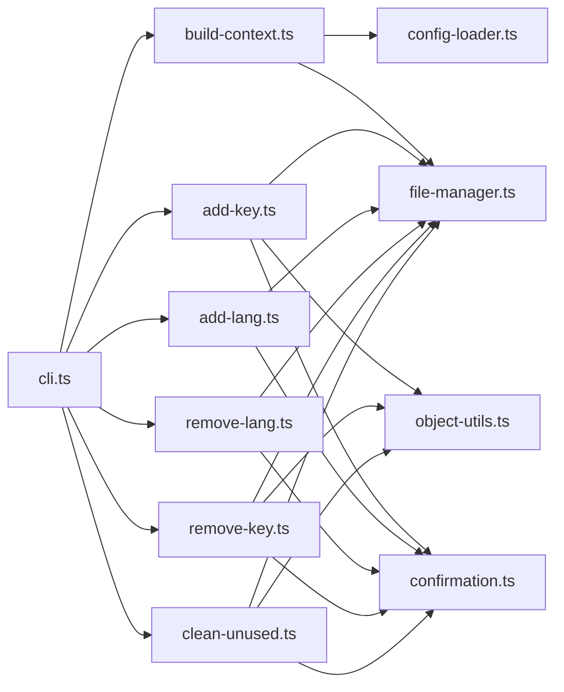

# Context Management & Dependency Injection

<cite>
**Referenced Files in This Document**
- [cli.ts](file://src/bin/cli.ts)
- [build-context.ts](file://src/context/build-context.ts)
- [types.ts](file://src/context/types.ts)
- [config-loader.ts](file://src/config/config-loader.ts)
- [types.ts](file://src/config/types.ts)
- [file-manager.ts](file://src/core/file-manager.ts)
- [add-key.ts](file://src/commands/add-key.ts)
- [add-lang.ts](file://src/commands/add-lang.ts)
- [remove-lang.ts](file://src/commands/remove-lang.ts)
- [remove-key.ts](file://src/commands/remove-key.ts)
- [clean-unused.ts](file://src/commands/clean-unused.ts)
- [confirmation.ts](file://src/core/confirmation.ts)
- [object-utils.ts](file://src/core/object-utils.ts)
- [build-context.test.ts](file://src/context/build-context.test.ts)
- [init.test.ts](file://src/commands/init.test.ts)
</cite>

## Table of Contents
1. [Introduction](#introduction)
2. [Project Structure](#project-structure)
3. [Core Components](#core-components)
4. [Architecture Overview](#architecture-overview)
5. [Detailed Component Analysis](#detailed-component-analysis)
6. [Dependency Analysis](#dependency-analysis)
7. [Performance Considerations](#performance-considerations)
8. [Troubleshooting Guide](#troubleshooting-guide)
9. [Conclusion](#conclusion)

## Introduction
This document explains the context management system that implements a lightweight dependency injection pattern. It focuses on how the build-context function creates and manages shared resources across command executions, the CommandContext interface and its role in providing configuration, file manager instances, and global options to command handlers, and the dependency resolution, resource initialization, and lifecycle management. It also demonstrates how commands access shared services and configuration in various scenarios and highlights the benefits for testability, modularity, and resource sharing.

## Project Structure
The context management system spans several modules:
- CLI entrypoint wires commands and builds the context per command invocation.
- Context builder resolves configuration and constructs a shared file manager instance.
- Commands receive the context and use configuration and file manager for their operations.
- Supporting utilities provide configuration validation, file operations, and option-driven behavior.

**Diagram sources**
- [cli.ts:1-122](file://src/bin/cli.ts#L1-L122)
- [build-context.ts:1-16](file://src/context/build-context.ts#L1-L16)
- [config-loader.ts:1-176](file://src/config/config-loader.ts#L1-L176)
- [file-manager.ts:1-118](file://src/core/file-manager.ts#L1-L118)
- [add-key.ts:1-93](file://src/commands/add-key.ts#L1-L93)
- [add-lang.ts:1-98](file://src/commands/add-lang.ts#L1-L98)
- [remove-lang.ts:1-74](file://src/commands/remove-lang.ts#L1-L74)
- [remove-key.ts:1-96](file://src/commands/remove-key.ts#L1-L96)
- [clean-unused.ts:1-138](file://src/commands/clean-unused.ts#L1-L138)
- [confirmation.ts:1-43](file://src/core/confirmation.ts#L1-L43)
- [object-utils.ts:1-95](file://src/core/object-utils.ts#L1-L95)

**Section sources**
- [cli.ts:1-122](file://src/bin/cli.ts#L1-L122)
- [build-context.ts:1-16](file://src/context/build-context.ts#L1-L16)
- [types.ts:1-15](file://src/context/types.ts#L1-L15)
- [config-loader.ts:1-176](file://src/config/config-loader.ts#L1-L176)
- [types.ts:1-12](file://src/config/types.ts#L1-L12)
- [file-manager.ts:1-118](file://src/core/file-manager.ts#L1-L118)

## Core Components
- CommandContext interface: Defines the contract for shared resources passed to commands. It includes configuration, a file manager instance, and global options.
- build-context function: Resolves configuration, instantiates the file manager with the resolved configuration, and returns a context object.
- CLI wiring: Each command action builds a fresh context from the parsed options, ensuring isolation between command invocations while reusing shared resources within a single command execution.

Benefits:
- Modularity: Commands depend on abstractions (CommandContext) rather than concrete implementations.
- Testability: Context creation is deterministic and easily mocked for unit tests.
- Resource sharing: FileManager is constructed once per context and reused across operations within a command.

**Section sources**
- [types.ts:11-15](file://src/context/types.ts#L11-L15)
- [build-context.ts:5-16](file://src/context/build-context.ts#L5-L16)
- [cli.ts:47-48](file://src/bin/cli.ts#L47-L48)
- [cli.ts:58-59](file://src/bin/cli.ts#L58-L59)
- [cli.ts:73-74](file://src/bin/cli.ts#L73-L74)
- [cli.ts:86-87](file://src/bin/cli.ts#L86-L87)
- [cli.ts:97-98](file://src/bin/cli.ts#L97-L98)
- [cli.ts:108-109](file://src/bin/cli.ts#L108-L109)

## Architecture Overview
The dependency injection pattern here is minimal and functional:
- The CLI registers commands and attaches actions.
- Each action invokes build-context with the parsed options to obtain a CommandContext.
- Commands consume the context to access configuration and services (FileManager).
- Configuration is loaded once per context and passed into FileManager to configure filesystem paths and behavior.

**Diagram sources**
- [cli.ts:47-48](file://src/bin/cli.ts#L47-L48)
- [build-context.ts:5-16](file://src/context/build-context.ts#L5-L16)
- [config-loader.ts:24-67](file://src/config/config-loader.ts#L24-L67)
- [file-manager.ts:9-12](file://src/core/file-manager.ts#L9-L12)
- [add-key.ts:7-11](file://src/commands/add-key.ts#L7-L11)

## Detailed Component Analysis

### CommandContext Interface
- Purpose: Centralized container for shared resources used by command handlers.
- Members:
  - config: I18nConfig resolved from the project configuration file.
  - fileManager: FileManager instance configured with the resolved config.
  - options: GlobalOptions derived from CLI flags.

**Diagram sources**
- [types.ts:11-15](file://src/context/types.ts#L11-L15)
- [types.ts:3-11](file://src/config/types.ts#L3-L11)
- [file-manager.ts:5-118](file://src/core/file-manager.ts#L5-L118)

**Section sources**
- [types.ts:11-15](file://src/context/types.ts#L11-L15)
- [types.ts:3-11](file://src/config/types.ts#L3-L11)

### build-context Function
- Responsibilities:
  - Load configuration from the project root configuration file.
  - Instantiate FileManager with the loaded configuration.
  - Return a CommandContext containing config, fileManager, and options.
- Behavior:
  - Throws if configuration is missing or invalid.
  - Creates a new FileManager instance per context.
  - Propagates all provided global options.

**Diagram sources**
- [build-context.ts:5-16](file://src/context/build-context.ts#L5-L16)
- [config-loader.ts:24-67](file://src/config/config-loader.ts#L24-L67)
- [file-manager.ts:9-12](file://src/core/file-manager.ts#L9-L12)

**Section sources**
- [build-context.ts:5-16](file://src/context/build-context.ts#L5-L16)
- [config-loader.ts:24-67](file://src/config/config-loader.ts#L24-L67)
- [file-manager.ts:9-12](file://src/core/file-manager.ts#L9-L12)

### CLI Integration and Command Actions
- Each command action:
  - Builds a fresh CommandContext from the parsed options.
  - Invokes the corresponding command handler with the context and arguments.
- This ensures:
  - Isolation between command invocations.
  - Consistent access to configuration and services within a single command execution.

Examples:
- add:lang action builds context and passes it to addLang.
- remove:key action builds context and passes it to removeKeyCommand.
- clean:unused action builds context and passes it to cleanUnusedCommand.

**Section sources**
- [cli.ts:47-48](file://src/bin/cli.ts#L47-L48)
- [cli.ts:58-59](file://src/bin/cli.ts#L58-L59)
- [cli.ts:73-74](file://src/bin/cli.ts#L73-L74)
- [cli.ts:86-87](file://src/bin/cli.ts#L86-L87)
- [cli.ts:97-98](file://src/bin/cli.ts#L97-L98)
- [cli.ts:108-109](file://src/bin/cli.ts#L108-L109)

### Command Handlers Using CommandContext
- add-key command:
  - Uses context.config to access supported locales and key style.
  - Uses context.fileManager to read/write locale files.
  - Uses context.options for yes/dryRun/ci flags.
  - Uses object utilities to flatten/unflatten and validate structures.
- add-lang command:
  - Uses context.config for supported locales and validation.
  - Uses context.fileManager to create locale files.
  - Uses confirmation utility for user prompts.
- remove-lang command:
  - Uses context.config to validate locale presence and prevent removing default locale.
  - Uses context.fileManager to delete locale files.
- remove-key command:
  - Uses context.config and fileManager to scan and remove keys.
  - Uses object utilities to manage nested vs flat structures.
- clean-unused command:
  - Uses context.config for compiled usage patterns.
  - Uses context.fileManager to read/write locales.
  - Uses object utilities to flatten/unflatten and remove empty objects.

**Diagram sources**
- [build-context.ts:5-16](file://src/context/build-context.ts#L5-L16)
- [config-loader.ts:24-67](file://src/config/config-loader.ts#L24-L67)
- [file-manager.ts:31-98](file://src/core/file-manager.ts#L31-L98)
- [add-key.ts:12-77](file://src/commands/add-key.ts#L12-L77)
- [remove-key.ts:29-79](file://src/commands/remove-key.ts#L29-L79)
- [clean-unused.ts:52-122](file://src/commands/clean-unused.ts#L52-L122)
- [object-utils.ts:17-94](file://src/core/object-utils.ts#L17-L94)

**Section sources**
- [add-key.ts:7-11](file://src/commands/add-key.ts#L7-L11)
- [add-key.ts:12-77](file://src/commands/add-key.ts#L12-L77)
- [add-lang.ts:26-81](file://src/commands/add-lang.ts#L26-L81)
- [remove-lang.ts:5-57](file://src/commands/remove-lang.ts#L5-L57)
- [remove-key.ts:10-79](file://src/commands/remove-key.ts#L10-L79)
- [clean-unused.ts:8-124](file://src/commands/clean-unused.ts#L8-L124)
- [object-utils.ts:17-94](file://src/core/object-utils.ts#L17-L94)

### Dependency Resolution and Lifecycle
- Resolution order:
  - CLI action -> build-context -> loadConfig -> FileManager constructor.
- Lifecycle:
  - One context per command invocation.
  - FileManager instance bound to the resolved configuration for the duration of that context.
  - Options propagated from CLI to context and consumed by commands for behavior control.

**Section sources**
- [cli.ts:47-48](file://src/bin/cli.ts#L47-L48)
- [build-context.ts:5-16](file://src/context/build-context.ts#L5-L16)
- [config-loader.ts:24-67](file://src/config/config-loader.ts#L24-L67)
- [file-manager.ts:9-12](file://src/core/file-manager.ts#L9-L12)

### Examples of Context Usage Across Commands
- add:key:
  - Accesses config.supportedLocales and keyStyle.
  - Uses fileManager.readLocale and fileManager.writeLocale.
  - Uses options.yes, options.dryRun, options.ci for behavior.
- add-lang:
  - Validates locale via config and fileManager.localeExists.
  - Uses fileManager.createLocale with optional base content.
  - Uses confirmation utility for prompts.
- remove-lang:
  - Validates locale presence and prevents removing default locale.
  - Uses fileManager.deleteLocale.
- remove-key:
  - Scans locales, flattens data, deletes keys, rebuilds structure.
  - Uses fileManager.writeLocale with dryRun option.
- clean-unused:
  - Uses config.compiledUsagePatterns to scan source files.
  - Reads default locale, computes unused keys, writes updated locales.

**Section sources**
- [add-key.ts:12-77](file://src/commands/add-key.ts#L12-L77)
- [add-lang.ts:31-81](file://src/commands/add-lang.ts#L31-L81)
- [remove-lang.ts:9-57](file://src/commands/remove-lang.ts#L9-L57)
- [remove-key.ts:14-79](file://src/commands/remove-key.ts#L14-L79)
- [clean-unused.ts:11-124](file://src/commands/clean-unused.ts#L11-L124)

## Dependency Analysis
- Direct dependencies:
  - build-context depends on config-loader and file-manager.
  - CLI depends on build-context and all command handlers.
  - Command handlers depend on CommandContext members and utilities.
- Indirect dependencies:
  - Commands rely on object-utils for key manipulation.
  - Commands rely on confirmation utility for user prompts.
- Cohesion and coupling:
  - High cohesion within commands around shared context.
  - Low coupling between commands and underlying services via CommandContext.

**Diagram sources**
- [cli.ts:1-122](file://src/bin/cli.ts#L1-L122)
- [build-context.ts:1-16](file://src/context/build-context.ts#L1-L16)
- [config-loader.ts:1-176](file://src/config/config-loader.ts#L1-L176)
- [file-manager.ts:1-118](file://src/core/file-manager.ts#L1-L118)
- [add-key.ts:1-93](file://src/commands/add-key.ts#L1-L93)
- [add-lang.ts:1-98](file://src/commands/add-lang.ts#L1-L98)
- [remove-lang.ts:1-74](file://src/commands/remove-lang.ts#L1-L74)
- [remove-key.ts:1-96](file://src/commands/remove-key.ts#L1-L96)
- [clean-unused.ts:1-138](file://src/commands/clean-unused.ts#L1-L138)
- [object-utils.ts:1-95](file://src/core/object-utils.ts#L1-L95)
- [confirmation.ts:1-43](file://src/core/confirmation.ts#L1-L43)

**Section sources**
- [cli.ts:1-122](file://src/bin/cli.ts#L1-L122)
- [build-context.ts:1-16](file://src/context/build-context.ts#L1-L16)
- [file-manager.ts:1-118](file://src/core/file-manager.ts#L1-L118)
- [object-utils.ts:1-95](file://src/core/object-utils.ts#L1-L95)
- [confirmation.ts:1-43](file://src/core/confirmation.ts#L1-L43)

## Performance Considerations
- Context creation cost:
  - Configuration loading occurs once per context; keep configuration small and avoid heavy parsing overhead.
  - FileManager construction is lightweight; it primarily stores a path and config reference.
- File operations:
  - readLocale/writeLocale/deleteLocale/createLocale perform disk I/O; consider batching operations within a single command when possible.
- Dry run mode:
  - Many commands support dryRun to avoid unnecessary I/O during previews.

[No sources needed since this section provides general guidance]

## Troubleshooting Guide
Common issues and resolutions:
- Missing configuration file:
  - Symptom: Error indicating configuration file not found.
  - Cause: Project root lacks the configuration file.
  - Resolution: Run the init command to generate the configuration file.
- Invalid configuration:
  - Symptom: Error listing validation issues.
  - Cause: Unsupported locales, missing default locale, or invalid regex usage patterns.
  - Resolution: Fix configuration fields according to validation messages.
- Locale file errors:
  - Symptom: Errors about missing or invalid locale files.
  - Cause: Attempting to read/write non-existent or malformed locale files.
  - Resolution: Ensure locales directory and files exist; verify JSON validity.
- CI mode failures:
  - Symptom: Errors requiring explicit confirmation in CI mode.
  - Cause: Running without --yes in CI mode.
  - Resolution: Add --yes to approve changes or run with --dry-run to preview.

**Section sources**
- [config-loader.ts:27-54](file://src/config/config-loader.ts#L27-L54)
- [file-manager.ts:34-42](file://src/core/file-manager.ts#L34-L42)
- [confirmation.ts:20-25](file://src/core/confirmation.ts#L20-L25)

## Conclusion
The context management system implements a clean, minimal dependency injection pattern:
- build-context centralizes resource creation and configuration resolution.
- CommandContext provides a stable interface for commands to access configuration and services.
- CLI actions ensure each command execution receives a fresh context, enabling predictable behavior and easy testing.
- Benefits include improved modularity, testability, and consistent resource sharing across the application.

[No sources needed since this section summarizes without analyzing specific files]