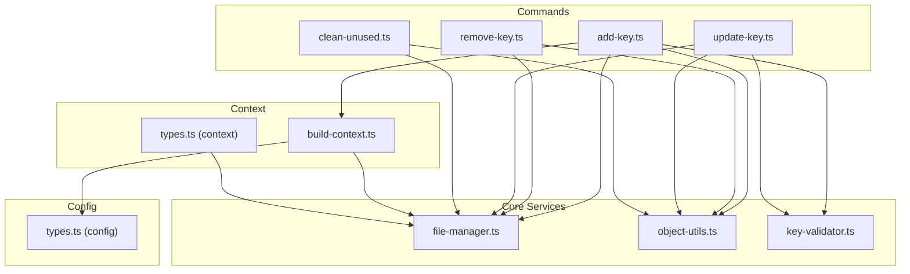
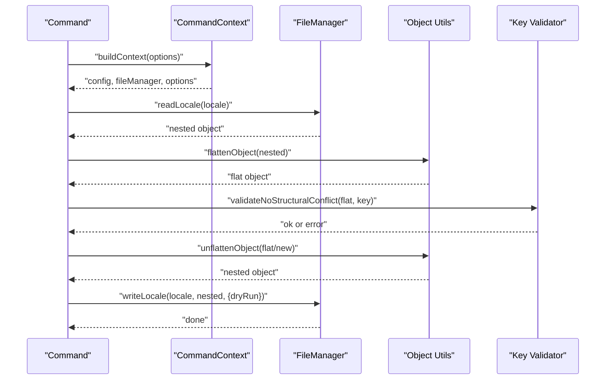
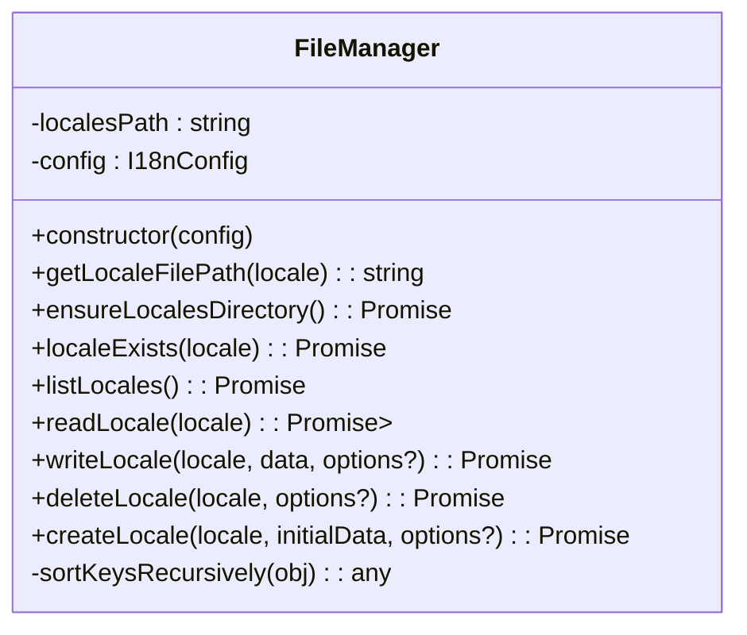
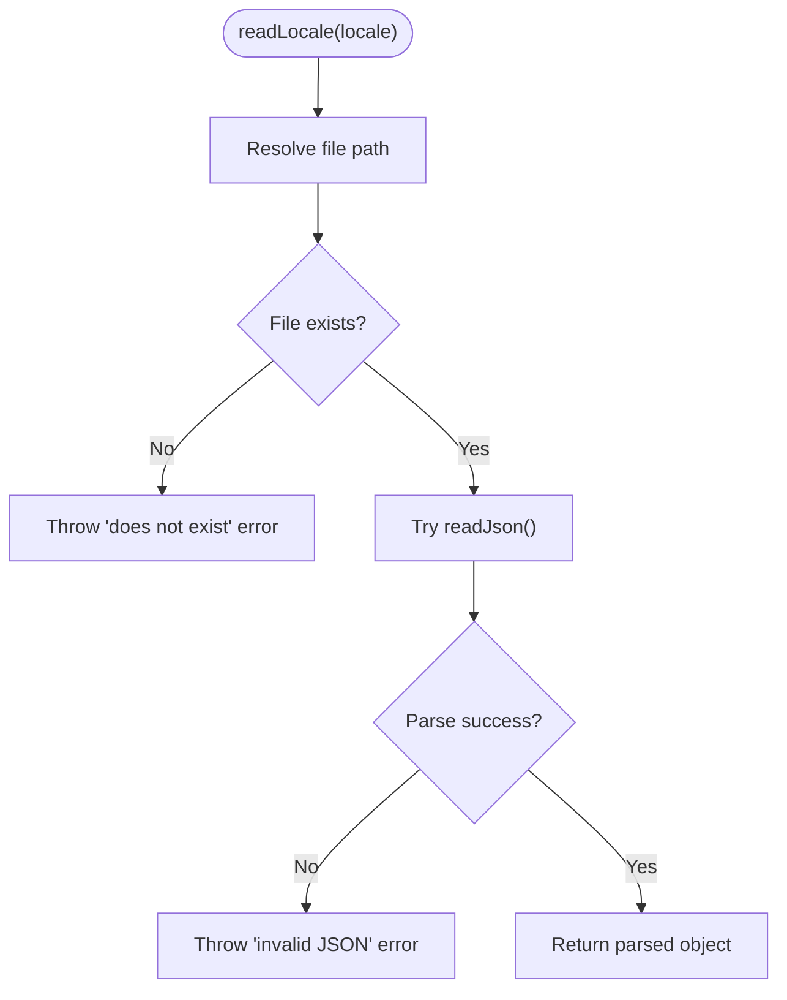
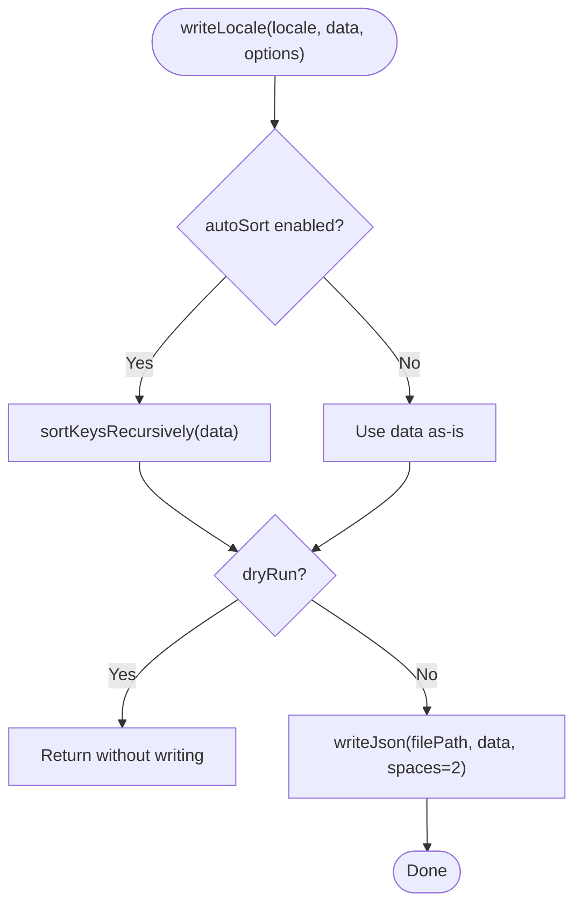
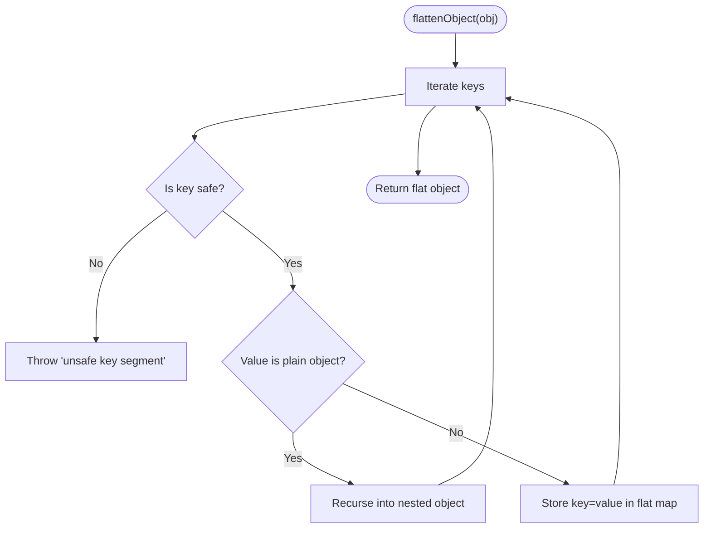
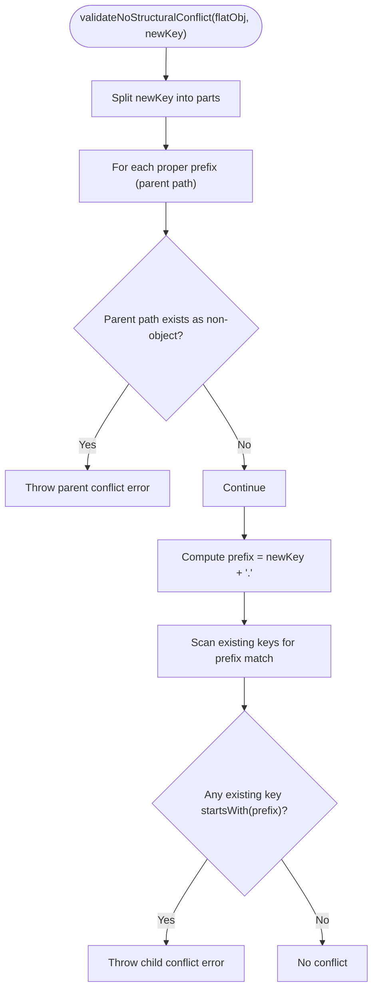
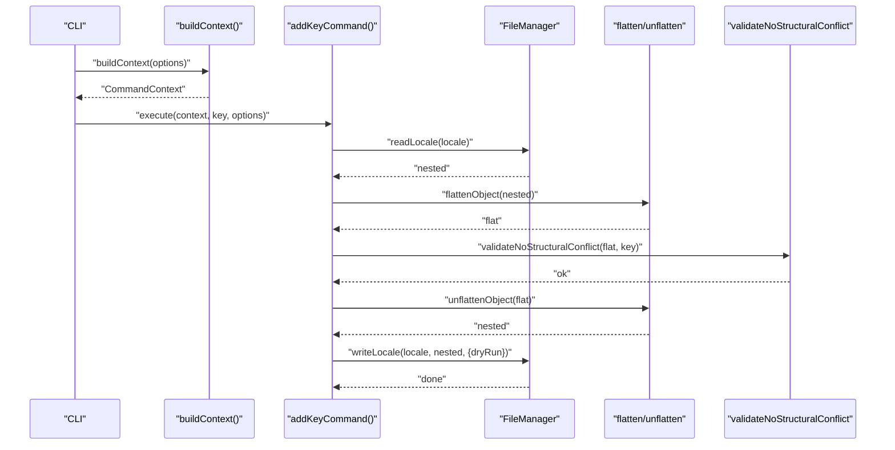
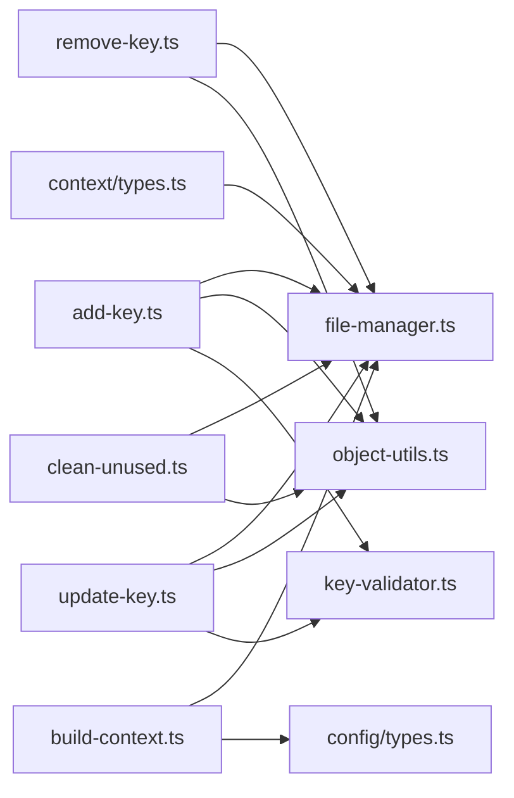

# Core Services & Utilities

<cite>
**Referenced Files in This Document**
- [file-manager.ts](file://src/core/file-manager.ts)
- [object-utils.ts](file://src/core/object-utils.ts)
- [key-validator.ts](file://src/core/key-validator.ts)
- [build-context.ts](file://src/context/build-context.ts)
- [types.ts](file://src/context/types.ts)
- [types.ts](file://src/config/types.ts)
- [add-key.ts](file://src/commands/add-key.ts)
- [remove-key.ts](file://src/commands/remove-key.ts)
- [update-key.ts](file://src/commands/update-key.ts)
- [clean-unused.ts](file://src/commands/clean-unused.ts)
- [translation-service.ts](file://src/services/translation-service.ts)
- [README.md](file://README.md)
</cite>

## Table of Contents
1. [Introduction](#introduction)
2. [Project Structure](#project-structure)
3. [Core Components](#core-components)
4. [Architecture Overview](#architecture-overview)
5. [Detailed Component Analysis](#detailed-component-analysis)
6. [Dependency Analysis](#dependency-analysis)
7. [Performance Considerations](#performance-considerations)
8. [Troubleshooting Guide](#troubleshooting-guide)
9. [Conclusion](#conclusion)
10. [Appendices](#appendices)

## Introduction
This document explains the core services layer responsible for file management, object utilities, and validation systems. It focuses on:
- FileManager: a locale file abstraction supporting read/write operations, path resolution, and dry-run safety.
- Object utilities: flattening/unflattening nested objects, key-style conversion helpers, and safety validation.
- Key validator: structural conflict prevention ensuring translation integrity across nested and flat key styles.

It also demonstrates how these services integrate with the broader architecture and are reused across command implementations.

## Project Structure
The core services live under src/core and are consumed by commands under src/commands. Context builders assemble services and configuration for commands.

**Diagram sources**
- [add-key.ts:1-93](file://src/commands/add-key.ts#L1-L93)
- [remove-key.ts:1-96](file://src/commands/remove-key.ts#L1-L96)
- [update-key.ts:1-103](file://src/commands/update-key.ts#L1-L103)
- [clean-unused.ts:1-138](file://src/commands/clean-unused.ts#L1-L138)
- [build-context.ts:1-16](file://src/context/build-context.ts#L1-L16)
- [types.ts:1-15](file://src/context/types.ts#L1-L15)
- [file-manager.ts:1-118](file://src/core/file-manager.ts#L1-L118)
- [object-utils.ts:1-95](file://src/core/object-utils.ts#L1-L95)
- [key-validator.ts:1-33](file://src/core/key-validator.ts#L1-L33)
- [types.ts:1-12](file://src/config/types.ts#L1-L12)

**Section sources**
- [build-context.ts:1-16](file://src/context/build-context.ts#L1-L16)
- [types.ts:1-15](file://src/context/types.ts#L1-L15)
- [types.ts:1-12](file://src/config/types.ts#L1-L12)

## Core Components
- FileManager: encapsulates locale file operations with path resolution, existence checks, read/write/delete/create, recursive key sorting, and dry-run support.
- Object utilities: safe flattening/unflattening, key extraction, and removal of empty objects; includes safety checks against dangerous key segments.
- Key validator: prevents structural conflicts when introducing new keys in flat representation, preserving nested vs flat integrity.

**Section sources**
- [file-manager.ts:1-118](file://src/core/file-manager.ts#L1-L118)
- [object-utils.ts:1-95](file://src/core/object-utils.ts#L1-L95)
- [key-validator.ts:1-33](file://src/core/key-validator.ts#L1-L33)

## Architecture Overview
The commands depend on the context to obtain configuration and FileManager. They orchestrate object transformations and validation before performing file writes. Dry-run and CI modes are propagated from global options.

**Diagram sources**
- [add-key.ts:1-93](file://src/commands/add-key.ts#L1-L93)
- [remove-key.ts:1-96](file://src/commands/remove-key.ts#L1-L96)
- [update-key.ts:1-103](file://src/commands/update-key.ts#L1-L103)
- [build-context.ts:1-16](file://src/context/build-context.ts#L1-L16)
- [file-manager.ts:1-118](file://src/core/file-manager.ts#L1-L118)
- [object-utils.ts:1-95](file://src/core/object-utils.ts#L1-L95)
- [key-validator.ts:1-33](file://src/core/key-validator.ts#L1-L33)

## Detailed Component Analysis

### FileManager: Locale File Operations
FileManager centralizes locale file handling:
- Path resolution: resolves locales directory relative to current working directory.
- Existence and listing: checks file existence and lists supported locales from configuration.
- Read: validates JSON and throws descriptive errors for missing or malformed files.
- Write: supports recursive key sorting when enabled and dry-run mode.
- Delete: ensures file exists before deletion and respects dry-run.
- Create: ensures directory exists, checks absence of target file, and writes with formatting.

Dry-run support is exposed via an options parameter allowing commands to preview changes without writing.

**Diagram sources**
- [file-manager.ts:1-118](file://src/core/file-manager.ts#L1-L118)

**Section sources**
- [file-manager.ts:1-118](file://src/core/file-manager.ts#L1-L118)

#### Read Operation Flow

**Diagram sources**
- [file-manager.ts:31-43](file://src/core/file-manager.ts#L31-L43)

#### Write Operation Flow

**Diagram sources**
- [file-manager.ts:45-61](file://src/core/file-manager.ts#L45-L61)

### Object Utilities: Flattening, Unflattening, and Safety
Object utilities provide:
- flattenObject: converts nested objects to flat dot-notation keys with safety checks against dangerous key segments.
- unflattenObject: restores nested structure from flat keys with safety checks.
- getAllFlatKeys: convenience to extract all flattened keys.
- removeEmptyObjects: prunes empty objects and undefined values while preserving arrays and non-empty objects.

Safety validation ensures keys like __proto__, constructor, and prototype are rejected during flattening/unflattening and empty object removal.

**Diagram sources**
- [object-utils.ts:17-39](file://src/core/object-utils.ts#L17-L39)

**Section sources**
- [object-utils.ts:1-95](file://src/core/object-utils.ts#L1-L95)

### Key Validator: Structural Conflict Prevention
The validator prevents structural conflicts when adding keys:
- Parent conflict: ensures none of the parent paths of the new key are already defined as non-object values.
- Child conflict: ensures the new key would not overwrite existing nested descendants.

This preserves translation integrity across both flat and nested key styles.

**Diagram sources**
- [key-validator.ts:1-33](file://src/core/key-validator.ts#L1-L33)

**Section sources**
- [key-validator.ts:1-33](file://src/core/key-validator.ts#L1-L33)

### Integration with Commands and Context
Commands consume the context to access configuration and FileManager. They:
- Read locale files.
- Flatten to flat representation for validation and manipulation.
- Apply validators and transformations.
- Rebuild nested structure if needed.
- Write back with dry-run support.

**Diagram sources**
- [build-context.ts:1-16](file://src/context/build-context.ts#L1-L16)
- [add-key.ts:1-93](file://src/commands/add-key.ts#L1-L93)
- [file-manager.ts:1-118](file://src/core/file-manager.ts#L1-L118)
- [object-utils.ts:1-95](file://src/core/object-utils.ts#L1-L95)
- [key-validator.ts:1-33](file://src/core/key-validator.ts#L1-L33)

**Section sources**
- [build-context.ts:1-16](file://src/context/build-context.ts#L1-L16)
- [add-key.ts:1-93](file://src/commands/add-key.ts#L1-L93)
- [remove-key.ts:1-96](file://src/commands/remove-key.ts#L1-L96)
- [update-key.ts:1-103](file://src/commands/update-key.ts#L1-L103)
- [clean-unused.ts:1-138](file://src/commands/clean-unused.ts#L1-L138)

## Dependency Analysis
- Commands depend on:
  - Context for config and FileManager.
  - Object utils for transformations.
  - Key validator for structural checks.
- FileManager depends on:
  - fs-extra for filesystem operations.
  - Config types for runtime behavior (autoSort, keyStyle).
- Context builds the FileManager from I18nConfig.

**Diagram sources**
- [add-key.ts:1-93](file://src/commands/add-key.ts#L1-L93)
- [remove-key.ts:1-96](file://src/commands/remove-key.ts#L1-L96)
- [update-key.ts:1-103](file://src/commands/update-key.ts#L1-L103)
- [clean-unused.ts:1-138](file://src/commands/clean-unused.ts#L1-L138)
- [build-context.ts:1-16](file://src/context/build-context.ts#L1-L16)
- [types.ts:1-12](file://src/config/types.ts#L1-L12)
- [types.ts:1-15](file://src/context/types.ts#L1-L15)
- [file-manager.ts:1-118](file://src/core/file-manager.ts#L1-L118)
- [object-utils.ts:1-95](file://src/core/object-utils.ts#L1-L95)
- [key-validator.ts:1-33](file://src/core/key-validator.ts#L1-L33)

**Section sources**
- [build-context.ts:1-16](file://src/context/build-context.ts#L1-L16)
- [types.ts:1-15](file://src/context/types.ts#L1-L15)
- [types.ts:1-12](file://src/config/types.ts#L1-L12)

## Performance Considerations
- Recursive key sorting in write operations scales with the size of the object graph. For very large translation files, consider disabling autoSort or batching operations.
- Flattening/unflattening is linear in the number of keys; however, deep nesting increases recursion depth. Keep key paths reasonably shallow for large datasets.
- Dry-run mode avoids disk I/O, enabling fast previews without performance penalties.

[No sources needed since this section provides general guidance]

## Troubleshooting Guide
Common issues and resolutions:
- Locale file does not exist: FileManager.readLocale throws a descriptive error. Verify the locale code and file presence.
- Invalid JSON in locale file: FileManager.readLocale throws a parsing error. Fix syntax or regenerate the file.
- Attempting to create an existing locale: FileManager.createLocale throws an error. Choose a different locale code or remove the existing file.
- Structural conflict when adding keys: validateNoStructuralConflict throws when parent or child conflicts are detected. Adjust the key path to avoid conflicts.
- Unsafe key segments: flatten/unflatten/removeEmptyObjects reject keys like __proto__, constructor, and prototype. Rename keys to safe identifiers.
- Dry-run mode: Changes are not written when dryRun is enabled. Use this to preview changes before applying.

**Section sources**
- [file-manager.ts:31-98](file://src/core/file-manager.ts#L31-L98)
- [object-utils.ts:3-15](file://src/core/object-utils.ts#L3-L15)
- [key-validator.ts:1-33](file://src/core/key-validator.ts#L1-L33)

## Conclusion
The core services layer provides robust, reusable functionality for locale file management, object transformations, and structural validation. Together with the context builder and commands, they enable consistent, safe, and predictable operations across the CLI tool. Dry-run and CI-friendly patterns ensure safe automation and preview workflows.

[No sources needed since this section summarizes without analyzing specific files]

## Appendices

### Example Usage Patterns Across Commands
- Adding a key: commands flatten locales, validate structural integrity, set default or empty values, and write back respecting keyStyle and dry-run.
- Updating a key: commands validate existence and structural integrity, prompt for confirmation (respecting CI and yes flags), then write.
- Removing a key: commands scan locales, confirm action, remove keys, rebuild structure, and write back.
- Cleaning unused keys: commands scan source code for used keys, compute differences, and remove from all locales.

These patterns consistently leverage FileManager, object utilities, and validators to maintain translation integrity and user control.

**Section sources**
- [add-key.ts:1-93](file://src/commands/add-key.ts#L1-L93)
- [update-key.ts:1-103](file://src/commands/update-key.ts#L1-L103)
- [remove-key.ts:1-96](file://src/commands/remove-key.ts#L1-L96)
- [clean-unused.ts:1-138](file://src/commands/clean-unused.ts#L1-L138)

### Programmatic API Notes
- TranslationService demonstrates a simple façade around a translator provider, illustrating how services can be composed and extended.
- The Programmatic API section in the README outlines how to use FileManager and config loader directly in Node.js applications.

**Section sources**
- [translation-service.ts:1-18](file://src/services/translation-service.ts#L1-L18)
- [README.md:285-317](file://README.md#L285-L317)