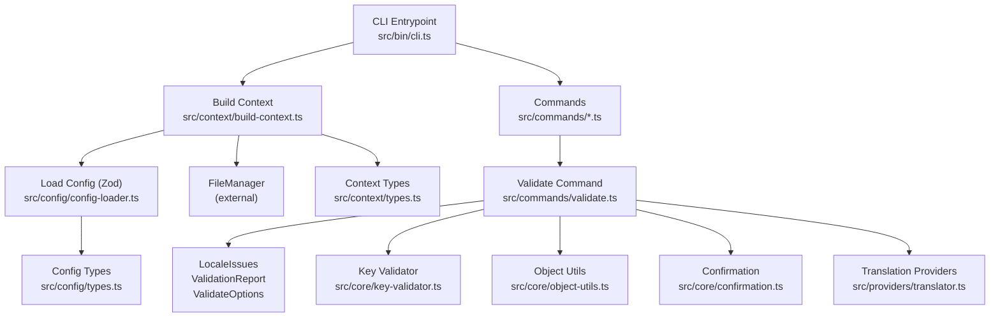
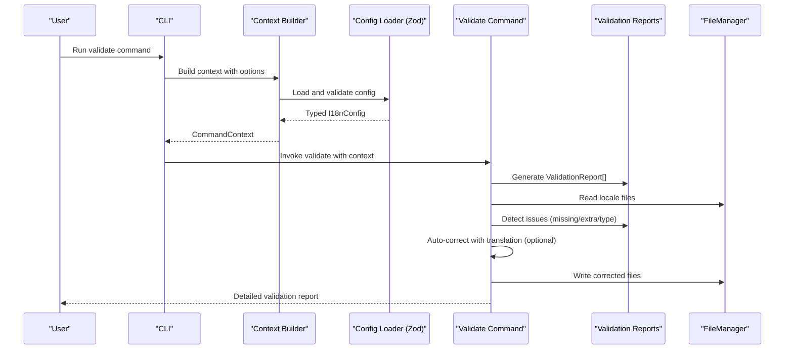
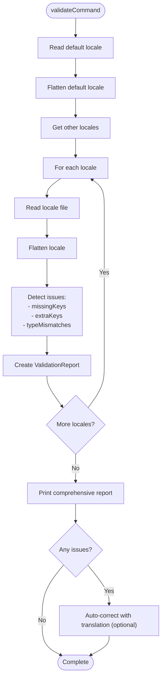
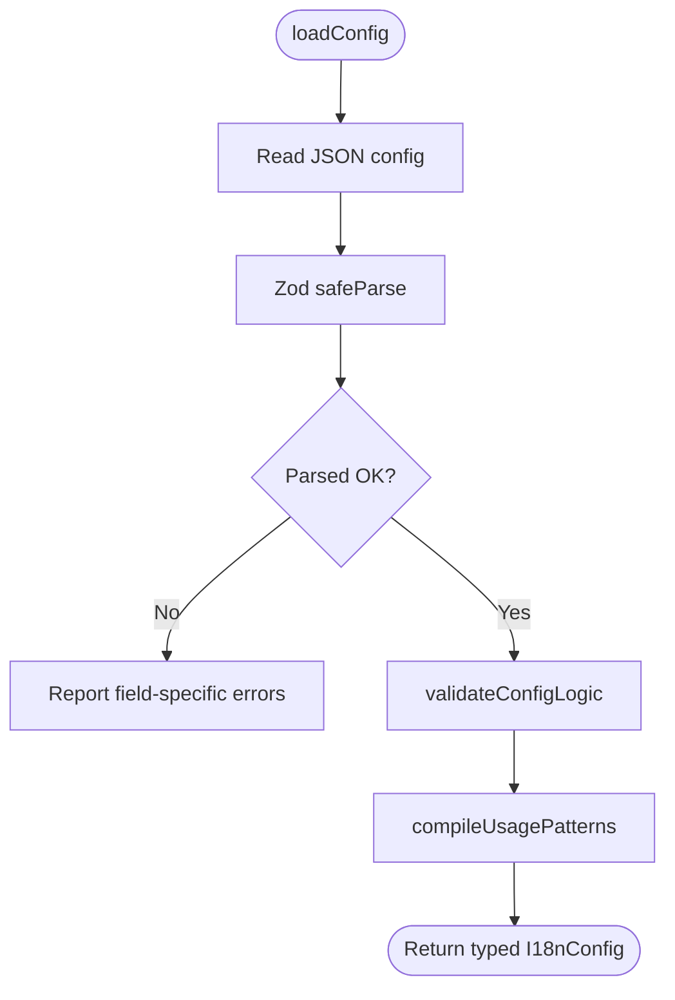
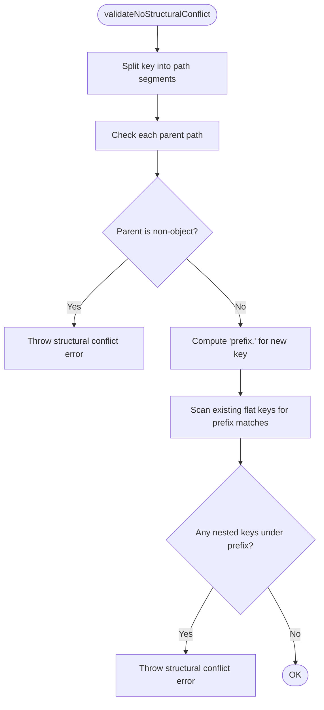
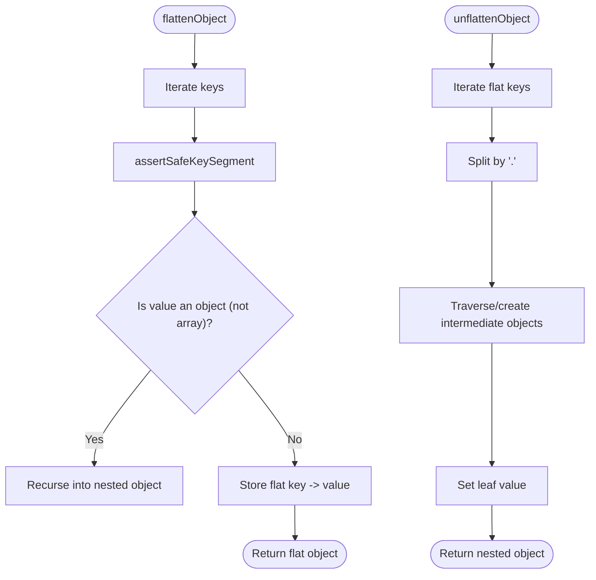
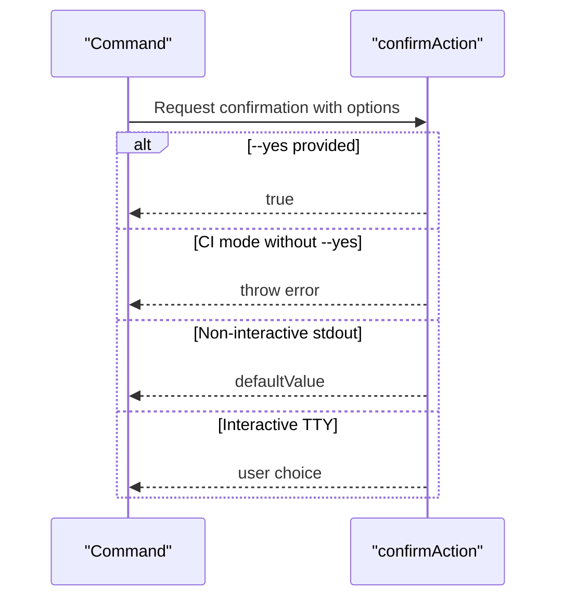
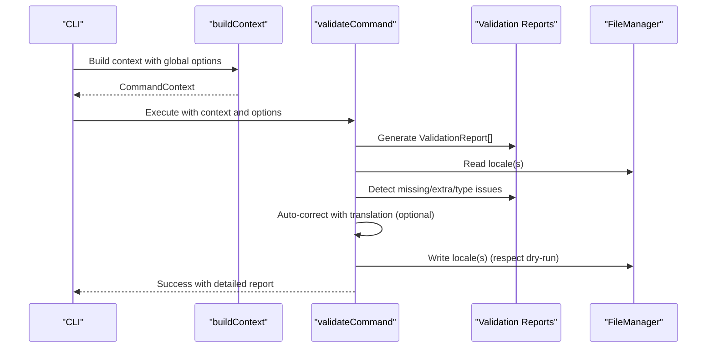
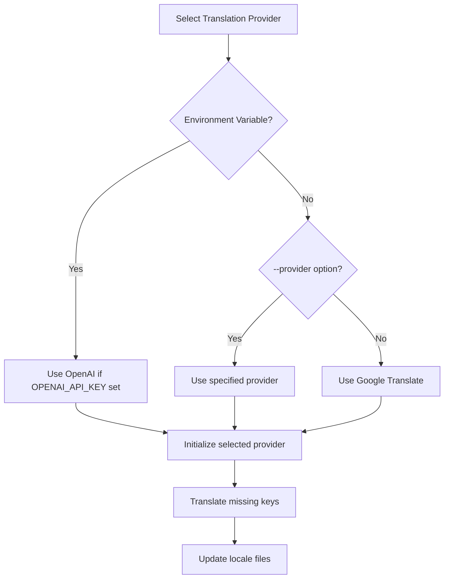
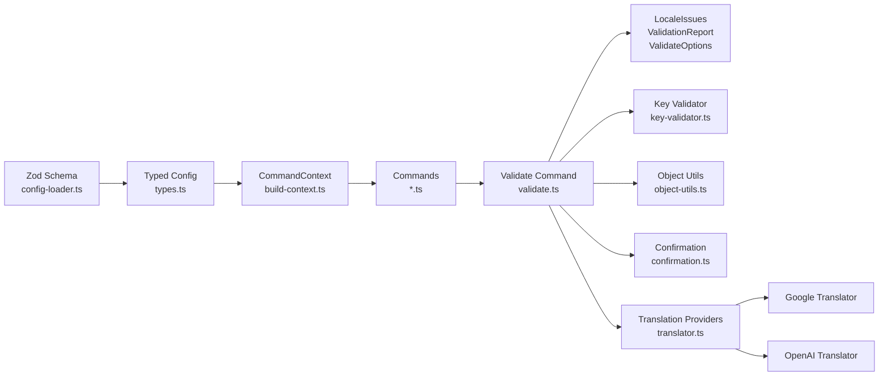

# Data Validation & Type Safety

<cite>
**Referenced Files in This Document**
- [cli.ts](file://src/bin/cli.ts)
- [build-context.ts](file://src/context/build-context.ts)
- [types.ts](file://src/context/types.ts)
- [config-loader.ts](file://src/config/config-loader.ts)
- [types.ts](file://src/config/types.ts)
- [confirmation.ts](file://src/core/confirmation.ts)
- [object-utils.ts](file://src/core/object-utils.ts)
- [key-validator.ts](file://src/core/key-validator.ts)
- [validate.ts](file://src/commands/validate.ts)
- [validate.test.ts](file://src/commands/validate.test.ts)
- [translator.ts](file://src/providers/translator.ts)
- [translator.test.ts](file://src/providers/translator.test.ts)
- [init.ts](file://src/commands/init.ts)
- [add-key.ts](file://src/commands/add-key.ts)
- [update-key.ts](file://src/commands/update-key.ts)
- [remove-key.ts](file://src/commands/remove-key.ts)
- [clean-unused.ts](file://src/commands/clean-unused.ts)
- [add-lang.ts](file://src/commands/add-lang.ts)
- [remove-lang.ts](file://src/commands/remove-lang.ts)
</cite>

## Update Summary
**Changes Made**
- Added comprehensive validation system with LocaleIssues, ValidationReport, and ValidateOptions interfaces
- Enhanced validation command with sophisticated type checking and structural validation
- Introduced automatic translation capabilities for missing keys
- Added detailed reporting system for validation issues
- Implemented CI-aware validation with auto-correction capabilities

## Table of Contents
1. [Introduction](#introduction)
2. [Project Structure](#project-structure)
3. [Core Components](#core-components)
4. [Architecture Overview](#architecture-overview)
5. [Detailed Component Analysis](#detailed-component-analysis)
6. [Dependency Analysis](#dependency-analysis)
7. [Performance Considerations](#performance-considerations)
8. [Troubleshooting Guide](#troubleshooting-guide)
9. [Conclusion](#conclusion)

## Introduction
This document explains the data validation and type safety systems that keep translation files structurally sound and prevent destructive operations. The system now includes sophisticated validation with comprehensive reporting, automatic translation capabilities, and CI-aware behavior. It covers:
- Structural conflict prevention during key mutations
- Translation file integrity safeguards with type checking
- Comprehensive validation reporting through LocaleIssues and ValidationReport interfaces
- Confirmation and batch safety mechanisms
- Type safety via TypeScript interfaces and Zod schemas
- Automatic translation of missing keys using external providers
- How validation integrates with command execution to improve reliability and user experience

## Project Structure
The validation and type safety logic spans configuration loading, context building, core utilities, validation command, and translation providers. The CLI orchestrates commands, builds a typed context, and delegates to validators, confirmation prompts, and translation providers before applying changes.

**Diagram sources**
- [cli.ts:1-162](file://src/bin/cli.ts#L1-L162)
- [build-context.ts:1-16](file://src/context/build-context.ts#L1-L16)
- [config-loader.ts:1-176](file://src/config/config-loader.ts#L1-L176)
- [validate.ts:1-254](file://src/commands/validate.ts#L1-L254)
- [translator.ts:1-60](file://src/providers/translator.ts#L1-L60)
- [types.ts:1-12](file://src/config/types.ts#L1-L12)
- [types.ts:1-15](file://src/context/types.ts#L1-L15)
- [key-validator.ts:1-33](file://src/core/key-validator.ts#L1-L33)
- [object-utils.ts:1-95](file://src/core/object-utils.ts#L1-L95)
- [confirmation.ts:1-43](file://src/core/confirmation.ts#L1-L43)

**Section sources**
- [cli.ts:1-162](file://src/bin/cli.ts#L1-L162)
- [build-context.ts:1-16](file://src/context/build-context.ts#L1-L16)

## Core Components
- Configuration validation with Zod ensures schema correctness and logical constraints (e.g., default locale inclusion and unique supported locales). Compiled usage patterns power scanning for unused keys.
- Structural conflict detection prevents adding keys that would overwrite or be overwritten by existing nested structures.
- Safe object flattening/unflattening guards against unsafe key segments and supports robust reconstruction of nested structures.
- Confirmation prompts enforce explicit consent for destructive actions, with CI-aware behavior and dry-run previews.
- **Enhanced** Comprehensive validation system with LocaleIssues interface for detailed issue tracking, ValidationReport for structured reporting, and ValidateOptions for configuration flexibility.
- **Enhanced** Automatic translation capabilities for missing keys using external providers (Google Translate, OpenAI).
- **Enhanced** Type mismatch detection and resolution for maintaining data consistency across locales.

**Section sources**
- [config-loader.ts:8-67](file://src/config/config-loader.ts#L8-L67)
- [key-validator.ts:1-33](file://src/core/key-validator.ts#L1-L33)
- [object-utils.ts:1-95](file://src/core/object-utils.ts#L1-L95)
- [confirmation.ts:1-43](file://src/core/confirmation.ts#L1-L43)
- [translator.ts:46-60](file://src/providers/translator.ts#L46-L60)
- [validate.ts:11-29](file://src/commands/validate.ts#L11-L29)

## Architecture Overview
The system validates early and often: configuration on startup, structural integrity during key operations, and comprehensive validation with detailed reporting during the validate command. Batch safety is enforced per command with optional dry runs, CI mode constraints, and automatic correction capabilities.

**Diagram sources**
- [cli.ts:126-151](file://src/bin/cli.ts#L126-L151)
- [build-context.ts:5-15](file://src/context/build-context.ts#L5-L15)
- [config-loader.ts:24-67](file://src/config/config-loader.ts#L24-L67)
- [validate.ts:121-254](file://src/commands/validate.ts#L121-L254)
- [translator.ts:52-59](file://src/providers/translator.ts#L52-L59)

## Detailed Component Analysis

### Enhanced Validation System with Comprehensive Reporting

**Updated** The validation system now includes sophisticated type checking and structural validation with three key interfaces:

#### LocaleIssues Interface
Tracks three types of validation issues:
- **missingKeys**: Keys present in default locale but absent in target locale
- **extraKeys**: Keys present in target locale but not in default locale  
- **typeMismatches**: Keys with same name but different data types between locales

#### ValidationReport Interface
Combines locale identification with its issues for structured reporting:
- **locale**: Target locale identifier
- **issues**: Complete LocaleIssues object containing all detected problems

#### ValidateOptions Interface
Configuration options for validation operations:
- **translator**: Optional translation provider for auto-correcting missing keys

**Diagram sources**
- [validate.ts:121-158](file://src/commands/validate.ts#L121-L158)
- [validate.ts:31-100](file://src/commands/validate.ts#L31-L100)
- [translator.ts:46-60](file://src/providers/translator.ts#L46-L60)

**Section sources**
- [translator.ts:46-60](file://src/providers/translator.ts#L46-L60)
- [validate.ts:11-29](file://src/commands/validate.ts#L11-L29)
- [validate.ts:31-100](file://src/commands/validate.ts#L31-L100)

### Configuration Validation with Zod
- Schema enforces required fields, types, and defaults.
- Logical validation ensures default locale is supported and supported locales are unique.
- Usage patterns are compiled into RegExp arrays with strict capturing-group requirements.

**Diagram sources**
- [config-loader.ts:24-67](file://src/config/config-loader.ts#L24-L67)
- [config-loader.ts:69-82](file://src/config/config-loader.ts#L69-L82)
- [config-loader.ts:84-109](file://src/config/config-loader.ts#L84-L109)

**Section sources**
- [config-loader.ts:8-17](file://src/config/config-loader.ts#L8-L17)
- [config-loader.ts:69-82](file://src/config/config-loader.ts#L69-L82)
- [config-loader.ts:84-109](file://src/config/config-loader.ts#L84-L109)
- [types.ts:3-11](file://src/config/types.ts#L3-L11)

### Structural Conflict Prevention
- Validates that adding a key does not violate existing parent or child relationships in flattened structures.
- Prevents overwriting non-object parents or nested children that would be lost.

**Diagram sources**
- [key-validator.ts:1-33](file://src/core/key-validator.ts#L1-L33)

**Section sources**
- [key-validator.ts:1-33](file://src/core/key-validator.ts#L1-L33)

### Safe Object Flattening and Reconstruction
- Flattens nested objects into dot-notation keys while rejecting dangerous segments (__proto__, constructor, prototype).
- Unflattens safely back to nested structures, preserving object shape.
- Provides helpers to compute flat keys and remove empty objects for cleanup.

**Diagram sources**
- [object-utils.ts:17-39](file://src/core/object-utils.ts#L17-L39)
- [object-utils.ts:41-64](file://src/core/object-utils.ts#L41-L64)

**Section sources**
- [object-utils.ts:1-95](file://src/core/object-utils.ts#L1-L95)

### Confirmation System for Destructive Operations
- Centralized confirmAction handles interactive prompts, CI constraints, and --yes bypass.
- Commands gate destructive actions behind confirmation unless --yes is provided.

**Diagram sources**
- [confirmation.ts:9-42](file://src/core/confirmation.ts#L9-L42)
- [add-key.ts:55-58](file://src/commands/add-key.ts#L55-L58)
- [update-key.ts:70-73](file://src/commands/update-key.ts#L70-L73)
- [remove-key.ts:55-58](file://src/commands/remove-key.ts#L55-L58)
- [clean-unused.ts:94-97](file://src/commands/clean-unused.ts#L94-L97)

**Section sources**
- [confirmation.ts:1-43](file://src/core/confirmation.ts#L1-L43)
- [add-key.ts:49-53](file://src/commands/add-key.ts#L49-L53)
- [update-key.ts:64-68](file://src/commands/update-key.ts#L64-L68)
- [remove-key.ts:49-53](file://src/commands/remove-key.ts#L49-L53)
- [clean-unused.ts:88-92](file://src/commands/clean-unused.ts#L88-L92)

### Command Execution Flow and Validation Integration
- CLI parses commands and options, then builds a typed CommandContext.
- Commands validate inputs, check structural integrity, and request confirmation before mutating files.
- Dry-run mode allows previewing changes without writing.
- **Enhanced** Validate command performs comprehensive validation with detailed reporting and optional auto-correction.

**Diagram sources**
- [cli.ts:21-28](file://src/bin/cli.ts#L21-L28)
- [build-context.ts:5-15](file://src/context/build-context.ts#L5-L15)
- [validate.ts:121-254](file://src/commands/validate.ts#L121-L254)
- [translator.ts:57-59](file://src/providers/translator.ts#L57-L59)

**Section sources**
- [cli.ts:30-162](file://src/bin/cli.ts#L30-L162)
- [build-context.ts:1-16](file://src/context/build-context.ts#L1-L16)
- [validate.ts:121-254](file://src/commands/validate.ts#L121-L254)

### Validation Scenarios and Error Prevention Strategies
- Adding a key:
  - Ensures both key and value are provided.
  - Validates no structural conflicts in each locale.
  - Checks key uniqueness across locales.
  - Requires confirmation in CI without --yes.
- Updating a key:
  - Validates target locale membership and key existence.
  - Enforces structural integrity for the target key.
  - Requests confirmation before applying changes.
- Removing a key:
  - Verifies key presence in locales to be affected.
  - Requires confirmation across all impacted locales.
- Cleaning unused keys:
  - Scans project with compiled usage patterns.
  - Lists and removes keys not referenced by patterns.
  - Requires confirmation and respects CI constraints.
- Managing locales:
  - Validates locale codes and prevents removing default locale.
  - Prevents duplicate creation and ensures base locale cloning is valid.
- **Enhanced** Validating translation files:
  - Compares all locales against default locale for structural consistency.
  - Detects missing keys, extra keys, and type mismatches.
  - Generates detailed ValidationReport for each locale.
  - Supports auto-correction with optional translation provider.
  - Handles CI mode constraints with --yes flag requirement.

**Section sources**
- [add-key.ts:17-19](file://src/commands/add-key.ts#L17-L19)
- [add-key.ts:32-39](file://src/commands/add-key.ts#L32-L39)
- [update-key.ts:25-35](file://src/commands/update-key.ts#L25-L35)
- [update-key.ts:44-51](file://src/commands/update-key.ts#L44-L51)
- [remove-key.ts:17-19](file://src/commands/remove-key.ts#L17-L19)
- [remove-key.ts:33-42](file://src/commands/remove-key.ts#L33-L42)
- [clean-unused.ts:19-23](file://src/commands/clean-unused.ts#L19-L23)
- [clean-unused.ts:59-61](file://src/commands/clean-unused.ts#L59-L61)
- [add-lang.ts:34-47](file://src/commands/add-lang.ts#L34-L47)
- [remove-lang.ts:14-27](file://src/commands/remove-lang.ts#L14-L27)
- [validate.ts:121-254](file://src/commands/validate.ts#L121-L254)

### User Feedback Mechanisms
- Clear console logs indicate preparation steps, affected files, and outcomes.
- **Enhanced** Comprehensive validation reports show detailed issue counts and breakdowns for each locale.
- **Enhanced** Color-coded feedback distinguishes between missing keys, extra keys, and type mismatches.
- **Enhanced** Automatic translation progress indicators and success/failure notifications.
- Dry-run mode explicitly warns that no changes were made.
- Errors are surfaced with actionable messages and guidance.

**Section sources**
- [validate.ts:31-100](file://src/commands/validate.ts#L31-L100)
- [validate.ts:178-180](file://src/commands/validate.ts#L178-L180)
- [validate.ts:242-252](file://src/commands/validate.ts#L242-L252)
- [add-key.ts:23-24](file://src/commands/add-key.ts#L23-L24)
- [add-key.ts:79-91](file://src/commands/add-key.ts#L79-L91)
- [update-key.ts:53-62](file://src/commands/update-key.ts#L53-L62)
- [remove-key.ts:82-94](file://src/commands/remove-key.ts#L82-L94)
- [clean-unused.ts:126-136](file://src/commands/clean-unused.ts#L126-L136)

### Translation Provider Integration
**New** The validation system integrates with external translation providers for automatic key correction:

- **Google Translator**: Uses Google Translate API for missing key translation
- **OpenAI Translator**: Uses OpenAI GPT models for contextual translation
- **Automatic Detection**: CLI automatically selects provider based on configuration
- **Context Preservation**: Maintains translation context and source locale information
- **Fallback Behavior**: Falls back to empty strings when no translator is available

**Diagram sources**
- [cli.ts:129-149](file://src/bin/cli.ts#L129-L149)
- [validate.ts:102-119](file://src/commands/validate.ts#L102-L119)

**Section sources**
- [cli.ts:129-149](file://src/bin/cli.ts#L129-L149)
- [validate.ts:102-119](file://src/commands/validate.ts#L102-L119)

## Dependency Analysis
The validation pipeline depends on typed configuration, safe object utilities, centralized confirmation logic, and translation providers. Commands depend on validators, confirmation, and translation providers to maintain consistency and safety.

**Diagram sources**
- [config-loader.ts:8-17](file://src/config/config-loader.ts#L8-L17)
- [types.ts:3-11](file://src/config/types.ts#L3-L11)
- [build-context.ts:5-15](file://src/context/build-context.ts#L5-L15)
- [validate.ts:1-9](file://src/commands/validate.ts#L1-L9)
- [translator.ts:46-60](file://src/providers/translator.ts#L46-L60)
- [key-validator.ts:1-33](file://src/core/key-validator.ts#L1-L33)
- [object-utils.ts:1-95](file://src/core/object-utils.ts#L1-L95)
- [confirmation.ts:1-43](file://src/core/confirmation.ts#L1-L43)

**Section sources**
- [config-loader.ts:1-176](file://src/config/config-loader.ts#L1-L176)
- [build-context.ts:1-16](file://src/context/build-context.ts#L1-L16)
- [types.ts:1-15](file://src/context/types.ts#L1-L15)

## Performance Considerations
- Flattening and unflattening are linear in the number of keys; repeated passes over locales are O(L·K) where L is locales and K is average keys per locale.
- Structural conflict checks scan up to depth d for each key and existing keys; worst-case remains acceptable for typical translation sizes.
- Regex compilation for usage patterns occurs once per config load; scanning scales with file count and total character length scanned.
- **Enhanced** Validation performance: O(L·K) for comparison operations plus O(K) for type checking per locale.
- **Enhanced** Translation operations: Additional overhead for API calls when auto-correcting missing keys.
- **Enhanced** Memory usage: ValidationReport arrays scale with number of locales and issues detected.

## Troubleshooting Guide
- Configuration errors:
  - Invalid JSON or missing fields produce field-specific Zod errors.
  - Logical mismatches (default locale not in supported locales, duplicates) are reported explicitly.
- Structural conflicts:
  - Adding a key that conflicts with existing parents or children triggers a conflict error with guidance.
- Unsafe keys:
  - Using dangerous key segments is rejected during flattening/unflattening.
- Confirmation failures:
  - CI mode without --yes exits with a clear message; interactive environments require explicit confirmation.
- Dry-run behavior:
  - Dry-run suppresses writes and logs a preview message.
- **Enhanced** Validation issues:
  - Missing keys: Automatically added as empty strings or translated if provider configured.
  - Extra keys: Removed from target locales during auto-correction.
  - Type mismatches: Resolved by re-translating with correct type.
- **Enhanced** Translation provider errors:
  - API key configuration issues for OpenAI.
  - Network connectivity problems for translation APIs.
  - Rate limiting or quota exceeded conditions.

**Section sources**
- [config-loader.ts:46-54](file://src/config/config-loader.ts#L46-L54)
- [config-loader.ts:69-82](file://src/config/config-loader.ts#L69-L82)
- [key-validator.ts:12-18](file://src/core/key-validator.ts#L12-L18)
- [key-validator.ts:26-31](file://src/core/key-validator.ts#L26-L31)
- [object-utils.ts:9-14](file://src/core/object-utils.ts#L9-L14)
- [confirmation.ts:20-25](file://src/core/confirmation.ts#L20-L25)
- [validate.ts:172-176](file://src/commands/validate.ts#L172-L176)
- [validate.ts:285-295](file://src/commands/validate.ts#L285-L295)
- [validate.ts:311-322](file://src/commands/validate.ts#L311-L322)

## Conclusion
The system combines strong type safety (TypeScript interfaces and Zod schemas), defensive object manipulation (safe flattening/unflattening), and robust structural validation to prevent translation file corruption. The enhanced validation system now provides comprehensive reporting through LocaleIssues, ValidationReport, and ValidateOptions interfaces, enabling detailed issue tracking and automated correction. Confirmation prompts and CI-aware behavior ensure operators retain control, while dry-run support enables safe experimentation. The integration with translation providers adds powerful auto-correction capabilities for missing keys, significantly improving the reliability and user confidence across all mutation operations.