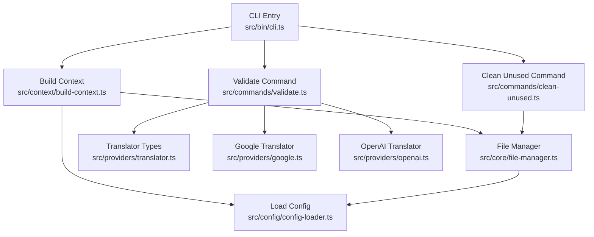
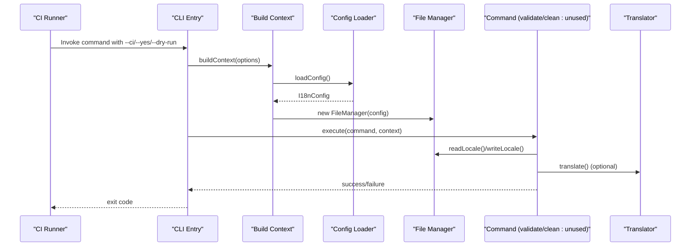
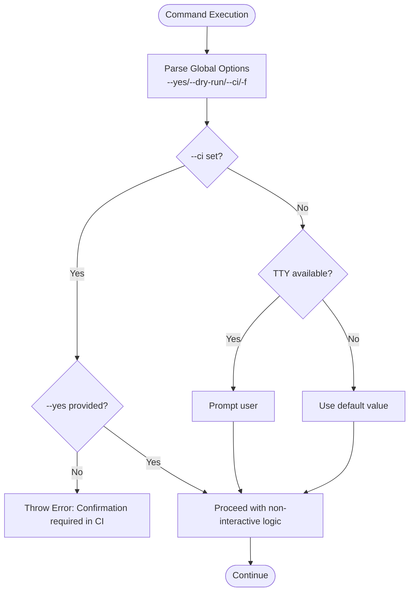
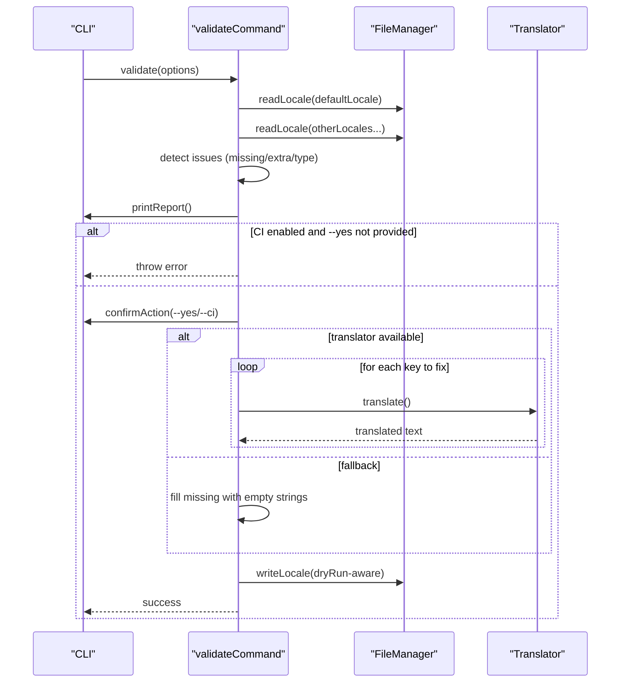
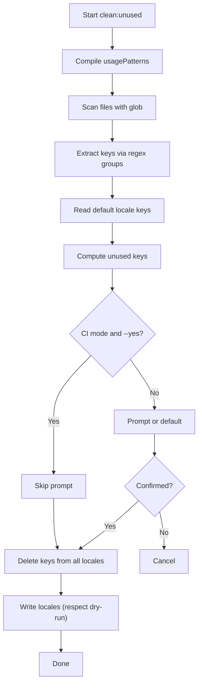
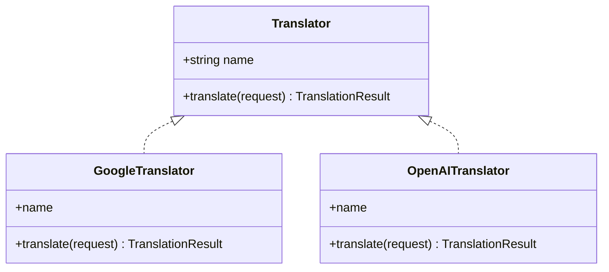
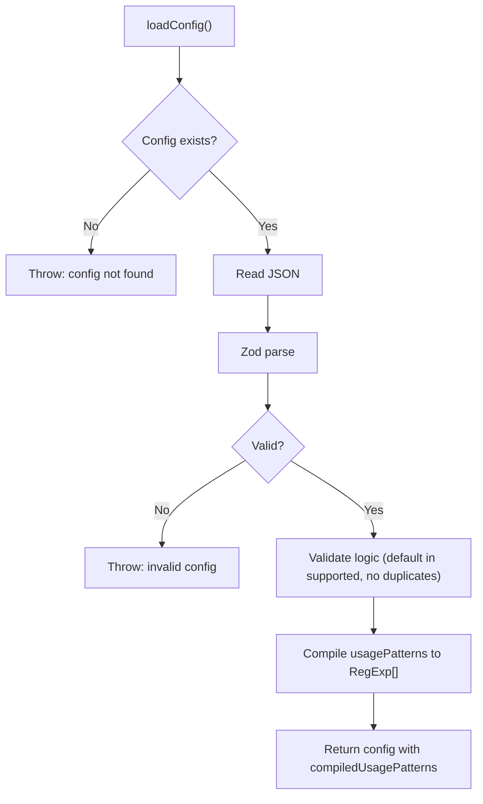
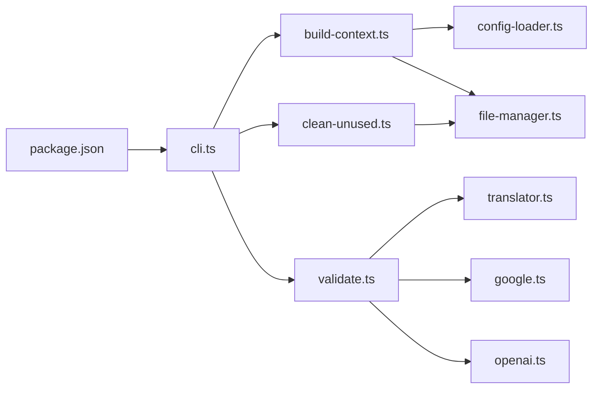

# CI/CD Integration

<cite>
**Referenced Files in This Document**
- [package.json](file://package.json)
- [README.md](file://README.md)
- [src/bin/cli.ts](file://src/bin/cli.ts)
- [src/commands/validate.ts](file://src/commands/validate.ts)
- [src/commands/clean-unused.ts](file://src/commands/clean-unused.ts)
- [src/config/config-loader.ts](file://src/config/config-loader.ts)
- [src/config/types.ts](file://src/config/types.ts)
- [src/context/build-context.ts](file://src/context/build-context.ts)
- [src/core/confirmation.ts](file://src/core/confirmation.ts)
- [src/core/file-manager.ts](file://src/core/file-manager.ts)
- [src/providers/translator.ts](file://src/providers/translator.ts)
- [src/providers/google.ts](file://src/providers/google.ts)
- [src/providers/openai.ts](file://src/providers/openai.ts)
</cite>

## Table of Contents
1. [Introduction](#introduction)
2. [Project Structure](#project-structure)
3. [Core Components](#core-components)
4. [Architecture Overview](#architecture-overview)
5. [Detailed Component Analysis](#detailed-component-analysis)
6. [Dependency Analysis](#dependency-analysis)
7. [Performance Considerations](#performance-considerations)
8. [Troubleshooting Guide](#troubleshooting-guide)
9. [Conclusion](#conclusion)
10. [Appendices](#appendices)

## Introduction
This document provides comprehensive CI/CD integration guidance for i18n-ai-cli. It covers integration patterns for GitHub Actions, GitLab CI, Jenkins, and Azure DevOps. It explains dry-run mode usage for pre-commit checks and automated validation, non-interactive operation using --ci and --yes flags, pipeline examples for translation validation, unused key cleanup, and automated translation workflows. It also documents failure handling, reporting mechanisms, integration with code review processes, performance optimization for CI environments, and best practices for maintaining translation consistency across development teams.

## Project Structure
The CLI is organized around a command-driven architecture with global options applied to all commands. Configuration is loaded from a project-level JSON file, and commands operate on locale files via a file manager. Translation providers (OpenAI and Google) are pluggable and selected either explicitly or via environment variables.

**Diagram sources**
- [src/bin/cli.ts:1-209](file://src/bin/cli.ts#L1-L209)
- [src/context/build-context.ts:1-16](file://src/context/build-context.ts#L1-L16)
- [src/config/config-loader.ts:1-176](file://src/config/config-loader.ts#L1-L176)
- [src/core/file-manager.ts:1-118](file://src/core/file-manager.ts#L1-L118)
- [src/commands/validate.ts:1-254](file://src/commands/validate.ts#L1-L254)
- [src/commands/clean-unused.ts:1-138](file://src/commands/clean-unused.ts#L1-L138)
- [src/providers/translator.ts:1-60](file://src/providers/translator.ts#L1-L60)
- [src/providers/google.ts:1-50](file://src/providers/google.ts#L1-L50)
- [src/providers/openai.ts:1-60](file://src/providers/openai.ts#L1-L60)

**Section sources**
- [src/bin/cli.ts:18-32](file://src/bin/cli.ts#L18-L32)
- [src/context/build-context.ts:5-16](file://src/context/build-context.ts#L5-L16)
- [src/config/config-loader.ts:24-67](file://src/config/config-loader.ts#L24-L67)
- [src/core/file-manager.ts:5-118](file://src/core/file-manager.ts#L5-L118)

## Core Components
- Global options: --yes, --dry-run, --ci, -f/--force are attached to all commands via a shared helper.
- Non-interactive behavior: --ci disables interactive prompts and requires --yes to auto-correct; otherwise, errors are thrown.
- Confirmation gating: confirmAction respects --yes, CI mode, and TTY availability.
- Validation: validate collects missing/extra/type mismatch issues per locale, prints a report, and optionally auto-corrects using a translator or falls back to empty strings.
- Unused key cleanup: scans source files using compiled regex patterns, computes unused keys, and removes them from all locales with optional auto-correction.
- Configuration: validated and compiled usage patterns; supports nested or flat key styles and auto-sorting.

**Section sources**
- [src/bin/cli.ts:25-32](file://src/bin/cli.ts#L25-L32)
- [src/core/confirmation.ts:9-43](file://src/core/confirmation.ts#L9-L43)
- [src/commands/validate.ts:121-254](file://src/commands/validate.ts#L121-L254)
- [src/commands/clean-unused.ts:8-138](file://src/commands/clean-unused.ts#L8-L138)
- [src/config/config-loader.ts:24-109](file://src/config/config-loader.ts#L24-L109)

## Architecture Overview
The CLI orchestrates commands that read configuration, scan files, compute diffs, and optionally write changes. Validation and cleanup commands support dry runs and non-interactive CI execution.

**Diagram sources**
- [src/bin/cli.ts:34-198](file://src/bin/cli.ts#L34-L198)
- [src/context/build-context.ts:5-16](file://src/context/build-context.ts#L5-L16)
- [src/config/config-loader.ts:24-67](file://src/config/config-loader.ts#L24-L67)
- [src/core/file-manager.ts:31-61](file://src/core/file-manager.ts#L31-L61)
- [src/commands/validate.ts:121-254](file://src/commands/validate.ts#L121-L254)
- [src/commands/clean-unused.ts:8-138](file://src/commands/clean-unused.ts#L8-L138)
- [src/providers/translator.ts:14-17](file://src/providers/translator.ts#L14-L17)

## Detailed Component Analysis

### Global Options and Non-Interactive Mode
- --yes skips confirmation prompts.
- --dry-run previews changes without writing files.
- --ci runs non-interactively; validation throws if auto-correction is needed and --yes is not provided.
- -f/--force is available globally but is not used in core commands in this codebase.

**Diagram sources**
- [src/bin/cli.ts:25-32](file://src/bin/cli.ts#L25-L32)
- [src/core/confirmation.ts:9-43](file://src/core/confirmation.ts#L9-L43)

**Section sources**
- [src/bin/cli.ts:25-32](file://src/bin/cli.ts#L25-L32)
- [src/core/confirmation.ts:9-43](file://src/core/confirmation.ts#L9-L43)

### Validation Command
Validation compares each locale against the default locale, detecting missing keys, extra keys, and type mismatches. It prints a summary and either auto-corrects (with or without translation) or exits depending on CI and --yes flags.

**Diagram sources**
- [src/commands/validate.ts:121-254](file://src/commands/validate.ts#L121-L254)
- [src/core/file-manager.ts:45-61](file://src/core/file-manager.ts#L45-L61)
- [src/providers/translator.ts:14-17](file://src/providers/translator.ts#L14-L17)

**Section sources**
- [src/commands/validate.ts:121-254](file://src/commands/validate.ts#L121-L254)
- [src/providers/google.ts:17-48](file://src/providers/google.ts#L17-L48)
- [src/providers/openai.ts:30-58](file://src/providers/openai.ts#L30-L58)

### Unused Key Cleanup Command
This command scans source files using compiled regex patterns, determines unused keys, and removes them from all locales after confirmation or --yes.

**Diagram sources**
- [src/commands/clean-unused.ts:8-138](file://src/commands/clean-unused.ts#L8-L138)
- [src/config/config-loader.ts:84-109](file://src/config/config-loader.ts#L84-L109)
- [src/core/file-manager.ts:45-61](file://src/core/file-manager.ts#L45-L61)

**Section sources**
- [src/commands/clean-unused.ts:8-138](file://src/commands/clean-unused.ts#L8-L138)
- [src/config/config-loader.ts:84-109](file://src/config/config-loader.ts#L84-L109)

### Translation Providers
- Translator interface defines a name and translate method returning translated text and metadata.
- GoogleTranslator integrates with @vitalets/google-translate-api and supports optional host and fetch options.
- OpenAITranslator integrates with OpenAI chat completions, requiring an API key via constructor or environment variable.

**Diagram sources**
- [src/providers/translator.ts:14-17](file://src/providers/translator.ts#L14-L17)
- [src/providers/google.ts:9-48](file://src/providers/google.ts#L9-L48)
- [src/providers/openai.ts:9-58](file://src/providers/openai.ts#L9-L58)

**Section sources**
- [src/providers/translator.ts:14-17](file://src/providers/translator.ts#L14-L17)
- [src/providers/google.ts:9-48](file://src/providers/google.ts#L9-L48)
- [src/providers/openai.ts:9-58](file://src/providers/openai.ts#L9-L58)

### Configuration Loading and Validation
- Loads i18n-cli.config.json from project root, validates schema, ensures logical constraints (default locale in supported locales, no duplicates), compiles usagePatterns into RegExp objects, and exposes compiledUsagePatterns to commands.

**Diagram sources**
- [src/config/config-loader.ts:24-67](file://src/config/config-loader.ts#L24-L67)
- [src/config/config-loader.ts:69-82](file://src/config/config-loader.ts#L69-L82)
- [src/config/config-loader.ts:84-109](file://src/config/config-loader.ts#L84-L109)

**Section sources**
- [src/config/config-loader.ts:24-67](file://src/config/config-loader.ts#L24-L67)
- [src/config/config-loader.ts:69-82](file://src/config/config-loader.ts#L69-L82)
- [src/config/config-loader.ts:84-109](file://src/config/config-loader.ts#L84-L109)

## Dependency Analysis
- CLI depends on commander for argument parsing and chalk for colored output.
- Commands depend on build-context to obtain config and file-manager.
- Validation and key management commands depend on file-manager for IO and optional translator for auto-correction.
- Translation providers are injected based on provider selection logic.

**Diagram sources**
- [package.json:1-68](file://package.json#L1-L68)
- [src/bin/cli.ts:1-209](file://src/bin/cli.ts#L1-L209)
- [src/context/build-context.ts:1-16](file://src/context/build-context.ts#L1-L16)
- [src/config/config-loader.ts:1-176](file://src/config/config-loader.ts#L1-L176)
- [src/core/file-manager.ts:1-118](file://src/core/file-manager.ts#L1-L118)
- [src/commands/validate.ts:1-254](file://src/commands/validate.ts#L1-L254)
- [src/commands/clean-unused.ts:1-138](file://src/commands/clean-unused.ts#L1-L138)
- [src/providers/translator.ts:1-60](file://src/providers/translator.ts#L1-L60)
- [src/providers/google.ts:1-50](file://src/providers/google.ts#L1-L50)
- [src/providers/openai.ts:1-60](file://src/providers/openai.ts#L1-L60)

**Section sources**
- [package.json:48-59](file://package.json#L48-L59)
- [src/bin/cli.ts:3-16](file://src/bin/cli.ts#L3-L16)

## Performance Considerations
- Prefer --dry-run to preview changes before applying them in CI.
- Use --ci with --yes to avoid interactive prompts and reduce pipeline runtime variability.
- Limit regex usagePatterns to precise patterns to minimize scanning overhead.
- Keep translation provider selection explicit to avoid environment-dependent fallbacks during CI.
- Cache dependencies and build artifacts where applicable in your CI platform to speed up installation and compilation.

[No sources needed since this section provides general guidance]

## Troubleshooting Guide
- Configuration errors: Ensure i18n-cli.config.json exists in project root and is valid JSON. The loader validates schema and logical constraints.
- Missing usagePatterns: clean:unused requires compiled usagePatterns; define patterns and ensure they include capturing groups.
- CI failures: --ci requires --yes to auto-correct; otherwise, errors are thrown. Review logs to identify failing locales or keys.
- Translation provider issues: Provide OPENAI_API_KEY or specify --provider explicitly. OpenAI requires a valid API key; Google is used when OPENAI_API_KEY is not set.
- File IO errors: Locale files must be valid JSON; FileManager throws when files are missing or malformed.

**Section sources**
- [src/config/config-loader.ts:24-67](file://src/config/config-loader.ts#L24-L67)
- [src/config/config-loader.ts:84-109](file://src/config/config-loader.ts#L84-L109)
- [src/commands/validate.ts:172-176](file://src/commands/validate.ts#L172-L176)
- [src/commands/clean-unused.ts:19-23](file://src/commands/clean-unused.ts#L19-L23)
- [src/providers/openai.ts:14-28](file://src/providers/openai.ts#L14-L28)
- [src/core/file-manager.ts:31-43](file://src/core/file-manager.ts#L31-L43)

## Conclusion
i18n-ai-cli is designed for CI readiness with non-interactive modes, dry runs, and robust validation. By combining --ci and --yes flags, teams can enforce translation consistency automatically, integrate with code review workflows, and maintain high-quality internationalization assets across pipelines.

[No sources needed since this section summarizes without analyzing specific files]

## Appendices

### CI/CD Integration Patterns

- GitHub Actions
  - Use actions/setup-node to configure Node.js.
  - Install i18n-ai-cli via npm and run validation and cleanup steps with --ci and --dry-run first, then --ci --yes to apply changes.
  - Store OPENAI_API_KEY in repository secrets if using OpenAI.

- GitLab CI
  - Use the Node.js image and install dependencies.
  - Run i18n-ai-cli validate and clean:unused with --ci and --dry-run in a dedicated job; add a follow-up job with --ci --yes to apply changes.

- Jenkins
  - Use a NodeJS toolchain and execute i18n-ai-cli in pipeline stages.
  - Configure environment variables for translation providers and use --ci with --yes in the apply stage.

- Azure DevOps
  - Use a Node toolchain task to install dependencies.
  - Add script tasks to run validation and cleanup with --ci and --dry-run, followed by an apply task with --ci --yes.

[No sources needed since this section provides general guidance]

### Pipeline Examples

- Translation Validation
  - Pre-flight check: validate --ci --dry-run
  - Apply changes: validate --ci --yes

- Unused Key Cleanup
  - Pre-flight check: clean:unused --ci --dry-run
  - Apply changes: clean:unused --ci --yes

- Automated Translation Workflows
  - Add or update keys with provider selection (--provider or OPENAI_API_KEY).
  - Validate and auto-correct missing keys using a translator.

[No sources needed since this section provides general guidance]

### Failure Handling and Reporting
- Non-interactive mode: --ci throws errors when changes would be made; use --yes to auto-correct.
- Validation reports summarize missing/extra/type issues per locale and total counts.
- Cleanup reports unused keys and proceeds only with confirmation or --yes.

**Section sources**
- [src/commands/validate.ts:31-100](file://src/commands/validate.ts#L31-L100)
- [src/commands/validate.ts:172-176](file://src/commands/validate.ts#L172-L176)
- [src/commands/clean-unused.ts:88-92](file://src/commands/clean-unused.ts#L88-L92)

### Best Practices for Translation Consistency
- Define precise usagePatterns to accurately detect used keys.
- Use nested or flat key styles consistently across locales.
- Keep autoSort enabled to maintain alphabetical order.
- Integrate validation and cleanup in pre-commit hooks and CI jobs.
- Use dry-run to preview changes before applying in CI.

[No sources needed since this section provides general guidance]