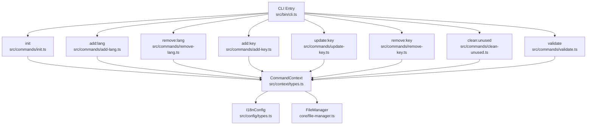
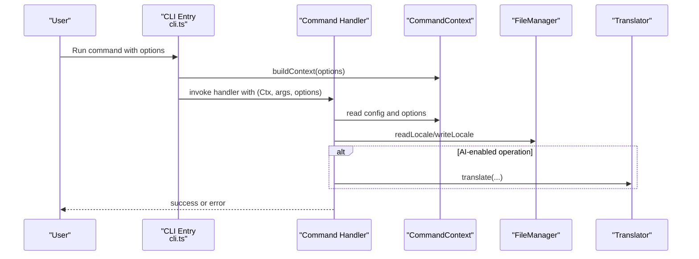
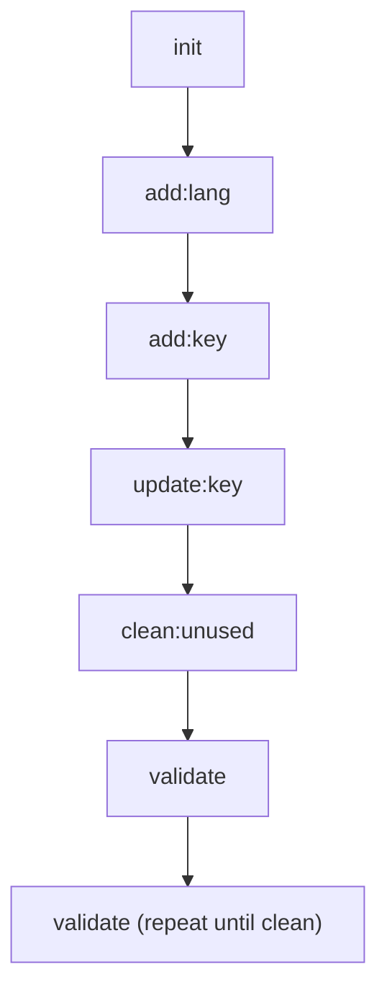
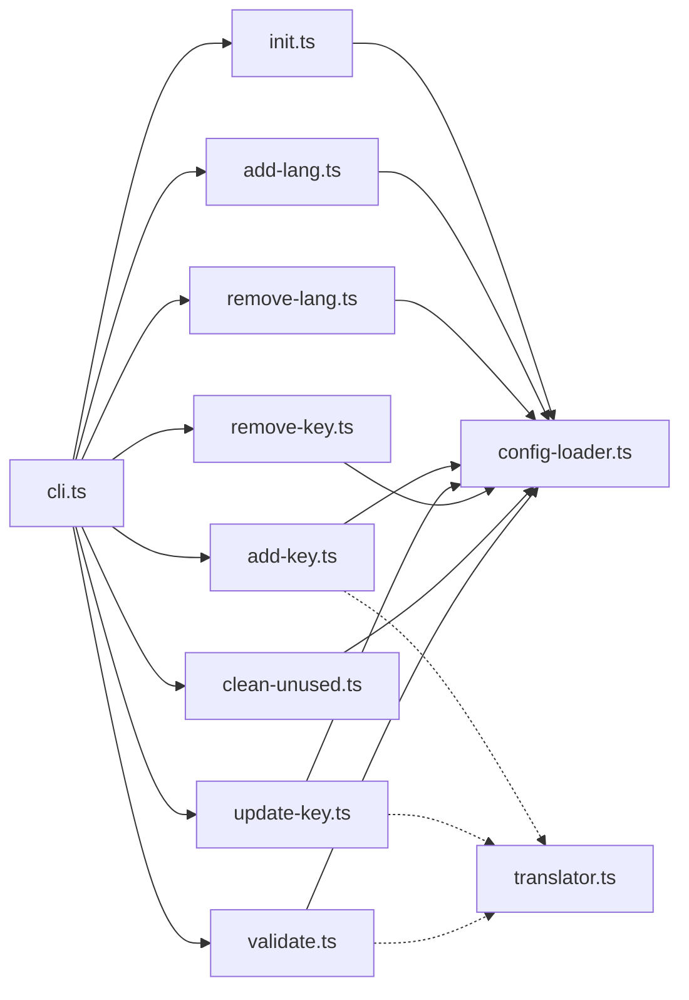

# CLI Command Reference

<cite>
**Referenced Files in This Document**
- [cli.ts](file://src/bin/cli.ts)
- [init.ts](file://src/commands/init.ts)
- [add-lang.ts](file://src/commands/add-lang.ts)
- [remove-lang.ts](file://src/commands/remove-lang.ts)
- [add-key.ts](file://src/commands/add-key.ts)
- [update-key.ts](file://src/commands/update-key.ts)
- [remove-key.ts](file://src/commands/remove-key.ts)
- [validate.ts](file://src/commands/validate.ts)
- [clean-unused.ts](file://src/commands/clean-unused.ts)
- [types.ts](file://src/context/types.ts)
- [types.ts](file://src/config/types.ts)
- [config-loader.ts](file://src/config/config-loader.ts)
- [package.json](file://package.json)
- [README.md](file://README.md)
</cite>

## Table of Contents
1. [Introduction](#introduction)
2. [Project Structure](#project-structure)
3. [Core Components](#core-components)
4. [Architecture Overview](#architecture-overview)
5. [Detailed Component Analysis](#detailed-component-analysis)
6. [Dependency Analysis](#dependency-analysis)
7. [Performance Considerations](#performance-considerations)
8. [Troubleshooting Guide](#troubleshooting-guide)
9. [Conclusion](#conclusion)
10. [Appendices](#appendices)

## Introduction
This document provides a comprehensive CLI command reference for i18n-ai-cli. It covers all commands, their syntax, options, examples, and expected behavior. It also documents global options, command relationships, typical workflows, advanced usage patterns, scripting and automation scenarios, command chaining, error handling, exit codes, and troubleshooting guidance.

## Project Structure
The CLI is organized around a central entry point that registers commands and applies global options. Each command encapsulates a specific i18n operation and receives a shared context containing configuration, file manager, and global options.

**Diagram sources**
- [cli.ts:18-198](file://src/bin/cli.ts#L18-L198)
- [init.ts:25-182](file://src/commands/init.ts#L25-L182)
- [add-lang.ts:26-97](file://src/commands/add-lang.ts#L26-L97)
- [remove-lang.ts:5-73](file://src/commands/remove-lang.ts#L5-L73)
- [add-key.ts:8-119](file://src/commands/add-key.ts#L8-L119)
- [update-key.ts:17-177](file://src/commands/update-key.ts#L17-L177)
- [remove-key.ts:10-95](file://src/commands/remove-key.ts#L10-L95)
- [clean-unused.ts:8-137](file://src/commands/clean-unused.ts#L8-L137)
- [validate.ts:121-253](file://src/commands/validate.ts#L121-L253)
- [types.ts:11-15](file://src/context/types.ts#L11-L15)
- [types.ts:3-11](file://src/config/types.ts#L3-L11)

**Section sources**
- [cli.ts:18-198](file://src/bin/cli.ts#L18-L198)
- [types.ts:11-15](file://src/context/types.ts#L11-L15)
- [types.ts:3-11](file://src/config/types.ts#L3-L11)

## Core Components
- Global options applied to all commands:
  - -y, --yes: Skip confirmation prompts
  - --dry-run: Preview changes without writing files
  - --ci: CI mode (non-interactive; fails if changes would be made)
  - -f, --force: Force operation even if validation fails
- CommandContext provides:
  - config: I18nConfig loaded from i18n-cli.config.json
  - fileManager: Access to read/write locale files
  - options: GlobalOptions passed from CLI

**Section sources**
- [cli.ts:25-32](file://src/bin/cli.ts#L25-L32)
- [types.ts:4-9](file://src/context/types.ts#L4-L9)
- [types.ts:11-15](file://src/context/types.ts#L11-L15)

## Architecture Overview
The CLI uses a modular command architecture. Each command validates inputs, consults configuration, interacts with the file system via FileManager, and optionally uses a translation provider for AI-assisted operations. Global options are unified and enforced consistently across commands.

**Diagram sources**
- [cli.ts:34-198](file://src/bin/cli.ts#L34-L198)
- [init.ts:25-182](file://src/commands/init.ts#L25-L182)
- [add-key.ts:8-119](file://src/commands/add-key.ts#L8-L119)
- [validate.ts:121-253](file://src/commands/validate.ts#L121-L253)

## Detailed Component Analysis

### Global Options
- -y, --yes: Skips confirmation prompts for destructive operations.
- --dry-run: Prints preview actions without modifying files.
- --ci: Non-interactive mode; throws if changes would be made; requires --yes to apply.
- -f, --force: Allows operations that would otherwise fail due to validation.

Behavior summary:
- CI mode combined with missing --yes causes immediate failure with a descriptive message.
- Dry run suppresses writes and logs previews.
- Confirmation prompts are skipped when --yes is provided.

**Section sources**
- [cli.ts:25-32](file://src/bin/cli.ts#L25-L32)
- [init.ts:151-168](file://src/commands/init.ts#L151-L168)
- [add-key.ts:51-60](file://src/commands/add-key.ts#L51-L60)
- [validate.ts:172-185](file://src/commands/validate.ts#L172-L185)
- [clean-unused.ts:88-96](file://src/commands/clean-unused.ts#L88-L96)

### Command: init
- Purpose: Create i18n-cli configuration file and initialize default locale file.
- Syntax: i18n-ai-cli init
- Options:
  - -f, --force: Overwrite existing configuration
  - -y, --yes: Skip prompts
- Behavior:
  - Prompts for localesPath, defaultLocale, supportedLocales, keyStyle, autoSort, usagePatterns (or uses defaults in non-interactive mode).
  - Validates and normalizes supportedLocales, ensuring defaultLocale is included.
  - Writes i18n-cli.config.json and ensures locales directory exists; creates default locale file if missing.
  - In CI mode without --yes, throws an error instructing to use --yes to apply.
  - With --dry-run, logs preview and does not write files.

Examples:
- i18n-ai-cli init
- i18n-ai-cli init --force
- i18n-ai-cli init --yes

Expected behavior:
- Creates configuration and initializes default locale file.
- Throws if configuration exists and --force is not provided.
- Throws in CI mode without --yes.

**Section sources**
- [cli.ts:34-42](file://src/bin/cli.ts#L34-L42)
- [init.ts:25-182](file://src/commands/init.ts#L25-L182)
- [config-loader.ts:24-66](file://src/config/config-loader.ts#L24-L66)

### Command: add:lang
- Purpose: Add a new language locale file.
- Syntax: i18n-ai-cli add:lang <lang> [--from <locale>] [--strict]
- Options:
  - --from <locale>: Clone from an existing locale and auto-translate missing keys
  - --strict: Enable strict validation
  - -y, --yes, --dry-run
- Behavior:
  - Validates language code against ISO 639-1 (accepts xx or xx-YY).
  - Ensures locale is not already supported and file does not exist.
  - Optionally clones base content from a specified locale.
  - Confirms action (skipped with --yes).
  - Creates locale file; logs manual step to add locale to supportedLocales in config.

Examples:
- i18n-ai-cli add:lang fr
- i18n-ai-cli add:lang de --from en
- i18n-ai-cli add:lang pt-BR --strict

Expected behavior:
- Creates new locale file; throws on invalid code, duplicate, or existing file.
- In CI mode without --yes, throws an error instructing to use --yes.

**Section sources**
- [cli.ts:44-54](file://src/bin/cli.ts#L44-L54)
- [add-lang.ts:26-97](file://src/commands/add-lang.ts#L26-L97)

### Command: remove:lang
- Purpose: Remove a language locale file.
- Syntax: i18n-ai-cli remove:lang <lang>
- Options: -y, --yes, --dry-run
- Behavior:
  - Validates that the locale is in supportedLocales.
  - Prevents removal of defaultLocale; instructs changing defaultLocale first.
  - Confirms action (skipped with --yes).
  - Deletes locale file; logs manual step to remove locale from supportedLocales in config.

Examples:
- i18n-ai-cli remove:lang fr

Expected behavior:
- Throws if locale is not supported, is default, or file does not exist.
- In CI mode without --yes, throws an error instructing to use --yes.

**Section sources**
- [cli.ts:56-65](file://src/bin/cli.ts#L56-L65)
- [remove-lang.ts:5-73](file://src/commands/remove-lang.ts#L5-L73)

### Command: add:key
- Purpose: Add a new translation key to all locales with auto-translation.
- Syntax: i18n-ai-cli add:key <key> -v, --value <value> [--provider <provider>]
- Options:
  - -v, --value <value>: Required. Value for default locale
  - -p, --provider <provider>: openai or google
  - -y, --yes, --dry-run
- Behavior:
  - Validates key and value presence.
  - For each locale, checks structural conflicts and absence of key.
  - Writes default locale value as provided; translates others via selected provider (or environment fallback).
  - On translation failure, logs warning and writes empty string for that locale.

Examples:
- i18n-ai-cli add:key auth.login.title --value "Login"
- i18n-ai-cli add:key welcome.message --value "Welcome" --provider openai

Expected behavior:
- Throws if key/value missing, key exists in any locale, or structural conflict detected.
- In CI mode without --yes, throws an error instructing to use --yes.

**Section sources**
- [cli.ts:67-102](file://src/bin/cli.ts#L67-L102)
- [add-key.ts:8-119](file://src/commands/add-key.ts#L8-L119)

### Command: update:key
- Purpose: Update a translation key; supports per-locale update or cross-locale sync.
- Syntax: i18n-ai-cli update:key <key> -v, --value <value> [--locale <locale>] [--sync] [--provider <provider>]
- Options:
  - -v, --value <value>: Required. New value
  - -l, --locale <locale>: Specific locale to update (default: default locale)
  - -s, --sync: Translate to all other locales
  - -p, --provider <provider>: openai or google
  - -y, --yes, --dry-run
- Behavior:
  - Validates key presence in target locales.
  - If --sync is used, updates all locales; otherwise updates only the target locale.
  - If both --locale and --sync are provided, --sync is ignored and a warning is printed.
  - Uses translator for sync; on failure, keeps existing value for that locale.

Examples:
- i18n-ai-cli update:key auth.login.title --value "Sign In"
- i18n-ai-cli update:key auth.login.title --value "Anmelden" --locale de
- i18n-ai-cli update:key welcome.message --value "Welcome" --sync

Expected behavior:
- Throws if key missing in target locale(s) or unsupported locale provided.
- In CI mode without --yes, throws an error instructing to use --yes.

**Section sources**
- [cli.ts:104-140](file://src/bin/cli.ts#L104-L140)
- [update-key.ts:17-177](file://src/commands/update-key.ts#L17-L177)

### Command: remove:key
- Purpose: Remove a translation key from all locales.
- Syntax: i18n-ai-cli remove:key <key>
- Options: -y, --yes, --dry-run
- Behavior:
  - Scans all locales to find where the key exists.
  - Confirms bulk removal (skipped with --yes).
  - Removes key from all locales and rebuilds nested/flat structure.

Examples:
- i18n-ai-cli remove:key auth.legacy.title

Expected behavior:
- Throws if key does not exist in any locale.
- In CI mode without --yes, throws an error instructing to use --yes.

**Section sources**
- [cli.ts:142-151](file://src/bin/cli.ts#L142-L151)
- [remove-key.ts:10-95](file://src/commands/remove-key.ts#L10-L95)

### Command: validate
- Purpose: Validate translation files and auto-correct issues.
- Syntax: i18n-ai-cli validate [--provider <provider>]
- Options:
  - -p, --provider <provider>: openai or google
  - -y, --yes, --dry-run, --ci
- Behavior:
  - Compares each locale to default locale to detect missing keys, extra keys, and type mismatches.
  - Reports issues per locale and prompts for auto-correction.
  - With provider: translates missing/type-mismatched keys; without provider: adds missing keys as empty strings and removes extras.
  - In CI mode without --yes, throws an error instructing to use --yes.

Examples:
- i18n-ai-cli validate
- i18n-ai-cli validate --provider openai
- i18n-ai-cli validate --provider google

Expected behavior:
- Reports issues and optionally auto-corrects; throws if issues found and --yes not provided in CI mode.

**Section sources**
- [cli.ts:164-198](file://src/bin/cli.ts#L164-L198)
- [validate.ts:121-253](file://src/commands/validate.ts#L121-L253)

### Command: clean:unused
- Purpose: Detect and remove unused translation keys across all locales.
- Syntax: i18n-ai-cli clean:unused
- Options: -y, --yes, --dry-run, --ci
- Behavior:
  - Scans project files using compiled usagePatterns to collect used keys.
  - Compares used keys to default locale keys to determine unused keys.
  - Confirms bulk removal (skipped with --yes).
  - Removes unused keys from all locales.

Examples:
- i18n-ai-cli clean:unused

Expected behavior:
- Throws if usagePatterns not defined in config.
- In CI mode without --yes, throws an error instructing to use --yes.

**Section sources**
- [cli.ts:153-162](file://src/bin/cli.ts#L153-L162)
- [clean-unused.ts:8-137](file://src/commands/clean-unused.ts#L8-L137)
- [config-loader.ts:84-109](file://src/config/config-loader.ts#L84-L109)

### Command Relationships and Typical Workflows
Typical workflow sequence:
1. Initialize configuration and default locale file.
2. Add new languages (optionally cloning from an existing locale).
3. Add translation keys; use AI provider for auto-translation.
4. Update keys; optionally sync across locales.
5. Periodically scan for unused keys and remove them.
6. Validate files and auto-correct issues.

[No sources needed since this diagram shows conceptual workflow, not actual code structure]

## Dependency Analysis
- CLI entry point registers commands and global options.
- Each command depends on CommandContext (config, file manager, options).
- Validation and maintenance commands rely on usagePatterns compiled from configuration.
- Translation provider selection prioritizes explicit flag, then environment variable, then falls back to Google.

**Diagram sources**
- [cli.ts:34-198](file://src/bin/cli.ts#L34-L198)
- [config-loader.ts:24-66](file://src/config/config-loader.ts#L24-L66)
- [add-key.ts:8-119](file://src/commands/add-key.ts#L8-L119)
- [update-key.ts:17-177](file://src/commands/update-key.ts#L17-L177)
- [validate.ts:121-253](file://src/commands/validate.ts#L121-L253)

**Section sources**
- [cli.ts:34-198](file://src/bin/cli.ts#L34-L198)
- [config-loader.ts:24-66](file://src/config/config-loader.ts#L24-L66)

## Performance Considerations
- Translation calls are made per target locale during add:key and update:key sync; batching is not implemented. For large locale sets, expect proportional API calls.
- validate scans project files and compiles regex patterns; ensure usagePatterns are concise to minimize scanning overhead.
- clean:unused performs file system scans; keep usagePatterns focused to reduce false positives and scanning time.

[No sources needed since this section provides general guidance]

## Troubleshooting Guide
Common failures and resolutions:
- Configuration not found or invalid:
  - Symptom: Error indicating missing or invalid i18n-cli.config.json.
  - Resolution: Run init to create a valid configuration; ensure supportedLocales includes defaultLocale and usagePatterns are valid regex with capturing groups.
- Language code invalid:
  - Symptom: Error stating invalid language code.
  - Resolution: Use ISO 639-1 codes (xx or xx-YY).
- Attempt to add existing key:
  - Symptom: Error stating key already exists.
  - Resolution: Use update:key to change the value.
- Structural conflict detected:
  - Symptom: Error about structural conflict when adding keys.
  - Resolution: Adjust key path to avoid parent-child conflicts in nested structure.
- Missing translation provider credentials:
  - Symptom: Translation failures.
  - Resolution: Set OPENAI_API_KEY for OpenAI or rely on Google Translate fallback; specify provider explicitly if needed.
- CI mode without --yes:
  - Symptom: Error instructing to use --yes to apply changes.
  - Resolution: Add --yes to proceed in CI environments.
- Dry run mode:
  - Symptom: No files changed after command.
  - Resolution: Dry run is expected; remove --dry-run to apply changes.

**Section sources**
- [config-loader.ts:24-66](file://src/config/config-loader.ts#L24-L66)
- [add-lang.ts:36-47](file://src/commands/add-lang.ts#L36-L47)
- [add-key.ts:37-44](file://src/commands/add-key.ts#L37-L44)
- [validate.ts:172-185](file://src/commands/validate.ts#L172-L185)
- [clean-unused.ts:19-23](file://src/commands/clean-unused.ts#L19-L23)

## Conclusion
i18n-ai-cli provides a robust, AI-enhanced toolkit for managing translation files. Its modular command architecture, consistent global options, and validation/auto-correction capabilities streamline i18n workflows. Use the provided examples and guidance to integrate these commands into development and CI/CD pipelines effectively.

[No sources needed since this section summarizes without analyzing specific files]

## Appendices

### Advanced Usage Patterns and Automation
- Scripting examples:
  - Bulk add keys across locales with AI translation.
  - Periodic cleanup of unused keys in pre-commit hooks.
  - Automated validation in CI pipelines with --ci --yes.
- Command chaining:
  - Combine init, add:lang, add:key, update:key, clean:unused, and validate in a single pipeline.
- Exit codes:
  - Non-zero exit on command errors or unhandled exceptions; zero on successful completion.

**Section sources**
- [cli.ts:200-208](file://src/bin/cli.ts#L200-L208)
- [README.md:258-266](file://README.md#L258-L266)

### Translation Providers
- Provider selection order:
  - Explicit --provider flag
  - OPENAI_API_KEY environment variable
  - Google Translate fallback
- Supported providers:
  - OpenAI (paid)
  - Google Translate (free)

**Section sources**
- [cli.ts:80-98](file://src/bin/cli.ts#L80-L98)
- [cli.ts:116-136](file://src/bin/cli.ts#L116-L136)
- [cli.ts:176-194](file://src/bin/cli.ts#L176-L194)
- [README.md:268-304](file://README.md#L268-L304)