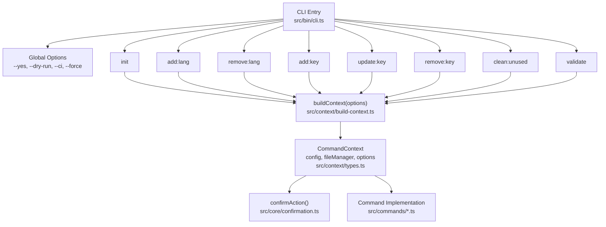
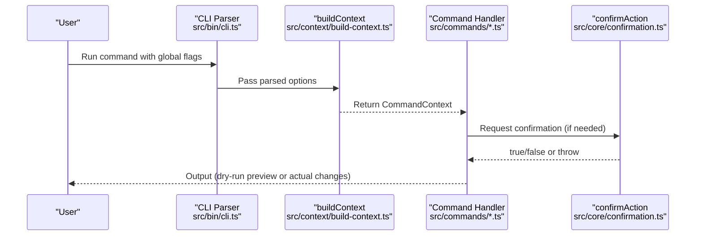
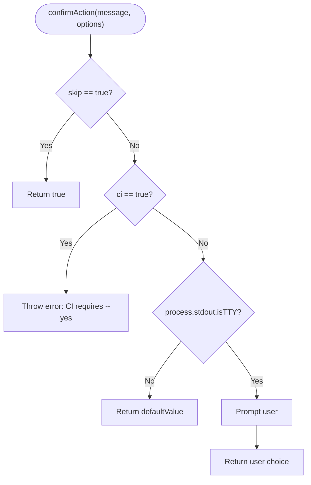
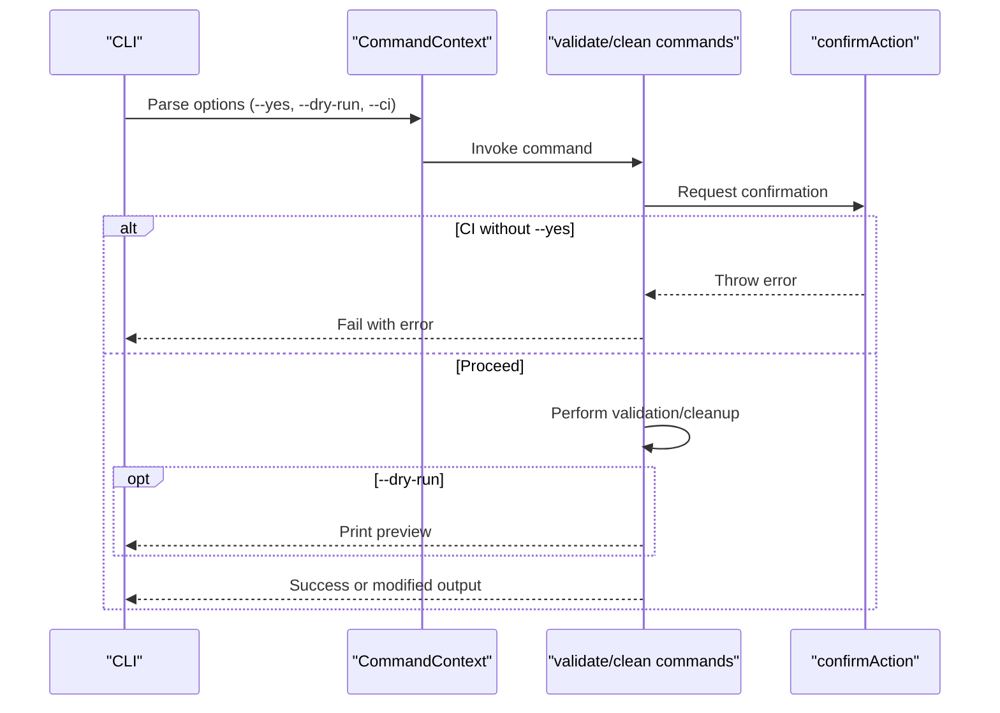
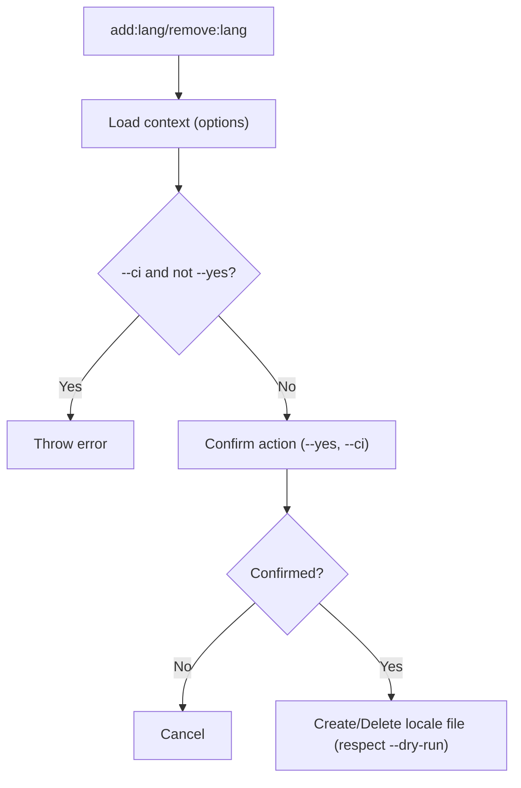
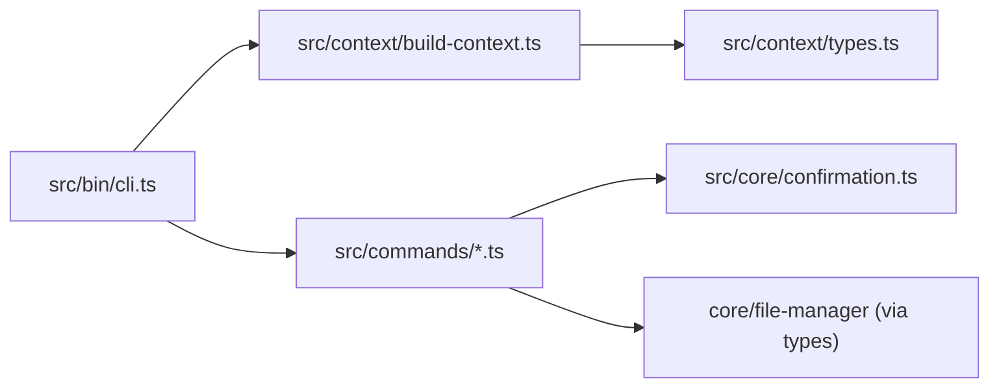

# Global Options and Error Handling

<cite>
**Referenced Files in This Document**
- [cli.ts](file://src/bin/cli.ts)
- [confirmation.ts](file://src/core/confirmation.ts)
- [build-context.ts](file://src/context/build-context.ts)
- [types.ts](file://src/context/types.ts)
- [clean-unused.ts](file://src/commands/clean-unused.ts)
- [validate.ts](file://src/commands/validate.ts)
- [add-lang.ts](file://src/commands/add-lang.ts)
- [remove-lang.ts](file://src/commands/remove-lang.ts)
- [README.md](file://README.md)
- [package.json](file://package.json)
</cite>

## Table of Contents
1. [Introduction](#introduction)
2. [Project Structure](#project-structure)
3. [Core Components](#core-components)
4. [Architecture Overview](#architecture-overview)
5. [Detailed Component Analysis](#detailed-component-analysis)
6. [Dependency Analysis](#dependency-analysis)
7. [Performance Considerations](#performance-considerations)
8. [Troubleshooting Guide](#troubleshooting-guide)
9. [Conclusion](#conclusion)

## Introduction
This document explains the global CLI options and error handling mechanisms in i18n-ai-cli. It focuses on:
- Global flags: --dry-run, --ci, --yes, and -f/--force
- How these flags influence command behavior and user prompts
- Error handling strategies, exit codes, and failure scenarios
- Practical examples for scripted execution, CI/CD integration, and automated workflows
- Troubleshooting common errors, debugging techniques, and logging strategies
- Best practices for production deployments and error recovery

## Project Structure
The CLI entry point defines global options and routes commands. Each command receives a shared context containing parsed options and configuration. Confirmation logic centralizes interactive prompts and CI safety checks.

**Diagram sources**
- [cli.ts:20-32](file://src/bin/cli.ts#L20-L32)
- [build-context.ts:5-16](file://src/context/build-context.ts#L5-L16)
- [types.ts:4-15](file://src/context/types.ts#L4-L15)
- [confirmation.ts:9-42](file://src/core/confirmation.ts#L9-L42)

**Section sources**
- [cli.ts:20-32](file://src/bin/cli.ts#L20-L32)
- [build-context.ts:5-16](file://src/context/build-context.ts#L5-L16)
- [types.ts:4-15](file://src/context/types.ts#L4-L15)
- [confirmation.ts:9-42](file://src/core/confirmation.ts#L9-L42)

## Core Components
- Global options definition and propagation:
  - Defined centrally and attached to each command via a helper.
  - Passed through the command context to all command implementations.
- Confirmation logic:
  - Centralized prompt handling with CI safety and non-interactive defaults.
- Command implementations:
  - Respect --yes to skip prompts, --dry-run to preview changes, --ci to enforce non-interactive behavior, and -f/--force where applicable.

Key behaviors:
- --yes: Skips confirmation prompts.
- --dry-run: Prints preview actions without writing files.
- --ci: Disables interactive prompts; requires --yes to proceed; throws otherwise.
- -f/--force: Present in option definitions; propagated via context; intended to override validation failures in commands that support it.

**Section sources**
- [cli.ts:26-32](file://src/bin/cli.ts#L26-L32)
- [cli.ts:200-209](file://src/bin/cli.ts#L200-L209)
- [confirmation.ts:9-42](file://src/core/confirmation.ts#L9-L42)
- [build-context.ts:5-16](file://src/context/build-context.ts#L5-L16)
- [types.ts:4-15](file://src/context/types.ts#L4-L15)

## Architecture Overview
The CLI uses a layered approach:
- CLI layer: Defines global options and routes to commands.
- Context layer: Builds a shared context with configuration, file manager, and options.
- Command layer: Executes operations with dry-run previews and confirmation gating.
- Confirmation layer: Enforces CI safety and non-interactive defaults.

**Diagram sources**
- [cli.ts:34-198](file://src/bin/cli.ts#L34-L198)
- [build-context.ts:5-16](file://src/context/build-context.ts#L5-L16)
- [confirmation.ts:9-42](file://src/core/confirmation.ts#L9-L42)

## Detailed Component Analysis

### Global Options Definition and Propagation
- Global flags are defined in a helper and attached to each command.
- The helper passes flags to the command handler, which receives them through the context.

Behavior highlights:
- --yes: Bypasses prompts in commands that use confirmAction.
- --dry-run: Commands write to preview mode when supported.
- --ci: Enforces non-interactive behavior; throws if a prompt would occur without --yes.
- -f/--force: Defined globally; commands may interpret this to bypass validation failures.

**Section sources**
- [cli.ts:26-32](file://src/bin/cli.ts#L26-L32)
- [cli.ts:34-198](file://src/bin/cli.ts#L34-L198)
- [types.ts:4-15](file://src/context/types.ts#L4-L15)

### Confirmation Logic (--yes, --ci, non-interactive defaults)
The centralized confirmation function controls interactive prompts:
- If --yes is set, always returns true.
- If --ci is set without --yes, throws an error requiring explicit confirmation.
- If stdout is not a TTY, returns the provided default value.
- Otherwise, prompts the user.

**Diagram sources**
- [confirmation.ts:9-42](file://src/core/confirmation.ts#L9-L42)

**Section sources**
- [confirmation.ts:9-42](file://src/core/confirmation.ts#L9-L42)

### Command Behavior: Validation and Cleanup
- Validation and cleanup commands use confirmAction and respect --ci and --yes.
- They also honor --dry-run to preview changes without writing files.

**Diagram sources**
- [validate.ts:121-253](file://src/commands/validate.ts#L121-L253)
- [clean-unused.ts:8-137](file://src/commands/clean-unused.ts#L8-L137)
- [confirmation.ts:9-42](file://src/core/confirmation.ts#L9-L42)

**Section sources**
- [validate.ts:121-253](file://src/commands/validate.ts#L121-L253)
- [clean-unused.ts:8-137](file://src/commands/clean-unused.ts#L8-L137)
- [confirmation.ts:9-42](file://src/core/confirmation.ts#L9-L42)

### Language Management Commands
- Add/remove language commands validate inputs and use confirmAction with --ci/--yes semantics.
- They respect --dry-run to avoid file writes.

**Diagram sources**
- [add-lang.ts:26-97](file://src/commands/add-lang.ts#L26-L97)
- [remove-lang.ts:5-73](file://src/commands/remove-lang.ts#L5-L73)
- [confirmation.ts:9-42](file://src/core/confirmation.ts#L9-L42)

**Section sources**
- [add-lang.ts:26-97](file://src/commands/add-lang.ts#L26-L97)
- [remove-lang.ts:5-73](file://src/commands/remove-lang.ts#L5-L73)
- [confirmation.ts:9-42](file://src/core/confirmation.ts#L9-L42)

## Dependency Analysis
- CLI entry point depends on:
  - Commander for parsing
  - Context builder for assembling options and configuration
  - Command handlers for operations
  - Confirmation utility for interactive safety
- Commands depend on:
  - FileManager for file operations
  - Configuration loader for runtime settings
  - Confirmation utility for user prompts

**Diagram sources**
- [cli.ts:34-198](file://src/bin/cli.ts#L34-L198)
- [build-context.ts:5-16](file://src/context/build-context.ts#L5-L16)
- [types.ts:4-15](file://src/context/types.ts#L4-L15)
- [confirmation.ts:9-42](file://src/core/confirmation.ts#L9-L42)

**Section sources**
- [cli.ts:34-198](file://src/bin/cli.ts#L34-L198)
- [build-context.ts:5-16](file://src/context/build-context.ts#L5-L16)
- [types.ts:4-15](file://src/context/types.ts#L4-L15)
- [confirmation.ts:9-42](file://src/core/confirmation.ts#L9-L42)

## Performance Considerations
- Dry-run mode avoids disk writes, reducing I/O overhead during previews.
- Non-interactive mode (CI) eliminates prompt waits, improving automation throughput.
- Confirmation gating prevents accidental bulk changes, avoiding costly retries.

[No sources needed since this section provides general guidance]

## Troubleshooting Guide

Common errors and resolutions:
- CI mode requires --yes:
  - Symptom: Command exits with an error indicating confirmation is required in CI mode.
  - Resolution: Add --yes to proceed non-interactively.
  - Evidence: Confirmation logic explicitly throws when ci is true without skip.
- No usagePatterns configured:
  - Symptom: Validation or cleanup commands fail early.
  - Resolution: Define usagePatterns in configuration.
  - Evidence: Commands check for compiled usage patterns and throw if missing.
- Language validation failures:
  - Symptom: Adding/removing languages fails due to invalid codes or existing files.
  - Resolution: Use valid ISO codes and ensure files do not already exist.
- Dry-run vs. actual changes:
  - Symptom: Expecting file changes after running with --dry-run.
  - Resolution: Review logs for preview messages; remove --dry-run to apply changes.

Debugging techniques:
- Use --dry-run to preview changes before applying.
- Run with --ci --dry-run in pipelines to validate behavior without modifications.
- Temporarily disable CI mode locally to observe interactive prompts and confirmations.

Logging strategies:
- Commands log warnings and summaries to stdout/stderr.
- Dry-run mode prints explicit preview notices.
- Validation reports summarize issues across locales.

Best practices for production deployments:
- Always run with --ci in automated environments.
- Combine --ci with --dry-run to validate changes prior to applying.
- Use --yes in CI to avoid interactive stalls.
- Keep configuration robust (usagePatterns, supportedLocales) to prevent runtime errors.

**Section sources**
- [confirmation.ts:20-25](file://src/core/confirmation.ts#L20-L25)
- [clean-unused.ts:19-23](file://src/commands/clean-unused.ts#L19-L23)
- [add-lang.ts:36-47](file://src/commands/add-lang.ts#L36-L47)
- [README.md:220-235](file://README.md#L220-L235)

## Conclusion
i18n-ai-cli’s global options provide a consistent, safe, and CI-ready interface:
- --yes skips prompts for automation.
- --dry-run enables safe previews.
- --ci enforces non-interactive execution with explicit opt-in via --yes.
- -f/--force is defined for potential future use in bypassing validation failures.

The centralized confirmation logic ensures predictable behavior across commands, while command implementations consistently honor these flags. Adopting --ci, --dry-run, and --yes in CI/CD pipelines improves reliability and reduces human intervention.

[No sources needed since this section summarizes without analyzing specific files]