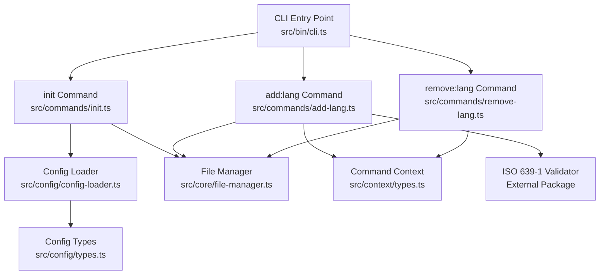
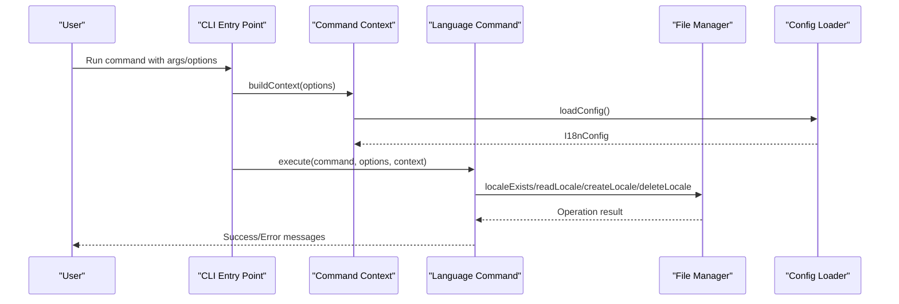
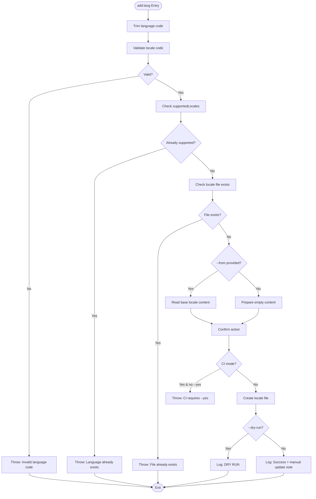
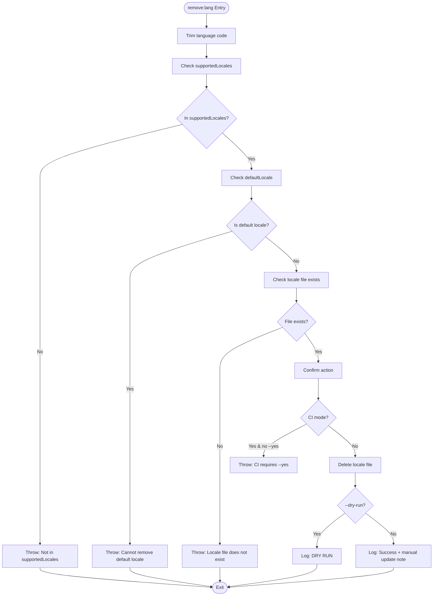
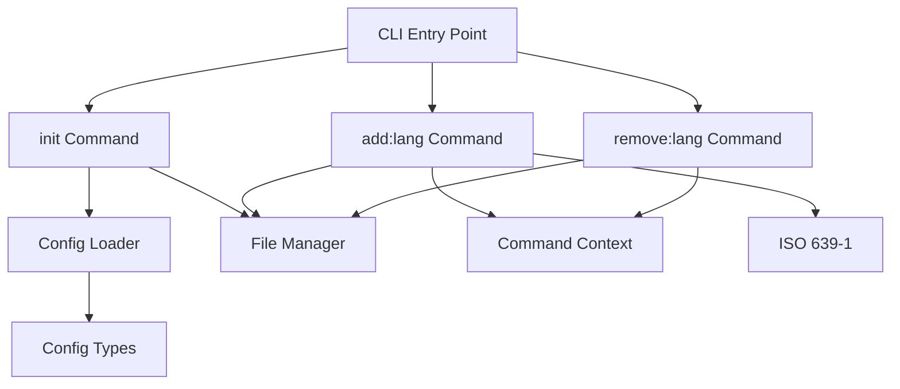

# Language Management Commands

<cite>
**Referenced Files in This Document**
- [cli.ts](file://src/bin/cli.ts)
- [init.ts](file://src/commands/init.ts)
- [add-lang.ts](file://src/commands/add-lang.ts)
- [remove-lang.ts](file://src/commands/remove-lang.ts)
- [config-loader.ts](file://src/config/config-loader.ts)
- [types.ts](file://src/config/types.ts)
- [file-manager.ts](file://src/core/file-manager.ts)
- [types.ts](file://src/context/types.ts)
- [add-lang.test.ts](file://unit-testing/commands/add-lang.test.ts)
- [remove-lang.test.ts](file://unit-testing/commands/remove-lang.test.ts)
- [init.test.ts](file://unit-testing/commands/init.test.ts)
- [README.md](file://README.md)
</cite>

## Table of Contents
1. [Introduction](#introduction)
2. [Project Structure](#project-structure)
3. [Core Components](#core-components)
4. [Architecture Overview](#architecture-overview)
5. [Detailed Component Analysis](#detailed-component-analysis)
6. [Dependency Analysis](#dependency-analysis)
7. [Performance Considerations](#performance-considerations)
8. [Troubleshooting Guide](#troubleshooting-guide)
9. [Conclusion](#conclusion)

## Introduction
This document provides comprehensive documentation for the language management commands in i18n-ai-cli: `init`, `add:lang`, and `remove:lang`. It explains command syntax, options, validation rules, configuration file creation, and practical usage scenarios including regional variants, cloning existing translations, and bulk language additions. It also covers error handling, troubleshooting, and best practices for language-related operations.

## Project Structure
The language management commands are implemented as part of the CLI application and integrate with configuration loading, file management, and context building. The commands are registered in the CLI entry point and executed within a shared command context that provides access to configuration and file operations.



**Diagram sources**
- [cli.ts:34-65](file://src/bin/cli.ts#L34-L65)
- [init.ts:25-182](file://src/commands/init.ts#L25-L182)
- [add-lang.ts:26-97](file://src/commands/add-lang.ts#L26-L97)
- [remove-lang.ts:5-73](file://src/commands/remove-lang.ts#L5-L73)
- [config-loader.ts:24-67](file://src/config/config-loader.ts#L24-L67)
- [file-manager.ts:5-117](file://src/core/file-manager.ts#L5-L117)
- [types.ts:3-11](file://src/config/types.ts#L3-L11)
- [types.ts:11-15](file://src/context/types.ts#L11-L15)

**Section sources**
- [cli.ts:34-65](file://src/bin/cli.ts#L34-L65)
- [init.ts:25-182](file://src/commands/init.ts#L25-L182)
- [add-lang.ts:26-97](file://src/commands/add-lang.ts#L26-L97)
- [remove-lang.ts:5-73](file://src/commands/remove-lang.ts#L5-L73)
- [config-loader.ts:24-67](file://src/config/config-loader.ts#L24-L67)
- [file-manager.ts:5-117](file://src/core/file-manager.ts#L5-L117)
- [types.ts:3-11](file://src/config/types.ts#L3-L11)
- [types.ts:11-15](file://src/context/types.ts#L11-L15)

## Core Components
- CLI Entry Point: Registers global options and language commands, builds command context, and executes commands.
- Configuration Loader: Loads and validates configuration files, compiles usage patterns, and enforces logical constraints.
- File Manager: Handles locale file operations including existence checks, creation, deletion, reading, and writing with optional sorting.
- Command Context: Provides access to configuration, file manager, and global options to commands.

**Section sources**
- [cli.ts:25-32](file://src/bin/cli.ts#L25-L32)
- [config-loader.ts:24-67](file://src/config/config-loader.ts#L24-L67)
- [file-manager.ts:5-117](file://src/core/file-manager.ts#L5-L117)
- [types.ts:11-15](file://src/context/types.ts#L11-L15)

## Architecture Overview
The language management commands operate within a consistent flow:
- Parse CLI arguments and options
- Build command context with configuration and file manager
- Validate inputs and configuration
- Confirm actions (unless skipped)
- Perform file operations (create/delete)
- Output results and guidance



**Diagram sources**
- [cli.ts:51-63](file://src/bin/cli.ts#L51-L63)
- [config-loader.ts:24-67](file://src/config/config-loader.ts#L24-L67)
- [file-manager.ts:22-98](file://src/core/file-manager.ts#L22-L98)

## Detailed Component Analysis

### init Command
Purpose: Creates an i18n-cli configuration file and initializes the default locale file.

Key behaviors:
- Detects existing configuration and enforces overwrite policy with `--force`
- Interactive mode prompts for locales path, default locale, supported locales, key style, auto-sort, and usage patterns
- Non-interactive mode uses defaults
- Normalizes supported locales and ensures default locale inclusion
- Compiles usage patterns and validates regex syntax and capturing groups
- Creates locales directory and default locale file if they do not exist

Command syntax:
```bash
i18n-ai-cli init
```

Options:
- `-f, --force`: Overwrite existing configuration
- `-y, --yes`: Skip confirmation prompts
- `--dry-run`: Preview changes without writing files
- `--ci`: CI mode (non-interactive; fails if changes would be made)

Validation and error handling:
- Throws if configuration exists and `--force` is not provided
- Throws if CI mode requires confirmation and `--yes` is not provided
- Throws on invalid JSON parsing or schema violations
- Throws on invalid regex patterns or missing capturing groups
- Throws if default locale is not included in supported locales or duplicates are found

Configuration file creation:
- Writes `i18n-cli.config.json` with fields: `localesPath`, `defaultLocale`, `supportedLocales`, `keyStyle`, `usagePatterns`, `autoSort`
- Ensures locales directory exists and creates default locale file if absent

Practical examples:
- Initialize with defaults: `i18n-ai-cli init`
- Force overwrite existing config: `i18n-ai-cli init --force`
- CI usage: `i18n-ai-cli init --ci --yes`

**Section sources**
- [init.ts:25-182](file://src/commands/init.ts#L25-L182)
- [config-loader.ts:24-67](file://src/config/config-loader.ts#L24-L67)
- [init.test.ts:51-138](file://unit-testing/commands/init.test.ts#L51-L138)
- [init.test.ts:186-225](file://unit-testing/commands/init.test.ts#L186-L225)
- [init.test.ts:246-265](file://unit-testing/commands/init.test.ts#L246-L265)
- [init.test.ts:267-289](file://unit-testing/commands/init.test.ts#L267-L289)
- [init.test.ts:291-314](file://unit-testing/commands/init.test.ts#L291-L314)

### add:lang Command
Purpose: Adds a new language locale with optional cloning from an existing locale.

Command syntax:
```bash
i18n-ai-cli add:lang <lang> [--from <locale>] [--strict]
```

Options:
- `--from <locale>`: Clone content from an existing locale
- `--strict`: Enable strict validation (placeholder for future use)
- `-y, --yes`: Skip confirmation
- `--dry-run`: Preview changes without writing files
- `--ci`: CI mode (non-interactive; fails if changes would be made)

Validation and error handling:
- Validates language code against ISO 639-1 standards (accepts language-region format)
- Checks that locale is not already in supported locales
- Verifies that the target locale file does not already exist
- If `--from` is provided, validates base locale exists and reads its content
- Throws if CI mode requires confirmation and `--yes` is not provided
- Throws on invalid locale code or conflicts with existing configuration

Processing logic:
- Trims whitespace from language code
- Confirms action unless skipped
- Creates locale file with empty content or cloned content
- Logs guidance to manually update supportedLocales in configuration

Common use cases:
- Adding a new language: `i18n-ai-cli add:lang fr`
- Cloning from an existing locale: `i18n-ai-cli add:lang de --from en`
- Regional variants: `i18n-ai-cli add:lang pt-BR --strict`
- Bulk additions: Repeat command for each locale



**Diagram sources**
- [add-lang.ts:34-97](file://src/commands/add-lang.ts#L34-L97)
- [file-manager.ts:80-98](file://src/core/file-manager.ts#L80-L98)

**Section sources**
- [add-lang.ts:26-97](file://src/commands/add-lang.ts#L26-L97)
- [add-lang.test.ts:44-108](file://unit-testing/commands/add-lang.test.ts#L44-L108)
- [add-lang.test.ts:123-140](file://unit-testing/commands/add-lang.test.ts#L123-L140)
- [add-lang.test.ts:167-192](file://unit-testing/commands/add-lang.test.ts#L167-L192)
- [add-lang.test.ts:194-206](file://unit-testing/commands/add-lang.test.ts#L194-L206)
- [add-lang.test.ts:208-217](file://unit-testing/commands/add-lang.test.ts#L208-L217)

### remove:lang Command
Purpose: Removes a language translation file after validating configuration and preventing removal of the default locale.

Command syntax:
```bash
i18n-ai-cli remove:lang <lang>
```

Options:
- `-y, --yes`: Skip confirmation
- `--dry-run`: Preview changes without writing files
- `--ci`: CI mode (non-interactive; fails if changes would be made)

Validation and error handling:
- Validates that the locale is in supportedLocales
- Prevents removal of the default locale
- Verifies that the locale file exists
- Throws if CI mode requires confirmation and `--yes` is not provided

Processing logic:
- Trims whitespace from language code
- Confirms action unless skipped
- Deletes the locale file
- Logs guidance to manually update supportedLocales in configuration

Common use cases:
- Removing a language: `i18n-ai-cli remove:lang fr`
- Bulk removals: Repeat command for each locale



**Diagram sources**
- [remove-lang.ts:14-73](file://src/commands/remove-lang.ts#L14-L73)
- [file-manager.ts:63-78](file://src/core/file-manager.ts#L63-L78)

**Section sources**
- [remove-lang.ts:5-73](file://src/commands/remove-lang.ts#L5-L73)
- [remove-lang.test.ts:43-57](file://unit-testing/commands/remove-lang.test.ts#L43-L57)
- [remove-lang.test.ts:94-101](file://unit-testing/commands/remove-lang.test.ts#L94-L101)
- [remove-lang.test.ts:138-149](file://unit-testing/commands/remove-lang.test.ts#L138-L149)

## Dependency Analysis
The language management commands depend on:
- CLI registration and global options
- Configuration loader for validation and compilation
- File manager for locale file operations
- ISO 639-1 validation for language codes



**Diagram sources**
- [cli.ts:34-65](file://src/bin/cli.ts#L34-L65)
- [init.ts:25-182](file://src/commands/init.ts#L25-L182)
- [add-lang.ts:26-97](file://src/commands/add-lang.ts#L26-L97)
- [remove-lang.ts:5-73](file://src/commands/remove-lang.ts#L5-L73)
- [config-loader.ts:24-67](file://src/config/config-loader.ts#L24-L67)
- [file-manager.ts:5-117](file://src/core/file-manager.ts#L5-L117)
- [types.ts:3-11](file://src/config/types.ts#L3-L11)
- [types.ts:11-15](file://src/context/types.ts#L11-L15)

**Section sources**
- [cli.ts:34-65](file://src/bin/cli.ts#L34-L65)
- [config-loader.ts:24-67](file://src/config/config-loader.ts#L24-L67)
- [file-manager.ts:5-117](file://src/core/file-manager.ts#L5-L117)
- [types.ts:3-11](file://src/config/types.ts#L3-L11)
- [types.ts:11-15](file://src/context/types.ts#L11-L15)

## Performance Considerations
- Locale file operations are lightweight JSON read/write operations; performance impact is minimal.
- Dry run mode avoids disk writes, enabling safe previews.
- Sorting locales is performed only when enabled in configuration; recursive sorting is linear in the number of keys plus nested structures.

## Troubleshooting Guide
Common issues and resolutions:
- Configuration not found: Ensure `i18n-cli.config.json` exists in project root or run `i18n-ai-cli init`.
- Invalid language code: Use valid ISO 639-1 codes or language-region format (e.g., `en-US`, `pt-BR`).
- Locale already exists: Choose a different locale code or remove the existing file first.
- Base locale not found: Verify the base locale exists in supportedLocales.
- Default locale removal attempted: Change defaultLocale in configuration before removing.
- CI mode failures: Add `--yes` to approve changes in non-interactive environments.
- Dry run mode: Use `--dry-run` to preview changes; no files are modified.

Validation rules:
- Language codes must be valid ISO 639-1 codes or language-region format.
- Supported locales must include the default locale and contain no duplicates.
- Usage patterns must be valid regex with capturing groups.

**Section sources**
- [config-loader.ts:69-82](file://src/config/config-loader.ts#L69-L82)
- [config-loader.ts:84-109](file://src/config/config-loader.ts#L84-L109)
- [add-lang.ts:36-47](file://src/commands/add-lang.ts#L36-L47)
- [remove-lang.ts:15-35](file://src/commands/remove-lang.ts#L15-L35)
- [init.ts:32-37](file://src/commands/init.ts#L32-L37)
- [init.ts:151-156](file://src/commands/init.ts#L151-L156)

## Conclusion
The language management commands in i18n-ai-cli provide robust functionality for initializing configurations, adding new locales with cloning capabilities, and removing locales safely. They enforce validation, support CI/CD workflows, and offer dry run previews. By following the documented syntax, options, and validation rules, users can efficiently manage translations across multiple languages and regions.