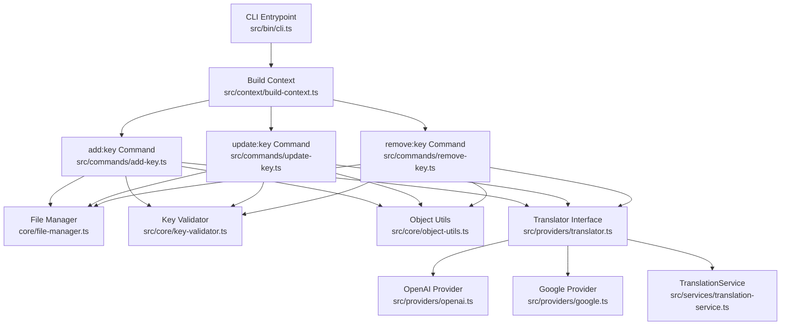
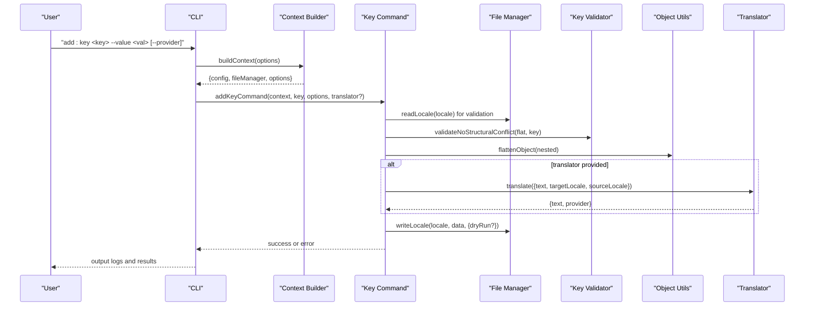
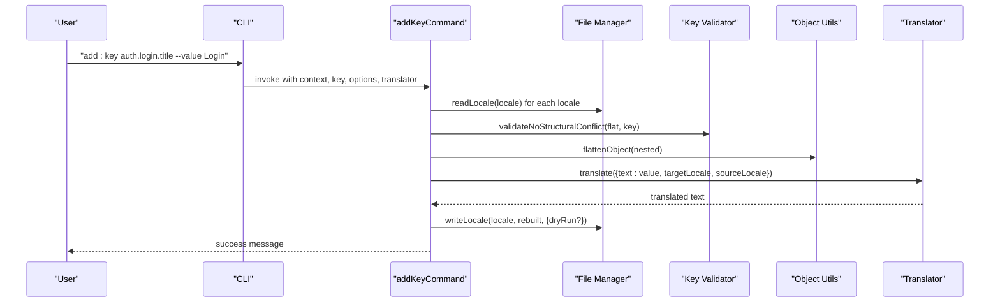
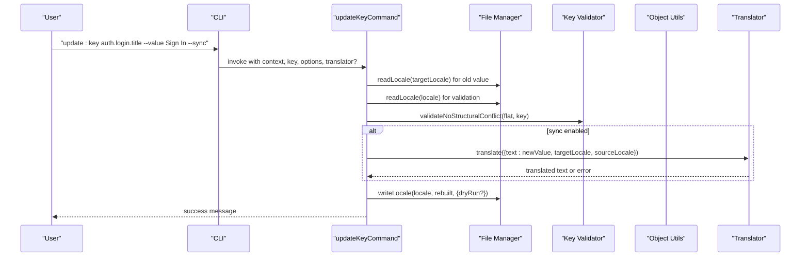
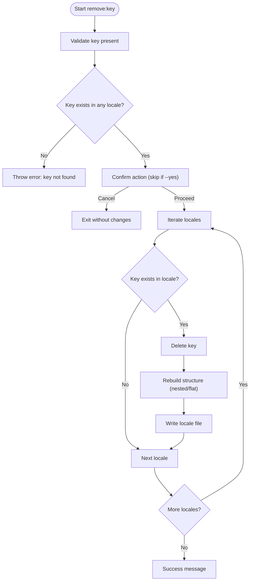
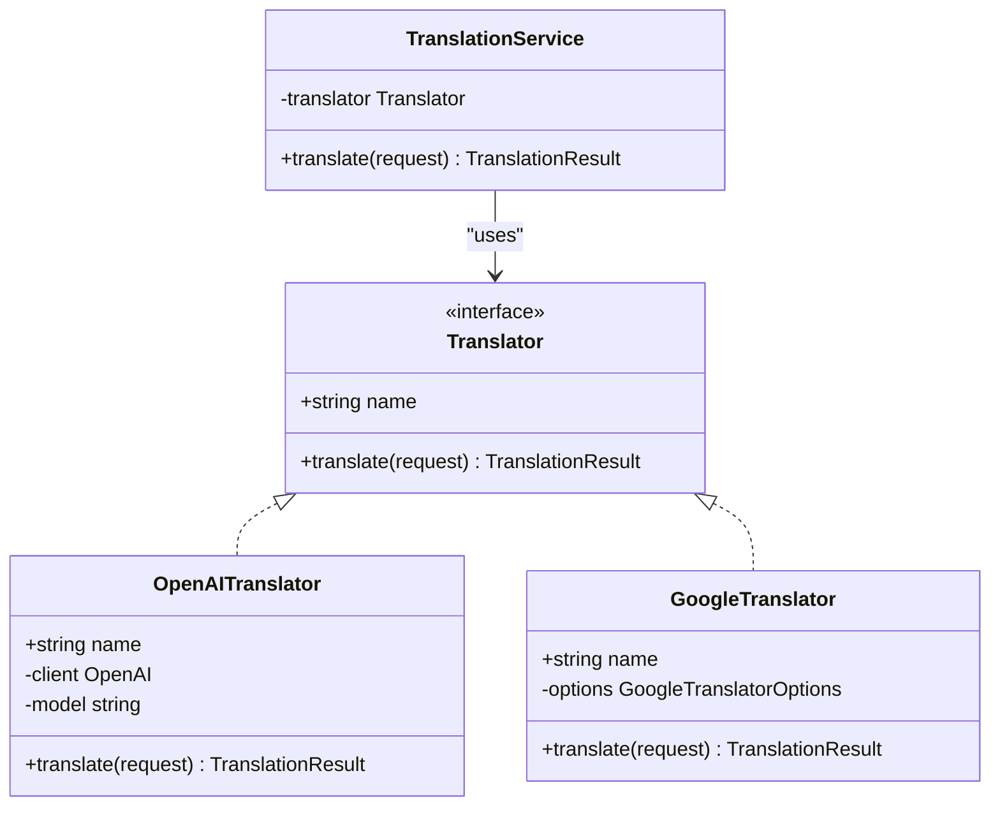
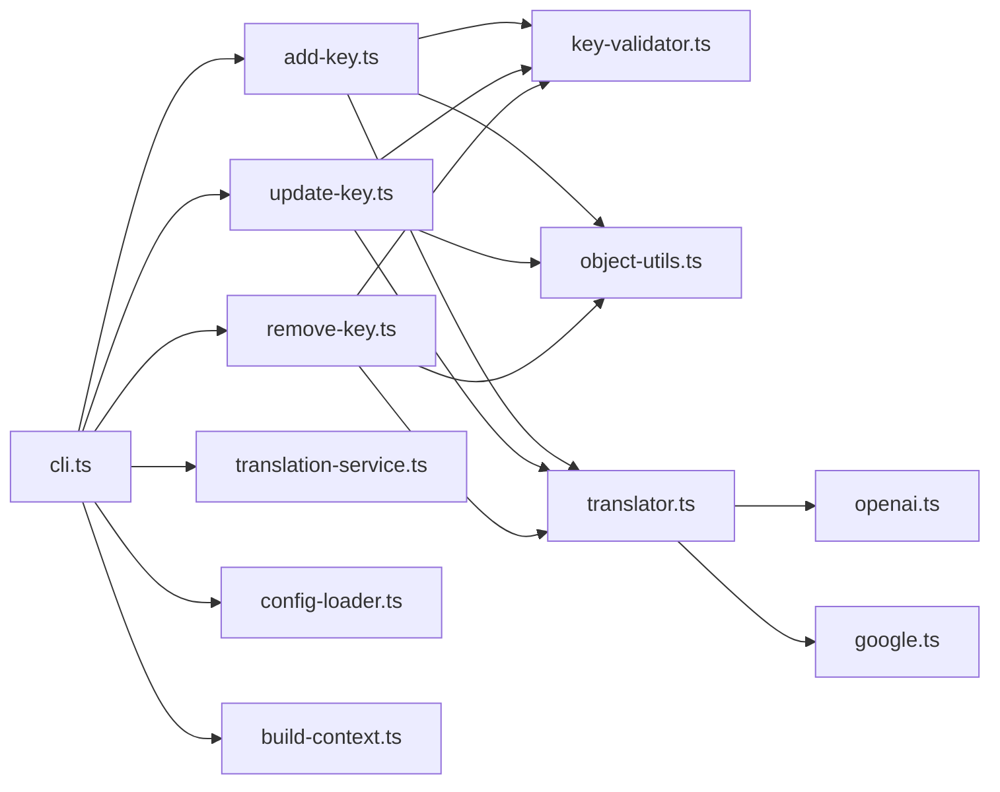

# Translation Key Commands

<cite>
**Referenced Files in This Document**
- [cli.ts](file://src/bin/cli.ts)
- [add-key.ts](file://src/commands/add-key.ts)
- [update-key.ts](file://src/commands/update-key.ts)
- [remove-key.ts](file://src/commands/remove-key.ts)
- [translator.ts](file://src/providers/translator.ts)
- [openai.ts](file://src/providers/openai.ts)
- [google.ts](file://src/providers/google.ts)
- [translation-service.ts](file://src/services/translation-service.ts)
- [key-validator.ts](file://src/core/key-validator.ts)
- [object-utils.ts](file://src/core/object-utils.ts)
- [config-loader.ts](file://src/config/config-loader.ts)
- [types.ts](file://src/config/types.ts)
- [build-context.ts](file://src/context/build-context.ts)
- [README.md](file://README.md)
- [add-key.test.ts](file://unit-testing/commands/add-key.test.ts)
- [update-key.test.ts](file://unit-testing/commands/update-key.test.ts)
- [remove-key.test.ts](file://unit-testing/commands/remove-key.test.ts)
</cite>

## Table of Contents
1. [Introduction](#introduction)
2. [Project Structure](#project-structure)
3. [Core Components](#core-components)
4. [Architecture Overview](#architecture-overview)
5. [Detailed Component Analysis](#detailed-component-analysis)
6. [Dependency Analysis](#dependency-analysis)
7. [Performance Considerations](#performance-considerations)
8. [Troubleshooting Guide](#troubleshooting-guide)
9. [Conclusion](#conclusion)
10. [Appendices](#appendices)

## Introduction
This document explains the translation key management commands: add:key, update:key, and remove:key. It covers key naming conventions, hierarchical key structures, value formatting, AI provider integration (OpenAI, Google Translate), translation options, provider selection logic, examples of complex key structures, batch operations, synchronization workflows, validation, conflict resolution, and best practices for organizing keys.

## Project Structure
The CLI exposes three primary commands under the "Key Management" domain. Each command orchestrates reading locale files, validating keys, translating values when needed, and writing updated locale files. AI translation is delegated to pluggable providers via a shared Translator interface.

**Diagram sources**
- [cli.ts:67-151](file://src/bin/cli.ts#L67-L151)
- [build-context.ts:5-16](file://src/context/build-context.ts#L5-L16)
- [add-key.ts:1-120](file://src/commands/add-key.ts#L1-L120)
- [update-key.ts:1-178](file://src/commands/update-key.ts#L1-L178)
- [remove-key.ts:1-96](file://src/commands/remove-key.ts#L1-L96)
- [key-validator.ts:1-33](file://src/core/key-validator.ts#L1-L33)
- [object-utils.ts:1-95](file://src/core/object-utils.ts#L1-L95)
- [translator.ts:1-60](file://src/providers/translator.ts#L1-L60)
- [openai.ts:1-60](file://src/providers/openai.ts#L1-L60)
- [google.ts:1-50](file://src/providers/google.ts#L1-L50)
- [translation-service.ts:1-18](file://src/services/translation-service.ts#L1-L18)

**Section sources**
- [cli.ts:67-151](file://src/bin/cli.ts#L67-L151)
- [build-context.ts:5-16](file://src/context/build-context.ts#L5-L16)

## Core Components
- add:key: Creates a new translation key across all locales, translates non-default locales using the selected provider, and writes updated locale files. It validates structural conflicts and prevents overwriting existing keys.
- update:key: Updates an existing key’s value in a specified locale or synchronizes the change to all locales via translation. Supports explicit locale targeting or bulk sync with graceful failure handling.
- remove:key: Removes a key from all locales where it exists, rebuilding nested structures and removing empty parent objects.

Key validation and structure handling:
- Structural conflict checks prevent creating keys that overlap with existing objects or would overwrite nested keys.
- Hierarchical keys are supported via dot notation and transformed between flat and nested forms depending on configuration.

AI provider integration:
- Translator interface defines a uniform contract for translation services.
- OpenAI provider uses a chat completion model with a concise system prompt.
- Google provider uses a third-party API wrapper with configurable options.
- TranslationService wraps a Translator for simplified usage.

Configuration:
- Key style (flat vs nested) determines whether keys are written as dot-separated strings or nested objects.
- Supported locales and default locale define the scope of operations.

**Section sources**
- [add-key.ts:8-120](file://src/commands/add-key.ts#L8-L120)
- [update-key.ts:17-178](file://src/commands/update-key.ts#L17-L178)
- [remove-key.ts:10-96](file://src/commands/remove-key.ts#L10-L96)
- [key-validator.ts:1-33](file://src/core/key-validator.ts#L1-L33)
- [object-utils.ts:1-95](file://src/core/object-utils.ts#L1-L95)
- [translator.ts:1-60](file://src/providers/translator.ts#L1-L60)
- [openai.ts:9-60](file://src/providers/openai.ts#L9-L60)
- [google.ts:9-50](file://src/providers/google.ts#L9-L50)
- [translation-service.ts:7-18](file://src/services/translation-service.ts#L7-L18)
- [types.ts:1-12](file://src/config/types.ts#L1-L12)
- [config-loader.ts:8-15](file://src/config/config-loader.ts#L8-L15)

## Architecture Overview
The CLI composes a command context from configuration and file manager, then executes the chosen key command. Commands rely on validators and object utilities to maintain consistent key structures. AI translation is performed through a provider abstraction, enabling pluggable backends.

**Diagram sources**
- [cli.ts:77-101](file://src/bin/cli.ts#L77-L101)
- [build-context.ts:5-16](file://src/context/build-context.ts#L5-L16)
- [add-key.ts:30-104](file://src/commands/add-key.ts#L30-L104)
- [key-validator.ts:1-33](file://src/core/key-validator.ts#L1-L33)
- [object-utils.ts:17-39](file://src/core/object-utils.ts#L17-L39)
- [translator.ts:14-17](file://src/providers/translator.ts#L14-L17)
- [openai.ts:30-58](file://src/providers/openai.ts#L30-L58)
- [google.ts:17-48](file://src/providers/google.ts#L17-L48)

## Detailed Component Analysis

### add:key Command
Purpose:
- Add a new translation key to all supported locales.
- Translate non-default locales using the selected provider.
- Respect dry-run, CI, and confirmation modes.

Processing logic:
- Validates presence of key and value.
- Iterates locales to validate structural conflicts and ensure key absence.
- Prompts for confirmation unless skipped.
- Translates the default-locale value for each non-default locale.
- Writes updated locale files in either flat or nested form based on configuration.

Key behaviors validated by tests:
- Structural conflict detection for parent and child overlaps.
- Nested vs flat key writing based on configuration.
- Graceful handling of translation failures (empty fallback).
- Dry-run and CI mode enforcement.

Best practices:
- Prefer dot notation for hierarchical keys.
- Use nested keyStyle for readability in large projects.
- Provide a meaningful default-locale value for accurate translations.

**Diagram sources**
- [add-key.ts:30-104](file://src/commands/add-key.ts#L30-L104)
- [key-validator.ts:1-33](file://src/core/key-validator.ts#L1-L33)
- [object-utils.ts:17-39](file://src/core/object-utils.ts#L17-L39)
- [openai.ts:30-58](file://src/providers/openai.ts#L30-L58)
- [google.ts:17-48](file://src/providers/google.ts#L17-L48)

**Section sources**
- [add-key.ts:8-120](file://src/commands/add-key.ts#L8-L120)
- [add-key.test.ts:104-141](file://unit-testing/commands/add-key.test.ts#L104-L141)
- [add-key.test.ts:143-177](file://unit-testing/commands/add-key.test.ts#L143-L177)
- [add-key.test.ts:279-304](file://unit-testing/commands/add-key.test.ts#L279-L304)

### update:key Command
Purpose:
- Update an existing key’s value in a specific locale or synchronize changes across all locales using translation.
- Enforce mutual exclusivity between locale-specific updates and sync mode.

Processing logic:
- Validates key and value presence.
- Determines target locale (explicit or default) and sync mode.
- Confirms structural conflicts and key existence.
- Shows old and new values for transparency.
- Optionally translates to all other locales and handles failures by preserving existing values.

Key behaviors validated by tests:
- Locale-specific updates versus sync behavior.
- Mutual exclusivity warning when both --locale and --sync are provided.
- Preservation of existing values on translation failure during sync.
- Nested vs flat updates.

**Diagram sources**
- [update-key.ts:51-156](file://src/commands/update-key.ts#L51-L156)
- [key-validator.ts:1-33](file://src/core/key-validator.ts#L1-L33)
- [object-utils.ts:17-39](file://src/core/object-utils.ts#L17-L39)
- [openai.ts:30-58](file://src/providers/openai.ts#L30-L58)
- [google.ts:17-48](file://src/providers/google.ts#L17-L48)

**Section sources**
- [update-key.ts:17-178](file://src/commands/update-key.ts#L17-L178)
- [update-key.test.ts:301-334](file://unit-testing/commands/update-key.test.ts#L301-L334)
- [update-key.test.ts:336-367](file://unit-testing/commands/update-key.test.ts#L336-L367)
- [update-key.test.ts:424-459](file://unit-testing/commands/update-key.test.ts#L424-L459)

### remove:key Command
Purpose:
- Remove a key from all locales where it exists.
- Rebuild nested structures and prune empty parent objects.

Processing logic:
- Identifies locales containing the key.
- Confirms action unless skipped.
- Removes the key from each locale and writes updated files.

**Diagram sources**
- [remove-key.ts:10-96](file://src/commands/remove-key.ts#L10-L96)
- [object-utils.ts:41-95](file://src/core/object-utils.ts#L41-L95)

**Section sources**
- [remove-key.ts:10-96](file://src/commands/remove-key.ts#L10-L96)
- [remove-key.test.ts:62-87](file://unit-testing/commands/remove-key.test.ts#L62-L87)
- [remove-key.test.ts:105-127](file://unit-testing/commands/remove-key.test.ts#L105-L127)
- [remove-key.test.ts:148-160](file://unit-testing/commands/remove-key.test.ts#L148-L160)

### AI Provider Integration
Provider selection logic:
- Explicit --provider flag takes highest priority.
- If OPENAI_API_KEY environment variable is set, OpenAI is used automatically.
- Otherwise, Google Translate is used as a fallback.

Provider capabilities:
- OpenAI: Chat-based translation with system/user messages; supports custom model and base URL.
- Google: Translation via @vitalets/google-translate-api with optional host and fetch options.

TranslationService:
- Thin wrapper around Translator for consistent translation invocation.

**Diagram sources**
- [translator.ts:14-17](file://src/providers/translator.ts#L14-L17)
- [openai.ts:9-28](file://src/providers/openai.ts#L9-L28)
- [google.ts:9-15](file://src/providers/google.ts#L9-L15)
- [translation-service.ts:7-18](file://src/services/translation-service.ts#L7-L18)

**Section sources**
- [cli.ts:82-98](file://src/bin/cli.ts#L82-L98)
- [cli.ts:118-136](file://src/bin/cli.ts#L118-L136)
- [openai.ts:14-28](file://src/providers/openai.ts#L14-L28)
- [google.ts:13-15](file://src/providers/google.ts#L13-L15)
- [translation-service.ts:7-18](file://src/services/translation-service.ts#L7-L18)

## Dependency Analysis
- Commands depend on:
  - Context builder for configuration and file manager.
  - Key validator for structural safety.
  - Object utils for flattening/unflattening and cleaning empty objects.
  - Translator interface and concrete providers for AI translation.
- Provider selection is centralized in CLI command handlers and respects environment variables.

**Diagram sources**
- [cli.ts:67-151](file://src/bin/cli.ts#L67-L151)
- [add-key.ts:1-120](file://src/commands/add-key.ts#L1-L120)
- [update-key.ts:1-178](file://src/commands/update-key.ts#L1-L178)
- [remove-key.ts:1-96](file://src/commands/remove-key.ts#L1-L96)
- [key-validator.ts:1-33](file://src/core/key-validator.ts#L1-L33)
- [object-utils.ts:1-95](file://src/core/object-utils.ts#L1-L95)
- [translator.ts:1-60](file://src/providers/translator.ts#L1-L60)
- [openai.ts:1-60](file://src/providers/openai.ts#L1-L60)
- [google.ts:1-50](file://src/providers/google.ts#L1-L50)
- [translation-service.ts:1-18](file://src/services/translation-service.ts#L1-L18)
- [config-loader.ts:1-176](file://src/config/config-loader.ts#L1-L176)
- [build-context.ts:1-16](file://src/context/build-context.ts#L1-L16)

**Section sources**
- [cli.ts:67-151](file://src/bin/cli.ts#L67-L151)

## Performance Considerations
- Batch operations: add:key and update:key iterate over all supported locales; consider limiting locales or using dry-run to preview changes.
- Translation latency: Synchronous provider calls per locale can increase runtime; prefer batching where feasible in higher-level integrations.
- File I/O: Two-pass operations (validation + write) for add:key and remove:key; one-pass for update:key when not syncing.
- Memory usage: Flattening and unflattening objects is linear in key count; nested keyStyle increases nesting depth but maintains performance.

## Troubleshooting Guide
Common issues and resolutions:
- Missing configuration: Ensure i18n-cli.config.json exists and is valid; the loader validates required fields and supported locales.
- Structural conflicts: When adding keys, avoid naming keys that overlap with existing objects or nested keys; the validator throws descriptive errors.
- Key not found:
  - add:key requires the key to be absent in all locales; use update:key if the key exists.
  - update:key requires the key to exist in the target locale(s); add it first if missing.
- Translation failures:
  - During add:key and update:key sync, failures are logged and handled gracefully (empty value for add:key, preserved value for update:key sync).
- Provider setup:
  - OpenAI requires an API key; set OPENAI_API_KEY or pass --provider explicitly.
  - Google Translate works out-of-the-box; configure host/fetch options if needed.
- Dry-run and CI:
  - Use --dry-run to preview changes; use --ci with --yes to enforce non-interactive application in pipelines.

Validation and tests:
- Unit tests demonstrate structural conflict handling, nested/flat key behavior, sync failures, and CI/dry-run enforcement.

**Section sources**
- [config-loader.ts:24-67](file://src/config/config-loader.ts#L24-L67)
- [key-validator.ts:1-33](file://src/core/key-validator.ts#L1-L33)
- [add-key.ts:37-41](file://src/commands/add-key.ts#L37-L41)
- [update-key.ts:73-78](file://src/commands/update-key.ts#L73-L78)
- [openai.ts:14-21](file://src/providers/openai.ts#L14-L21)
- [google.ts:13-15](file://src/providers/google.ts#L13-L15)
- [add-key.test.ts:104-141](file://unit-testing/commands/add-key.test.ts#L104-L141)
- [update-key.test.ts:107-118](file://unit-testing/commands/update-key.test.ts#L107-L118)
- [remove-key.test.ts:51-60](file://unit-testing/commands/remove-key.test.ts#L51-L60)

## Conclusion
The translation key commands provide a robust, provider-agnostic workflow for managing i18n keys. They enforce structural integrity, support hierarchical key styles, and integrate AI translation seamlessly. By following the best practices outlined here—using nested keys for clarity, validating structure, leveraging sync for consistency, and selecting appropriate providers—you can maintain clean, scalable translation files across multiple locales.

## Appendices

### Key Naming Conventions and Hierarchical Structures
- Use dot notation for hierarchical keys (e.g., auth.login.title).
- Nested keyStyle produces nested objects; flat keyStyle stores dot-delimited keys as top-level entries.
- Avoid unsafe segments (__proto__, constructor, prototype) in keys.

**Section sources**
- [object-utils.ts:3-15](file://src/core/object-utils.ts#L3-L15)
- [object-utils.ts:41-64](file://src/core/object-utils.ts#L41-L64)
- [types.ts:1-12](file://src/config/types.ts#L1-L12)

### Provider Selection Logic
- Priority order: --provider flag > OPENAI_API_KEY environment variable > Google Translate fallback.

**Section sources**
- [cli.ts:82-98](file://src/bin/cli.ts#L82-L98)
- [cli.ts:118-136](file://src/bin/cli.ts#L118-L136)
- [openai.ts:14-21](file://src/providers/openai.ts#L14-L21)
- [google.ts:13-15](file://src/providers/google.ts#L13-L15)

### Example Workflows
- Add a new key with AI translation:
  - Use add:key with --value and optional --provider.
- Update and sync across locales:
  - Use update:key with --value and --sync; optionally specify --locale to bypass sync.
- Remove a key from all locales:
  - Use remove:key with the key name.

For detailed usage and examples, refer to the README.

**Section sources**
- [README.md:135-187](file://README.md#L135-L187)
- [README.md:248-266](file://README.md#L248-L266)