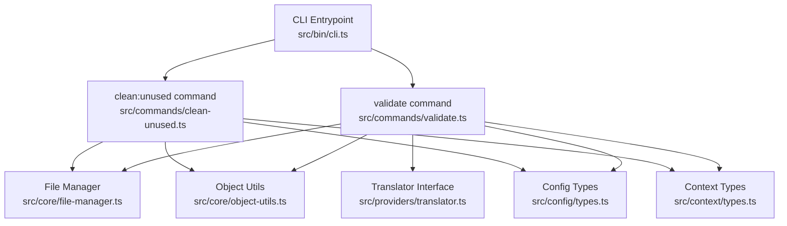
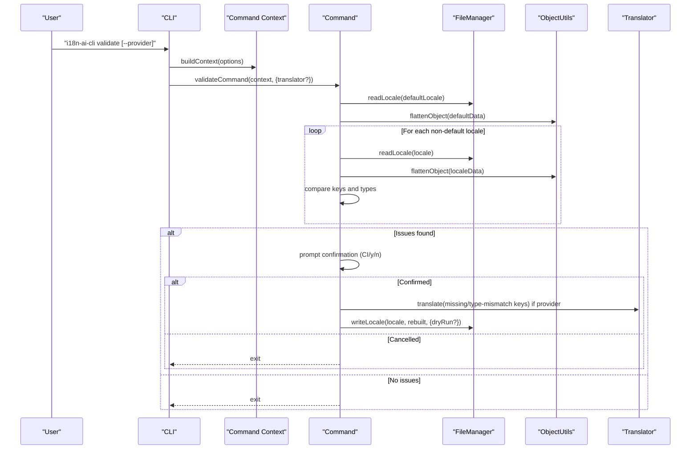
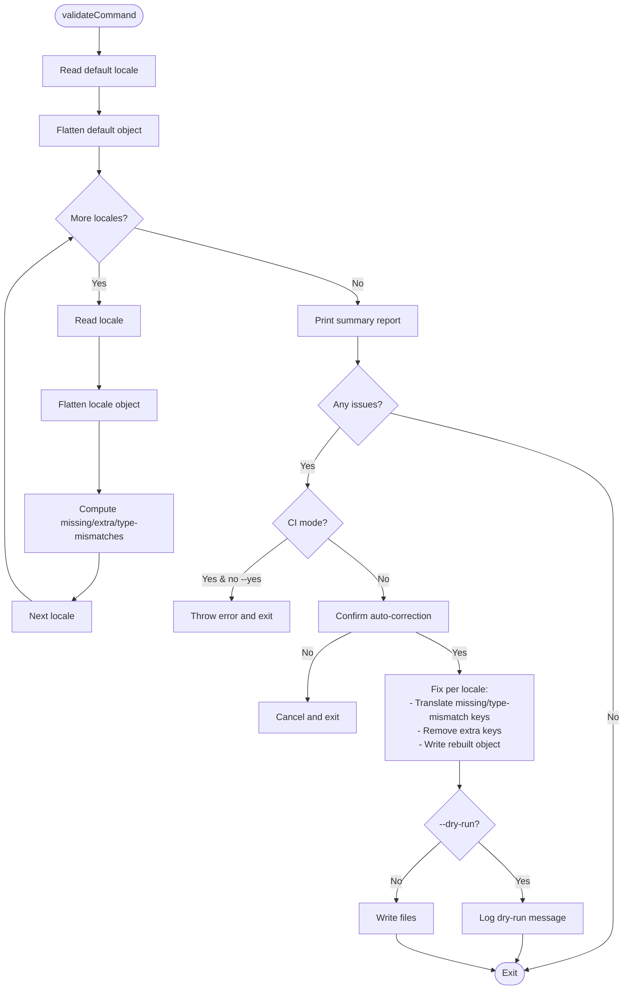
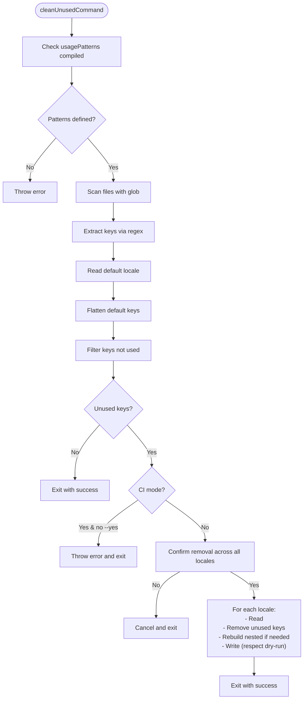
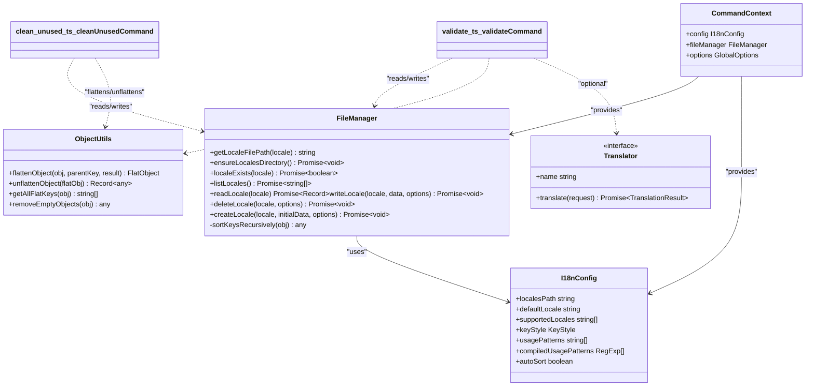
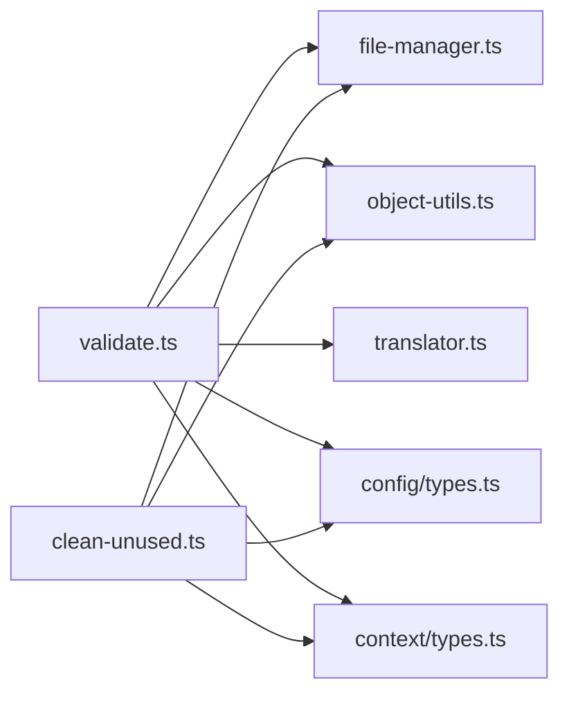

# Validation and Maintenance Commands

<cite>
**Referenced Files in This Document**
- [cli.ts](file://src/bin/cli.ts)
- [validate.ts](file://src/commands/validate.ts)
- [clean-unused.ts](file://src/commands/clean-unused.ts)
- [file-manager.ts](file://src/core/file-manager.ts)
- [object-utils.ts](file://src/core/object-utils.ts)
- [key-validator.ts](file://src/core/key-validator.ts)
- [translator.ts](file://src/providers/translator.ts)
- [types.ts](file://src/config/types.ts)
- [types.ts](file://src/context/types.ts)
- [validate.test.ts](file://unit-testing/commands/validate.test.ts)
- [clean-unused.test.ts](file://unit-testing/commands/clean-unused.test.ts)
- [README.md](file://README.md)
- [package.json](file://package.json)
</cite>

## Table of Contents
1. [Introduction](#introduction)
2. [Project Structure](#project-structure)
3. [Core Components](#core-components)
4. [Architecture Overview](#architecture-overview)
5. [Detailed Component Analysis](#detailed-component-analysis)
6. [Dependency Analysis](#dependency-analysis)
7. [Performance Considerations](#performance-considerations)
8. [Troubleshooting Guide](#troubleshooting-guide)
9. [Conclusion](#conclusion)
10. [Appendices](#appendices)

## Introduction
This document explains the validation and maintenance commands that ensure translation file integrity and cleanliness. It covers:
- validate: checks translation files against a default reference locale, detects missing keys, extra keys, and type mismatches, and can auto-correct issues (including translating missing keys).
- clean:unused: scans source code for translation usage and removes orphaned keys from all locales.

It documents validation rules, error detection mechanisms, auto-correction strategies, CI/CD integration patterns, dry-run previews, and performance considerations for large translation sets.

## Project Structure
The validation and maintenance commands are implemented as CLI subcommands with shared utilities for file operations, object flattening/unflattening, and configuration typing.

**Diagram sources**
- [cli.ts:1-209](file://src/bin/cli.ts#L1-L209)
- [validate.ts:1-254](file://src/commands/validate.ts#L1-L254)
- [clean-unused.ts:1-138](file://src/commands/clean-unused.ts#L1-L138)
- [file-manager.ts:1-118](file://src/core/file-manager.ts#L1-L118)
- [object-utils.ts:1-95](file://src/core/object-utils.ts#L1-L95)
- [translator.ts:1-60](file://src/providers/translator.ts#L1-L60)
- [types.ts:1-12](file://src/config/types.ts#L1-L12)
- [types.ts:1-15](file://src/context/types.ts#L1-L15)

**Section sources**
- [cli.ts:1-209](file://src/bin/cli.ts#L1-L209)
- [validate.ts:1-254](file://src/commands/validate.ts#L1-L254)
- [clean-unused.ts:1-138](file://src/commands/clean-unused.ts#L1-L138)
- [file-manager.ts:1-118](file://src/core/file-manager.ts#L1-L118)
- [object-utils.ts:1-95](file://src/core/object-utils.ts#L1-L95)
- [translator.ts:1-60](file://src/providers/translator.ts#L1-L60)
- [types.ts:1-12](file://src/config/types.ts#L1-L12)
- [types.ts:1-15](file://src/context/types.ts#L1-L15)

## Core Components
- validate command: Reads the default locale as the reference, compares each supported locale, detects missing/extra/type mismatched keys, prints a report, and optionally auto-corrects by adding missing keys (empty or translated), removing extra keys, and fixing type mismatches.
- clean:unused command: Scans source files using configured usage patterns, identifies used keys, removes unused keys from all locales, and supports dry-run and CI modes.
- Shared utilities:
  - FileManager: reads/writes locale files, supports dry-run, and optional auto-sorting.
  - Object utils: flatten/unflatten nested objects and safe key handling.
  - Translator interface: unified contract for translation providers.
  - Config and context types: define configuration shape and runtime context.

**Section sources**
- [validate.ts:121-254](file://src/commands/validate.ts#L121-L254)
- [clean-unused.ts:8-138](file://src/commands/clean-unused.ts#L8-L138)
- [file-manager.ts:31-98](file://src/core/file-manager.ts#L31-L98)
- [object-utils.ts:17-64](file://src/core/object-utils.ts#L17-L64)
- [translator.ts:14-17](file://src/providers/translator.ts#L14-L17)
- [types.ts:3-11](file://src/config/types.ts#L3-L11)
- [types.ts:11-15](file://src/context/types.ts#L11-L15)

## Architecture Overview
The CLI orchestrates commands, builds a context with configuration and file manager, and delegates to validators and translators as needed.

**Diagram sources**
- [cli.ts:164-198](file://src/bin/cli.ts#L164-L198)
- [validate.ts:121-254](file://src/commands/validate.ts#L121-L254)
- [file-manager.ts:31-61](file://src/core/file-manager.ts#L31-L61)
- [object-utils.ts:17-39](file://src/core/object-utils.ts#L17-L39)
- [translator.ts:14-17](file://src/providers/translator.ts#L14-L17)

## Detailed Component Analysis

### validate command
Purpose:
- Validate translation files against a default reference locale.
- Detect missing keys, extra keys, and type mismatches.
- Auto-correct by adding missing keys (empty or translated), removing extra keys, and fixing type mismatches.

Key behaviors:
- Reads default locale and flattens to a flat key map.
- Iterates non-default locales, flattens, and computes differences.
- Prints a summary per locale and total issues.
- Supports CI mode and dry-run.
- Auto-correction requires confirmation unless --yes is provided.
- Uses a translator to populate missing/type-mismatched keys when available.

Validation rules:
- Missing keys: present in default but absent in locale.
- Extra keys: present in locale but absent in default.
- Type mismatches: same key exists in both but with different types.

Auto-correction strategies:
- Missing keys: add with empty string if no translator; otherwise translate from default locale value.
- Extra keys: remove from locale.
- Type mismatches: translate the default value into the locale’s expected type.

Dry-run and CI modes:
- Dry-run: prints changes without writing files.
- CI mode: fails immediately if issues are found and --yes is not provided.

**Diagram sources**
- [validate.ts:121-254](file://src/commands/validate.ts#L121-L254)

**Section sources**
- [validate.ts:11-29](file://src/commands/validate.ts#L11-L29)
- [validate.ts:31-100](file://src/commands/validate.ts#L31-L100)
- [validate.ts:121-254](file://src/commands/validate.ts#L121-L254)
- [validate.test.ts:68-133](file://unit-testing/commands/validate.test.ts#L68-L133)
- [validate.test.ts:168-185](file://unit-testing/commands/validate.test.ts#L168-L185)
- [validate.test.ts:212-228](file://unit-testing/commands/validate.test.ts#L212-L228)
- [validate.test.ts:230-245](file://unit-testing/commands/validate.test.ts#L230-L245)
- [validate.test.ts:247-265](file://unit-testing/commands/validate.test.ts#L247-L265)
- [validate.test.ts:267-283](file://unit-testing/commands/validate.test.ts#L267-L283)
- [validate.test.ts:285-295](file://unit-testing/commands/validate.test.ts#L285-L295)
- [validate.test.ts:297-309](file://unit-testing/commands/validate.test.ts#L297-L309)
- [validate.test.ts:311-322](file://unit-testing/commands/validate.test.ts#L311-L322)
- [validate.test.ts:324-340](file://unit-testing/commands/validate.test.ts#L324-L340)
- [validate.test.ts:342-366](file://unit-testing/commands/validate.test.ts#L342-L366)
- [validate.test.ts:368-379](file://unit-testing/commands/validate.test.ts#L368-L379)

### clean:unused command
Purpose:
- Remove orphaned translation keys from all locales by scanning source files using configured usage patterns.

Key behaviors:
- Validates presence of usage patterns.
- Scans project files matching a set of extensions.
- Extracts translation keys using compiled regex patterns (supports named capture groups).
- Compares default locale keys to used keys and removes unused ones from all locales.
- Supports confirmation prompts, dry-run, and CI modes.

**Diagram sources**
- [clean-unused.ts:8-138](file://src/commands/clean-unused.ts#L8-L138)

**Section sources**
- [clean-unused.ts:17-23](file://src/commands/clean-unused.ts#L17-L23)
- [clean-unused.ts:25-46](file://src/commands/clean-unused.ts#L25-L46)
- [clean-unused.ts:52-61](file://src/commands/clean-unused.ts#L52-L61)
- [clean-unused.ts:88-97](file://src/commands/clean-unused.ts#L88-L97)
- [clean-unused.ts:104-124](file://src/commands/clean-unused.ts#L104-L124)
- [clean-unused.test.ts:63-70](file://unit-testing/commands/clean-unused.test.ts#L63-L70)
- [clean-unused.test.ts:85-124](file://unit-testing/commands/clean-unused.test.ts#L85-L124)
- [clean-unused.test.ts:150-172](file://unit-testing/commands/clean-unused.test.ts#L150-L172)
- [clean-unused.test.ts:174-194](file://unit-testing/commands/clean-unused.test.ts#L174-L194)
- [clean-unused.test.ts:196-213](file://unit-testing/commands/clean-unused.test.ts#L196-L213)
- [clean-unused.test.ts:215-227](file://unit-testing/commands/clean-unused.test.ts#L215-L227)
- [clean-unused.test.ts:229-242](file://unit-testing/commands/clean-unused.test.ts#L229-L242)
- [clean-unused.test.ts:244-257](file://unit-testing/commands/clean-unused.test.ts#L244-L257)
- [clean-unused.test.ts:259-277](file://unit-testing/commands/clean-unused.test.ts#L259-L277)
- [clean-unused.test.ts:279-301](file://unit-testing/commands/clean-unused.test.ts#L279-L301)
- [clean-unused.test.ts:303-326](file://unit-testing/commands/clean-unused.test.ts#L303-L326)
- [clean-unused.test.ts:327-339](file://unit-testing/commands/clean-unused.test.ts#L327-L339)

### Supporting Utilities and Interfaces
- FileManager: handles locale file I/O, directory creation, existence checks, and writes with optional dry-run and auto-sorting.
- Object utils: safely flattens and unflattens nested objects, validates key segments, and cleans empty objects.
- Translator interface: defines a unified contract for translation providers.
- Config and context types: define configuration shape and runtime context passed to commands.

**Diagram sources**
- [file-manager.ts:5-118](file://src/core/file-manager.ts#L5-L118)
- [object-utils.ts:17-64](file://src/core/object-utils.ts#L17-L64)
- [translator.ts:14-17](file://src/providers/translator.ts#L14-L17)
- [types.ts:3-11](file://src/config/types.ts#L3-L11)
- [types.ts:11-15](file://src/context/types.ts#L11-L15)
- [validate.ts:121-254](file://src/commands/validate.ts#L121-L254)
- [clean-unused.ts:8-138](file://src/commands/clean-unused.ts#L8-L138)

**Section sources**
- [file-manager.ts:31-98](file://src/core/file-manager.ts#L31-L98)
- [object-utils.ts:17-64](file://src/core/object-utils.ts#L17-L64)
- [translator.ts:14-17](file://src/providers/translator.ts#L14-L17)
- [types.ts:3-11](file://src/config/types.ts#L3-L11)
- [types.ts:11-15](file://src/context/types.ts#L11-L15)

## Dependency Analysis
- validate depends on:
  - FileManager for reading/writing locale files.
  - ObjectUtils for flattening/unflattening nested structures.
  - Translator interface for optional translation of missing/type-mismatched keys.
  - Config and context types for configuration and runtime context.
- clean:unused depends on:
  - FileManager for reading/writing locale files.
  - ObjectUtils for flattening/unflattening nested structures.
  - Config and context types for configuration and runtime context.
  - Glob and fs-extra for scanning and reading source files.

**Diagram sources**
- [validate.ts:1-10](file://src/commands/validate.ts#L1-L10)
- [clean-unused.ts:1-6](file://src/commands/clean-unused.ts#L1-L6)
- [file-manager.ts:1-3](file://src/core/file-manager.ts#L1-L3)
- [object-utils.ts:1-2](file://src/core/object-utils.ts#L1-L2)
- [translator.ts:1-6](file://src/providers/translator.ts#L1-L6)
- [types.ts:1-12](file://src/config/types.ts#L1-L12)
- [types.ts:1-15](file://src/context/types.ts#L1-L15)

**Section sources**
- [validate.ts:1-10](file://src/commands/validate.ts#L1-L10)
- [clean-unused.ts:1-6](file://src/commands/clean-unused.ts#L1-L6)
- [file-manager.ts:1-3](file://src/core/file-manager.ts#L1-L3)
- [object-utils.ts:1-2](file://src/core/object-utils.ts#L1-L2)
- [translator.ts:1-6](file://src/providers/translator.ts#L1-L6)
- [types.ts:1-12](file://src/config/types.ts#L1-L12)
- [types.ts:1-15](file://src/context/types.ts#L1-L15)

## Performance Considerations
- Large translation files:
  - Flattening and unflattening nested objects is linear in the number of keys. For very large locales, consider enabling auto-sorting to reduce churn and improve diffs.
  - The validate command iterates over all non-default locales once per locale; complexity is O(L × K) where L is number of locales and K is average number of keys.
  - The clean:unused command scans all source files and applies regex matching; complexity is O(F × M × P) where F is number of files, M is average file size, and P is number of patterns.
- Optimization techniques:
  - Use flat key style to reduce nesting overhead if acceptable for your project.
  - Limit usagePatterns to precise, efficient regex to minimize scanning cost.
  - Prefer dry-run to preview changes before applying to large datasets.
  - Batch operations: the commands operate per locale; avoid unnecessary repeated reads by leveraging caching at the caller level if integrating programmatically.

[No sources needed since this section provides general guidance]

## Troubleshooting Guide
Common issues and resolutions:
- CI mode failures:
  - validate: If issues are found and --yes is not provided, CI mode throws an error. Re-run with --yes to auto-correct.
  - clean:unused: If unused keys are found and --yes is not provided, CI mode throws an error. Re-run with --yes to apply.
- Dry-run mode:
  - Both commands accept --dry-run to preview changes without writing files. Verify logs for intended modifications.
- Missing usagePatterns:
  - clean:unused requires compiled usage patterns; otherwise it throws an error. Configure usagePatterns in the i18n config.
- Translation provider selection:
  - validate supports explicit --provider or environment-based fallback. Ensure OPENAI_API_KEY is set if using OpenAI.
- Structural conflicts:
  - While not part of validate/clean, key-validator prevents structural conflicts when adding keys. Resolve conflicts before adding keys.

**Section sources**
- [validate.ts:172-176](file://src/commands/validate.ts#L172-L176)
- [validate.ts:242-252](file://src/commands/validate.ts#L242-L252)
- [clean-unused.ts:19-23](file://src/commands/clean-unused.ts#L19-L23)
- [clean-unused.ts:88-92](file://src/commands/clean-unused.ts#L88-L92)
- [clean-unused.ts:126-130](file://src/commands/clean-unused.ts#L126-L130)
- [validate.test.ts:285-295](file://unit-testing/commands/validate.test.ts#L285-L295)
- [validate.test.ts:297-309](file://unit-testing/commands/validate.test.ts#L297-L309)
- [clean-unused.test.ts:215-227](file://unit-testing/commands/clean-unused.test.ts#L215-L227)
- [clean-unused.test.ts:229-242](file://unit-testing/commands/clean-unused.test.ts#L229-L242)
- [clean-unused.test.ts:196-213](file://unit-testing/commands/clean-unused.test.ts#L196-L213)
- [clean-unused.test.ts:215-227](file://unit-testing/commands/clean-unused.test.ts#L215-L227)

## Conclusion
The validate and clean:unused commands provide robust automation for maintaining translation integrity and cleanliness. They integrate seamlessly with CI/CD via dry-run and CI modes, support AI-powered translation for missing keys, and offer predictable workflows for large-scale i18n projects. Use the provided patterns and options to tailor behavior to your environment and compliance needs.

[No sources needed since this section summarizes without analyzing specific files]

## Appendices

### Validation Rules and Error Detection
- Missing keys: detected by comparing default locale keys to each locale’s flattened keys.
- Extra keys: detected by comparing locale keys to default locale keys.
- Type mismatches: detected by comparing types of identical keys between default and locale.
- Error detection mechanisms:
  - FileManager throws errors for missing or invalid JSON locale files.
  - Object utils enforce safe key segments during flatten/unflatten.
  - CLI global options (--yes, --dry-run, --ci) control interactivity and safety.

**Section sources**
- [validate.ts:11-29](file://src/commands/validate.ts#L11-L29)
- [validate.ts:31-100](file://src/commands/validate.ts#L31-L100)
- [file-manager.ts:31-43](file://src/core/file-manager.ts#L31-L43)
- [object-utils.ts:9-15](file://src/core/object-utils.ts#L9-L15)
- [cli.ts:25-32](file://src/bin/cli.ts#L25-L32)

### Auto-Correction Strategies
- Missing keys:
  - Without translator: add empty string values.
  - With translator: translate default values into target locale.
- Extra keys: remove from locale.
- Type mismatches:
  - Without translator: reset to empty string.
  - With translator: translate default value into expected type.
- Nested vs flat keys:
  - Rebuild nested structure when keyStyle is nested; otherwise keep flat.

**Section sources**
- [validate.ts:196-238](file://src/commands/validate.ts#L196-L238)
- [object-utils.ts:41-64](file://src/core/object-utils.ts#L41-L64)

### CI/CD Integration Patterns
- Dry-run mode:
  - Use --dry-run to preview changes without writing files.
- CI mode:
  - Use --ci to fail fast on issues; combine with --yes to auto-correct in pipelines.
- Example pipeline steps:
  - Pre-deploy validation: validate --ci --dry-run
  - Apply corrections: validate --ci --yes
  - Cleanup unused keys: clean:unused --ci --yes

**Section sources**
- [README.md:258-266](file://README.md#L258-L266)
- [validate.test.ts:285-295](file://unit-testing/commands/validate.test.ts#L285-L295)
- [validate.test.ts:297-309](file://unit-testing/commands/validate.test.ts#L297-L309)
- [clean-unused.test.ts:215-227](file://unit-testing/commands/clean-unused.test.ts#L215-L227)
- [clean-unused.test.ts:229-242](file://unit-testing/commands/clean-unused.test.ts#L229-L242)

### Programmatic Usage
- Access configuration and file manager programmatically:
  - Load config, instantiate FileManager, and use readLocale/writeLocale.
  - Use TranslationService and providers for translation tasks.
- Available APIs:
  - loadConfig, FileManager, TranslationService, OpenAITranslator, GoogleTranslator, KeyValidator, buildContext.

**Section sources**
- [README.md:306-331](file://README.md#L306-L331)
- [file-manager.ts:31-98](file://src/core/file-manager.ts#L31-L98)