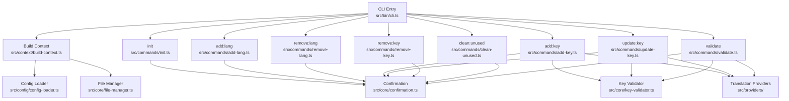
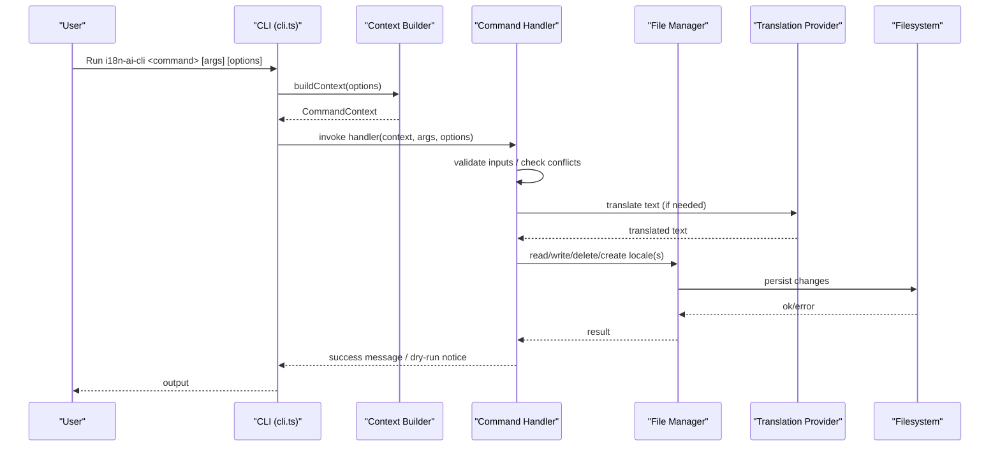
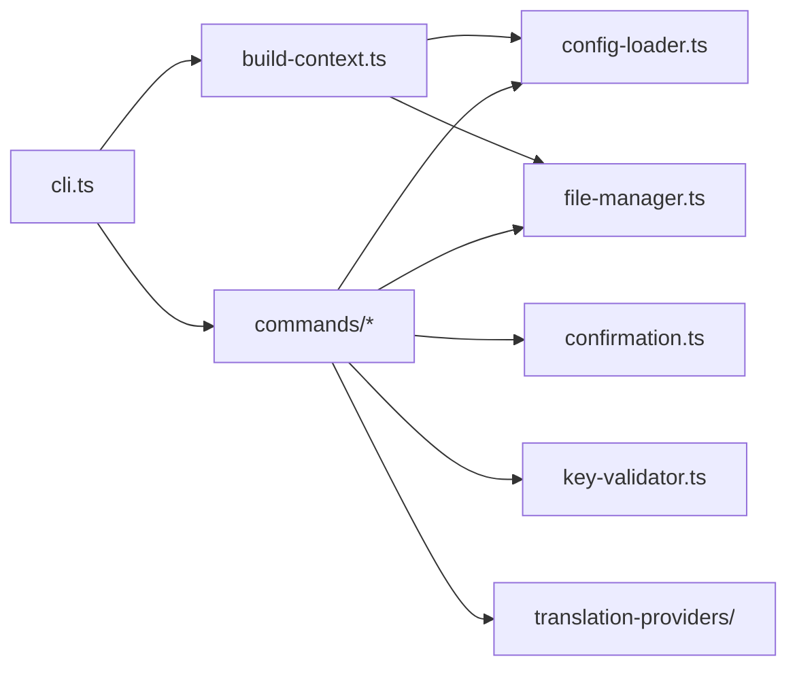

# Command Reference

<cite>
**Referenced Files in This Document**
- [cli.ts](file://src/bin/cli.ts)
- [build-context.ts](file://src/context/build-context.ts)
- [config-loader.ts](file://src/config/config-loader.ts)
- [file-manager.ts](file://src/core/file-manager.ts)
- [confirmation.ts](file://src/core/confirmation.ts)
- [key-validator.ts](file://src/core/key-validator.ts)
- [init.ts](file://src/commands/init.ts)
- [add-lang.ts](file://src/commands/add-lang.ts)
- [remove-lang.ts](file://src/commands/remove-lang.ts)
- [add-key.ts](file://src/commands/add-key.ts)
- [update-key.ts](file://src/commands/update-key.ts)
- [remove-key.ts](file://src/commands/remove-key.ts)
- [clean-unused.ts](file://src/commands/clean-unused.ts)
- [validate.ts](file://src/commands/validate.ts)
- [init.test.ts](file://src/commands/init.test.ts)
- [add-lang.test.ts](file://src/commands/add-lang.test.ts)
- [remove-lang.test.ts](file://src/commands/remove-lang.test.ts)
- [add-key.test.ts](file://src/commands/add-key.test.ts)
- [update-key.test.ts](file://src/commands/update-key.test.ts)
- [remove-key.test.ts](file://src/commands/remove-key.test.ts)
- [clean-unused.test.ts](file://src/commands/clean-unused.test.ts)
- [validate.test.ts](file://src/commands/validate.test.ts)
</cite>

## Update Summary
**Changes Made**
- Updated version information to reflect 1.0.9 (patch release)
- Added comprehensive documentation for AI-powered translation features
- Documented new `--sync` option for `update:key` command
- Added `--provider` options for translation commands
- Enhanced validation and error handling documentation
- Updated command examples to include AI translation capabilities

## Table of Contents
1. [Introduction](#introduction)
2. [Version Information](#version-information)
3. [Project Structure](#project-structure)
4. [Core Components](#core-components)
5. [Architecture Overview](#architecture-overview)
6. [Detailed Command Reference](#detailed-command-reference)
7. [AI Translation Providers](#ai-translation-providers)
8. [Dependency Analysis](#dependency-analysis)
9. [Performance Considerations](#performance-considerations)
10. [Troubleshooting Guide](#troubleshooting-guide)
11. [Conclusion](#conclusion)

## Introduction
This document is the authoritative command reference for the i18n-ai-cli (version 1.0.9) CLI tool. It documents all commands, their syntax, parameters, options, execution flow, validation rules, error handling, and practical examples. The tool now features AI-powered translation capabilities via OpenAI and Google Translate providers, making it a comprehensive solution for managing translation files in internationalized applications.

## Version Information
**Current Version**: 1.0.9 (Patch Release)
**Previous Version**: 1.0.8
**Status**: Patch release without breaking changes
**Key Features**: AI-powered translation, enhanced validation, improved error handling

**Section sources**
- [package.json:3](file://package.json#L3)
- [cli.ts:23](file://src/bin/cli.ts#L23)

## Project Structure
The CLI is organized around a central entry point that registers commands and a shared context builder. Each command composes a CommandContext containing configuration, a file manager, and global options. Commands delegate file operations to the file manager and use validators, confirmation utilities, and translation providers for safety and AI-powered functionality.

**Diagram sources**
- [cli.ts:1-209](file://src/bin/cli.ts#L1-L209)
- [build-context.ts:1-16](file://src/context/build-context.ts#L1-L16)
- [config-loader.ts:1-176](file://src/config/config-loader.ts#L1-L176)
- [file-manager.ts:1-118](file://src/core/file-manager.ts#L1-L118)
- [confirmation.ts:1-43](file://src/core/confirmation.ts#L1-L43)
- [key-validator.ts:1-33](file://src/core/key-validator.ts#L1-L33)
- [add-key.ts:1-120](file://src/commands/add-key.ts#L1-L120)
- [update-key.ts:1-178](file://src/commands/update-key.ts#L1-L178)
- [validate.ts:1-254](file://src/commands/validate.ts#L1-L254)

**Section sources**
- [cli.ts:1-209](file://src/bin/cli.ts#L1-L209)
- [build-context.ts:1-16](file://src/context/build-context.ts#L1-L16)

## Core Components
- Global options: -y/--yes, --dry-run, --ci, -f/--force are attached to all commands via a helper.
- CommandContext: Provides access to configuration, file manager, and global options to each command.
- Confirmation utility: Handles interactive prompts, CI mode, and non-interactive environments.
- File manager: Encapsulates locale file CRUD operations and optional sorting.
- Validation utilities: Locale code validation, structural conflict checks for keys, and config schema validation.
- Translation providers: OpenAI GPT and Google Translate for AI-powered translations.

**Section sources**
- [cli.ts:26-32](file://src/bin/cli.ts#L26-L32)
- [build-context.ts:5-16](file://src/context/build-context.ts#L5-L16)
- [confirmation.ts:9-42](file://src/core/confirmation.ts#L9-L42)
- [file-manager.ts:5-118](file://src/core/file-manager.ts#L5-L118)
- [config-loader.ts:8-67](file://src/config/config-loader.ts#L8-L67)
- [key-validator.ts:1-33](file://src/core/key-validator.ts#L1-L33)

## Architecture Overview
The CLI parses arguments, builds a context from configuration, and executes the selected command. Commands validate inputs, optionally prompt for confirmation, and then mutate translation files through the file manager. AI translation providers are integrated for automatic translation when needed. Dry-run and CI modes alter behavior to prevent unintended changes.

**Diagram sources**
- [cli.ts:203-209](file://src/bin/cli.ts#L203-L209)
- [build-context.ts:5-16](file://src/context/build-context.ts#L5-L16)
- [file-manager.ts:31-98](file://src/core/file-manager.ts#L31-L98)
- [add-key.ts:75-90](file://src/commands/add-key.ts#L75-L90)
- [update-key.ts:120-139](file://src/commands/update-key.ts#L120-L139)

## Detailed Command Reference

### Global Options
All commands support the following global options:
- -y, --yes: Skip confirmation prompts.
- --dry-run: Preview changes without writing files.
- --ci: Run in CI mode (no prompts; requires --yes to proceed).
- -f, --force: Force operation even if validation would fail (init only).

These are attached to each command via a shared helper.

**Section sources**
- [cli.ts:26-32](file://src/bin/cli.ts#L26-L32)

### init
Purpose: Create an i18n-ai-cli configuration file and initialize the default locale file.

Syntax
- i18n-ai-cli init [options]

Options
- -y/--yes: Skip confirmation prompts.
- --dry-run: Preview creation without writing files.
- --ci: Fail if changes would be applied; re-run with --yes to proceed.
- -f/--force: Overwrite existing configuration.

Behavior
- Detects interactive vs non-interactive mode and falls back to defaults when not TTY.
- Validates configuration schema and usage patterns.
- Ensures locales directory exists and creates default locale file if missing.
- Writes i18n-ai-cli.config.json with normalized supportedLocales and compiled usage patterns.

Execution flow
- Load config path and detect existing file.
- Prompt or use defaults to collect localesPath, defaultLocale, supportedLocales, keyStyle, autoSort, usagePatterns.
- Normalize supportedLocales and compile usagePatterns.
- Confirm in CI mode requires --yes.
- Optionally preview (--dry-run) or write config and initialize default locale file.

Validation and errors
- Throws if config already exists and --force is not provided.
- Throws if usagePatterns contain invalid regex or lack capturing groups.
- Throws in CI mode without --yes.

Examples
- Interactive initialization with defaults:
  - Command: i18n-ai-cli init
  - Outcome: Creates i18n-ai-cli.config.json and default locale file under configured localesPath.
- Non-interactive with forced overwrite:
  - Command: i18n-ai-cli init -f
  - Outcome: Overwrites config if present.
- Dry run:
  - Command: i18n-ai-cli init --dry-run
  - Outcome: Prints preview; no files changed.

Impact on files
- Creates i18n-ai-cli.config.json.
- Creates default locale file if not present.

Interactive vs non-interactive
- Interactive mode prompts for values; non-interactive uses defaults.

Advanced usage
- Combine with --ci and --yes for automated pipelines.
- Use --force to recreate configuration in CI.

**Section sources**
- [cli.ts:35-42](file://src/bin/cli.ts#L35-L42)
- [init.ts:25-182](file://src/commands/init.ts#L25-L182)
- [config-loader.ts:24-67](file://src/config/config-loader.ts#L24-L67)

### add:lang <lang>
Purpose: Add a new language locale file with optional AI-powered translation.

Syntax
- i18n-ai-cli add:lang <lang> [options]

Options
- --from <locale>: Clone content from an existing locale.
- --strict: Enable strict mode for additional validations.
- --provider <provider>: Translation provider (openai or google) for cloning.
- -y/--yes, --dry-run, --ci, -f/--force: Global options.

Behavior
- Validates locale code against ISO 639-1 (accepts xx or xx-YY).
- Checks that locale is not already in supportedLocales and file does not exist.
- Optionally reads base locale content if --from is provided.
- Supports AI-powered translation when cloning with --provider.
- Prompts for confirmation unless --yes is set.
- Creates locale file with optional dry-run.

Execution flow
- Build context.
- Validate locale code and uniqueness.
- Optionally read base locale and translate content.
- Confirm or enforce CI behavior.
- Create locale file.

Validation and errors
- Throws for invalid locale code.
- Throws if locale already supported or file exists.
- Throws if base locale does not exist.
- Throws for unknown translation provider.

Examples
- Add fr with empty content:
  - Command: i18n-ai-cli add:lang fr
  - Outcome: Creates fr.json with empty object.
- Clone from en with AI translation:
  - Command: i18n-ai-cli add:lang fr --from en --provider openai
  - Outcome: Creates fr.json with content translated from en.json.
- Dry run:
  - Command: i18n-ai-cli add:lang es --dry-run
  - Outcome: No file created; prints preview.

Impact on files
- Creates <lang>.json under localesPath.

Interactive vs non-interactive
- Uses confirmation prompts unless --yes is set.

Advanced usage
- Combine with --ci and --yes for automation.
- Note: Add the new locale to supportedLocales in the configuration manually after creation.

**Section sources**
- [cli.ts:44-54](file://src/bin/cli.ts#L44-L54)
- [add-lang.ts:26-98](file://src/commands/add-lang.ts#L26-L98)
- [file-manager.ts:80-98](file://src/core/file-manager.ts#L80-L98)

### remove:lang <lang>
Purpose: Remove a language locale file.

Syntax
- i18n-ai-cli remove:lang <lang> [options]

Options
- -y/--yes, --dry-run, --ci, -f/--force: Global options.

Behavior
- Validates that the locale is in supportedLocales.
- Prevents removal of defaultLocale.
- Confirms existence of the locale file.
- Prompts for confirmation unless --yes is set.
- Deletes the locale file with optional dry-run.

Execution flow
- Build context.
- Validate supportedLocales and defaultLocale.
- Check file existence.
- Confirm or enforce CI behavior.
- Delete locale file.

Validation and errors
- Throws if locale not supported.
- Throws if attempting to remove defaultLocale.
- Throws if file does not exist.

Examples
- Remove de:
  - Command: i18n-ai-cli remove:lang de
  - Outcome: Deletes de.json.
- Dry run:
  - Command: i18n-ai-cli remove:lang es --dry-run
  - Outcome: No file deleted; prints preview.

Impact on files
- Removes <lang>.json under localesPath.

Interactive vs non-interactive
- Uses confirmation prompts unless --yes is set.

Advanced usage
- Combine with --ci and --yes for automation.
- Note: Remove the locale from supportedLocales in the configuration manually after deletion.

**Section sources**
- [cli.ts:56-65](file://src/bin/cli.ts#L56-L65)
- [remove-lang.ts:5-74](file://src/commands/remove-lang.ts#L5-L74)
- [file-manager.ts:63-78](file://src/core/file-manager.ts#L63-L78)

### add:key <key> -v <value>
Purpose: Add a new translation key to all locales with AI-powered translation.

Syntax
- i18n-ai-cli add:key <key> -v <value> [options]

Options
- -v, --value <value>: **Required**. Value for the default locale.
- -p, --provider <provider>: Translation provider (openai or google).
- -y/--yes, --dry-run, --ci, -f/--force: Global options.

Behavior
- Validates both key and value are provided.
- Iterates supportedLocales, flattens each locale, validates no structural conflicts, and ensures key does not already exist.
- Uses AI translation provider for non-default locales if available.
- Prompts for confirmation unless --yes is set.
- Writes updated locale files; default locale receives the provided value; others receive AI-translated values.
- Respects keyStyle (nested vs flat) when rebuilding.

Execution flow
- Build context.
- Validate inputs and per-locale checks.
- Confirm or enforce CI behavior.
- Translate and write updated locale files.

Validation and errors
- Throws if key or value is missing.
- Throws if key already exists in any locale.
- Throws on structural conflicts (parent or child overlap).
- Throws in CI mode without --yes.

Examples
- Add greeting to all locales with AI translation:
  - Command: i18n-ai-cli add:key auth.login.title -v "Login Page" --provider openai
  - Outcome: Adds key to all locales; default locale gets the value; others get AI-translated values.
- Flat keyStyle with Google Translate:
  - Command: i18n-ai-cli add:key auth.login.title -v "Login Page" --provider google
  - Outcome: Key stored as auth.login.title in flat mode with Google Translate.

Impact on files
- Updates all <locale>.json under localesPath.

Interactive vs non-interactive
- Uses confirmation prompts unless --yes is set.

Advanced usage
- Combine with --ci and --yes for automation.
- Use with nested or flat keyStyle depending on configuration.
- Specify translation provider explicitly or rely on environment variables.

**Section sources**
- [cli.ts:70-102](file://src/bin/cli.ts#L70-L102)
- [add-key.ts:8-120](file://src/commands/add-key.ts#L8-L120)
- [key-validator.ts:1-33](file://src/core/key-validator.ts#L1-L33)

### update:key <key> -v <value> [-l <locale>] [--sync]
Purpose: Update an existing translation key's value with optional AI-powered synchronization.

Syntax
- i18n-ai-cli update:key <key> -v <value> [-l <locale>] [--sync] [options]

Options
- -v, --value <value>: **Required**. New value.
- -l, --locale <locale>: Target locale (defaults to defaultLocale).
- -p, --provider <provider>: Translation provider (openai or google) for syncing.
- -s, --sync: Sync the updated value to all other locales via AI translation.
- -y/--yes, --dry-run, --ci, -f/--force: Global options.

Behavior
- Validates both key and value are provided.
- Determines target locale (argument or default).
- Reads target locale, flattens, validates no structural conflicts, and ensures key exists.
- Supports two modes: single locale update or full synchronization.
- When using --sync, translates the new value to all other locales via AI provider.
- Prompts for confirmation unless --yes is set.
- Writes updated locale file respecting keyStyle.

Execution flow
- Build context.
- Validate inputs and target locale.
- Handle sync mode or single locale update.
- Translate and write updated locale files.

Validation and errors
- Throws if key or value is missing.
- Throws if target locale not supported.
- Throws if key does not exist in target locale.
- Throws on structural conflicts.
- Throws in CI mode without --yes.

Examples
- Update greeting in default locale:
  - Command: i18n-ai-cli update:key greeting -v "Hi there"
  - Outcome: Updates default locale value.
- Update greeting in de:
  - Command: i18n-ai-cli update:key greeting -v "Guten Tag" -l de
  - Outcome: Updates de locale value.
- Sync update across all locales:
  - Command: i18n-ai-cli update:key greeting -v "Hello" --sync --provider openai
  - Outcome: Updates greeting in all locales with AI translation.

Impact on files
- Updates <locale>.json under localesPath.

Interactive vs non-interactive
- Uses confirmation prompts unless --yes is set.

Advanced usage
- Combine with --ci and --yes for automation.
- Use --sync for batch updates across all locales.
- Use with nested or flat keyStyle depending on configuration.

**Section sources**
- [cli.ts:104-140](file://src/bin/cli.ts#L104-L140)
- [update-key.ts:17-178](file://src/commands/update-key.ts#L17-L178)
- [key-validator.ts:1-33](file://src/core/key-validator.ts#L1-L33)

### remove:key <key>
Purpose: Remove a translation key from all locales.

Syntax
- i18n-ai-cli remove:key <key> [options]

Options
- -y/--yes, --dry-run, --ci, -f/--force: Global options.

Behavior
- Validates key is provided.
- Scans all locales to determine which contain the key.
- Throws if key does not exist in any locale.
- Prompts for confirmation unless --yes is set.
- Removes the key from each locale that contains it; removes empty parent objects in nested mode.
- Writes updated locale files.

Execution flow
- Build context.
- Validate key presence across locales.
- Confirm or enforce CI behavior.
- Write updated locale files.

Validation and errors
- Throws if key is missing.
- Throws if key not found in any locale.
- Throws in CI mode without --yes.

Examples
- Remove greeting from all locales:
  - Command: i18n-ai-cli remove:key greeting
  - Outcome: Removes key from all locales; nested parents are pruned if empty.

Impact on files
- Updates all <locale>.json under localesPath.

Interactive vs non-interactive
- Uses confirmation prompts unless --yes is set.

Advanced usage
- Combine with --ci and --yes for automation.
- Use with nested or flat keyStyle depending on configuration.

**Section sources**
- [cli.ts:142-151](file://src/bin/cli.ts#L142-L151)
- [remove-key.ts:10-96](file://src/commands/remove-key.ts#L10-L96)

### clean:unused
Purpose: Remove translation keys not used in the project according to configured usage patterns.

Syntax
- i18n-ai-cli clean:unused [options]

Options
- -y/--yes, --dry-run, --ci, -f/--force: Global options.

Behavior
- Requires compiled usagePatterns in configuration.
- Scans project files matching a set of extensions for translation usage.
- Compiles a set of used keys from matched patterns.
- Reads default locale to enumerate current keys.
- Computes unused keys and prompts for confirmation unless --yes is set.
- Removes unused keys from all locales and writes updated files.

Execution flow
- Build context.
- Validate usagePatterns.
- Scan files and extract used keys.
- Compare with default locale keys to compute unused set.
- Confirm or enforce CI behavior.
- Write updated locale files.

Validation and errors
- Throws if usagePatterns are missing or invalid.
- Throws in CI mode without --yes.

Examples
- Clean unused keys:
  - Command: i18n-ai-cli clean:unused
  - Outcome: Removes keys not found in scanned files from all locales.

Impact on files
- Updates all <locale>.json under localesPath.

Interactive vs non-interactive
- Uses confirmation prompts unless --yes is set.

Advanced usage
- Combine with --ci and --yes for automation.
- Ensure usagePatterns are configured to match your translation function calls.

**Section sources**
- [cli.ts:153-162](file://src/bin/cli.ts#L153-L162)
- [clean-unused.ts:8-138](file://src/commands/clean-unused.ts#L8-L138)
- [config-loader.ts:84-109](file://src/config/config-loader.ts#L84-L109)

### validate
Purpose: Validate translation files and auto-correct issues with optional AI-powered translation.

Syntax
- i18n-ai-cli validate [options]

Options
- -p, --provider <provider>: Translation provider (openai or google) for auto-correction.
- -y/--yes, --dry-run, --ci, -f/--force: Global options.

Behavior
- Validates all locale files against the default locale.
- Detects missing keys, extra keys, and type mismatches.
- Supports auto-correction with AI translation for missing keys.
- Removes extra keys and fixes type mismatches.
- Provides detailed validation report with issue counts.
- Prompts for confirmation unless --yes is set.

Execution flow
- Build context.
- Read default locale as reference.
- Validate all other locales against reference.
- Generate detailed report of issues.
- Auto-correct issues with optional AI translation.
- Write corrected locale files.

Validation and errors
- Throws in CI mode without --yes.
- Gracefully handles translation failures during auto-correction.

Examples
- Validate without auto-correction:
  - Command: i18n-ai-cli validate
  - Outcome: Reports issues without making changes.
- Validate with AI auto-correction:
  - Command: i18n-ai-cli validate --provider openai
  - Outcome: Auto-corrects missing keys using AI translation.

Impact on files
- Updates locale files with corrections.

Interactive vs non-interactive
- Uses confirmation prompts unless --yes is set.

Advanced usage
- Combine with --ci and --yes for automated validation.
- Use --provider for AI-powered auto-correction.

**Section sources**
- [cli.ts:164-198](file://src/bin/cli.ts#L164-L198)
- [validate.ts:121-254](file://src/commands/validate.ts#L121-L254)

## AI Translation Providers
The CLI supports multiple translation providers for AI-powered functionality:

### Available Providers
- **OpenAI**: AI-powered translation using GPT models (context-aware, high quality)
- **Google Translate**: Free translation via @vitalets/google-translate-api
- **DeepL**: Provider stub (coming soon)

### Provider Selection Priority
1. **Explicit `--provider` flag** (highest priority)
2. **`OPENAI_API_KEY` environment variable** → uses OpenAI
3. **Fallback to Google Translate** (lowest priority)

### Configuration Options
| Provider | Environment Variable | Configuration |
|----------|---------------------|---------------|
| OpenAI | `OPENAI_API_KEY` | Required for AI functionality |
| Google Translate | None | Free provider, no API key required |
| DeepL | `DEEPL_AUTH_KEY` | Coming soon |

**Section sources**
- [cli.ts:82-98](file://src/bin/cli.ts#L82-L98)
- [cli.ts:118-136](file://src/bin/cli.ts#L118-L136)
- [cli.ts:178-194](file://src/bin/cli.ts#L178-L194)

## Dependency Analysis
Commands depend on a shared CommandContext and rely on:
- Configuration loader for schema validation and usage pattern compilation.
- File manager for filesystem operations and optional sorting.
- Confirmation utility for safe user-driven changes.
- Key validator for structural conflict detection.
- Translation providers for AI-powered functionality.

**Diagram sources**
- [cli.ts:1-209](file://src/bin/cli.ts#L1-L209)
- [build-context.ts:1-16](file://src/context/build-context.ts#L1-L16)
- [config-loader.ts:1-176](file://src/config/config-loader.ts#L1-L176)
- [file-manager.ts:1-118](file://src/core/file-manager.ts#L1-L118)
- [confirmation.ts:1-43](file://src/core/confirmation.ts#L1-L43)
- [key-validator.ts:1-33](file://src/core/key-validator.ts#L1-L33)

**Section sources**
- [cli.ts:1-209](file://src/bin/cli.ts#L1-L209)
- [build-context.ts:1-16](file://src/context/build-context.ts#L1-L16)

## Performance Considerations
- add:key and update:key iterate over all supported locales twice (once for validation, once for writing). For large projects with many locales, this increases I/O.
- AI translation adds network latency and costs for OpenAI provider.
- clean:unused scans all matching files and applies regex matching; performance scales with file count and size.
- validate performs comprehensive validation across all locales; consider using --dry-run for large projects.
- Using --dry-run avoids disk writes and is recommended for large-scale operations.
- Enabling autoSort improves readability but adds recursive sorting overhead during writes.

## Troubleshooting Guide
Common issues and resolutions
- Configuration not found or invalid:
  - Symptom: Error indicating missing or invalid i18n-ai-cli.config.json.
  - Resolution: Run i18n-ai-cli init to create a valid configuration; fix schema violations reported by the loader.
- Locale-related errors:
  - Symptom: Cannot add/remove locale or key due to unsupported locale or missing file.
  - Resolution: Ensure locale is in supportedLocales; verify file existence; adjust configuration accordingly.
- Structural conflicts:
  - Symptom: Error about conflicting parent or child keys.
  - Resolution: Align key naming to avoid overwriting existing objects or being overwritten by nested keys.
- CI mode rejections:
  - Symptom: Command fails in CI without --yes.
  - Resolution: Add --yes to approve changes in CI environments.
- Dry run expectations:
  - Symptom: Expecting changes without --dry-run.
  - Resolution: Use --dry-run to preview; omit it to apply changes.
- Translation provider errors:
  - Symptom: AI translation failures or API key issues.
  - Resolution: Check provider credentials, network connectivity, or switch to Google Translate.

Validation rules and error messages
- init: Throws when config exists and --force is not provided; validates usagePatterns and supportedLocales normalization.
- add:lang: Throws for invalid locale codes, existing locale in supportedLocales, or existing file.
- remove:lang: Throws for unsupported locale, default locale removal, or missing file.
- add:key: Throws for missing inputs, existing key, or structural conflicts.
- update:key: Throws for missing inputs, unsupported locale, missing key, or structural conflicts.
- remove:key: Throws for missing key or absence in all locales.
- clean:unused: Throws for missing usagePatterns or no matches; removes unused keys otherwise.
- validate: Throws in CI mode without --yes; handles translation failures gracefully.

**Section sources**
- [init.ts:32-37](file://src/commands/init.ts#L32-L37)
- [add-lang.ts:36-47](file://src/commands/add-lang.ts#L36-L47)
- [remove-lang.ts:15-35](file://src/commands/remove-lang.ts#L15-L35)
- [add-key.ts:19-21](file://src/commands/add-key.ts#L19-L21)
- [update-key.ts:28-30](file://src/commands/update-key.ts#L28-L30)
- [remove-key.ts:17-42](file://src/commands/remove-key.ts#L17-L42)
- [clean-unused.ts:19-23](file://src/commands/clean-unused.ts#L19-L23)
- [validate.ts:172-176](file://src/commands/validate.ts#L172-L176)
- [config-loader.ts:46-54](file://src/config/config-loader.ts#L46-L54)
- [key-validator.ts:12-32](file://src/core/key-validator.ts#L12-L32)

## Conclusion
The i18n-ai-cli (version 1.0.9) provides a robust, safe, and AI-powered toolkit for managing translation files. With AI translation capabilities via OpenAI and Google Translate, enhanced validation and auto-correction features, and comprehensive command coverage, it enables efficient workflows for internationalized applications. By leveraging global options, confirmation utilities, strict validation, and AI-powered translation, it minimizes risk while maximizing productivity. Use --dry-run for previews, --ci with --yes for automation, and configure translation providers appropriately for reliable operations.