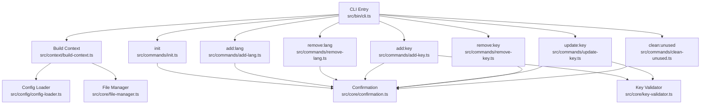
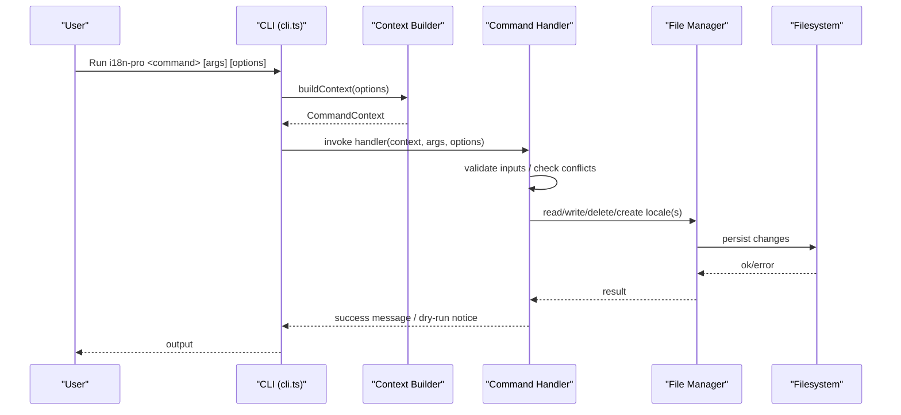
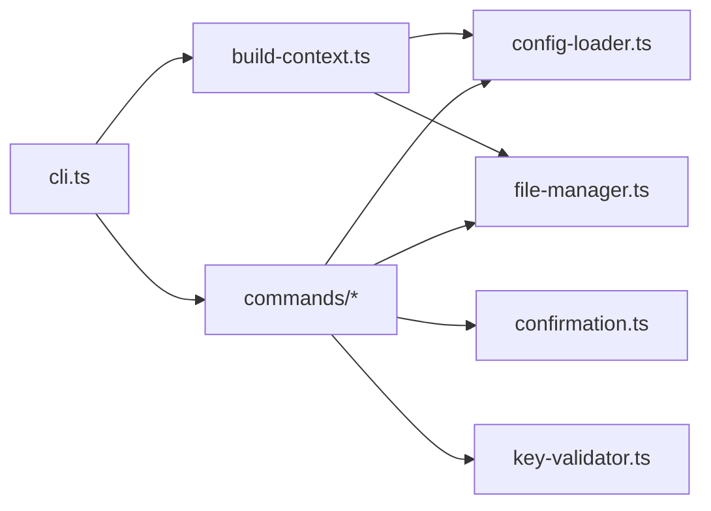

# Command Reference

<cite>
**Referenced Files in This Document**
- [cli.ts](file://src/bin/cli.ts)
- [build-context.ts](file://src/context/build-context.ts)
- [config-loader.ts](file://src/config/config-loader.ts)
- [file-manager.ts](file://src/core/file-manager.ts)
- [confirmation.ts](file://src/core/confirmation.ts)
- [key-validator.ts](file://src/core/key-validator.ts)
- [init.ts](file://src/commands/init.ts)
- [add-lang.ts](file://src/commands/add-lang.ts)
- [remove-lang.ts](file://src/commands/remove-lang.ts)
- [add-key.ts](file://src/commands/add-key.ts)
- [update-key.ts](file://src/commands/update-key.ts)
- [remove-key.ts](file://src/commands/remove-key.ts)
- [clean-unused.ts](file://src/commands/clean-unused.ts)
- [init.test.ts](file://src/commands/init.test.ts)
- [add-lang.test.ts](file://src/commands/add-lang.test.ts)
- [remove-lang.test.ts](file://src/commands/remove-lang.test.ts)
- [add-key.test.ts](file://src/commands/add-key.test.ts)
- [update-key.test.ts](file://src/commands/update-key.test.ts)
- [remove-key.test.ts](file://src/commands/remove-key.test.ts)
- [clean-unused.test.ts](file://src/commands/clean-unused.test.ts)
</cite>

## Table of Contents
1. [Introduction](#introduction)
2. [Project Structure](#project-structure)
3. [Core Components](#core-components)
4. [Architecture Overview](#architecture-overview)
5. [Detailed Command Reference](#detailed-command-reference)
6. [Dependency Analysis](#dependency-analysis)
7. [Performance Considerations](#performance-considerations)
8. [Troubleshooting Guide](#troubleshooting-guide)
9. [Conclusion](#conclusion)

## Introduction
This document is the authoritative command reference for the i18n-pro CLI. It documents all commands, their syntax, parameters, options, execution flow, validation rules, error handling, and practical examples. It also explains the relationship between commands, their impact on translation files, and how to chain them safely. Interactive versus non-interactive modes are covered, along with advanced usage patterns, parameter combinations, and edge cases.

## Project Structure
The CLI is organized around a central entry point that registers commands and a shared context builder. Each command composes a CommandContext containing configuration, a file manager, and global options. Commands delegate file operations to the file manager and use validators and confirmation utilities for safety.

**Diagram sources**
- [cli.ts:1-122](file://src/bin/cli.ts#L1-L122)
- [build-context.ts:1-16](file://src/context/build-context.ts#L1-L16)
- [config-loader.ts:1-176](file://src/config/config-loader.ts#L1-L176)
- [file-manager.ts:1-118](file://src/core/file-manager.ts#L1-L118)
- [confirmation.ts:1-43](file://src/core/confirmation.ts#L1-L43)
- [key-validator.ts:1-33](file://src/core/key-validator.ts#L1-L33)
- [init.ts:1-236](file://src/commands/init.ts#L1-L236)
- [add-lang.ts:1-98](file://src/commands/add-lang.ts#L1-L98)
- [remove-lang.ts:1-74](file://src/commands/remove-lang.ts#L1-L74)
- [add-key.ts:1-93](file://src/commands/add-key.ts#L1-L93)
- [update-key.ts:1-103](file://src/commands/update-key.ts#L1-L103)
- [remove-key.ts:1-96](file://src/commands/remove-key.ts#L1-L96)
- [clean-unused.ts:1-138](file://src/commands/clean-unused.ts#L1-L138)

**Section sources**
- [cli.ts:1-122](file://src/bin/cli.ts#L1-L122)
- [build-context.ts:1-16](file://src/context/build-context.ts#L1-L16)

## Core Components
- Global options: -y/--yes, --dry-run, --ci, -f/--force are attached to all commands via a helper.
- CommandContext: Provides access to configuration, file manager, and global options to each command.
- Confirmation utility: Handles interactive prompts, CI mode, and non-interactive environments.
- File manager: Encapsulates locale file CRUD operations and optional sorting.
- Validation utilities: Locale code validation, structural conflict checks for keys, and config schema validation.

**Section sources**
- [cli.ts:21-28](file://src/bin/cli.ts#L21-L28)
- [build-context.ts:5-16](file://src/context/build-context.ts#L5-L16)
- [confirmation.ts:9-42](file://src/core/confirmation.ts#L9-L42)
- [file-manager.ts:5-118](file://src/core/file-manager.ts#L5-L118)
- [config-loader.ts:8-67](file://src/config/config-loader.ts#L8-L67)
- [key-validator.ts:1-33](file://src/core/key-validator.ts#L1-L33)

## Architecture Overview
The CLI parses arguments, builds a context from configuration, and executes the selected command. Commands validate inputs, optionally prompt for confirmation, and then mutate translation files through the file manager. Dry-run and CI modes alter behavior to prevent unintended changes.

**Diagram sources**
- [cli.ts:35-111](file://src/bin/cli.ts#L35-L111)
- [build-context.ts:5-16](file://src/context/build-context.ts#L5-L16)
- [file-manager.ts:31-98](file://src/core/file-manager.ts#L31-L98)

## Detailed Command Reference

### Global Options
All commands support the following global options:
- -y, --yes: Skip confirmation prompts.
- --dry-run: Preview changes without writing files.
- --ci: Run in CI mode (no prompts; requires --yes to proceed).
- -f, --force: Force operation even if validation would fail (init only).

These are attached to each command via a shared helper.

**Section sources**
- [cli.ts:21-28](file://src/bin/cli.ts#L21-L28)

### init
Purpose: Create an i18n-pro configuration file and initialize the default locale file.

Syntax
- i18n-pro init [options]

Options
- -y/--yes: Skip confirmation prompts.
- --dry-run: Preview creation without writing files.
- --ci: Fail if changes would be applied; re-run with --yes to proceed.
- -f/--force: Overwrite existing configuration.

Behavior
- Detects interactive vs non-interactive mode and falls back to defaults when not TTY.
- Validates configuration schema and usage patterns.
- Ensures locales directory exists and creates default locale file if missing.
- Writes i18n-pro.config.json with normalized supportedLocales and compiled usage patterns.

Execution flow
- Load config path and detect existing file.
- Prompt or use defaults to collect localesPath, defaultLocale, supportedLocales, keyStyle, autoSort, usagePatterns.
- Normalize supportedLocales and compile usagePatterns.
- Confirm in CI mode requires --yes.
- Optionally preview (--dry-run) or write config and initialize default locale file.

Validation and errors
- Throws if config already exists and --force is not provided.
- Throws if usagePatterns contain invalid regex or lack capturing groups.
- Throws in CI mode without --yes.

Examples
- Interactive initialization with defaults:
  - Command: i18n-pro init
  - Outcome: Creates i18n-pro.config.json and default locale file under configured localesPath.
- Non-interactive with forced overwrite:
  - Command: i18n-pro init -f
  - Outcome: Overwrites config if present.
- Dry run:
  - Command: i18n-pro init --dry-run
  - Outcome: Prints preview; no files changed.

Impact on files
- Creates i18n-pro.config.json.
- Creates default locale file if not present.

Interactive vs non-interactive
- Interactive mode prompts for values; non-interactive uses defaults.

Advanced usage
- Combine with --ci and --yes for automated pipelines.
- Use --force to recreate configuration in CI.

**Section sources**
- [cli.ts:30-38](file://src/bin/cli.ts#L30-L38)
- [init.ts:25-182](file://src/commands/init.ts#L25-L182)
- [config-loader.ts:24-67](file://src/config/config-loader.ts#L24-L67)
- [init.test.ts:50-292](file://src/commands/init.test.ts#L50-L292)

### add:lang <lang>
Purpose: Add a new language locale file.

Syntax
- i18n-pro add:lang <lang> [options]

Options
- --from <locale>: Clone content from an existing locale.
- --strict: Reserved for future strictness enforcement.
- -y/--yes, --dry-run, --ci, -f/--force: Global options.

Behavior
- Validates locale code against ISO 639-1 (accepts xx or xx-YY).
- Checks that locale is not already in supportedLocales and file does not exist.
- Optionally reads base locale content if --from is provided.
- Prompts for confirmation unless --yes is set.
- Creates locale file with optional dry-run.

Execution flow
- Build context.
- Validate locale code and uniqueness.
- Optionally read base locale.
- Confirm or enforce CI behavior.
- Create locale file.

Validation and errors
- Throws for invalid locale code.
- Throws if locale already supported or file exists.
- Throws if base locale does not exist.

Examples
- Add fr with empty content:
  - Command: i18n-pro add:lang fr
  - Outcome: Creates fr.json with empty object.
- Clone from en:
  - Command: i18n-pro add:lang fr --from en
  - Outcome: Creates fr.json with content copied from en.json.
- Dry run:
  - Command: i18n-pro add:lang es --dry-run
  - Outcome: No file created; prints preview.

Impact on files
- Creates <lang>.json under localesPath.

Interactive vs non-interactive
- Uses confirmation prompts unless --yes is set.

Advanced usage
- Combine with --ci and --yes for automation.
- Note: Add the new locale to supportedLocales in the configuration manually after creation.

**Section sources**
- [cli.ts:40-50](file://src/bin/cli.ts#L40-L50)
- [add-lang.ts:26-98](file://src/commands/add-lang.ts#L26-L98)
- [file-manager.ts:80-98](file://src/core/file-manager.ts#L80-L98)
- [add-lang.test.ts:43-220](file://src/commands/add-lang.test.ts#L43-L220)

### remove:lang <lang>
Purpose: Remove a language locale file.

Syntax
- i18n-pro remove:lang <lang> [options]

Options
- -y/--yes, --dry-run, --ci, -f/--force: Global options.

Behavior
- Validates that the locale is in supportedLocales.
- Prevents removal of defaultLocale.
- Confirms existence of the locale file.
- Prompts for confirmation unless --yes is set.
- Deletes the locale file with optional dry-run.

Execution flow
- Build context.
- Validate supportedLocales and defaultLocale.
- Check file existence.
- Confirm or enforce CI behavior.
- Delete locale file.

Validation and errors
- Throws if locale not supported.
- Throws if attempting to remove defaultLocale.
- Throws if file does not exist.

Examples
- Remove de:
  - Command: i18n-pro remove:lang de
  - Outcome: Deletes de.json.
- Dry run:
  - Command: i18n-pro remove:lang es --dry-run
  - Outcome: No file deleted; prints preview.

Impact on files
- Removes <lang>.json under localesPath.

Interactive vs non-interactive
- Uses confirmation prompts unless --yes is set.

Advanced usage
- Combine with --ci and --yes for automation.
- Note: Remove the locale from supportedLocales in the configuration manually after deletion.

**Section sources**
- [cli.ts:52-61](file://src/bin/cli.ts#L52-L61)
- [remove-lang.ts:5-74](file://src/commands/remove-lang.ts#L5-L74)
- [file-manager.ts:63-78](file://src/core/file-manager.ts#L63-L78)
- [remove-lang.test.ts:42-176](file://src/commands/remove-lang.test.ts#L42-L176)

### add:key <key> -v <value>
Purpose: Add a new translation key to all locales.

Syntax
- i18n-pro add:key <key> -v <value> [options]

Options
- -y/--yes, --dry-run, --ci, -f/--force: Global options.

Behavior
- Validates both key and value are provided.
- Iterates supportedLocales, flattens each locale, validates no structural conflicts, and ensures key does not already exist.
- Prompts for confirmation unless --yes is set.
- Writes updated locale files; default locale receives the provided value; others receive empty strings.
- Respects keyStyle (nested vs flat) when rebuilding.

Execution flow
- Build context.
- Validate inputs and per-locale checks.
- Confirm or enforce CI behavior.
- Write updated locale files.

Validation and errors
- Throws if key or value is missing.
- Throws if key already exists in any locale.
- Throws on structural conflicts (parent or child overlap).
- Throws in CI mode without --yes.

Examples
- Add greeting to all locales:
  - Command: i18n-pro add:key auth.login.title -v "Login Page"
  - Outcome: Adds key to all locales; default locale gets the value; others get empty string.
- Flat keyStyle:
  - Command: i18n-pro add:key auth.login.title -v "Login Page"
  - Outcome: Key stored as auth.login.title in flat mode.

Impact on files
- Updates all <locale>.json under localesPath.

Interactive vs non-interactive
- Uses confirmation prompts unless --yes is set.

Advanced usage
- Combine with --ci and --yes for automation.
- Use with nested or flat keyStyle depending on configuration.

**Section sources**
- [cli.ts:66-76](file://src/bin/cli.ts#L66-L76)
- [add-key.ts:7-93](file://src/commands/add-key.ts#L7-L93)
- [key-validator.ts:1-33](file://src/core/key-validator.ts#L1-L33)
- [add-key.test.ts:42-235](file://src/commands/add-key.test.ts#L42-L235)

### update:key <key> -v <value> [-l <locale>]
Purpose: Update an existing translation key’s value.

Syntax
- i18n-pro update:key <key> -v <value> [-l <locale>] [options]

Options
- -l, --locale <locale>: Target locale (defaults to defaultLocale).
- -y/--yes, --dry-run, --ci, -f/--force: Global options.

Behavior
- Validates both key and value are provided.
- Determines target locale (argument or default).
- Reads target locale, flattens, validates no structural conflicts, and ensures key exists.
- Prompts for confirmation unless --yes is set.
- Writes updated locale file respecting keyStyle.

Execution flow
- Build context.
- Validate inputs and target locale.
- Confirm or enforce CI behavior.
- Write updated locale file.

Validation and errors
- Throws if key or value is missing.
- Throws if target locale not supported.
- Throws if key does not exist in target locale.
- Throws on structural conflicts.
- Throws in CI mode without --yes.

Examples
- Update greeting in default locale:
  - Command: i18n-pro update:key greeting -v "Hi there"
  - Outcome: Updates default locale value.
- Update greeting in de:
  - Command: i18n-pro update:key greeting -v "Guten Tag" -l de
  - Outcome: Updates de locale value.

Impact on files
- Updates <locale>.json under localesPath.

Interactive vs non-interactive
- Uses confirmation prompts unless --yes is set.

Advanced usage
- Combine with --ci and --yes for automation.
- Use with nested or flat keyStyle depending on configuration.

**Section sources**
- [cli.ts:78-89](file://src/bin/cli.ts#L78-L89)
- [update-key.ts:15-103](file://src/commands/update-key.ts#L15-L103)
- [key-validator.ts:1-33](file://src/core/key-validator.ts#L1-L33)
- [update-key.test.ts:42-265](file://src/commands/update-key.test.ts#L42-L265)

### remove:key <key>
Purpose: Remove a translation key from all locales.

Syntax
- i18n-pro remove:key <key> [options]

Options
- -y/--yes, --dry-run, --ci, -f/--force: Global options.

Behavior
- Validates key is provided.
- Scans all locales to determine which contain the key.
- Throws if key does not exist in any locale.
- Prompts for confirmation unless --yes is set.
- Removes the key from each locale that contains it; removes empty parent objects in nested mode.
- Writes updated locale files.

Execution flow
- Build context.
- Validate key presence across locales.
- Confirm or enforce CI behavior.
- Write updated locale files.

Validation and errors
- Throws if key is missing.
- Throws if key not found in any locale.
- Throws in CI mode without --yes.

Examples
- Remove greeting from all locales:
  - Command: i18n-pro remove:key greeting
  - Outcome: Removes key from all locales; nested parents are pruned if empty.

Impact on files
- Updates all <locale>.json under localesPath.

Interactive vs non-interactive
- Uses confirmation prompts unless --yes is set.

Advanced usage
- Combine with --ci and --yes for automation.
- Use with nested or flat keyStyle depending on configuration.

**Section sources**
- [cli.ts:91-100](file://src/bin/cli.ts#L91-L100)
- [remove-key.ts:10-96](file://src/commands/remove-key.ts#L10-L96)
- [remove-key.test.ts:42-250](file://src/commands/remove-key.test.ts#L42-L250)

### clean:unused
Purpose: Remove translation keys not used in the project according to configured usage patterns.

Syntax
- i18n-pro clean:unused [options]

Options
- -y/--yes, --dry-run, --ci, -f/--force: Global options.

Behavior
- Requires compiled usagePatterns in configuration.
- Scans project files matching a set of extensions for translation usage.
- Compiles a set of used keys from matched patterns.
- Reads default locale to enumerate current keys.
- Computes unused keys and prompts for confirmation unless --yes is set.
- Removes unused keys from all locales and writes updated files.

Execution flow
- Build context.
- Validate usagePatterns.
- Scan files and extract used keys.
- Compare with default locale keys to compute unused set.
- Confirm or enforce CI behavior.
- Write updated locale files.

Validation and errors
- Throws if usagePatterns are missing or invalid.
- Throws in CI mode without --yes.

Examples
- Clean unused keys:
  - Command: i18n-pro clean:unused
  - Outcome: Removes keys not found in scanned files from all locales.

Impact on files
- Updates all <locale>.json under localesPath.

Interactive vs non-interactive
- Uses confirmation prompts unless --yes is set.

Advanced usage
- Combine with --ci and --yes for automation.
- Ensure usagePatterns are configured to match your translation function calls.

**Section sources**
- [cli.ts:102-111](file://src/bin/cli.ts#L102-L111)
- [clean-unused.ts:8-138](file://src/commands/clean-unused.ts#L8-L138)
- [config-loader.ts:84-109](file://src/config/config-loader.ts#L84-L109)
- [clean-unused.test.ts:62-342](file://src/commands/clean-unused.test.ts#L62-L342)

## Dependency Analysis
Commands depend on a shared CommandContext and rely on:
- Configuration loader for schema validation and usage pattern compilation.
- File manager for filesystem operations and optional sorting.
- Confirmation utility for safe user-driven changes.
- Key validator for structural conflict detection.

**Diagram sources**
- [cli.ts:1-122](file://src/bin/cli.ts#L1-L122)
- [build-context.ts:1-16](file://src/context/build-context.ts#L1-L16)
- [config-loader.ts:1-176](file://src/config/config-loader.ts#L1-L176)
- [file-manager.ts:1-118](file://src/core/file-manager.ts#L1-L118)
- [confirmation.ts:1-43](file://src/core/confirmation.ts#L1-L43)
- [key-validator.ts:1-33](file://src/core/key-validator.ts#L1-L33)

**Section sources**
- [cli.ts:1-122](file://src/bin/cli.ts#L1-L122)
- [build-context.ts:1-16](file://src/context/build-context.ts#L1-L16)

## Performance Considerations
- add:key and update:key iterate over all supported locales twice (once for validation, once for writing). For large projects with many locales, this increases I/O.
- clean:unused scans all matching files and applies regex matching; performance scales with file count and size.
- Using --dry-run avoids disk writes and is recommended for large-scale operations.
- Enabling autoSort improves readability but adds recursive sorting overhead during writes.

## Troubleshooting Guide
Common issues and resolutions
- Configuration not found or invalid:
  - Symptom: Error indicating missing or invalid i18n-pro.config.json.
  - Resolution: Run i18n-pro init to create a valid configuration; fix schema violations reported by the loader.
- Locale-related errors:
  - Symptom: Cannot add/remove locale or key due to unsupported locale or missing file.
  - Resolution: Ensure locale is in supportedLocales; verify file existence; adjust configuration accordingly.
- Structural conflicts:
  - Symptom: Error about conflicting parent or child keys.
  - Resolution: Align key naming to avoid overwriting existing objects or being overwritten by nested keys.
- CI mode rejections:
  - Symptom: Command fails in CI without --yes.
  - Resolution: Add --yes to approve changes in CI environments.
- Dry run expectations:
  - Symptom: Expecting changes without --dry-run.
  - Resolution: Use --dry-run to preview; omit it to apply changes.

Validation rules and error messages
- init: Throws when config exists and --force is not provided; validates usagePatterns and supportedLocales normalization.
- add:lang: Throws for invalid locale codes, existing locale in supportedLocales, or existing file.
- remove:lang: Throws for unsupported locale, default locale removal, or missing file.
- add:key: Throws for missing inputs, existing key, or structural conflicts.
- update:key: Throws for missing inputs, unsupported locale, missing key, or structural conflicts.
- remove:key: Throws for missing key or absence in all locales.
- clean:unused: Throws for missing usagePatterns or no matches; removes unused keys otherwise.

**Section sources**
- [init.ts:32-37](file://src/commands/init.ts#L32-L37)
- [add-lang.ts:36-47](file://src/commands/add-lang.ts#L36-L47)
- [remove-lang.ts:15-35](file://src/commands/remove-lang.ts#L15-L35)
- [add-key.ts:17-39](file://src/commands/add-key.ts#L17-L39)
- [update-key.ts:25-51](file://src/commands/update-key.ts#L25-L51)
- [remove-key.ts:17-42](file://src/commands/remove-key.ts#L17-L42)
- [clean-unused.ts:19-23](file://src/commands/clean-unused.ts#L19-L23)
- [config-loader.ts:46-54](file://src/config/config-loader.ts#L46-L54)
- [key-validator.ts:12-32](file://src/core/key-validator.ts#L12-L32)

## Conclusion
The i18n-pro CLI provides a robust, safe, and configurable toolkit for managing translation files. By leveraging global options, confirmation utilities, and strict validation, it minimizes risk while enabling efficient workflows. Use --dry-run for previews, --ci with --yes for automation, and ensure your configuration accurately reflects supported locales and usage patterns for reliable operations.