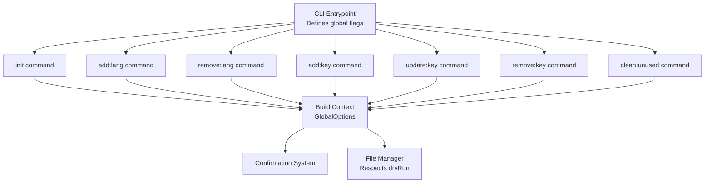
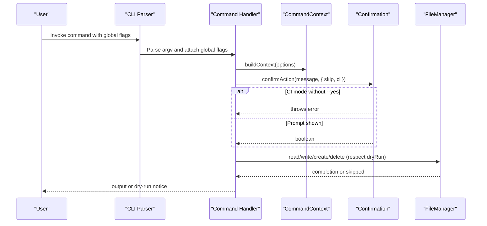
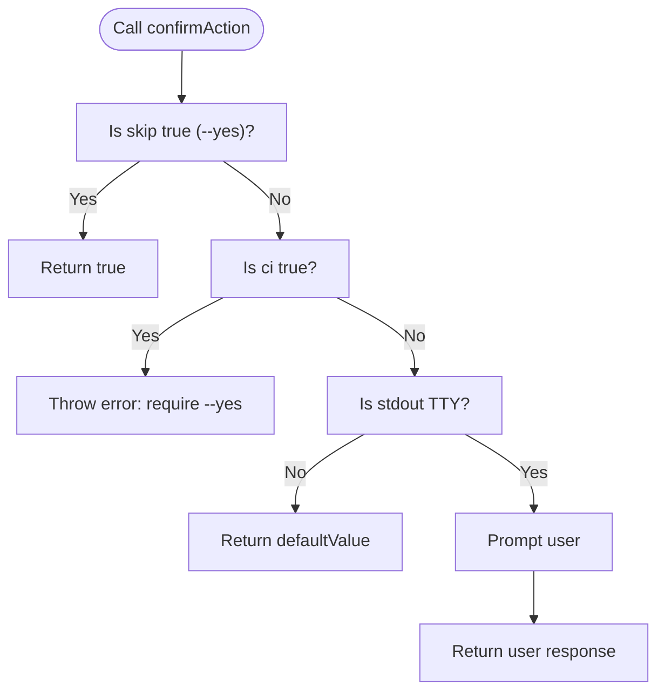
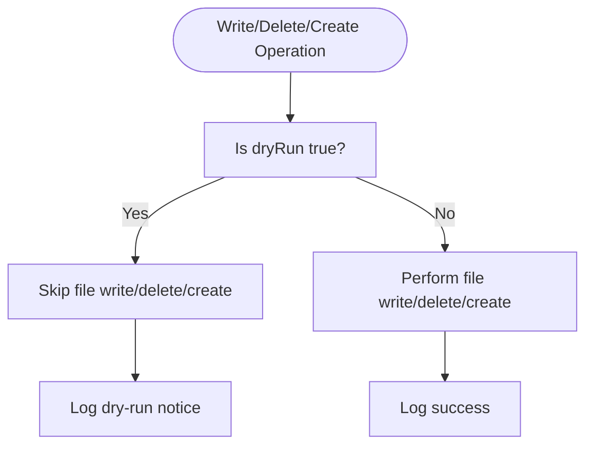
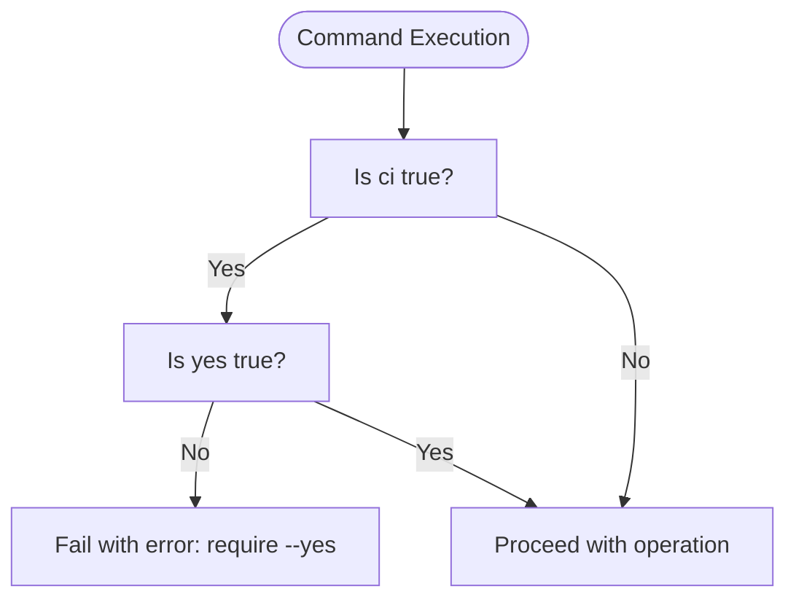
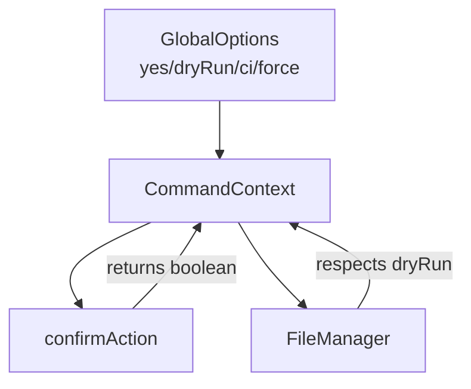

# Global Options & Flags

<cite>
**Referenced Files in This Document**
- [cli.ts](file://src/bin/cli.ts)
- [types.ts](file://src/context/types.ts)
- [build-context.ts](file://src/context/build-context.ts)
- [confirmation.ts](file://src/core/confirmation.ts)
- [file-manager.ts](file://src/core/file-manager.ts)
- [init.ts](file://src/commands/init.ts)
- [add-key.ts](file://src/commands/add-key.ts)
- [update-key.ts](file://src/commands/update-key.ts)
- [remove-key.ts](file://src/commands/remove-key.ts)
- [add-lang.ts](file://src/commands/add-lang.ts)
- [remove-lang.ts](file://src/commands/remove-lang.ts)
- [clean-unused.ts](file://src/commands/clean-unused.ts)
- [package.json](file://package.json)
- [README.md](file://README.md)
</cite>

## Table of Contents
1. [Introduction](#introduction)
2. [Project Structure](#project-structure)
3. [Core Components](#core-components)
4. [Architecture Overview](#architecture-overview)
5. [Detailed Component Analysis](#detailed-component-analysis)
6. [Dependency Analysis](#dependency-analysis)
7. [Performance Considerations](#performance-considerations)
8. [Troubleshooting Guide](#troubleshooting-guide)
9. [Conclusion](#conclusion)
10. [Appendices](#appendices)

## Introduction
This document explains the global options and flags shared across all i18n-pro commands. It covers the complete set of global flags: --yes (skip confirmation), --dry-run (preview mode), --ci (non-interactive mode), and -f/--force (override validation). It details the execution flow for each option, interaction patterns, precedence rules, and how they integrate with the confirmation system, dry-run preview mechanics, and CI/CD workflows. Practical examples demonstrate option combinations, conditional execution paths, and error handling variations. Guidance is included for batch operations, automated workflows, and debugging modes, along with troubleshooting for option conflicts, environment-specific behaviors, and platform differences. Best practices are provided for development, staging, and production environments.

## Project Structure
The global options are defined centrally in the CLI entrypoint and attached to all commands. Each command receives a context that includes the parsed options and configuration. The confirmation system encapsulates interactive behavior and CI constraints. File operations respect dry-run semantics.

**Diagram sources**
- [cli.ts:14-28](file://src/bin/cli.ts#L14-L28)
- [cli.ts:30-111](file://src/bin/cli.ts#L30-L111)
- [build-context.ts:5-16](file://src/context/build-context.ts#L5-L16)
- [confirmation.ts:9-42](file://src/core/confirmation.ts#L9-L42)
- [file-manager.ts:45-98](file://src/core/file-manager.ts#L45-L98)

**Section sources**
- [cli.ts:14-28](file://src/bin/cli.ts#L14-L28)
- [cli.ts:30-111](file://src/bin/cli.ts#L30-L111)
- [build-context.ts:5-16](file://src/context/build-context.ts#L5-L16)

## Core Components
- Global flags definition and attachment:
  - --yes: Skips confirmation prompts.
  - --dry-run: Enables preview mode without writing files.
  - --ci: Non-interactive mode; requires explicit confirmation via --yes to proceed.
  - -f/--force: Overrides validation failures for specific commands (notably init).
- GlobalOptions interface:
  - yes?: boolean
  - dryRun?: boolean
  - ci?: boolean
  - force?: boolean
- Confirmation system:
  - confirmAction(message, options) returns a boolean based on skip, ci, and TTY availability.
- File Manager:
  - writeLocale/deleteLocale/createLocale accept an optional dryRun flag and short-circuit writes when dryRun is true.

**Section sources**
- [cli.ts:21-28](file://src/bin/cli.ts#L21-L28)
- [types.ts:4-9](file://src/context/types.ts#L4-L9)
- [confirmation.ts:9-42](file://src/core/confirmation.ts#L9-L42)
- [file-manager.ts:45-98](file://src/core/file-manager.ts#L45-L98)

## Architecture Overview
The global options are parsed by the CLI and attached to each command. Commands receive a CommandContext that includes GlobalOptions. The confirmation system mediates interactive prompts based on flags and environment. File operations are delegated to the FileManager, which respects dryRun.

**Diagram sources**
- [cli.ts:14-28](file://src/bin/cli.ts#L14-L28)
- [cli.ts:30-111](file://src/bin/cli.ts#L30-L111)
- [build-context.ts:5-16](file://src/context/build-context.ts#L5-L16)
- [confirmation.ts:9-42](file://src/core/confirmation.ts#L9-L42)
- [file-manager.ts:45-98](file://src/core/file-manager.ts#L45-L98)

## Detailed Component Analysis

### Global Flags Definition and Behavior
- --yes (alias -y)
  - Skips confirmation prompts in all commands.
  - Used by confirmAction to return true immediately.
- --dry-run
  - Enables preview mode; commands log what would change without writing files.
  - FileManager short-circuits writes when dryRun is true.
- --ci
  - Non-interactive mode; commands must be run with --yes to proceed.
  - confirmAction throws an error requiring --yes in CI mode.
- -f/--force
  - Overrides validation failures for specific commands (e.g., init).
  - Not universally enforced across all commands; applies where validation is checked.

Execution flow highlights:
- All commands receive GlobalOptions via CommandContext.
- Commands check ci and yes flags early to decide whether to prompt or fail fast.
- confirmAction encapsulates the logic for skipping prompts, CI enforcement, and TTY checks.
- FileManager honors dryRun to prevent writes.

**Section sources**
- [cli.ts:21-28](file://src/bin/cli.ts#L21-L28)
- [confirmation.ts:9-42](file://src/core/confirmation.ts#L9-L42)
- [file-manager.ts:45-98](file://src/core/file-manager.ts#L45-L98)
- [init.ts:28-37](file://src/commands/init.ts#L28-L37)

### Confirmation System
Behavior:
- If skip is true (--yes), confirmAction returns true immediately.
- If ci is true and skip is false, confirmAction throws an error instructing to use --yes.
- If stdout is not a TTY, confirmAction returns defaultValue (typically false) to avoid hanging in non-interactive environments.
- Otherwise, it prompts the user and returns the response.

Interaction patterns:
- Commands call confirmAction with { skip: yes ?? false, ci: ci ?? false }.
- Some commands pass a default value for non-interactive environments.

**Section sources**
- [confirmation.ts:9-42](file://src/core/confirmation.ts#L9-L42)
- [add-key.ts:55-58](file://src/commands/add-key.ts#L55-L58)
- [add-lang.ts:71-74](file://src/commands/add-lang.ts#L71-L74)
- [update-key.ts:70-73](file://src/commands/update-key.ts#L70-L73)
- [remove-key.ts:55-58](file://src/commands/remove-key.ts#L55-L58)
- [clean-unused.ts:94-97](file://src/commands/clean-unused.ts#L94-L97)

### Dry-Run Preview Mechanics
- Commands print a summary of intended changes before prompting.
- confirmAction proceeds without prompting when --yes is provided.
- FileManager.writeLocale/deleteLocale/createLocale return early when dryRun is true, preventing file modifications.
- After attempting operations, commands log either a dry-run notice or success messages.

Key points:
- All write operations are guarded by dryRun checks.
- Commands still compute and report outcomes; dry-run is purely about preventing writes.

**Section sources**
- [add-key.ts:79-83](file://src/commands/add-key.ts#L79-L83)
- [add-lang.ts:83-87](file://src/commands/add-lang.ts#L83-L87)
- [update-key.ts:91-95](file://src/commands/update-key.ts#L91-L95)
- [remove-key.ts:82-86](file://src/commands/remove-key.ts#L82-L86)
- [clean-unused.ts:126-130](file://src/commands/clean-unused.ts#L126-L130)
- [file-manager.ts:56-58](file://src/core/file-manager.ts#L56-L58)
- [file-manager.ts:73-75](file://src/core/file-manager.ts#L73-L75)
- [file-manager.ts:93-95](file://src/core/file-manager.ts#L93-L95)

### CI/CD Integration Requirements
- --ci disables interactive prompts and requires --yes to proceed with changes.
- Commands enforce CI mode by throwing errors when changes would occur without --yes.
- --dry-run is commonly combined with --ci to validate behavior without side effects.
- Exit codes are handled globally by the CLI to surface errors.

Practical patterns:
- Validation-only runs: clean:unused --ci --dry-run
- Automated cleanup: clean:unused --ci --yes
- Non-interactive initialization: init --yes

**Section sources**
- [add-key.ts:49-53](file://src/commands/add-key.ts#L49-L53)
- [add-lang.ts:65-69](file://src/commands/add-lang.ts#L65-L69)
- [update-key.ts:64-68](file://src/commands/update-key.ts#L64-L68)
- [remove-key.ts:49-53](file://src/commands/remove-key.ts#L49-L53)
- [clean-unused.ts:88-92](file://src/commands/clean-unused.ts#L88-L92)
- [init.ts:151-156](file://src/commands/init.ts#L151-L156)
- [cli.ts:113-121](file://src/bin/cli.ts#L113-L121)

### Command-Specific Behaviors and Global Option Interaction
- init:
  - Uses force to bypass existing config checks.
  - Respects --ci and --yes for non-interactive behavior.
  - Dry-run prevents writing config and initializing locales.
- add:lang:
  - Validates locale codes and existence.
  - Supports cloning from an existing locale.
  - Enforces CI and confirmation rules.
- remove:lang:
  - Prevents removal of default locale.
  - Requires explicit confirmation and respects CI.
- add:key / update:key / remove:key:
  - Structural validation and key existence checks.
  - Respect CI and confirmation rules.
- clean:unused:
  - Scans source files using compiled usage patterns.
  - Computes unused keys and applies deletions across locales.
  - Enforces CI and confirmation rules.

**Section sources**
- [init.ts:28-37](file://src/commands/init.ts#L28-L37)
- [init.ts:151-156](file://src/commands/init.ts#L151-L156)
- [init.ts:170-173](file://src/commands/init.ts#L170-L173)
- [add-lang.ts:32-47](file://src/commands/add-lang.ts#L32-L47)
- [add-lang.ts:65-69](file://src/commands/add-lang.ts#L65-L69)
- [remove-lang.ts:21-27](file://src/commands/remove-lang.ts#L21-L27)
- [add-key.ts:13-19](file://src/commands/add-key.ts#L13-L19)
- [update-key.ts:20-27](file://src/commands/update-key.ts#L20-L27)
- [remove-key.ts:14-19](file://src/commands/remove-key.ts#L14-L19)
- [clean-unused.ts:19-23](file://src/commands/clean-unused.ts#L19-L23)

### Execution Flow Diagrams

#### Confirmation Flow

**Diagram sources**
- [confirmation.ts:9-42](file://src/core/confirmation.ts#L9-L42)

#### Dry-Run Flow

**Diagram sources**
- [file-manager.ts:45-98](file://src/core/file-manager.ts#L45-L98)

#### CI Mode Enforcement

**Diagram sources**
- [add-key.ts:49-53](file://src/commands/add-key.ts#L49-L53)
- [add-lang.ts:65-69](file://src/commands/add-lang.ts#L65-L69)
- [update-key.ts:64-68](file://src/commands/update-key.ts#L64-L68)
- [remove-key.ts:49-53](file://src/commands/remove-key.ts#L49-L53)
- [clean-unused.ts:88-92](file://src/commands/clean-unused.ts#L88-L92)
- [init.ts:151-156](file://src/commands/init.ts#L151-L156)

### Practical Examples and Option Combinations
- Dry-run preview:
  - clean:unused --dry-run
  - add:key auth.login.title --value "Login" --dry-run
- Non-interactive CI:
  - clean:unused --ci --dry-run
  - clean:unused --ci --yes
  - init --ci --yes
- Skip confirmation:
  - remove:key auth.legacy --yes
  - add:lang de --from en --yes
- Force overwrite:
  - init --force
- Combined flags:
  - add:key auth.login.title --value "Login" --ci --yes --dry-run (validation-only in CI)
  - clean:unused --ci --yes --dry-run (applies changes in CI)

Conditional execution paths:
- If --ci is set and --yes is not set, commands fail with an error instructing to use --yes.
- If --dry-run is set, commands log what would change and return without writing files.
- If --yes is set, commands skip prompts and proceed with operations.

Error handling variations:
- CI mode without --yes: commands throw errors requiring explicit confirmation.
- Dry-run mode: commands log notices and do not modify files.
- Validation failures: commands may throw errors depending on the command and flags (e.g., init with --force).

**Section sources**
- [README.md:202-276](file://README.md#L202-L276)
- [add-key.ts:49-53](file://src/commands/add-key.ts#L49-L53)
- [add-key.ts:79-83](file://src/commands/add-key.ts#L79-L83)
- [clean-unused.ts:88-92](file://src/commands/clean-unused.ts#L88-L92)
- [init.ts:151-156](file://src/commands/init.ts#L151-L156)

### Advanced Scenarios
- Batch operations:
  - Use --yes to automatically confirm multiple operations across languages or keys.
  - Combine with --dry-run to preview changes before applying.
- Automated workflows:
  - In CI/CD, prefer --ci --dry-run for validation, then --ci --yes for application.
  - Use --force for init in automated environments where configuration may pre-exist.
- Debugging modes:
  - Use --dry-run to inspect changes without side effects.
  - Use --ci --dry-run to validate behavior deterministically.

[No sources needed since this section provides general guidance]

## Dependency Analysis
The global options propagate through the CLI to each command via CommandContext. The confirmation system depends on environment state (TTY) and flags. File operations depend on the GlobalOptions to decide whether to write files.

**Diagram sources**
- [types.ts:4-9](file://src/context/types.ts#L4-L9)
- [build-context.ts:5-16](file://src/context/build-context.ts#L5-L16)
- [confirmation.ts:9-42](file://src/core/confirmation.ts#L9-L42)
- [file-manager.ts:45-98](file://src/core/file-manager.ts#L45-L98)

**Section sources**
- [types.ts:4-9](file://src/context/types.ts#L4-L9)
- [build-context.ts:5-16](file://src/context/build-context.ts#L5-L16)
- [confirmation.ts:9-42](file://src/core/confirmation.ts#L9-L42)
- [file-manager.ts:45-98](file://src/core/file-manager.ts#L45-L98)

## Performance Considerations
- Dry-run avoids disk I/O, reducing latency and risk.
- CI mode without prompts reduces overhead in automated pipelines.
- Validation checks (e.g., locale existence, key conflicts) are performed before prompting to fail fast.

[No sources needed since this section provides general guidance]

## Troubleshooting Guide
Common issues and resolutions:
- Option conflicts:
  - --ci without --yes: commands fail with an error instructing to use --yes.
  - --dry-run with --ci: use --dry-run to preview changes; add --yes to apply in CI.
- Environment-specific behaviors:
  - Non-interactive environments (e.g., CI runners) rely on --yes; confirmAction returns defaultValue.
  - TTY detection ensures prompts are only shown when appropriate.
- Platform differences:
  - File system operations are cross-platform; ensure paths resolve correctly relative to the working directory.
- Validation failures:
  - init with existing config: use --force to overwrite.
  - Key conflicts or missing keys: address structural validation errors before retrying.

**Section sources**
- [confirmation.ts:20-30](file://src/core/confirmation.ts#L20-L30)
- [init.ts:32-37](file://src/commands/init.ts#L32-L37)
- [add-key.ts:35-39](file://src/commands/add-key.ts#L35-L39)
- [update-key.ts:47-51](file://src/commands/update-key.ts#L47-L51)
- [remove-key.ts:38-42](file://src/commands/remove-key.ts#L38-L42)

## Conclusion
The global options system provides a consistent, predictable way to control i18n-pro commands across environments. --yes, --dry-run, --ci, and -f/--force enable safe, automated, and transparent operations. By combining these flags appropriately, teams can validate changes, automate workflows, and integrate seamlessly with CI/CD pipelines while maintaining safety and clarity.

[No sources needed since this section summarizes without analyzing specific files]

## Appendices

### Best Practices by Environment
- Development:
  - Use --dry-run to preview changes.
  - Use --yes for quick iterations when confident.
- Staging:
  - Prefer --ci --dry-run for validation, then --ci --yes for application.
- Production:
  - Always validate with --ci --dry-run.
  - Apply changes with --ci --yes to ensure deterministic behavior.

[No sources needed since this section provides general guidance]

### Relationship Between Global Options and Command-Specific Behaviors
- init:
  - --force overrides validation for existing configuration.
  - --ci/--yes control non-interactive behavior.
- Language commands:
  - --ci/--yes control prompts; --dry-run prevents file writes.
- Key commands:
  - --ci/--yes control prompts; --dry-run prevents file writes.
- Maintenance:
  - --ci/--yes control prompts; --dry-run prevents file writes.

**Section sources**
- [init.ts:28-37](file://src/commands/init.ts#L28-L37)
- [init.ts:151-156](file://src/commands/init.ts#L151-L156)
- [add-lang.ts:65-69](file://src/commands/add-lang.ts#L65-L69)
- [update-key.ts:64-68](file://src/commands/update-key.ts#L64-L68)
- [remove-key.ts:49-53](file://src/commands/remove-key.ts#L49-L53)
- [clean-unused.ts:88-92](file://src/commands/clean-unused.ts#L88-L92)