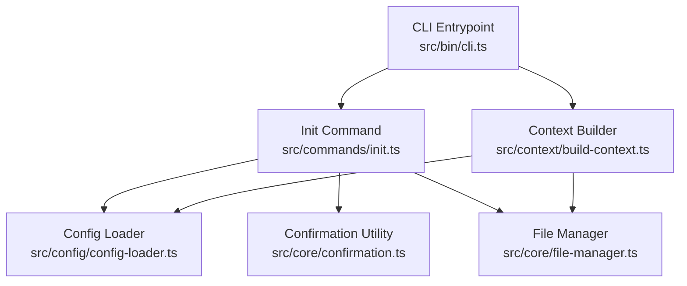
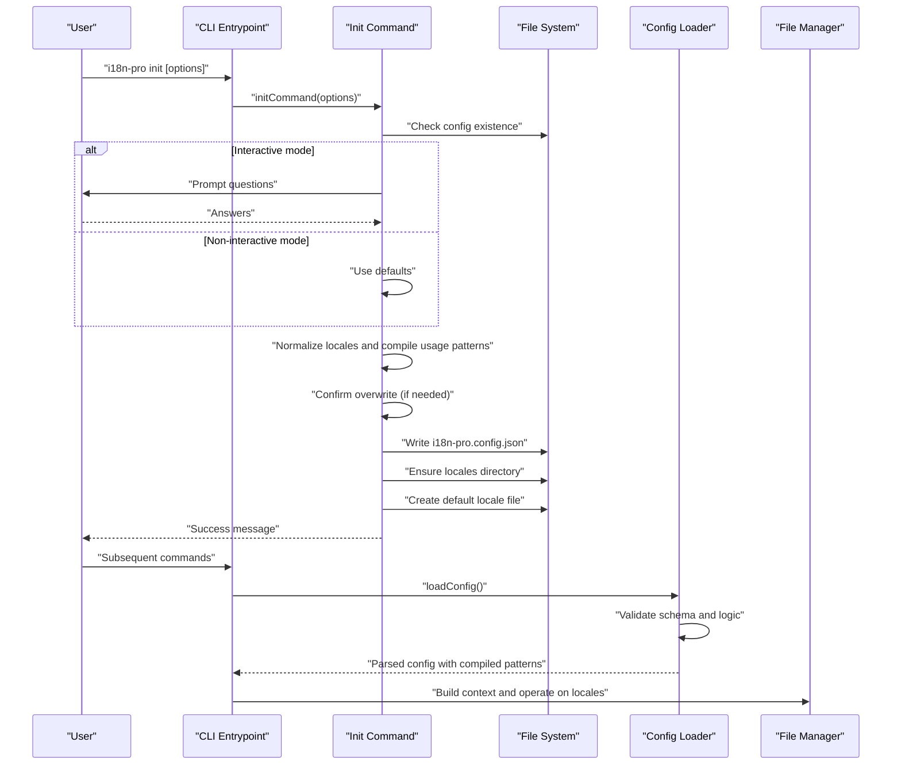
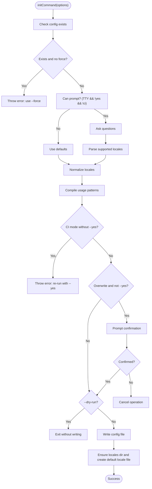
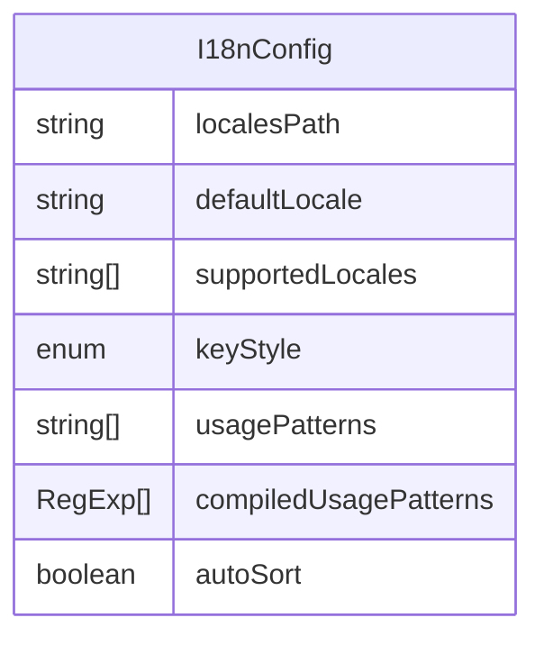
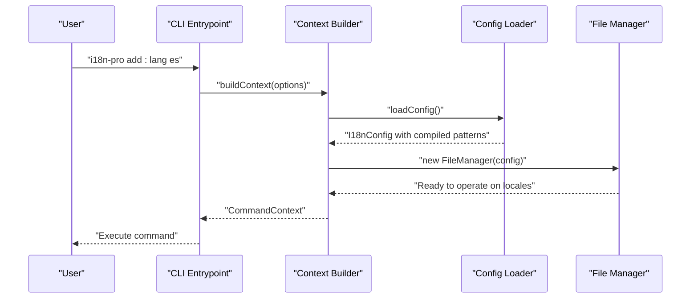
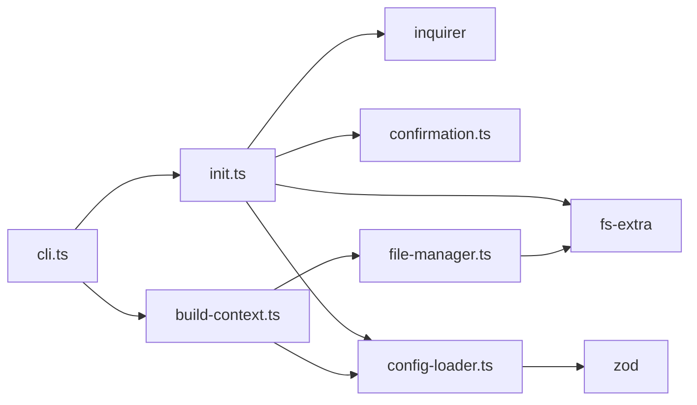

# Initialization Commands

<cite>
**Referenced Files in This Document**
- [cli.ts](file://src/bin/cli.ts)
- [init.ts](file://src/commands/init.ts)
- [init.test.ts](file://src/commands/init.test.ts)
- [config-loader.ts](file://src/config/config-loader.ts)
- [types.ts](file://src/config/types.ts)
- [build-context.ts](file://src/context/build-context.ts)
- [confirmation.ts](file://src/core/confirmation.ts)
- [file-manager.ts](file://src/core/file-manager.ts)
- [package.json](file://package.json)
- [README.md](file://README.md)
</cite>

## Table of Contents
1. [Introduction](#introduction)
2. [Project Structure](#project-structure)
3. [Core Components](#core-components)
4. [Architecture Overview](#architecture-overview)
5. [Detailed Component Analysis](#detailed-component-analysis)
6. [Dependency Analysis](#dependency-analysis)
7. [Performance Considerations](#performance-considerations)
8. [Troubleshooting Guide](#troubleshooting-guide)
9. [Conclusion](#conclusion)

## Introduction
This document explains the initialization process for the i18n-pro CLI tool, focusing on the init command and configuration setup. It covers the complete lifecycle from command invocation to configuration file generation, including interactive and non-interactive modes, validation rules, schema requirements, and the relationship between initialization and subsequent commands. It also provides step-by-step examples, troubleshooting guidance, and best practices for avoiding common pitfalls.

## Project Structure
The initialization command is part of a modular CLI architecture:
- CLI entrypoint defines the init command and global options.
- The init command orchestrates configuration generation, validation, and optional locale initialization.
- Configuration loading validates and compiles usage patterns for downstream commands.
- Context building loads configuration and prepares the runtime environment for other commands.

**Diagram sources**
- [cli.ts:14-38](file://src/bin/cli.ts#L14-L38)
- [init.ts:25-182](file://src/commands/init.ts#L25-L182)
- [config-loader.ts:24-67](file://src/config/config-loader.ts#L24-L67)
- [confirmation.ts:9-42](file://src/core/confirmation.ts#L9-L42)
- [file-manager.ts:5-118](file://src/core/file-manager.ts#L5-L118)
- [build-context.ts:5-16](file://src/context/build-context.ts#L5-L16)

**Section sources**
- [cli.ts:14-38](file://src/bin/cli.ts#L14-L38)
- [init.ts:25-182](file://src/commands/init.ts#L25-L182)
- [config-loader.ts:24-67](file://src/config/config-loader.ts#L24-L67)
- [build-context.ts:5-16](file://src/context/build-context.ts#L5-L16)

## Core Components
- Init command: Creates the configuration file, handles interactive prompts, validates inputs, and initializes the default locale file.
- Configuration loader: Loads, validates, and compiles usage patterns from the configuration file.
- Global options: Shared flags across commands (yes, dry-run, ci, force) that influence init behavior.
- Confirmation utility: Handles user prompts and CI-mode restrictions.
- File manager: Manages locale directory creation and locale file operations.

**Section sources**
- [init.ts:10-182](file://src/commands/init.ts#L10-L182)
- [config-loader.ts:8-67](file://src/config/config-loader.ts#L8-L67)
- [types.ts:3-11](file://src/config/types.ts#L3-L11)
- [confirmation.ts:9-42](file://src/core/confirmation.ts#L9-L42)
- [file-manager.ts:5-118](file://src/core/file-manager.ts#L5-L118)

## Architecture Overview
The init command integrates with the CLI, configuration loader, and file system to produce a validated configuration and initialize the default locale.

**Diagram sources**
- [cli.ts:33-38](file://src/bin/cli.ts#L33-L38)
- [init.ts:25-182](file://src/commands/init.ts#L25-L182)
- [config-loader.ts:24-67](file://src/config/config-loader.ts#L24-L67)
- [file-manager.ts:18-98](file://src/core/file-manager.ts#L18-L98)

## Detailed Component Analysis

### Init Command
The init command performs:
- Existence checks and force behavior.
- Interactive or non-interactive configuration generation.
- Locale normalization and usage pattern compilation.
- CI-mode and dry-run safeguards.
- Optional default locale file creation.

Key behaviors:
- Uses inquirer for interactive prompts when stdout is TTY and not in CI mode.
- Defaults to conservative values in non-interactive mode.
- Normalizes supported locales to include the default locale and deduplicate entries.
- Compiles usage patterns and validates regex syntax and capturing groups.
- Respects global options: yes, dry-run, ci, force.

**Diagram sources**
- [init.ts:25-182](file://src/commands/init.ts#L25-L182)

**Section sources**
- [init.ts:25-182](file://src/commands/init.ts#L25-L182)
- [init.test.ts:50-290](file://src/commands/init.test.ts#L50-L290)

### Configuration Schema and Validation
The configuration schema defines required and optional fields, defaults, and validation rules:
- Required fields: localesPath, defaultLocale, supportedLocales.
- Optional fields with defaults: keyStyle (nested), usagePatterns ([]), autoSort (true).
- Logical validation: defaultLocale must be included in supportedLocales; supportedLocales must not contain duplicates.
- Usage patterns must be valid regex with at least one capturing group.

**Diagram sources**
- [types.ts:3-11](file://src/config/types.ts#L3-L11)
- [config-loader.ts:8-15](file://src/config/config-loader.ts#L8-L15)

**Section sources**
- [config-loader.ts:8-82](file://src/config/config-loader.ts#L8-L82)
- [types.ts:3-11](file://src/config/types.ts#L3-L11)

### Relationship Between Initialization and Subsequent Commands
After successful initialization:
- Other commands rely on loadConfig() to validate and load the configuration.
- The context builder constructs a CommandContext with config and FileManager.
- FileManager ensures the locales directory exists and manages locale files.

**Diagram sources**
- [build-context.ts:5-16](file://src/context/build-context.ts#L5-L16)
- [config-loader.ts:24-67](file://src/config/config-loader.ts#L24-L67)
- [file-manager.ts:5-118](file://src/core/file-manager.ts#L5-L118)

**Section sources**
- [build-context.ts:5-16](file://src/context/build-context.ts#L5-L16)
- [config-loader.ts:24-67](file://src/config/config-loader.ts#L24-L67)
- [file-manager.ts:5-118](file://src/core/file-manager.ts#L5-L118)

## Dependency Analysis
- CLI depends on init command and registers global options shared by all commands.
- Init command depends on inquirer for prompts, fs-extra for file operations, and confirmation utility for user prompts.
- Config loader depends on zod for schema validation and regex compilation.
- Context builder depends on config loader and file manager.
- File manager depends on fs-extra for filesystem operations.

**Diagram sources**
- [cli.ts:33-38](file://src/bin/cli.ts#L33-L38)
- [init.ts:1-8](file://src/commands/init.ts#L1-L8)
- [config-loader.ts:1-4](file://src/config/config-loader.ts#L1-L4)
- [build-context.ts:1-3](file://src/context/build-context.ts#L1-L3)
- [file-manager.ts:1-3](file://src/core/file-manager.ts#L1-L3)

**Section sources**
- [cli.ts:21-28](file://src/bin/cli.ts#L21-L28)
- [init.ts:1-8](file://src/commands/init.ts#L1-L8)
- [config-loader.ts:1-4](file://src/config/config-loader.ts#L1-L4)
- [build-context.ts:1-3](file://src/context/build-context.ts#L1-L3)
- [file-manager.ts:1-3](file://src/core/file-manager.ts#L1-L3)

## Performance Considerations
- Interactive prompts are skipped in non-interactive environments (CI or non-TTY), reducing overhead.
- Dry-run mode avoids filesystem writes, minimizing I/O cost.
- Locale directory creation and default locale file creation are lightweight operations.
- Usage pattern compilation occurs once during init and is reused by downstream commands.

[No sources needed since this section provides general guidance]

## Troubleshooting Guide

Common initialization issues and resolutions:
- Configuration file already exists
  - Symptom: Error indicating the configuration file already exists.
  - Resolution: Use the force option to overwrite or remove the existing file.
  - Reference: [init.ts:32-37](file://src/commands/init.ts#L32-L37)

- CI mode without confirmation
  - Symptom: Error requiring explicit confirmation in CI mode.
  - Resolution: Add the yes option to proceed automatically.
  - Reference: [init.ts:151-156](file://src/commands/init.ts#L151-L156), [confirmation.ts:20-25](file://src/core/confirmation.ts#L20-L25)

- Permission problems
  - Symptom: Failure to write configuration or create directories.
  - Resolution: Ensure write permissions in the project root and locales directory; run with appropriate privileges.
  - Reference: [init.ts:175](file://src/commands/init.ts#L175), [init.ts:223](file://src/commands/init.ts#L223)

- Configuration conflicts
  - Symptom: Validation errors for unsupported locales or invalid usage patterns.
  - Resolution: Fix defaultLocale inclusion, remove duplicates, and correct regex syntax with capturing groups.
  - References: [config-loader.ts:69-82](file://src/config/config-loader.ts#L69-L82), [config-loader.ts:84-109](file://src/config/config-loader.ts#L84-L109)

- Dry-run behavior
  - Symptom: Expecting changes without seeing them applied.
  - Resolution: Understand that dry-run prevents file writes; remove the flag to apply changes.
  - Reference: [init.ts:170-173](file://src/commands/init.ts#L170-L173)

Step-by-step examples

Interactive mode
- Run the init command without arguments in a terminal with TTY support.
- Follow the prompts to set locales path, default locale, supported locales, key style, auto-sort, and usage patterns.
- Review the generated configuration file in the project root.

Non-interactive mode
- Run the init command with the yes option to bypass prompts.
- Optionally combine with force to overwrite an existing configuration.
- Optionally combine with dry-run to preview changes without writing files.

Validation errors
- If the configuration file is malformed or missing required fields, the loader throws descriptive errors.
- Correct the configuration file according to the schema and validation messages.

**Section sources**
- [init.ts:32-37](file://src/commands/init.ts#L32-L37)
- [init.ts:151-156](file://src/commands/init.ts#L151-L156)
- [init.ts:170-173](file://src/commands/init.ts#L170-L173)
- [config-loader.ts:69-82](file://src/config/config-loader.ts#L69-L82)
- [config-loader.ts:84-109](file://src/config/config-loader.ts#L84-L109)
- [confirmation.ts:20-25](file://src/core/confirmation.ts#L20-L25)

## Conclusion
The init command provides a robust, configurable foundation for i18n-pro by generating a validated configuration file and initializing the default locale. Its behavior adapts to interactive and non-interactive environments, respects CI constraints, and integrates seamlessly with subsequent commands through the configuration loader and context builder. By following the examples and troubleshooting guidance, users can reliably set up their i18n workflow and avoid common pitfalls.