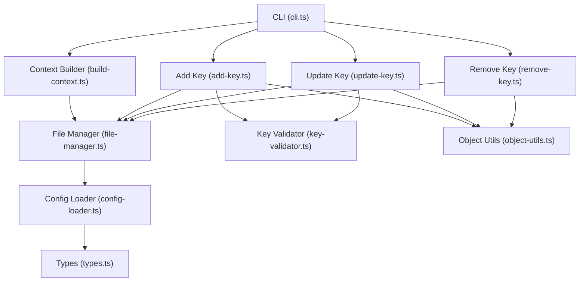
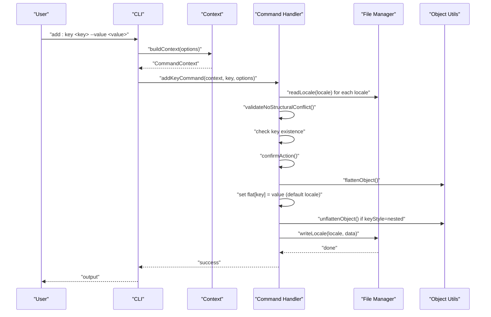
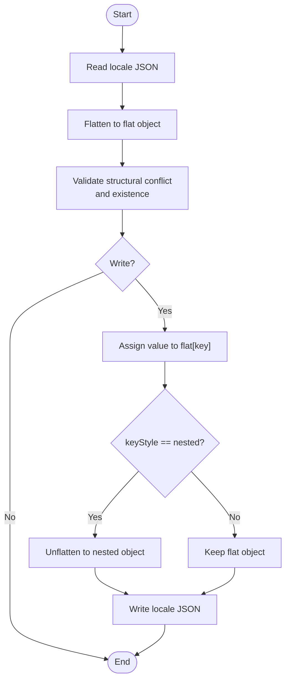
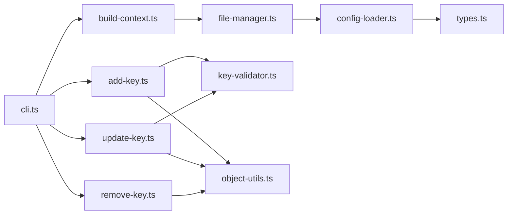

# Key Management Commands

<cite>
**Referenced Files in This Document**
- [cli.ts](file://src/bin/cli.ts)
- [add-key.ts](file://src/commands/add-key.ts)
- [update-key.ts](file://src/commands/update-key.ts)
- [remove-key.ts](file://src/commands/remove-key.ts)
- [key-validator.ts](file://src/core/key-validator.ts)
- [object-utils.ts](file://src/core/object-utils.ts)
- [file-manager.ts](file://src/core/file-manager.ts)
- [build-context.ts](file://src/context/build-context.ts)
- [config-loader.ts](file://src/config/config-loader.ts)
- [types.ts](file://src/config/types.ts)
- [confirmation.ts](file://src/core/confirmation.ts)
- [add-key.test.ts](file://src/commands/add-key.test.ts)
- [update-key.test.ts](file://src/commands/update-key.test.ts)
- [remove-key.test.ts](file://src/commands/remove-key.test.ts)
- [README.md](file://README.md)
</cite>

## Table of Contents
1. [Introduction](#introduction)
2. [Project Structure](#project-structure)
3. [Core Components](#core-components)
4. [Architecture Overview](#architecture-overview)
5. [Detailed Component Analysis](#detailed-component-analysis)
6. [Dependency Analysis](#dependency-analysis)
7. [Performance Considerations](#performance-considerations)
8. [Troubleshooting Guide](#troubleshooting-guide)
9. [Conclusion](#conclusion)
10. [Appendices](#appendices)

## Introduction
This document provides comprehensive guidance for key management commands focused on add:key, update:key, and remove:key operations. It explains the complete key lifecycle across supported locales, covering creation, modification, and deletion. It documents command syntax, required parameters, key naming conventions, validation rules, and safety mechanisms such as dry-run and CI modes. Practical examples illustrate nested structures, cross-locale updates, and removal workflows. Advanced topics include batch operations across multiple locales, structural integrity preservation, and integration considerations with translation services.

## Project Structure
The key management commands are implemented as CLI subcommands with shared core utilities:
- CLI entrypoint defines the commands and global options.
- Command handlers orchestrate validation, confirmation, and file writes.
- Utilities provide object flattening/unflattening, structural conflict checks, and locale file IO.
- Configuration loader validates and loads project settings.

**Diagram sources**
- [cli.ts:63-100](file://src/bin/cli.ts#L63-L100)
- [build-context.ts:5-16](file://src/context/build-context.ts#L5-L16)
- [file-manager.ts:5-118](file://src/core/file-manager.ts#L5-L118)
- [add-key.ts:1-93](file://src/commands/add-key.ts#L1-L93)
- [update-key.ts:1-103](file://src/commands/update-key.ts#L1-L103)
- [remove-key.ts:1-96](file://src/commands/remove-key.ts#L1-L96)
- [key-validator.ts:1-33](file://src/core/key-validator.ts#L1-L33)
- [object-utils.ts:1-95](file://src/core/object-utils.ts#L1-L95)
- [config-loader.ts:24-67](file://src/config/config-loader.ts#L24-L67)
- [types.ts:1-12](file://src/config/types.ts#L1-L12)

**Section sources**
- [cli.ts:63-100](file://src/bin/cli.ts#L63-L100)
- [build-context.ts:5-16](file://src/context/build-context.ts#L5-L16)
- [file-manager.ts:5-118](file://src/core/file-manager.ts#L5-L118)
- [config-loader.ts:24-67](file://src/config/config-loader.ts#L24-L67)

## Core Components
- add:key: Creates a new key in all supported locales. The default locale receives the provided value; others receive empty strings. Structural conflicts are prevented, and duplicate keys are rejected.
- update:key: Updates an existing key’s value in a specified locale (or default locale). Supports partial updates and preserves other keys. Structural conflicts are validated.
- remove:key: Removes a key from all locales where it exists. Cascade deletion ensures nested parents are pruned when empty. Preserves structural integrity.

Key naming and validation:
- Keys use dot notation (e.g., auth.login.title).
- Dangerous key segments are blocked.
- Structural conflict checks prevent creating keys that overlap with existing objects or nested children.

Safety and UX:
- Dry-run preview mode prevents file modifications.
- CI mode requires explicit confirmation via --yes.
- Confirmation prompts can be skipped with --yes.

**Section sources**
- [add-key.ts:7-93](file://src/commands/add-key.ts#L7-L93)
- [update-key.ts:15-103](file://src/commands/update-key.ts#L15-L103)
- [remove-key.ts:10-96](file://src/commands/remove-key.ts#L10-L96)
- [key-validator.ts:1-33](file://src/core/key-validator.ts#L1-L33)
- [object-utils.ts:1-95](file://src/core/object-utils.ts#L1-L95)
- [confirmation.ts:9-43](file://src/core/confirmation.ts#L9-L43)

## Architecture Overview
The commands share a common flow: build context, validate inputs, confirm action (unless skipped), transform data according to keyStyle, and write files. Validation occurs before any writes, and object utilities maintain consistent nested vs flat structures.

**Diagram sources**
- [cli.ts:63-76](file://src/bin/cli.ts#L63-L76)
- [build-context.ts:5-16](file://src/context/build-context.ts#L5-L16)
- [add-key.ts:28-77](file://src/commands/add-key.ts#L28-L77)
- [object-utils.ts:17-64](file://src/core/object-utils.ts#L17-L64)
- [file-manager.ts:31-61](file://src/core/file-manager.ts#L31-L61)

## Detailed Component Analysis

### add:key Command
Purpose:
- Adds a new translation key to all supported locales.
- Default locale receives the provided value; non-default locales receive empty strings.
- Enforces structural integrity and disallows duplicates.

Syntax and options:
- Command: add:key <key> --value <value>
- Required: <key> and --value
- Behavior: Iterates locales, validates, confirms, and writes.

Validation rules:
- Rejects missing key or empty value.
- Checks for structural conflicts (parent-child overlaps).
- Ensures key does not already exist in any locale.

Safety mechanisms:
- Dry-run mode previews changes.
- CI mode requires --yes to proceed.
- Confirmation prompt unless --yes is provided.

Examples:
- Nested structure creation: add:key auth.login.title --value "Login"
- Flat structure creation: add:key auth.login.title --value "Login" (when keyStyle=flat)
- Multiple locales: adds to all supportedLocales; default locale gets value, others get empty string.

**Section sources**
- [cli.ts:66-76](file://src/bin/cli.ts#L66-L76)
- [add-key.ts:7-93](file://src/commands/add-key.ts#L7-L93)
- [key-validator.ts:1-33](file://src/core/key-validator.ts#L1-L33)
- [object-utils.ts:17-64](file://src/core/object-utils.ts#L17-L64)
- [file-manager.ts:31-61](file://src/core/file-manager.ts#L31-L61)
- [add-key.test.ts:42-235](file://src/commands/add-key.test.ts#L42-L235)

### update:key Command
Purpose:
- Updates an existing key’s value in a specified locale (or default locale).
- Supports partial updates and preserves other keys.

Syntax and options:
- Command: update:key <key> --value <value> [--locale <locale>]
- Required: <key> and --value
- Optional: --locale (defaults to defaultLocale)

Validation rules:
- Rejects missing key or undefined value.
- Validates target locale exists in supportedLocales.
- Checks for structural conflicts.

Safety mechanisms:
- Dry-run mode previews changes.
- CI mode requires --yes to proceed.
- Confirmation prompt unless --yes is provided.

Examples:
- Update default locale: update:key greeting --value "Hi"
- Update specific locale: update:key greeting --value "Hallo" --locale de
- Nested key update: update:key auth.login.title --value "Sign In Page"

**Section sources**
- [cli.ts:78-89](file://src/bin/cli.ts#L78-L89)
- [update-key.ts:15-103](file://src/commands/update-key.ts#L15-L103)
- [key-validator.ts:1-33](file://src/core/key-validator.ts#L1-L33)
- [object-utils.ts:17-64](file://src/core/object-utils.ts#L17-L64)
- [file-manager.ts:31-61](file://src/core/file-manager.ts#L31-L61)
- [update-key.test.ts:42-265](file://src/commands/update-key.test.ts#L42-L265)

### remove:key Command
Purpose:
- Removes a key from all locales where it exists.
- Performs cascade deletion to remove empty nested parents when using nested keyStyle.

Syntax and options:
- Command: remove:key <key>
- Required: <key>

Validation rules:
- Rejects missing key.
- Confirms key exists in at least one locale.

Safety mechanisms:
- Dry-run mode previews changes.
- CI mode requires --yes to proceed.
- Confirmation prompt unless --yes is provided.

Examples:
- Remove from all locales: remove:key greeting
- Nested cascade removal: remove:key auth.login.title (removes empty auth.login)
- Flat key removal: remove:key auth.login.title (removes the flat key)

**Section sources**
- [cli.ts:91-100](file://src/bin/cli.ts#L91-L100)
- [remove-key.ts:10-96](file://src/commands/remove-key.ts#L10-L96)
- [object-utils.ts:70-95](file://src/core/object-utils.ts#L70-L95)
- [file-manager.ts:31-61](file://src/core/file-manager.ts#L31-L61)
- [remove-key.test.ts:42-250](file://src/commands/remove-key.test.ts#L42-L250)

### Validation and Safety Mechanisms
- Structural conflict detection prevents overlapping keys and nested collisions.
- Dangerous key segments are blocked during flattening/unflattening.
- Confirmation prompts guard against unintended changes; --yes skips prompts.
- CI mode enforces explicit approval via --yes; otherwise throws an error.
- Dry-run mode prevents file writes while still executing read/write logic internally.

**Section sources**
- [key-validator.ts:1-33](file://src/core/key-validator.ts#L1-L33)
- [object-utils.ts:3-15](file://src/core/object-utils.ts#L3-L15)
- [confirmation.ts:9-43](file://src/core/confirmation.ts#L9-L43)

### Data Flow and Transformations
- Object flattening converts nested structures to dot-notation for validation and updates.
- Unflattening reconstructs nested structures when keyStyle=nested.
- Removal cascades prunes empty objects after deletions.

**Diagram sources**
- [object-utils.ts:17-64](file://src/core/object-utils.ts#L17-L64)
- [file-manager.ts:45-61](file://src/core/file-manager.ts#L45-L61)

## Dependency Analysis
- CLI depends on context builder to assemble config and file manager.
- Commands depend on file manager for IO and on object utils for transformations.
- Validation relies on key-validator and object-utils for safety.
- Configuration loading validates locales and keyStyle.

**Diagram sources**
- [cli.ts:63-100](file://src/bin/cli.ts#L63-L100)
- [build-context.ts:5-16](file://src/context/build-context.ts#L5-L16)
- [file-manager.ts:5-118](file://src/core/file-manager.ts#L5-L118)
- [add-key.ts:1-93](file://src/commands/add-key.ts#L1-L93)
- [update-key.ts:1-103](file://src/commands/update-key.ts#L1-L103)
- [remove-key.ts:1-96](file://src/commands/remove-key.ts#L1-L96)
- [key-validator.ts:1-33](file://src/core/key-validator.ts#L1-L33)
- [object-utils.ts:1-95](file://src/core/object-utils.ts#L1-L95)
- [config-loader.ts:24-67](file://src/config/config-loader.ts#L24-L67)
- [types.ts:1-12](file://src/config/types.ts#L1-L12)

**Section sources**
- [cli.ts:63-100](file://src/bin/cli.ts#L63-L100)
- [build-context.ts:5-16](file://src/context/build-context.ts#L5-L16)
- [file-manager.ts:5-118](file://src/core/file-manager.ts#L5-L118)
- [config-loader.ts:24-67](file://src/config/config-loader.ts#L24-L67)

## Performance Considerations
- Batch operations across multiple locales: Each locale incurs a read and write; dry-run reduces writes but still performs reads.
- Nested vs flat keyStyle: Nested transformations add overhead due to recursive operations; consider flat keys for simpler structures.
- Auto-sort: Enabled by default; sorting increases write time slightly but improves readability and diffs.

[No sources needed since this section provides general guidance]

## Troubleshooting Guide
Common errors and resolutions:
- Missing key or value:
  - add:key: Both key and --value are required.
  - update:key: Both key and --value are required.
- Key already exists:
  - add:key: Use update:key instead.
- Key does not exist:
  - update:key: Key does not exist in the target locale.
- Locale not supported:
  - update:key: Locale is not defined in configuration.
- Structural conflict:
  - add:key/update:key: Parent or child conflict detected; adjust key path.
- Key not found in any locale:
  - remove:key: Key does not exist in any locale.
- CI mode without --yes:
  - add:key/update:key/remove:key: Confirmation required in CI mode; re-run with --yes.
- Dry-run mode:
  - All commands: Files are not modified; use to preview changes.

Operational tips:
- Use --dry-run to preview changes before applying.
- Use --yes to skip interactive prompts in scripts.
- Use --ci to enforce non-interactive behavior in CI environments.

**Section sources**
- [add-key.ts:17-19](file://src/commands/add-key.ts#L17-L19)
- [add-key.ts:35-41](file://src/commands/add-key.ts#L35-L41)
- [update-key.ts:25-27](file://src/commands/update-key.ts#L25-L27)
- [update-key.ts:47-51](file://src/commands/update-key.ts#L47-L51)
- [update-key.ts:31-35](file://src/commands/update-key.ts#L31-L35)
- [remove-key.ts:17-19](file://src/commands/remove-key.ts#L17-L19)
- [remove-key.ts:38-42](file://src/commands/remove-key.ts#L38-L42)
- [key-validator.ts:7-19](file://src/core/key-validator.ts#L7-L19)
- [key-validator.ts:21-32](file://src/core/key-validator.ts#L21-L32)
- [confirmation.ts:20-25](file://src/core/confirmation.ts#L20-L25)
- [add-key.test.ts:42-115](file://src/commands/add-key.test.ts#L42-L115)
- [update-key.test.ts:42-120](file://src/commands/update-key.test.ts#L42-L120)
- [remove-key.test.ts:42-60](file://src/commands/remove-key.test.ts#L42-L60)

## Conclusion
The key management commands provide a robust, safe, and flexible way to manage translation keys across locales. They enforce structural integrity, support both nested and flat key styles, and offer strong safety controls via dry-run, CI mode, and confirmation prompts. By following the documented syntax, validation rules, and examples, teams can confidently create, update, and remove keys while preserving structural consistency and enabling scalable workflows.

[No sources needed since this section summarizes without analyzing specific files]

## Appendices

### Command Reference and Examples
- Add a key to all locales:
  - add:key auth.login.title --value "Login"
- Update a key in a specific locale:
  - update:key auth.login.title --value "Sign In" --locale en
- Remove a key from all locales:
  - remove:key auth.login.title
- Preview changes without writing:
  - add:key auth.login.title --value "Login" --dry-run
- Skip prompts in scripts:
  - remove:key auth.login.title --yes
- CI-friendly usage:
  - update:key greeting --value "Hi" --ci --yes

**Section sources**
- [README.md:159-183](file://README.md#L159-L183)
- [cli.ts:66-100](file://src/bin/cli.ts#L66-L100)