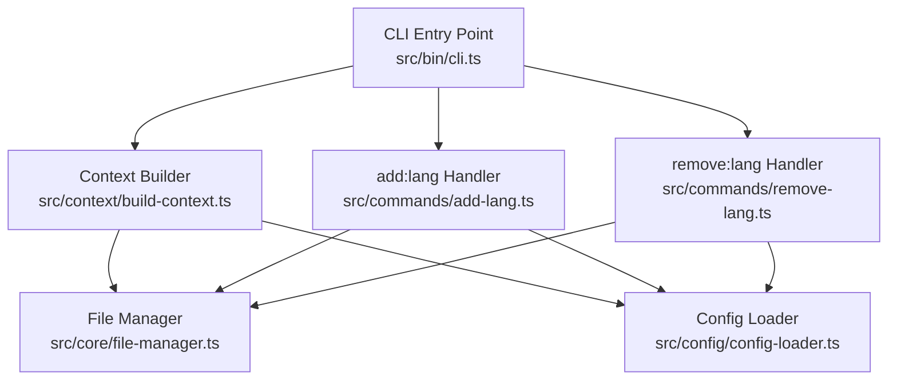
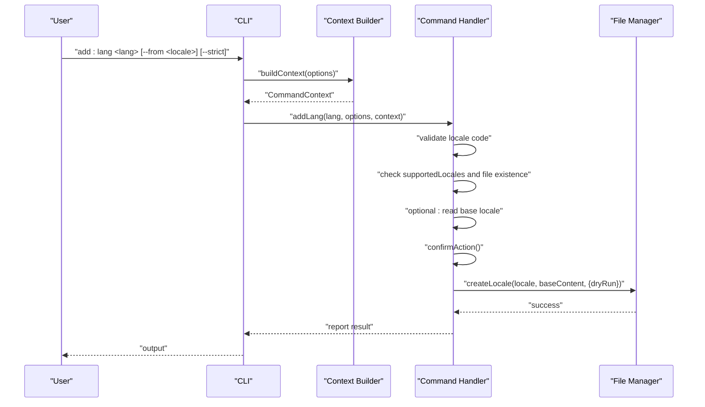
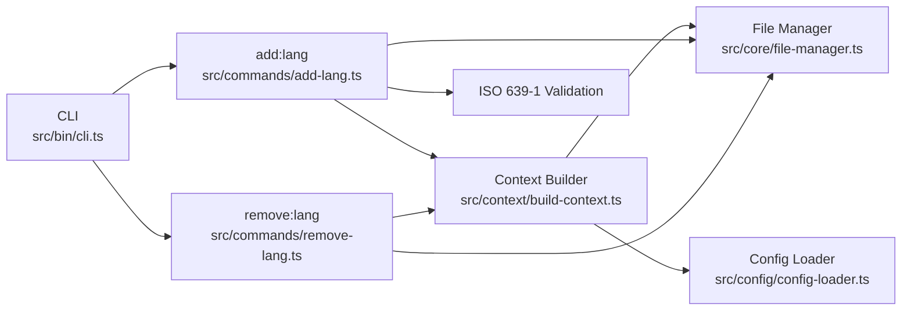

# Language Management Commands

<cite>
**Referenced Files in This Document**
- [cli.ts](file://src/bin/cli.ts)
- [add-lang.ts](file://src/commands/add-lang.ts)
- [remove-lang.ts](file://src/commands/remove-lang.ts)
- [build-context.ts](file://src/context/build-context.ts)
- [types.ts](file://src/context/types.ts)
- [file-manager.ts](file://src/core/file-manager.ts)
- [config-loader.ts](file://src/config/config-loader.ts)
- [types.ts](file://src/config/types.ts)
- [README.md](file://README.md)
- [add-lang.test.ts](file://src/commands/add-lang.test.ts)
- [remove-lang.test.ts](file://src/commands/remove-lang.test.ts)
</cite>

## Table of Contents
1. [Introduction](#introduction)
2. [Project Structure](#project-structure)
3. [Core Components](#core-components)
4. [Architecture Overview](#architecture-overview)
5. [Detailed Component Analysis](#detailed-component-analysis)
6. [Dependency Analysis](#dependency-analysis)
7. [Performance Considerations](#performance-considerations)
8. [Troubleshooting Guide](#troubleshooting-guide)
9. [Conclusion](#conclusion)

## Introduction
This document explains the language management commands focused on adding and removing language locales. It covers the complete workflow for add:lang (including cloning from existing locales), validation rules, file creation patterns, command syntax and parameters, and the remove:lang command behavior. It also documents the relationship between language operations and key management, error handling for invalid codes, existing locale conflicts, and file permission issues. Advanced scenarios such as bulk operations, custom locale paths, and integration with translation providers are addressed conceptually.

## Project Structure
The language management commands are implemented as part of a modular CLI architecture:
- CLI entry point defines commands and global options
- Command handlers implement the business logic
- Context builder injects configuration and file manager
- File manager encapsulates filesystem operations
- Configuration loader validates and loads project settings

**Diagram sources**
- [cli.ts:1-122](file://src/bin/cli.ts#L1-L122)
- [build-context.ts:1-16](file://src/context/build-context.ts#L1-L16)
- [file-manager.ts:1-118](file://src/core/file-manager.ts#L1-L118)
- [config-loader.ts:1-176](file://src/config/config-loader.ts#L1-L176)
- [add-lang.ts:1-98](file://src/commands/add-lang.ts#L1-L98)
- [remove-lang.ts:1-74](file://src/commands/remove-lang.ts#L1-L74)

**Section sources**
- [cli.ts:1-122](file://src/bin/cli.ts#L1-L122)
- [build-context.ts:1-16](file://src/context/build-context.ts#L1-L16)
- [file-manager.ts:1-118](file://src/core/file-manager.ts#L1-L118)
- [config-loader.ts:1-176](file://src/config/config-loader.ts#L1-L176)

## Core Components
- add:lang command handler validates locale codes, checks for duplicates, optionally clones from an existing locale, and creates a new locale file. It integrates with confirmation prompts and dry-run modes.
- remove:lang command validates that the locale is supported, prevents removal of the default locale, checks for file existence, and deletes the locale file with safety checks and dry-run support.
- Context builder provides a CommandContext with configuration, file manager, and global options to both handlers.
- File manager encapsulates locale file operations, including existence checks, reading, writing, and deletion, with support for sorting and dry-run behavior.
- Configuration loader validates project configuration and ensures logical consistency (e.g., default locale must be supported).

**Section sources**
- [add-lang.ts:26-98](file://src/commands/add-lang.ts#L26-L98)
- [remove-lang.ts:5-74](file://src/commands/remove-lang.ts#L5-L74)
- [build-context.ts:5-16](file://src/context/build-context.ts#L5-L16)
- [file-manager.ts:22-98](file://src/core/file-manager.ts#L22-L98)
- [config-loader.ts:24-82](file://src/config/config-loader.ts#L24-L82)

## Architecture Overview
The language commands follow a consistent flow:
- Parse CLI arguments and global options
- Build context with configuration and file manager
- Validate inputs and preconditions
- Confirm action (unless --yes is provided)
- Perform filesystem operations (create/delete locale files)
- Report results and provide manual steps for configuration updates

**Diagram sources**
- [cli.ts:40-50](file://src/bin/cli.ts#L40-L50)
- [build-context.ts:5-16](file://src/context/build-context.ts#L5-L16)
- [add-lang.ts:26-98](file://src/commands/add-lang.ts#L26-L98)
- [file-manager.ts:80-98](file://src/core/file-manager.ts#L80-L98)

## Detailed Component Analysis

### add:lang Command
Purpose: Add a new language locale, optionally cloning from an existing locale. Validates locale codes, prevents duplicates, and supports dry-run and CI modes.

Key behaviors:
- Locale validation accepts ISO 639-1 codes and codes with region (e.g., en-US). It trims whitespace from the input.
- Duplicate prevention checks both supportedLocales and existing files.
- Optional cloning reads an existing locale’s content and uses it as initial content for the new locale.
- Confirmation prompt is skipped when --yes is provided; CI mode requires --yes to proceed.
- Dry-run mode previews changes without writing files.
- Manual step reminder to add the new locale to supportedLocales in configuration.

Command syntax and parameters:
- Syntax: add:lang <lang> [--from <locale>] [--strict]
- Parameters:
  - <lang>: Language code (ISO 639-1 or with region)
  - --from <locale>: Clone translations from an existing locale
  - --strict: Reserved for future strict validation

Validation rules:
- Locale code must be valid (ISO 639-1 or with region)
- Locale must not already be in supportedLocales
- Target locale file must not already exist
- Base locale (when cloning) must exist in supportedLocales

File creation pattern:
- Creates a new JSON file at localesPath/<lang>.json
- Uses initial content from base locale (if cloning) or empty object
- Applies autoSort behavior if enabled in configuration

Safety and UX:
- Confirmation prompt unless --yes is provided
- Clear messages indicating manual steps for configuration updates
- Dry-run preview mode

Examples:
- Add a new locale with empty content: add:lang fr
- Clone from an existing locale: add:lang de --from en
- Preview changes: add:lang es --dry-run
- CI mode: add:lang it --ci --yes

**Section sources**
- [add-lang.ts:11-24](file://src/commands/add-lang.ts#L11-L24)
- [add-lang.ts:34-47](file://src/commands/add-lang.ts#L34-L47)
- [add-lang.ts:51-60](file://src/commands/add-lang.ts#L51-L60)
- [add-lang.ts:71-79](file://src/commands/add-lang.ts#L71-L79)
- [add-lang.ts:81-96](file://src/commands/add-lang.ts#L81-L96)
- [cli.ts:42-49](file://src/bin/cli.ts#L42-L49)
- [README.md:141-151](file://README.md#L141-L151)

### remove:lang Command
Purpose: Remove a language translation file with safety checks and confirmation.

Key behaviors:
- Validates that the locale exists in supportedLocales
- Prevents removal of the default locale
- Confirms deletion unless --yes is provided
- Checks for file existence before attempting deletion
- Supports dry-run mode to preview changes

Argument handling:
- <lang>: Language code to remove (whitespace trimmed)

Safety checks:
- Locale must be supported
- Cannot remove default locale
- Locale file must exist

Deletion behavior:
- Deletes the locale file at localesPath/<lang>.json
- Dry-run mode prevents actual deletion

Manual step reminder:
- Reminder to remove the locale from supportedLocales in configuration

Examples:
- Remove a locale: remove:lang fr
- Preview deletion: remove:lang de --dry-run
- CI mode: remove:lang it --ci --yes

**Section sources**
- [remove-lang.ts:14-19](file://src/commands/remove-lang.ts#L14-L19)
- [remove-lang.ts:21-27](file://src/commands/remove-lang.ts#L21-L27)
- [remove-lang.ts:29-35](file://src/commands/remove-lang.ts#L29-L35)
- [remove-lang.ts:46-49](file://src/commands/remove-lang.ts#L46-L49)
- [remove-lang.ts:56-57](file://src/commands/remove-lang.ts#L56-L57)
- [remove-lang.ts:63-72](file://src/commands/remove-lang.ts#L63-L72)
- [cli.ts:54-61](file://src/bin/cli.ts#L54-L61)
- [README.md:153-157](file://README.md#L153-L157)

### Relationship Between Language Operations and Key Management
- Language operations do not automatically update key content across locales; they manage locale files only.
- After adding a new locale, keys must be added via key management commands (e.g., add:key) to populate translations.
- Removing a locale deletes the locale file; keys remain in other locales unless explicitly removed via key management commands.
- Configuration updates (adding/removing locales in supportedLocales) are manual steps after language operations.

**Section sources**
- [add-lang.ts:92-96](file://src/commands/add-lang.ts#L92-L96)
- [remove-lang.ts:67-71](file://src/commands/remove-lang.ts#L67-L71)
- [README.md:139-184](file://README.md#L139-L184)

### Advanced Scenarios
Bulk language operations:
- The CLI supports repeated invocations for multiple locales. There is no built-in batch command; use shell loops or scripts to iterate over a list of locales.

Custom locale paths:
- localesPath in configuration determines where locale files are stored. The file manager resolves the absolute path and ensures the directory exists before creating files.

Integration with translation providers:
- Translation providers are available for programmatic use and can be combined with language operations. For example, after adding a locale, you can use the TranslationService to populate translations from a source locale.

**Section sources**
- [file-manager.ts:14-20](file://src/core/file-manager.ts#L14-L20)
- [config-loader.ts:8-15](file://src/config/config-loader.ts#L8-L15)
- [README.md:277-299](file://README.md#L277-L299)

## Dependency Analysis
The language commands depend on:
- CLI for parsing arguments and global options
- Context builder for injecting configuration and file manager
- File manager for filesystem operations
- Configuration loader for validating project settings

**Diagram sources**
- [cli.ts:1-122](file://src/bin/cli.ts#L1-L122)
- [add-lang.ts:1-98](file://src/commands/add-lang.ts#L1-L98)
- [remove-lang.ts:1-74](file://src/commands/remove-lang.ts#L1-L74)
- [build-context.ts:1-16](file://src/context/build-context.ts#L1-L16)
- [file-manager.ts:1-118](file://src/core/file-manager.ts#L1-L118)
- [config-loader.ts:1-176](file://src/config/config-loader.ts#L1-L176)

**Section sources**
- [cli.ts:1-122](file://src/bin/cli.ts#L1-L122)
- [add-lang.ts:1-98](file://src/commands/add-lang.ts#L1-L98)
- [remove-lang.ts:1-74](file://src/commands/remove-lang.ts#L1-L74)
- [build-context.ts:1-16](file://src/context/build-context.ts#L1-L16)
- [file-manager.ts:1-118](file://src/core/file-manager.ts#L1-L118)
- [config-loader.ts:1-176](file://src/config/config-loader.ts#L1-L176)

## Performance Considerations
- Locale creation and deletion are lightweight filesystem operations. Performance is primarily affected by disk I/O and JSON serialization.
- Auto-sort behavior (enabled by default) adds minimal overhead during write operations.
- Dry-run mode avoids filesystem writes, reducing performance impact to negligible levels.

[No sources needed since this section provides general guidance]

## Troubleshooting Guide
Common errors and resolutions:
- Invalid language code: Ensure the code follows ISO 639-1 standards or includes a region (e.g., en-US). Whitespace is trimmed automatically.
- Locale already exists in supportedLocales: Choose a different code or remove the existing locale first.
- Locale file already exists: Delete the existing file or choose a different locale code.
- Base locale does not exist: Verify the base locale is present in supportedLocales.
- Cannot remove default locale: Change defaultLocale in configuration before removing the locale.
- Locale file does not exist: Confirm the locale file exists at localesPath/<lang>.json.
- CI mode without --yes: Add --yes to proceed in non-interactive environments.
- Dry-run mode: Changes are previewed; add --yes to apply changes.

**Section sources**
- [add-lang.ts:36-47](file://src/commands/add-lang.ts#L36-L47)
- [add-lang.ts:55-57](file://src/commands/add-lang.ts#L55-L57)
- [remove-lang.ts:16-18](file://src/commands/remove-lang.ts#L16-L18)
- [remove-lang.ts:23-27](file://src/commands/remove-lang.ts#L23-L27)
- [remove-lang.ts:32-35](file://src/commands/remove-lang.ts#L32-L35)
- [file-manager.ts:34-42](file://src/core/file-manager.ts#L34-L42)
- [file-manager.ts:69-71](file://src/core/file-manager.ts#L69-L71)

## Conclusion
The language management commands provide robust, safe operations for adding and removing locales with strong validation and user-friendly controls (confirmation prompts, dry-run, CI mode). They integrate cleanly with the configuration and filesystem abstractions, enabling predictable workflows for internationalization. For advanced use cases, combine these commands with key management and translation providers to automate and scale localization tasks.