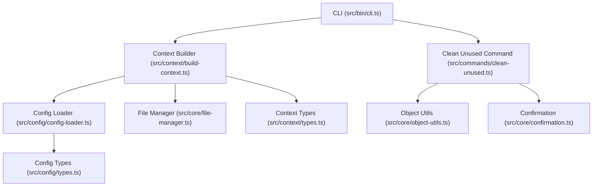
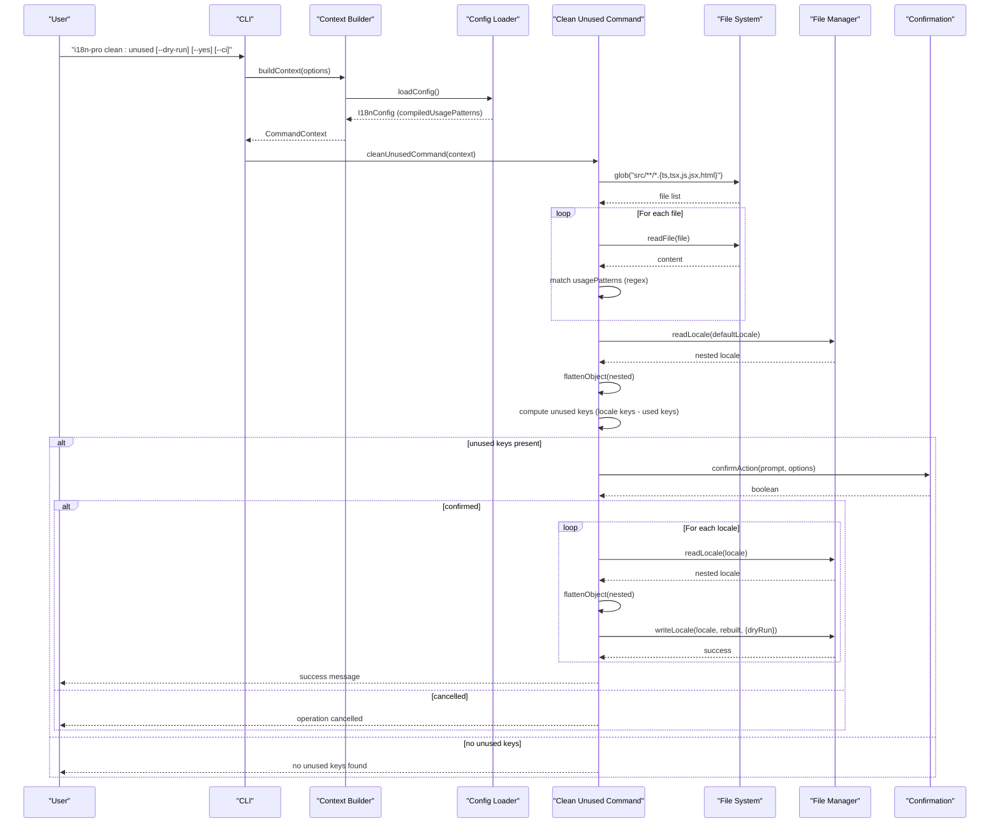
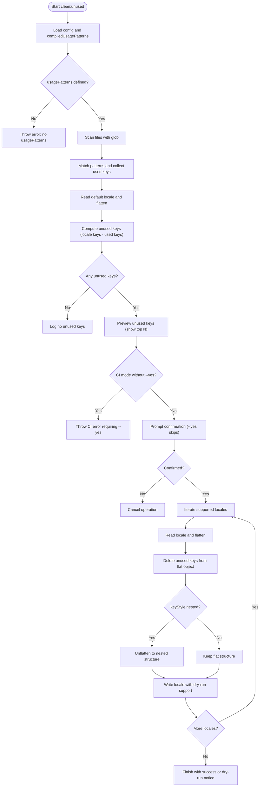
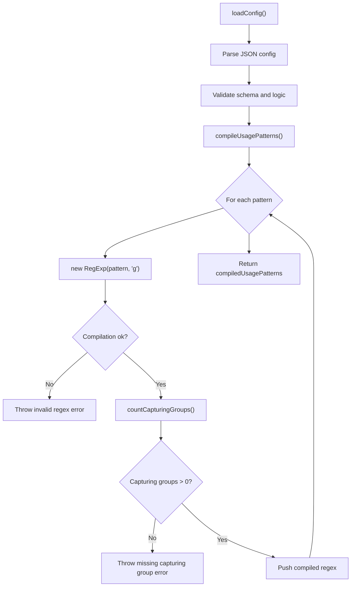
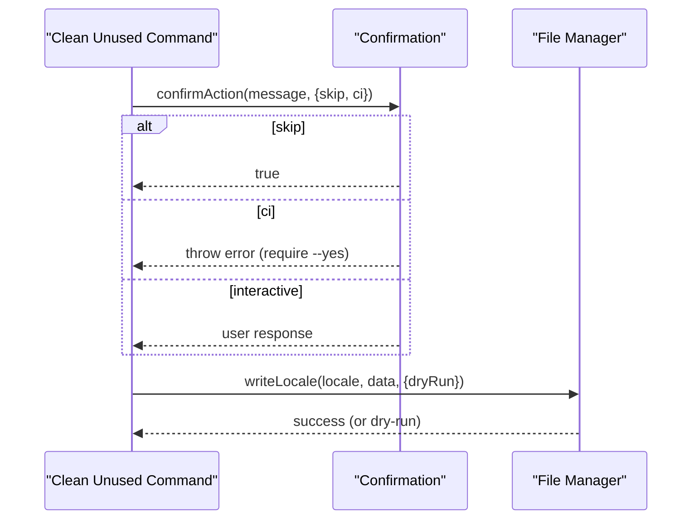
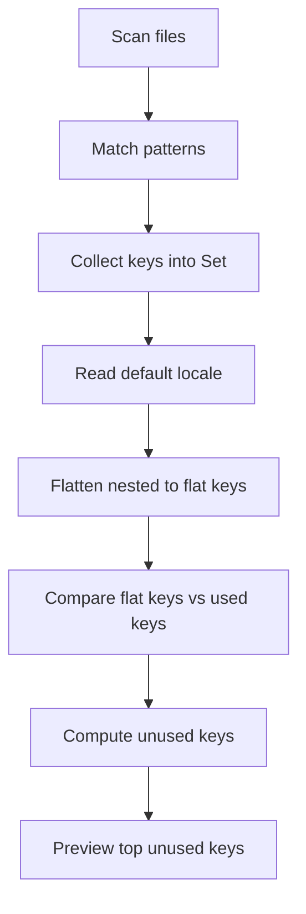
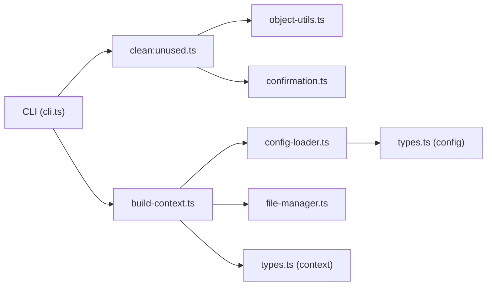

# Maintenance Commands

<cite>
**Referenced Files in This Document**
- [cli.ts](file://src/bin/cli.ts)
- [clean-unused.ts](file://src/commands/clean-unused.ts)
- [clean-unused.test.ts](file://src/commands/clean-unused.test.ts)
- [config-loader.ts](file://src/config/config-loader.ts)
- [types.ts](file://src/config/types.ts)
- [build-context.ts](file://src/context/build-context.ts)
- [types.ts](file://src/context/types.ts)
- [file-manager.ts](file://src/core/file-manager.ts)
- [confirmation.ts](file://src/core/confirmation.ts)
- [object-utils.ts](file://src/core/object-utils.ts)
- [README.md](file://README.md)
- [package.json](file://package.json)
</cite>

## Table of Contents
1. [Introduction](#introduction)
2. [Project Structure](#project-structure)
3. [Core Components](#core-components)
4. [Architecture Overview](#architecture-overview)
5. [Detailed Component Analysis](#detailed-component-analysis)
6. [Dependency Analysis](#dependency-analysis)
7. [Performance Considerations](#performance-considerations)
8. [Troubleshooting Guide](#troubleshooting-guide)
9. [Conclusion](#conclusion)
10. [Appendices](#appendices)

## Introduction
This document focuses on the maintenance commands, specifically the clean:unused command and unused key detection workflow. It explains how the tool scans source code for translation usage, detects unused keys across locales, and safely removes them. It covers the command syntax, dry-run preview, confirmation mechanisms, regex pattern configuration, usage detection algorithms, false-positive prevention, practical examples, error handling, and integration with CI/CD pipelines. It also documents the relationship between maintenance operations and key management commands.

## Project Structure
The maintenance workflow spans several modules:
- CLI entrypoint registers the clean:unused command and global options.
- Command context builds configuration and file manager instances.
- Configuration loader validates and compiles usage patterns.
- The clean:unused command orchestrates scanning, analysis, confirmation, and writes.
- File manager handles locale reads/writes and dry-run behavior.
- Utilities support flattening/unflattening nested structures and confirmation prompts.

**Diagram sources**
- [cli.ts:1-122](file://src/bin/cli.ts#L1-L122)
- [build-context.ts:1-16](file://src/context/build-context.ts#L1-L16)
- [config-loader.ts:1-176](file://src/config/config-loader.ts#L1-L176)
- [file-manager.ts:1-118](file://src/core/file-manager.ts#L1-L118)
- [clean-unused.ts:1-138](file://src/commands/clean-unused.ts#L1-L138)
- [object-utils.ts:1-95](file://src/core/object-utils.ts#L1-L95)
- [confirmation.ts:1-43](file://src/core/confirmation.ts#L1-L43)
- [types.ts:1-12](file://src/config/types.ts#L1-L12)
- [types.ts:1-15](file://src/context/types.ts#L1-L15)

**Section sources**
- [cli.ts:102-111](file://src/bin/cli.ts#L102-L111)
- [build-context.ts:5-16](file://src/context/build-context.ts#L5-L16)
- [config-loader.ts:24-67](file://src/config/config-loader.ts#L24-L67)
- [file-manager.ts:31-61](file://src/core/file-manager.ts#L31-L61)
- [clean-unused.ts:8-138](file://src/commands/clean-unused.ts#L8-L138)
- [object-utils.ts:17-64](file://src/core/object-utils.ts#L17-L64)
- [confirmation.ts:9-42](file://src/core/confirmation.ts#L9-L42)

## Core Components
- clean:unused command: Orchestrates scanning, usage detection, unused key computation, confirmation, and writes.
- Configuration loader: Loads and validates configuration, compiles usage patterns, and ensures logical constraints.
- File manager: Reads/writes locale files, supports dry-run, and maintains sorted output.
- Confirmation utility: Handles interactive prompts, CI mode, and --yes skipping.
- Object utilities: Flatten/unflatten nested structures to align with configured key style.

Key responsibilities:
- Regex-based scanning of source files for translation key usage.
- Comparison of discovered keys against flattened locale keys to compute unused keys.
- Safe removal across all supported locales with dry-run and confirmation safeguards.
- Error handling for missing config, invalid regex, missing locale files, and validation conflicts.

**Section sources**
- [clean-unused.ts:8-138](file://src/commands/clean-unused.ts#L8-L138)
- [config-loader.ts:24-109](file://src/config/config-loader.ts#L24-L109)
- [file-manager.ts:31-61](file://src/core/file-manager.ts#L31-L61)
- [confirmation.ts:9-42](file://src/core/confirmation.ts#L9-L42)
- [object-utils.ts:17-64](file://src/core/object-utils.ts#L17-L64)

## Architecture Overview
The maintenance workflow follows a predictable flow: load configuration, scan source files, compute unused keys, confirm action, and write updated locales.

**Diagram sources**
- [cli.ts:102-111](file://src/bin/cli.ts#L102-L111)
- [build-context.ts:5-16](file://src/context/build-context.ts#L5-L16)
- [config-loader.ts:24-67](file://src/config/config-loader.ts#L24-L67)
- [clean-unused.ts:25-137](file://src/commands/clean-unused.ts#L25-L137)
- [file-manager.ts:31-61](file://src/core/file-manager.ts#L31-L61)
- [confirmation.ts:9-42](file://src/core/confirmation.ts#L9-L42)

## Detailed Component Analysis

### clean:unused Command
The command performs:
- Validation of usage patterns presence.
- Scanning of source files with configurable patterns.
- Building a set of used keys from matched patterns.
- Reading the default locale to flatten and compare against used keys.
- Computing unused keys and previewing them.
- Conditional confirmation and dry-run behavior.
- Iterating over supported locales to remove unused keys and write updated files.

Key behaviors:
- Uses compiled regex patterns to extract keys from source content.
- Supports named and unnamed capturing groups; extracts the key from either group.
- Respects keyStyle for rebuilding locale structures.
- Enforces CI mode and confirmation rules.

**Diagram sources**
- [clean-unused.ts:8-138](file://src/commands/clean-unused.ts#L8-L138)
- [object-utils.ts:17-64](file://src/core/object-utils.ts#L17-L64)
- [file-manager.ts:45-61](file://src/core/file-manager.ts#L45-L61)
- [confirmation.ts:9-42](file://src/core/confirmation.ts#L9-L42)

**Section sources**
- [clean-unused.ts:8-138](file://src/commands/clean-unused.ts#L8-L138)
- [clean-unused.test.ts:62-340](file://src/commands/clean-unused.test.ts#L62-L340)

### Configuration and Regex Pattern Compilation
Configuration loading:
- Validates required fields and logical constraints (defaultLocale in supportedLocales, no duplicates).
- Compiles usagePatterns into RegExp objects.
- Ensures each pattern includes at least one capturing group (named or unnamed) to extract the key.

Regex compilation:
- Attempts to construct a RegExp with global flag for each pattern.
- Counts capturing groups to enforce extraction capability.
- Throws descriptive errors for invalid regex or missing capturing groups.

**Diagram sources**
- [config-loader.ts:24-109](file://src/config/config-loader.ts#L24-L109)
- [types.ts:3-11](file://src/config/types.ts#L3-L11)

**Section sources**
- [config-loader.ts:24-109](file://src/config/config-loader.ts#L24-L109)
- [types.ts:3-11](file://src/config/types.ts#L3-L11)

### Confirmation and Dry-Run Mechanics
- Global options are defined in the CLI and passed through the context.
- Confirmation logic:
  - Skips prompt when --yes is provided.
  - Fails in CI mode without --yes.
  - Uses inquirer in interactive environments; otherwise returns default value.
- Dry-run:
  - Passed to file manager write operations to prevent actual writes.
  - Command logs a clear dry-run notice upon completion.

**Diagram sources**
- [confirmation.ts:9-42](file://src/core/confirmation.ts#L9-L42)
- [file-manager.ts:45-61](file://src/core/file-manager.ts#L45-L61)
- [clean-unused.ts:94-124](file://src/commands/clean-unused.ts#L94-L124)

**Section sources**
- [confirmation.ts:9-42](file://src/core/confirmation.ts#L9-L42)
- [file-manager.ts:45-61](file://src/core/file-manager.ts#L45-L61)
- [clean-unused.ts:94-124](file://src/commands/clean-unused.ts#L94-L124)

### Key Detection and Orphaned Key Identification
- Scanning scope: Searches files under src/**/*.{ts,tsx,js,jsx,html}.
- Extraction: Iterates over compiled regex patterns and collects matched keys.
- Used keys set: Deduplicates across files and patterns.
- Default locale analysis: Reads default locale, flattens nested structure, and compares against used keys.
- Unused keys: Keys present in locale but not in used set.
- Output preview: Shows top unused keys and total count; truncates long lists.

**Diagram sources**
- [clean-unused.ts:25-61](file://src/commands/clean-unused.ts#L25-L61)
- [object-utils.ts:17-39](file://src/core/object-utils.ts#L17-L39)

**Section sources**
- [clean-unused.ts:25-61](file://src/commands/clean-unused.ts#L25-L61)
- [object-utils.ts:17-39](file://src/core/object-utils.ts#L17-L39)

### Practical Examples and Workflows
- Basic cleanup:
  - Command: i18n-pro clean:unused
  - Behavior: Scans, computes unused keys, prompts confirmation, writes updated locales.
- Dry-run preview:
  - Command: i18n-pro clean:unused --dry-run
  - Behavior: Shows what would be removed without modifying files.
- CI integration:
  - Preview: i18n-pro clean:unused --ci --dry-run
  - Apply: i18n-pro clean:unused --ci --yes
- Selective removal:
  - Combine with key management commands (e.g., remove:key) for targeted deletions.
- Structural alignment:
  - Works with both flat and nested key styles; rebuilds locales according to configured keyStyle.

**Section sources**
- [README.md:185-231](file://README.md#L185-L231)
- [clean-unused.ts:126-136](file://src/commands/clean-unused.ts#L126-L136)

## Dependency Analysis
The maintenance command depends on:
- CLI for registering the command and global options.
- Context builder for assembling configuration and file manager.
- Config loader for validating and compiling usage patterns.
- File manager for locale IO and dry-run behavior.
- Confirmation utility for interactive and CI-safe prompts.
- Object utilities for flattening/unflattening nested structures.

**Diagram sources**
- [cli.ts:102-111](file://src/bin/cli.ts#L102-L111)
- [build-context.ts:5-16](file://src/context/build-context.ts#L5-L16)
- [config-loader.ts:24-67](file://src/config/config-loader.ts#L24-L67)
- [file-manager.ts:31-61](file://src/core/file-manager.ts#L31-L61)
- [clean-unused.ts:8-138](file://src/commands/clean-unused.ts#L8-L138)
- [object-utils.ts:17-64](file://src/core/object-utils.ts#L17-L64)
- [confirmation.ts:9-42](file://src/core/confirmation.ts#L9-L42)
- [types.ts:3-11](file://src/config/types.ts#L3-L11)
- [types.ts:11-15](file://src/context/types.ts#L11-L15)

**Section sources**
- [cli.ts:102-111](file://src/bin/cli.ts#L102-L111)
- [build-context.ts:5-16](file://src/context/build-context.ts#L5-L16)
- [config-loader.ts:24-67](file://src/config/config-loader.ts#L24-L67)
- [file-manager.ts:31-61](file://src/core/file-manager.ts#L31-L61)
- [clean-unused.ts:8-138](file://src/commands/clean-unused.ts#L8-L138)
- [object-utils.ts:17-64](file://src/core/object-utils.ts#L17-L64)
- [confirmation.ts:9-42](file://src/core/confirmation.ts#L9-L42)
- [types.ts:3-11](file://src/config/types.ts#L3-L11)
- [types.ts:11-15](file://src/context/types.ts#L11-L15)

## Performance Considerations
- File scanning: The glob pattern targets common frontend files; adjust patterns if your project structure differs.
- Regex matching: Compiled patterns improve performance; ensure patterns are efficient to avoid excessive backtracking.
- Memory usage: Used keys are stored in a Set; large projects may increase memory footprint.
- Locale processing: Reads default locale first to compute unused keys, then iterates supported locales; consider locale count impact.
- Sorting: autoSort is enabled by default; disable if you want to preserve insertion order.

[No sources needed since this section provides general guidance]

## Troubleshooting Guide
Common issues and resolutions:
- Missing configuration file:
  - Symptom: Error indicating configuration file not found.
  - Resolution: Run initialization wizard to create the configuration file.
- Invalid configuration:
  - Symptom: Validation errors for unsupported locales or duplicates.
  - Resolution: Fix defaultLocale inclusion and supportedLocales uniqueness.
- Invalid regex in usagePatterns:
  - Symptom: Error indicating invalid regex or missing capturing group.
  - Resolution: Review pattern syntax and ensure at least one capturing group exists.
- Missing locale files:
  - Symptom: Error stating locale file does not exist.
  - Resolution: Ensure localesPath points to existing locale files or initialize locales.
- Invalid JSON in locale files:
  - Symptom: Error indicating invalid JSON in a locale file.
  - Resolution: Fix malformed JSON in the affected locale file.
- CI mode without --yes:
  - Symptom: Error requiring explicit confirmation via --yes.
  - Resolution: Add --yes to proceed in CI or run with --dry-run to preview changes.
- Dry-run confusion:
  - Symptom: Expecting changes without seeing modifications.
  - Resolution: Verify --dry-run was used; remember it prevents actual writes.

**Section sources**
- [config-loader.ts:27-54](file://src/config/config-loader.ts#L27-L54)
- [config-loader.ts:69-82](file://src/config/config-loader.ts#L69-L82)
- [config-loader.ts:84-109](file://src/config/config-loader.ts#L84-L109)
- [file-manager.ts:34-42](file://src/core/file-manager.ts#L34-L42)
- [file-manager.ts:56-58](file://src/core/file-manager.ts#L56-L58)
- [confirmation.ts:20-25](file://src/core/confirmation.ts#L20-L25)
- [clean-unused.ts:19-23](file://src/commands/clean-unused.ts#L19-L23)

## Conclusion
The clean:unused command provides a robust, configurable, and safe mechanism to identify and remove unused translation keys across locales. By leveraging compiled regex patterns, flattening/unflattening utilities, and confirmation/dry-run safeguards, it integrates seamlessly into development and CI/CD workflows. Proper configuration of usage patterns and key style ensures accurate detection and minimal risk during cleanup operations.

[No sources needed since this section summarizes without analyzing specific files]

## Appendices

### Command Syntax and Options
- Command: i18n-pro clean:unused
- Options:
  - -y, --yes: Skip confirmation prompts.
  - --dry-run: Preview changes without writing files.
  - --ci: Run in CI mode (non-interactive; fails without --yes).
  - -f, --force: Force operation (used by init to overwrite config).

**Section sources**
- [cli.ts:21-28](file://src/bin/cli.ts#L21-L28)
- [README.md:202-212](file://README.md#L202-L212)

### Regex Pattern Configuration
- usagePatterns: Array of regex strings used to detect translation key usage.
- Requirements:
  - Each pattern must include a capturing group (unnamed or named) to extract the key.
  - Patterns are compiled into RegExp objects with global flag.
- Defaults:
  - Detect common usage patterns like t('key'), translate('key'), and i18n.t('key').
- Customization:
  - Define custom patterns to match your framework’s translation APIs or naming conventions.

**Section sources**
- [config-loader.ts:84-109](file://src/config/config-loader.ts#L84-L109)
- [README.md:111-127](file://README.md#L111-L127)

### Relationship Between Maintenance and Key Management Commands
- Maintenance commands focus on bulk cleanup and hygiene:
  - clean:unused identifies and removes unused keys across locales.
- Key management commands enable precise control:
  - add:key adds a key to all locales.
  - update:key modifies a key’s value in one or all locales.
  - remove:key deletes a key from all locales.
- Strategy:
  - Use clean:unused periodically for broad cleanup.
  - Use key management commands for targeted changes and fine-grained control.

**Section sources**
- [cli.ts:66-100](file://src/bin/cli.ts#L66-L100)
- [README.md:185-201](file://README.md#L185-L201)

### Error Handling Reference
- Configuration:
  - Missing config file: Error with guidance to initialize.
  - Schema validation failures: Detailed list of issues.
  - Logical validation: defaultLocale must be in supportedLocales; no duplicates.
  - Regex compilation: Invalid regex or missing capturing group.
- File operations:
  - Locale file existence: Error if missing.
  - JSON parsing: Error if invalid JSON.
- Confirmation and CI:
  - CI mode without --yes: Error requiring explicit confirmation.
  - Dry-run: No writes occur; confirmation skipped.

**Section sources**
- [config-loader.ts:27-54](file://src/config/config-loader.ts#L27-L54)
- [config-loader.ts:69-82](file://src/config/config-loader.ts#L69-L82)
- [config-loader.ts:84-109](file://src/config/config-loader.ts#L84-L109)
- [file-manager.ts:34-42](file://src/core/file-manager.ts#L34-L42)
- [file-manager.ts:56-58](file://src/core/file-manager.ts#L56-L58)
- [confirmation.ts:20-25](file://src/core/confirmation.ts#L20-L25)

### Advanced Scenarios and Best Practices
- Custom usage patterns:
  - Define patterns that match your framework’s translation functions and key naming conventions.
  - Prefer named capturing groups for clarity and future extensibility.
- Exclusion rules:
  - While not built-in, you can refine usagePatterns to avoid false positives (e.g., exclude comments or specific contexts).
- CI/CD integration:
  - Use --ci --dry-run to fail builds when unused keys are detected.
  - Use --ci --yes to automatically apply cleanup in controlled environments.
- Scheduling maintenance:
  - Run clean:unused as part of pre-commit hooks or nightly maintenance jobs.
  - Combine with key management commands for targeted updates.
- Backup strategies:
  - Back up locale files before running cleanup operations.
  - Use --dry-run to preview changes and commit only after review.

**Section sources**
- [README.md:214-231](file://README.md#L214-L231)
- [clean-unused.ts:126-136](file://src/commands/clean-unused.ts#L126-L136)