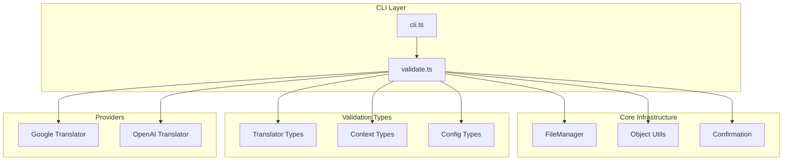
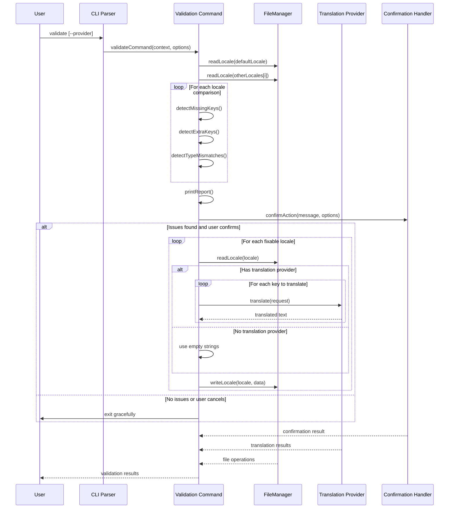
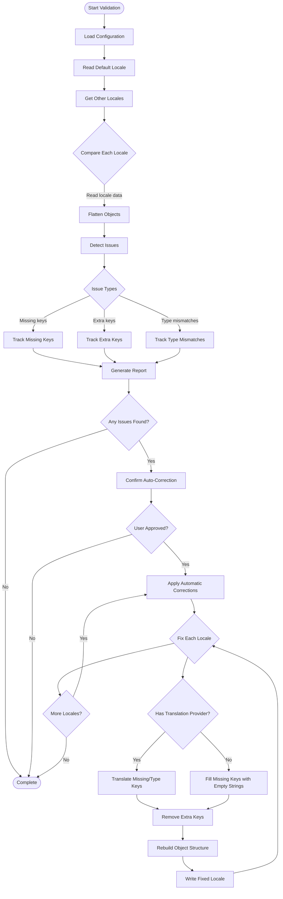
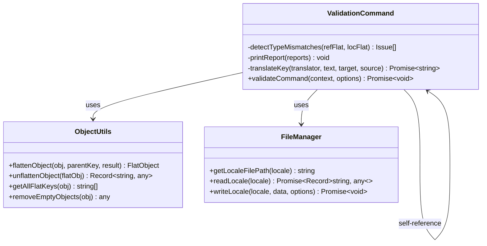
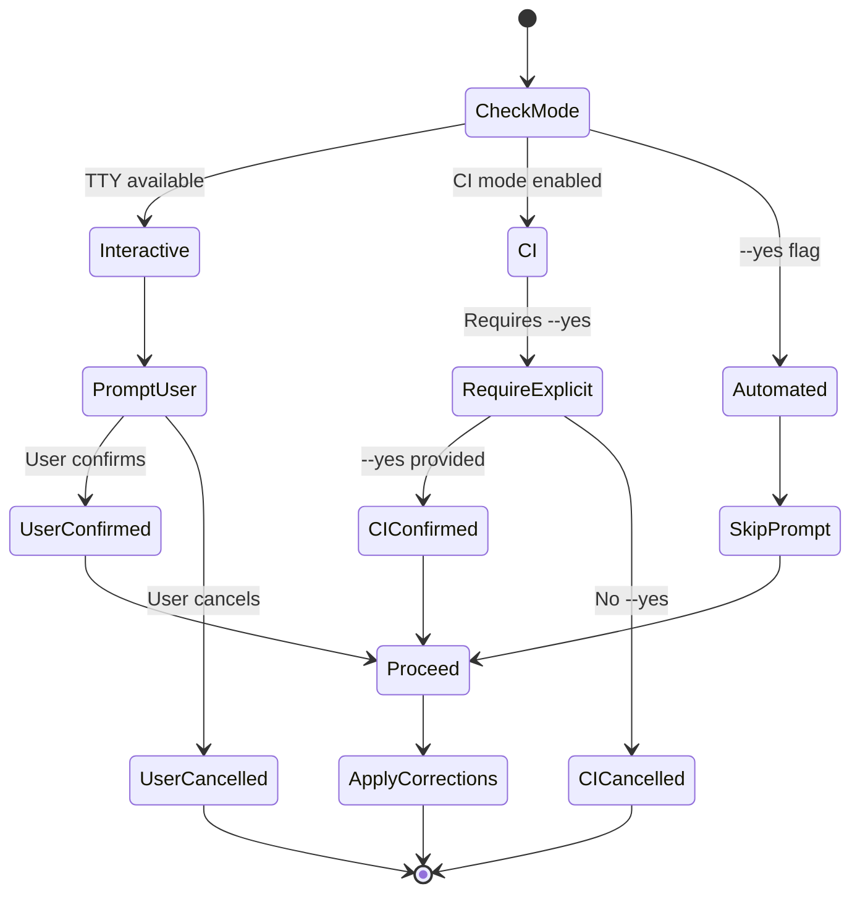
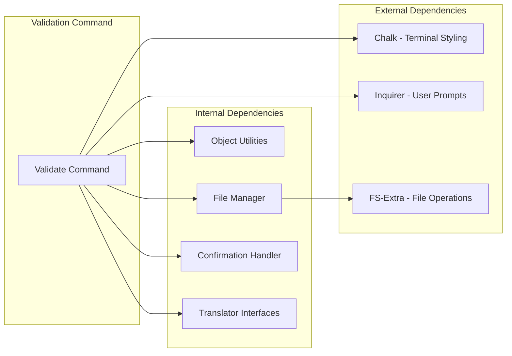

# Validation Command

<cite>
**Referenced Files in This Document**
- [validate.ts](file://src/commands/validate.ts)
- [validate.test.ts](file://src/commands/validate.test.ts)
- [cli.ts](file://src/bin/cli.ts)
- [translator.ts](file://src/providers/translator.ts)
- [object-utils.ts](file://src/core/object-utils.ts)
- [confirmation.ts](file://src/core/confirmation.ts)
- [file-manager.ts](file://src/core/file-manager.ts)
- [types.ts](file://src/context/types.ts)
- [types.ts](file://src/config/types.ts)
- [README.md](file://README.md)
</cite>

## Table of Contents
1. [Introduction](#introduction)
2. [Project Structure](#project-structure)
3. [Core Components](#core-components)
4. [Architecture Overview](#architecture-overview)
5. [Detailed Component Analysis](#detailed-component-analysis)
6. [Dependency Analysis](#dependency-analysis)
7. [Performance Considerations](#performance-considerations)
8. [Troubleshooting Guide](#troubleshooting-guide)
9. [Conclusion](#conclusion)

## Introduction
The Validation Command is a core feature of the i18n-ai-cli that ensures translation files remain consistent across all supported locales. It performs comprehensive validation by comparing each locale against a default reference locale, identifying missing keys, extra keys, and type mismatches. The command provides both reporting capabilities and automatic correction features, with optional AI-powered translation for missing keys.

The validation system operates on two primary key styles: nested (hierarchical object structure) and flat (dot-delimited key paths). It maintains strict structural integrity while providing flexible correction mechanisms that preserve existing translations while filling gaps.

## Project Structure
The validation functionality is organized within the commands module, with supporting infrastructure distributed across several core modules:

**Diagram sources**
- [cli.ts:117-151](file://src/bin/cli.ts#L117-L151)
- [validate.ts:121-253](file://src/commands/validate.ts#L121-L253)

**Section sources**
- [validate.ts:1-254](file://src/commands/validate.ts#L1-L254)
- [cli.ts:117-151](file://src/bin/cli.ts#L117-L151)

## Core Components

### Validation Command Implementation
The validation command serves as the central orchestrator for the entire validation process. It implements a sophisticated two-phase approach: detection and correction.

**Detection Phase**: The command reads the default locale as the reference and compares it against all other supported locales. It identifies three types of issues:
- Missing keys: Present in default locale but absent in target locale
- Extra keys: Present in target locale but not in default locale  
- Type mismatches: Keys with different value types between locales

**Correction Phase**: Based on the presence of a translation provider and user preferences, the command applies automatic corrections:
- Missing keys: Filled with empty strings (no provider) or AI-translated content (with provider)
- Extra keys: Removed from target locale
- Type mismatches: Reset to empty strings or re-translated based on default locale type

**Section sources**
- [validate.ts:121-253](file://src/commands/validate.ts#L121-L253)

### Translation Provider Integration
The validation system supports pluggable translation providers through a unified interface. Currently implemented providers include Google Translate and OpenAI GPT, with DeepL support planned.

The provider selection logic follows a priority order: explicit provider specification, environment-based detection, and fallback to Google Translate. This ensures the system remains functional even without explicit configuration.

**Section sources**
- [cli.ts:129-149](file://src/bin/cli.ts#L129-L149)
- [translator.ts:14-17](file://src/providers/translator.ts#L14-L17)

### File Management Integration
The validation command integrates seamlessly with the FileManager abstraction, which handles all file system operations. This separation ensures that validation logic remains focused on comparison and correction while file operations are handled by dedicated infrastructure.

The FileManager provides robust error handling for missing files, invalid JSON content, and permission issues, ensuring the validation process fails gracefully when encountering filesystem problems.

**Section sources**
- [file-manager.ts:31-61](file://src/core/file-manager.ts#L31-L61)
- [validate.ts:132-134](file://src/commands/validate.ts#L132-L134)

## Architecture Overview

**Diagram sources**
- [validate.ts:121-253](file://src/commands/validate.ts#L121-L253)
- [cli.ts:126-149](file://src/bin/cli.ts#L126-L149)
- [confirmation.ts:9-42](file://src/core/confirmation.ts#L9-L42)

## Detailed Component Analysis

### Validation Logic Flow

**Diagram sources**
- [validate.ts:140-253](file://src/commands/validate.ts#L140-L253)

### Object Flattening and Unflattening

The validation system uses a sophisticated object manipulation approach that works with both nested and flat key structures. The flattening process converts hierarchical objects into dot-delimited key-value pairs, enabling efficient comparison operations.

**Diagram sources**
- [object-utils.ts:17-64](file://src/core/object-utils.ts#L17-L64)
- [validate.ts:11-29](file://src/commands/validate.ts#L11-L29)

**Section sources**
- [object-utils.ts:17-64](file://src/core/object-utils.ts#L17-L64)
- [validate.ts:11-29](file://src/commands/validate.ts#L11-L29)

### Type Mismatch Detection

The type mismatch detection algorithm performs deep comparison between reference and target locales, focusing specifically on value type consistency. This ensures that translations maintain structural integrity across all supported languages.

The detection mechanism compares the `typeof` value for each key, identifying cases where the default locale defines a string while another locale contains a number, boolean, or object. This prevents runtime errors in applications that expect consistent data types.

**Section sources**
- [validate.ts:11-29](file://src/commands/validate.ts#L11-L29)

### Confirmation and CI Integration

The validation command implements sophisticated user interaction handling that adapts to different environments. The confirmation system supports interactive prompts, non-interactive CI mode, and automated operation modes.

**Diagram sources**
- [confirmation.ts:9-42](file://src/core/confirmation.ts#L9-L42)
- [validate.ts:172-185](file://src/commands/validate.ts#L172-L185)

**Section sources**
- [confirmation.ts:9-42](file://src/core/confirmation.ts#L9-L42)
- [validate.ts:172-185](file://src/commands/validate.ts#L172-L185)

## Dependency Analysis

The validation command maintains loose coupling with its dependencies while providing comprehensive functionality through well-defined interfaces.

**Diagram sources**
- [validate.ts:1-10](file://src/commands/validate.ts#L1-L10)
- [file-manager.ts:1-3](file://src/core/file-manager.ts#L1-L3)

**Section sources**
- [validate.ts:1-10](file://src/commands/validate.ts#L1-L10)
- [file-manager.ts:1-3](file://src/core/file-manager.ts#L1-L3)

## Performance Considerations

The validation command is designed for efficiency with several optimization strategies:

### Memory Efficiency
- Uses streaming object flattening to avoid creating unnecessary intermediate copies
- Processes locales sequentially rather than loading all files simultaneously
- Implements early termination when no issues are found

### Network Optimization
- Batches translation requests for multiple missing keys within a single locale
- Respects provider rate limits through sequential processing
- Minimizes API calls by combining related operations

### File System Optimization
- Leverages FileManager's built-in caching for frequently accessed files
- Performs minimal file operations by rebuilding only changed locales
- Uses atomic write operations to prevent partial file corruption

## Troubleshooting Guide

### Common Validation Issues

**Missing Translation Provider**
If no translation provider is configured, the validation command will still function but will fill missing keys with empty strings rather than attempting AI translation. This is the intended behavior for environments without API access.

**CI/CD Pipeline Failures**
The validation command is designed to fail in CI environments when issues are detected but no correction is applied. Use the `--yes` flag to enable automatic corrections in CI pipelines.

**Permission Errors**
File permission issues during validation typically indicate insufficient write permissions to the locales directory. Ensure the executing user has write access to the configured locales path.

**Large Translation Files**
For very large translation files, consider using the `--dry-run` option to preview changes before applying them. This helps identify potential performance impacts before committing to modifications.

**Section sources**
- [validate.ts:172-176](file://src/commands/validate.ts#L172-L176)
- [validate.ts:242-252](file://src/commands/validate.ts#L242-L252)

### Debugging Validation Results

The validation command provides detailed reporting that includes:
- Issue counts per locale
- Specific key names for missing and extra keys
- Type mismatch details with expected vs actual types
- Summary statistics across all locales

Use the verbose output to identify patterns in translation inconsistencies and address root causes systematically.

## Conclusion

The Validation Command represents a comprehensive solution for maintaining translation file consistency across internationalized applications. Its dual-phase approach ensures both awareness and remediation of translation issues, while the pluggable architecture supports various translation providers and operational environments.

The command's design emphasizes reliability, flexibility, and developer experience through thoughtful error handling, CI-friendly behavior, and extensive testing coverage. By integrating seamlessly with the broader i18n-ai-cli ecosystem, it provides a complete solution for translation file management and maintenance.

Key strengths of the implementation include:
- Comprehensive issue detection covering missing, extra, and type mismatch scenarios
- Flexible correction mechanisms with optional AI-powered translation
- Robust CI/CD support with non-interactive operation modes
- Strong type safety and error handling throughout the validation pipeline
- Extensive test coverage validating both positive and negative scenarios

The validation command serves as a foundation for maintaining high-quality internationalization across diverse development environments and project scales.