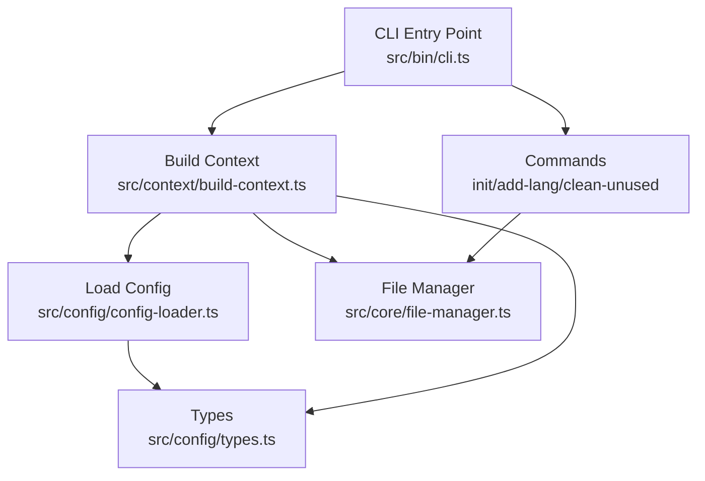
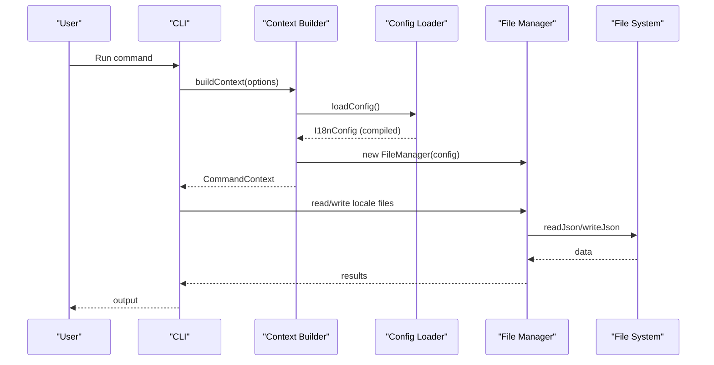
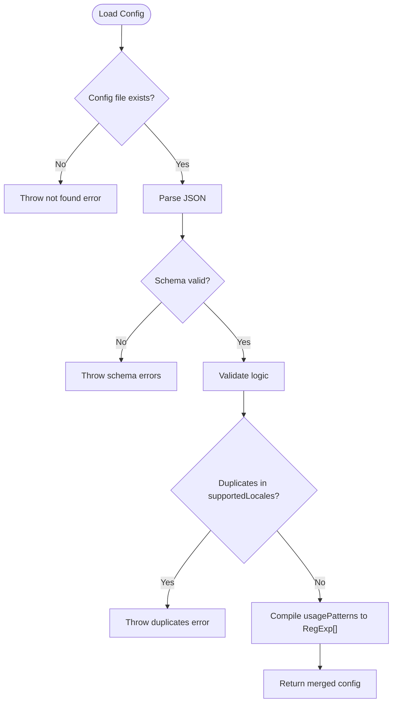
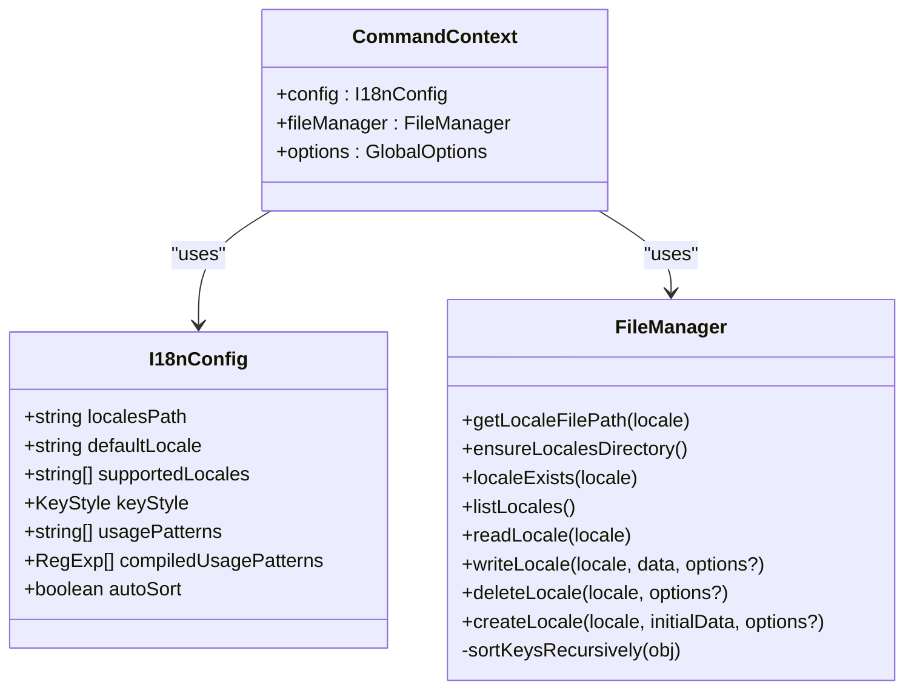
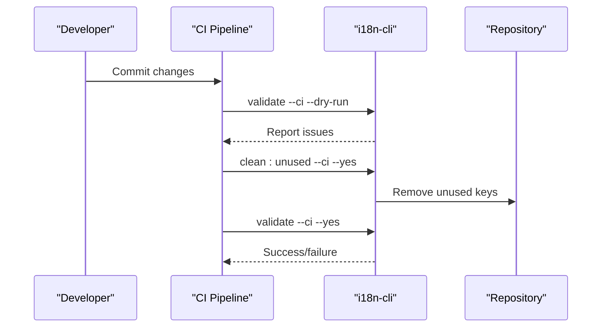
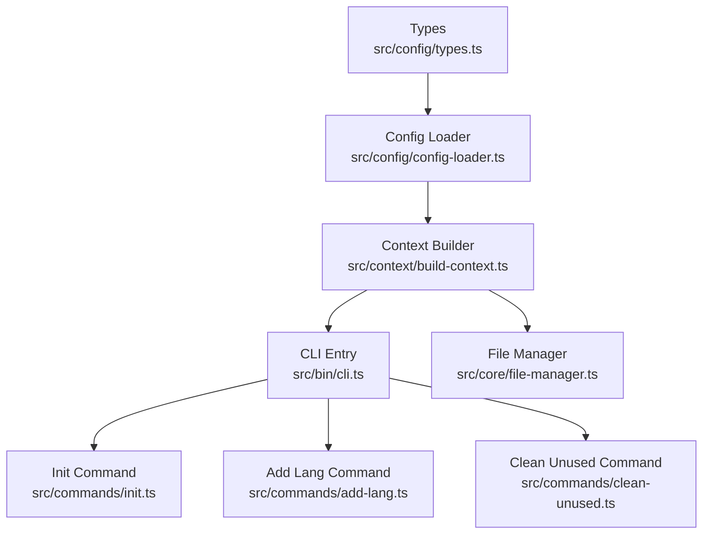

# Configuration Best Practices

<cite>
**Referenced Files in This Document**
- [README.md](file://README.md)
- [package.json](file://package.json)
- [src/bin/cli.ts](file://src/bin/cli.ts)
- [src/config/config-loader.ts](file://src/config/config-loader.ts)
- [src/config/types.ts](file://src/config/types.ts)
- [src/context/build-context.ts](file://src/context/build-context.ts)
- [src/context/types.ts](file://src/context/types.ts)
- [src/core/file-manager.ts](file://src/core/file-manager.ts)
- [src/commands/init.ts](file://src/commands/init.ts)
- [src/commands/add-lang.ts](file://src/commands/add-lang.ts)
- [src/commands/clean-unused.ts](file://src/commands/clean-unused.ts)
- [unit-testing/config/config-loader.test.ts](file://unit-testing/config/config-loader.test.ts)
- [unit-testing/commands/clean-unused.test.ts](file://unit-testing/commands/clean-unused.test.ts)
</cite>

## Table of Contents
1. [Introduction](#introduction)
2. [Project Structure](#project-structure)
3. [Core Components](#core-components)
4. [Architecture Overview](#architecture-overview)
5. [Detailed Component Analysis](#detailed-component-analysis)
6. [Dependency Analysis](#dependency-analysis)
7. [Performance Considerations](#performance-considerations)
8. [Security Implications](#security-implications)
9. [Maintenance Best Practices](#maintenance-best-practices)
10. [Migration Strategies](#migration-strategies)
11. [Templates and Examples](#templates-and-examples)
12. [Troubleshooting Guide](#troubleshooting-guide)
13. [Conclusion](#conclusion)

## Introduction
This document provides configuration best practices for i18n-cli across different project types. It covers optimal configuration strategies for monorepos, microservices, and traditional applications, along with locale organization patterns, key naming conventions, file structure recommendations, environment-specific configuration, CI/CD integration patterns, migration strategies, performance considerations, security implications, and maintenance best practices. Practical templates and examples are included for common configuration scenarios.

## Project Structure
The configuration system centers around a single JSON configuration file and a small set of runtime components that consume it. The CLI loads the configuration, builds a command context, and executes commands against locale files.

**Diagram sources**
- [src/bin/cli.ts:1-209](file://src/bin/cli.ts#L1-L209)
- [src/context/build-context.ts:1-16](file://src/context/build-context.ts#L1-L16)
- [src/config/config-loader.ts:1-176](file://src/config/config-loader.ts#L1-L176)
- [src/core/file-manager.ts:1-118](file://src/core/file-manager.ts#L1-L118)
- [src/config/types.ts:1-12](file://src/config/types.ts#L1-L12)

**Section sources**
- [README.md:54-84](file://README.md#L54-L84)
- [src/bin/cli.ts:1-209](file://src/bin/cli.ts#L1-L209)
- [src/context/build-context.ts:1-16](file://src/context/build-context.ts#L1-L16)
- [src/config/config-loader.ts:1-176](file://src/config/config-loader.ts#L1-L176)
- [src/core/file-manager.ts:1-118](file://src/core/file-manager.ts#L1-L118)

## Core Components
- Configuration loader validates and compiles the configuration, including usage patterns into regex arrays.
- Context builder injects configuration and file manager into commands.
- File manager reads/writes locale files and applies sorting based on configuration.
- Commands use the context to perform operations like initializing configuration, adding languages, and cleaning unused keys.

Key configuration fields and defaults:
- localesPath: Directory containing translation files.
- defaultLocale: Default/source language code.
- supportedLocales: List of supported language codes.
- keyStyle: "flat" or "nested" (default: "nested").
- usagePatterns: Regex patterns to detect key usage (default: empty).
- autoSort: Auto-sort keys alphabetically (default: true).

**Section sources**
- [src/config/types.ts:1-12](file://src/config/types.ts#L1-L12)
- [src/config/config-loader.ts:8-176](file://src/config/config-loader.ts#L8-L176)
- [src/context/build-context.ts:1-16](file://src/context/build-context.ts#L1-L16)
- [src/core/file-manager.ts:1-118](file://src/core/file-manager.ts#L1-L118)
- [README.md:76-84](file://README.md#L76-L84)

## Architecture Overview
The configuration drives command execution through a shared context. Commands rely on validated configuration and compiled usage patterns to operate safely and predictably.

**Diagram sources**
- [src/bin/cli.ts:1-209](file://src/bin/cli.ts#L1-L209)
- [src/context/build-context.ts:1-16](file://src/context/build-context.ts#L1-L16)
- [src/config/config-loader.ts:1-176](file://src/config/config-loader.ts#L1-L176)
- [src/core/file-manager.ts:1-118](file://src/core/file-manager.ts#L1-L118)

## Detailed Component Analysis

### Configuration Loading and Validation
The configuration loader enforces:
- Presence of required fields.
- Logical consistency (default locale must be supported).
- Unique supported locales.
- Valid regex compilation for usage patterns with capturing groups.

**Diagram sources**
- [src/config/config-loader.ts:24-82](file://src/config/config-loader.ts#L24-L82)
- [src/config/config-loader.ts:84-109](file://src/config/config-loader.ts#L84-L109)

**Section sources**
- [src/config/config-loader.ts:24-82](file://src/config/config-loader.ts#L24-L82)
- [src/config/config-loader.ts:84-109](file://src/config/config-loader.ts#L84-L109)
- [unit-testing/config/config-loader.test.ts:28-172](file://unit-testing/config/config-loader.test.ts#L28-L172)

### Context Building and Command Execution
Commands receive a context containing configuration, file manager, and global options. The context ensures consistent behavior across commands and enables dry-run, CI, and force modes.

**Diagram sources**
- [src/context/types.ts:1-15](file://src/context/types.ts#L1-L15)
- [src/config/types.ts:1-12](file://src/config/types.ts#L1-L12)
- [src/core/file-manager.ts:1-118](file://src/core/file-manager.ts#L1-L118)

**Section sources**
- [src/context/build-context.ts:1-16](file://src/context/build-context.ts#L1-L16)
- [src/context/types.ts:1-15](file://src/context/types.ts#L1-L15)
- [src/core/file-manager.ts:1-118](file://src/core/file-manager.ts#L1-L118)

### Locale Organization Patterns
- Monorepo: Use a dedicated locales directory per package or a shared workspace-level directory. Configure localesPath accordingly and maintain separate supportedLocales per package.
- Microservices: Keep a localesPath inside each service with its own defaultLocale and supportedLocales aligned to the service domain.
- Traditional applications: Centralize localesPath at the project root with a single defaultLocale and consolidated supportedLocales.

Key recommendations:
- Align localesPath with your framework's conventions (e.g., assets, i18n, locales).
- Keep defaultLocale consistent with your source language.
- Maintain supportedLocales as a single source of truth for enabled locales.

**Section sources**
- [README.md:56-74](file://README.md#L56-L74)
- [src/config/config-loader.ts:8-176](file://src/config/config-loader.ts#L8-L176)

### Key Naming Conventions
- Prefer dot notation for hierarchical keys (e.g., auth.login.title) to leverage nested keyStyle.
- Use lowercase with dots to improve readability and consistency.
- Avoid spaces and special characters in keys; stick to alphanumeric, dots, and underscores as needed.

Behavioral note:
- The system supports both flat and nested styles; nested preserves hierarchy in output files.

**Section sources**
- [README.md:76-84](file://README.md#L76-L84)
- [src/core/file-manager.ts:100-115](file://src/core/file-manager.ts#L100-L115)

### File Structure Recommendations
- Place the configuration file at the project root.
- Organize locale files by language code (e.g., en.json, es.json).
- Keep locale files sorted and normalized; enable autoSort to maintain consistency.

**Section sources**
- [src/commands/init.ts:210-239](file://src/commands/init.ts#L210-L239)
- [src/core/file-manager.ts:45-61](file://src/core/file-manager.ts#L45-L61)

### Environment-Specific Configuration Approaches
- Use environment variables for provider selection (e.g., OPENAI_API_KEY) rather than embedding secrets in configuration.
- For CI environments, pass flags to enforce non-interactive behavior and deterministic outcomes.

**Section sources**
- [README.md:258-267](file://README.md#L258-L267)
- [src/bin/cli.ts:94-98](file://src/bin/cli.ts#L94-L98)

### CI/CD Integration Patterns
- Use --ci and --dry-run to validate changes without applying them.
- Use --yes to bypass interactive prompts in automated pipelines.
- Integrate commands in stages: validate, clean unused, then apply changes with --yes.

**Diagram sources**
- [README.md:258-267](file://README.md#L258-L267)
- [src/bin/cli.ts:164-198](file://src/bin/cli.ts#L164-L198)

**Section sources**
- [README.md:258-267](file://README.md#L258-L267)
- [src/commands/clean-unused.ts:1-138](file://src/commands/clean-unused.ts#L1-L138)

### Migration Strategies
- Backward compatibility: If adding new fields, ensure defaults are applied during loadConfig.
- Breaking changes: Introduce new fields with sensible defaults and update validation to guide users.
- Usage pattern migrations: Update usagePatterns gradually and re-validate with --ci to prevent regressions.

**Section sources**
- [src/config/config-loader.ts:8-176](file://src/config/config-loader.ts#L8-L176)
- [unit-testing/config/config-loader.test.ts:112-156](file://unit-testing/config/config-loader.test.ts#L112-L156)

### Templates and Examples
Common configuration scenarios:

- Minimal configuration for a single-language project:
  - localesPath: "./locales"
  - defaultLocale: "en"
  - supportedLocales: ["en"]

- Multi-language project with nested keys:
  - localesPath: "./locales"
  - defaultLocale: "en"
  - supportedLocales: ["en", "es", "fr", "de"]
  - keyStyle: "nested"
  - autoSort: true

- Custom usage patterns for framework-specific helpers:
  - usagePatterns: ["t\\(['\"](?<key>.*?)['\"]\\)", "translate\\(['\"](?<key>.*?)['\"]\\)"]

- Monorepo with per-package locales:
  - Package A: localesPath: "./packages/a/i18n"
  - Package B: localesPath: "./packages/b/i18n"

- Microservice with isolated locales:
  - localesPath: "./locales"
  - defaultLocale: "en"
  - supportedLocales: ["en", "fr"]

- CI/CD pipeline steps:
  - validate --ci --dry-run
  - clean:unused --ci --yes
  - validate --ci --yes

**Section sources**
- [README.md:61-74](file://README.md#L61-L74)
- [README.md:258-267](file://README.md#L258-L267)
- [src/commands/init.ts:19-23](file://src/commands/init.ts#L19-L23)

## Dependency Analysis
The configuration influences several subsystems. The following diagram highlights key dependencies.

**Diagram sources**
- [src/config/types.ts:1-12](file://src/config/types.ts#L1-L12)
- [src/config/config-loader.ts:1-176](file://src/config/config-loader.ts#L1-L176)
- [src/context/build-context.ts:1-16](file://src/context/build-context.ts#L1-L16)
- [src/bin/cli.ts:1-209](file://src/bin/cli.ts#L1-L209)
- [src/core/file-manager.ts:1-118](file://src/core/file-manager.ts#L1-L118)
- [src/commands/init.ts:1-239](file://src/commands/init.ts#L1-L239)
- [src/commands/add-lang.ts:1-98](file://src/commands/add-lang.ts#L1-L98)
- [src/commands/clean-unused.ts:1-138](file://src/commands/clean-unused.ts#L1-L138)

**Section sources**
- [src/config/types.ts:1-12](file://src/config/types.ts#L1-L12)
- [src/config/config-loader.ts:1-176](file://src/config/config-loader.ts#L1-L176)
- [src/context/build-context.ts:1-16](file://src/context/build-context.ts#L1-L16)
- [src/bin/cli.ts:1-209](file://src/bin/cli.ts#L1-L209)
- [src/core/file-manager.ts:1-118](file://src/core/file-manager.ts#L1-L118)
- [src/commands/init.ts:1-239](file://src/commands/init.ts#L1-L239)
- [src/commands/add-lang.ts:1-98](file://src/commands/add-lang.ts#L1-L98)
- [src/commands/clean-unused.ts:1-138](file://src/commands/clean-unused.ts#L1-L138)

## Performance Considerations
- Usage pattern compilation: Keep usagePatterns minimal and precise to reduce regex overhead during scans.
- File I/O: Batch writes via FileManager to minimize disk operations; leverage autoSort to avoid repeated re-sorting.
- Scanning scope: Limit glob patterns to relevant source directories to reduce I/O and scanning time.

[No sources needed since this section provides general guidance]

## Security Implications
- Avoid committing secrets to configuration files; use environment variables for provider credentials.
- Restrict file permissions on configuration and locale files to prevent unauthorized modifications.
- Validate and sanitize usagePatterns to avoid injection risks in regex evaluation.

**Section sources**
- [README.md:283-304](file://README.md#L283-L304)
- [src/config/config-loader.ts:84-109](file://src/config/config-loader.ts#L84-L109)

## Maintenance Best Practices
- Regularly validate configuration with validate --ci to catch inconsistencies early.
- Keep supportedLocales synchronized with actual locale files to avoid orphan entries.
- Use --dry-run before applying destructive operations like clean:unused.
- Document and review usagePatterns periodically to reflect framework changes.

**Section sources**
- [README.md:188-218](file://README.md#L188-L218)
- [src/commands/clean-unused.ts:1-138](file://src/commands/clean-unused.ts#L1-L138)

## Migration Strategies
- Gradual adoption: Introduce new configuration fields with defaults; update validation messages to guide users.
- Schema evolution: Maintain backward compatibility by providing sensible defaults and clear migration notes.
- Usage pattern updates: Test new patterns with --ci and --dry-run to ensure correctness before rollout.

**Section sources**
- [src/config/config-loader.ts:8-176](file://src/config/config-loader.ts#L8-L176)
- [unit-testing/config/config-loader.test.ts:112-156](file://unit-testing/config/config-loader.test.ts#L112-L156)

## Templates and Examples
- Example configuration:
  - See [README.md:61-74](file://README.md#L61-L74)
- CI/CD examples:
  - See [README.md:258-267](file://README.md#L258-L267)
- Default usage patterns:
  - See [src/commands/init.ts:19-23](file://src/commands/init.ts#L19-L23)

**Section sources**
- [README.md:61-74](file://README.md#L61-L74)
- [README.md:258-267](file://README.md#L258-L267)
- [src/commands/init.ts:19-23](file://src/commands/init.ts#L19-L23)

## Troubleshooting Guide
Common configuration issues and resolutions:
- Configuration file not found: Ensure the configuration file exists at the project root and is valid JSON.
- Invalid configuration schema: Review required fields and types; fix typos or incorrect data types.
- Logic validation failures: Verify defaultLocale is included in supportedLocales and there are no duplicate locales.
- Invalid usagePatterns: Ensure patterns include a capturing group and are valid regular expressions.
- CI mode errors: Use --yes to bypass interactive prompts in CI environments.

**Section sources**
- [src/config/config-loader.ts:24-82](file://src/config/config-loader.ts#L24-L82)
- [src/config/config-loader.ts:84-109](file://src/config/config-loader.ts#L84-L109)
- [unit-testing/config/config-loader.test.ts:28-86](file://unit-testing/config/config-loader.test.ts#L28-L86)
- [src/commands/clean-unused.ts:19-23](file://src/commands/clean-unused.ts#L19-L23)

## Conclusion
Effective configuration management in i18n-cli hinges on clear locale organization, consistent key naming, precise usage patterns, and disciplined CI/CD practices. By following the strategies and templates outlined here, teams can maintain reliable, scalable internationalization workflows across monorepos, microservices, and traditional applications.