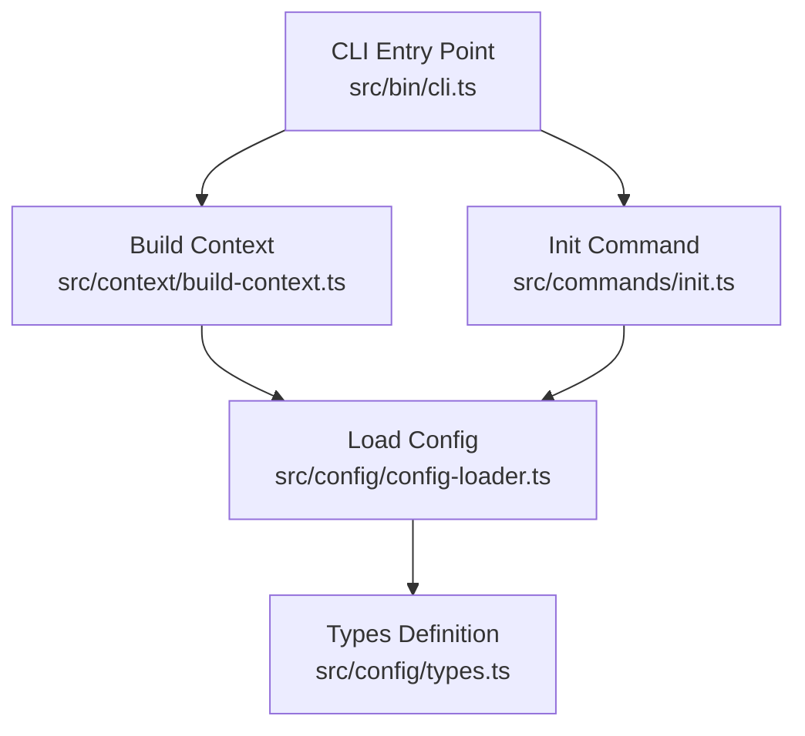
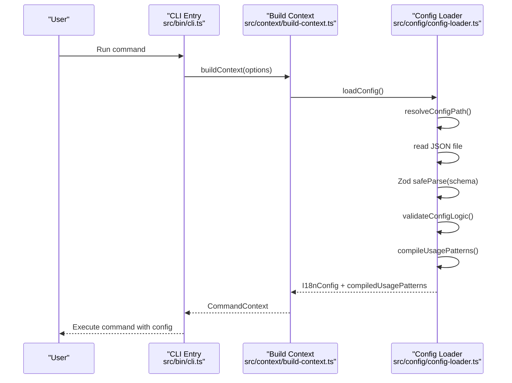
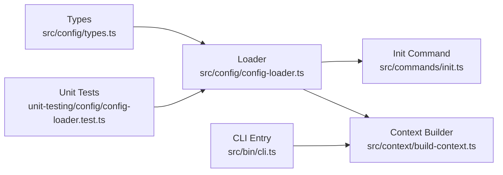

# Configuration File Structure

<cite>
**Referenced Files in This Document**
- [types.ts](file://src/config/types.ts)
- [config-loader.ts](file://src/config/config-loader.ts)
- [init.ts](file://src/commands/init.ts)
- [build-context.ts](file://src/context/build-context.ts)
- [cli.ts](file://src/bin/cli.ts)
- [config-loader.test.ts](file://unit-testing/config/config-loader.test.ts)
- [README.md](file://README.md)
</cite>

## Table of Contents
1. [Introduction](#introduction)
2. [Project Structure](#project-structure)
3. [Core Components](#core-components)
4. [Architecture Overview](#architecture-overview)
5. [Detailed Component Analysis](#detailed-component-analysis)
6. [Dependency Analysis](#dependency-analysis)
7. [Performance Considerations](#performance-considerations)
8. [Troubleshooting Guide](#troubleshooting-guide)
9. [Conclusion](#conclusion)

## Introduction
This document explains the complete JSON schema for the i18n-cli configuration file, including all required and optional properties, their validation rules, acceptable values, and practical examples. It also documents the configuration file location, naming convention, loading mechanism, and how the tool resolves missing values.

## Project Structure
The configuration system is centered around a single JSON file named `i18n-cli.config.json`. The CLI loads this file at runtime, validates it against a strict schema, and injects it into the application context for all commands.

**Diagram sources**
- [cli.ts:1-209](file://src/bin/cli.ts#L1-L209)
- [build-context.ts:1-16](file://src/context/build-context.ts#L1-L16)
- [config-loader.ts:1-176](file://src/config/config-loader.ts#L1-L176)
- [types.ts:1-12](file://src/config/types.ts#L1-L12)
- [init.ts:1-239](file://src/commands/init.ts#L1-L239)

**Section sources**
- [cli.ts:1-209](file://src/bin/cli.ts#L1-L209)
- [build-context.ts:1-16](file://src/context/build-context.ts#L1-L16)
- [config-loader.ts:1-176](file://src/config/config-loader.ts#L1-L176)
- [types.ts:1-12](file://src/config/types.ts#L1-L12)
- [init.ts:1-239](file://src/commands/init.ts#L1-L239)

## Core Components
The configuration file is a JSON object with the following properties:

- localesPath (string, required)
  - Purpose: Path to the directory containing translation files.
  - Validation: Must be a non-empty string.
  - Example: "./locales"

- defaultLocale (string, required)
  - Purpose: The default/source language code used for new keys and as the base for translations.
  - Validation: Must be at least two characters long.
  - Example: "en"

- supportedLocales (array of strings, required)
  - Purpose: List of supported language codes.
  - Validation: Each element must be at least two characters long; duplicates are not allowed; must include defaultLocale.
  - Example: ["en", "es", "fr"]

- keyStyle (enum: "flat" | "nested", optional)
  - Purpose: Determines how translation keys are structured.
  - Defaults to "nested".
  - Example: "nested"

- usagePatterns (array of strings, optional)
  - Purpose: Regular expression patterns used to detect translation key usage in source code.
  - Defaults to an empty array.
  - Validation: Each pattern must compile to a valid regex and include at least one capturing group (standard or named).
  - Example: ["t\\(['\"](?<key>.*?)['\"]\\)"]

- autoSort (boolean, optional)
  - Purpose: Whether to automatically sort keys alphabetically when writing translation files.
  - Defaults to true.
  - Example: true

Additionally, the loader adds a computed property during runtime:
- compiledUsagePatterns (array of RegExp, internal)
  - Purpose: Compiled regex objects derived from usagePatterns for efficient matching.
  - Not part of the JSON schema; added by the loader.

**Section sources**
- [types.ts:1-12](file://src/config/types.ts#L1-L12)
- [config-loader.ts:8-15](file://src/config/config-loader.ts#L8-L15)
- [config-loader.ts:84-109](file://src/config/config-loader.ts#L84-L109)
- [config-loader.ts:63-66](file://src/config/config-loader.ts#L63-L66)

## Architecture Overview
The configuration loading pipeline follows a deterministic flow: the CLI invokes the context builder, which loads the configuration file, validates it, compiles usage patterns, and injects it into the command execution context.

**Diagram sources**
- [cli.ts:1-209](file://src/bin/cli.ts#L1-L209)
- [build-context.ts:1-16](file://src/context/build-context.ts#L1-L16)
- [config-loader.ts:19-67](file://src/config/config-loader.ts#L19-L67)

## Detailed Component Analysis

### Configuration File Location and Naming
- File name: i18n-cli.config.json
- Location: Project root (resolved from current working directory)
- Loading mechanism:
  - The loader resolves the absolute path by joining the current working directory with the file name.
  - If the file does not exist, an error is thrown instructing to run the initialization command.
  - If the file contains invalid JSON, parsing fails with a clear error message.

**Section sources**
- [config-loader.ts:6](file://src/config/config-loader.ts#L6)
- [config-loader.ts:19-32](file://src/config/config-loader.ts#L19-L32)
- [config-loader.ts:34-42](file://src/config/config-loader.ts#L34-L42)

### Schema Validation Rules
- Required properties:
  - localesPath: string, min length 1
  - defaultLocale: string, min length 2
  - supportedLocales: array of strings, each min length 2
- Optional properties with defaults:
  - keyStyle: enum "flat" | "nested", default "nested"
  - usagePatterns: array of strings, default []
  - autoSort: boolean, default true
- Logical validations:
  - defaultLocale must be present in supportedLocales
  - supportedLocales must not contain duplicates

**Section sources**
- [config-loader.ts:8-15](file://src/config/config-loader.ts#L8-L15)
- [config-loader.ts:69-82](file://src/config/config-loader.ts#L69-L82)

### Usage Patterns Compilation
- Purpose: Convert usagePatterns into compiled RegExp objects for efficient matching.
- Behavior:
  - Empty array yields an empty compiled array.
  - Each pattern is compiled with global flag.
  - Each pattern must include at least one capturing group (standard or named).
  - Invalid regex or missing capturing groups cause errors with specific messages.

**Section sources**
- [config-loader.ts:84-109](file://src/config/config-loader.ts#L84-L109)
- [config-loader.ts:111-161](file://src/config/config-loader.ts#L111-L161)

### Initialization Command Integration
- The init command generates a configuration file with sensible defaults and writes it to the project root.
- It supports interactive prompts and non-interactive modes (CI/dry-run).
- It validates usage patterns before writing the file.

**Section sources**
- [init.ts:19-182](file://src/commands/init.ts#L19-L182)
- [init.ts:19-23](file://src/commands/init.ts#L19-L23)

### Context Injection
- The context builder loads the configuration and passes it to all commands.
- Commands rely on the presence of localesPath, defaultLocale, supportedLocales, keyStyle, usagePatterns, and autoSort.

**Section sources**
- [build-context.ts:5-16](file://src/context/build-context.ts#L5-L16)

### Practical Configuration Examples
Below are complete configuration files for different project types and use cases. Replace the values with your project’s specifics.

- Basic React/Vite project with nested keys and default usage patterns:
  - localesPath: "./locales"
  - defaultLocale: "en"
  - supportedLocales: ["en", "es", "fr"]
  - keyStyle: "nested"
  - usagePatterns: ["t\\(['\"](?<key>.*?)['\"]\\)", "translate\\(['\"](?<key>.*?)['\"]\\)"]
  - autoSort: true

- Monorepo with flat keys and custom patterns:
  - localesPath: "./packages/my-app/locales"
  - defaultLocale: "en"
  - supportedLocales: ["en", "de", "ja"]
  - keyStyle: "flat"
  - usagePatterns: ["i18n\\.t\\(['\"](?<key>.*?)['\"]\\)"]
  - autoSort: true

- Minimal setup with no usage patterns:
  - localesPath: "./i18n"
  - defaultLocale: "en"
  - supportedLocales: ["en", "it"]
  - keyStyle: "nested"
  - usagePatterns: []
  - autoSort: true

Notes:
- Ensure supportedLocales includes defaultLocale.
- usagePatterns must include capturing groups; otherwise, the loader throws an error.
- If you omit optional properties, the loader applies defaults as documented.

**Section sources**
- [README.md:61-74](file://README.md#L61-L74)
- [config-loader.ts:12-14](file://src/config/config-loader.ts#L12-L14)
- [config-loader.ts:13-13](file://src/config/config-loader.ts#L13-L13)
- [config-loader.ts:14-14](file://src/config/config-loader.ts#L14-L14)

## Dependency Analysis
The configuration system has minimal external dependencies and clear boundaries:

**Diagram sources**
- [types.ts:1-12](file://src/config/types.ts#L1-L12)
- [config-loader.ts:1-176](file://src/config/config-loader.ts#L1-L176)
- [init.ts:1-239](file://src/commands/init.ts#L1-L239)
- [build-context.ts:1-16](file://src/context/build-context.ts#L1-L16)
- [cli.ts:1-209](file://src/bin/cli.ts#L1-L209)
- [config-loader.test.ts:1-261](file://unit-testing/config/config-loader.test.ts#L1-L261)

**Section sources**
- [types.ts:1-12](file://src/config/types.ts#L1-L12)
- [config-loader.ts:1-176](file://src/config/config-loader.ts#L1-L176)
- [init.ts:1-239](file://src/commands/init.ts#L1-L239)
- [build-context.ts:1-16](file://src/context/build-context.ts#L1-L16)
- [cli.ts:1-209](file://src/bin/cli.ts#L1-L209)
- [config-loader.test.ts:1-261](file://unit-testing/config/config-loader.test.ts#L1-L261)

## Performance Considerations
- Compiled usage patterns: Converting patterns to RegExp objects avoids repeated compilation overhead during scanning operations.
- Default arrays: Empty arrays for usagePatterns and usagePatterns are handled efficiently by returning empty compiled arrays.
- Validation cost: Logical checks (presence of defaultLocale in supportedLocales and duplicate detection) are linear in the number of supported locales.

[No sources needed since this section provides general guidance]

## Troubleshooting Guide
Common configuration issues and resolutions:

- Configuration file not found
  - Symptom: Error indicating the configuration file is missing in the project root.
  - Resolution: Run the initialization command to create the file.

- Invalid JSON in configuration
  - Symptom: Error stating the configuration file failed to parse; ensure valid JSON syntax.

- Missing required fields
  - Symptom: Error indicating invalid configuration with field-specific messages.
  - Resolution: Add localesPath, defaultLocale, and supportedLocales with correct types and lengths.

- defaultLocale not in supportedLocales
  - Symptom: Error stating defaultLocale must be included in supportedLocales.
  - Resolution: Ensure defaultLocale appears in supportedLocales.

- Duplicate locales in supportedLocales
  - Symptom: Error listing duplicates found.
  - Resolution: Remove duplicates from supportedLocales.

- Invalid usagePatterns regex or missing capturing group
  - Symptom: Errors mentioning invalid regex or usagePatterns must include a capturing group.
  - Resolution: Fix regex syntax and ensure at least one capturing group exists.

- Applying defaults for missing optional properties
  - Behavior: keyStyle defaults to "nested", usagePatterns defaults to [], autoSort defaults to true.
  - Resolution: Omitting these properties is safe; the loader applies defaults.

**Section sources**
- [config-loader.ts:27-32](file://src/config/config-loader.ts#L27-L32)
- [config-loader.ts:38-42](file://src/config/config-loader.ts#L38-L42)
- [config-loader.ts:46-54](file://src/config/config-loader.ts#L46-L54)
- [config-loader.ts:70-82](file://src/config/config-loader.ts#L70-L82)
- [config-loader.ts:92-105](file://src/config/config-loader.ts#L92-L105)
- [config-loader.ts:11-15](file://src/config/config-loader.ts#L11-L15)

## Conclusion
The i18n-cli configuration file is a compact, strongly validated JSON schema that governs how translation files are discovered, validated, and maintained. By adhering to the schema and validation rules, you ensure predictable behavior across all commands. The loader’s defaults and robust error messaging simplify adoption and reduce configuration friction.