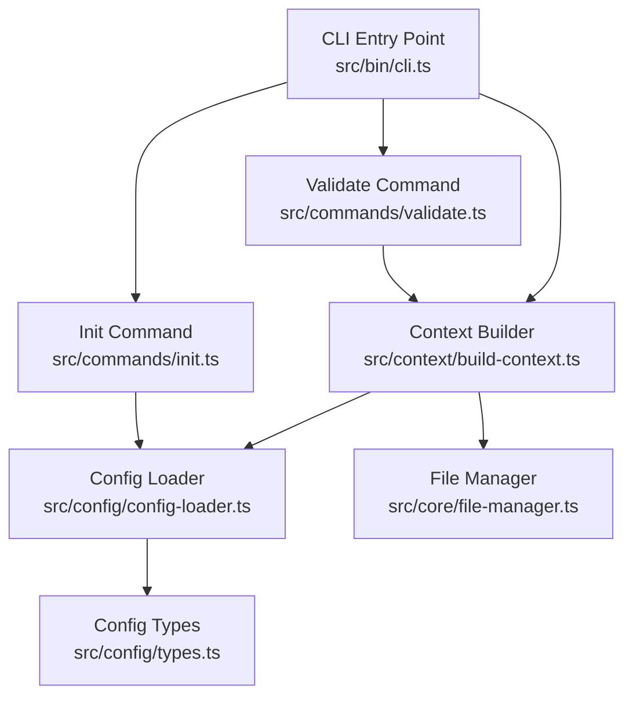
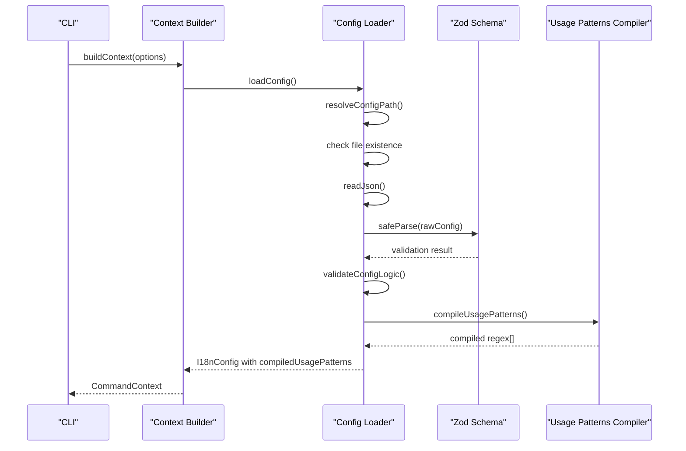
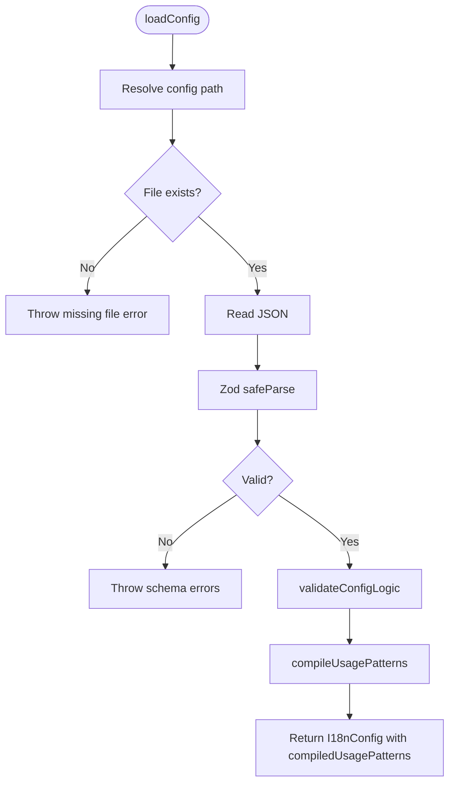
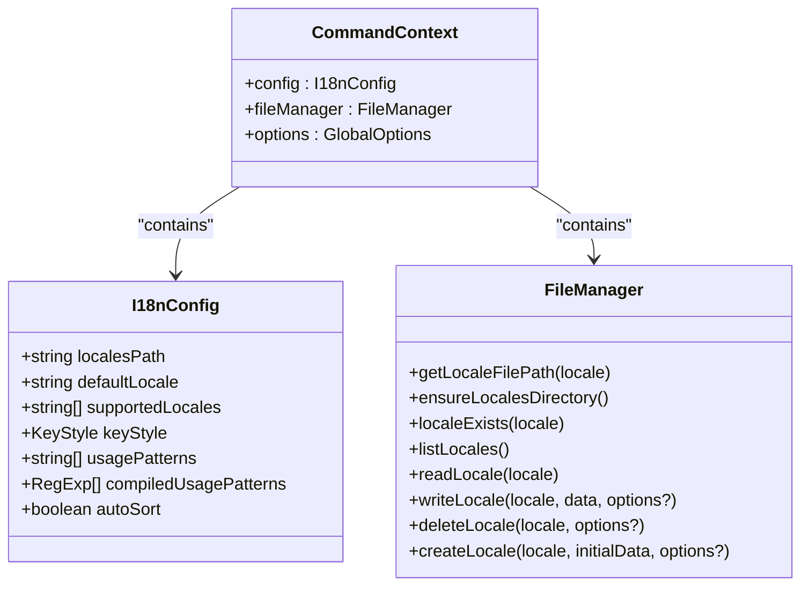
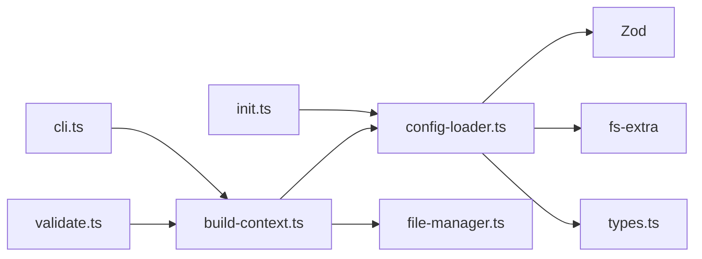
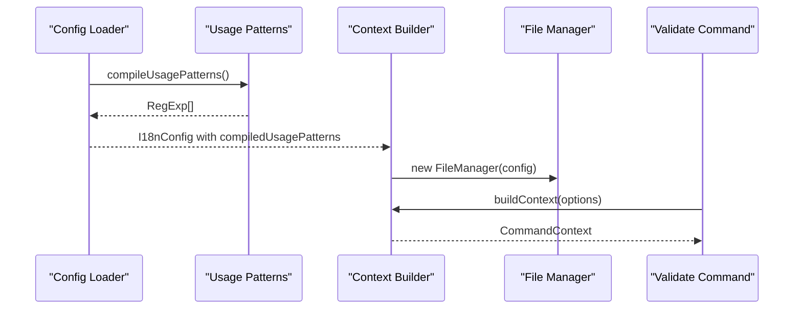

# Configuration Loading and Validation

<cite>
**Referenced Files in This Document**
- [config-loader.ts](file://src/config/config-loader.ts)
- [types.ts](file://src/config/types.ts)
- [build-context.ts](file://src/context/build-context.ts)
- [types.ts](file://src/context/types.ts)
- [cli.ts](file://src/bin/cli.ts)
- [init.ts](file://src/commands/init.ts)
- [validate.ts](file://src/commands/validate.ts)
- [file-manager.ts](file://src/core/file-manager.ts)
- [config-loader.test.ts](file://unit-testing/config/config-loader.test.ts)
</cite>

## Table of Contents
1. [Introduction](#introduction)
2. [Project Structure](#project-structure)
3. [Core Components](#core-components)
4. [Architecture Overview](#architecture-overview)
5. [Detailed Component Analysis](#detailed-component-analysis)
6. [Dependency Analysis](#dependency-analysis)
7. [Performance Considerations](#performance-considerations)
8. [Troubleshooting Guide](#troubleshooting-guide)
9. [Conclusion](#conclusion)

## Introduction
This document explains the configuration loading and validation system used by the i18n CLI tool. It covers how configuration files are discovered and loaded, how JSON is parsed and validated against a schema, and how logical consistency checks are performed. It also documents the configuration compilation process that produces runtime-ready objects, including usage pattern compilation into regular expressions. Error handling for missing files, invalid JSON, schema violations, and logical inconsistencies is detailed, along with practical examples and solutions.

## Project Structure
The configuration system spans several modules:
- Configuration loader: discovers the configuration file, parses JSON, validates schema, and performs logical checks
- Types: defines the runtime configuration shape
- Context builder: constructs the runtime context by loading configuration and initializing supporting services
- CLI entry point: orchestrates commands and global options
- Initialization command: creates a starter configuration file
- Validation command: uses configuration to validate and auto-correct translation files
- File manager: reads and writes locale files using configuration settings

**Diagram sources**
- [cli.ts:1-209](file://src/bin/cli.ts#L1-L209)
- [build-context.ts:1-16](file://src/context/build-context.ts#L1-L16)
- [config-loader.ts:1-176](file://src/config/config-loader.ts#L1-L176)
- [types.ts:1-12](file://src/config/types.ts#L1-L12)
- [file-manager.ts:1-118](file://src/core/file-manager.ts#L1-L118)
- [init.ts:1-239](file://src/commands/init.ts#L1-L239)
- [validate.ts:1-254](file://src/commands/validate.ts#L1-L254)

**Section sources**
- [cli.ts:1-209](file://src/bin/cli.ts#L1-L209)
- [build-context.ts:1-16](file://src/context/build-context.ts#L1-L16)
- [config-loader.ts:1-176](file://src/config/config-loader.ts#L1-L176)
- [types.ts:1-12](file://src/config/types.ts#L1-L12)
- [file-manager.ts:1-118](file://src/core/file-manager.ts#L1-L118)
- [init.ts:1-239](file://src/commands/init.ts#L1-L239)
- [validate.ts:1-254](file://src/commands/validate.ts#L1-L254)

## Core Components
- Configuration loader: resolves the configuration file path, loads and parses JSON, validates schema using Zod, applies logical checks, compiles usage patterns into regular expressions, and returns a runtime configuration object augmented with compiled patterns
- Runtime configuration types: define the shape of the configuration object used throughout the application
- Context builder: loads configuration and initializes the file manager to operate on locale files according to configuration
- CLI integration: exposes global options and routes commands to context-aware handlers
- Initialization command: generates a starter configuration file with defaults and compiles usage patterns for validation
- Validation command: uses configuration to compare locale files against the default locale, reporting and fixing inconsistencies

**Section sources**
- [config-loader.ts:1-176](file://src/config/config-loader.ts#L1-L176)
- [types.ts:1-12](file://src/config/types.ts#L1-L12)
- [build-context.ts:1-16](file://src/context/build-context.ts#L1-L16)
- [cli.ts:1-209](file://src/bin/cli.ts#L1-L209)
- [init.ts:1-239](file://src/commands/init.ts#L1-L239)
- [validate.ts:1-254](file://src/commands/validate.ts#L1-L254)

## Architecture Overview
The configuration system follows a layered approach:
- Discovery: locate the configuration file in the project root
- Parsing: read and parse JSON safely
- Schema validation: enforce field presence, types, and defaults using Zod
- Logical validation: ensure semantic consistency (e.g., default locale is supported)
- Compilation: transform usage patterns into executable regular expressions
- Runtime construction: produce a configuration object ready for downstream services

**Diagram sources**
- [build-context.ts:5-16](file://src/context/build-context.ts#L5-L16)
- [config-loader.ts:24-67](file://src/config/config-loader.ts#L24-L67)
- [config-loader.ts:84-109](file://src/config/config-loader.ts#L84-L109)

## Detailed Component Analysis

### Configuration Loader
The loader performs:
- File discovery: resolves the configuration file path in the current working directory
- Existence check: throws a clear error if the file is missing
- JSON parsing: reads and parses JSON, throwing a descriptive error on invalid JSON
- Schema validation: uses Zod to validate required fields, types, and defaults
- Logical validation: ensures default locale is included in supported locales and that supported locales do not contain duplicates
- Usage pattern compilation: converts usage patterns into regular expressions, validating regex syntax and requiring capturing groups

**Diagram sources**
- [config-loader.ts:24-67](file://src/config/config-loader.ts#L24-L67)
- [config-loader.ts:69-82](file://src/config/config-loader.ts#L69-L82)
- [config-loader.ts:84-109](file://src/config/config-loader.ts#L84-L109)

**Section sources**
- [config-loader.ts:1-176](file://src/config/config-loader.ts#L1-L176)

### Runtime Configuration Types
The runtime configuration object includes:
- localesPath: path to locale files
- defaultLocale: the primary locale used for validation and reference
- supportedLocales: list of locales to manage
- keyStyle: either flat or nested key representation
- usagePatterns: raw regex patterns used to extract translation keys from source files
- compiledUsagePatterns: compiled regular expressions ready for matching
- autoSort: whether to sort keys when writing locale files

**Section sources**
- [types.ts:1-12](file://src/config/types.ts#L1-L12)

### Context Builder
The context builder:
- Loads configuration via the loader
- Initializes the file manager with the configuration
- Returns a command context containing configuration, file manager, and global options

**Diagram sources**
- [build-context.ts:1-16](file://src/context/build-context.ts#L1-L16)
- [types.ts:1-12](file://src/config/types.ts#L1-L12)
- [file-manager.ts:1-118](file://src/core/file-manager.ts#L1-L118)

**Section sources**
- [build-context.ts:1-16](file://src/context/build-context.ts#L1-L16)
- [types.ts:1-12](file://src/config/types.ts#L1-L12)
- [file-manager.ts:1-118](file://src/core/file-manager.ts#L1-L118)

### CLI Integration
The CLI:
- Defines global options (yes, dry-run, ci, force)
- Routes commands to context-aware handlers
- Ensures configuration is loaded before executing commands

**Section sources**
- [cli.ts:25-32](file://src/bin/cli.ts#L25-L32)
- [cli.ts:50-101](file://src/bin/cli.ts#L50-L101)
- [cli.ts:164-198](file://src/bin/cli.ts#L164-L198)

### Initialization Command
The initialization command:
- Creates a starter configuration file with sensible defaults
- Compiles usage patterns to validate them early
- Optionally initializes the default locale file

**Section sources**
- [init.ts:19-23](file://src/commands/init.ts#L19-L23)
- [init.ts:149-177](file://src/commands/init.ts#L149-L177)

### Validation Command
The validation command:
- Reads the default locale as the reference
- Flattens locale data for comparison
- Detects missing keys, extra keys, and type mismatches
- Reports issues and optionally auto-corrects them using a translator or fallback strategies

**Section sources**
- [validate.ts:121-254](file://src/commands/validate.ts#L121-L254)

## Dependency Analysis
The configuration system depends on:
- Zod for schema validation
- fs-extra for file system operations
- Regular expressions for usage pattern matching

**Diagram sources**
- [config-loader.ts:1-5](file://src/config/config-loader.ts#L1-L5)
- [build-context.ts:1-3](file://src/context/build-context.ts#L1-L3)
- [file-manager.ts:1-3](file://src/core/file-manager.ts#L1-L3)
- [init.ts:1-8](file://src/commands/init.ts#L1-L8)
- [validate.ts:1-9](file://src/commands/validate.ts#L1-L9)
- [cli.ts:1-16](file://src/bin/cli.ts#L1-L16)

**Section sources**
- [config-loader.ts:1-5](file://src/config/config-loader.ts#L1-L5)
- [build-context.ts:1-3](file://src/context/build-context.ts#L1-L3)
- [file-manager.ts:1-3](file://src/core/file-manager.ts#L1-L3)
- [init.ts:1-8](file://src/commands/init.ts#L1-L8)
- [validate.ts:1-9](file://src/commands/validate.ts#L1-L9)
- [cli.ts:1-16](file://src/bin/cli.ts#L1-L16)

## Performance Considerations
- Schema validation is O(n) in the number of fields checked; minimal overhead
- Usage pattern compilation is linear in the number of patterns and their lengths
- File I/O operations dominate performance; ensure efficient batch operations where possible
- Consider caching compiled regular expressions if the same patterns are reused frequently

## Troubleshooting Guide

### Common Validation Errors and Solutions
- Missing configuration file
  - Symptom: Error indicating the configuration file was not found
  - Solution: Run the initialization command to create the configuration file
  - Section sources
    - [config-loader.ts:27-32](file://src/config/config-loader.ts#L27-L32)
    - [config-loader.test.ts:29-35](file://unit-testing/config/config-loader.test.ts#L29-L35)

- Invalid JSON in configuration file
  - Symptom: Error stating the configuration failed to parse
  - Solution: Fix syntax errors in the configuration file; ensure it is valid JSON
  - Section sources
    - [config-loader.ts:36-42](file://src/config/config-loader.ts#L36-L42)
    - [config-loader.test.ts:37-44](file://unit-testing/config/config-loader.test.ts#L37-L44)

- Schema violations
  - Symptom: Error listing specific schema issues
  - Solution: Correct field types, add missing required fields, or adjust values to meet schema expectations
  - Section sources
    - [config-loader.ts:44-54](file://src/config/config-loader.ts#L44-L54)
    - [config-loader.test.ts:46-54](file://unit-testing/config/config-loader.test.ts#L46-L54)

- Logical inconsistencies
  - Default locale not in supported locales
    - Symptom: Error stating the default locale must be included in supported locales
    - Solution: Add the default locale to supported locales
    - Section sources
      - [config-loader.ts:70-74](file://src/config/config-loader.ts#L70-L74)
      - [config-loader.test.ts:56-70](file://unit-testing/config/config-loader.test.ts#L56-L70)

  - Duplicate locales in supported locales
    - Symptom: Error listing duplicate locales
    - Solution: Remove duplicates from supported locales
    - Section sources
      - [config-loader.ts:76-81](file://src/config/config-loader.ts#L76-L81)
      - [config-loader.test.ts:72-86](file://unit-testing/config/config-loader.test.ts#L72-L86)

- Usage patterns compilation failures
  - Invalid regex syntax
    - Symptom: Error indicating an invalid regex in a usage pattern
    - Solution: Fix the regex syntax; ensure it is valid JavaScript regex
    - Section sources
      - [config-loader.ts:92-98](file://src/config/config-loader.ts#L92-L98)
      - [config-loader.test.ts:188-194](file://unit-testing/config/config-loader.test.ts#L188-L194)

  - Missing capturing groups
    - Symptom: Error stating usage patterns must include a capturing group
    - Solution: Add a capturing group to the pattern; use named or standard capturing groups
    - Section sources
      - [config-loader.ts:100-105](file://src/config/config-loader.ts#L100-L105)
      - [config-loader.test.ts:196-202](file://unit-testing/config/config-loader.test.ts#L196-L202)

### Configuration Compilation and Runtime Objects
- The loader compiles usage patterns into regular expressions and attaches them to the configuration object
- The context builder uses the configuration to initialize the file manager
- The validation command uses the configuration to compare locale files against the default locale

**Diagram sources**
- [config-loader.ts:59-66](file://src/config/config-loader.ts#L59-L66)
- [build-context.ts:8-15](file://src/context/build-context.ts#L8-L15)
- [validate.ts:121-127](file://src/commands/validate.ts#L121-L127)

**Section sources**
- [config-loader.ts:84-109](file://src/config/config-loader.ts#L84-L109)
- [build-context.ts:1-16](file://src/context/build-context.ts#L1-L16)
- [validate.ts:1-254](file://src/commands/validate.ts#L1-L254)

## Conclusion
The configuration loading and validation system provides a robust foundation for the i18n CLI tool. It ensures that configuration files are discoverable, syntactically correct, and logically consistent before runtime. The schema-driven validation, combined with logical checks and usage pattern compilation, enables reliable operation across commands such as initialization and validation. Clear error messages guide users toward corrective actions, and the context builder integrates configuration seamlessly with file operations and command execution.