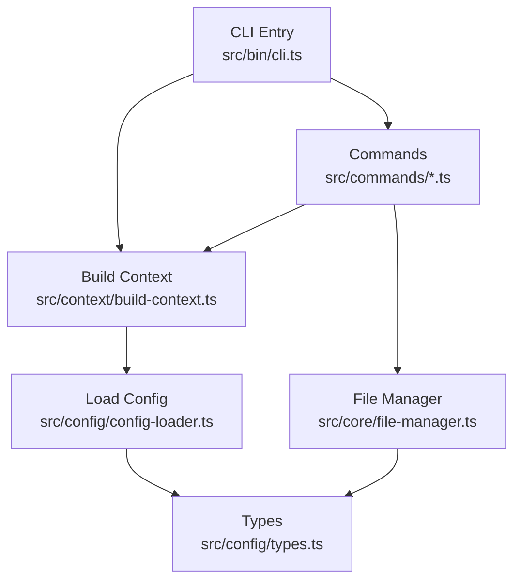
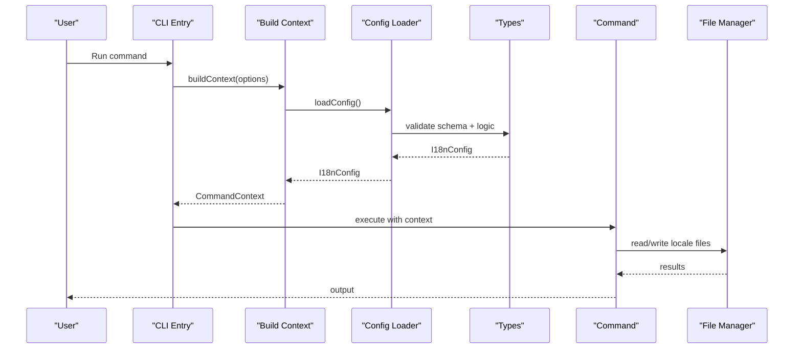
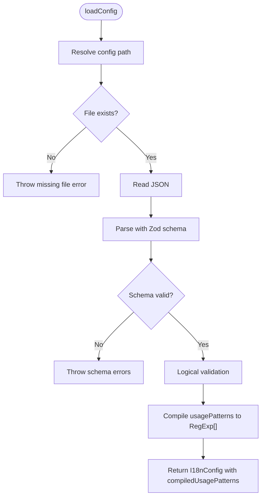
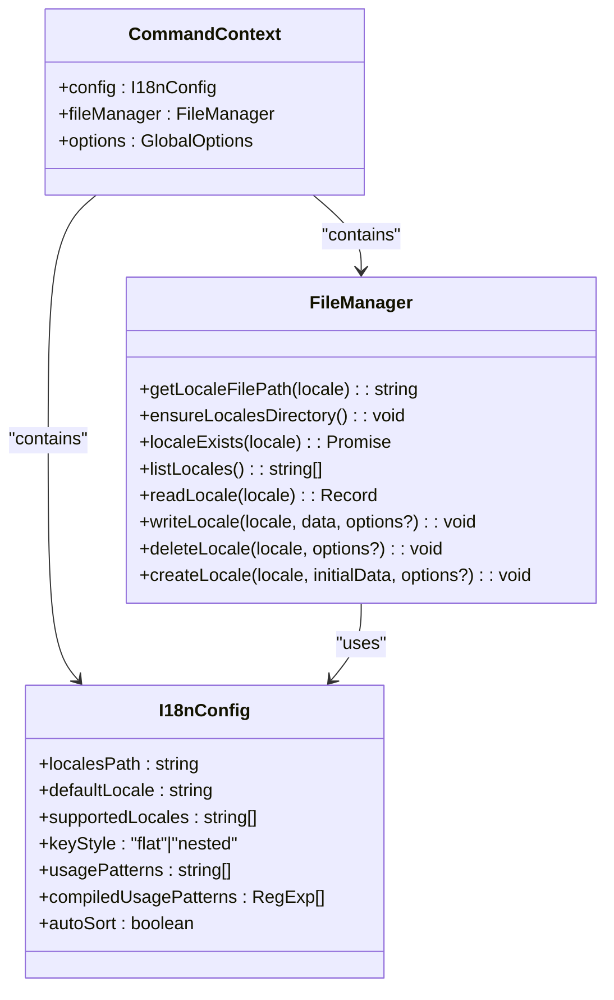
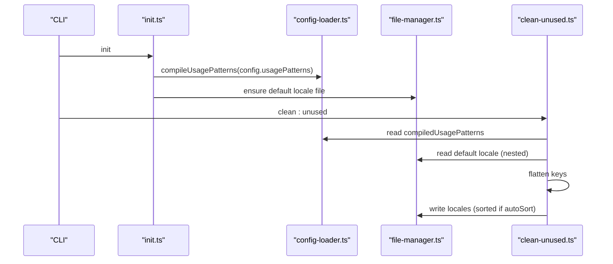
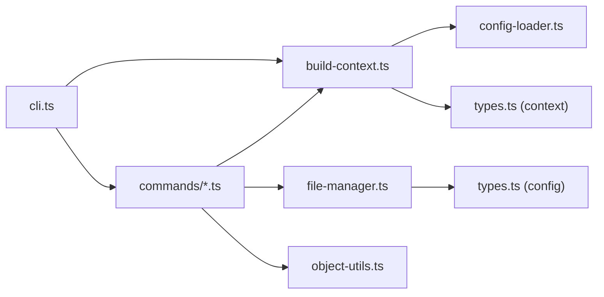

# Configuration Management

<cite>
**Referenced Files in This Document**
- [config-loader.ts](file://src/config/config-loader.ts)
- [types.ts](file://src/config/types.ts)
- [build-context.ts](file://src/context/build-context.ts)
- [types.ts](file://src/context/types.ts)
- [cli.ts](file://src/bin/cli.ts)
- [init.ts](file://src/commands/init.ts)
- [clean-unused.ts](file://src/commands/clean-unused.ts)
- [file-manager.ts](file://src/core/file-manager.ts)
- [object-utils.ts](file://src/core/object-utils.ts)
- [config-loader.test.ts](file://unit-testing/config/config-loader.test.ts)
- [README.md](file://README.md)
- [package.json](file://package.json)
</cite>

## Table of Contents
1. [Introduction](#introduction)
2. [Project Structure](#project-structure)
3. [Core Components](#core-components)
4. [Architecture Overview](#architecture-overview)
5. [Detailed Component Analysis](#detailed-component-analysis)
6. [Dependency Analysis](#dependency-analysis)
7. [Performance Considerations](#performance-considerations)
8. [Troubleshooting Guide](#troubleshooting-guide)
9. [Conclusion](#conclusion)
10. [Appendices](#appendices)

## Introduction
This document explains how configuration is defined, loaded, validated, and consumed across i18n-ai-cli. It covers the configuration file structure, runtime access, validation rules, and how configuration affects command execution. It also provides best practices for organizing translation files, structuring configuration for different project types, and strategies for configuration updates and environment-specific settings.

## Project Structure
Configuration is centralized in a single JSON file located at the project root. The CLI loads this configuration early in the lifecycle and exposes it to all commands via a shared context. The configuration schema is enforced at runtime using schema validation and logical checks.

**Diagram sources**
- [cli.ts:1-209](file://src/bin/cli.ts#L1-L209)
- [build-context.ts:1-16](file://src/context/build-context.ts#L1-L16)
- [config-loader.ts:1-176](file://src/config/config-loader.ts#L1-L176)
- [types.ts:1-12](file://src/config/types.ts#L1-L12)
- [file-manager.ts:1-118](file://src/core/file-manager.ts#L1-L118)

**Section sources**
- [cli.ts:1-209](file://src/bin/cli.ts#L1-L209)
- [build-context.ts:1-16](file://src/context/build-context.ts#L1-L16)
- [config-loader.ts:1-176](file://src/config/config-loader.ts#L1-L176)
- [types.ts:1-12](file://src/config/types.ts#L1-L12)
- [file-manager.ts:1-118](file://src/core/file-manager.ts#L1-L118)

## Core Components
- Configuration file: i18n-cli.config.json in the project root.
- Schema and defaults: validated and normalized by the loader.
- Runtime context: a shared object passed to commands containing config, file manager, and global options.
- Compiled usage patterns: regex objects derived from configured patterns for scanning source code.

Key configuration options:
- localesPath: Directory containing translation files.
- defaultLocale: Source/default language code.
- supportedLocales: List of enabled locales.
- keyStyle: "flat" or "nested" key structure.
- usagePatterns: Regex patterns to detect translation keys in source code.
- autoSort: Whether to sort keys alphabetically when writing files.

Defaults:
- keyStyle: "nested"
- usagePatterns: []
- autoSort: true

Validation:
- defaultLocale must be included in supportedLocales.
- supportedLocales must not contain duplicates.
- usagePatterns must compile to valid regex with at least one capturing group.

**Section sources**
- [config-loader.ts:8-176](file://src/config/config-loader.ts#L8-L176)
- [types.ts:3-11](file://src/config/types.ts#L3-L11)
- [config-loader.test.ts:88-171](file://unit-testing/config/config-loader.test.ts#L88-L171)

## Architecture Overview
The configuration lifecycle:
1. CLI parses arguments and builds a context.
2. Context loads configuration from the project root.
3. Commands receive the context and use config for behavior and file operations.
4. File manager applies sorting and writes files according to configuration.

**Diagram sources**
- [cli.ts:34-198](file://src/bin/cli.ts#L34-L198)
- [build-context.ts:5-16](file://src/context/build-context.ts#L5-L16)
- [config-loader.ts:24-67](file://src/config/config-loader.ts#L24-L67)
- [types.ts:3-11](file://src/config/types.ts#L3-L11)
- [file-manager.ts:31-61](file://src/core/file-manager.ts#L31-L61)

## Detailed Component Analysis

### Configuration Loading and Validation
- File discovery: The loader resolves the config path in the current working directory.
- Parsing: Reads and parses JSON; throws if invalid.
- Schema validation: Ensures required fields and types; applies defaults for optional fields.
- Logical validation: Enforces that defaultLocale is in supportedLocales and that supportedLocales has no duplicates.
- Usage patterns compilation: Converts usagePatterns into RegExp objects and validates capturing groups.

**Diagram sources**
- [config-loader.ts:19-67](file://src/config/config-loader.ts#L19-L67)
- [config-loader.ts:69-82](file://src/config/config-loader.ts#L69-L82)
- [config-loader.ts:84-109](file://src/config/config-loader.ts#L84-L109)

**Section sources**
- [config-loader.ts:19-109](file://src/config/config-loader.ts#L19-L109)
- [config-loader.test.ts:28-171](file://unit-testing/config/config-loader.test.ts#L28-L171)

### Runtime Access and Context
- Context creation: buildContext loads config and instantiates FileManager.
- Commands receive CommandContext and can access config, file manager, and global options.
- Global options include yes, dryRun, ci, and force, which influence command behavior.

**Diagram sources**
- [types.ts:11-15](file://src/context/types.ts#L11-L15)
- [types.ts:3-11](file://src/config/types.ts#L3-L11)
- [file-manager.ts:5-118](file://src/core/file-manager.ts#L5-L118)

**Section sources**
- [build-context.ts:5-16](file://src/context/build-context.ts#L5-L16)
- [types.ts:11-15](file://src/context/types.ts#L11-L15)
- [types.ts:3-11](file://src/config/types.ts#L3-L11)
- [file-manager.ts:5-118](file://src/core/file-manager.ts#L5-L118)

### Relationship Between Configuration and Command Execution
- Initialization: init command generates a config file and can initialize the default locale file.
- Unused key cleanup: clean:unused scans source files using compiled usagePatterns and removes unused keys from all locales.
- Sorting behavior: FileManager writes locale files with keys sorted when autoSort is enabled.

**Diagram sources**
- [init.ts:133-177](file://src/commands/init.ts#L133-L177)
- [config-loader.ts:59-66](file://src/config/config-loader.ts#L59-L66)
- [file-manager.ts:52-61](file://src/core/file-manager.ts#L52-L61)
- [clean-unused.ts:17-124](file://src/commands/clean-unused.ts#L17-L124)

**Section sources**
- [init.ts:133-177](file://src/commands/init.ts#L133-L177)
- [clean-unused.ts:17-124](file://src/commands/clean-unused.ts#L17-L124)
- [file-manager.ts:52-61](file://src/core/file-manager.ts#L52-L61)

### Configuration Options Reference

- localesPath
  - Purpose: Directory containing translation files.
  - Type: string.
  - Required: Yes.
  - Notes: Resolved relative to process.cwd().
  - Example: "./locales".
  - Related usage: FileManager resolves absolute path; init may create default locale file here.

- defaultLocale
  - Purpose: Source/default language code.
  - Type: string (minimum length 2).
  - Required: Yes.
  - Validation: Must be included in supportedLocales.
  - Example: "en".
  - Related usage: clean:unused reads default locale for baseline keys.

- supportedLocales
  - Purpose: List of enabled locales.
  - Type: string[] (each item minimum length 2).
  - Required: Yes.
  - Validation: Must include defaultLocale; must not contain duplicates.
  - Example: ["en", "es", "fr"].
  - Related usage: add:lang checks membership; clean:unused iterates locales.

- keyStyle
  - Purpose: Key structure style for translation files.
  - Type: "flat" | "nested".
  - Default: "nested".
  - Example: "nested".
  - Related usage: clean:unused rebuilds files using keyStyle when removing keys.

- usagePatterns
  - Purpose: Regex patterns to detect translation keys in source code.
  - Type: string[].
  - Default: [].
  - Validation: Each must compile to a valid regex and include at least one capturing group (standard or named).
  - Example: ["t\\(['\"](?<key>.*?)['\"]\\)"].
  - Related usage: clean:unused compiles and executes these patterns to discover used keys.

- autoSort
  - Purpose: Whether to sort keys alphabetically when writing files.
  - Type: boolean.
  - Default: true.
  - Example: true.
  - Related usage: FileManager sorts keys recursively when enabled.

**Section sources**
- [config-loader.ts:8-15](file://src/config/config-loader.ts#L8-L15)
- [config-loader.ts:69-82](file://src/config/config-loader.ts#L69-L82)
- [config-loader.ts:84-109](file://src/config/config-loader.ts#L84-L109)
- [types.ts:3-11](file://src/config/types.ts#L3-L11)
- [clean-unused.ts:17-124](file://src/commands/clean-unused.ts#L17-L124)
- [file-manager.ts:52-61](file://src/core/file-manager.ts#L52-L61)

### Best Practices for Organizing Translation Files and Structuring Configuration
- Choose keyStyle based on readability and tooling:
  - "nested" keeps hierarchical structure aligned with typical i18n libraries.
  - "flat" simplifies key naming but may reduce readability for deep hierarchies.
- Define robust usagePatterns:
  - Include capturing groups to extract keys reliably.
  - Test patterns against representative source code to avoid false positives/negatives.
- Keep supportedLocales synchronized:
  - Ensure defaultLocale is always present.
  - Avoid duplicates; keep entries concise and standardized.
- Use localesPath consistently:
  - Place locale files under a dedicated directory and initialize it during setup.
- Leverage autoSort:
  - Enable to maintain consistent ordering across files and improve diffs.

**Section sources**
- [README.md:54-84](file://README.md#L54-L84)
- [init.ts:209-238](file://src/commands/init.ts#L209-L238)
- [file-manager.ts:52-61](file://src/core/file-manager.ts#L52-L61)

### Configuration Inheritance and Environment-Specific Settings
- Single configuration file: i18n-cli.config.json is the single source of truth resolved from the project root.
- Environment variables:
  - OPENAI_API_KEY influences provider selection in commands (not part of configuration).
- No built-in per-environment overrides: the loader reads a single file; manage environments by maintaining separate repositories or by generating configs via external tooling.

**Section sources**
- [config-loader.ts:24-67](file://src/config/config-loader.ts#L24-L67)
- [cli.ts:82-98](file://src/bin/cli.ts#L82-L98)
- [cli.ts:118-136](file://src/bin/cli.ts#L118-L136)

### Migration Strategies for Configuration Updates
- Backward compatibility:
  - Optional fields have defaults; newly added fields will be populated automatically upon reload.
- Validation-first approach:
  - Run commands with --dry-run to preview changes after updating configuration.
- Incremental adoption:
  - Introduce stricter validation (e.g., adding usagePatterns) gradually and verify scans produce expected results.
- Versioning:
  - Track configuration changes alongside code changes; consider documenting breaking changes in release notes.

**Section sources**
- [config-loader.ts:12-15](file://src/config/config-loader.ts#L12-L15)
- [config-loader.test.ts:112-155](file://unit-testing/config/config-loader.test.ts#L112-L155)
- [cli.ts:25-32](file://src/bin/cli.ts#L25-L32)

## Dependency Analysis
Configuration is consumed across modules:
- CLI builds context and passes it to commands.
- Commands depend on context for config and file manager.
- File manager depends on config for path resolution and sorting behavior.
- Object utilities support flattening/unflattening based on keyStyle.

**Diagram sources**
- [cli.ts:1-209](file://src/bin/cli.ts#L1-L209)
- [build-context.ts:1-16](file://src/context/build-context.ts#L1-L16)
- [config-loader.ts:1-176](file://src/config/config-loader.ts#L1-L176)
- [types.ts:1-12](file://src/config/types.ts#L1-L12)
- [file-manager.ts:1-118](file://src/core/file-manager.ts#L1-L118)
- [object-utils.ts:1-95](file://src/core/object-utils.ts#L1-L95)

**Section sources**
- [cli.ts:1-209](file://src/bin/cli.ts#L1-L209)
- [build-context.ts:1-16](file://src/context/build-context.ts#L1-L16)
- [config-loader.ts:1-176](file://src/config/config-loader.ts#L1-L176)
- [types.ts:1-12](file://src/config/types.ts#L1-L12)
- [file-manager.ts:1-118](file://src/core/file-manager.ts#L1-L118)
- [object-utils.ts:1-95](file://src/core/object-utils.ts#L1-L95)

## Performance Considerations
- Compiled usagePatterns: Converting patterns to RegExp once and reusing them avoids repeated parsing overhead.
- Sorting cost: autoSort triggers recursive sorting when writing files; consider disabling for very large files if performance becomes an issue.
- File I/O: Batch operations (e.g., cleaning unused keys across all locales) minimize repeated disk access by iterating locales once.

**Section sources**
- [config-loader.ts:59-66](file://src/config/config-loader.ts#L59-L66)
- [file-manager.ts:100-115](file://src/core/file-manager.ts#L100-L115)
- [clean-unused.ts:104-124](file://src/commands/clean-unused.ts#L104-L124)

## Troubleshooting Guide
Common configuration issues and resolutions:
- Configuration file not found:
  - Ensure i18n-cli.config.json exists in the project root; run initialization if missing.
- Invalid JSON:
  - Fix syntax errors; the loader requires valid JSON.
- Schema validation failures:
  - Review required fields and types; the loader reports field-specific issues.
- Logical validation failures:
  - Ensure defaultLocale is in supportedLocales and that supportedLocales contains no duplicates.
- Invalid usagePatterns:
  - Patterns must compile to valid regex and include at least one capturing group; test patterns against representative source code.
- Clean unused keys fails due to missing usagePatterns:
  - Configure usagePatterns before running clean:unused.

**Section sources**
- [config-loader.ts:27-54](file://src/config/config-loader.ts#L27-L54)
- [config-loader.ts:69-82](file://src/config/config-loader.ts#L69-L82)
- [config-loader.ts:84-109](file://src/config/config-loader.ts#L84-L109)
- [clean-unused.ts:19-23](file://src/commands/clean-unused.ts#L19-L23)
- [config-loader.test.ts:29-86](file://unit-testing/config/config-loader.test.ts#L29-L86)

## Conclusion
i18n-ai-cli’s configuration model is intentionally minimal yet powerful. A single JSON file defines where translation files live, which locales are supported, how keys are structured, how to scan for key usage, and whether to sort keys automatically. The loader enforces strong validation and normalization, while commands consume the configuration through a shared context. By following the best practices and validation guidance in this document, teams can maintain reliable, predictable i18n workflows across diverse project types.

## Appendices

### Appendix A: Configuration File Example
- See the example configuration in the project README for a complete, working template.

**Section sources**
- [README.md:61-74](file://README.md#L61-L74)

### Appendix B: Programmatic Access
- Use loadConfig to programmatically access configuration in TypeScript projects.

**Section sources**
- [README.md:306-331](file://README.md#L306-L331)