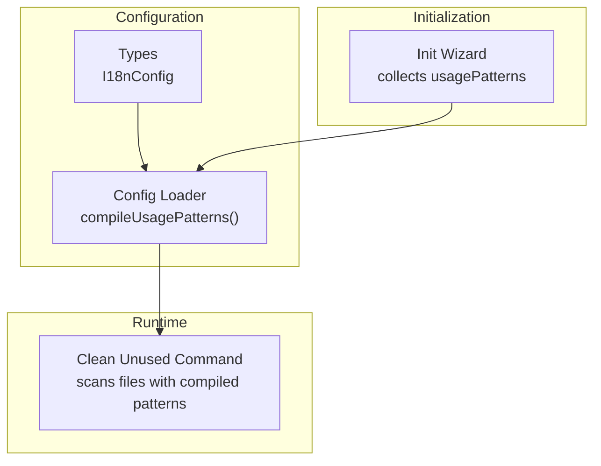
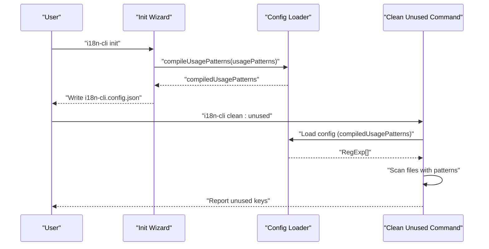
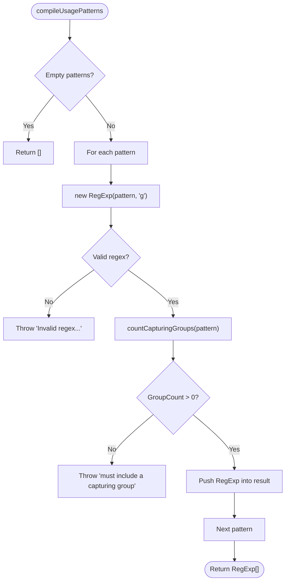
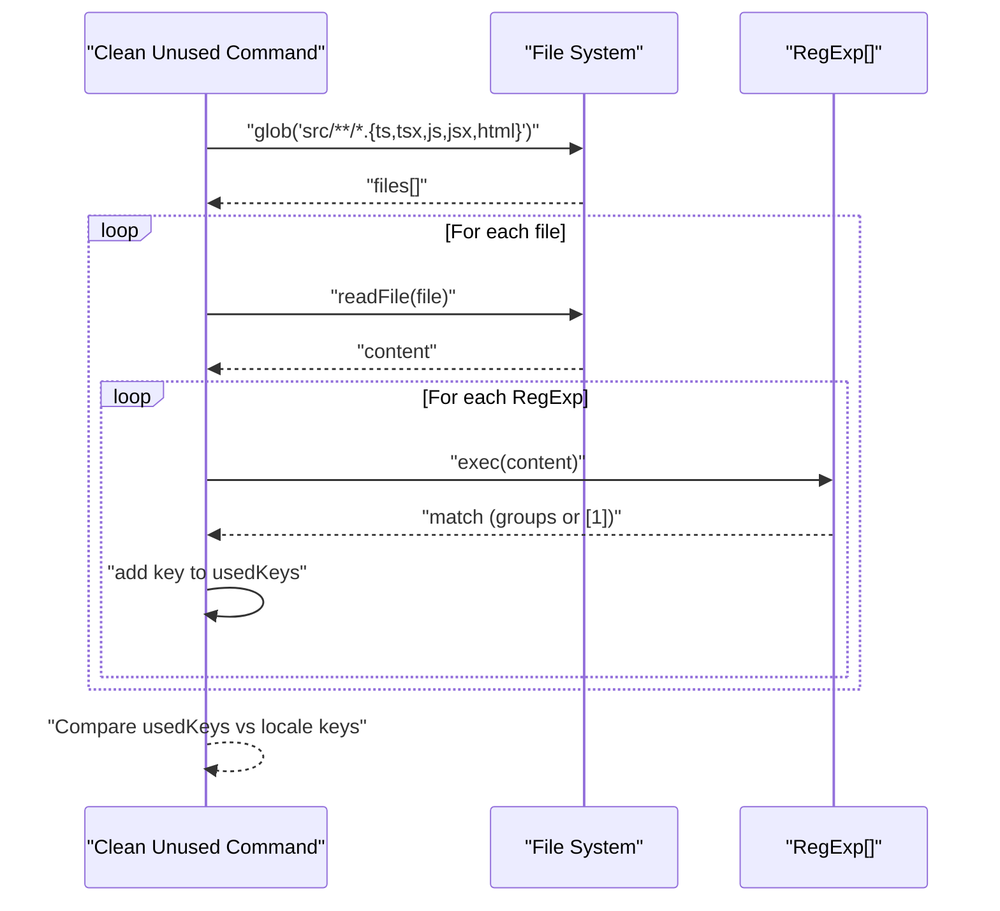
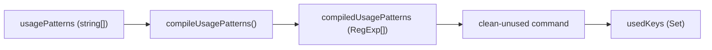

# Usage Pattern Configuration

<cite>
**Referenced Files in This Document**
- [config-loader.ts](file://src/config/config-loader.ts)
- [types.ts](file://src/config/types.ts)
- [init.ts](file://src/commands/init.ts)
- [clean-unused.ts](file://src/commands/clean-unused.ts)
- [config-loader.test.ts](file://unit-testing/config/config-loader.test.ts)
- [clean-unused.test.ts](file://unit-testing/commands/clean-unused.test.ts)
- [README.md](file://README.md)
</cite>

## Table of Contents
1. [Introduction](#introduction)
2. [Project Structure](#project-structure)
3. [Core Components](#core-components)
4. [Architecture Overview](#architecture-overview)
5. [Detailed Component Analysis](#detailed-component-analysis)
6. [Dependency Analysis](#dependency-analysis)
7. [Performance Considerations](#performance-considerations)
8. [Troubleshooting Guide](#troubleshooting-guide)
9. [Conclusion](#conclusion)

## Introduction
This document explains the usage pattern configuration system used to detect translation key usage in source code. It covers how to define regular expressions, the syntax requirements for capturing groups, the compilation process that converts string patterns into RegExp objects, and best practices for building efficient and accurate patterns. Practical examples demonstrate usage across common JavaScript/TypeScript and HTML contexts.

## Project Structure
The usage pattern system spans configuration loading, initialization, and runtime usage detection:
- Configuration schema and types define the structure of usagePatterns and compiledUsagePatterns.
- The loader validates configuration and compiles usagePatterns into RegExp objects.
- The initialization wizard collects usage patterns from users and validates them.
- The cleanup command scans source files using compiled patterns to discover used keys.

**Diagram sources**
- [config-loader.ts:84-109](file://src/config/config-loader.ts#L84-L109)
- [init.ts:19-23](file://src/commands/init.ts#L19-L23)
- [clean-unused.ts:17-46](file://src/commands/clean-unused.ts#L17-L46)

**Section sources**
- [config-loader.ts:8-176](file://src/config/config-loader.ts#L8-L176)
- [types.ts:1-12](file://src/config/types.ts#L1-L12)
- [init.ts:19-149](file://src/commands/init.ts#L19-L149)
- [clean-unused.ts:1-138](file://src/commands/clean-unused.ts#L1-L138)

## Core Components
- I18nConfig defines the shape of the configuration, including usagePatterns (strings) and compiledUsagePatterns (RegExp[]).
- compileUsagePatterns transforms string patterns into RegExp objects with global flags and validates capturing groups.
- The initialization wizard collects usage patterns from users and validates them during creation.
- The cleanup command uses compiled patterns to scan source files and extract translation keys.

**Section sources**
- [types.ts:3-11](file://src/config/types.ts#L3-L11)
- [config-loader.ts:84-109](file://src/config/config-loader.ts#L84-L109)
- [init.ts:19-149](file://src/commands/init.ts#L19-L149)
- [clean-unused.ts:17-46](file://src/commands/clean-unused.ts#L17-L46)

## Architecture Overview
The usage pattern lifecycle:
1. Define usagePatterns in i18n-cli.config.json.
2. Load and validate configuration.
3. Compile usagePatterns into RegExp objects.
4. Use compiled patterns to scan source files and collect used keys.
5. Compare collected keys against locale files to identify unused keys.

**Diagram sources**
- [init.ts:19-149](file://src/commands/init.ts#L19-L149)
- [config-loader.ts:58-66](file://src/config/config-loader.ts#L58-L66)
- [clean-unused.ts:17-46](file://src/commands/clean-unused.ts#L17-L46)

## Detailed Component Analysis

### Configuration Schema and Types
- I18nConfig includes usagePatterns (string[]) and compiledUsagePatterns (RegExp[]).
- The Zod schema ensures usagePatterns defaults to an empty array and validates structure.

**Section sources**
- [types.ts:3-11](file://src/config/types.ts#L3-L11)
- [config-loader.ts:8-17](file://src/config/config-loader.ts#L8-L17)

### Pattern Compilation and Validation
- compileUsagePatterns:
  - Converts each string pattern into a RegExp with the global flag.
  - Validates that each pattern contains at least one capturing group.
  - Throws descriptive errors for invalid regex syntax or missing capturing groups.
- countCapturingGroups:
  - Counts capturing groups while handling character classes and lookahead/lookbehind assertions.

**Diagram sources**
- [config-loader.ts:84-109](file://src/config/config-loader.ts#L84-L109)
- [config-loader.ts:111-161](file://src/config/config-loader.ts#L111-L161)

**Section sources**
- [config-loader.ts:84-109](file://src/config/config-loader.ts#L84-L109)
- [config-loader.ts:111-161](file://src/config/config-loader.ts#L111-L161)

### Initialization Wizard and Default Patterns
- The initialization wizard collects usagePatterns from users.
- Defaults include common patterns for t(), translate(), and i18n.t().
- compileUsagePatterns is invoked during initialization to validate patterns immediately.

**Section sources**
- [init.ts:19-23](file://src/commands/init.ts#L19-L23)
- [init.ts:88-149](file://src/commands/init.ts#L88-L149)

### Runtime Usage Detection
- The cleanup command reads compiledUsagePatterns from config.
- It scans source files with a glob pattern and executes each RegExp against file content.
- It extracts keys using either named capture group "key" or the first capturing group.

**Diagram sources**
- [clean-unused.ts:26-46](file://src/commands/clean-unused.ts#L26-L46)
- [clean-unused.ts:38-43](file://src/commands/clean-unused.ts#L38-L43)

**Section sources**
- [clean-unused.ts:17-46](file://src/commands/clean-unused.ts#L17-L46)

### Pattern Syntax Requirements
- Capturing Groups:
  - Named capturing group "key" is preferred for clarity.
  - Standard capturing groups are also accepted.
  - Non-capturing groups, lookahead, and lookbehind are rejected.
- Regex Validation:
  - Patterns must be valid regex; otherwise, compilation throws an error.
- Global Flag:
  - Compiled patterns include the global flag to find all matches.

**Section sources**
- [config-loader.ts:92-105](file://src/config/config-loader.ts#L92-L105)
- [config-loader.ts:111-161](file://src/config/config-loader.ts#L111-L161)
- [config-loader.test.ts:188-202](file://unit-testing/config/config-loader.test.ts#L188-L202)
- [config-loader.test.ts:220-242](file://unit-testing/config/config-loader.test.ts#L220-L242)

### Practical Examples
Common usage patterns for detecting translation keys:

- JavaScript/TypeScript:
  - t('key'): Matches calls to a function named t with quoted keys.
  - i18n.t('key'): Matches calls to i18n.t with quoted keys.
  - translate('key'): Matches calls to translate with quoted keys.

- HTML:
  - Attribute-based keys: patterns that match key placeholders inside attributes.

- Named Capture Group:
  - Prefer named groups like "(?<key>...)" for clarity and robustness.

These examples are validated by the loader and tested in unit tests.

**Section sources**
- [README.md:61-74](file://README.md#L61-L74)
- [config-loader.test.ts:180-186](file://unit-testing/config/config-loader.test.ts#L180-L186)
- [config-loader.test.ts:204-210](file://unit-testing/config/config-loader.test.ts#L204-L210)
- [clean-unused.test.ts:174-194](file://unit-testing/commands/clean-unused.test.ts#L174-L194)

## Dependency Analysis
- compileUsagePatterns depends on:
  - String-to-RegExp conversion with global flag.
  - countCapturingGroups to enforce capturing groups.
- Runtime usage detection depends on:
  - Compiled patterns from configuration.
  - File scanning and match extraction logic.

**Diagram sources**
- [config-loader.ts:84-109](file://src/config/config-loader.ts#L84-L109)
- [clean-unused.ts:17-46](file://src/commands/clean-unused.ts#L17-L46)

**Section sources**
- [config-loader.ts:84-109](file://src/config/config-loader.ts#L84-L109)
- [clean-unused.ts:17-46](file://src/commands/clean-unused.ts#L17-L46)

## Performance Considerations
- Use minimal, precise patterns to reduce unnecessary matches.
- Prefer non-greedy quantifiers when appropriate to limit backtracking.
- Limit the scope of file scanning by adjusting the glob pattern if needed.
- Avoid overly broad patterns that cause excessive false positives.

[No sources needed since this section provides general guidance]

## Troubleshooting Guide
Common issues and resolutions:
- Invalid regex syntax:
  - Symptom: Error indicating invalid regex in usagePatterns[index].
  - Resolution: Fix regex syntax; ensure brackets, escapes, and alternations are correct.
- Missing capturing group:
  - Symptom: Error stating usagePatterns[index] must include a capturing group.
  - Resolution: Add a capturing group around the key part; prefer named groups for clarity.
- Non-capturing groups, lookahead, or lookbehind:
  - Symptom: Error about requiring a capturing group.
  - Resolution: Replace with standard or named capturing groups.
- Empty usagePatterns:
  - Symptom: Error stating no usagePatterns defined in config.
  - Resolution: Provide at least one valid usage pattern in i18n-cli.config.json.

Validation and error messages are enforced during configuration loading and initialization.

**Section sources**
- [config-loader.ts:92-105](file://src/config/config-loader.ts#L92-L105)
- [config-loader.ts:188-202](file://src/config/config-loader.ts#L188-L202)
- [config-loader.ts:220-242](file://src/config/config-loader.ts#L220-L242)
- [clean-unused.ts:19-23](file://src/commands/clean-unused.ts#L19-L23)

## Conclusion
The usage pattern configuration system enables precise detection of translation key usage across source files. By defining robust regex patterns with capturing groups and validating them during configuration, the tool can reliably extract keys and maintain accurate translation files. Following the syntax requirements and best practices outlined here will help you write efficient and accurate patterns tailored to your codebase.