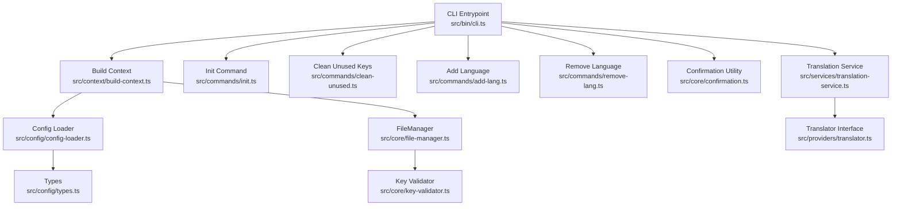
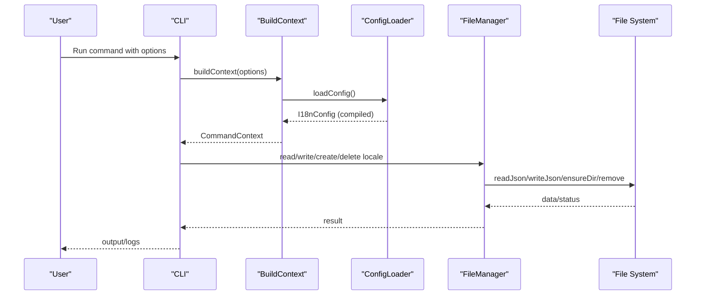
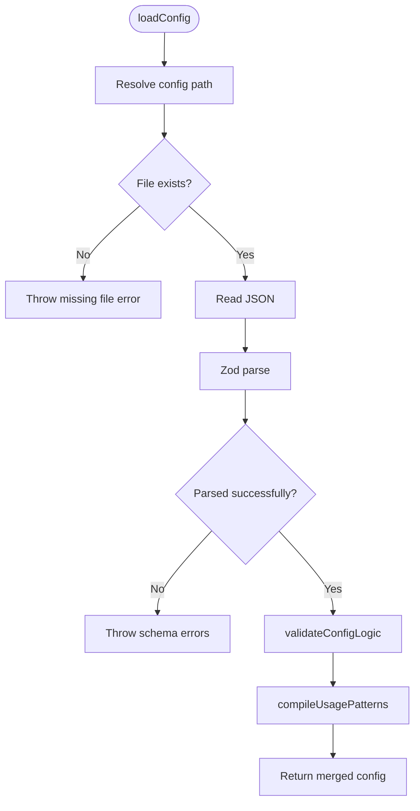
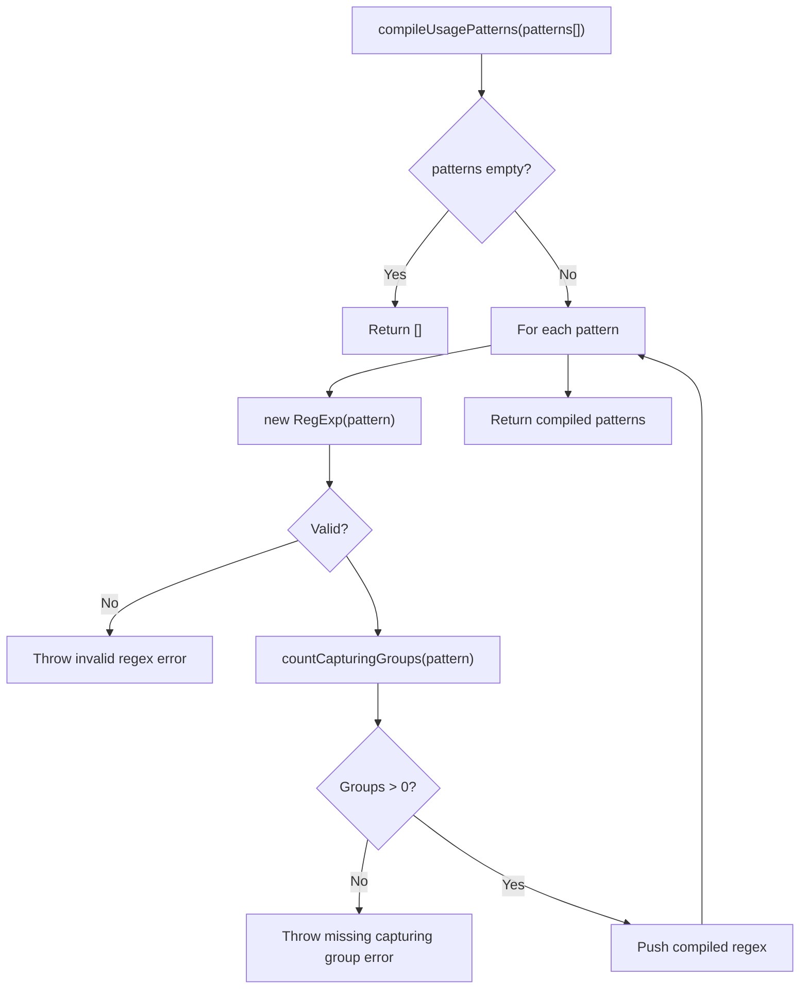
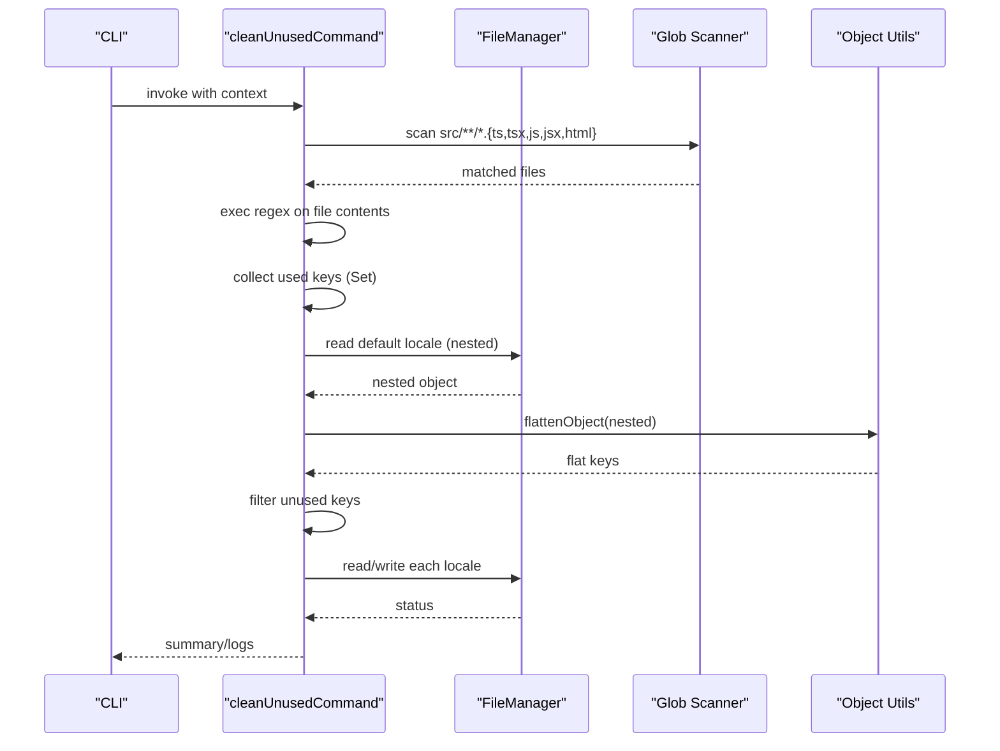
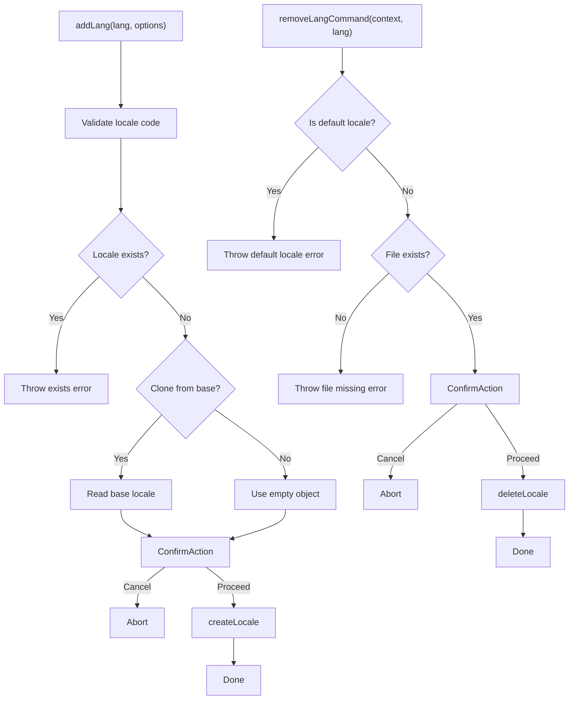
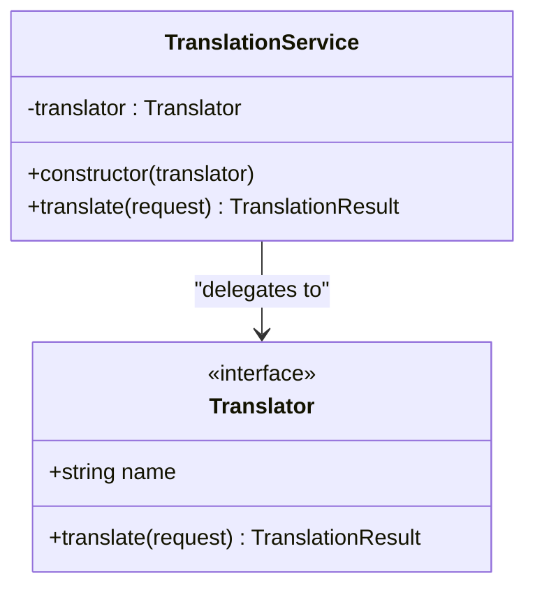
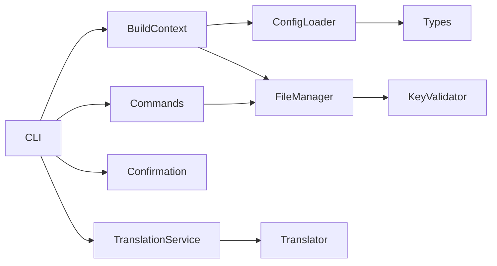

# Advanced Configuration Scenarios

<cite>
**Referenced Files in This Document**
- [package.json](file://package.json)
- [README.md](file://README.md)
- [src/bin/cli.ts](file://src/bin/cli.ts)
- [src/config/config-loader.ts](file://src/config/config-loader.ts)
- [src/config/types.ts](file://src/config/types.ts)
- [src/context/build-context.ts](file://src/context/build-context.ts)
- [src/context/types.ts](file://src/context/types.ts)
- [src/core/file-manager.ts](file://src/core/file-manager.ts)
- [src/core/key-validator.ts](file://src/core/key-validator.ts)
- [src/core/confirmation.ts](file://src/core/confirmation.ts)
- [src/commands/init.ts](file://src/commands/init.ts)
- [src/commands/clean-unused.ts](file://src/commands/clean-unused.ts)
- [src/commands/add-lang.ts](file://src/commands/add-lang.ts)
- [src/commands/remove-lang.ts](file://src/commands/remove-lang.ts)
- [src/providers/translator.ts](file://src/providers/translator.ts)
- [src/services/translation-service.ts](file://src/services/translation-service.ts)
</cite>

## Table of Contents
1. [Introduction](#introduction)
2. [Project Structure](#project-structure)
3. [Core Components](#core-components)
4. [Architecture Overview](#architecture-overview)
5. [Detailed Component Analysis](#detailed-component-analysis)
6. [Dependency Analysis](#dependency-analysis)
7. [Performance Considerations](#performance-considerations)
8. [Troubleshooting Guide](#troubleshooting-guide)
9. [Conclusion](#conclusion)
10. [Appendices](#appendices)

## Introduction
This document focuses on advanced configuration scenarios for i18n-pro, covering complex setup patterns and edge cases. It explains how to configure multi-framework projects with mixed usage patterns, customize key naming conventions, manage configuration inheritance and overrides in monorepo environments, integrate with build tools (Webpack, Vite, Next.js), and operate CI/CD pipelines with environment-specific settings and secret management. It also covers performance optimization for large-scale projects, configuration validation and debugging techniques, and enterprise-level integrations with translation management systems.

## Project Structure
The project follows a modular CLI architecture with clear separation of concerns:
- CLI entrypoint defines commands and global options.
- Configuration loader validates and compiles user-defined settings.
- Context builder injects configuration and utilities into commands.
- Core modules implement file operations, validation, and confirmation logic.
- Commands orchestrate operations for language and key management.
- Provider and service layers enable translation integrations.

**Diagram sources**
- [src/bin/cli.ts:1-122](file://src/bin/cli.ts#L1-L122)
- [src/context/build-context.ts:1-16](file://src/context/build-context.ts#L1-L16)
- [src/config/config-loader.ts:1-176](file://src/config/config-loader.ts#L1-L176)
- [src/config/types.ts:1-12](file://src/config/types.ts#L1-L12)
- [src/core/file-manager.ts:1-118](file://src/core/file-manager.ts#L1-L118)
- [src/core/key-validator.ts:1-33](file://src/core/key-validator.ts#L1-L33)
- [src/core/confirmation.ts:1-42](file://src/core/confirmation.ts#L1-L42)
- [src/commands/init.ts:1-236](file://src/commands/init.ts#L1-L236)
- [src/commands/clean-unused.ts:1-138](file://src/commands/clean-unused.ts#L1-L138)
- [src/commands/add-lang.ts:1-98](file://src/commands/add-lang.ts#L1-L98)
- [src/commands/remove-lang.ts:1-74](file://src/commands/remove-lang.ts#L1-L74)
- [src/services/translation-service.ts:1-18](file://src/services/translation-service.ts#L1-L18)
- [src/providers/translator.ts:1-18](file://src/providers/translator.ts#L1-L18)

**Section sources**
- [src/bin/cli.ts:1-122](file://src/bin/cli.ts#L1-L122)
- [src/context/build-context.ts:1-16](file://src/context/build-context.ts#L1-L16)
- [src/config/config-loader.ts:1-176](file://src/config/config-loader.ts#L1-L176)
- [src/config/types.ts:1-12](file://src/config/types.ts#L1-L12)
- [src/core/file-manager.ts:1-118](file://src/core/file-manager.ts#L1-L118)
- [src/core/key-validator.ts:1-33](file://src/core/key-validator.ts#L1-L33)
- [src/core/confirmation.ts:1-42](file://src/core/confirmation.ts#L1-L42)
- [src/commands/init.ts:1-236](file://src/commands/init.ts#L1-L236)
- [src/commands/clean-unused.ts:1-138](file://src/commands/clean-unused.ts#L1-L138)
- [src/commands/add-lang.ts:1-98](file://src/commands/add-lang.ts#L1-L98)
- [src/commands/remove-lang.ts:1-74](file://src/commands/remove-lang.ts#L1-L74)
- [src/services/translation-service.ts:1-18](file://src/services/translation-service.ts#L1-L18)
- [src/providers/translator.ts:1-18](file://src/providers/translator.ts#L1-L18)

## Core Components
- Configuration loader: Loads and validates the configuration file, compiles usage patterns, and performs logical checks (e.g., default locale inclusion and duplicate locales).
- Context builder: Assembles the runtime context for commands, injecting configuration and FileManager.
- FileManager: Handles locale file CRUD operations, JSON validation, and recursive key sorting.
- Commands: Implement language and key management operations with dry-run, CI-friendly behavior, and confirmation prompts.
- Translation service and providers: Provide a pluggable interface for integrating translation providers.

Key configuration options and their roles:
- localesPath: Directory containing translation files.
- defaultLocale: The baseline locale used for initialization and comparisons.
- supportedLocales: List of locales managed by the tool.
- keyStyle: Controls whether keys are stored flat or nested.
- usagePatterns: Regex patterns used to detect used keys during cleanup.
- autoSort: Enables automatic recursive sorting of keys.

**Section sources**
- [src/config/config-loader.ts:8-67](file://src/config/config-loader.ts#L8-L67)
- [src/config/types.ts:3-11](file://src/config/types.ts#L3-L11)
- [src/context/build-context.ts:5-16](file://src/context/build-context.ts#L5-L16)
- [src/core/file-manager.ts:45-61](file://src/core/file-manager.ts#L45-L61)
- [src/commands/clean-unused.ts:17-23](file://src/commands/clean-unused.ts#L17-L23)
- [src/commands/init.ts:19-23](file://src/commands/init.ts#L19-L23)

## Architecture Overview
The CLI orchestrates commands that rely on a shared configuration and FileManager. The configuration is loaded once per command invocation and compiled for runtime usage. Commands delegate file operations to FileManager, which ensures JSON validity and applies sorting according to configuration.

**Diagram sources**
- [src/bin/cli.ts:47-111](file://src/bin/cli.ts#L47-L111)
- [src/context/build-context.ts:5-16](file://src/context/build-context.ts#L5-L16)
- [src/config/config-loader.ts:24-67](file://src/config/config-loader.ts#L24-L67)
- [src/core/file-manager.ts:31-98](file://src/core/file-manager.ts#L31-L98)

## Detailed Component Analysis

### Configuration Loading and Validation
The configuration loader enforces:
- Presence of the configuration file.
- Valid JSON parsing.
- Zod schema validation with meaningful error messages.
- Logical checks: default locale must be supported; supported locales must not contain duplicates.
- Compilation of usage patterns into RegExp arrays with capturing group validation.

**Diagram sources**
- [src/config/config-loader.ts:24-67](file://src/config/config-loader.ts#L24-L67)
- [src/config/config-loader.ts:69-82](file://src/config/config-loader.ts#L69-L82)
- [src/config/config-loader.ts:84-109](file://src/config/config-loader.ts#L84-L109)

**Section sources**
- [src/config/config-loader.ts:24-109](file://src/config/config-loader.ts#L24-L109)
- [src/config/types.ts:3-11](file://src/config/types.ts#L3-L11)

### Usage Pattern Compilation and Validation
Usage patterns are compiled into regular expressions and validated to ensure:
- They are valid regex.
- They include at least one capturing group to extract the key.

**Diagram sources**
- [src/config/config-loader.ts:84-109](file://src/config/config-loader.ts#L84-L109)
- [src/config/config-loader.ts:111-161](file://src/config/config-loader.ts#L111-L161)

**Section sources**
- [src/config/config-loader.ts:84-161](file://src/config/config-loader.ts#L84-L161)

### Cleanup Workflow and Key Filtering
The cleanup command scans source files using compiled usage patterns, flattens keys from the default locale, identifies unused keys, and rebuilds locale files according to keyStyle.

**Diagram sources**
- [src/commands/clean-unused.ts:8-138](file://src/commands/clean-unused.ts#L8-L138)
- [src/core/file-manager.ts:31-43](file://src/core/file-manager.ts#L31-L43)

**Section sources**
- [src/commands/clean-unused.ts:17-124](file://src/commands/clean-unused.ts#L17-L124)
- [src/core/file-manager.ts:50-61](file://src/core/file-manager.ts#L50-L61)

### Language Management Commands
- Add language: Validates locale codes (supports ISO 639-1 and extended codes like xx-YY), optionally clones content from a base locale, and creates the locale file.
- Remove language: Prevents removal of the default locale, verifies file existence, and deletes the locale file.

**Diagram sources**
- [src/commands/add-lang.ts:26-98](file://src/commands/add-lang.ts#L26-L98)
- [src/commands/remove-lang.ts:5-74](file://src/commands/remove-lang.ts#L5-L74)

**Section sources**
- [src/commands/add-lang.ts:11-98](file://src/commands/add-lang.ts#L11-L98)
- [src/commands/remove-lang.ts:14-72](file://src/commands/remove-lang.ts#L14-L72)

### Translation Provider Integration
The translation service exposes a simple interface to delegate translation requests to pluggable providers. The provider interface defines a name and a translate method.

**Diagram sources**
- [src/services/translation-service.ts:7-17](file://src/services/translation-service.ts#L7-L17)
- [src/providers/translator.ts:14-17](file://src/providers/translator.ts#L14-L17)

**Section sources**
- [src/services/translation-service.ts:1-18](file://src/services/translation-service.ts#L1-L18)
- [src/providers/translator.ts:1-18](file://src/providers/translator.ts#L1-L18)

### Advanced Configuration Scenarios

#### Multi-Framework Projects with Mixed Usage Patterns
- Define usagePatterns to capture framework-specific translation function calls and key extraction formats.
- Use named capturing groups to standardize key extraction across frameworks.
- Validate patterns compile and include capturing groups to avoid silent failures.

Practical guidance:
- Add patterns for each framework’s translation API.
- Keep patterns minimal and precise to reduce false positives.
- Test patterns against representative source files before running cleanup.

**Section sources**
- [src/config/config-loader.ts:84-109](file://src/config/config-loader.ts#L84-L109)
- [src/commands/clean-unused.ts:17-46](file://src/commands/clean-unused.ts#L17-L46)

#### Custom Key Naming Conventions
- Configure keyStyle to enforce either flat or nested key structures.
- Use autoSort to maintain consistent ordering across locales.
- Leverage keyValidator to prevent structural conflicts when adding keys.

Recommendations:
- Choose flat keys for simpler tooling and fewer merge conflicts.
- Choose nested keys for hierarchical organization and readability.
- Combine with usagePatterns to ensure consistent key naming across the codebase.

**Section sources**
- [src/config/types.ts:3-11](file://src/config/types.ts#L3-L11)
- [src/core/file-manager.ts:100-115](file://src/core/file-manager.ts#L100-L115)
- [src/core/key-validator.ts:1-33](file://src/core/key-validator.ts#L1-L33)

#### Monorepos and Multiple Packages
- Place a single i18n-pro.config.json at the workspace root to centralize configuration.
- Use localesPath to point to a shared directory across packages.
- Ensure supportedLocales lists all locales used by the monorepo.
- Run commands from the workspace root to scan all packages’ source files.

Operational tips:
- Keep defaultLocale consistent across packages.
- Align usagePatterns across packages to ensure accurate cleanup.
- Use CI mode to enforce no unintended changes.

**Section sources**
- [src/config/config-loader.ts:19-22](file://src/config/config-loader.ts#L19-L22)
- [src/commands/clean-unused.ts:26-27](file://src/commands/clean-unused.ts#L26-L27)

#### Build Tool Integrations
- Webpack/Vite: Integrate i18n-pro as part of build scripts to validate and clean translations pre-deploy.
- Next.js: Add i18n-pro commands to pre-commit hooks or CI jobs to prevent stale keys from reaching production.

Recommended approach:
- Add npm scripts to run cleanup and dry-run checks.
- Use --ci and --dry-run to gate PRs and deployments.

**Section sources**
- [README.md:257-275](file://README.md#L257-L275)
- [src/bin/cli.ts:21-28](file://src/bin/cli.ts#L21-L28)

#### CI/CD Pipeline Configuration
- Use --ci to disable interactive prompts and fail on changes.
- Use --dry-run to preview changes before applying.
- Combine with --yes to auto-apply changes in trusted environments.
- Manage secrets for translation providers via environment variables and CI secrets.

Best practices:
- Fail early on configuration errors.
- Separate lint/cleanup steps from deployment steps.
- Store provider credentials in CI secrets and pass via environment variables.

**Section sources**
- [src/bin/cli.ts:21-28](file://src/bin/cli.ts#L21-L28)
- [src/commands/clean-unused.ts:88-92](file://src/commands/clean-unused.ts#L88-L92)
- [src/commands/init.ts:151-156](file://src/commands/init.ts#L151-L156)

#### Enterprise-Level Integrations
- Translation Management Systems: Use TranslationService to integrate with external systems via custom providers implementing the Translator interface.
- Custom locale file formats: Adjust FileManager to support alternative formats if needed, ensuring JSON compatibility for core operations.
- Advanced key filtering: Extend usagePatterns to include domain-specific filters and namespaces.

Implementation notes:
- Implement Translator.translate to map i18n-pro requests to provider APIs.
- Wrap provider responses to match TranslationResult.

**Section sources**
- [src/services/translation-service.ts:7-17](file://src/services/translation-service.ts#L7-L17)
- [src/providers/translator.ts:14-17](file://src/providers/translator.ts#L14-L17)

## Dependency Analysis
The CLI depends on configuration loading and context building, which in turn depend on FileManager. Commands encapsulate business logic and rely on shared utilities for confirmation and validation.

**Diagram sources**
- [src/bin/cli.ts:1-122](file://src/bin/cli.ts#L1-L122)
- [src/context/build-context.ts:1-16](file://src/context/build-context.ts#L1-L16)
- [src/config/config-loader.ts:1-176](file://src/config/config-loader.ts#L1-L176)
- [src/core/file-manager.ts:1-118](file://src/core/file-manager.ts#L1-L118)
- [src/core/key-validator.ts:1-33](file://src/core/key-validator.ts#L1-L33)
- [src/core/confirmation.ts:1-42](file://src/core/confirmation.ts#L1-L42)
- [src/services/translation-service.ts:1-18](file://src/services/translation-service.ts#L1-L18)
- [src/providers/translator.ts:1-18](file://src/providers/translator.ts#L1-L18)

**Section sources**
- [src/bin/cli.ts:1-122](file://src/bin/cli.ts#L1-L122)
- [src/context/build-context.ts:1-16](file://src/context/build-context.ts#L1-L16)
- [src/config/config-loader.ts:1-176](file://src/config/config-loader.ts#L1-L176)
- [src/core/file-manager.ts:1-118](file://src/core/file-manager.ts#L1-L118)
- [src/core/key-validator.ts:1-33](file://src/core/key-validator.ts#L1-L33)
- [src/core/confirmation.ts:1-42](file://src/core/confirmation.ts#L1-L42)
- [src/services/translation-service.ts:1-18](file://src/services/translation-service.ts#L1-L18)
- [src/providers/translator.ts:1-18](file://src/providers/translator.ts#L1-L18)

## Performance Considerations
- Large project scaling:
  - Narrow usagePatterns to reduce regex overhead and false matches.
  - Limit source file scanning scope by adjusting glob patterns if extending the scanner.
  - Use --dry-run to estimate impact before running destructive operations.
- Sorting performance:
  - autoSort triggers recursive sorting; disable for very large files if performance is critical, understanding the trade-off in maintainability.
- File I/O:
  - FileManager writes JSON with indentation; consider disabling autoSort and batching writes if optimizing for speed.

[No sources needed since this section provides general guidance]

## Troubleshooting Guide
Common advanced configuration issues and resolutions:
- Configuration file not found:
  - Ensure i18n-pro.config.json exists in the project root or initialize with the init command.
- Invalid configuration schema:
  - Review reported field errors and fix types/values; re-run after corrections.
- Duplicate locales in supportedLocales:
  - Remove duplicates and ensure defaultLocale is included.
- Invalid usagePatterns:
  - Fix regex syntax and ensure at least one capturing group; test patterns against sample files.
- CI mode rejections:
  - Use --yes to auto-confirm or adjust workflow to run in interactive mode when needed.
- Dry run vs. actual changes:
  - Use --dry-run to preview; apply changes by removing --dry-run and optionally adding --yes in CI.

**Section sources**
- [src/config/config-loader.ts:27-54](file://src/config/config-loader.ts#L27-L54)
- [src/config/config-loader.ts:76-82](file://src/config/config-loader.ts#L76-L82)
- [src/config/config-loader.ts:92-108](file://src/config/config-loader.ts#L92-L108)
- [src/commands/clean-unused.ts:19-23](file://src/commands/clean-unused.ts#L19-L23)
- [src/bin/cli.ts:21-28](file://src/bin/cli.ts#L21-L28)

## Conclusion
i18n-pro provides a robust foundation for advanced internationalization workflows. By leveraging configuration validation, structured usage patterns, and CI-friendly operations, teams can scale translation management across complex, multi-framework projects and monorepos. Integrating with translation providers and build tools enables seamless automation, while careful configuration tuning ensures performance and reliability at scale.

[No sources needed since this section summarizes without analyzing specific files]

## Appendices

### Configuration Reference
- localesPath: Directory containing translation files.
- defaultLocale: Baseline locale code.
- supportedLocales: List of managed locales.
- keyStyle: flat or nested key structure.
- usagePatterns: Regex patterns to detect used keys.
- autoSort: Enable recursive key sorting.

**Section sources**
- [README.md:80-90](file://README.md#L80-L90)
- [src/config/types.ts:3-11](file://src/config/types.ts#L3-L11)

### Example Workflows
- Initialize configuration with defaults or wizard-driven prompts.
- Add a new language and optionally clone from an existing locale.
- Clean unused keys with dry-run preview and CI gating.
- Integrate translation providers via TranslationService.

**Section sources**
- [src/commands/init.ts:25-182](file://src/commands/init.ts#L25-L182)
- [src/commands/add-lang.ts:26-98](file://src/commands/add-lang.ts#L26-L98)
- [src/commands/clean-unused.ts:8-138](file://src/commands/clean-unused.ts#L8-L138)
- [src/services/translation-service.ts:7-17](file://src/services/translation-service.ts#L7-L17)