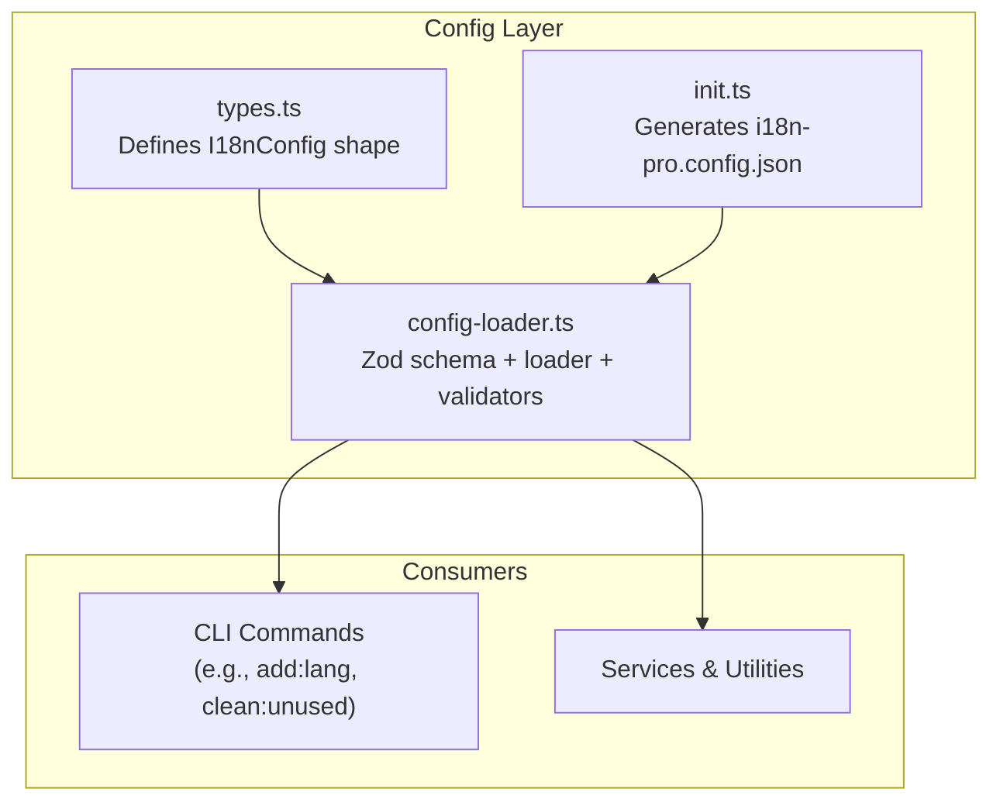
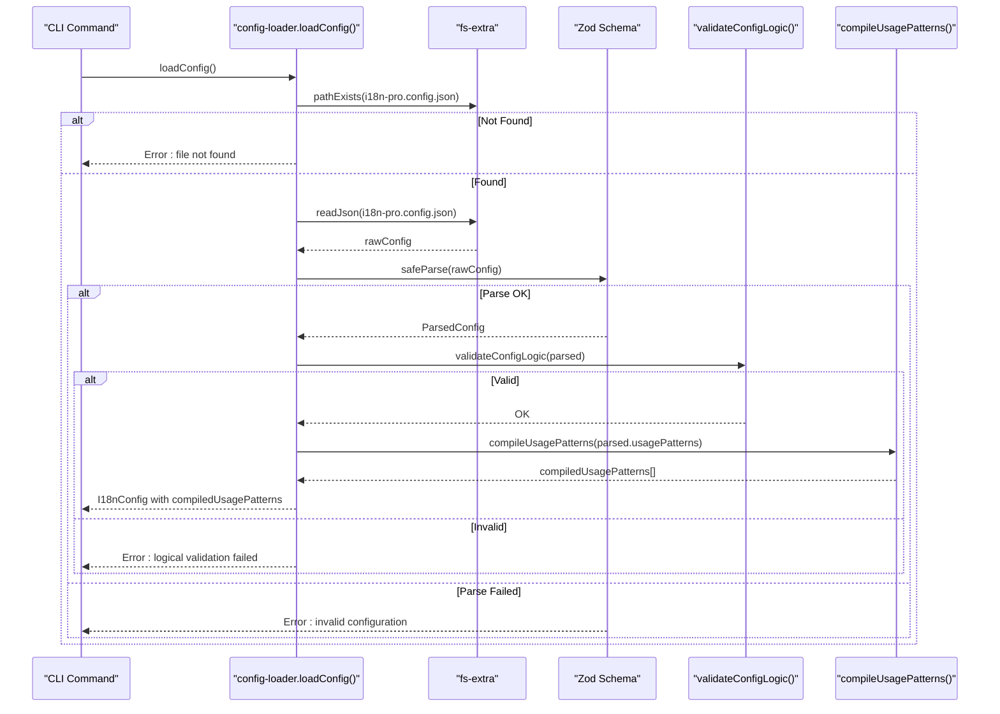
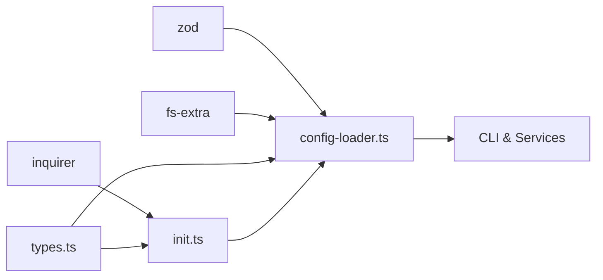

# Configuration File Structure

<cite>
**Referenced Files in This Document**
- [types.ts](file://src/config/types.ts)
- [config-loader.ts](file://src/config/config-loader.ts)
- [config-loader.test.ts](file://src/config/config-loader.test.ts)
- [init.ts](file://src/commands/init.ts)
- [init.test.ts](file://src/commands/init.test.ts)
- [README.md](file://README.md)
- [package.json](file://package.json)
</cite>

## Table of Contents
1. [Introduction](#introduction)
2. [Project Structure](#project-structure)
3. [Core Components](#core-components)
4. [Architecture Overview](#architecture-overview)
5. [Detailed Component Analysis](#detailed-component-analysis)
6. [Dependency Analysis](#dependency-analysis)
7. [Performance Considerations](#performance-considerations)
8. [Troubleshooting Guide](#troubleshooting-guide)
9. [Conclusion](#conclusion)
10. [Appendices](#appendices)

## Introduction
This document explains the i18n-pro configuration file structure and schema for i18n-pro.config.json. It covers all configuration properties, validation rules, defaults, and the discovery and precedence behavior. It also provides step-by-step guidance for creating and modifying configuration files, along with common pitfalls and error messages.

## Project Structure
The configuration system lives under src/config and is consumed by CLI commands and services. The key files are:
- Types define the shape of the configuration object.
- Loader validates and loads the configuration from disk.
- Init command generates a configuration file with defaults and optional prompts.
- Tests validate loader behavior and error conditions.

**Diagram sources**
- [types.ts:3-11](file://src/config/types.ts#L3-L11)
- [config-loader.ts:8-176](file://src/config/config-loader.ts#L8-L176)
- [init.ts:10-236](file://src/commands/init.ts#L10-L236)

**Section sources**
- [types.ts:1-12](file://src/config/types.ts#L1-L12)
- [config-loader.ts:6-22](file://src/config/config-loader.ts#L6-L22)
- [init.ts:19-236](file://src/commands/init.ts#L19-L236)

## Core Components
- Configuration file name: i18n-pro.config.json
- Discovery: Loaded from the current working directory (project root).
- Validation: Zod schema with explicit defaults for optional fields.
- Post-processing: usagePatterns compiled to RegExp array; logical checks performed after parsing.

Key properties:
- localesPath: string (required)
- defaultLocale: string (required, min length 2)
- supportedLocales: string[] (required, items min length 2; must include defaultLocale; no duplicates)
- keyStyle: "flat" | "nested" (optional, default "nested")
- usagePatterns: string[] (optional, default []; must compile to RegExp; must include a capturing group)
- autoSort: boolean (optional, default true)

Defaults and behavior are enforced by the Zod schema and runtime validators.

**Section sources**
- [types.ts:3-11](file://src/config/types.ts#L3-L11)
- [config-loader.ts:8-15](file://src/config/config-loader.ts#L8-L15)
- [config-loader.ts:69-82](file://src/config/config-loader.ts#L69-L82)
- [config-loader.ts:84-109](file://src/config/config-loader.ts#L84-L109)

## Architecture Overview
The configuration loading pipeline:

**Diagram sources**
- [config-loader.ts:24-67](file://src/config/config-loader.ts#L24-L67)
- [config-loader.ts:69-82](file://src/config/config-loader.ts#L69-L82)
- [config-loader.ts:84-109](file://src/config/config-loader.ts#L84-L109)

## Detailed Component Analysis

### Configuration Schema and Defaults
- Required vs optional:
  - Required: localesPath, defaultLocale, supportedLocales
  - Optional with defaults: keyStyle ("nested"), usagePatterns ([]), autoSort (true)
- Zod schema enforces:
  - localesPath: non-empty string
  - defaultLocale: at least 2 characters
  - supportedLocales: array of strings, each at least 2 characters
  - keyStyle: enum "flat" | "nested" with default "nested"
  - usagePatterns: array of strings with default []
  - autoSort: boolean with default true

**Section sources**
- [config-loader.ts:8-15](file://src/config/config-loader.ts#L8-L15)
- [config-loader.ts:17](file://src/config/config-loader.ts#L17)

### Logical Validation
After Zod parsing, two logical checks occur:
- defaultLocale must be present in supportedLocales
- supportedLocales must not contain duplicates

These checks ensure consistency and prevent runtime errors downstream.

**Section sources**
- [config-loader.ts:69-82](file://src/config/config-loader.ts#L69-L82)

### Usage Patterns Compilation
- If usagePatterns is empty, compiledUsagePatterns is an empty array.
- Each pattern is compiled to a RegExp with global flag.
- Patterns must include at least one capturing group (named or unnamed). Non-capturing groups and lookahead/lookbehind constructs are rejected.
- Invalid regex throws an error indicating the failing index.

This ensures the clean:unused command can extract keys reliably.

**Section sources**
- [config-loader.ts:84-109](file://src/config/config-loader.ts#L84-L109)
- [config-loader.ts:111-161](file://src/config/config-loader.ts#L111-L161)

### Configuration Discovery and Precedence
- File name: i18n-pro.config.json
- Location: Current working directory (project root)
- Resolution: Absolute path built from process.cwd() + filename
- Precedence: Only one configuration file is considered; the loader reads the file at the discovered path and does not merge multiple files.

**Section sources**
- [config-loader.ts:6](file://src/config/config-loader.ts#L6)
- [config-loader.ts:19-22](file://src/config/config-loader.ts#L19-L22)
- [config-loader.ts:24-32](file://src/config/config-loader.ts#L24-L32)

### Initialization and Defaults
The init command creates a configuration file with:
- Default localesPath: "./locales"
- Default defaultLocale: "en"
- Default supportedLocales: ["en"]
- Default keyStyle: "nested"
- Default autoSort: true
- Default usagePatterns: includes common patterns for t(), translate(), and i18n.t()

It also ensures the default locale file exists and normalizes supported locales (deduplicates and includes defaultLocale).

**Section sources**
- [init.ts:19-23](file://src/commands/init.ts#L19-L23)
- [init.ts:134-147](file://src/commands/init.ts#L134-L147)
- [init.ts:191-208](file://src/commands/init.ts#L191-L208)
- [init.ts:210-235](file://src/commands/init.ts#L210-L235)

### Minimal and Comprehensive Configuration Examples
- Minimal configuration: Provide localesPath, defaultLocale, supportedLocales. Other fields will use defaults.
- Comprehensive configuration: Include keyStyle, usagePatterns, autoSort. usagePatterns must include capturing groups.

See the README for a complete example and descriptions of keyStyle and usagePatterns.

**Section sources**
- [README.md:65-78](file://README.md#L65-L78)
- [README.md:80-89](file://README.md#L80-L89)
- [README.md:111-127](file://README.md#L111-L127)

### Step-by-Step: Creating a Configuration File from Scratch
1. Open a terminal in your project root.
2. Run the initialization wizard:
   - Interactive mode: i18n-pro init
   - Non-interactive mode: i18n-pro init --yes
3. The wizard writes i18n-pro.config.json with defaults and creates the default locale file if needed.
4. Optionally edit i18n-pro.config.json to adjust localesPath, defaultLocale, supportedLocales, keyStyle, usagePatterns, and autoSort.

**Section sources**
- [init.ts:25-182](file://src/commands/init.ts#L25-L182)
- [README.md:57-61](file://README.md#L57-L61)

### Step-by-Step: Modifying an Existing Configuration File
1. Open i18n-pro.config.json in your project root.
2. Adjust localesPath to point to your translation directory.
3. Set defaultLocale to your primary language code.
4. Update supportedLocales to include all languages; ensure defaultLocale is present and there are no duplicates.
5. Choose keyStyle ("nested" or "flat").
6. Add usagePatterns if you want custom key detection; each pattern must include a capturing group.
7. Set autoSort to true or false as desired.
8. Save the file and run a validation command (e.g., dry-run of clean:unused) to verify.

**Section sources**
- [config-loader.ts:69-82](file://src/config/config-loader.ts#L69-L82)
- [config-loader.ts:84-109](file://src/config/config-loader.ts#L84-L109)
- [README.md:187-200](file://README.md#L187-L200)

## Dependency Analysis
- Dependencies:
  - Zod for schema validation
  - fs-extra for filesystem operations
  - inquirer used by init for prompts (optional)
- Internal dependencies:
  - types.ts defines the I18nConfig interface used by loaders and consumers
  - config-loader.ts exports CONFIG_FILE_NAME and loadConfig
  - init.ts depends on config-loader for compilation/validation and writes the file

**Diagram sources**
- [config-loader.ts:1-4](file://src/config/config-loader.ts#L1-L4)
- [init.ts:1-8](file://src/commands/init.ts#L1-L8)
- [package.json:26-35](file://package.json#L26-L35)

**Section sources**
- [package.json:26-35](file://package.json#L26-L35)
- [types.ts:1-12](file://src/config/types.ts#L1-L12)
- [config-loader.ts:1-4](file://src/config/config-loader.ts#L1-L4)
- [init.ts:1-8](file://src/commands/init.ts#L1-L8)

## Performance Considerations
- Loading and validating configuration is lightweight; occurs once per command invocation.
- usagePatterns compilation happens once during load and is reused across operations.
- Regex compilation cost scales linearly with the number of patterns; keep usagePatterns concise.

[No sources needed since this section provides general guidance]

## Troubleshooting Guide

Common configuration file placement issues:
- The configuration file must be named i18n-pro.config.json and placed in the project root (current working directory).
- If the file is missing, the loader throws a clear error instructing to run the init command.

Validation error messages:
- Configuration file not found in project root: indicates missing or misplaced file.
- Failed to parse i18n-pro.config.json: indicates invalid JSON syntax.
- Invalid configuration in i18n-pro.config.json: indicates schema violations; the loader lists field-level issues.
- defaultLocale must be included in supportedLocales: fix supportedLocales to include defaultLocale.
- Duplicate locales found in supportedLocales: remove duplicates.
- Invalid regex in usagePatterns[index]: fix the regex or quoting.
- usagePatterns[index] must include a capturing group: add a capturing group to the pattern.
- Non-capturing groups and lookahead/lookbehind are rejected: use capturing groups instead.

**Section sources**
- [config-loader.ts:27-42](file://src/config/config-loader.ts#L27-L42)
- [config-loader.ts:46-54](file://src/config/config-loader.ts#L46-L54)
- [config-loader.ts:69-82](file://src/config/config-loader.ts#L69-L82)
- [config-loader.ts:92-105](file://src/config/config-loader.ts#L92-L105)
- [config-loader.test.ts:29-86](file://src/config/config-loader.test.ts#L29-L86)

## Conclusion
The i18n-pro configuration system centers on a single, well-specified JSON file with robust Zod-based validation and sensible defaults. The loader enforces both schema correctness and logical consistency, while the init command provides a guided way to create a valid configuration. By following the examples and troubleshooting guidance here, you can confidently set up and maintain your configuration.

[No sources needed since this section summarizes without analyzing specific files]

## Appendices

### Property Reference
- localesPath: string (required)
- defaultLocale: string (required, min length 2)
- supportedLocales: string[] (required, items min length 2; must include defaultLocale; no duplicates)
- keyStyle: "flat" | "nested" (optional, default "nested")
- usagePatterns: string[] (optional, default []; must compile to RegExp; must include a capturing group)
- autoSort: boolean (optional, default true)

**Section sources**
- [config-loader.ts:8-15](file://src/config/config-loader.ts#L8-L15)
- [config-loader.ts:69-82](file://src/config/config-loader.ts#L69-L82)
- [config-loader.ts:84-109](file://src/config/config-loader.ts#L84-L109)

### Example Files
- Minimal configuration: Provide localesPath, defaultLocale, supportedLocales.
- Comprehensive configuration: Add keyStyle, usagePatterns, autoSort.

See the README for a complete example and usage pattern guidance.

**Section sources**
- [README.md:65-78](file://README.md#L65-L78)
- [README.md:80-89](file://README.md#L80-L89)
- [README.md:111-127](file://README.md#L111-L127)