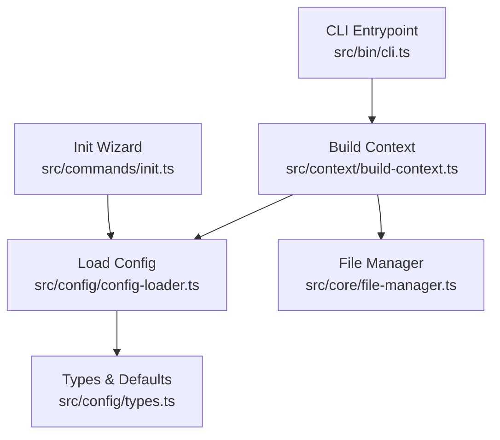
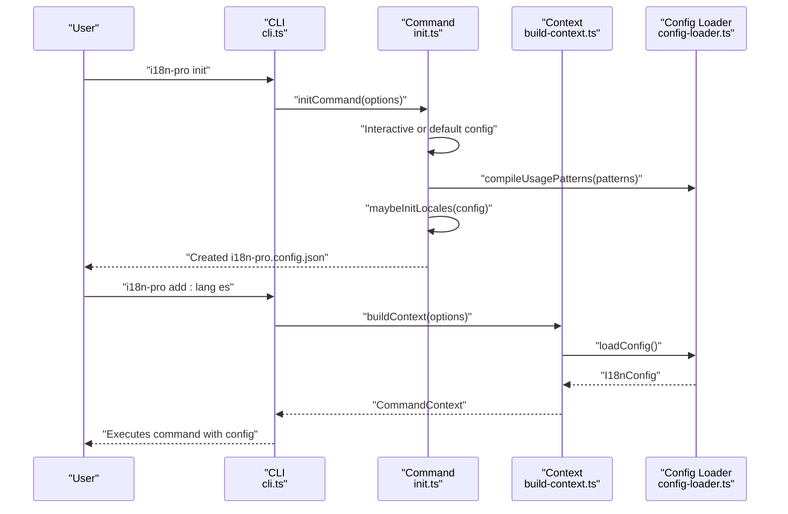
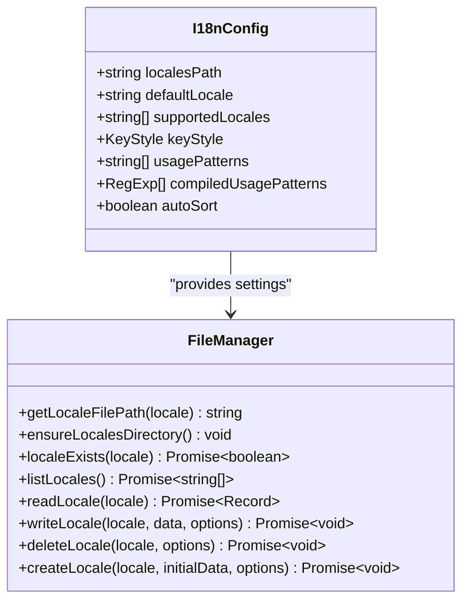
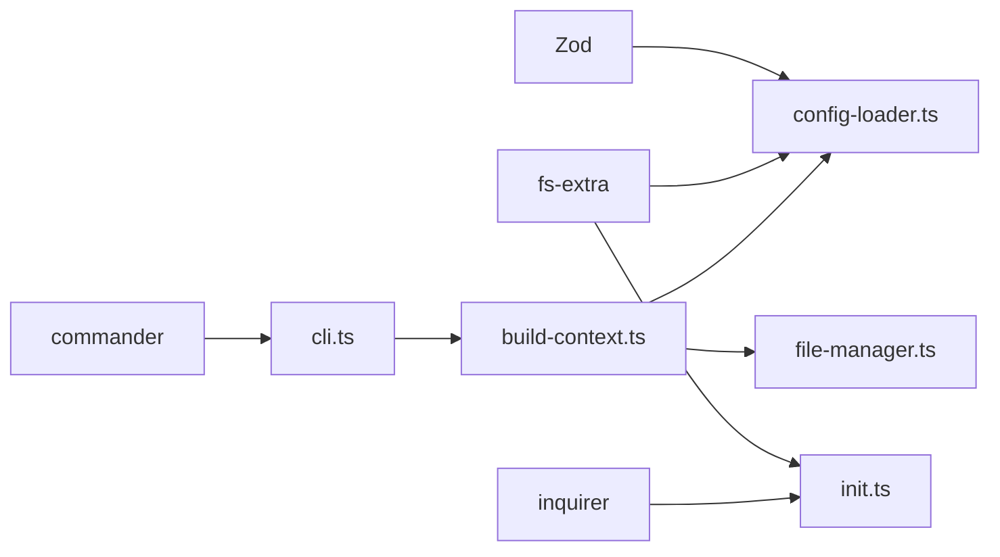

# Configuration Reference

<cite>
**Referenced Files in This Document**
- [types.ts](file://src/config/types.ts)
- [config-loader.ts](file://src/config/config-loader.ts)
- [init.ts](file://src/commands/init.ts)
- [build-context.ts](file://src/context/build-context.ts)
- [file-manager.ts](file://src/core/file-manager.ts)
- [cli.ts](file://src/bin/cli.ts)
- [config-loader.test.ts](file://src/config/config-loader.test.ts)
- [init.test.ts](file://src/commands/init.test.ts)
- [README.md](file://README.md)
</cite>

## Table of Contents
1. [Introduction](#introduction)
2. [Project Structure](#project-structure)
3. [Core Components](#core-components)
4. [Architecture Overview](#architecture-overview)
5. [Detailed Component Analysis](#detailed-component-analysis)
6. [Dependency Analysis](#dependency-analysis)
7. [Performance Considerations](#performance-considerations)
8. [Troubleshooting Guide](#troubleshooting-guide)
9. [Conclusion](#conclusion)
10. [Appendices](#appendices)

## Introduction
This document provides a comprehensive configuration reference for i18n-pro with a focus on the i18n-pro.config.json file. It explains each configuration option, its purpose, default behavior, and how it affects command behaviors. It also covers the Zod-based schema validation, interactive initialization wizard, manual configuration approaches, common mistakes, and migration strategies.

## Project Structure
The configuration system centers around a single JSON file (i18n-pro.config.json) loaded at runtime. The loader validates and normalizes the configuration, and the rest of the application consumes it through a shared context.

**Diagram sources**
- [cli.ts:1-122](file://src/bin/cli.ts#L1-L122)
- [build-context.ts:1-16](file://src/context/build-context.ts#L1-L16)
- [config-loader.ts:1-176](file://src/config/config-loader.ts#L1-L176)
- [types.ts:1-12](file://src/config/types.ts#L1-L12)
- [file-manager.ts:1-118](file://src/core/file-manager.ts#L1-L118)
- [init.ts:1-236](file://src/commands/init.ts#L1-L236)

**Section sources**
- [cli.ts:1-122](file://src/bin/cli.ts#L1-L122)
- [build-context.ts:1-16](file://src/context/build-context.ts#L1-L16)
- [config-loader.ts:1-176](file://src/config/config-loader.ts#L1-L176)
- [types.ts:1-12](file://src/config/types.ts#L1-L12)
- [file-manager.ts:1-118](file://src/core/file-manager.ts#L1-L118)
- [init.ts:1-236](file://src/commands/init.ts#L1-L236)

## Core Components
- Configuration file: i18n-pro.config.json placed at the project root.
- Schema and defaults: Defined with Zod and enforced during load.
- Runtime types: Strongly typed interface consumed by commands and services.
- Initialization wizard: Interactive and non-interactive creation of the configuration.

Key responsibilities:
- Validate required fields and enforce logical constraints.
- Apply sensible defaults for optional fields.
- Compile usage patterns into executable regular expressions.
- Provide configuration to all commands via a shared context.

**Section sources**
- [config-loader.ts:8-17](file://src/config/config-loader.ts#L8-L17)
- [types.ts:3-11](file://src/config/types.ts#L3-L11)
- [init.ts:19-23](file://src/commands/init.ts#L19-L23)

## Architecture Overview
The configuration flows through a predictable pipeline: CLI invokes commands, which build a context that loads and validates the configuration, then performs operations using the normalized settings.

**Diagram sources**
- [cli.ts:30-38](file://src/bin/cli.ts#L30-L38)
- [init.ts:25-182](file://src/commands/init.ts#L25-L182)
- [build-context.ts:5-16](file://src/context/build-context.ts#L5-L16)
- [config-loader.ts:24-67](file://src/config/config-loader.ts#L24-L67)

## Detailed Component Analysis

### Configuration Schema and Defaults
The configuration schema defines required and optional fields, their types, and defaults. Zod ensures correctness at load time, and additional logic validates relationships between fields.

- Required fields
  - localesPath: string (min length 1)
  - defaultLocale: string (min length 2)
  - supportedLocales: string[] (each item min length 2; must include defaultLocale; no duplicates)
- Optional fields with defaults
  - keyStyle: "flat" | "nested" → default "nested"
  - usagePatterns: string[] → default []
  - autoSort: boolean → default true

Validation highlights
- Logical constraint: defaultLocale must be present in supportedLocales.
- Logical constraint: supportedLocales must not contain duplicates.
- usagePatterns must compile to valid regex with at least one capturing group per pattern.

Behavioral impact
- keyStyle influences how keys are interpreted and processed by commands.
- usagePatterns drives the clean:unused command’s detection of used keys.
- autoSort controls whether translation files are written with sorted keys.

**Section sources**
- [config-loader.ts:8-17](file://src/config/config-loader.ts#L8-L17)
- [config-loader.ts:69-82](file://src/config/config-loader.ts#L69-L82)
- [config-loader.test.ts:46-86](file://src/config/config-loader.test.ts#L46-L86)
- [config-loader.test.ts:112-155](file://src/config/config-loader.test.ts#L112-L155)

### Configuration Options Reference
- localesPath
  - Purpose: Path to the directory containing translation files.
  - Type: string
  - Required: Yes
  - Notes: Resolved relative to process.cwd().
  - Impact: All file operations target this directory.

- defaultLocale
  - Purpose: The default language code used as the baseline for new keys.
  - Type: string
  - Required: Yes
  - Constraints: Must appear in supportedLocales.
  - Impact: Used as the source for new keys and in commands that require a base locale.

- supportedLocales
  - Purpose: List of enabled locales.
  - Type: string[]
  - Required: Yes
  - Constraints: Each item length ≥ 2; must not contain duplicates; must include defaultLocale.
  - Impact: Determines which locale files exist and are managed.

- keyStyle
  - Purpose: Whether keys are stored in flat dot notation or nested objects.
  - Type: "flat" | "nested"
  - Required: No
  - Default: "nested"
  - Impact: Affects how keys are represented and manipulated across commands.

- usagePatterns
  - Purpose: Regular expression patterns to detect used translation keys in source code.
  - Type: string[]
  - Required: No
  - Default: []
  - Constraints: Each pattern must compile to a valid regex and include at least one capturing group (named or standard).
  - Impact: Drives the clean:unused command’s scanning behavior.

- autoSort
  - Purpose: Whether to sort keys alphabetically when writing locale files.
  - Type: boolean
  - Required: No
  - Default: true
  - Impact: Controls output formatting of translation files.

**Section sources**
- [types.ts:3-11](file://src/config/types.ts#L3-L11)
- [config-loader.ts:8-17](file://src/config/config-loader.ts#L8-L17)
- [config-loader.ts:84-109](file://src/config/config-loader.ts#L84-L109)
- [config-loader.test.ts:174-259](file://src/config/config-loader.test.ts#L174-L259)

### Zod Schema Validation and Defaults
- Schema enforcement occurs via safeParse on the raw JSON.
- Logical validation runs after schema parsing to ensure relationships between fields.
- Defaults are applied for optional fields during load.

Common validation errors
- Missing required fields
- Invalid JSON in the configuration file
- defaultLocale not in supportedLocales
- Duplicate entries in supportedLocales
- Invalid regex in usagePatterns
- usagePatterns without capturing groups

**Section sources**
- [config-loader.ts:24-67](file://src/config/config-loader.ts#L24-L67)
- [config-loader.ts:69-82](file://src/config/config-loader.ts#L69-L82)
- [config-loader.ts:84-109](file://src/config/config-loader.ts#L84-L109)
- [config-loader.test.ts:28-54](file://src/config/config-loader.test.ts#L28-L54)
- [config-loader.test.ts:56-86](file://src/config/config-loader.test.ts#L56-L86)
- [config-loader.test.ts:174-259](file://src/config/config-loader.test.ts#L174-L259)

### Interactive Initialization Wizard
The init command supports:
- Interactive mode: Asks for localesPath, defaultLocale, supportedLocales, keyStyle, autoSort, and whether to use default usagePatterns.
- Custom usage patterns: Prompts to add multiple patterns until none remain.
- Non-interactive mode: Uses sensible defaults and writes the configuration file.
- CI-friendly behavior: Throws if changes would be made without explicit confirmation.
- Dry-run: Previews the configuration without writing.
- Force overwrite: Allows replacing an existing configuration.

Post-init actions
- Ensures the locales directory exists.
- Creates the default locale file if it does not exist.

**Section sources**
- [init.ts:25-182](file://src/commands/init.ts#L25-L182)
- [init.ts:184-208](file://src/commands/init.ts#L184-L208)
- [init.ts:210-235](file://src/commands/init.ts#L210-L235)
- [init.test.ts:50-155](file://src/commands/init.test.ts#L50-L155)
- [init.test.ts:156-290](file://src/commands/init.test.ts#L156-L290)

### Manual Configuration Approaches
- Create i18n-pro.config.json at the project root with the desired fields.
- Use defaults for optional fields to keep configurations minimal.
- Validate by running a command that loads the configuration (e.g., init or clean:unused).

**Section sources**
- [README.md:55-78](file://README.md#L55-L78)
- [config-loader.ts:24-67](file://src/config/config-loader.ts#L24-L67)

### Relationship Between Configuration and Commands
- Context building: Every command builds a context that loads the configuration before performing operations.
- File operations: FileManager uses localesPath and autoSort to manage locale files.
- Key style: While the provided files do not explicitly transform keys based on keyStyle, the configuration defines the intended structure for keys.

**Diagram sources**
- [types.ts:3-11](file://src/config/types.ts#L3-L11)
- [file-manager.ts:5-118](file://src/core/file-manager.ts#L5-L118)

**Section sources**
- [build-context.ts:5-16](file://src/context/build-context.ts#L5-L16)
- [file-manager.ts:5-118](file://src/core/file-manager.ts#L5-L118)

### Practical Examples and Scenarios
- Flat vs nested key styles
  - Flat: Keys are dot-delimited strings (e.g., auth.login.title).
  - Nested: Keys are represented as nested objects.
  - The configuration defines the intended style; commands interpret keys accordingly.

- Custom usage patterns for different frameworks
  - Default patterns detect common i18n function calls.
  - Custom patterns can target framework-specific helpers (e.g., useTranslation).
  - Patterns must include a capturing group to extract the key.

- Locale file organization
  - localesPath determines where translation files are stored.
  - The init wizard creates the directory and default locale file if missing.

**Section sources**
- [README.md:91-127](file://README.md#L91-L127)
- [init.ts:19-23](file://src/commands/init.ts#L19-L23)
- [init.ts:210-235](file://src/commands/init.ts#L210-L235)

### Migration Strategies
- Gradually introduce optional fields (e.g., add usagePatterns if not present).
- Normalize supportedLocales to ensure defaultLocale is included and duplicates are removed.
- Validate regex patterns incrementally to avoid breaking clean:unused.
- Use --dry-run to preview changes when updating configuration.

**Section sources**
- [config-loader.ts:69-82](file://src/config/config-loader.ts#L69-L82)
- [config-loader.ts:84-109](file://src/config/config-loader.ts#L84-L109)
- [init.ts:191-208](file://src/commands/init.ts#L191-L208)

## Dependency Analysis
The configuration system depends on:
- Zod for schema validation.
- fs-extra for file operations.
- inquirer for interactive prompts (init).
- commander for CLI orchestration.

**Diagram sources**
- [config-loader.ts:1-3](file://src/config/config-loader.ts#L1-L3)
- [init.ts:2-8](file://src/commands/init.ts#L2-L8)
- [cli.ts:3-6](file://src/bin/cli.ts#L3-L6)

**Section sources**
- [config-loader.ts:1-3](file://src/config/config-loader.ts#L1-L3)
- [init.ts:2-8](file://src/commands/init.ts#L2-L8)
- [cli.ts:3-6](file://src/bin/cli.ts#L3-L6)

## Performance Considerations
- Compiled usage patterns: Patterns are compiled once and reused, avoiding repeated regex construction.
- Recursive sorting: autoSort applies a recursive sort during write operations; consider disabling for very large translation files if performance becomes a concern.
- Dry-run mode: Use --dry-run to avoid unnecessary disk I/O during testing.

**Section sources**
- [config-loader.ts:59-66](file://src/config/config-loader.ts#L59-L66)
- [file-manager.ts:100-115](file://src/core/file-manager.ts#L100-L115)

## Troubleshooting Guide
Common configuration mistakes and resolutions
- Missing configuration file
  - Symptom: Error indicating the configuration file was not found.
  - Resolution: Run the init command to create the configuration file.

- Invalid JSON
  - Symptom: Error stating the configuration failed to parse.
  - Resolution: Fix syntax errors in the JSON file.

- defaultLocale not in supportedLocales
  - Symptom: Error stating defaultLocale must be included in supportedLocales.
  - Resolution: Add defaultLocale to supportedLocales or adjust defaultLocale.

- Duplicate locales in supportedLocales
  - Symptom: Error reporting duplicate locales.
  - Resolution: Remove duplicates from supportedLocales.

- Invalid regex in usagePatterns
  - Symptom: Error indicating an invalid regex.
  - Resolution: Correct the regex syntax.

- usagePatterns without capturing groups
  - Symptom: Error requiring a capturing group.
  - Resolution: Add a capturing group to each pattern (standard or named).

- CI mode without confirmation
  - Symptom: Error when running in CI without --yes.
  - Resolution: Add --yes to approve changes or run with --dry-run.

**Section sources**
- [config-loader.ts:27-54](file://src/config/config-loader.ts#L27-L54)
- [config-loader.ts:69-82](file://src/config/config-loader.ts#L69-L82)
- [config-loader.ts:84-109](file://src/config/config-loader.ts#L84-L109)
- [init.ts:151-156](file://src/commands/init.ts#L151-L156)
- [config-loader.test.ts:46-86](file://src/config/config-loader.test.ts#L46-L86)
- [config-loader.test.ts:174-259](file://src/config/config-loader.test.ts#L174-L259)

## Conclusion
The i18n-pro configuration system is designed for clarity and robustness. The Zod schema enforces correctness, sensible defaults reduce boilerplate, and the init wizard accelerates adoption. By understanding each option’s purpose and impact, you can tailor the configuration to your project’s needs and maintain a reliable i18n workflow.

## Appendices

### Configuration Options Summary
- localesPath: string (required)
- defaultLocale: string (required)
- supportedLocales: string[] (required)
- keyStyle: "flat" | "nested" (optional, default "nested")
- usagePatterns: string[] (optional, default [])
- autoSort: boolean (optional, default true)

**Section sources**
- [types.ts:3-11](file://src/config/types.ts#L3-L11)
- [config-loader.ts:8-17](file://src/config/config-loader.ts#L8-L17)