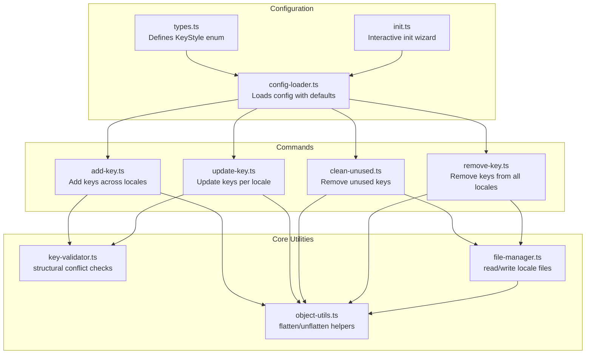
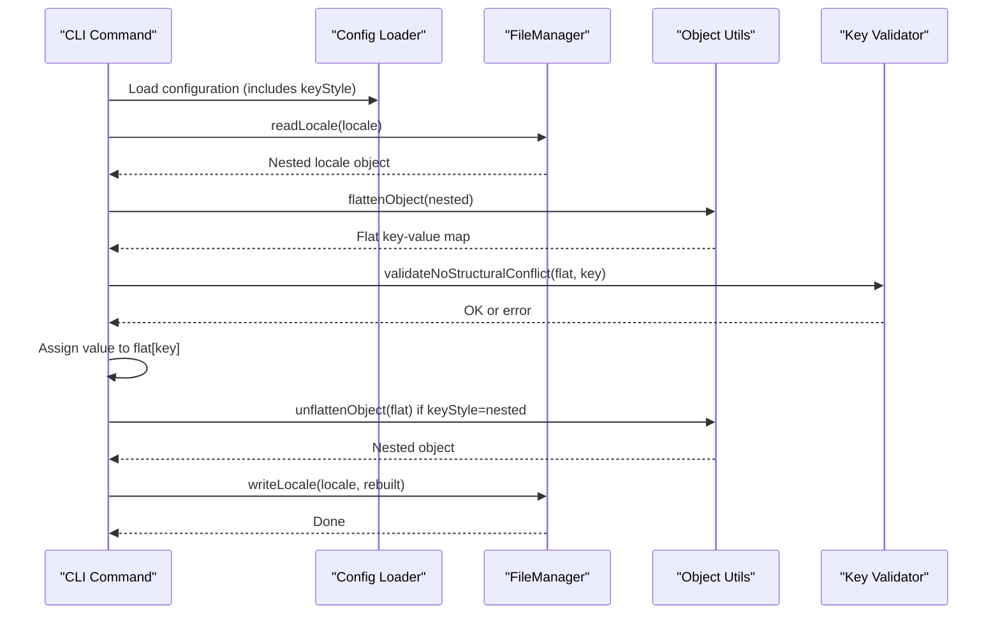
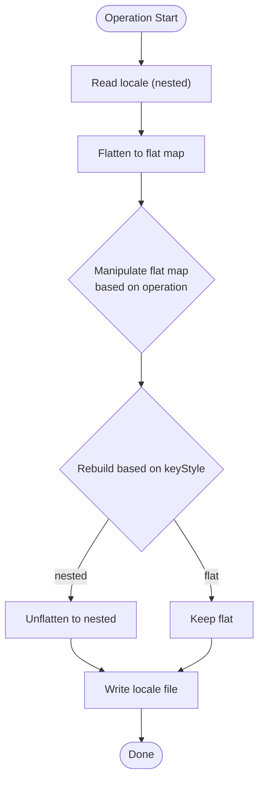
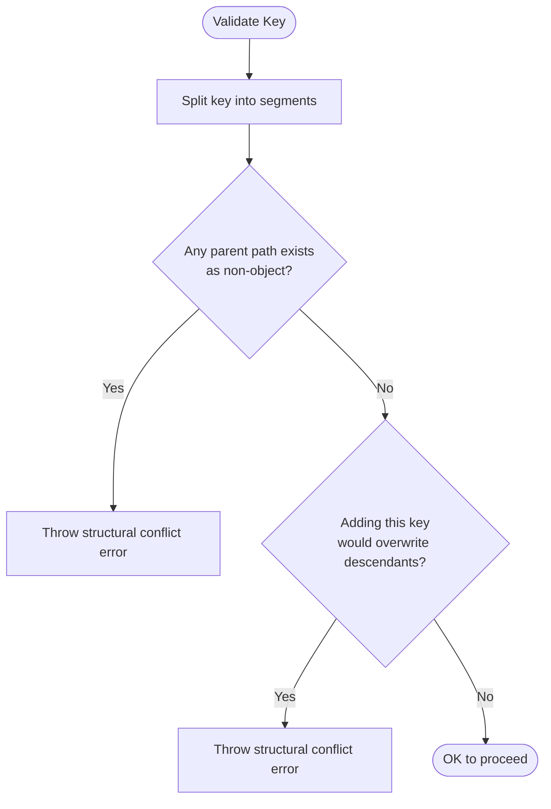
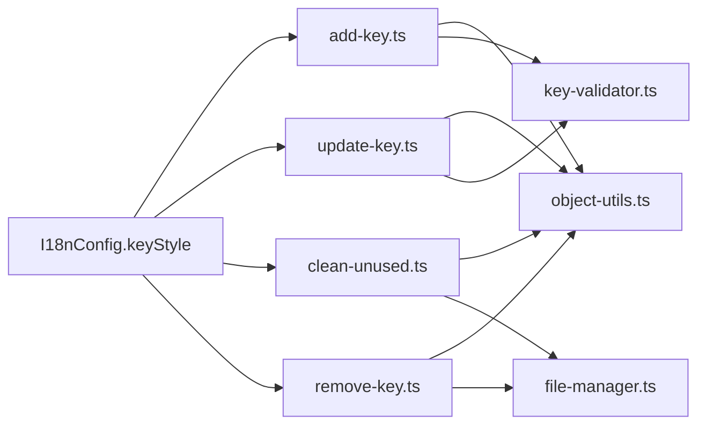

# Key Style Configuration

<cite>
**Referenced Files in This Document**
- [types.ts](file://src/config/types.ts)
- [config-loader.ts](file://src/config/config-loader.ts)
- [init.ts](file://src/commands/init.ts)
- [add-key.ts](file://src/commands/add-key.ts)
- [update-key.ts](file://src/commands/update-key.ts)
- [clean-unused.ts](file://src/commands/clean-unused.ts)
- [remove-key.ts](file://src/commands/remove-key.ts)
- [object-utils.ts](file://src/core/object-utils.ts)
- [key-validator.ts](file://src/core/key-validator.ts)
- [file-manager.ts](file://src/core/file-manager.ts)
- [object-utils.test.ts](file://src/core/object-utils.test.ts)
- [add-key.test.ts](file://src/commands/add-key.test.ts)
- [README.md](file://README.md)
</cite>

## Table of Contents
1. [Introduction](#introduction)
2. [Project Structure](#project-structure)
3. [Core Components](#core-components)
4. [Architecture Overview](#architecture-overview)
5. [Detailed Component Analysis](#detailed-component-analysis)
6. [Dependency Analysis](#dependency-analysis)
7. [Performance Considerations](#performance-considerations)
8. [Troubleshooting Guide](#troubleshooting-guide)
9. [Conclusion](#conclusion)
10. [Appendices](#appendices)

## Introduction
This document explains the key style configuration in i18n-pro with a focus on the choice between flat and nested key structures. It covers the KeyStyle enum, how flat keys (for example, auth.login.title) differ from nested keys (for example, { auth: { login: { title: "" } } }), and how the system automatically converts between these forms during operations. It also documents implications for frontend frameworks, migration strategies, and guidance for selecting the appropriate key style for your project.

## Project Structure
Key style is a configuration option that influences how translation keys are stored and manipulated across the system:
- Configuration definition and defaults
- Runtime behavior in commands that modify translation files
- Utilities for converting between flat and nested structures
- Validation to prevent structural conflicts

**Diagram sources**
- [types.ts:1-12](file://src/config/types.ts#L1-L12)
- [config-loader.ts:1-176](file://src/config/config-loader.ts#L1-L176)
- [init.ts:1-236](file://src/commands/init.ts#L1-L236)
- [add-key.ts:1-93](file://src/commands/add-key.ts#L1-L93)
- [update-key.ts:1-103](file://src/commands/update-key.ts#L1-L103)
- [clean-unused.ts:57-121](file://src/commands/clean-unused.ts#L57-L121)
- [remove-key.ts:1-96](file://src/commands/remove-key.ts#L1-L96)
- [object-utils.ts:1-95](file://src/core/object-utils.ts#L1-L95)
- [key-validator.ts:1-33](file://src/core/key-validator.ts#L1-L33)
- [file-manager.ts:1-118](file://src/core/file-manager.ts#L1-L118)

**Section sources**
- [types.ts:1-12](file://src/config/types.ts#L1-L12)
- [config-loader.ts:8-15](file://src/config/config-loader.ts#L8-L15)
- [init.ts:69-87](file://src/commands/init.ts#L69-L87)
- [README.md:14](file://README.md#L14)

## Core Components
- KeyStyle enum: Defines two key styles:
  - flat: Uses dot-delimited strings for keys (for example, auth.login.title)
  - nested: Uses nested objects (for example, { auth: { login: { title: "" } } })

- Configuration defaults:
  - keyStyle defaults to nested
  - autoSort defaults to true
  - usagePatterns defaults to an empty array

- Automatic conversion:
  - Commands convert locale content to a flat representation for manipulation
  - After manipulation, they rebuild either flat or nested structure depending on keyStyle

- Structural validation:
  - Prevents conflicts when adding keys that would overwrite or collide with existing structures

**Section sources**
- [types.ts:1-12](file://src/config/types.ts#L1-L12)
- [config-loader.ts:12](file://src/config/config-loader.ts#L12)
- [config-loader.ts:59-66](file://src/config/config-loader.ts#L59-L66)
- [init.ts:72-74](file://src/commands/init.ts#L72-L74)
- [add-key.ts:33](file://src/commands/add-key.ts#L33)
- [update-key.ts:45](file://src/commands/update-key.ts#L45)
- [clean-unused.ts:108-117](file://src/commands/clean-unused.ts#L108-L117)
- [remove-key.ts:74-77](file://src/commands/remove-key.ts#L74-L77)

## Architecture Overview
The key style influences how translation files are represented internally and persisted. The following sequence illustrates the typical flow for adding a key:

**Diagram sources**
- [config-loader.ts:24-67](file://src/config/config-loader.ts#L24-L67)
- [file-manager.ts:31-43](file://src/core/file-manager.ts#L31-L43)
- [file-manager.ts:45-61](file://src/core/file-manager.ts#L45-L61)
- [object-utils.ts:17-39](file://src/core/object-utils.ts#L17-L39)
- [object-utils.ts:41-64](file://src/core/object-utils.ts#L41-L64)
- [key-validator.ts:1-33](file://src/core/key-validator.ts#L1-L33)
- [add-key.ts:29-77](file://src/commands/add-key.ts#L29-L77)

## Detailed Component Analysis

### KeyStyle enum and configuration defaults
- KeyStyle is defined as a union of literal string types flat and nested.
- The configuration schema sets keyStyle to nested by default and autoSort to true.
- The interactive init wizard presents nested as the default selection for keyStyle.

Practical implications:
- New projects initialized with the default settings will use nested keys.
- Switching to flat requires explicit configuration and impacts all subsequent operations.

**Section sources**
- [types.ts:1](file://src/config/types.ts#L1)
- [config-loader.ts:12](file://src/config/config-loader.ts#L12)
- [config-loader.ts:63-66](file://src/config/config-loader.ts#L63-L66)
- [init.ts:72-74](file://src/commands/init.ts#L72-L74)

### Flat vs nested key differences
- Flat keys are dot-delimited strings representing nested paths (for example, auth.login.title).
- Nested keys are actual object hierarchies (for example, { auth: { login: { title: "" } } }).

Conversion behavior:
- Internal manipulation uses a flat representation for simplicity.
- After manipulation, the system rebuilds either flat or nested structure based on keyStyle.

Validation behavior:
- Structural conflict checks ensure that adding a key does not overwrite existing values or introduce collisions.

**Section sources**
- [object-utils.ts:17-39](file://src/core/object-utils.ts#L17-L39)
- [object-utils.ts:41-64](file://src/core/object-utils.ts#L41-L64)
- [key-validator.ts:5-19](file://src/core/key-validator.ts#L5-L19)
- [key-validator.ts:22-32](file://src/core/key-validator.ts#L22-L32)

### Automatic conversion during operations
- Add/update operations:
  - Read nested locale
  - Flatten to a flat map
  - Apply changes to the flat map
  - Rebuild nested or flat depending on keyStyle
  - Write back to disk

- Remove/clean operations:
  - Read nested locale
  - Flatten to a flat map
  - Remove or prune entries
  - Rebuild nested or flat depending on keyStyle
  - Optionally remove empty objects for nested style

**Diagram sources**
- [add-key.ts:29-77](file://src/commands/add-key.ts#L29-L77)
- [update-key.ts:41-89](file://src/commands/update-key.ts#L41-L89)
- [clean-unused.ts:107-121](file://src/commands/clean-unused.ts#L107-L121)
- [remove-key.ts:66-80](file://src/commands/remove-key.ts#L66-L80)
- [object-utils.ts:41-64](file://src/core/object-utils.ts#L41-L64)

**Section sources**
- [add-key.ts:30-74](file://src/commands/add-key.ts#L30-L74)
- [update-key.ts:42-85](file://src/commands/update-key.ts#L42-L85)
- [clean-unused.ts:108-117](file://src/commands/clean-unused.ts#L108-L117)
- [remove-key.ts:68-77](file://src/commands/remove-key.ts#L68-L77)

### Structural validation and conflict prevention
- When adding a key, the system validates that no parent or descendant path conflicts exist.
- Conflicts are detected by checking whether any parent path or descendant prefix already exists as a non-object value.

**Diagram sources**
- [key-validator.ts:5-19](file://src/core/key-validator.ts#L5-L19)
- [key-validator.ts:22-32](file://src/core/key-validator.ts#L22-L32)

**Section sources**
- [key-validator.ts:1-33](file://src/core/key-validator.ts#L1-L33)
- [add-key.test.ts:95-115](file://src/commands/add-key.test.ts#L95-L115)

### Practical examples of generated locale files
- Flat keyStyle produces a flat map-like structure in the locale file.
- Nested keyStyle produces nested objects in the locale file.

Examples are demonstrated in tests that assert the shape of the resulting locale files after operations.

**Section sources**
- [add-key.test.ts:122-132](file://src/commands/add-key.test.ts#L122-L132)
- [add-key.test.ts:142-148](file://src/commands/add-key.test.ts#L142-L148)
- [object-utils.test.ts:147-161](file://src/core/object-utils.test.ts#L147-L161)
- [object-utils.test.ts:163-177](file://src/core/object-utils.test.ts#L163-L177)

### Implications for frontend frameworks and libraries
- Many i18n libraries and tooling expect nested objects for deep access patterns.
- Using flat keys can simplify certain tooling but may require adapters or mapping layers in frameworks that assume nested structures.
- The automatic conversion ensures that framework integrations receive the expected structure based on keyStyle.

[No sources needed since this section provides general guidance]

### Migration strategies between key styles
- Plan a coordinated change across the codebase and translation files.
- Use the existing flattening/unflattening utilities as a reference for building a migration script.
- Validate structural conflicts before applying changes.
- Consider a phased rollout per locale to minimize risk.

[No sources needed since this section provides general guidance]

### Choosing the appropriate key style
- Choose nested for:
  - Projects with deep hierarchies
  - Libraries or frameworks that expect nested structures
  - Teams preferring explicit nesting for readability
- Choose flat for:
  - Simpler tooling or scripts that work with dot notation
  - Teams comfortable with dot-delimited keys
  - Projects with shallow key hierarchies

[No sources needed since this section provides general guidance]

## Dependency Analysis
Key style influences the behavior of commands and utilities that manipulate translation files. The following diagram shows how configuration flows through the system:

**Diagram sources**
- [types.ts:7](file://src/config/types.ts#L7)
- [add-key.ts:72-74](file://src/commands/add-key.ts#L72-L74)
- [update-key.ts:83-85](file://src/commands/update-key.ts#L83-L85)
- [clean-unused.ts:115-117](file://src/commands/clean-unused.ts#L115-L117)
- [remove-key.ts:75-77](file://src/commands/remove-key.ts#L75-L77)
- [object-utils.ts:17-39](file://src/core/object-utils.ts#L17-L39)
- [key-validator.ts:1-33](file://src/core/key-validator.ts#L1-L33)
- [file-manager.ts:52-54](file://src/core/file-manager.ts#L52-L54)

**Section sources**
- [types.ts:3-11](file://src/config/types.ts#L3-L11)
- [add-key.ts:71-76](file://src/commands/add-key.ts#L71-L76)
- [update-key.ts:82-87](file://src/commands/update-key.ts#L82-L87)
- [clean-unused.ts:114-121](file://src/commands/clean-unused.ts#L114-L121)
- [remove-key.ts:74-80](file://src/commands/remove-key.ts#L74-L80)

## Performance Considerations
- Converting between flat and nested structures is linear in the number of keys.
- Auto-sorting is applied during write-back; disabling it can reduce overhead if sorting is not required.
- Structural validation adds minimal overhead but prevents costly mistakes.

[No sources needed since this section provides general guidance]

## Troubleshooting Guide
Common issues and resolutions:
- Structural conflict errors when adding keys:
  - Cause: Adding a key that conflicts with existing values or descendants.
  - Resolution: Adjust the key path or reconcile conflicting keys first.

- Unexpected file shapes after operations:
  - Cause: keyStyle setting differs from expectations.
  - Resolution: Verify configuration and re-run the operation.

- Dry run and CI modes:
  - Use dry run to preview changes; use CI mode with explicit flags to automate.

**Section sources**
- [key-validator.ts:12-18](file://src/core/key-validator.ts#L12-L18)
- [key-validator.ts:26-31](file://src/core/key-validator.ts#L26-L31)
- [add-key.ts:49-53](file://src/commands/add-key.ts#L49-L53)
- [update-key.ts:64-68](file://src/commands/update-key.ts#L64-L68)
- [clean-unused.ts:88-92](file://src/commands/clean-unused.ts#L88-L92)
- [remove-key.ts:49-53](file://src/commands/remove-key.ts#L49-L53)

## Conclusion
Key style is a powerful configuration that determines how translation keys are represented and manipulated. The system’s automatic conversion between flat and nested structures ensures compatibility with various tooling and frameworks. By understanding the implications and using the provided utilities and validation, teams can confidently choose and migrate between key styles to suit their project needs.

[No sources needed since this section summarizes without analyzing specific files]

## Appendices

### Appendix A: How key style affects usage in common frameworks
- React:
  - Nested keys align with typical deep access patterns in i18n libraries.
  - Flat keys can be used with adapters that map dot notation to nested access.
- Vue:
  - Many Vue i18n integrations expect nested objects; nested keyStyle fits naturally.
- Angular:
  - Angular i18n tooling often expects nested structures; nested keyStyle is recommended.
- General guidance:
  - Prefer nested for frameworks/libraries that rely on hierarchical access.
  - Prefer flat for simpler tooling or when dot-delimited keys are idiomatic.

[No sources needed since this section provides general guidance]