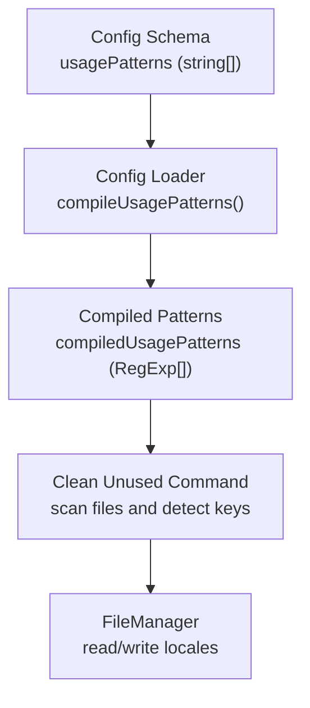
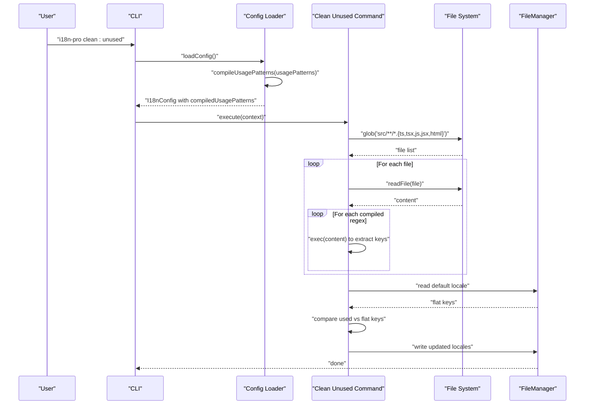
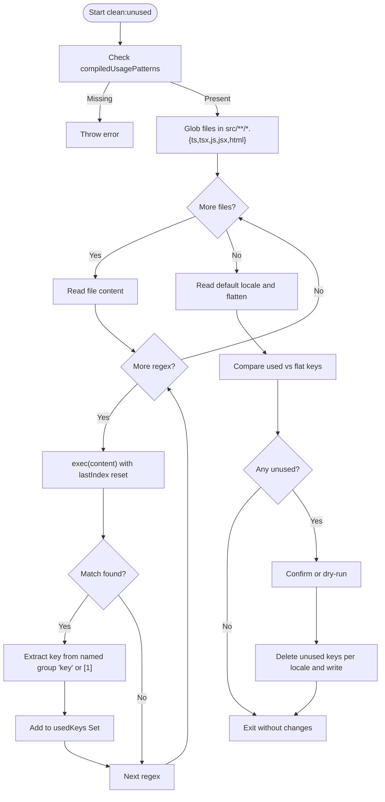
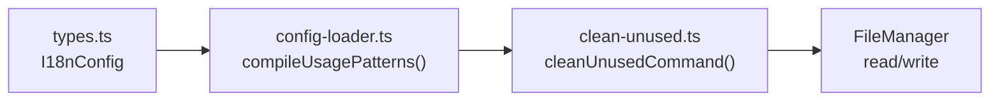

# Usage Pattern Configuration

<cite>
**Referenced Files in This Document**
- [types.ts](file://src/config/types.ts)
- [config-loader.ts](file://src/config/config-loader.ts)
- [config-loader.test.ts](file://src/config/config-loader.test.ts)
- [clean-unused.ts](file://src/commands/clean-unused.ts)
- [clean-unused.test.ts](file://src/commands/clean-unused.test.ts)
- [init.ts](file://src/commands/init.ts)
- [README.md](file://README.md)
</cite>

## Table of Contents
1. [Introduction](#introduction)
2. [Project Structure](#project-structure)
3. [Core Components](#core-components)
4. [Architecture Overview](#architecture-overview)
5. [Detailed Component Analysis](#detailed-component-analysis)
6. [Dependency Analysis](#dependency-analysis)
7. [Performance Considerations](#performance-considerations)
8. [Troubleshooting Guide](#troubleshooting-guide)
9. [Conclusion](#conclusion)
10. [Appendices](#appendices)

## Introduction
This document explains how to configure and use the usagePatterns array to enable i18n-pro to automatically detect which translation keys are actually used in your source code. It covers the regex-based key detection system, the compilation process into compiledUsagePatterns, and how the clean:unused command scans files to identify and remove unused keys. It also provides framework-specific examples, pattern syntax guidance, advanced regex patterns, troubleshooting tips, performance considerations, and migration strategies.

## Project Structure
The usage pattern configuration lives in the configuration loader and is consumed by the cleanup command. The key elements are:
- Configuration schema and types define usagePatterns and compiledUsagePatterns.
- The configuration loader compiles regex patterns and validates capturing groups.
- The cleanup command uses compiledUsagePatterns to scan source files and compare detected keys against translation files.

**Diagram sources**
- [types.ts:3-11](file://src/config/types.ts#L3-L11)
- [config-loader.ts:84-109](file://src/config/config-loader.ts#L84-L109)
- [clean-unused.ts:17-46](file://src/commands/clean-unused.ts#L17-L46)

**Section sources**
- [types.ts:3-11](file://src/config/types.ts#L3-L11)
- [config-loader.ts:84-109](file://src/config/config-loader.ts#L84-L109)
- [clean-unused.ts:17-46](file://src/commands/clean-unused.ts#L17-L46)

## Core Components
- usagePatterns: An array of regex strings used to detect translation keys in source files. Each pattern must include a capturing group that extracts the key value.
- compiledUsagePatterns: An array of compiled RegExp objects generated from usagePatterns. They are globally flagged and used to scan source content.
- Pattern validation: Ensures each pattern compiles as a valid regex and contains at least one capturing group (standard or named). Lookahead and lookbehind assertions are rejected because they do not extract keys.

These components work together so that the cleanup command can:
- Compile patterns once during config load.
- Iterate over source files and run each compiled regex to extract keys.
- Compare extracted keys against translation files and remove unused ones.

**Section sources**
- [types.ts:8-9](file://src/config/types.ts#L8-L9)
- [config-loader.ts:84-109](file://src/config/config-loader.ts#L84-L109)
- [config-loader.ts:111-161](file://src/config/config-loader.ts#L111-L161)
- [clean-unused.ts:17-46](file://src/commands/clean-unused.ts#L17-L46)

## Architecture Overview
The usage pattern pipeline consists of configuration loading, compilation, and runtime usage during cleanup.

**Diagram sources**
- [config-loader.ts:24-67](file://src/config/config-loader.ts#L24-L67)
- [config-loader.ts:84-109](file://src/config/config-loader.ts#L84-L109)
- [clean-unused.ts:26-124](file://src/commands/clean-unused.ts#L26-L124)

## Detailed Component Analysis

### Configuration Types and Schema
- usagePatterns: string[] defines the raw regex patterns.
- compiledUsagePatterns: RegExp[] holds pre-compiled patterns with global flag.
- The schema enforces that usagePatterns is an array of strings and defaults to an empty array if unspecified.

**Section sources**
- [types.ts:3-11](file://src/config/types.ts#L3-L11)
- [config-loader.ts:8-15](file://src/config/config-loader.ts#L8-L15)

### Pattern Compilation and Validation
- compileUsagePatterns:
  - Converts each string pattern into a RegExp with the global flag.
  - Throws if a pattern fails to compile.
  - Counts capturing groups to ensure at least one exists.
  - Rejects non-capturing groups, lookahead, and lookbehind assertions.

- countCapturingGroups:
  - Walks the pattern character-by-character.
  - Skips escaped characters and character classes.
  - Increments on standard capturing groups and named capturing groups, excluding lookahead/lookbehind.

- Behavior with named vs unnamed groups:
  - Both are accepted; the extraction logic uses named group "key" when present, otherwise falls back to index 1.

**Section sources**
- [config-loader.ts:84-109](file://src/config/config-loader.ts#L84-L109)
- [config-loader.ts:111-161](file://src/config/config-loader.ts#L111-L161)
- [clean-unused.ts:39](file://src/commands/clean-unused.ts#L39)

### Runtime Usage in Cleanup
- cleanUnusedCommand:
  - Validates that compiledUsagePatterns is present.
  - Scans files matching src/**/*.{ts,tsx,js,jsx,html}.
  - Executes each compiled regex against file content, resetting lastIndex per regex.
  - Extracts keys from either named group "key" or the first capturing group.
  - Compares used keys against flattened translation keys and removes unused ones from all locales.
  - Respects keyStyle to rebuild nested or flat structures.

**Diagram sources**
- [clean-unused.ts:17-124](file://src/commands/clean-unused.ts#L17-L124)

**Section sources**
- [clean-unused.ts:17-124](file://src/commands/clean-unused.ts#L17-L124)

### Framework-Specific Usage Pattern Examples
Below are examples of regex patterns tailored to common frameworks. Each pattern must include a capturing group that extracts the translation key.

- React (React hooks library):
  - Example: useTranslation hook invocation extracting the key inside quotes.
  - Pattern: matches a function call like useTranslation("key") or useTranslation('key').
  - Capturing group: captures the quoted key portion.

- Vue (Composition API):
  - Example: composable-based translation calls.
  - Pattern: matches a function call like t("key") or t('key').

- Vue (Options API with $t):
  - Example: template-style translation via $t("key").
  - Pattern: matches $t("key") or $t('key').

- Angular (translate pipe and service):
  - Pipe: matches {{ 'key' | translate }} or {{ "key" | translate }}.
  - Service: matches translate("key") or translate('key').

- Vanilla JavaScript:
  - Example: generic translation functions like t("key") or i18n.t("key").

Notes:
- Quote handling: Patterns commonly escape single or double quotes around the key.
- Case sensitivity: By default, regex is case-sensitive. To make a pattern case-insensitive, add the case-insensitive flag in the pattern string.
- Wildcards: Use dot and quantifiers (e.g., .*) to match variable parts of keys, but ensure the capturing group still isolates the intended key.

For concrete examples and defaults, see:
- Default patterns used by the init wizard.
- README usage patterns section.

**Section sources**
- [init.ts:19-23](file://src/commands/init.ts#L19-L23)
- [README.md:111-127](file://README.md#L111-L127)

### Advanced Regex Patterns and Nested Keys
- Named capturing groups:
  - Prefer (?<key>...) to explicitly name the captured key.
  - The extraction logic reads match.groups.key when present.

- Complex key structures:
  - To match nested keys like auth.login.title, ensure the capturing group includes dots and word characters as needed.
  - Escape literal dots and brackets if they appear in your quoting or key syntax.

- Escaping and special characters:
  - Always escape parentheses, brackets, and quotes in patterns.
  - The compilation logic tests patterns and throws on invalid regex.

- Global flag behavior:
  - Compiled patterns use the global flag. lastIndex is reset per file per regex to ensure consistent matching.

**Section sources**
- [config-loader.ts:93-98](file://src/config/config-loader.ts#L93-L98)
- [config-loader.ts:111-161](file://src/config/config-loader.ts#L111-L161)
- [clean-unused.ts:34-44](file://src/commands/clean-unused.ts#L34-L44)

### Pattern Matching Logic and Extraction
- Extraction precedence:
  - Named group "key" takes priority.
  - Fallback to first capturing group ([1]) when named group is absent.

- Case sensitivity:
  - Regex matching is case-sensitive by default.
  - To match uppercase/lowercase variations, adjust the pattern or add the case-insensitive flag.

- Whitespace and delimiters:
  - Patterns should isolate the key inside quotes.
  - Consider optional whitespace around the opening delimiter if your code style varies.

**Section sources**
- [clean-unused.ts:39](file://src/commands/clean-unused.ts#L39)

### Migration Guidance
- Changing frameworks:
  - Replace old patterns with new ones in usagePatterns.
  - Keep the capturing group intact to extract the key.

- Refactoring code:
  - If you rename translation functions, update patterns to match the new function names.
  - If you change quoting or key delimiters, adjust escaping accordingly.

- From defaults to custom:
  - Start with the default patterns and extend or replace as needed.
  - Validate patterns using the init wizard or by running the cleanup command in dry-run mode.

- Backward compatibility:
  - Maintain patterns that match legacy usages until migration completes.
  - Gradually phase out outdated patterns after verifying coverage.

**Section sources**
- [init.ts:83-119](file://src/commands/init.ts#L83-L119)
- [README.md:111-127](file://README.md#L111-L127)

## Dependency Analysis
The usage pattern system has clear boundaries:
- Configuration loader depends on the schema and validation utilities.
- Compiled patterns are passed to the cleanup command.
- The cleanup command depends on file system scanning and FileManager for locale operations.

**Diagram sources**
- [types.ts:3-11](file://src/config/types.ts#L3-L11)
- [config-loader.ts:84-109](file://src/config/config-loader.ts#L84-L109)
- [clean-unused.ts:104-124](file://src/commands/clean-unused.ts#L104-L124)

**Section sources**
- [types.ts:3-11](file://src/config/types.ts#L3-L11)
- [config-loader.ts:84-109](file://src/config/config-loader.ts#L84-L109)
- [clean-unused.ts:104-124](file://src/commands/clean-unused.ts#L104-L124)

## Performance Considerations
- Number of patterns:
  - Each compiled regex is executed against every file’s content. Fewer, well-scoped patterns improve performance.
- Pattern complexity:
  - Avoid overly greedy quantifiers or catastrophic backtracking. Prefer anchored or bounded patterns when possible.
- Global flag:
  - The global flag enables repeated exec calls. Reset lastIndex per file per regex to prevent sticky state issues.
- File scope:
  - The scanner targets a specific set of extensions. Limiting the glob reduces I/O overhead.
- Dry-run:
  - Use dry-run to validate patterns and scope before applying changes.

[No sources needed since this section provides general guidance]

## Troubleshooting Guide
Common issues and resolutions:
- No usagePatterns defined:
  - The cleanup command throws an error if compiledUsagePatterns is missing or empty. Ensure usagePatterns is configured.

- Invalid regex pattern:
  - The loader throws an error when a pattern fails to compile. Verify escaping and syntax.

- Missing capturing group:
  - The loader requires at least one capturing group. Use standard (...) or named (?<key>...) groups.

- Non-capturing groups:
  - Patterns with (?:...) are rejected because they do not extract keys.

- Lookahead/lookbehind:
  - Patterns with (?=...) or (?<=...) are rejected for the same reason.

- Case sensitivity:
  - If keys are not detected, verify whether the pattern accounts for case differences.

- Quote mismatches:
  - Ensure the pattern matches the actual quote style used in your code.

- Verification steps:
  - Run the cleanup command in dry-run mode to preview detected keys and unused keys.
  - Temporarily add verbose logging to inspect matches.

**Section sources**
- [clean-unused.ts:19-23](file://src/commands/clean-unused.ts#L19-L23)
- [config-loader.ts:95-105](file://src/config/config-loader.ts#L95-L105)
- [config-loader.test.ts:188-202](file://src/config/config-loader.test.ts#L188-L202)
- [config-loader.test.ts:220-242](file://src/config/config-loader.test.ts#L220-L242)
- [clean-unused.test.ts:63-70](file://src/commands/clean-unused.test.ts#L63-L70)

## Conclusion
The usagePatterns configuration enables i18n-pro to automatically discover used translation keys by compiling regex patterns into efficient RegExp objects and scanning source files during cleanup. By crafting precise patterns with capturing groups, validating them early, and optimizing for performance, teams can maintain lean translation sets across diverse frameworks and evolving codebases.

[No sources needed since this section summarizes without analyzing specific files]

## Appendices

### Appendix A: Default Patterns and Examples
- Default patterns used by the init wizard:
  - t('key') or t("key")
  - translate('key') or translate("key")
  - i18n.t('key') or i18n.t("key")

- README usage patterns section provides additional examples and guidance.

**Section sources**
- [init.ts:19-23](file://src/commands/init.ts#L19-L23)
- [README.md:111-127](file://README.md#L111-L127)

### Appendix B: How the Cleanup Command Works
- Scans files in src/**/*.{ts,tsx,js,jsx,html}.
- Matches patterns against file contents.
- Compares found keys against translation files.
- Removes unused keys from all locales.

**Section sources**
- [clean-unused.ts:26-124](file://src/commands/clean-unused.ts#L26-L124)
- [README.md:187-200](file://README.md#L187-L200)