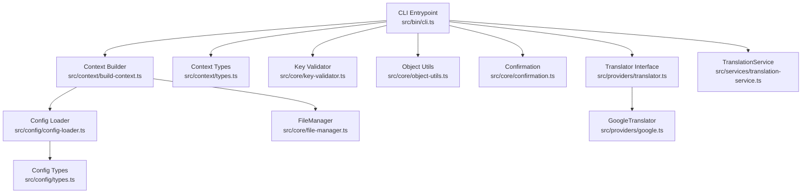
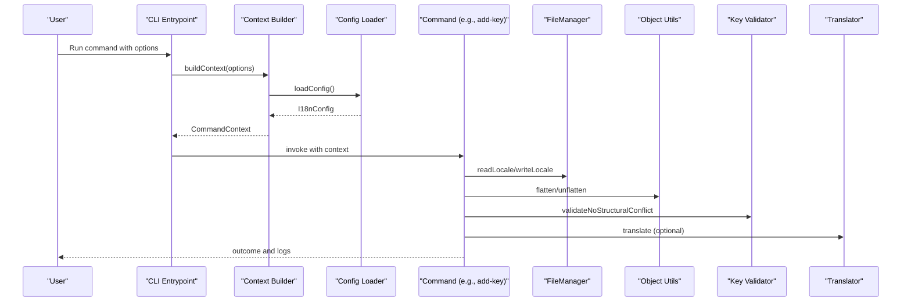
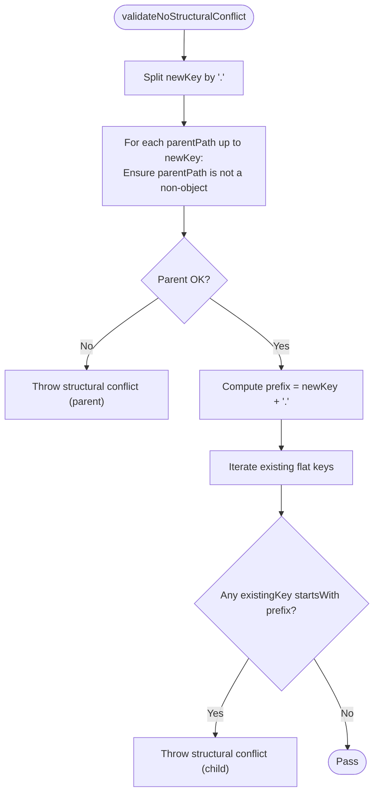
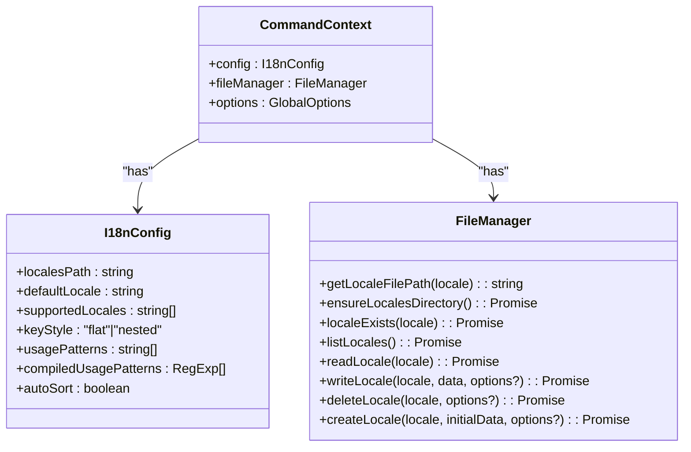
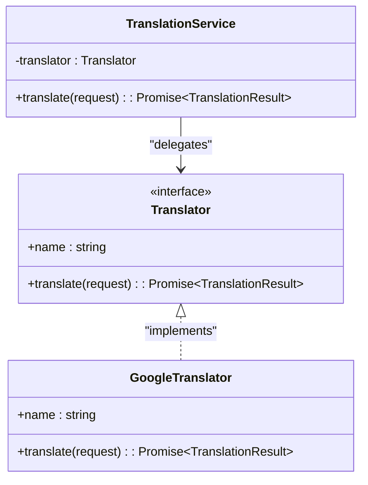
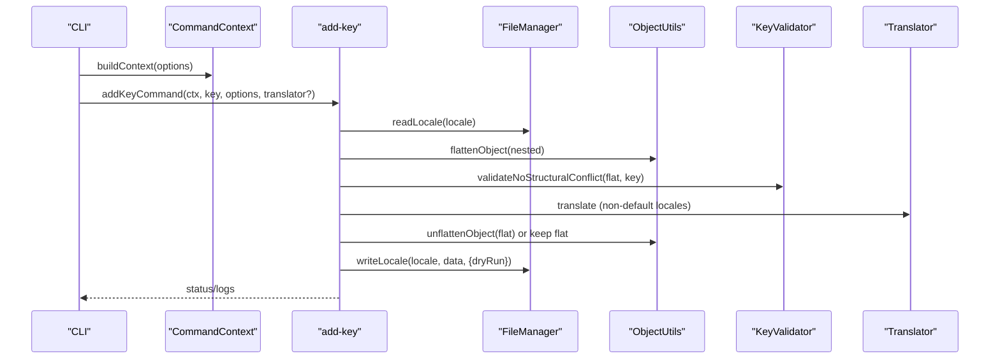
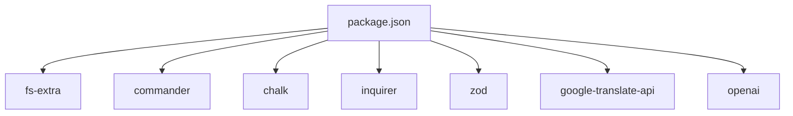

# Core Services and Utilities

<cite>
**Referenced Files in This Document**
- [cli.ts](file://src/bin/cli.ts)
- [build-context.ts](file://src/context/build-context.ts)
- [types.ts](file://src/context/types.ts)
- [config-loader.ts](file://src/config/config-loader.ts)
- [types.ts](file://src/config/types.ts)
- [file-manager.ts](file://src/core/file-manager.ts)
- [key-validator.ts](file://src/core/key-validator.ts)
- [object-utils.ts](file://src/core/object-utils.ts)
- [confirmation.ts](file://src/core/confirmation.ts)
- [translator.ts](file://src/providers/translator.ts)
- [google.ts](file://src/providers/google.ts)
- [translation-service.ts](file://src/services/translation-service.ts)
- [add-key.ts](file://src/commands/add-key.ts)
- [init.ts](file://src/commands/init.ts)
- [package.json](file://package.json)
</cite>

## Table of Contents
1. [Introduction](#introduction)
2. [Project Structure](#project-structure)
3. [Core Components](#core-components)
4. [Architecture Overview](#architecture-overview)
5. [Detailed Component Analysis](#detailed-component-analysis)
6. [Dependency Analysis](#dependency-analysis)
7. [Performance Considerations](#performance-considerations)
8. [Troubleshooting Guide](#troubleshooting-guide)
9. [Conclusion](#conclusion)
10. [Appendices](#appendices)

## Introduction
This document explains the core services and utilities that power i18n-ai-cli, focusing on:
- FileManager for JSON file operations and locale lifecycle management
- Key validation mechanisms to prevent structural conflicts
- Object manipulation utilities for flattening/unflattening and safe key handling
- The dependency injection context system and service resolution patterns
- File reading/writing operations, validation rules, and utility functions
- How core services integrate with command execution
- Programmatic usage, error handling, and service extension patterns
- Performance considerations, memory management, and best practices

## Project Structure
The core services reside under src/core, with configuration loading under src/config, command orchestration under src/commands, and DI under src/context. Providers and services implement pluggable translation capabilities.

**Diagram sources**
- [cli.ts:1-209](file://src/bin/cli.ts#L1-L209)
- [build-context.ts:1-16](file://src/context/build-context.ts#L1-L16)
- [types.ts:1-15](file://src/context/types.ts#L1-L15)
- [config-loader.ts:1-176](file://src/config/config-loader.ts#L1-L176)
- [types.ts:1-12](file://src/config/types.ts#L1-L12)
- [file-manager.ts:1-118](file://src/core/file-manager.ts#L1-L118)
- [key-validator.ts:1-33](file://src/core/key-validator.ts#L1-L33)
- [object-utils.ts:1-95](file://src/core/object-utils.ts#L1-L95)
- [confirmation.ts:1-43](file://src/core/confirmation.ts#L1-L43)
- [translator.ts:1-60](file://src/providers/translator.ts#L1-L60)
- [google.ts:1-50](file://src/providers/google.ts#L1-L50)
- [translation-service.ts:1-18](file://src/services/translation-service.ts#L1-L18)

**Section sources**
- [cli.ts:1-209](file://src/bin/cli.ts#L1-L209)
- [build-context.ts:1-16](file://src/context/build-context.ts#L1-L16)
- [types.ts:1-15](file://src/context/types.ts#L1-L15)
- [config-loader.ts:1-176](file://src/config/config-loader.ts#L1-L176)
- [types.ts:1-12](file://src/config/types.ts#L1-L12)

## Core Components
- FileManager: Encapsulates filesystem operations for locale files, including existence checks, creation, deletion, reading, and writing with optional sorting and dry-run support.
- KeyValidator: Enforces structural integrity when adding keys by preventing conflicts with parent/child nodes.
- ObjectUtils: Provides safe flattening/unflattening of nested objects, extraction of flat keys, and removal of empty objects, with safety checks against dangerous key segments.
- Confirmation: Centralizes interactive confirmation logic respecting global flags like --yes, --ci, and TTY availability.
- TranslationService: Thin wrapper around a Translator implementation for consistent translation invocation.
- Provider Interfaces: Define Translator contract and related types for pluggable translation providers.

**Section sources**
- [file-manager.ts:1-118](file://src/core/file-manager.ts#L1-L118)
- [key-validator.ts:1-33](file://src/core/key-validator.ts#L1-L33)
- [object-utils.ts:1-95](file://src/core/object-utils.ts#L1-L95)
- [confirmation.ts:1-43](file://src/core/confirmation.ts#L1-L43)
- [translation-service.ts:1-18](file://src/services/translation-service.ts#L1-L18)
- [translator.ts:1-60](file://src/providers/translator.ts#L1-L60)

## Architecture Overview
The CLI builds a CommandContext containing configuration and FileManager, then delegates to commands. Commands orchestrate validation, object manipulation, and file operations, optionally invoking translators for key synchronization.

**Diagram sources**
- [cli.ts:1-209](file://src/bin/cli.ts#L1-L209)
- [build-context.ts:1-16](file://src/context/build-context.ts#L1-L16)
- [config-loader.ts:1-176](file://src/config/config-loader.ts#L1-L176)
- [add-key.ts:1-120](file://src/commands/add-key.ts#L1-L120)
- [file-manager.ts:1-118](file://src/core/file-manager.ts#L1-L118)
- [object-utils.ts:1-95](file://src/core/object-utils.ts#L1-L95)
- [key-validator.ts:1-33](file://src/core/key-validator.ts#L1-L33)
- [translator.ts:1-60](file://src/providers/translator.ts#L1-L60)

## Detailed Component Analysis

### FileManager
Responsibilities:
- Resolve absolute locales directory from configuration
- Compute locale file paths
- Ensure locales directory exists
- Check locale existence
- List supported locales (from config)
- Read locale JSON with robust error handling
- Write locale JSON with optional auto-sort and dry-run
- Delete locale file with dry-run
- Create locale file with initial data and dry-run

Key behaviors:
- Throws descriptive errors for missing files, invalid JSON, and pre-existing/existing locales during create/delete
- Supports recursive key sorting when enabled by configuration
- Dry-run mode short-circuits writes and deletions

Programmatic usage examples:
- Reading a locale: [readLocale:31-43](file://src/core/file-manager.ts#L31-L43)
- Writing a locale: [writeLocale:45-61](file://src/core/file-manager.ts#L45-L61)
- Creating a locale: [createLocale:80-98](file://src/core/file-manager.ts#L80-L98)
- Deleting a locale: [deleteLocale:63-78](file://src/core/file-manager.ts#L63-L78)

Validation and error handling:
- Validates file existence before read/delete
- Catches JSON parsing errors and rethrows with context
- Enforces uniqueness during creation

Performance and memory:
- Uses streaming-friendly JSON helpers from fs-extra
- Recursive sorting creates new objects; consider shallow operations when large datasets are expected

**Section sources**
- [file-manager.ts:1-118](file://src/core/file-manager.ts#L1-L118)

### KeyValidator
Responsibilities:
- Prevent structural conflicts when adding keys
- Parent conflict: disallow creating a key whose parent path is already a non-object
- Child conflict: disallow creating a key that would overwrite nested descendants

Algorithm flow:

**Diagram sources**
- [key-validator.ts:1-33](file://src/core/key-validator.ts#L1-L33)

**Section sources**
- [key-validator.ts:1-33](file://src/core/key-validator.ts#L1-L33)

### ObjectUtils
Responsibilities:
- Flatten nested objects into dot-delimited keys with safety checks
- Unflatten flat objects back to nested form
- Extract all flat keys
- Remove empty objects recursively while preserving arrays

Safety:
- Disallows dangerous key segments (__proto__, constructor, prototype)
- Uses Object.create(null) to avoid prototype pollution

Complexity:
- Flattening/unflattening are O(N) over total number of nodes
- Recursive removal of empty objects is O(N)

Programmatic usage examples:
- Flattening: [flattenObject:17-39](file://src/core/object-utils.ts#L17-L39)
- Unflattening: [unflattenObject:41-64](file://src/core/object-utils.ts#L41-L64)
- Safe key extraction: [getAllFlatKeys:66-68](file://src/core/object-utils.ts#L66-L68)
- Removing empty objects: [removeEmptyObjects:70-94](file://src/core/object-utils.ts#L70-L94)

**Section sources**
- [object-utils.ts:1-95](file://src/core/object-utils.ts#L1-L95)

### Dependency Injection Context System
Builds a CommandContext from global options:
- Loads configuration
- Instantiates FileManager with resolved locales path
- Exposes config, fileManager, and options to commands

Resolution pattern:
- CLI constructs CommandContext per command invocation
- Commands receive context and use config and fileManager directly
- Global options (yes, dryRun, ci, force) are available for policy enforcement

**Diagram sources**
- [build-context.ts:1-16](file://src/context/build-context.ts#L1-L16)
- [types.ts:1-15](file://src/context/types.ts#L1-L15)
- [types.ts:1-12](file://src/config/types.ts#L1-L12)
- [file-manager.ts:1-118](file://src/core/file-manager.ts#L1-L118)

**Section sources**
- [build-context.ts:1-16](file://src/context/build-context.ts#L1-L16)
- [types.ts:1-15](file://src/context/types.ts#L1-L15)
- [types.ts:1-12](file://src/config/types.ts#L1-L12)

### Service Resolution Patterns
- CLI resolves translator instances based on options or environment variables
- TranslationService provides a uniform translate method for commands
- GoogleTranslator implements the Translator interface

**Diagram sources**
- [translator.ts:1-60](file://src/providers/translator.ts#L1-L60)
- [translation-service.ts:1-18](file://src/services/translation-service.ts#L1-L18)
- [google.ts:1-50](file://src/providers/google.ts#L1-L50)

**Section sources**
- [translator.ts:1-60](file://src/providers/translator.ts#L1-L60)
- [translation-service.ts:1-18](file://src/services/translation-service.ts#L1-L18)
- [google.ts:1-50](file://src/providers/google.ts#L1-L50)

### Relationship Between Core Services and Command Execution
- add-key command:
  - Reads each locale, flattens, validates key, translates missing values, unflattens, and writes
  - Uses FileManager, ObjectUtils, KeyValidator, and optional Translator
- init command:
  - Builds configuration, compiles usage patterns, ensures locales directory, and initializes default locale file

**Diagram sources**
- [add-key.ts:1-120](file://src/commands/add-key.ts#L1-L120)
- [file-manager.ts:1-118](file://src/core/file-manager.ts#L1-L118)
- [object-utils.ts:1-95](file://src/core/object-utils.ts#L1-L95)
- [key-validator.ts:1-33](file://src/core/key-validator.ts#L1-L33)
- [translator.ts:1-60](file://src/providers/translator.ts#L1-L60)

**Section sources**
- [add-key.ts:1-120](file://src/commands/add-key.ts#L1-L120)
- [init.ts:1-239](file://src/commands/init.ts#L1-L239)

### Examples of Programmatic Usage
- Building a context and running a command:
  - See [buildContext:5-16](file://src/context/build-context.ts#L5-L16)
  - See [cli.ts:51-101](file://src/bin/cli.ts#L51-L101) for command wiring
- Using FileManager programmatically:
  - [getLocaleFilePath:14-16](file://src/core/file-manager.ts#L14-L16)
  - [readLocale:31-43](file://src/core/file-manager.ts#L31-L43)
  - [writeLocale:45-61](file://src/core/file-manager.ts#L45-L61)
  - [createLocale:80-98](file://src/core/file-manager.ts#L80-L98)
  - [deleteLocale:63-78](file://src/core/file-manager.ts#L63-L78)
- Validating keys:
  - [validateNoStructuralConflict:1-33](file://src/core/key-validator.ts#L1-L33)
- Manipulating objects:
  - [flattenObject:17-39](file://src/core/object-utils.ts#L17-L39)
  - [unflattenObject:41-64](file://src/core/object-utils.ts#L41-L64)
  - [getAllFlatKeys:66-68](file://src/core/object-utils.ts#L66-L68)
  - [removeEmptyObjects:70-94](file://src/core/object-utils.ts#L70-L94)
- Confirming actions:
  - [confirmAction:9-42](file://src/core/confirmation.ts#L9-L42)
- Extending translation providers:
  - Implement [Translator:14-17](file://src/providers/translator.ts#L14-L17) and register in CLI or service layer

**Section sources**
- [build-context.ts:1-16](file://src/context/build-context.ts#L1-L16)
- [cli.ts:1-209](file://src/bin/cli.ts#L1-L209)
- [file-manager.ts:1-118](file://src/core/file-manager.ts#L1-L118)
- [key-validator.ts:1-33](file://src/core/key-validator.ts#L1-L33)
- [object-utils.ts:1-95](file://src/core/object-utils.ts#L1-L95)
- [confirmation.ts:1-43](file://src/core/confirmation.ts#L1-L43)
- [translator.ts:1-60](file://src/providers/translator.ts#L1-L60)

## Dependency Analysis
External dependencies include fs-extra for filesystem operations, commander for CLI, chalk for terminal output, inquirer for prompts, zod for config validation, and provider libraries for translation.

**Diagram sources**
- [package.json:1-68](file://package.json#L1-L68)

**Section sources**
- [package.json:1-68](file://package.json#L1-L68)

## Performance Considerations
- JSON I/O: FileManager uses fs-extra JSON helpers; ensure localesPath is on fast storage for large projects.
- Sorting: Auto-sorting is recursive and allocates new objects; consider disabling autoSort for very large files or batch operations.
- Flattening/Unflattening: O(N) operations; avoid repeated conversions in tight loops.
- Translation calls: Network-bound; batch or cache results externally if invoking many times.
- Dry-run mode: Useful for previewing changes without I/O overhead.

## Troubleshooting Guide
Common issues and resolutions:
- Configuration not found or invalid:
  - Ensure i18n-cli.config.json exists in project root and contains valid JSON matching schema.
  - See [loadConfig:24-67](file://src/config/config-loader.ts#L24-L67) and [compileUsagePatterns:84-109](file://src/config/config-loader.ts#L84-L109).
- Locale file missing or invalid:
  - FileManager throws descriptive errors for missing or malformed JSON.
  - See [readLocale:31-43](file://src/core/file-manager.ts#L31-L43).
- Structural key conflict:
  - Adding a key that conflicts with parent/child structure triggers validation error.
  - See [validateNoStructuralConflict:1-33](file://src/core/key-validator.ts#L1-L33).
- Unsafe key segments:
  - Keys containing __proto__, constructor, or prototype are rejected.
  - See [assertSafeKeySegment:9-15](file://src/core/object-utils.ts#L9-L15).
- CI mode requires confirmation:
  - Running without --yes in CI mode will fail; add --yes to proceed.
  - See [confirmAction:20-25](file://src/core/confirmation.ts#L20-L25).
- Dry-run behavior:
  - Dry-run prevents writes/deletes; verify by checking logs indicating [DRY RUN].
  - See [writeLocale:56-58](file://src/core/file-manager.ts#L56-L58) and [createLocale:93-95](file://src/core/file-manager.ts#L93-L95).

**Section sources**
- [config-loader.ts:1-176](file://src/config/config-loader.ts#L1-L176)
- [file-manager.ts:1-118](file://src/core/file-manager.ts#L1-L118)
- [key-validator.ts:1-33](file://src/core/key-validator.ts#L1-L33)
- [object-utils.ts:1-95](file://src/core/object-utils.ts#L1-L95)
- [confirmation.ts:1-43](file://src/core/confirmation.ts#L1-L43)

## Conclusion
i18n-ai-cli’s core services provide a robust foundation for managing translation files:
- FileManager encapsulates filesystem concerns with strong validation and dry-run support
- KeyValidator and ObjectUtils enforce structural integrity and safely manipulate nested data
- The DI context system cleanly exposes configuration and services to commands
- Translation providers are pluggable and composable via a simple interface
Adhering to the patterns documented here enables reliable automation, predictable error handling, and extensible integrations.

## Appendices
- Best practices:
  - Always build CommandContext via build-context before invoking commands
  - Use flatten/unflatten consistently when switching between flat and nested key styles
  - Prefer dry-run for risky operations; leverage CI-friendly flags for automation
  - Keep supportedLocales normalized and validated by configuration loader
- Extension patterns:
  - Implement Translator to add new providers
  - Wrap providers in TranslationService for consistent behavior
  - Add new commands that consume CommandContext and core utilities