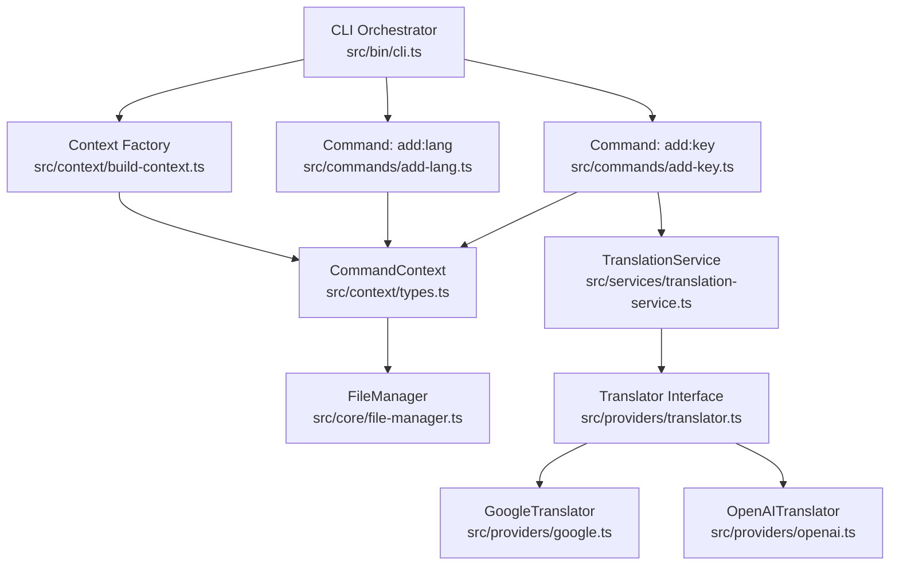
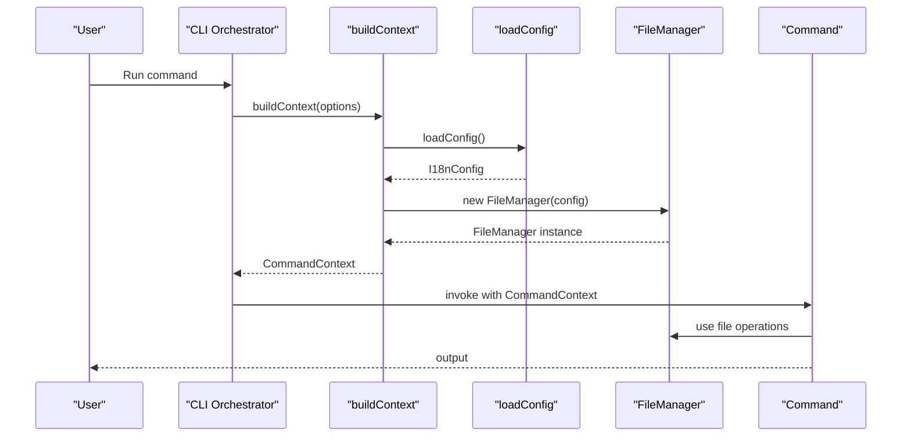
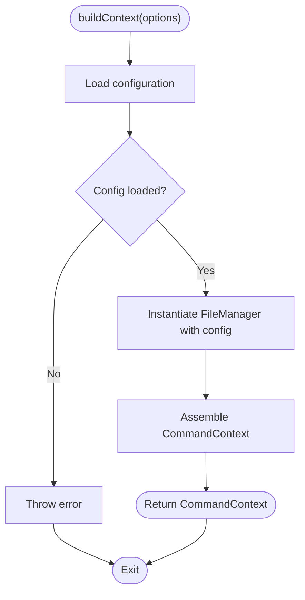
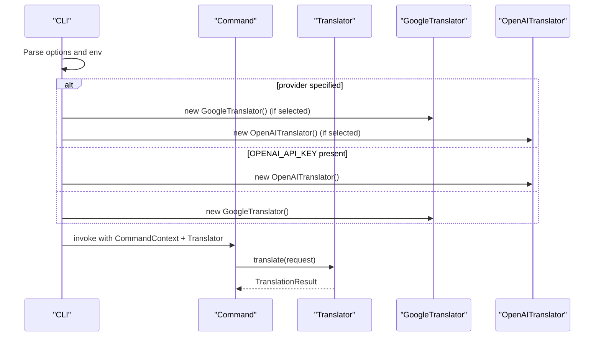
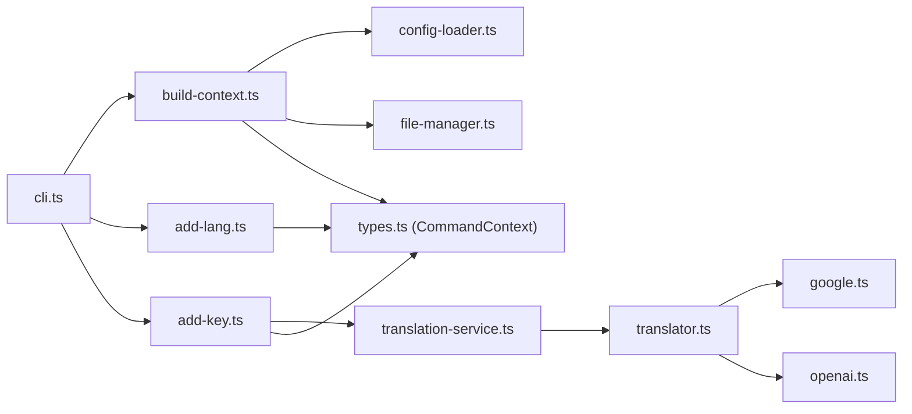

# Dependency Injection and Context Management

<cite>
**Referenced Files in This Document**
- [build-context.ts](file://src/context/build-context.ts)
- [types.ts](file://src/context/types.ts)
- [cli.ts](file://src/bin/cli.ts)
- [translation-service.ts](file://src/services/translation-service.ts)
- [file-manager.ts](file://src/core/file-manager.ts)
- [translator.ts](file://src/providers/translator.ts)
- [google.ts](file://src/providers/google.ts)
- [openai.ts](file://src/providers/openai.ts)
- [config-loader.ts](file://src/config/config-loader.ts)
- [types.ts](file://src/config/types.ts)
- [confirmation.ts](file://src/core/confirmation.ts)
- [add-lang.ts](file://src/commands/add-lang.ts)
- [add-key.ts](file://src/commands/add-key.ts)
- [build-context.test.ts](file://unit-testing/context/build-context.test.ts)
- [add-lang.test.ts](file://unit-testing/commands/add-lang.test.ts)
</cite>

## Table of Contents
1. [Introduction](#introduction)
2. [Project Structure](#project-structure)
3. [Core Components](#core-components)
4. [Architecture Overview](#architecture-overview)
5. [Detailed Component Analysis](#detailed-component-analysis)
6. [Dependency Analysis](#dependency-analysis)
7. [Performance Considerations](#performance-considerations)
8. [Troubleshooting Guide](#troubleshooting-guide)
9. [Conclusion](#conclusion)

## Introduction
This document explains the dependency injection and context management system used by the CLI application. It focuses on the build-context function that constructs the service container, the context factory pattern, service registration and resolution mechanisms, the Context interface, and configuration injection patterns. It also covers how services are instantiated, cached, and resolved during the application lifecycle, along with examples of context construction, service access patterns, and extension strategies. Finally, it addresses service lifecycle management, circular dependency prevention, and best practices for maintaining a clean dependency graph.

## Project Structure
The dependency injection and context management system centers around a small, explicit container built by a factory function. The CLI orchestrator composes commands and passes the context to them. Providers implement a shared interface and are constructed on-demand by the CLI or commands that need translation capabilities.

**Diagram sources**
- [cli.ts](file://src/bin/cli.ts)
- [build-context.ts](file://src/context/build-context.ts)
- [types.ts](file://src/context/types.ts)
- [file-manager.ts](file://src/core/file-manager.ts)
- [add-lang.ts](file://src/commands/add-lang.ts)
- [add-key.ts](file://src/commands/add-key.ts)
- [translation-service.ts](file://src/services/translation-service.ts)
- [translator.ts](file://src/providers/translator.ts)
- [google.ts](file://src/providers/google.ts)
- [openai.ts](file://src/providers/openai.ts)

**Section sources**
- [cli.ts](file://src/bin/cli.ts)
- [build-context.ts](file://src/context/build-context.ts)
- [types.ts](file://src/context/types.ts)

## Core Components
- Context Factory: The build-context function is the single place where the CommandContext is assembled. It loads configuration, instantiates FileManager, and returns an object containing config, file manager, and global options.
- Context Interface: CommandContext defines the contract for passing services and options to commands.
- Provider Abstractions: The Translator interface decouples commands from specific translation providers, enabling runtime selection and easy substitution.
- Service Composition: TranslationService delegates translation work to a configured Translator, demonstrating composition over inversion of control.

Key responsibilities:
- build-context: Loads configuration, constructs FileManager, and returns CommandContext.
- CommandContext: Carries config, file manager, and global options to commands.
- Translator implementations: Encapsulate provider-specific logic and configuration.
- TranslationService: Wraps a Translator to expose a simple translate method.

**Section sources**
- [build-context.ts](file://src/context/build-context.ts)
- [types.ts](file://src/context/types.ts)
- [translator.ts](file://src/providers/translator.ts)
- [translation-service.ts](file://src/services/translation-service.ts)

## Architecture Overview
The system follows a minimalistic dependency injection pattern:
- Explicit factory builds a context with required dependencies.
- Commands receive the context and use services contained within.
- Providers are constructed on demand by the CLI or commands that need them.
- Configuration is injected into services that require it (e.g., FileManager receives I18nConfig).

**Diagram sources**
- [cli.ts](file://src/bin/cli.ts)
- [build-context.ts](file://src/context/build-context.ts)
- [config-loader.ts](file://src/config/config-loader.ts)
- [file-manager.ts](file://src/core/file-manager.ts)

## Detailed Component Analysis

### Context Factory Pattern and Container Construction
The build-context function acts as a context factory:
- It loads configuration via loadConfig.
- It constructs FileManager with the loaded configuration.
- It returns a CommandContext object containing config, fileManager, and options.

Behavioral characteristics:
- Deterministic construction: Each call to buildContext produces a new CommandContext with a fresh FileManager instance.
- Configuration injection: The loaded I18nConfig is injected into FileManager.
- Global options propagation: The CLI’s global options are carried through to commands via CommandContext.

**Diagram sources**
- [build-context.ts](file://src/context/build-context.ts)
- [config-loader.ts](file://src/config/config-loader.ts)
- [file-manager.ts](file://src/core/file-manager.ts)

**Section sources**
- [build-context.ts](file://src/context/build-context.ts)
- [types.ts](file://src/context/types.ts)
- [config-loader.ts](file://src/config/config-loader.ts)
- [file-manager.ts](file://src/core/file-manager.ts)

### Context Interface and Service Types
CommandContext is a simple interface that exposes:
- config: I18nConfig
- fileManager: FileManager
- options: GlobalOptions

GlobalOptions supports:
- yes: Skip confirmation prompts
- dryRun: Preview changes without writing files
- ci: CI mode (no prompts, exit on issues)
- force: Force operation even if validation fails

These options are propagated from CLI-level flags and consumed by commands and helpers.

**Section sources**
- [types.ts](file://src/context/types.ts)
- [cli.ts](file://src/bin/cli.ts)

### Provider Registration and Resolution Mechanisms
Providers implement a common Translator interface. At runtime, the CLI selects a provider based on flags or environment variables and passes it to commands that need translation.

Resolution flow:
- CLI reads provider choice from options or environment.
- If provider is specified and valid, instantiate the corresponding provider.
- If OPENAI_API_KEY is present, prefer OpenAITranslator; otherwise, use GoogleTranslator.
- Pass the provider to commands that require translation.

**Diagram sources**
- [cli.ts](file://src/bin/cli.ts)
- [translator.ts](file://src/providers/translator.ts)
- [google.ts](file://src/providers/google.ts)
- [openai.ts](file://src/providers/openai.ts)

**Section sources**
- [cli.ts](file://src/bin/cli.ts)
- [translator.ts](file://src/providers/translator.ts)
- [google.ts](file://src/providers/google.ts)
- [openai.ts](file://src/providers/openai.ts)

### Service Instantiation, Caching, and Resolution
- FileManager: Constructed inside build-context; a new instance is created per context build. There is no long-term caching of FileManager in the current design.
- Translator: Constructed on-demand by the CLI when a command requires translation. There is no shared provider cache; each command may construct its own provider instance.
- TranslationService: Wraps a Translator. It is not part of the context factory; commands may instantiate it when needed.

Lifecycle notes:
- Context instances are short-lived and tied to individual command invocations.
- Services are instantiated per context or per command as needed.
- No explicit lifecycle hooks or cleanup are implemented.

**Section sources**
- [build-context.ts](file://src/context/build-context.ts)
- [file-manager.ts](file://src/core/file-manager.ts)
- [translation-service.ts](file://src/services/translation-service.ts)
- [cli.ts](file://src/bin/cli.ts)

### Examples of Context Construction and Service Access Patterns
- CLI-level construction: The CLI calls buildContext(options) for each command and passes the resulting CommandContext to the command handler.
- Command-level usage: Commands destructure config and fileManager from CommandContext and use them for file operations and validations.
- Provider selection: The CLI decides which Translator to use based on flags and environment, then passes it to commands that need translation.

Practical examples (paths only):
- Build context and pass to add:lang command: [cli.ts](file://src/bin/cli.ts)
- Build context and pass to add:key command: [cli.ts](file://src/bin/cli.ts)
- Use CommandContext in add:lang: [add-lang.ts](file://src/commands/add-lang.ts)
- Use CommandContext in add:key: [add-key.ts](file://src/commands/add-key.ts)

**Section sources**
- [cli.ts](file://src/bin/cli.ts)
- [add-lang.ts](file://src/commands/add-lang.ts)
- [add-key.ts](file://src/commands/add-key.ts)

### Extending the Dependency Injection System
To extend the system while preserving simplicity:
- Add new services to the context factory: Modify build-context to construct and inject additional services alongside config, fileManager, and options.
- Introduce optional providers: Extend the CLI provider selection logic to support new providers and inject them into commands that need them.
- Keep the context minimal: Avoid over-injection; only include services that are commonly needed across commands.
- Maintain explicit construction: Continue building services explicitly rather than relying on a DI container to reduce hidden dependencies.

Validation and testing references:
- Context construction tests: [build-context.test.ts](file://unit-testing/context/build-context.test.ts)
- Command-level context usage tests: [add-lang.test.ts](file://unit-testing/commands/add-lang.test.ts)

**Section sources**
- [build-context.ts](file://src/context/build-context.ts)
- [cli.ts](file://src/bin/cli.ts)
- [build-context.test.ts](file://unit-testing/context/build-context.test.ts)
- [add-lang.test.ts](file://unit-testing/commands/add-lang.test.ts)

## Dependency Analysis
The dependency graph emphasizes explicit, layered composition:
- CLI depends on build-context and command modules.
- build-context depends on loadConfig and FileManager.
- Commands depend on CommandContext and optionally on TranslationService and providers.
- Providers depend on external APIs and share a common interface.

**Diagram sources**
- [cli.ts](file://src/bin/cli.ts)
- [build-context.ts](file://src/context/build-context.ts)
- [config-loader.ts](file://src/config/config-loader.ts)
- [file-manager.ts](file://src/core/file-manager.ts)
- [add-lang.ts](file://src/commands/add-lang.ts)
- [add-key.ts](file://src/commands/add-key.ts)
- [translation-service.ts](file://src/services/translation-service.ts)
- [translator.ts](file://src/providers/translator.ts)
- [google.ts](file://src/providers/google.ts)
- [openai.ts](file://src/providers/openai.ts)
- [types.ts](file://src/context/types.ts)

**Section sources**
- [cli.ts](file://src/bin/cli.ts)
- [build-context.ts](file://src/context/build-context.ts)
- [types.ts](file://src/context/types.ts)

## Performance Considerations
- Context creation cost: build-context performs a single configuration load and constructs a single FileManager instance per invocation. Keep the context lightweight to minimize overhead.
- Provider instantiation: Translators are constructed per command or per CLI action. For high-throughput scenarios, consider reusing providers if their internal state permits it.
- File operations: FileManager performs synchronous filesystem checks and JSON reads/writes. Batch operations and avoid unnecessary repeated reads to improve throughput.
- Avoid unnecessary allocations: Since the context is short-lived, avoid storing large transient data in CommandContext.

## Troubleshooting Guide
Common issues and resolutions:
- Missing configuration file: loadConfig throws when the configuration file is absent or invalid. Ensure the configuration file exists and contains valid JSON.
- Invalid locale or unsupported locales: Commands validate locales against configuration; ensure locales are properly formatted and included in supportedLocales.
- Provider initialization failures: OpenAITranslator requires an API key. Ensure the environment variable is set or pass the key via constructor options.
- Dry-run and CI modes: Respect the global options to prevent unintended writes and interactive prompts.

Operational references:
- Configuration loading and validation: [config-loader.ts](file://src/config/config-loader.ts)
- Provider initialization and error handling: [openai.ts](file://src/providers/openai.ts)
- Confirmation behavior controlled by global options: [confirmation.ts](file://src/core/confirmation.ts)
- Command-level option handling and error propagation: [cli.ts](file://src/bin/cli.ts), [add-lang.ts](file://src/commands/add-lang.ts), [add-key.ts](file://src/commands/add-key.ts)

**Section sources**
- [config-loader.ts](file://src/config/config-loader.ts)
- [openai.ts](file://src/providers/openai.ts)
- [confirmation.ts](file://src/core/confirmation.ts)
- [cli.ts](file://src/bin/cli.ts)
- [add-lang.ts](file://src/commands/add-lang.ts)
- [add-key.ts](file://src/commands/add-key.ts)

## Conclusion
The dependency injection and context management system is intentionally simple and explicit:
- A single factory function constructs a CommandContext with configuration, a file manager, and global options.
- Commands consume the context and optionally compose additional services like TranslationService and providers.
- Providers are selected at runtime based on flags and environment variables, enabling flexible and testable behavior.
- The design avoids hidden dependencies and maintains a clean dependency graph by keeping context construction and service instantiation explicit.

Best practices derived from the codebase:
- Keep the context minimal and focused.
- Inject configuration early and consistently.
- Construct services on-demand rather than globally caching them.
- Validate inputs and configurations at the edges (CLI and config loader).
- Prefer explicit composition over containers to maintain clarity and testability.