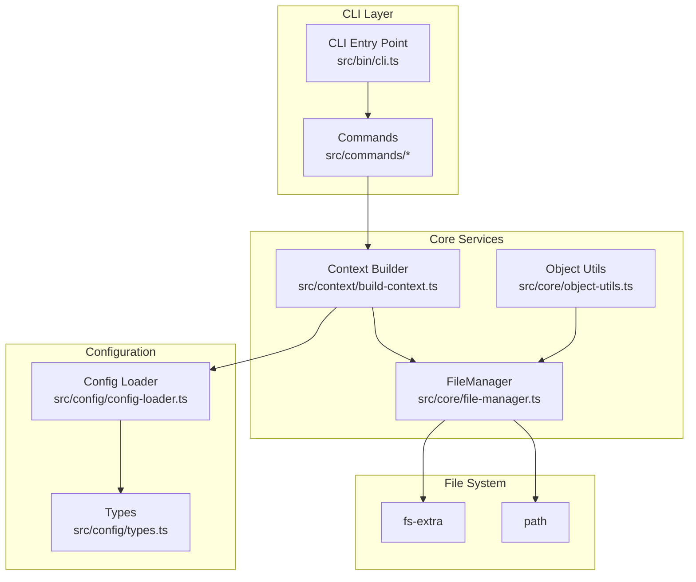
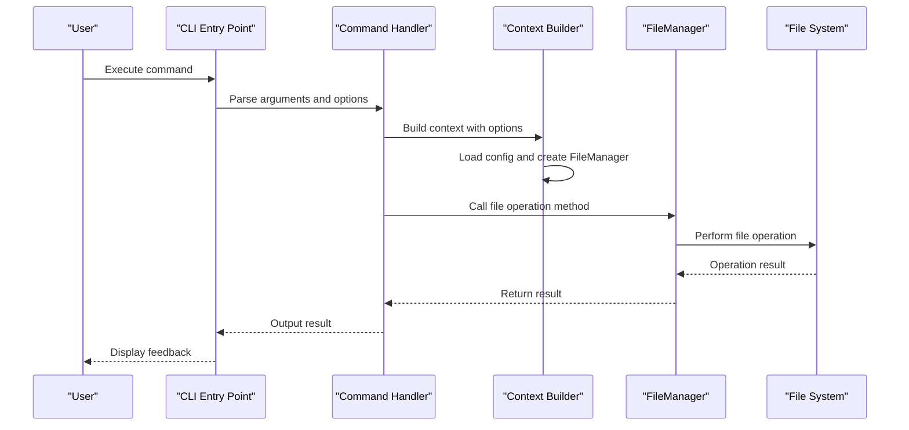
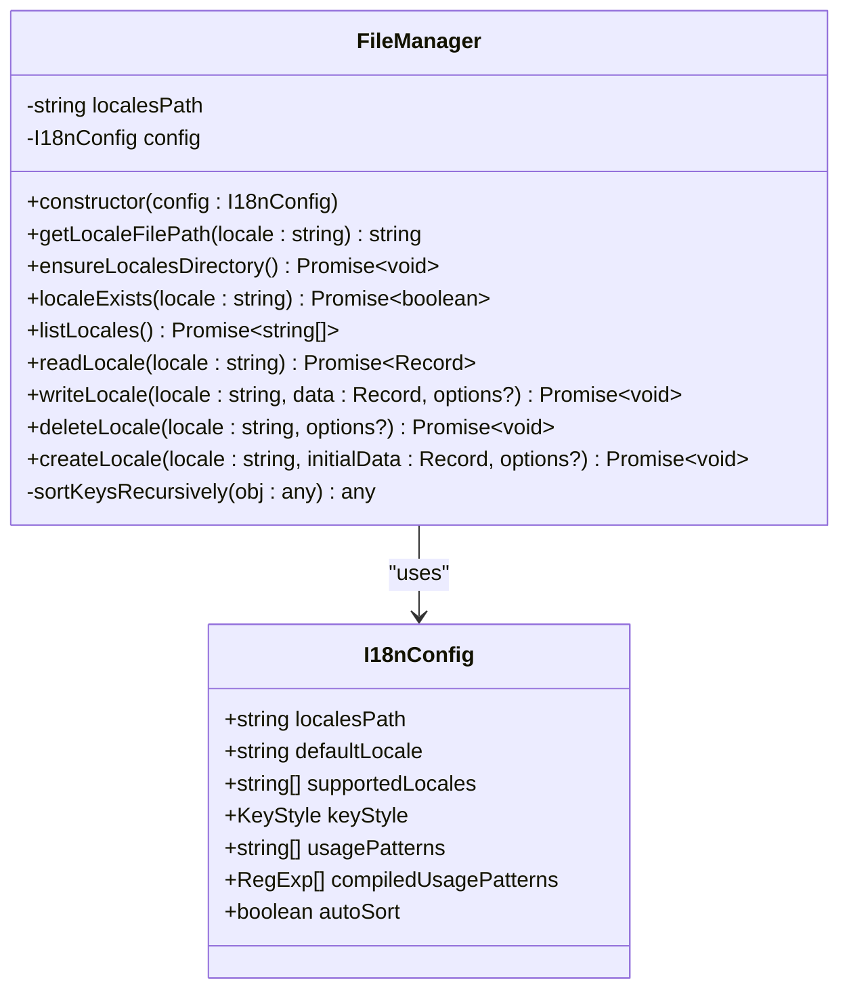
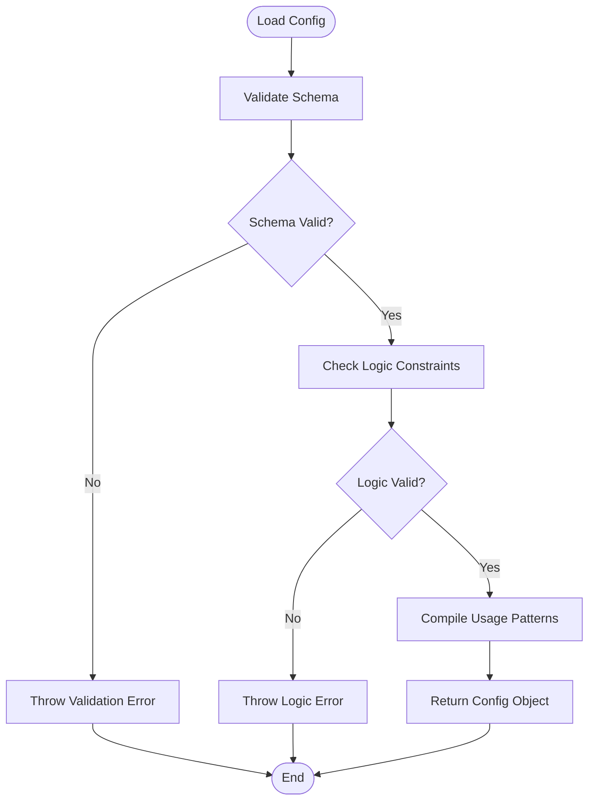
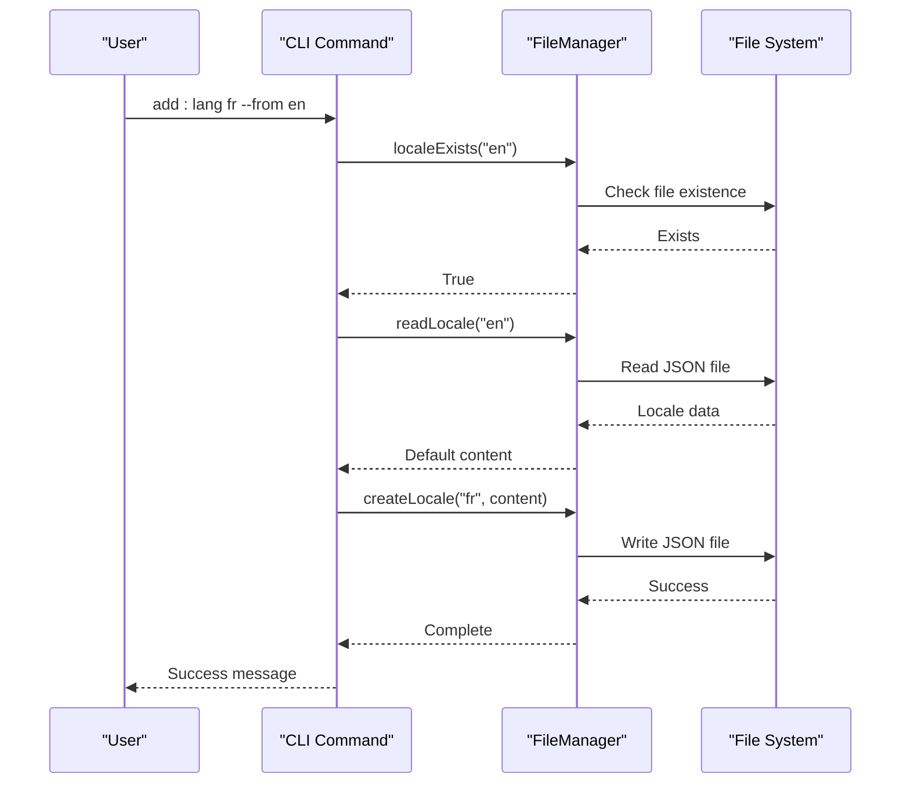
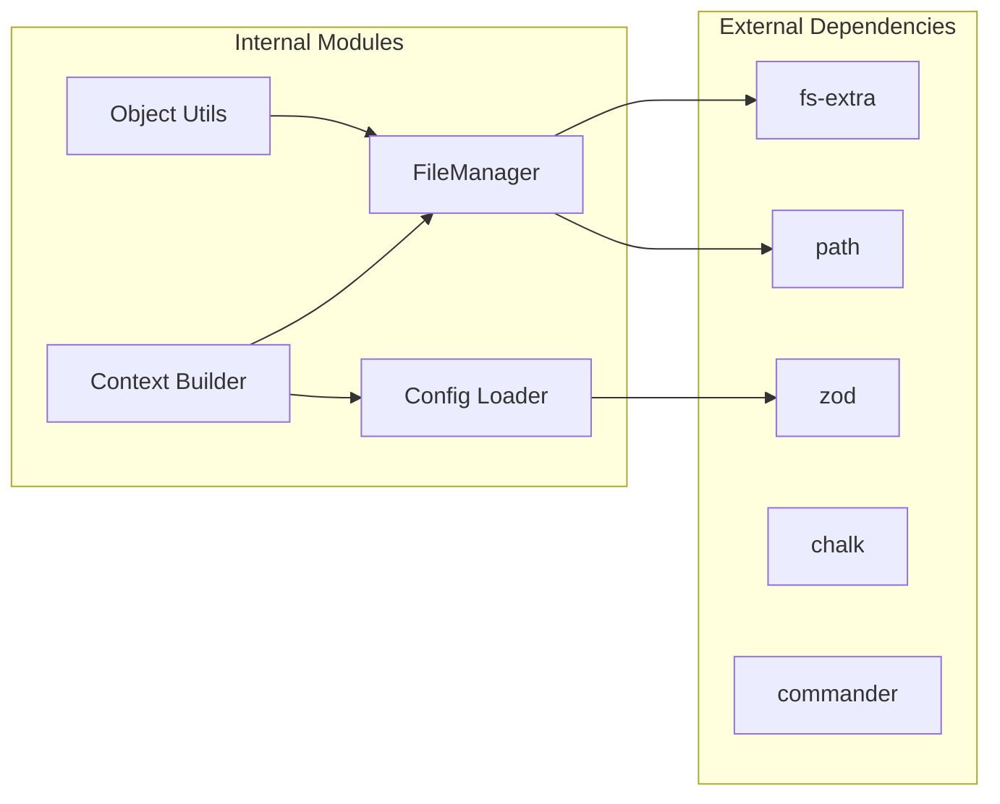

# File Management System

<cite>
**Referenced Files in This Document**
- [file-manager.ts](file://src/core/file-manager.ts)
- [config-loader.ts](file://src/config/config-loader.ts)
- [types.ts](file://src/config/types.ts)
- [build-context.ts](file://src/context/build-context.ts)
- [object-utils.ts](file://src/core/object-utils.ts)
- [file-manager.test.ts](file://unit-testing/core/file-manager.test.ts)
- [init.ts](file://src/commands/init.ts)
- [add-lang.ts](file://src/commands/add-lang.ts)
- [remove-lang.ts](file://src/commands/remove-lang.ts)
- [cli.ts](file://src/bin/cli.ts)
- [package.json](file://package.json)
</cite>

## Table of Contents
1. [Introduction](#introduction)
2. [Project Structure](#project-structure)
3. [Core Components](#core-components)
4. [Architecture Overview](#architecture-overview)
5. [Detailed Component Analysis](#detailed-component-analysis)
6. [Dependency Analysis](#dependency-analysis)
7. [Performance Considerations](#performance-considerations)
8. [Troubleshooting Guide](#troubleshooting-guide)
9. [Conclusion](#conclusion)
10. [Appendices](#appendices)

## Introduction
This document provides comprehensive documentation for the FileManager class and the file operations system that manages locale files in the i18n-cli project. It covers the complete file management workflow including locale file creation, reading, writing, and deletion operations. The documentation explains the FileManager constructor, locale file path resolution, and directory management. It details all public methods: ensureLocalesDirectory, localeExists, listLocales, readLocale, writeLocale, deleteLocale, and createLocale. It also explains the recursive key sorting functionality, dry-run mode implementation, and error handling patterns. Practical examples of file operations, path resolution logic, and integration with the configuration system are included, along with performance considerations, file system interactions, and best practices for locale file management.

## Project Structure
The file management system is part of a larger CLI tool focused on internationalization and localization. The core file operations are encapsulated in the FileManager class, which integrates with the configuration loader and command context. The project uses TypeScript with fs-extra for file system operations and Zod for configuration validation.

**Diagram sources**
- [cli.ts:1-209](file://src/bin/cli.ts#L1-L209)
- [build-context.ts:1-16](file://src/context/build-context.ts#L1-L16)
- [file-manager.ts:1-118](file://src/core/file-manager.ts#L1-L118)
- [config-loader.ts:1-176](file://src/config/config-loader.ts#L1-L176)
- [types.ts:1-12](file://src/config/types.ts#L1-L12)
- [object-utils.ts:1-95](file://src/core/object-utils.ts#L1-L95)

**Section sources**
- [package.json:1-68](file://package.json#L1-L68)
- [cli.ts:1-209](file://src/bin/cli.ts#L1-L209)

## Core Components
The file management system centers around the FileManager class, which provides a cohesive interface for locale file operations. The class maintains a resolved locales directory path and exposes methods for directory management, existence checks, listing, reading, writing, and deletion of locale files. It integrates with the configuration system to respect user preferences such as automatic key sorting and locale path resolution.

Key responsibilities:
- Locale path resolution and file path construction
- Directory management and existence validation
- JSON file reading and writing with structured error handling
- Recursive key sorting for consistent file formatting
- Dry-run mode support for preview operations
- Integration with configuration-driven behavior

**Section sources**
- [file-manager.ts:5-118](file://src/core/file-manager.ts#L5-L118)
- [config-loader.ts:24-67](file://src/config/config-loader.ts#L24-L67)
- [types.ts:3-11](file://src/config/types.ts#L3-L11)

## Architecture Overview
The file management system follows a layered architecture with clear separation of concerns. The CLI entry point orchestrates commands, which delegate to command handlers that build a context containing the configuration and FileManager instance. The FileManager encapsulates all file system interactions and provides a stable API for higher-level operations.

**Diagram sources**
- [cli.ts:34-65](file://src/bin/cli.ts#L34-L65)
- [build-context.ts:5-16](file://src/context/build-context.ts#L5-L16)
- [file-manager.ts:18-98](file://src/core/file-manager.ts#L18-L98)

## Detailed Component Analysis

### FileManager Class
The FileManager class serves as the central component for locale file operations. It maintains a resolved locales directory path and provides methods for all CRUD operations on locale files.

#### Constructor and Path Resolution
The constructor takes an I18nConfig object and resolves the localesPath relative to the current working directory. This ensures consistent path handling regardless of the project structure.

Key behaviors:
- Resolves localesPath using path.resolve(process.cwd(), config.localesPath)
- Stores the resolved path for subsequent operations
- Uses the configuration object for runtime behavior decisions

#### Public Methods Overview
The class exposes seven primary methods, each designed for specific file operations:

1. **ensureLocalesDirectory**: Creates the locales directory if it doesn't exist
2. **localeExists**: Checks if a locale file exists
3. **listLocales**: Returns configured supported locales
4. **readLocale**: Reads and parses a locale file with validation
5. **writeLocale**: Writes locale data with optional recursive key sorting
6. **deleteLocale**: Removes a locale file with validation
7. **createLocale**: Creates a new locale file with directory preparation

#### Path Resolution Logic
The getLocaleFilePath method constructs absolute file paths for locale files:
- Combines the resolved localesPath with locale identifier
- Appends .json extension to form complete file paths
- Supports locale codes with hyphens (e.g., en-US)

#### Recursive Key Sorting
The sortKeysRecursively method implements intelligent key ordering:
- Recursively traverses nested objects and arrays
- Sorts object keys alphabetically while preserving array order
- Handles null values and preserves primitive types
- Applies sorting only when autoSort is enabled in configuration

#### Dry-Run Mode Implementation
All write operations support dry-run mode:
- Methods accept an options parameter with dryRun flag
- When dryRun is true, operations validate inputs but skip actual file writes
- Maintains consistency with command-level dry-run options
- Provides safe preview capability for operations

#### Error Handling Patterns
The class implements comprehensive error handling:
- Validation errors for missing files and invalid JSON
- Type-safe error messages with specific failure contexts
- Graceful handling of file system exceptions
- Consistent error messaging across all operations

**Diagram sources**
- [file-manager.ts:5-118](file://src/core/file-manager.ts#L5-L118)
- [types.ts:3-11](file://src/config/types.ts#L3-L11)

**Section sources**
- [file-manager.ts:9-118](file://src/core/file-manager.ts#L9-L118)

### Configuration Integration
The FileManager integrates deeply with the configuration system, which validates and provides runtime behavior settings.

#### Configuration Loading and Validation
The config-loader module handles configuration loading with robust validation:
- Validates required fields and data types using Zod
- Ensures defaultLocale is included in supportedLocales
- Detects duplicate locales in supportedLocales
- Compiles usage patterns into executable regular expressions

#### Runtime Behavior Control
Configuration settings influence FileManager behavior:
- autoSort controls recursive key sorting during write operations
- localesPath determines the base directory for locale files
- supportedLocales inform the listLocales method response
- keyStyle affects how translation keys are structured

**Diagram sources**
- [config-loader.ts:24-67](file://src/config/config-loader.ts#L24-L67)
- [config-loader.ts:69-82](file://src/config/config-loader.ts#L69-L82)
- [config-loader.ts:84-109](file://src/config/config-loader.ts#L84-L109)

**Section sources**
- [config-loader.ts:1-176](file://src/config/config-loader.ts#L1-L176)
- [types.ts:1-12](file://src/config/types.ts#L1-L12)

### Command Integration
The FileManager integrates with various CLI commands that manage locale files and configuration.

#### Language Management Commands
The add-lang and remove-lang commands demonstrate FileManager usage:
- add-lang creates new locale files with optional cloning from existing locales
- remove-lang deletes locale files with safety checks and validation
- Both commands support dry-run mode for preview operations

#### Initialization Workflow
The init command creates configuration files and initializes locale directories:
- Prompts for configuration values or uses defaults
- Validates locale codes using external libraries
- Creates default locale files when initializing projects
- Supports interactive and non-interactive modes

**Diagram sources**
- [add-lang.ts:26-97](file://src/commands/add-lang.ts#L26-L97)
- [file-manager.ts:80-98](file://src/core/file-manager.ts#L80-L98)

**Section sources**
- [add-lang.ts:1-98](file://src/commands/add-lang.ts#L1-L98)
- [remove-lang.ts:1-74](file://src/commands/remove-lang.ts#L1-L74)
- [init.ts:25-239](file://src/commands/init.ts#L25-L239)

### Object Utilities Integration
The object-utils module provides complementary functionality for key manipulation and validation.

#### Safe Key Operations
The object-utils module ensures safe key handling:
- Prevents dangerous key segments (__proto__, constructor, prototype)
- Flattens and unflattens nested object structures
- Validates key structures to prevent conflicts
- Removes empty objects to keep locale files clean

#### Integration with Translation Workflows
These utilities support translation workflows by:
- Converting between flat and nested key representations
- Validating keys before writing to locale files
- Cleaning up empty structures during file operations

**Section sources**
- [object-utils.ts:1-95](file://src/core/object-utils.ts#L1-L95)

## Dependency Analysis
The file management system exhibits strong cohesion within the FileManager class while maintaining loose coupling with external dependencies.

### Internal Dependencies
- FileManager depends on I18nConfig for runtime behavior
- Integrates with fs-extra for file system operations
- Uses path module for cross-platform path handling
- Leverages configuration validation from config-loader

### External Dependencies
The project relies on several key external libraries:
- fs-extra: Enhanced file system operations with promise support
- path: Cross-platform path manipulation utilities
- zod: Schema validation and type inference
- chalk: Terminal styling for user feedback
- commander: CLI argument parsing and command orchestration

### Coupling and Cohesion
The system demonstrates good design principles:
- High cohesion within FileManager class
- Loose coupling through configuration interface
- Clear separation between file operations and command logic
- Minimal circular dependencies

**Diagram sources**
- [file-manager.ts:1-3](file://src/core/file-manager.ts#L1-L3)
- [config-loader.ts:1-4](file://src/config/config-loader.ts#L1-L4)
- [build-context.ts:1-3](file://src/context/build-context.ts#L1-L3)
- [object-utils.ts:1-1](file://src/core/object-utils.ts#L1-L1)

**Section sources**
- [package.json:48-59](file://package.json#L48-L59)
- [file-manager.ts:1-118](file://src/core/file-manager.ts#L1-L118)

## Performance Considerations
The file management system is designed for efficiency and reliability in typical i18n workflows.

### File System Optimization
- Uses asynchronous operations to avoid blocking the event loop
- Leverages fs-extra promises for cleaner code and better error handling
- Minimizes file system calls through careful method design
- Implements dry-run mode to avoid unnecessary disk writes

### Memory Management
- Processes JSON data in memory-efficient streams where possible
- Uses Object.create(null) for hash maps to minimize prototype overhead
- Avoids deep copying when unnecessary, passing objects by reference
- Cleans up temporary structures after operations

### Scalability Factors
- Recursive key sorting scales with object depth and breadth
- File operations are O(n) where n is the number of keys processed
- Configuration loading occurs once per process lifecycle
- Path resolution is cached within method scope

### Best Practices for Large Projects
- Consider batching operations for bulk locale updates
- Monitor file sizes to avoid excessive memory usage
- Use dry-run mode for validation before production changes
- Implement caching for frequently accessed locale files

## Troubleshooting Guide
Common issues and their solutions when working with the file management system.

### Configuration Issues
- **Missing configuration file**: Ensure i18n-cli.config.json exists in project root
- **Invalid JSON configuration**: Validate JSON syntax and structure
- **Unsupported locale formats**: Use valid locale codes (e.g., en, en-US)
- **Missing default locale**: Ensure defaultLocale is included in supportedLocales

### File System Issues
- **Permission denied errors**: Verify write permissions for locales directory
- **Path resolution problems**: Check localesPath configuration and working directory
- **File encoding issues**: Ensure locale files use UTF-8 encoding
- **Disk space limitations**: Monitor available storage for large locale files

### Method-Specific Errors
- **readLocale failures**: Check file existence and JSON validity
- **writeLocale failures**: Validate data structure and configuration settings
- **deleteLocale failures**: Confirm file existence and permission levels
- **createLocale failures**: Ensure target file doesn't already exist

### Debugging Strategies
- Enable verbose logging for detailed operation traces
- Use dry-run mode to preview changes before execution
- Validate configuration with the validate command
- Test individual methods in isolation for targeted debugging

**Section sources**
- [file-manager.ts:31-98](file://src/core/file-manager.ts#L31-L98)
- [config-loader.ts:24-67](file://src/config/config-loader.ts#L24-L67)

## Conclusion
The FileManager class and associated file operations system provide a robust foundation for locale file management in internationalized applications. The implementation demonstrates strong architectural principles with clear separation of concerns, comprehensive error handling, and flexible configuration options. The system supports modern development workflows through dry-run capabilities, integration with CLI commands, and adherence to best practices for file system interactions.

Key strengths include:
- Comprehensive coverage of file operations with consistent error handling
- Integration with configuration-driven behavior for flexible deployment
- Support for advanced features like recursive key sorting and dry-run operations
- Strong testing coverage validating expected behavior across scenarios

The system is well-suited for both small projects requiring basic locale management and larger applications needing sophisticated internationalization workflows.

## Appendices

### API Reference Summary
- **Constructor**: Takes I18nConfig, resolves localesPath
- **getLocaleFilePath**: Returns absolute path for locale file
- **ensureLocalesDirectory**: Creates locales directory if missing
- **localeExists**: Checks file existence with pathExists
- **listLocales**: Returns configured supported locales
- **readLocale**: Reads and validates JSON locale file
- **writeLocale**: Writes locale data with optional sorting
- **deleteLocale**: Removes locale file with validation
- **createLocale**: Creates new locale file with directory preparation

### Configuration Options
- **localesPath**: Base directory for locale files
- **defaultLocale**: Primary locale identifier
- **supportedLocales**: List of available locales
- **keyStyle**: Flat or nested key structure preference
- **usagePatterns**: Regex patterns for key extraction
- **autoSort**: Enable/disable recursive key sorting

### Command Integration Points
- **init**: Creates configuration and initializes locale directories
- **add:lang**: Adds new language locales with optional cloning
- **remove:lang**: Deletes language translation files
- **validate**: Validates and corrects existing translation files