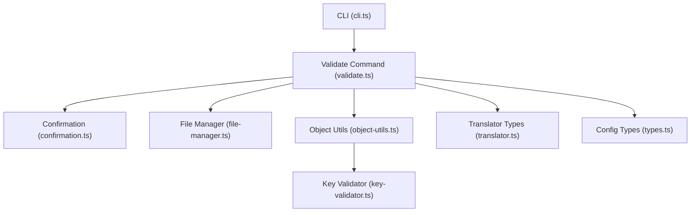
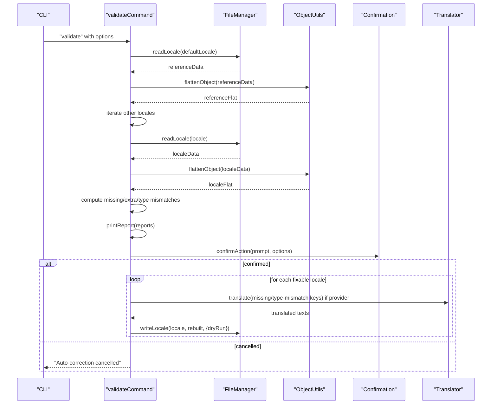
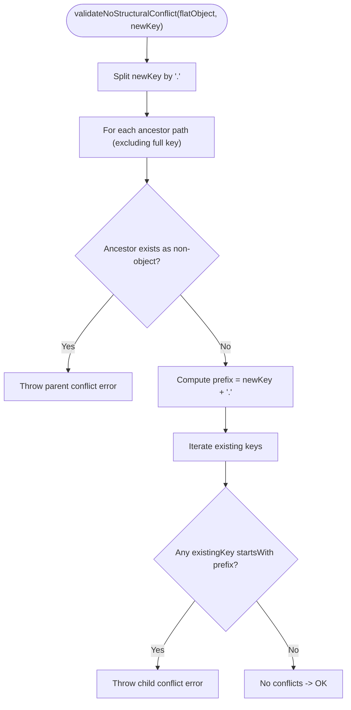
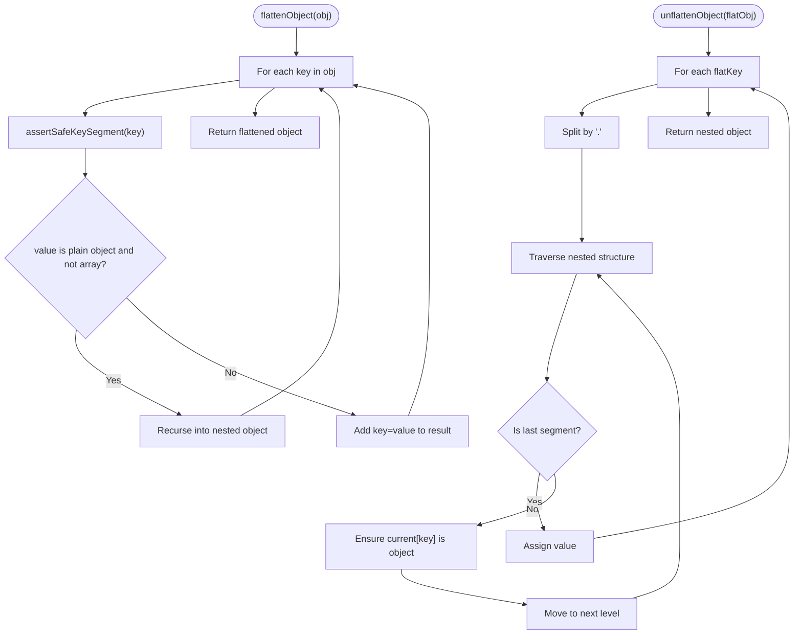
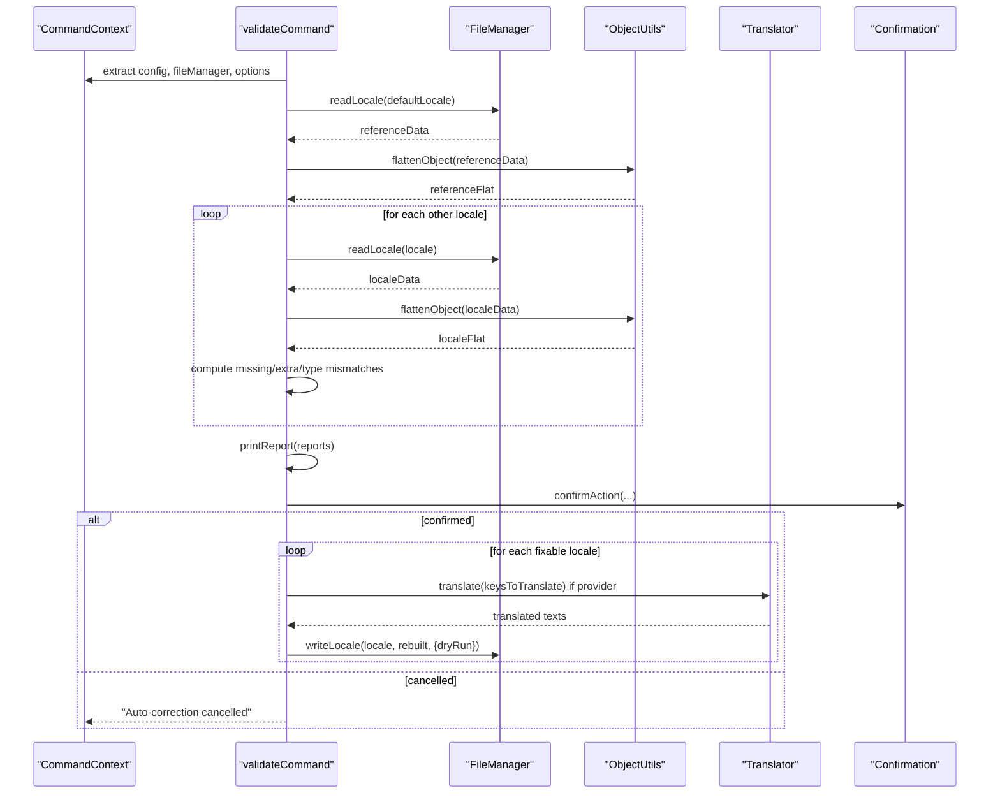
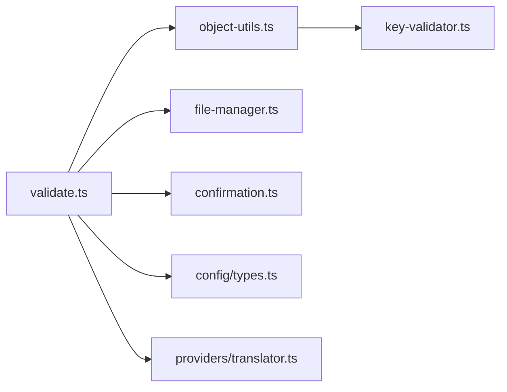

# Validation and Key Management

<cite>
**Referenced Files in This Document**
- [key-validator.ts](file://src/core/key-validator.ts)
- [object-utils.ts](file://src/core/object-utils.ts)
- [validate.ts](file://src/commands/validate.ts)
- [translator.ts](file://src/providers/translator.ts)
- [types.ts](file://src/config/types.ts)
- [types.ts](file://src/context/types.ts)
- [confirmation.ts](file://src/core/confirmation.ts)
- [file-manager.ts](file://src/core/file-manager.ts)
- [cli.ts](file://src/bin/cli.ts)
- [key-validator.test.ts](file://unit-testing/core/key-validator.test.ts)
- [object-utils.test.ts](file://unit-testing/core/object-utils.test.ts)
- [validate.test.ts](file://unit-testing/commands/validate.test.ts)
</cite>

## Table of Contents
1. [Introduction](#introduction)
2. [Project Structure](#project-structure)
3. [Core Components](#core-components)
4. [Architecture Overview](#architecture-overview)
5. [Detailed Component Analysis](#detailed-component-analysis)
6. [Dependency Analysis](#dependency-analysis)
7. [Performance Considerations](#performance-considerations)
8. [Troubleshooting Guide](#troubleshooting-guide)
9. [Conclusion](#conclusion)
10. [Appendices](#appendices)

## Introduction
This document explains the validation and key management system used to ensure translation file integrity. It focuses on:
- The structural validation of translation keys to prevent conflicts
- Utilities for flattening/unflattening nested objects and safely manipulating translation data
- The end-to-end validation workflow, including error reporting and auto-correction
- Integration with file operations and optional translation services
- Performance characteristics, extensibility for custom validation rules, and best practices

## Project Structure
The validation and key management system spans several modules:
- Core validation and utilities: key-validator.ts, object-utils.ts
- Validation command: validate.ts
- Supporting types and integrations: translator.ts, types.ts, confirmation.ts, file-manager.ts
- CLI wiring: cli.ts
- Unit tests: key-validator.test.ts, object-utils.test.ts, validate.test.ts

**Diagram sources**
- [cli.ts:164-198](file://src/bin/cli.ts#L164-L198)
- [validate.ts:121-253](file://src/commands/validate.ts#L121-L253)
- [confirmation.ts:9-42](file://src/core/confirmation.ts#L9-L42)
- [file-manager.ts:5-117](file://src/core/file-manager.ts#L5-L117)
- [object-utils.ts:17-94](file://src/core/object-utils.ts#L17-L94)
- [key-validator.ts:1-33](file://src/core/key-validator.ts#L1-L33)
- [translator.ts:46-59](file://src/providers/translator.ts#L46-L59)
- [types.ts:1-12](file://src/config/types.ts#L1-L12)

**Section sources**
- [cli.ts:164-198](file://src/bin/cli.ts#L164-L198)
- [validate.ts:121-253](file://src/commands/validate.ts#L121-L253)
- [object-utils.ts:17-94](file://src/core/object-utils.ts#L17-L94)
- [key-validator.ts:1-33](file://src/core/key-validator.ts#L1-L33)
- [translator.ts:46-59](file://src/providers/translator.ts#L46-L59)
- [types.ts:1-12](file://src/config/types.ts#L1-L12)
- [confirmation.ts:9-42](file://src/core/confirmation.ts#L9-L42)
- [file-manager.ts:5-117](file://src/core/file-manager.ts#L5-L117)

## Core Components
- KeyValidator: Validates translation keys to prevent structural conflicts in flattened key sets.
- ObjectUtils: Provides safe flattening/unflattening, key traversal, and cleanup utilities.
- Validate Command: Orchestrates validation, reporting, and optional auto-correction with optional translation.
- Supporting Integrations: Confirmation prompts, file operations, translator types, and configuration.

**Section sources**
- [key-validator.ts:1-33](file://src/core/key-validator.ts#L1-L33)
- [object-utils.ts:17-94](file://src/core/object-utils.ts#L17-L94)
- [validate.ts:121-253](file://src/commands/validate.ts#L121-L253)

## Architecture Overview
The validation pipeline reads default locale as reference, flattens all locale files, compares keys and types, prints a report, and optionally auto-corrects issues by translating missing keys, removing extras, and fixing type mismatches.

**Diagram sources**
- [validate.ts:121-253](file://src/commands/validate.ts#L121-L253)
- [file-manager.ts:31-61](file://src/core/file-manager.ts#L31-L61)
- [object-utils.ts:17-39](file://src/core/object-utils.ts#L17-L39)
- [confirmation.ts:9-42](file://src/core/confirmation.ts#L9-L42)
- [translator.ts:14-17](file://src/providers/translator.ts#L14-L17)

## Detailed Component Analysis

### KeyValidator: Structural Conflict Detection
Purpose:
- Prevents creation of translation keys that would overwrite existing values or introduce conflicting parent-child relationships in a flattened key set.

Key behaviors:
- Parent conflict check: Ensures no ancestor path of the new key is already a non-object value.
- Child conflict check: Ensures the new key does not overwrite any existing nested keys under it.
- Throws descriptive errors when conflicts are detected.

Validation rules:
- Dot-separated key segments define hierarchical paths.
- Creating a parent path where a value already exists causes a structural conflict.
- Overwriting nested children under a new parent path is disallowed.

Examples of scenarios validated by tests:
- Non-conflicting keys and empty objects
- Parent conflicts when a segment exists as a value
- Child conflicts when a new parent would overwrite existing descendants
- Sibling and unrelated keys are allowed
- Single-segment vs nested conflicts
- Prefix-like keys (e.g., “auth” vs “authentication”) are allowed unless they form a parent path

**Diagram sources**
- [key-validator.ts:1-33](file://src/core/key-validator.ts#L1-L33)

**Section sources**
- [key-validator.ts:1-33](file://src/core/key-validator.ts#L1-L33)
- [key-validator.test.ts:18-44](file://unit-testing/core/key-validator.test.ts#L18-L44)
- [key-validator.test.ts:77-84](file://unit-testing/core/key-validator.test.ts#L77-L84)
- [key-validator.test.ts:94-107](file://unit-testing/core/key-validator.test.ts#L94-L107)
- [key-validator.test.ts:109-118](file://unit-testing/core/key-validator.test.ts#L109-L118)

### ObjectUtils: Safe Object Manipulation
Purpose:
- Provides utilities to safely transform nested translation objects to/from flat key-value representations, traverse keys, and clean up empty structures.

Core functions:
- flattenObject(obj): Recursively flattens nested objects using dot notation; throws on unsafe key segments.
- unflattenObject(flatObj): Restores nested structure from flat keys; throws on unsafe key segments.
- getAllFlatKeys(obj): Convenience to list all flattened keys.
- removeEmptyObjects(obj): Removes undefined and empty objects recursively; throws on unsafe key segments.

Safety checks:
- Disallows dangerous key segments (__proto__, constructor, prototype) at any nesting level during flatten/unflatten/removeEmptyObjects.

Round-trip guarantees:
- flattenObject followed by unflattenObject restores the original nested structure for non-empty objects.

**Diagram sources**
- [object-utils.ts:17-64](file://src/core/object-utils.ts#L17-L64)

**Section sources**
- [object-utils.ts:17-64](file://src/core/object-utils.ts#L17-L64)
- [object-utils.test.ts:11-144](file://unit-testing/core/object-utils.test.ts#L11-L144)
- [object-utils.test.ts:146-267](file://unit-testing/core/object-utils.test.ts#L146-L267)
- [object-utils.test.ts:306-412](file://unit-testing/core/object-utils.test.ts#L306-L412)
- [object-utils.test.ts:414-445](file://unit-testing/core/object-utils.test.ts#L414-L445)

### Validate Command: Validation Workflow and Auto-Correction
Purpose:
- Validates translation files against a default reference locale, reports issues, and optionally auto-corrects them.

Workflow:
- Load default locale as reference and flatten it.
- For each other locale:
  - Flatten locale data and compare:
    - Missing keys: present in reference but absent in locale
    - Extra keys: present in locale but absent in reference
    - Type mismatches: same key has different types in reference vs locale
- Print a human-readable report.
- If issues exist:
  - Prompt for confirmation (respecting --yes, --ci, TTY).
  - If confirmed:
    - Translate missing/type-mismatch keys using a translator if provided; otherwise use empty strings.
    - Remove extra keys.
    - Rebuild nested structure if configured.
    - Write fixed locale file (respects --dry-run).

Integration points:
- Uses ObjectUtils for flattening/unflattening.
- Uses FileManager for reading/writing locale files.
- Uses Confirmation for interactive prompts.
- Uses Translator interface for optional translation.

**Diagram sources**
- [validate.ts:121-253](file://src/commands/validate.ts#L121-L253)
- [file-manager.ts:31-61](file://src/core/file-manager.ts#L31-L61)
- [object-utils.ts:17-39](file://src/core/object-utils.ts#L17-L39)
- [translator.ts:14-17](file://src/providers/translator.ts#L14-L17)
- [confirmation.ts:9-42](file://src/core/confirmation.ts#L9-L42)

**Section sources**
- [validate.ts:121-253](file://src/commands/validate.ts#L121-L253)
- [translator.ts:46-59](file://src/providers/translator.ts#L46-L59)
- [types.ts:1-12](file://src/config/types.ts#L1-L12)
- [confirmation.ts:9-42](file://src/core/confirmation.ts#L9-L42)
- [file-manager.ts:31-61](file://src/core/file-manager.ts#L31-L61)

### CLI Integration and Options
- The validate command is wired into the CLI with global options: --yes, --dry-run, --ci, and --force.
- Optional translation provider selection via -p/--provider or environment detection.

**Section sources**
- [cli.ts:164-198](file://src/bin/cli.ts#L164-L198)

## Dependency Analysis
High-level dependencies:
- validate.ts depends on:
  - ObjectUtils for flattening/unflattening
  - FileManager for IO
  - Confirmation for prompts
  - Translator types for optional translation
  - Config types for keyStyle and other settings

- object-utils.ts depends on:
  - Internal safety checks for key segments

- key-validator.ts depends on:
  - Flat key representation semantics

**Diagram sources**
- [validate.ts:121-253](file://src/commands/validate.ts#L121-L253)
- [object-utils.ts:17-94](file://src/core/object-utils.ts#L17-L94)
- [key-validator.ts:1-33](file://src/core/key-validator.ts#L1-L33)
- [file-manager.ts:5-117](file://src/core/file-manager.ts#L5-L117)
- [confirmation.ts:9-42](file://src/core/confirmation.ts#L9-L42)
- [translator.ts:46-59](file://src/providers/translator.ts#L46-L59)
- [types.ts:1-12](file://src/config/types.ts#L1-L12)

**Section sources**
- [validate.ts:121-253](file://src/commands/validate.ts#L121-L253)
- [object-utils.ts:17-94](file://src/core/object-utils.ts#L17-L94)
- [key-validator.ts:1-33](file://src/core/key-validator.ts#L1-L33)
- [file-manager.ts:5-117](file://src/core/file-manager.ts#L5-L117)
- [confirmation.ts:9-42](file://src/core/confirmation.ts#L9-L42)
- [translator.ts:46-59](file://src/providers/translator.ts#L46-L59)
- [types.ts:1-12](file://src/config/types.ts#L1-L12)

## Performance Considerations
- Flattening and unflattening:
  - Both operations are linear in the number of keys/values in the object.
  - Memory overhead is proportional to the number of flattened entries.
- Validation phases:
  - Reference flattening: O(R) where R is keys in default locale.
  - Per-locale processing: O(L) where L is keys in target locale.
  - Type mismatch detection: O(min(R, L)) comparisons.
- Sorting:
  - FileManager sorts keys recursively when enabled; this adds O(K log K) per object node where K is the number of keys at that node.
- I/O:
  - Reads/writes are O(N) per file where N is the number of entries.
- Recommendations:
  - Prefer flat keyStyle when large nested structures are not required to reduce recursion overhead.
  - Disable autoSort in performance-critical runs if ordering is not essential.
  - Batch operations (e.g., validate all locales) are efficient due to linear scaling.

[No sources needed since this section provides general guidance]

## Troubleshooting Guide
Common issues and resolutions:
- Structural conflict errors:
  - Cause: Attempting to create a key whose parent path already exists as a non-object value or would overwrite nested children.
  - Resolution: Adjust key naming to avoid conflicts; remove or rename conflicting keys first.
  - Evidence: Tests demonstrate parent and child conflict scenarios and expected error messages.
- Unsafe key segment errors:
  - Cause: Keys containing __proto__, constructor, or prototype.
  - Resolution: Rename keys to avoid these segments.
  - Evidence: Tests show exceptions thrown for unsafe segments in flatten/unflatten/removeEmptyObjects.
- JSON parsing errors:
  - Cause: Invalid JSON in locale files.
  - Resolution: Fix syntax errors in locale files.
  - Evidence: FileManager throws on invalid JSON.
- CI mode without confirmation:
  - Cause: Running in CI without --yes.
  - Resolution: Add --yes to proceed automatically or run interactively.
  - Evidence: Confirmation throws when running in CI without explicit confirmation.
- Dry run behavior:
  - Cause: Changes are previewed without writing files.
  - Resolution: Run without --dry-run to apply changes.
  - Evidence: FileManager respects dryRun option.

**Section sources**
- [key-validator.test.ts:18-44](file://unit-testing/core/key-validator.test.ts#L18-L44)
- [key-validator.test.ts:77-84](file://unit-testing/core/key-validator.test.ts#L77-L84)
- [object-utils.test.ts:77-99](file://unit-testing/core/object-utils.test.ts#L77-L99)
- [object-utils.test.ts:199-224](file://unit-testing/core/object-utils.test.ts#L199-L224)
- [file-manager.ts:38-42](file://src/core/file-manager.ts#L38-L42)
- [confirmation.ts:20-25](file://src/core/confirmation.ts#L20-L25)
- [validate.ts:242-246](file://src/commands/validate.ts#L242-L246)

## Conclusion
The validation and key management system ensures translation file integrity by:
- Detecting structural conflicts early
- Safely transforming nested objects to flat representations
- Providing robust reporting and optional auto-correction with translation support
- Enforcing safety constraints on key segments
- Integrating cleanly with file operations and CLI options

Adopting the best practices outlined below will help maintain translation file health and performance.

[No sources needed since this section summarizes without analyzing specific files]

## Appendices

### Validation Rules Summary
- Key naming conventions:
  - Use dot-separated segments to represent hierarchy.
  - Avoid unsafe segments: __proto__, constructor, prototype.
- Nested key patterns:
  - Parent conflicts: Do not create a key whose ancestor path is already a non-object value.
  - Child conflicts: Do not create a key that would overwrite existing nested children.
- Value types:
  - Report type mismatches between reference and locale for the same key.
- Auto-correction:
  - Missing/type-mismatch keys can be translated (if a provider is configured) or filled with empty strings.
  - Extra keys are removed.
  - Rebuilt nested structure is written according to keyStyle.

**Section sources**
- [key-validator.ts:1-33](file://src/core/key-validator.ts#L1-L33)
- [object-utils.ts:3-15](file://src/core/object-utils.ts#L3-L15)
- [validate.ts:140-156](file://src/commands/validate.ts#L140-L156)
- [validate.ts:196-238](file://src/commands/validate.ts#L196-L238)

### Extensibility for Custom Validation Rules
- Current extensibility points:
  - Add new validation functions alongside validateNoStructuralConflict in key-validator.ts.
  - Introduce additional checks in validateCommand before applying corrections.
  - Extend the LocaleIssues and ValidationReport interfaces if new categories are needed.
- Recommended approach:
  - Keep validation functions pure and deterministic.
  - Surface actionable errors with clear messages.
  - Respect existing safety checks and keyStyle configuration.

**Section sources**
- [key-validator.ts:1-33](file://src/core/key-validator.ts#L1-L33)
- [translator.ts:46-59](file://src/providers/translator.ts#L46-L59)
- [validate.ts:121-253](file://src/commands/validate.ts#L121-L253)

### Best Practices for Maintaining Translation File Integrity
- Use consistent key naming aligned with nested structure.
- Avoid mixing values and nested objects under the same path.
- Regularly run validate to catch regressions.
- Prefer flat keyStyle for simpler structures when possible.
- Keep translations localized to the default locale first, then sync to others.
- Use --dry-run to preview changes before committing.

[No sources needed since this section provides general guidance]