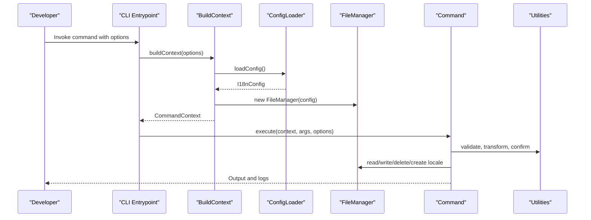
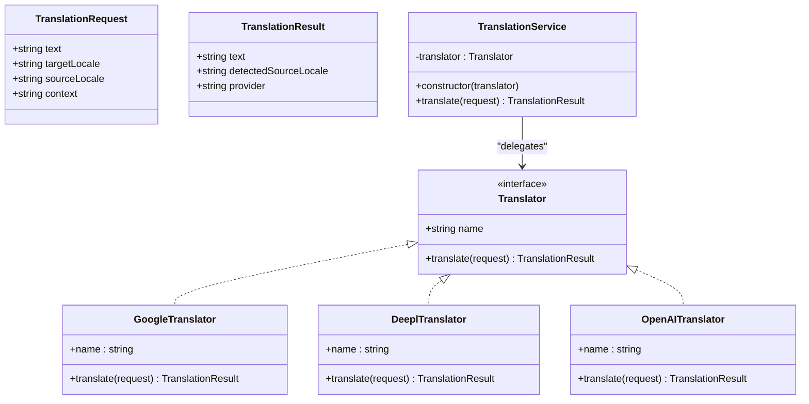
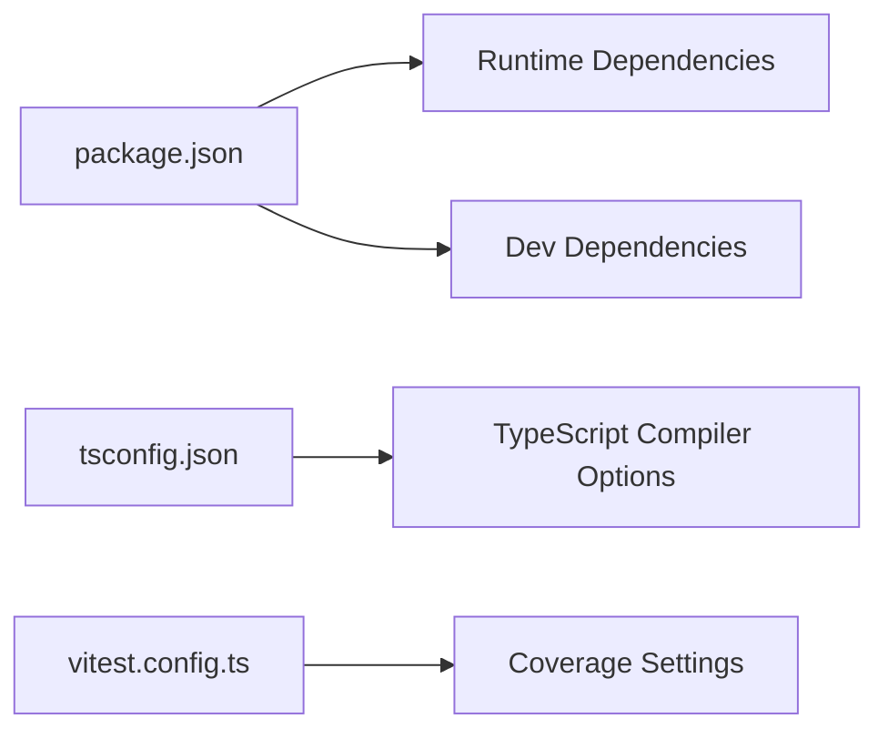

# Development & Contributing

<cite>
**Referenced Files in This Document**
- [package.json](file://package.json)
- [tsconfig.json](file://tsconfig.json)
- [vitest.config.ts](file://vitest.config.ts)
- [README.md](file://README.md)
- [src/bin/cli.ts](file://src/bin/cli.ts)
- [src/context/build-context.ts](file://src/context/build-context.ts)
- [src/context/build-context.test.ts](file://src/context/build-context.test.ts)
- [src/context/types.ts](file://src/context/types.ts)
- [src/config/config-loader.ts](file://src/config/config-loader.ts)
- [src/config/config-loader.test.ts](file://src/config/config-loader.test.ts)
- [src/config/types.ts](file://src/config/types.ts)
- [src/core/file-manager.ts](file://src/core/file-manager.ts)
- [src/core/file-manager.test.ts](file://src/core/file-manager.test.ts)
- [src/core/confirmation.ts](file://src/core/confirmation.ts)
- [src/core/confirmation.test.ts](file://src/core/confirmation.test.ts)
- [src/core/object-utils.ts](file://src/core/object-utils.ts)
- [src/core/object-utils.test.ts](file://src/core/object-utils.test.ts)
- [src/core/key-validator.ts](file://src/core/key-validator.ts)
- [src/core/key-validator.test.ts](file://src/core/key-validator.test.ts)
- [src/providers/translator.ts](file://src/providers/translator.ts)
- [src/providers/google.ts](file://src/providers/google.ts)
- [src/providers/deepl.ts](file://src/providers/deepl.ts)
- [src/providers/openai.ts](file://src/providers/openai.ts)
- [src/providers/translator.test.ts](file://src/providers/translator.test.ts)
- [src/services/translation-service.ts](file://src/services/translation-service.ts)
- [src/services/translation-service.test.ts](file://src/services/translation-service.test.ts)
- [src/commands/init.ts](file://src/commands/init.ts)
- [src/commands/init.test.ts](file://src/commands/init.test.ts)
- [src/commands/add-key.ts](file://src/commands/add-key.ts)
- [src/commands/add-lang.ts](file://src/commands/add-lang.ts)
- [src/commands/clean-unused.ts](file://src/commands/clean-unused.ts)
- [src/commands/remove-key.ts](file://src/commands/remove-key.ts)
- [src/commands/remove-lang.ts](file://src/commands/remove-lang.ts)
- [src/commands/update-key.ts](file://src/commands/update-key.ts)
</cite>

## Update Summary
**Changes Made**
- Added comprehensive unit testing framework documentation covering all 16 test files
- Updated testing methodology to reflect Vitest-based testing with extensive mocking
- Documented testing patterns for commands, configuration, context, core utilities, providers, and services
- Added coverage requirements and testing best practices established in the codebase
- Enhanced testing documentation with specific examples from the existing test suite

## Table of Contents
1. [Introduction](#introduction)
2. [Project Structure](#project-structure)
3. [Core Components](#core-components)
4. [Architecture Overview](#architecture-overview)
5. [Testing Framework](#testing-framework)
6. [Detailed Component Analysis](#detailed-component-analysis)
7. [Dependency Analysis](#dependency-analysis)
8. [Performance Considerations](#performance-considerations)
9. [Troubleshooting Guide](#troubleshooting-guide)
10. [Conclusion](#conclusion)
11. [Appendices](#appendices)

## Introduction
This guide explains how to set up a development environment for i18n-pro, contribute effectively, and maintain high-quality code. It covers prerequisites, build and test processes, project structure, TypeScript configuration, comprehensive unit testing with Vitest, code style, commit conventions, pull request expectations, and practical development tasks such as adding new commands, implementing translation providers, and extending configuration options.

**Updated** The project now includes a comprehensive unit testing framework with 16 test files covering all core functionality, establishing robust testing patterns and coverage requirements.

## Project Structure
The project is organized around a CLI entrypoint, a command layer, configuration loading, a context builder, core utilities, providers for translation services, and a translation service wrapper. Tests live alongside source files with a naming convention ending in .test.ts.

**Diagram sources**
- [src/bin/cli.ts](file://src/bin/cli.ts)
- [src/context/build-context.ts](file://src/context/build-context.ts)
- [src/context/build-context.test.ts](file://src/context/build-context.test.ts)
- [src/config/config-loader.ts](file://src/config/config-loader.ts)
- [src/config/config-loader.test.ts](file://src/config/config-loader.test.ts)
- [src/core/file-manager.ts](file://src/core/file-manager.ts)
- [src/core/file-manager.test.ts](file://src/core/file-manager.test.ts)
- [src/commands/init.ts](file://src/commands/init.ts)
- [src/commands/init.test.ts](file://src/commands/init.test.ts)
- [src/providers/translator.ts](file://src/providers/translator.ts)
- [src/providers/translator.test.ts](file://src/providers/translator.test.ts)
- [src/services/translation-service.ts](file://src/services/translation-service.ts)
- [src/services/translation-service.test.ts](file://src/services/translation-service.test.ts)

**Section sources**
- [src/bin/cli.ts](file://src/bin/cli.ts)
- [src/context/build-context.ts](file://src/context/build-context.ts)
- [src/context/build-context.test.ts](file://src/context/build-context.test.ts)
- [src/config/config-loader.ts](file://src/config/config-loader.ts)
- [src/config/config-loader.test.ts](file://src/config/config-loader.test.ts)
- [src/core/file-manager.ts](file://src/core/file-manager.ts)
- [src/core/file-manager.test.ts](file://src/core/file-manager.test.ts)
- [src/commands/init.ts](file://src/commands/init.ts)
- [src/commands/init.test.ts](file://src/commands/init.test.ts)
- [src/providers/translator.ts](file://src/providers/translator.ts)
- [src/providers/translator.test.ts](file://src/providers/translator.test.ts)
- [src/services/translation-service.ts](file://src/services/translation-service.ts)
- [src/services/translation-service.test.ts](file://src/services/translation-service.test.ts)

## Core Components
- CLI Entrypoint: Defines commands, global options, and error handling.
- Context Builder: Loads configuration and constructs the runtime context for commands.
- Config Loader: Reads and validates the configuration file with Zod.
- FileManager: Encapsulates filesystem operations for locale files and sorting.
- Commands: Implement user-facing operations (init, add key, etc.).
- Providers: Pluggable translation adapters (Google, DeepL, OpenAI).
- TranslationService: Thin wrapper delegating translation requests to providers.

**Section sources**
- [src/bin/cli.ts](file://src/bin/cli.ts)
- [src/context/build-context.ts](file://src/context/build-context.ts)
- [src/context/build-context.test.ts](file://src/context/build-context.test.ts)
- [src/config/config-loader.ts](file://src/config/config-loader.ts)
- [src/config/config-loader.test.ts](file://src/config/config-loader.test.ts)
- [src/core/file-manager.ts](file://src/core/file-manager.ts)
- [src/core/file-manager.test.ts](file://src/core/file-manager.test.ts)
- [src/providers/translator.ts](file://src/providers/translator.ts)
- [src/providers/translator.test.ts](file://src/providers/translator.test.ts)
- [src/services/translation-service.ts](file://src/services/translation-service.ts)
- [src/services/translation-service.test.ts](file://src/services/translation-service.test.ts)

## Architecture Overview
The CLI orchestrates commands that rely on a shared context built from configuration and a file manager. Commands delegate to core utilities for validation and transformations. Translation providers are swappable via the Translator interface.

**Diagram sources**
- [src/bin/cli.ts](file://src/bin/cli.ts)
- [src/context/build-context.ts](file://src/context/build-context.ts)
- [src/context/build-context.test.ts](file://src/context/build-context.test.ts)
- [src/config/config-loader.ts](file://src/config/config-loader.ts)
- [src/config/config-loader.test.ts](file://src/config/config-loader.test.ts)
- [src/core/file-manager.ts](file://src/core/file-manager.ts)
- [src/core/file-manager.test.ts](file://src/core/file-manager.test.ts)
- [src/commands/init.ts](file://src/commands/init.ts)
- [src/commands/init.test.ts](file://src/commands/init.test.ts)

## Testing Framework

### Vitest Configuration
The project uses Vitest as its testing framework with comprehensive coverage configuration. The testing setup includes:

- **Global Setup**: Enables global test functions and assertions
- **Environment**: Node.js environment for server-side testing
- **Include Patterns**: Targets all files matching `src/**/*.test.ts`
- **Coverage**: V8 provider with text, json, and html reporters
- **Exclusions**: Test files, type declarations, and CLI entry point

### Testing Coverage
The testing framework achieves comprehensive coverage across all core modules:

- **Commands**: Complete test coverage for all 8 command modules
- **Configuration**: Full validation and loading tests
- **Context**: Context building and dependency injection tests
- **Core Utilities**: Object manipulation, key validation, and confirmation utilities
- **Providers**: Translation provider interfaces and implementations
- **Services**: Translation service delegation and error handling

### Mocking Strategy
Extensive mocking is employed throughout the test suite:

- **File System Operations**: fs-extra mocked for all file operations
- **External APIs**: Google Translate API mocked for provider tests
- **Interactive Prompts**: Inquirer mocked for user interaction simulation
- **Process Environment**: stdout.isTTY and process.cwd mocked for environment detection

### Test Organization
Tests are organized following the same directory structure as source files, with each module having its own test file. The naming convention `.test.ts` clearly identifies test files.

**Section sources**
- [vitest.config.ts](file://vitest.config.ts)
- [src/context/build-context.test.ts](file://src/context/build-context.test.ts)
- [src/config/config-loader.test.ts](file://src/config/config-loader.test.ts)
- [src/core/file-manager.test.ts](file://src/core/file-manager.test.ts)
- [src/core/confirmation.test.ts](file://src/core/confirmation.test.ts)
- [src/core/object-utils.test.ts](file://src/core/object-utils.test.ts)
- [src/core/key-validator.test.ts](file://src/core/key-validator.test.ts)
- [src/providers/translator.test.ts](file://src/providers/translator.test.ts)
- [src/services/translation-service.test.ts](file://src/services/translation-service.test.ts)
- [src/commands/init.test.ts](file://src/commands/init.test.ts)

## Detailed Component Analysis

### CLI Entrypoint
- Registers commands and global options.
- Builds a command context per invocation.
- Centralizes error handling and exit behavior.

**Section sources**
- [src/bin/cli.ts](file://src/bin/cli.ts)

### Context Builder
- Loads configuration and instantiates FileManager.
- Exposes a typed CommandContext to commands.

**Section sources**
- [src/context/build-context.ts](file://src/context/build-context.ts)
- [src/context/build-context.test.ts](file://src/context/build-context.test.ts)
- [src/context/types.ts](file://src/context/types.ts)

### Configuration Loader
- Resolves the config file path and reads JSON.
- Validates with Zod, ensuring logical constraints.
- Compiles usage patterns into RegExp instances.

**Section sources**
- [src/config/config-loader.ts](file://src/config/config-loader.ts)
- [src/config/config-loader.test.ts](file://src/config/config-loader.test.ts)
- [src/config/types.ts](file://src/config/types.ts)

### FileManager
- Manages locale files under the configured directory.
- Provides read, write, create, delete, and recursive key sorting.

**Section sources**
- [src/core/file-manager.ts](file://src/core/file-manager.ts)
- [src/core/file-manager.test.ts](file://src/core/file-manager.test.ts)

### Commands
- Initialization wizard with interactive prompts and non-interactive fallback.
- Key management commands with structural validation and dry-run support.

**Section sources**
- [src/commands/init.ts](file://src/commands/init.ts)
- [src/commands/init.test.ts](file://src/commands/init.test.ts)
- [src/commands/add-key.ts](file://src/commands/add-key.ts)

### Translation Providers and Service
- Translator interface defines a uniform contract.
- Google provider integrates with a third-party translation library.
- DeepL and OpenAI are stubbed; can be extended by contributors.
- TranslationService delegates translation requests.

**Diagram sources**
- [src/providers/translator.ts](file://src/providers/translator.ts)
- [src/providers/translator.test.ts](file://src/providers/translator.test.ts)
- [src/providers/google.ts](file://src/providers/google.ts)
- [src/providers/deepl.ts](file://src/providers/deepl.ts)
- [src/providers/openai.ts](file://src/providers/openai.ts)
- [src/services/translation-service.ts](file://src/services/translation-service.ts)
- [src/services/translation-service.test.ts](file://src/services/translation-service.test.ts)

### Core Utilities Testing
The testing framework comprehensively covers utility functions:

- **Object Utils**: Flattening, unflattening, key extraction, and empty object removal
- **Key Validator**: Structural conflict detection and validation
- **Confirmation**: Interactive prompt handling and CI mode support

**Section sources**
- [src/core/object-utils.ts](file://src/core/object-utils.ts)
- [src/core/object-utils.test.ts](file://src/core/object-utils.test.ts)
- [src/core/key-validator.ts](file://src/core/key-validator.ts)
- [src/core/key-validator.test.ts](file://src/core/key-validator.test.ts)
- [src/core/confirmation.ts](file://src/core/confirmation.ts)
- [src/core/confirmation.test.ts](file://src/core/confirmation.test.ts)

## Dependency Analysis
- Runtime dependencies include CLI parsing, filesystem helpers, inquirer, color output, and translation APIs.
- Dev dependencies include TypeScript, bundling/transpilation, and testing.

**Diagram sources**
- [package.json](file://package.json)
- [tsconfig.json](file://tsconfig.json)
- [vitest.config.ts](file://vitest.config.ts)

**Section sources**
- [package.json](file://package.json)
- [tsconfig.json](file://tsconfig.json)
- [vitest.config.ts](file://vitest.config.ts)

## Performance Considerations
- Prefer batch operations where feasible (e.g., updating multiple locales).
- Use dry-run mode to preview work before committing changes.
- Keep usage patterns precise to avoid expensive scans during cleanup operations.

## Troubleshooting Guide
- Configuration file not found or invalid JSON: ensure the configuration file exists and is valid JSON; review validation messages for missing or incorrect fields.
- Regex usage patterns invalid or missing capturing groups: fix patterns to include a capturing group; the loader validates patterns and throws descriptive errors.
- Locale file missing or invalid JSON: FileManager throws explicit errors when reading non-existent or malformed locale files.
- Provider not implemented: DeepL and OpenAI translators are stubs; implement or provide an adapter conforming to the Translator interface.
- Test failures due to mocking: ensure proper mock setup and restoration in beforeEach/afterEach hooks.
- Coverage not meeting requirements: add tests for new functionality and verify coverage reports.

**Section sources**
- [src/config/config-loader.ts](file://src/config/config-loader.ts)
- [src/config/config-loader.test.ts](file://src/config/config-loader.test.ts)
- [src/core/file-manager.ts](file://src/core/file-manager.ts)
- [src/core/file-manager.test.ts](file://src/core/file-manager.test.ts)
- [src/providers/deepl.ts](file://src/providers/deepl.ts)
- [src/providers/deepl.test.ts](file://src/providers/deepl.test.ts)
- [src/providers/openai.ts](file://src/providers/openai.ts)
- [src/providers/openai.test.ts](file://src/providers/openai.test.ts)

## Conclusion
By following this guide, you can confidently develop, test, and extend i18n-pro. The comprehensive unit testing framework with 16 test files ensures robust coverage across all core functionality. Use the provided scripts, adhere to the TypeScript configuration, write tests with Vitest following the established patterns, and implement new features by extending the context, commands, providers, or configuration schema.

## Appendices

### Prerequisites
- Node.js version requirement and package manager: see the development section in the README for Node.js version and installation steps.

**Section sources**
- [README.md](file://README.md)

### Build and Test Scripts
- Install dependencies, build, watch, test, and typecheck are defined in the package scripts.

**Section sources**
- [package.json](file://package.json)

### TypeScript Configuration
- Strict compiler options, module resolution, target, declaration generation, and source maps are configured centrally.

**Section sources**
- [tsconfig.json](file://tsconfig.json)

### Testing with Vitest
- Global setup, Node environment, include patterns, and coverage configuration are centralized.

**Section sources**
- [vitest.config.ts](file://vitest.config.ts)

### Adding a New Command
- Steps:
  - Define the command in the CLI entrypoint with arguments and options.
  - Implement the command handler in a new file under commands/.
  - Use the context to access config and FileManager.
  - Respect global options (dry-run, yes, ci, force).
  - Add unit tests following the existing .test.ts naming pattern.

**Section sources**
- [src/bin/cli.ts](file://src/bin/cli.ts)
- [src/context/build-context.ts](file://src/context/build-context.ts)
- [src/context/build-context.test.ts](file://src/context/build-context.test.ts)
- [src/core/file-manager.ts](file://src/core/file-manager.ts)
- [src/core/file-manager.test.ts](file://src/core/file-manager.test.ts)

### Implementing a Translation Provider
- Steps:
  - Implement the Translator interface in a new provider file.
  - Integrate with the external service in the translate method.
  - Wrap usage with TranslationService for consistent behavior.
  - Add tests verifying the provider's translate method.

**Section sources**
- [src/providers/translator.ts](file://src/providers/translator.ts)
- [src/providers/translator.test.ts](file://src/providers/translator.test.ts)
- [src/services/translation-service.ts](file://src/services/translation-service.ts)
- [src/services/translation-service.test.ts](file://src/services/translation-service.test.ts)
- [src/providers/google.ts](file://src/providers/google.ts)
- [src/providers/deepl.ts](file://src/providers/deepl.ts)
- [src/providers/openai.ts](file://src/providers/openai.ts)

### Extending Configuration Options
- Steps:
  - Add the new option to the configuration types.
  - Extend the Zod schema with appropriate validation.
  - Apply defaults and derive computed fields (e.g., compiled usage patterns).
  - Update consumers to handle the new field.

**Section sources**
- [src/config/types.ts](file://src/config/types.ts)
- [src/config/config-loader.ts](file://src/config/config-loader.ts)
- [src/config/config-loader.test.ts](file://src/config/config-loader.test.ts)

### Writing Effective Tests
- Use Vitest with Node environment and global assertions enabled.
- Place tests adjacent to source files with .test.ts suffix.
- Leverage mocks for filesystem and external services.
- Ensure coverage targets include source files and exclude test and declaration files.
- Follow the established testing patterns from the existing test suite.

**Section sources**
- [vitest.config.ts](file://vitest.config.ts)
- [src/context/build-context.test.ts](file://src/context/build-context.test.ts)
- [src/config/config-loader.test.ts](file://src/config/config-loader.test.ts)
- [src/core/file-manager.test.ts](file://src/core/file-manager.test.ts)
- [src/core/confirmation.test.ts](file://src/core/confirmation.test.ts)
- [src/core/object-utils.test.ts](file://src/core/object-utils.test.ts)
- [src/core/key-validator.test.ts](file://src/core/key-validator.test.ts)
- [src/providers/translator.test.ts](file://src/providers/translator.test.ts)
- [src/services/translation-service.test.ts](file://src/services/translation-service.test.ts)
- [src/commands/init.test.ts](file://src/commands/init.test.ts)

### Code Style Standards
- Enforced by TypeScript strictness and compiler options.
- Maintain ES modules, explicit types, and consistent formatting.

**Section sources**
- [tsconfig.json](file://tsconfig.json)

### Commit Conventions and Pull Requests
- Use conventional commit messages (e.g., feat:, fix:, chore:, docs:).
- Reference related issues in commit messages.
- Keep PRs focused and include tests and documentation updates.

### Issue Reporting
- Provide a clear description, reproduction steps, expected vs. actual behavior, and environment details (Node.js version, OS).
- Include test coverage information and any failing test scenarios.