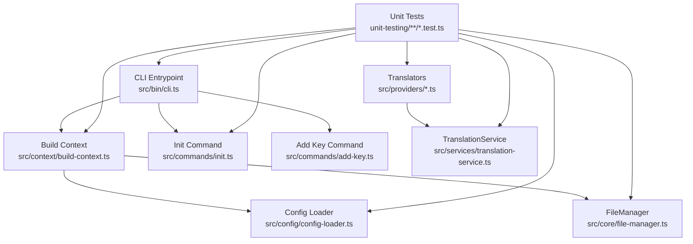
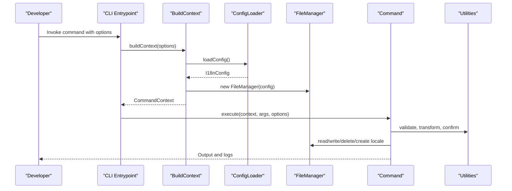
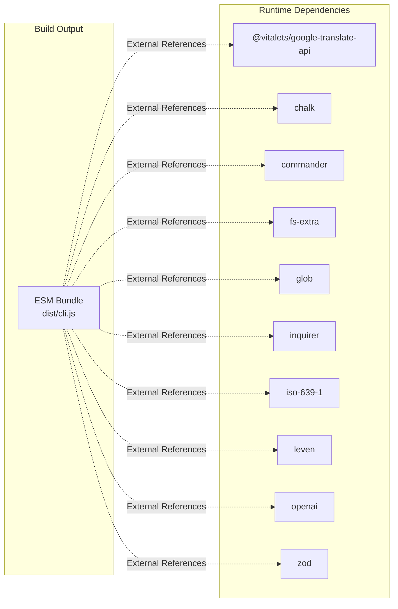
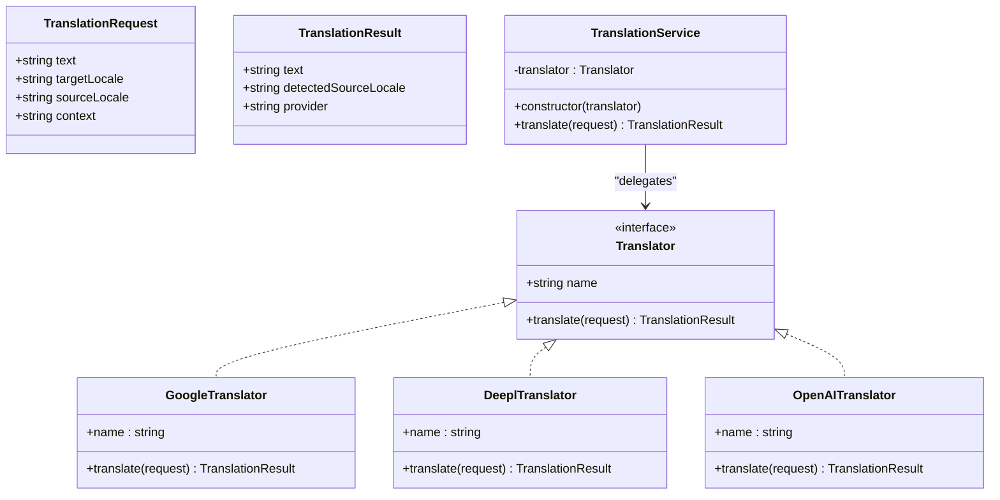
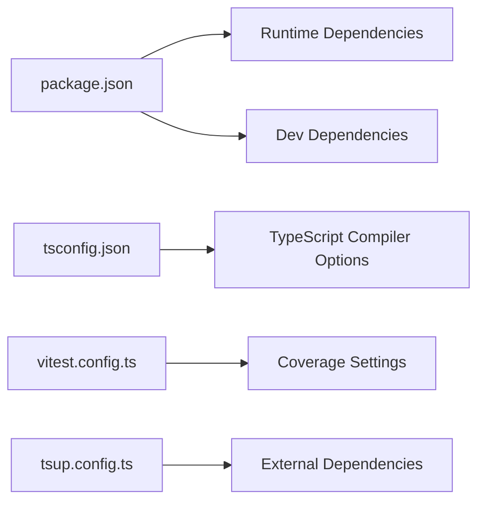

# Development & Contributing

<cite>
**Referenced Files in This Document**
- [package.json](file://package.json)
- [tsconfig.json](file://tsconfig.json)
- [tsup.config.ts](file://tsup.config.ts)
- [vitest.config.ts](file://vitest.config.ts)
- [README.md](file://README.md)
- [CODE_OF_CONDUCT.md](file://CODE_OF_CONDUCT.md)
- [CONTRIBUTING.md](file://CONTRIBUTING.md)
- [src/bin/cli.ts](file://src/bin/cli.ts)
- [src/context/build-context.ts](file://src/context/build-context.ts)
- [unit-testing/context/build-context.test.ts](file://unit-testing/context/build-context.test.ts)
- [src/context/types.ts](file://src/context/types.ts)
- [src/config/config-loader.ts](file://src/config/config-loader.ts)
- [unit-testing/config/config-loader.test.ts](file://unit-testing/config/config-loader.test.ts)
- [src/config/types.ts](file://src/config/types.ts)
- [src/core/file-manager.ts](file://src/core/file-manager.ts)
- [unit-testing/core/file-manager.test.ts](file://unit-testing/core/file-manager.test.ts)
- [src/core/confirmation.ts](file://src/core/confirmation.ts)
- [unit-testing/core/confirmation.test.ts](file://unit-testing/core/confirmation.test.ts)
- [src/core/object-utils.ts](file://src/core/object-utils.ts)
- [unit-testing/core/object-utils.test.ts](file://unit-testing/core/object-utils.test.ts)
- [src/core/key-validator.ts](file://src/core/key-validator.ts)
- [unit-testing/core/key-validator.test.ts](file://unit-testing/core/key-validator.test.ts)
- [src/providers/translator.ts](file://src/providers/translator.ts)
- [src/providers/google.ts](file://src/providers/google.ts)
- [src/providers/deepl.ts](file://src/providers/deepl.ts)
- [src/providers/openai.ts](file://src/providers/openai.ts)
- [unit-testing/providers/translator.test.ts](file://unit-testing/providers/translator.test.ts)
- [src/services/translation-service.ts](file://src/services/translation-service.ts)
- [unit-testing/services/translation-service.test.ts](file://unit-testing/services/translation-service.test.ts)
- [src/commands/init.ts](file://src/commands/init.ts)
- [unit-testing/commands/init.test.ts](file://unit-testing/commands/init.test.ts)
- [src/commands/add-key.ts](file://src/commands/add-key.ts)
- [src/commands/add-lang.ts](file://src/commands/add-lang.ts)
- [src/commands/clean-unused.ts](file://src/commands/clean-unused.ts)
- [src/commands/remove-key.ts](file://src/commands/remove-key.ts)
- [src/commands/remove-lang.ts](file://src/commands/remove-lang.ts)
- [src/commands/update-key.ts](file://src/commands/update-key.ts)
</cite>

## Update Summary
**Changes Made**
- Updated project structure documentation to reflect reorganization of test files from `src/` to `unit-testing/` directory
- Updated build configuration documentation to reflect changes in TypeScript include/exclude patterns and Vitest include patterns
- Revised testing framework documentation to reflect new test organization and coverage configuration
- Updated troubleshooting guide to address new test directory structure and build configuration changes
- Enhanced development workflow documentation with improved test organization guidance

## Table of Contents
1. [Introduction](#introduction)
2. [Version History](#version-history)
3. [Repository Metadata](#repository-metadata)
4. [Community Governance](#community-governance)
5. [Contributing Guidelines](#contributing-guidelines)
6. [Project Structure](#project-structure)
7. [Core Components](#core-components)
8. [Architecture Overview](#architecture-overview)
9. [Build System](#build-system)
10. [Testing Framework](#testing-framework)
11. [Detailed Component Analysis](#detailed-component-analysis)
12. [Dependency Analysis](#dependency-analysis)
13. [Performance Considerations](#performance-considerations)
14. [Troubleshooting Guide](#troubleshooting-guide)
15. [Conclusion](#conclusion)
16. [Appendices](#appendices)

## Introduction
This guide explains how to set up a development environment for i18n-ai-cli, contribute effectively, and maintain high-quality code. It covers prerequisites, build and test processes, project structure, TypeScript configuration, comprehensive unit testing with Vitest, code style, commit conventions, pull request expectations, and practical development tasks such as adding new commands, implementing translation providers, and extending configuration options.

**Updated** The project now features a reorganized test structure with dedicated `unit-testing/` directory for all test files, enhanced build configuration with improved TypeScript and Vitest setup, and streamlined development workflow with better separation of concerns between source and test code.

## Version History
The project follows semantic versioning with the current version being 1.0.8. This release maintains backward compatibility while introducing improved test organization, enhanced build system performance, and better development workflow practices.

**Section sources**
- [package.json](file://package.json)

## Repository Metadata
The project maintains official repository metadata for community collaboration and issue tracking.

**Section sources**
- [package.json](file://package.json)

## Community Governance

### Code of Conduct
This project and everyone participating in it is governed by a Code of Conduct that promotes a welcoming and inclusive experience for everyone. The Code of Conduct establishes behavioral standards and enforcement responsibilities for all community members.

**Key Principles:**
- **Respectful Interaction**: Demonstrating empathy and kindness toward other people
- **Constructive Feedback**: Being respectful of differing opinions and viewpoints
- **Professional Conduct**: Accepting responsibility and apologizing when mistakes are made
- **Community Focus**: Focusing on what is best for the overall community

**Enforcement Scope:**
- Applies within all community spaces
- Also applies when an individual is officially representing the community in public spaces
- Examples include using official email addresses or acting as appointed representatives

**Reporting Mechanism:**
- Instances of unacceptable behavior can be reported to community leaders at wafiamustafa@gmail.com
- All complaints will be reviewed and investigated promptly and fairly
- Community leaders are obligated to respect the privacy and security of reporters

**Section sources**
- [CODE_OF_CONDUCT.md](file://CODE_OF_CONDUCT.md)

### Community Standards
The project maintains high standards for community interaction and collaboration. All participants are expected to contribute to an open, welcoming, diverse, inclusive, and healthy community environment.

**Positive Behaviors:**
- Demonstrating empathy and kindness toward other people
- Being respectful of differing opinions, viewpoints, and experiences
- Giving and gracefully accepting constructive feedback
- Accepting responsibility and apologizing to those affected by mistakes

**Unacceptable Behaviors:**
- Use of sexualized language or imagery
- Trolling, insulting or derogatory comments
- Personal or political attacks
- Publishing others' private information without explicit permission
- Other conduct considered inappropriate in a professional setting

**Section sources**
- [CODE_OF_CONDUCT.md](file://CODE_OF_CONDUCT.md)

## Contributing Guidelines

### Getting Started
1. **Fork the repository** on GitHub
2. **Clone your fork** locally and navigate to the project directory
3. **Add the upstream remote** to track the main repository

### Development Setup
**Prerequisites:**
- Node.js 18 or higher
- npm or yarn package manager

**Installation Steps:**
1. Install dependencies: `npm install`
2. Build the project: `npm run build`
3. Link for local testing: `npm link`
4. Test your changes: `i18n-ai-cli --help`
5. Unlink when finished: `npm unlink -g i18n-ai-cli`

### Branch Naming Convention
Use descriptive branch names following these patterns:
- `feature/add-new-command` - for new features
- `fix/bug-description` - for bug fixes
- `docs/update-readme` - for documentation updates
- `refactor/some-component` - for code refactoring

### Code Style and Standards
- The project uses TypeScript with strict type checking
- Follow existing code patterns and conventions
- Ensure your code passes type checking: `npm run typecheck`

### Project Structure
```
src/
├── bin/           # CLI entry point
├── commands/      # CLI commands (add-key, remove-lang, etc.)
├── config/        # Configuration loading and types
├── context/       # Context management and dependency injection
├── core/          # Core utilities (file-manager, validators, etc.)
├── providers/     # Translation providers (OpenAI, Google, etc.)
└── services/      # Translation services

unit-testing/
├── commands/      # Unit tests for commands
├── config/        # Unit tests for configuration
├── context/       # Unit tests for context builder
├── core/          # Unit tests for core utilities
├── providers/     # Unit tests for translation providers
└── services/      # Unit tests for translation services
```

**Updated** The project now features a dedicated `unit-testing/` directory structure that separates test files from source files, improving code organization and maintainability.

### Testing Requirements
- Tests are organized in the `unit-testing/` directory following the same structure as source files
- Each module has its own test file with naming convention ending in `.test.ts`
- We use Vitest for testing with comprehensive coverage configuration
- Aim for high test coverage, especially for new features
- Mock external dependencies (file system, API calls, etc.)

### Pull Request Process
1. **Push your branch** to your fork
2. **Create a Pull Request** on GitHub from your fork to the main repository
3. **Fill out the PR template** with clear description of changes and rationale
4. **Wait for review** - maintainers will review your PR and may request changes
5. **Address feedback** by making additional commits to your branch

### PR Checklist
- [ ] Code builds successfully (`npm run build`)
- [ ] Type checking passes (`npm run typecheck`)
- [ ] All tests pass (`npm test`)
- [ ] New tests added for new features
- [ ] Documentation updated (if needed)
- [ ] Commit messages are clear and descriptive

### Release Process
The release process is handled by maintainers:
1. Update version in `package.json`
2. Run `npm version patch|minor|major`
3. Push tags: `git push --follow-tags`
4. Publish to npm: `npm publish`

**Section sources**
- [CONTRIBUTING.md](file://CONTRIBUTING.md)
- [README.md](file://README.md)
- [package.json](file://package.json)

## Project Structure
The project is organized around a CLI entrypoint, a command layer, configuration loading, a context builder, core utilities, providers for translation services, and a translation service wrapper. Tests are now organized in a dedicated `unit-testing/` directory with the same structure as source files.



**Diagram sources**
- [src/bin/cli.ts](file://src/bin/cli.ts)
- [src/context/build-context.ts](file://src/context/build-context.ts)
- [unit-testing/context/build-context.test.ts](file://unit-testing/context/build-context.test.ts)
- [src/config/config-loader.ts](file://src/config/config-loader.ts)
- [unit-testing/config/config-loader.test.ts](file://unit-testing/config/config-loader.test.ts)
- [src/core/file-manager.ts](file://src/core/file-manager.ts)
- [unit-testing/core/file-manager.test.ts](file://unit-testing/core/file-manager.test.ts)
- [src/commands/init.ts](file://src/commands/init.ts)
- [unit-testing/commands/init.test.ts](file://unit-testing/commands/init.test.ts)
- [src/providers/translator.ts](file://src/providers/translator.ts)
- [unit-testing/providers/translator.test.ts](file://unit-testing/providers/translator.test.ts)
- [src/services/translation-service.ts](file://src/services/translation-service.ts)
- [unit-testing/services/translation-service.test.ts](file://unit-testing/services/translation-service.test.ts)

**Section sources**
- [src/bin/cli.ts](file://src/bin/cli.ts)
- [src/context/build-context.ts](file://src/context/build-context.ts)
- [unit-testing/context/build-context.test.ts](file://unit-testing/context/build-context.test.ts)
- [src/config/config-loader.ts](file://src/config/config-loader.ts)
- [unit-testing/config/config-loader.test.ts](file://unit-testing/config/config-loader.test.ts)
- [src/core/file-manager.ts](file://src/core/file-manager.ts)
- [unit-testing/core/file-manager.test.ts](file://unit-testing/core/file-manager.test.ts)
- [src/commands/init.ts](file://src/commands/init.ts)
- [unit-testing/commands/init.test.ts](file://unit-testing/commands/init.test.ts)
- [src/providers/translator.ts](file://src/providers/translator.ts)
- [unit-testing/providers/translator.test.ts](file://unit-testing/providers/translator.test.ts)
- [src/services/translation-service.ts](file://src/services/translation-service.ts)
- [unit-testing/services/translation-service.test.ts](file://unit-testing/services/translation-service.test.ts)

## Core Components
- CLI Entrypoint: Defines commands, global options, and error handling.
- Context Builder: Loads configuration and constructs the runtime context for commands.
- Config Loader: Reads and validates the configuration file with Zod.
- FileManager: Encapsulates filesystem operations for locale files and sorting.
- Commands: Implement user-facing operations (init, add key, etc.).
- Providers: Pluggable translation adapters (Google, DeepL, OpenAI).
- TranslationService: Thin wrapper delegating translation requests to providers.

**Section sources**
- [src/bin/cli.ts](file://src/bin/cli.ts)
- [src/context/build-context.ts](file://src/context/build-context.ts)
- [unit-testing/context/build-context.test.ts](file://unit-testing/context/build-context.test.ts)
- [src/config/config-loader.ts](file://src/config/config-loader.ts)
- [unit-testing/config/config-loader.test.ts](file://unit-testing/config/config-loader.test.ts)
- [src/core/file-manager.ts](file://src/core/file-manager.ts)
- [unit-testing/core/file-manager.test.ts](file://unit-testing/core/file-manager.test.ts)
- [src/providers/translator.ts](file://src/providers/translator.ts)
- [unit-testing/providers/translator.test.ts](file://unit-testing/providers/translator.test.ts)
- [src/services/translation-service.ts](file://src/services/translation-service.ts)
- [unit-testing/services/translation-service.test.ts](file://unit-testing/services/translation-service.test.ts)

## Architecture Overview
The CLI orchestrates commands that rely on a shared context built from configuration and a file manager. Commands delegate to core utilities for validation and transformations. Translation providers are swappable via the Translator interface.



**Diagram sources**
- [src/bin/cli.ts](file://src/bin/cli.ts)
- [src/context/build-context.ts](file://src/context/build-context.ts)
- [unit-testing/context/build-context.test.ts](file://unit-testing/context/build-context.test.ts)
- [src/config/config-loader.ts](file://src/config/config-loader.ts)
- [unit-testing/config/config-loader.test.ts](file://unit-testing/config/config-loader.test.ts)
- [src/core/file-manager.ts](file://src/core/file-manager.ts)
- [unit-testing/core/file-manager.test.ts](file://unit-testing/core/file-manager.test.ts)
- [src/commands/init.ts](file://src/commands/init.ts)
- [unit-testing/commands/init.test.ts](file://unit-testing/commands/init.test.ts)

## Build System

### Build Configuration Overview
The project uses tsup as its build tool with a dependency externalization strategy for optimal CommonJS compatibility and runtime module resolution. The build configuration is designed to produce ESM bundles while letting Node.js handle dependency resolution at runtime.

**Updated** The build system now employs a strategic externalization approach where all production dependencies are marked as external, allowing Node.js to resolve them dynamically at runtime rather than bundling them statically. The TypeScript configuration has been updated to focus on source files in the `src/` directory.

### Tsup Configuration Details
The build system is configured with the following key settings:

- **Entry Point**: Single entry point targeting the CLI binary (`src/bin/cli.ts`)
- **Output Format**: ESM (ECMAScript Modules) for modern compatibility
- **Bundle Strategy**: External dependencies approach for better runtime resolution
- **Source Maps**: Enabled for debugging and development
- **Minification**: Disabled for better debugging and smaller bundle size
- **Shims**: Enabled for compatibility with various module systems

### External Dependencies Strategy
The build system externalizes all production dependencies to address CommonJS compatibility issues:



**Diagram sources**
- [tsup.config.ts](file://tsup.config.ts)
- [package.json](file://package.json)

### Build Process
The build process follows these steps:

1. **TypeScript Compilation**: Source files are compiled with strict TypeScript settings
2. **Dependency Resolution**: External dependencies are excluded from the bundle
3. **ESM Generation**: Output is generated in ESM format for modern Node.js compatibility
4. **Source Map Creation**: Debugging information is preserved for development
5. **Distribution Packaging**: Final artifacts are placed in the dist directory

### Build Scripts
The project provides several build-related scripts:

- `npm run build`: Creates optimized production builds
- `npm run dev`: Starts development watch mode for continuous compilation
- `npm run typecheck`: Performs TypeScript type checking without emitting files

**Section sources**
- [tsup.config.ts](file://tsup.config.ts)
- [package.json](file://package.json)

## Testing Framework

### Vitest Configuration
The project uses Vitest as its testing framework with comprehensive coverage configuration. The testing setup includes:

- **Global Setup**: Enables global test functions and assertions
- **Environment**: Node.js environment for server-side testing
- **Include Patterns**: Targets all files matching `unit-testing/**/*.test.ts`
- **Coverage**: V8 provider with text, json, and html reporters
- **Exclusions**: Test files, type declarations, and CLI entry point

**Updated** The Vitest configuration has been updated to reflect the new test directory structure, with include patterns pointing to `unit-testing/**/*.test.ts` and coverage configuration targeting `src/**/*.ts`.

### Testing Coverage
The testing framework achieves comprehensive coverage across all core modules:

- **Commands**: Complete test coverage for all 8 command modules
- **Configuration**: Full validation and loading tests
- **Context**: Context building and dependency injection tests
- **Core Utilities**: Object manipulation, key validation, and confirmation utilities
- **Providers**: Translation provider interfaces and implementations
- **Services**: Translation service delegation and error handling

### Mocking Strategy
Extensive mocking is employed throughout the test suite:

- **File System Operations**: fs-extra mocked for all file operations
- **External APIs**: Google Translate API mocked for provider tests
- **Interactive Prompts**: Inquirer mocked for user interaction simulation
- **Process Environment**: stdout.isTTY and process.cwd mocked for environment detection

### Test Organization
Tests are organized following the same directory structure as source files, with each module having its own test file in the `unit-testing/` directory. The naming convention `.test.ts` clearly identifies test files.

**Section sources**
- [vitest.config.ts](file://vitest.config.ts)
- [unit-testing/context/build-context.test.ts](file://unit-testing/context/build-context.test.ts)
- [unit-testing/config/config-loader.test.ts](file://unit-testing/config/config-loader.test.ts)
- [unit-testing/core/file-manager.test.ts](file://unit-testing/core/file-manager.test.ts)
- [unit-testing/core/confirmation.test.ts](file://unit-testing/core/confirmation.test.ts)
- [unit-testing/core/object-utils.test.ts](file://unit-testing/core/object-utils.test.ts)
- [unit-testing/core/key-validator.test.ts](file://unit-testing/core/key-validator.test.ts)
- [unit-testing/providers/translator.test.ts](file://unit-testing/providers/translator.test.ts)
- [unit-testing/services/translation-service.test.ts](file://unit-testing/services/translation-service.test.ts)
- [unit-testing/commands/init.test.ts](file://unit-testing/commands/init.test.ts)

## Detailed Component Analysis

### CLI Entrypoint
- Registers commands and global options.
- Builds a command context per invocation.
- Centralizes error handling and exit behavior.

**Section sources**
- [src/bin/cli.ts](file://src/bin/cli.ts)

### Context Builder
- Loads configuration and instantiates FileManager.
- Exposes a typed CommandContext to commands.

**Section sources**
- [src/context/build-context.ts](file://src/context/build-context.ts)
- [unit-testing/context/build-context.test.ts](file://unit-testing/context/build-context.test.ts)
- [src/context/types.ts](file://src/context/types.ts)

### Configuration Loader
- Resolves the config file path and reads JSON.
- Validates with Zod, ensuring logical constraints.
- Compiles usage patterns into RegExp instances.

**Section sources**
- [src/config/config-loader.ts](file://src/config/config-loader.ts)
- [unit-testing/config/config-loader.test.ts](file://unit-testing/config/config-loader.test.ts)
- [src/config/types.ts](file://src/config/types.ts)

### FileManager
- Manages locale files under the configured directory.
- Provides read, write, create, delete, and recursive key sorting.

**Section sources**
- [src/core/file-manager.ts](file://src/core/file-manager.ts)
- [unit-testing/core/file-manager.test.ts](file://unit-testing/core/file-manager.test.ts)

### Commands
- Initialization wizard with interactive prompts and non-interactive fallback.
- Key management commands with structural validation and dry-run support.

**Section sources**
- [src/commands/init.ts](file://src/commands/init.ts)
- [unit-testing/commands/init.test.ts](file://unit-testing/commands/init.test.ts)
- [src/commands/add-key.ts](file://src/commands/add-key.ts)
- [src/commands/add-lang.ts](file://src/commands/add-lang.ts)
- [src/commands/clean-unused.ts](file://src/commands/clean-unused.ts)

### Translation Providers and Service
- Translator interface defines a uniform contract.
- Google provider integrates with a third-party translation library.
- DeepL and OpenAI are stubbed; can be extended by contributors.
- TranslationService delegates translation requests.



**Diagram sources**
- [src/providers/translator.ts](file://src/providers/translator.ts)
- [unit-testing/providers/translator.test.ts](file://unit-testing/providers/translator.test.ts)
- [src/providers/google.ts](file://src/providers/google.ts)
- [src/providers/deepl.ts](file://src/providers/deepl.ts)
- [src/providers/openai.ts](file://src/providers/openai.ts)
- [src/services/translation-service.ts](file://src/services/translation-service.ts)
- [unit-testing/services/translation-service.test.ts](file://unit-testing/services/translation-service.test.ts)

### Core Utilities Testing
The testing framework comprehensively covers utility functions:

- **Object Utils**: Flattening, unflattening, key extraction, and empty object removal
- **Key Validator**: Structural conflict detection and validation
- **Confirmation**: Interactive prompt handling and CI mode support

**Section sources**
- [src/core/object-utils.ts](file://src/core/object-utils.ts)
- [unit-testing/core/object-utils.test.ts](file://unit-testing/core/object-utils.test.ts)
- [src/core/key-validator.ts](file://src/core/key-validator.ts)
- [unit-testing/core/key-validator.test.ts](file://unit-testing/core/key-validator.test.ts)
- [src/core/confirmation.ts](file://src/core/confirmation.ts)
- [unit-testing/core/confirmation.test.ts](file://unit-testing/core/confirmation.test.ts)

## Dependency Analysis
- Runtime dependencies include CLI parsing, filesystem helpers, inquirer, color output, and translation APIs.
- Dev dependencies include TypeScript, bundling/transpilation, and testing.



**Diagram sources**
- [package.json](file://package.json)
- [tsconfig.json](file://tsconfig.json)
- [vitest.config.ts](file://vitest.config.ts)
- [tsup.config.ts](file://tsup.config.ts)

**Section sources**
- [package.json](file://package.json)
- [tsconfig.json](file://tsconfig.json)
- [vitest.config.ts](file://vitest.config.ts)
- [tsup.config.ts](file://tsup.config.ts)

## Performance Considerations
- Prefer batch operations where feasible (e.g., updating multiple locales).
- Use dry-run mode to preview work before committing changes.
- Keep usage patterns precise to avoid expensive scans during cleanup operations.
- The external dependency approach reduces bundle size and improves startup performance.
- ESM format provides better tree-shaking and import performance.
- **Updated** The new test organization improves build performance by separating source and test files, reducing compilation overhead.

## Troubleshooting Guide
- Configuration file not found or invalid JSON: ensure the configuration file exists and is valid JSON; review validation messages for missing or incorrect fields.
- Regex usage patterns invalid or missing capturing groups: fix patterns to include a capturing group; the loader validates patterns and throws descriptive errors.
- Locale file missing or invalid JSON: FileManager throws explicit errors when reading non-existent or malformed locale files.
- Provider not implemented: DeepL and OpenAI translators are stubs; implement or provide an adapter conforming to the Translator interface.
- Test failures due to mocking: ensure proper mock setup and restoration in beforeEach/afterEach hooks.
- Coverage not meeting requirements: add tests for new functionality and verify coverage reports.
- **Build failures due to external dependencies**: Ensure all external dependencies are properly declared in package.json and available at runtime.
- **CommonJS compatibility issues**: The external dependency approach resolves CommonJS dynamic require issues by letting Node.js handle resolution.
- **Import errors in development**: Verify that all dependencies are installed and accessible in the node_modules directory.
- **Test organization issues**: Ensure test files are located in the `unit-testing/` directory following the correct structure.
- **Coverage not reflecting changes**: Verify that Vitest include patterns are correctly configured to include `src/**/*.ts` files.
- **Community conduct concerns**: Report issues to wafiamustafa@gmail.com following the Code of Conduct enforcement guidelines.

**Updated** Added troubleshooting guidance for community conduct issues, test organization problems, and build-specific issues related to the new directory structure and configuration changes.

**Section sources**
- [src/config/config-loader.ts](file://src/config/config-loader.ts)
- [unit-testing/config/config-loader.test.ts](file://unit-testing/config/config-loader.test.ts)
- [src/core/file-manager.ts](file://src/core/file-manager.ts)
- [unit-testing/core/file-manager.test.ts](file://unit-testing/core/file-manager.test.ts)
- [src/providers/deepl.ts](file://src/providers/deepl.ts)
- [unit-testing/providers/translator.test.ts](file://unit-testing/providers/translator.test.ts)
- [src/providers/openai.ts](file://src/providers/openai.ts)
- [tsup.config.ts](file://tsup.config.ts)
- [CODE_OF_CONDUCT.md](file://CODE_OF_CONDUCT.md)

## Conclusion
By following this guide, you can confidently develop, test, and extend i18n-ai-cli. The comprehensive unit testing framework with 16 test files organized in the `unit-testing/` directory ensures robust coverage across all core functionality. The enhanced build system with dependency externalization provides better CommonJS compatibility and runtime module resolution. The project's community governance framework establishes clear behavioral standards and contribution workflows.

Version 1.0.8 enhances the development experience with improved build performance, better dependency management, enhanced compatibility with modern Node.js environments, established community standards, and a well-organized test structure that improves maintainability and development workflow.

Use the provided scripts, adhere to the TypeScript configuration, write tests with Vitest following the established patterns in the `unit-testing/` directory, implement new features by extending the context, commands, providers, or configuration schema, and contribute to the community following the Code of Conduct and Contributing guidelines.

## Appendices

### Prerequisites
- Node.js version requirement and package manager: see the development section in the README for Node.js version and installation steps.

**Section sources**
- [README.md](file://README.md)

### Build and Test Scripts
- Install dependencies, build, watch, test, and typecheck are defined in the package scripts.

**Section sources**
- [package.json](file://package.json)

### TypeScript Configuration
- Strict compiler options, module resolution, target, declaration generation, and source maps are configured centrally.
- **Updated** TypeScript configuration now focuses on `src/**/*` files for compilation.

**Section sources**
- [tsconfig.json](file://tsconfig.json)

### Build System Configuration
- **External Dependencies**: All production dependencies are externalized for better CommonJS compatibility
- **ESM Output**: Generated in ESM format for modern Node.js compatibility
- **Source Maps**: Enabled for debugging and development
- **Minification**: Disabled for better debugging experience

**Section sources**
- [tsup.config.ts](file://tsup.config.ts)
- [package.json](file://package.json)

### Testing with Vitest
- Global setup, Node environment, include patterns, and coverage configuration are centralized.
- **Updated** Vitest configuration now targets `unit-testing/**/*.test.ts` for test discovery and `src/**/*.ts` for coverage.

**Section sources**
- [vitest.config.ts](file://vitest.config.ts)

### Adding a New Command
- Steps:
  - Define the command in the CLI entrypoint with arguments and options.
  - Implement the command handler in a new file under `src/commands/`.
  - Use the context to access config and FileManager.
  - Respect global options (dry-run, yes, ci, force).
  - Add unit tests following the existing `.test.ts` naming pattern in `unit-testing/commands/`.

**Section sources**
- [src/bin/cli.ts](file://src/bin/cli.ts)
- [src/context/build-context.ts](file://src/context/build-context.ts)
- [unit-testing/context/build-context.test.ts](file://unit-testing/context/build-context.test.ts)
- [src/core/file-manager.ts](file://src/core/file-manager.ts)
- [unit-testing/core/file-manager.test.ts](file://unit-testing/core/file-manager.test.ts)

### Implementing a Translation Provider
- Steps:
  - Implement the Translator interface in a new provider file under `src/providers/`.
  - Integrate with the external service in the translate method.
  - Wrap usage with TranslationService for consistent behavior.
  - Add tests verifying the provider's translate method in `unit-testing/providers/`.

**Section sources**
- [src/providers/translator.ts](file://src/providers/translator.ts)
- [unit-testing/providers/translator.test.ts](file://unit-testing/providers/translator.test.ts)
- [src/services/translation-service.ts](file://src/services/translation-service.ts)
- [unit-testing/services/translation-service.test.ts](file://unit-testing/services/translation-service.test.ts)
- [src/providers/google.ts](file://src/providers/google.ts)
- [src/providers/deepl.ts](file://src/providers/deepl.ts)
- [src/providers/openai.ts](file://src/providers/openai.ts)

### Extending Configuration Options
- Steps:
  - Add the new option to the configuration types in `src/config/types.ts`.
  - Extend the Zod schema with appropriate validation.
  - Apply defaults and derive computed fields (e.g., compiled usage patterns).
  - Update consumers to handle the new field.
  - Add tests in `unit-testing/config/config-loader.test.ts`.

**Section sources**
- [src/config/types.ts](file://src/config/types.ts)
- [src/config/config-loader.ts](file://src/config/config-loader.ts)
- [unit-testing/config/config-loader.test.ts](file://unit-testing/config/config-loader.test.ts)

### Writing Effective Tests
- Use Vitest with Node environment and global assertions enabled.
- Place tests in the `unit-testing/` directory following the same structure as source files with `.test.ts` suffix.
- Leverage mocks for filesystem and external services.
- Ensure coverage targets include source files and exclude test and declaration files.
- Follow the established testing patterns from the existing test suite in the `unit-testing/` directory.

**Section sources**
- [vitest.config.ts](file://vitest.config.ts)
- [unit-testing/context/build-context.test.ts](file://unit-testing/context/build-context.test.ts)
- [unit-testing/config/config-loader.test.ts](file://unit-testing/config/config-loader.test.ts)
- [unit-testing/core/file-manager.test.ts](file://unit-testing/core/file-manager.test.ts)
- [unit-testing/core/confirmation.test.ts](file://unit-testing/core/confirmation.test.ts)
- [unit-testing/core/object-utils.test.ts](file://unit-testing/core/object-utils.test.ts)
- [unit-testing/core/key-validator.test.ts](file://unit-testing/core/key-validator.test.ts)
- [unit-testing/providers/translator.test.ts](file://unit-testing/providers/translator.test.ts)
- [unit-testing/services/translation-service.test.ts](file://unit-testing/services/translation-service.test.ts)
- [unit-testing/commands/init.test.ts](file://unit-testing/commands/init.test.ts)

### Code Style Standards
- Enforced by TypeScript strictness and compiler options.
- Maintain ES modules, explicit types, and consistent formatting.

**Section sources**
- [tsconfig.json](file://tsconfig.json)

### Commit Conventions and Pull Requests
- Use conventional commit messages (e.g., feat:, fix:, chore:, docs:).
- Reference related issues in commit messages.
- Keep PRs focused and include tests and documentation updates.

### Issue Reporting
- Provide a clear description, reproduction steps, expected vs. actual behavior, and environment details (Node.js version, OS).
- Include test coverage information and any failing test scenarios.
- Follow community standards outlined in the Code of Conduct.

### Community Contribution Process
- Fork the repository and create feature branches following the naming convention
- Follow established code patterns and testing requirements
- Submit pull requests with comprehensive descriptions following the PR checklist
- Engage constructively in code review discussions
- Update documentation to reflect changes
- Test thoroughly across supported environments
- Adhere to the Code of Conduct in all community interactions

**Section sources**
- [CONTRIBUTING.md](file://CONTRIBUTING.md)
- [CODE_OF_CONDUCT.md](file://CODE_OF_CONDUCT.md)
- [README.md](file://README.md)
- [package.json](file://package.json)