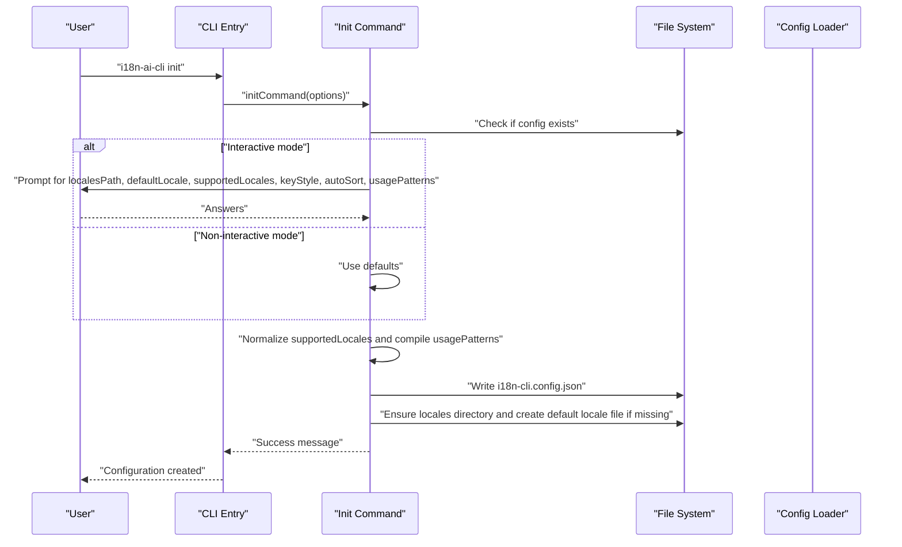
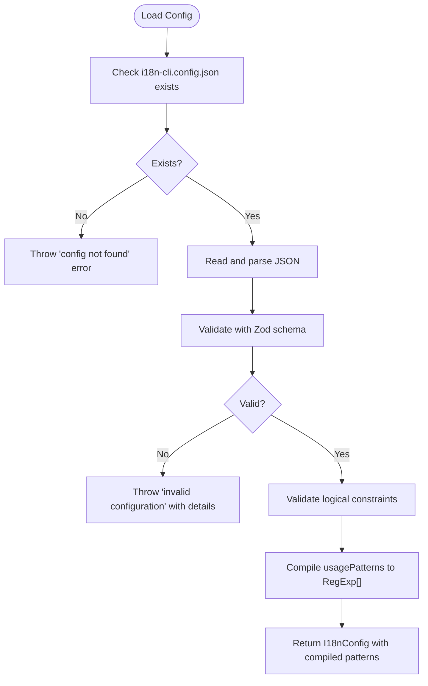
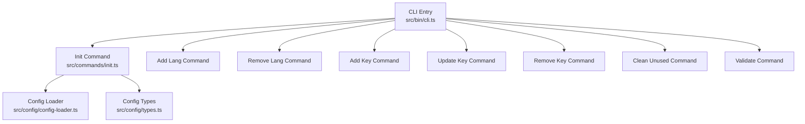

# Installation and Setup

<cite>
**Referenced Files in This Document**
- [package.json](file://package.json)
- [README.md](file://README.md)
- [src/bin/cli.ts](file://src/bin/cli.ts)
- [src/commands/init.ts](file://src/commands/init.ts)
- [src/config/config-loader.ts](file://src/config/config-loader.ts)
- [src/config/types.ts](file://src/config/types.ts)
- [tsconfig.json](file://tsconfig.json)
- [tsup.config.ts](file://tsup.config.ts)
- [CONTRIBUTING.md](file://CONTRIBUTING.md)
</cite>

## Table of Contents
1. [Introduction](#introduction)
2. [Prerequisites](#prerequisites)
3. [Installation Methods](#installation-methods)
4. [Local Development Setup](#local-development-setup)
5. [Initialize Configuration](#initialize-configuration)
6. [Configuration File Structure](#configuration-file-structure)
7. [Basic Workflow Examples](#basic-workflow-examples)
8. [Package Manager Guidance](#package-manager-guidance)
9. [Common Installation Issues and Troubleshooting](#common-installation-issues-and-troubleshooting)
10. [Architecture Overview](#architecture-overview)
11. [Conclusion](#conclusion)

## Introduction
This document provides comprehensive installation and setup guidance for i18n-ai-cli. It covers global installation via npm, local development setup, prerequisites, initialization using the init command, configuration file creation and interactive setup, examples of adding languages and translation keys, basic workflow setup, configuration file structure, common installation issues, troubleshooting, and package manager usage.

## Prerequisites
- Node.js version 18 or higher is required. The project declares this requirement in its engines field.
- A modern package manager (npm, yarn, or pnpm) is recommended for installation and development.

**Section sources**
- [package.json:42-44](file://package.json#L42-L44)
- [CONTRIBUTING.md:44-48](file://CONTRIBUTING.md#L44-L48)

## Installation Methods
There are two primary installation approaches:

- Global installation (not recommended for most workflows)
  - Install globally using npm: npm install -g i18n-ai-cli
  - Use the installed binary directly in any project

- Local development setup (recommended)
  - Install as a development dependency: npm install --save-dev i18n-ai-cli
  - Use the package via npx i18n-ai-cli or add it to your project’s package.json scripts

Local installation is preferred because it keeps the CLI scoped to a specific project, simplifies CI/CD integration, and avoids potential conflicts across different projects.

**Section sources**
- [README.md:17-28](file://README.md#L17-L28)
- [package.json:42-47](file://package.json#L42-L47)

## Local Development Setup
For contributors or teams developing with the CLI locally:

- Fork and clone the repository
- Install dependencies with npm install
- Build the project using npm run build or watch with npm run dev
- Optionally link the package globally for testing with npm link and unlink when finished

These steps enable iterative development, testing, and validation of changes within the project.

**Section sources**
- [CONTRIBUTING.md:32-86](file://CONTRIBUTING.md#L32-L86)
- [README.md:333-360](file://README.md#L333-L360)

## Initialize Configuration
The init command generates the configuration file and initializes the default locale file. It supports interactive prompts and non-interactive modes.

- Run the init command: i18n-ai-cli init
- Interactive prompts collect:
  - Locales directory path
  - Default locale
  - Supported locales (comma-separated)
  - Key style preference (nested or flat)
  - Auto-sort keys toggle
  - Usage patterns selection (default patterns or custom regex)
- Non-interactive mode:
  - Uses defaults when stdout is not a TTY or when --yes or --ci flags are provided
  - Throws an error in CI mode unless --yes is also provided

After successful initialization, the CLI writes the configuration file and ensures the default locale file exists in the configured locales directory.

**Diagram sources**
- [src/bin/cli.ts:37-42](file://src/bin/cli.ts#L37-L42)
- [src/commands/init.ts:25-182](file://src/commands/init.ts#L25-L182)
- [src/config/config-loader.ts:24-67](file://src/config/config-loader.ts#L24-L67)

**Section sources**
- [src/bin/cli.ts:37-42](file://src/bin/cli.ts#L37-L42)
- [src/commands/init.ts:25-182](file://src/commands/init.ts#L25-L182)
- [src/config/config-loader.ts:24-67](file://src/config/config-loader.ts#L24-L67)

## Configuration File Structure
The configuration file is a JSON file named i18n-cli.config.json. It defines how the CLI discovers and manages translation files.

Essential settings:
- localesPath: Directory containing translation files
- defaultLocale: Default/source language code
- supportedLocales: List of supported language codes (must include defaultLocale)
- keyStyle: "flat" or "nested" key structure style
- usagePatterns: Regex patterns to detect key usage in source code
- autoSort: Boolean to auto-sort keys alphabetically

Validation and compilation:
- The loader validates required fields and logical constraints (e.g., defaultLocale must be in supportedLocales)
- usagePatterns are compiled into RegExp arrays for runtime usage
- Invalid regex patterns or missing capturing groups cause errors

**Diagram sources**
- [src/config/config-loader.ts:24-67](file://src/config/config-loader.ts#L24-L67)
- [src/config/types.ts:3-11](file://src/config/types.ts#L3-L11)

**Section sources**
- [src/config/config-loader.ts:8-15](file://src/config/config-loader.ts#L8-L15)
- [src/config/config-loader.ts:69-82](file://src/config/config-loader.ts#L69-L82)
- [src/config/config-loader.ts:84-109](file://src/config/config-loader.ts#L84-L109)
- [src/config/types.ts:3-11](file://src/config/types.ts#L3-L11)

## Basic Workflow Examples
After installation and configuration, typical workflows include:

- Initialize configuration: i18n-ai-cli init
- Add a language: i18n-ai-cli add:lang es --from en
- Add a translation key: i18n-ai-cli add:key welcome.message --value "Welcome to our app"
- Update and sync translations: i18n-ai-cli update:key welcome.message --value "Welcome!" --sync
- Clean unused keys: i18n-ai-cli clean:unused
- Validate files: i18n-ai-cli validate

Provider selection:
- If OPENAI_API_KEY is set, OpenAI is used automatically; otherwise Google Translate is used
- Explicit provider can be selected with --provider

CI/CD integration:
- Use --ci for non-interactive mode and --dry-run to preview changes without applying them

**Section sources**
- [README.md:32-52](file://README.md#L32-L52)
- [README.md:258-266](file://README.md#L258-L266)
- [README.md:283-294](file://README.md#L283-L294)

## Package Manager Guidance
- Use npm for installation and development tasks as documented in the project scripts
- The project supports linking for local testing (npm link/unlink)
- CI/CD environments should use --ci and --dry-run flags to ensure deterministic behavior

Build and development:
- Build: npm run build
- Watch mode: npm run dev
- Type checking: npm run typecheck
- Tests: npm test

**Section sources**
- [package.json:9-14](file://package.json#L9-L14)
- [CONTRIBUTING.md:66-86](file://CONTRIBUTING.md#L66-L86)
- [CONTRIBUTING.md:165-197](file://CONTRIBUTING.md#L165-L197)

## Common Installation Issues and Troubleshooting
- Node.js version too low
  - Symptom: Installation or runtime errors indicating unsupported engine
  - Resolution: Upgrade to Node.js 18 or higher

- Missing configuration file
  - Symptom: Error indicating i18n-cli.config.json not found
  - Resolution: Run i18n-ai-cli init to create the configuration file

- Invalid configuration
  - Symptom: Error listing validation issues (e.g., defaultLocale not in supportedLocales, duplicate locales, invalid regex)
  - Resolution: Fix the configuration file according to the error messages

- CI mode without --yes
  - Symptom: Error stating configuration would be overwritten or created in CI mode
  - Resolution: Add --yes to proceed or run interactively

- Permission issues with locales directory
  - Symptom: Failures when writing locale files
  - Resolution: Ensure the localesPath directory exists and has appropriate read/write permissions

- Translation provider setup
  - Symptom: Missing or failing translations
  - Resolution: Set OPENAI_API_KEY environment variable or use Google Translate provider

**Section sources**
- [package.json:42-44](file://package.json#L42-L44)
- [src/config/config-loader.ts:27-32](file://src/config/config-loader.ts#L27-L32)
- [src/config/config-loader.ts:46-54](file://src/config/config-loader.ts#L46-L54)
- [src/commands/init.ts:151-156](file://src/commands/init.ts#L151-L156)
- [README.md:283-294](file://README.md#L283-L294)

## Architecture Overview
The CLI entry point wires commands to their handlers and sets up global options. The init command orchestrates configuration creation and locale initialization. The configuration loader validates and compiles the configuration for downstream use.

**Diagram sources**
- [src/bin/cli.ts:18-23](file://src/bin/cli.ts#L18-L23)
- [src/bin/cli.ts:34-198](file://src/bin/cli.ts#L34-L198)
- [src/commands/init.ts:25-182](file://src/commands/init.ts#L25-L182)
- [src/config/config-loader.ts:24-67](file://src/config/config-loader.ts#L24-L67)
- [src/config/types.ts:3-11](file://src/config/types.ts#L3-L11)

## Conclusion
You now have the essentials to install and set up i18n-ai-cli. Prefer local installation for development, initialize the configuration with the init command, and use the provided examples to manage languages and keys. Validate configurations and leverage CI-friendly flags for automation. If issues arise, consult the troubleshooting section and ensure your Node.js version meets the requirements.