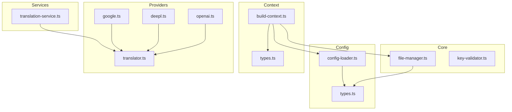
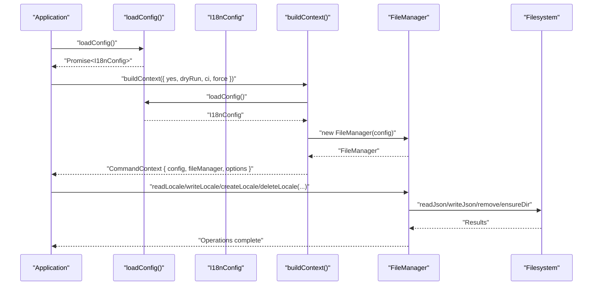
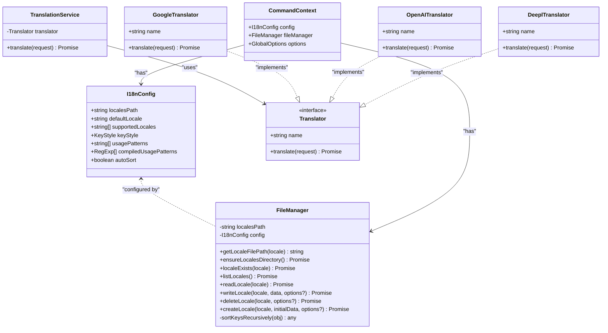
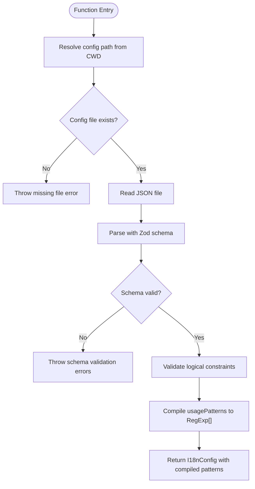
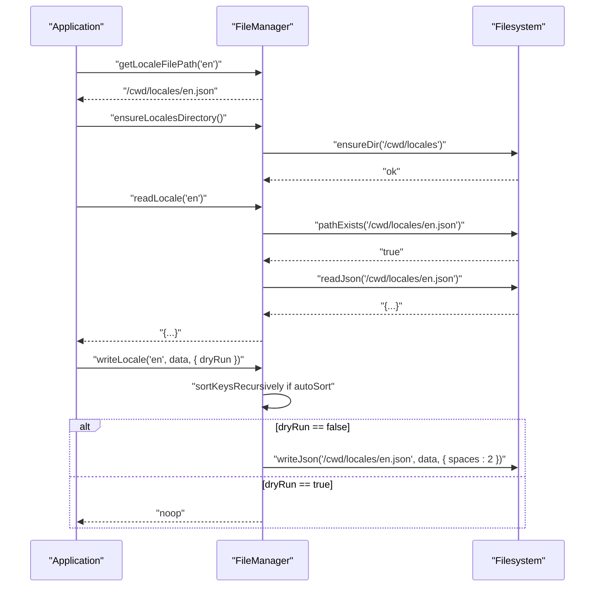
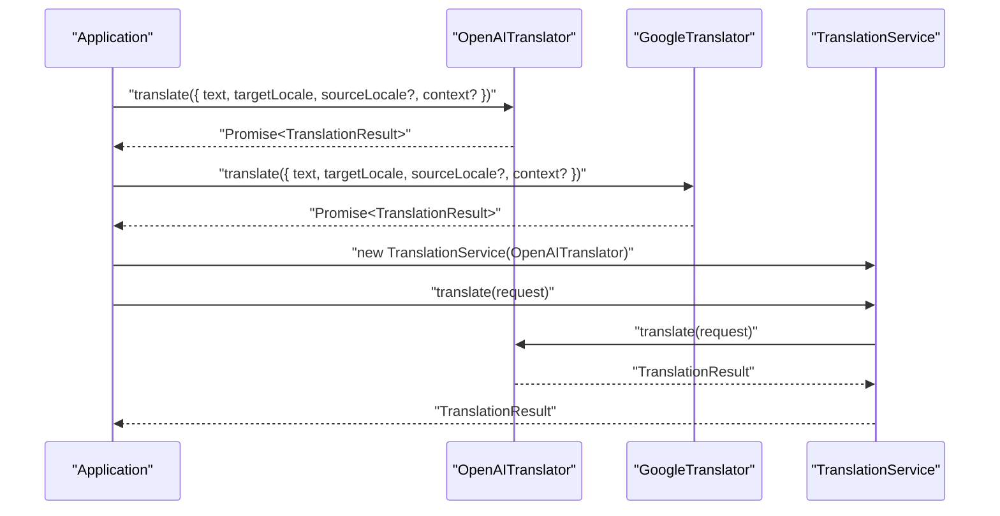
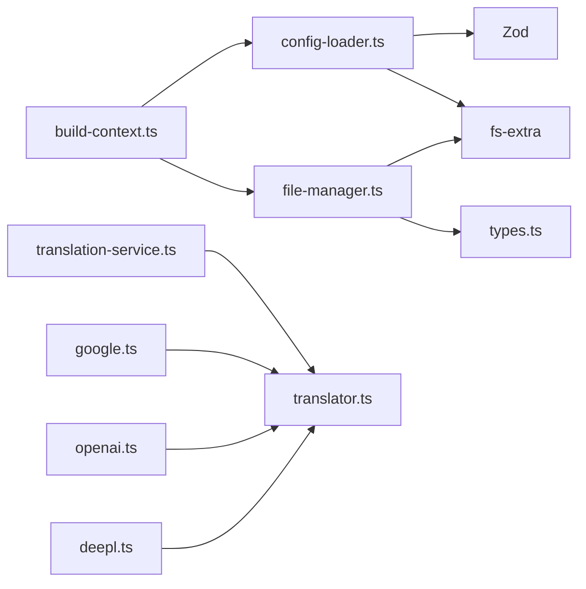

# Programmatic API

<cite>
**Referenced Files in This Document**
- [README.md](file://README.md)
- [package.json](file://package.json)
- [src/config/config-loader.ts](file://src/config/config-loader.ts)
- [src/config/types.ts](file://src/config/types.ts)
- [src/core/file-manager.ts](file://src/core/file-manager.ts)
- [src/context/build-context.ts](file://src/context/build-context.ts)
- [src/context/types.ts](file://src/context/types.ts)
- [src/core/key-validator.ts](file://src/core/key-validator.ts)
- [src/services/translation-service.ts](file://src/services/translation-service.ts)
- [src/providers/translator.ts](file://src/providers/translator.ts)
- [src/providers/google.ts](file://src/providers/google.ts)
- [src/providers/deepl.ts](file://src/providers/deepl.ts)
- [src/providers/openai.ts](file://src/providers/openai.ts)
- [src/config/config-loader.test.ts](file://src/config/config-loader.test.ts)
- [src/core/file-manager.test.ts](file://src/core/file-manager.test.ts)
</cite>

## Update Summary
**Changes Made**
- Updated version information to reflect 1.0.9 release
- Confirmed all programmatic interfaces, methods, and integration patterns remain unchanged from version 1.0.8
- Verified API stability and backward compatibility

## Table of Contents
1. [Introduction](#introduction)
2. [Project Structure](#project-structure)
3. [Core Components](#core-components)
4. [Architecture Overview](#architecture-overview)
5. [Detailed Component Analysis](#detailed-component-analysis)
6. [Dependency Analysis](#dependency-analysis)
7. [Performance Considerations](#performance-considerations)
8. [Troubleshooting Guide](#troubleshooting-guide)
9. [Conclusion](#conclusion)
10. [Appendices](#appendices)

## Introduction
This document describes the programmatic Node.js API of i18n-ai-cli, focusing on the modules and classes available for integration into applications. It covers:
- The loadConfig() function: parameters, return types, and error handling
- The FileManager class: reading and writing locale files, path resolution, and file operations
- Configuration types and interfaces used across the API
- Practical integration scenarios: automated translation file management, custom validation workflows, and CI/CD pipeline integration
- Type safety and TypeScript definitions
- Error propagation, async/await patterns, and resource management
- Guidance for extending the API and integrating with existing applications
- Performance considerations and best practices for large-scale usage

**Version Note**: This documentation reflects version 1.0.9, where all programmatic interfaces, methods, and integration patterns remain unchanged from version 1.0.8.

## Project Structure
The programmatic API centers around configuration loading, file management, and optional translation services. The CLI composes these building blocks via a context builder that wires configuration and file manager together.

**Diagram sources**
- [src/config/config-loader.ts:1-176](file://src/config/config-loader.ts#L1-L176)
- [src/config/types.ts:1-12](file://src/config/types.ts#L1-L12)
- [src/core/file-manager.ts:1-118](file://src/core/file-manager.ts#L1-L118)
- [src/context/build-context.ts:1-16](file://src/context/build-context.ts#L1-L16)
- [src/context/types.ts:1-15](file://src/context/types.ts#L1-L15)
- [src/core/key-validator.ts:1-33](file://src/core/key-validator.ts#L1-L33)
- [src/services/translation-service.ts:1-18](file://src/services/translation-service.ts#L1-L18)
- [src/providers/translator.ts:1-60](file://src/providers/translator.ts#L1-L60)
- [src/providers/google.ts:1-50](file://src/providers/google.ts#L1-L50)
- [src/providers/deepl.ts:1-26](file://src/providers/deepl.ts#L1-L26)
- [src/providers/openai.ts:1-60](file://src/providers/openai.ts#L1-L60)

**Section sources**
- [README.md:850-891](file://README.md#L850-L891)
- [package.json:1-68](file://package.json#L1-L68)

## Core Components
This section documents the primary programmatic entry points and their capabilities.

- loadConfig(): Loads and validates the i18n-ai-cli configuration from the project root.
- FileManager: Provides CRUD operations for locale files with path resolution and optional dry-run behavior.
- I18nConfig and related types: Define the shape of configuration and runtime options.
- TranslationService and providers: Optional translation abstraction for integrations requiring automated translations.

**Section sources**
- [src/config/config-loader.ts:24-67](file://src/config/config-loader.ts#L24-L67)
- [src/config/types.ts:1-12](file://src/config/types.ts#L1-L12)
- [src/core/file-manager.ts:1-118](file://src/core/file-manager.ts#L1-L118)
- [src/context/build-context.ts:5-16](file://src/context/build-context.ts#L5-L16)
- [src/context/types.ts:1-15](file://src/context/types.ts#L1-L15)
- [src/services/translation-service.ts:1-18](file://src/services/translation-service.ts#L1-L18)
- [src/providers/translator.ts:1-60](file://src/providers/translator.ts#L1-L60)

## Architecture Overview
The programmatic API follows a layered design:
- Configuration layer: loads and validates configuration, compiles usage patterns
- Core layer: manages filesystem operations for locale files
- Context layer: builds a command context with config and file manager
- Services layer: optional translation orchestration
- Providers layer: pluggable translation implementations

**Diagram sources**
- [src/config/config-loader.ts:24-67](file://src/config/config-loader.ts#L24-L67)
- [src/context/build-context.ts:5-16](file://src/context/build-context.ts#L5-L16)
- [src/core/file-manager.ts:31-98](file://src/core/file-manager.ts#L31-L98)

## Detailed Component Analysis

### loadConfig()
Purpose
- Reads the configuration file from the project root, parses and validates it, applies defaults, compiles usage patterns, and returns a typed configuration object.

Parameters
- None. Resolves the configuration file path from the current working directory.

Return type
- Promise<I18nConfig>

Behavior summary
- Throws if the configuration file is missing
- Throws if the configuration file is not valid JSON
- Throws if the configuration fails schema validation
- Throws if logical constraints are violated (e.g., defaultLocale not in supportedLocales, duplicates in supportedLocales)
- Throws if usagePatterns contain invalid regex or lack capturing groups
- Returns the configuration with compiled usage patterns

Error handling
- Comprehensive error messages enumerate issues encountered during parsing and validation.

Async/await pattern
- Uses async filesystem operations and Zod safe parsing.

Type safety
- Uses Zod schema inference to derive the parsed configuration type and returns a strongly-typed I18nConfig.

**Section sources**
- [src/config/config-loader.ts:24-67](file://src/config/config-loader.ts#L24-L67)
- [src/config/config-loader.ts:69-82](file://src/config/config-loader.ts#L69-L82)
- [src/config/config-loader.ts:84-109](file://src/config/config-loader.ts#L84-L109)
- [src/config/config-loader.ts:111-161](file://src/config/config-loader.ts#L111-L161)
- [src/config/config-loader.ts:163-175](file://src/config/config-loader.ts#L163-L175)
- [src/config/types.ts:3-11](file://src/config/types.ts#L3-L11)
- [src/config/config-loader.test.ts:28-172](file://src/config/config-loader.test.ts#L28-L172)

### FileManager
Purpose
- Encapsulates filesystem operations for locale files under a configured localesPath.

Constructor
- Accepts I18nConfig and resolves localesPath relative to the current working directory.

Methods
- getLocaleFilePath(locale): Computes the absolute path for a locale file
- ensureLocalesDirectory(): Ensures the locales directory exists
- localeExists(locale): Checks if a locale file exists
- listLocales(): Returns supported locales from configuration
- readLocale(locale): Reads and parses a locale file; throws if missing or invalid JSON
- writeLocale(locale, data, options?): Writes a locale file; optionally sorts keys if autoSort is enabled; supports dryRun
- deleteLocale(locale, options?): Deletes a locale file; throws if missing; supports dryRun
- createLocale(locale, initialData, options?): Creates a new locale file; ensures directory; throws if already exists; supports dryRun

Path resolution
- Resolves localesPath relative to process.cwd() and joins with "<locale>.json".

File operations
- Uses fs-extra for pathExists, readJson, writeJson, remove, ensureDir.

Dry run behavior
- When options.dryRun is true, operations log or preview changes without writing to disk.

Auto-sort behavior
- When autoSort is true, keys are sorted recursively before writing.

Error handling
- Throws descriptive errors for missing files, invalid JSON, and pre-existing locales.

Async/await pattern
- All operations are asynchronous.

Type safety
- Uses I18nConfig for configuration and generic Records for locale data.

**Section sources**
- [src/core/file-manager.ts:5-12](file://src/core/file-manager.ts#L5-L12)
- [src/core/file-manager.ts:14-16](file://src/core/file-manager.ts#L14-L16)
- [src/core/file-manager.ts:18-20](file://src/core/file-manager.ts#L18-L20)
- [src/core/file-manager.ts:22-29](file://src/core/file-manager.ts#L22-L29)
- [src/core/file-manager.ts:31-43](file://src/core/file-manager.ts#L31-L43)
- [src/core/file-manager.ts:45-61](file://src/core/file-manager.ts#L45-L61)
- [src/core/file-manager.ts:63-78](file://src/core/file-manager.ts#L63-L78)
- [src/core/file-manager.ts:80-98](file://src/core/file-manager.ts#L80-L98)
- [src/core/file-manager.ts:100-115](file://src/core/file-manager.ts#L100-L115)
- [src/core/file-manager.test.ts:18-245](file://src/core/file-manager.test.ts#L18-L245)

### Configuration Types and Interfaces
- KeyStyle: Literal union of "flat" and "nested"
- I18nConfig: Shape of the loaded configuration including localesPath, defaultLocale, supportedLocales, keyStyle, usagePatterns, compiledUsagePatterns, and autoSort

These types are used across loadConfig(), FileManager, and context builders.

**Section sources**
- [src/config/types.ts:1-12](file://src/config/types.ts#L1-L12)

### Context Builder
- buildContext(options): Loads configuration and constructs a CommandContext with config, fileManager, and global options.

GlobalOptions
- yes?: Skip confirmations
- dryRun?: Preview changes without writing
- ci?: CI-friendly non-interactive mode
- force?: Force operations in specific commands

CommandContext
- config: I18nConfig
- fileManager: FileManager
- options: GlobalOptions

**Section sources**
- [src/context/build-context.ts:5-16](file://src/context/build-context.ts#L5-L16)
- [src/context/types.ts:4-15](file://src/context/types.ts#L4-L15)

### Translation Service and Providers
- TranslationService: Thin wrapper around a Translator implementation
- Translator interface: Defines translate(request) -> Promise<TranslationResult>
- TranslationRequest: text, targetLocale, optional sourceLocale, optional context
- TranslationResult: translated text, optional detected source locale, provider identifier
- GoogleTranslator: Implements Translator using @vitalets/google-translate-api
- OpenAITranslator: Implements Translator using OpenAI GPT models
- DeeplTranslator: Stub implementation indicating missing adapter

Integration pattern
- Construct a translator (e.g., GoogleTranslator or OpenAITranslator), wrap with TranslationService, and call translate(request)

**Section sources**
- [src/services/translation-service.ts:7-17](file://src/services/translation-service.ts#L7-L17)
- [src/providers/translator.ts:1-60](file://src/providers/translator.ts#L1-L60)
- [src/providers/google.ts:15-50](file://src/providers/google.ts#L15-L50)
- [src/providers/deepl.ts:12-25](file://src/providers/deepl.ts#L12-L25)
- [src/providers/openai.ts:13-60](file://src/providers/openai.ts#L13-L60)

### Key Structural Validator
- validateNoStructuralConflict(flatObject, newKey): Detects structural conflicts when adding keys to ensure compatibility with keyStyle (flat vs nested).

Use cases
- Pre-validate proposed keys before writing to maintain consistent structure across locales.

**Section sources**
- [src/core/key-validator.ts:1-33](file://src/core/key-validator.ts#L1-L33)

## Architecture Overview

**Diagram sources**
- [src/config/types.ts:1-12](file://src/config/types.ts#L1-L12)
- [src/core/file-manager.ts:5-118](file://src/core/file-manager.ts#L5-L118)
- [src/context/types.ts:11-15](file://src/context/types.ts#L11-L15)
- [src/services/translation-service.ts:7-17](file://src/services/translation-service.ts#L7-L17)
- [src/providers/translator.ts:14-17](file://src/providers/translator.ts#L14-L17)
- [src/providers/google.ts:15-50](file://src/providers/google.ts#L15-L50)
- [src/providers/openai.ts:13-60](file://src/providers/openai.ts#L13-L60)
- [src/providers/deepl.ts:12-25](file://src/providers/deepl.ts#L12-L25)

## Detailed Component Analysis

### loadConfig() Flow

**Diagram sources**
- [src/config/config-loader.ts:24-67](file://src/config/config-loader.ts#L24-L67)
- [src/config/config-loader.ts:69-82](file://src/config/config-loader.ts#L69-L82)
- [src/config/config-loader.ts:84-109](file://src/config/config-loader.ts#L84-L109)

**Section sources**
- [src/config/config-loader.ts:24-67](file://src/config/config-loader.ts#L24-L67)
- [src/config/config-loader.test.ts:28-172](file://src/config/config-loader.test.ts#L28-L172)

### FileManager Operations

**Diagram sources**
- [src/core/file-manager.ts:14-16](file://src/core/file-manager.ts#L14-L16)
- [src/core/file-manager.ts:18-20](file://src/core/file-manager.ts#L18-L20)
- [src/core/file-manager.ts:31-43](file://src/core/file-manager.ts#L31-L43)
- [src/core/file-manager.ts:45-61](file://src/core/file-manager.ts#L45-L61)

**Section sources**
- [src/core/file-manager.ts:31-98](file://src/core/file-manager.ts#L31-L98)
- [src/core/file-manager.test.ts:94-245](file://src/core/file-manager.test.ts#L94-L245)

### Translation Workflow

**Diagram sources**
- [src/providers/openai.ts:30-58](file://src/providers/openai.ts#L30-L58)
- [src/providers/google.ts:17-48](file://src/providers/google.ts#L17-L48)
- [src/services/translation-service.ts:14-16](file://src/services/translation-service.ts#L14-L16)

**Section sources**
- [src/providers/translator.ts:1-60](file://src/providers/translator.ts#L1-L60)
- [src/providers/google.ts:15-50](file://src/providers/google.ts#L15-L50)
- [src/providers/openai.ts:13-60](file://src/providers/openai.ts#L13-L60)
- [src/services/translation-service.ts:7-17](file://src/services/translation-service.ts#L7-L17)

## Dependency Analysis
- loadConfig() depends on fs-extra for file operations and Zod for schema validation
- FileManager depends on I18nConfig and fs-extra for filesystem operations
- buildContext() composes loadConfig() and FileManager into a CommandContext
- TranslationService depends on the Translator interface; GoogleTranslator and OpenAITranslator implement it
- Tests validate error conditions and behavior for both loadConfig() and FileManager

**Diagram sources**
- [src/config/config-loader.ts:1-3](file://src/config/config-loader.ts#L1-L3)
- [src/core/file-manager.ts:1-3](file://src/core/file-manager.ts#L1-L3)
- [src/context/build-context.ts:1-3](file://src/context/build-context.ts#L1-L3)
- [src/services/translation-service.ts:1-5](file://src/services/translation-service.ts#L1-L5)
- [src/providers/google.ts:1-6](file://src/providers/google.ts#L1-L6)
- [src/providers/openai.ts:1-6](file://src/providers/openai.ts#L1-L6)
- [src/providers/deepl.ts:1-6](file://src/providers/deepl.ts#L1-L6)

**Section sources**
- [src/config/config-loader.ts:1-3](file://src/config/config-loader.ts#L1-L3)
- [src/core/file-manager.ts:1-3](file://src/core/file-manager.ts#L1-L3)
- [src/context/build-context.ts:1-3](file://src/context/build-context.ts#L1-L3)
- [src/services/translation-service.ts:1-5](file://src/services/translation-service.ts#L1-L5)
- [src/providers/google.ts:1-6](file://src/providers/google.ts#L1-L6)
- [src/providers/openai.ts:1-6](file://src/providers/openai.ts#L1-L6)
- [src/providers/deepl.ts:1-6](file://src/providers/deepl.ts#L1-L6)

## Performance Considerations
- Batch operations: Group reads/writes to minimize filesystem overhead
- Auto-sort cost: Enabling autoSort introduces recursive sorting; disable for very large files if performance is critical
- Dry-run mode: Use dryRun to avoid unnecessary writes during previews
- Regex compilation: usagePatterns are compiled once per loadConfig(); reuse the returned I18nConfig to avoid recompilation
- Provider latency: Translation requests are network-bound; consider caching results and batching requests
- Large-scale usage: Prefer streaming or chunked processing for bulk locale operations; monitor disk I/O and memory usage

## Troubleshooting Guide
Common issues and resolutions
- Missing configuration file: Ensure i18n-cli.config.json exists in the project root and contains valid JSON
- Schema validation failures: Review required fields and types; usagePatterns must include capturing groups
- Logical constraint violations: defaultLocale must be present in supportedLocales; supportedLocales must not contain duplicates
- Locale file errors: Verify locale files exist and contain valid JSON; FileManager throws descriptive errors
- Dry-run behavior: Confirm options.dryRun is set appropriately to preview changes
- Translation provider errors: Implement or configure a supported provider; stub implementations indicate missing adapters

**Section sources**
- [src/config/config-loader.ts:27-54](file://src/config/config-loader.ts#L27-L54)
- [src/config/config-loader.ts:69-82](file://src/config/config-loader.ts#L69-L82)
- [src/core/file-manager.ts:34-42](file://src/core/file-manager.ts#L34-L42)
- [src/core/file-manager.ts:69-71](file://src/core/file-manager.ts#L69-L71)
- [src/core/file-manager.ts:89-91](file://src/core/file-manager.ts#L89-L91)
- [src/providers/deepl.ts:21-24](file://src/providers/deepl.ts#L21-L24)
- [src/providers/openai.ts:17-21](file://src/providers/openai.ts#L17-L21)

## Conclusion
The i18n-ai-cli programmatic API offers a robust, type-safe foundation for managing translation files and integrating with CI/CD pipelines. By leveraging loadConfig(), FileManager, and optional translation services, developers can automate workflows, enforce structural consistency, and scale operations efficiently. Adhering to the documented patterns and best practices ensures reliable, maintainable integrations.

## Appendices

### Practical Integration Scenarios

- Automated translation file management
  - Load configuration, ensure locales directory, and read/write locales as needed
  - Use autoSort to keep files organized
  - Example references:
    - [README.md:850-891](file://README.md#L850-L891)
    - [src/core/file-manager.ts:18-20](file://src/core/file-manager.ts#L18-L20)
    - [src/core/file-manager.ts:45-61](file://src/core/file-manager.ts#L45-L61)

- Custom validation workflows
  - Validate proposed keys against existing flat/nested structures before writing
  - Example references:
    - [src/core/key-validator.ts:1-33](file://src/core/key-validator.ts#L1-L33)

- CI/CD pipeline integration
  - Use dry-run to preview changes; fail-fast when changes would occur without explicit approval
  - Example references:
    - [README.md:424-493](file://README.md#L424-L493)
    - [src/context/types.ts:4-9](file://src/context/types.ts#L4-L9)

### Extending the API
- Add a custom provider
  - Implement the Translator interface and integrate with TranslationService
  - Example references:
    - [src/providers/translator.ts:14-17](file://src/providers/translator.ts#L14-L17)
    - [src/services/translation-service.ts:7-17](file://src/services/translation-service.ts#L7-L17)

- Integrate with existing applications
  - Compose buildContext() to obtain config and file manager
  - Example references:
    - [src/context/build-context.ts:5-16](file://src/context/build-context.ts#L5-L16)
    - [src/context/types.ts:11-15](file://src/context/types.ts#L11-L15)

### Type Safety and TypeScript Definitions
- Strongly typed configuration and interfaces
- Schema-driven validation with Zod
- Example references:
  - [src/config/types.ts:1-12](file://src/config/types.ts#L1-L12)
  - [src/config/config-loader.ts:8-17](file://src/config/config-loader.ts#L8-L17)

### Version Information
**Current Version**: 1.0.9
**Status**: All programmatic interfaces, methods, and integration patterns remain unchanged from version 1.0.8
**Compatibility**: Fully backward compatible with previous versions