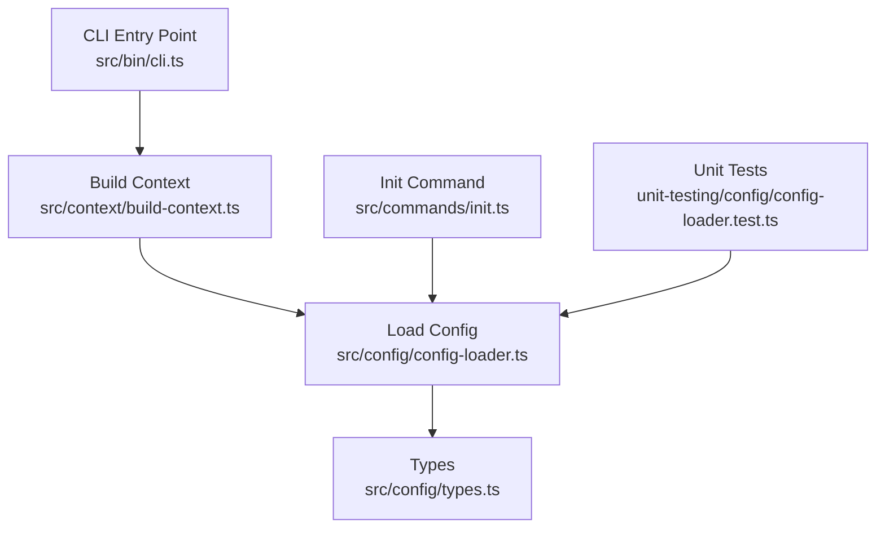
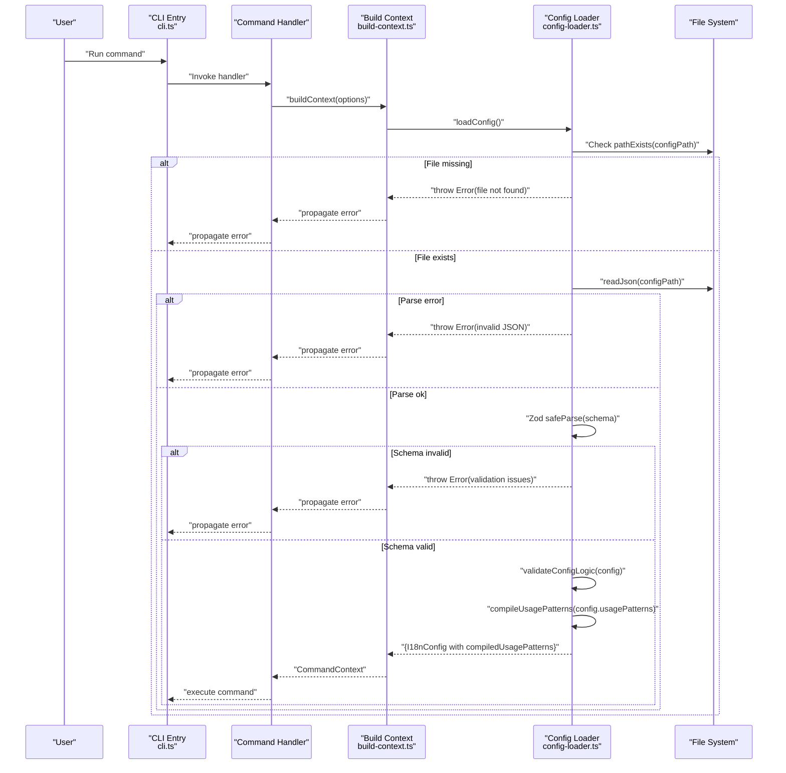
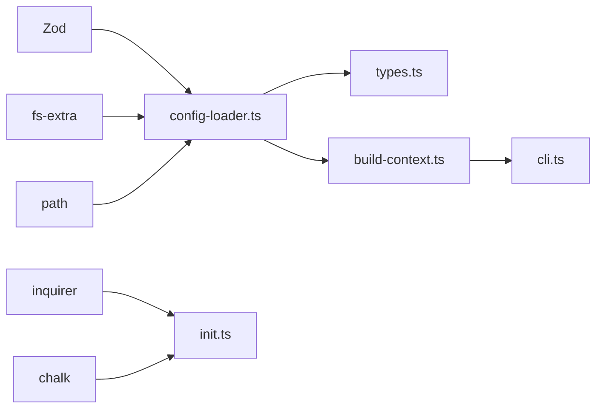

# Configuration Loading

<cite>
**Referenced Files in This Document**
- [config-loader.ts](file://src/config/config-loader.ts)
- [types.ts](file://src/config/types.ts)
- [init.ts](file://src/commands/init.ts)
- [build-context.ts](file://src/context/build-context.ts)
- [cli.ts](file://src/bin/cli.ts)
- [config-loader.test.ts](file://unit-testing/config/config-loader.test.ts)
- [README.md](file://README.md)
- [package.json](file://package.json)
</cite>

## Table of Contents
1. [Introduction](#introduction)
2. [Project Structure](#project-structure)
3. [Core Components](#core-components)
4. [Architecture Overview](#architecture-overview)
5. [Detailed Component Analysis](#detailed-component-analysis)
6. [Dependency Analysis](#dependency-analysis)
7. [Performance Considerations](#performance-considerations)
8. [Troubleshooting Guide](#troubleshooting-guide)
9. [Conclusion](#conclusion)
10. [Appendices](#appendices)

## Introduction
This document provides comprehensive API documentation for the configuration loading system. It focuses on the loadConfig() function, the configuration file structure, schema validation, and error handling patterns. It also documents the TypeScript interfaces for I18nConfig, the configuration file format, supported properties, validation rules, and practical examples for integrating configuration loading in build scripts and automated workflows.

## Project Structure
The configuration loading system resides under src/config and is consumed by the CLI’s command context builder. The primary files involved are:
- Configuration loader and schema validation
- TypeScript interfaces for configuration types
- Initialization command that writes a default configuration
- Context builder that loads configuration for commands
- Tests validating behavior and error conditions

**Diagram sources**
- [cli.ts:1-209](file://src/bin/cli.ts#L1-L209)
- [build-context.ts:1-16](file://src/context/build-context.ts#L1-L16)
- [config-loader.ts:1-176](file://src/config/config-loader.ts#L1-L176)
- [types.ts:1-12](file://src/config/types.ts#L1-L12)
- [init.ts:1-239](file://src/commands/init.ts#L1-L239)
- [config-loader.test.ts:1-261](file://unit-testing/config/config-loader.test.ts#L1-L261)

**Section sources**
- [config-loader.ts:1-176](file://src/config/config-loader.ts#L1-L176)
- [types.ts:1-12](file://src/config/types.ts#L1-L12)
- [init.ts:1-239](file://src/commands/init.ts#L1-L239)
- [build-context.ts:1-16](file://src/context/build-context.ts#L1-L16)
- [cli.ts:1-209](file://src/bin/cli.ts#L1-L209)
- [config-loader.test.ts:1-261](file://unit-testing/config/config-loader.test.ts#L1-L261)

## Core Components
- loadConfig(): Asynchronous function that resolves the configuration file path, reads and parses JSON, validates schema and logical constraints, compiles usage patterns into RegExp, and returns a typed configuration object with compiled patterns attached.
- I18nConfig: TypeScript interface representing the loaded configuration with runtime defaults applied and compiled usage patterns.
- compileUsagePatterns(): Utility that converts regex strings into RegExp objects, validates capturing groups, and throws descriptive errors for invalid patterns.
- CONFIG_FILE_NAME: Constant identifying the configuration filename.

Key behaviors:
- File existence and JSON parsing errors are surfaced with actionable messages.
- Schema validation uses Zod with explicit field constraints.
- Logical validation ensures defaultLocale is included in supportedLocales and that supportedLocales contains no duplicates.
- Usage patterns are compiled into RegExp arrays; each pattern must include at least one capturing group.

**Section sources**
- [config-loader.ts:24-67](file://src/config/config-loader.ts#L24-L67)
- [config-loader.ts:84-109](file://src/config/config-loader.ts#L84-L109)
- [config-loader.ts:69-82](file://src/config/config-loader.ts#L69-L82)
- [types.ts:3-11](file://src/config/types.ts#L3-L11)

## Architecture Overview
The configuration loading pipeline integrates with the CLI and command context builder. The CLI invokes commands that rely on buildContext(), which calls loadConfig() to obtain a validated configuration object. The initialization command writes a default configuration file and validates usage patterns prior to writing.

**Diagram sources**
- [cli.ts:1-209](file://src/bin/cli.ts#L1-L209)
- [build-context.ts:5-16](file://src/context/build-context.ts#L5-L16)
- [config-loader.ts:24-67](file://src/config/config-loader.ts#L24-L67)
- [config-loader.ts:69-82](file://src/config/config-loader.ts#L69-L82)
- [config-loader.ts:84-109](file://src/config/config-loader.ts#L84-L109)

## Detailed Component Analysis

### loadConfig() API
Purpose:
- Load and validate the configuration file located at the project root.
- Apply default values for optional fields.
- Compile usage patterns into RegExp objects.
- Return a strongly typed configuration object.

Behavior:
- Resolves the configuration file path using the current working directory.
- Throws if the file does not exist.
- Throws if JSON parsing fails.
- Validates schema using Zod with min/max length constraints and enums.
- Applies logical validation for defaultLocale and supportedLocales.
- Compiles usagePatterns into RegExp arrays and enforces capturing groups.

Return type:
- Promise resolving to I18nConfig, which includes compiledUsagePatterns.

Errors:
- File not found: instructs to run the initialization command.
- JSON parse failure: indicates invalid JSON.
- Zod validation failures: lists field-specific issues.
- Logical validation failures: defaultLocale must be in supportedLocales; duplicates in supportedLocales.
- Usage pattern compilation failures: invalid regex or missing capturing groups.

Usage examples:
- Programmatic loading: see Programmatic API in README.
- CLI integration: invoked by buildContext() for each command.

**Section sources**
- [config-loader.ts:24-67](file://src/config/config-loader.ts#L24-L67)
- [config-loader.ts:84-109](file://src/config/config-loader.ts#L84-L109)
- [config-loader.ts:69-82](file://src/config/config-loader.ts#L69-L82)
- [README.md:306-329](file://README.md#L306-L329)

### Configuration File Format and Properties
The configuration file is a JSON object with the following properties:

- localesPath: string (required)
  - Directory containing translation files.
- defaultLocale: string (required)
  - Default/source language code; must be included in supportedLocales.
- supportedLocales: string[] (required)
  - List of supported language codes; must not contain duplicates.
- keyStyle: "flat" | "nested" (optional, default: "nested")
  - Determines whether keys are stored flat or nested.
- usagePatterns: string[] (optional, default: [])
  - Regex patterns to detect key usage; each pattern must include a capturing group.
- autoSort: boolean (optional, default: true)
  - Whether to sort keys alphabetically.

Validation rules:
- localesPath must be a non-empty string.
- defaultLocale must be at least two characters long.
- supportedLocales must contain items that are at least two characters long and must not contain duplicates.
- keyStyle must be one of "flat" or "nested".
- usagePatterns must be an array of strings; each string must compile to a valid regex and include at least one capturing group.
- defaultLocale must be present in supportedLocales.

Defaults:
- keyStyle defaults to "nested".
- usagePatterns defaults to [].
- autoSort defaults to true.

**Section sources**
- [config-loader.ts:8-15](file://src/config/config-loader.ts#L8-L15)
- [config-loader.ts:69-82](file://src/config/config-loader.ts#L69-L82)
- [config-loader.ts:84-109](file://src/config/config-loader.ts#L84-L109)
- [README.md:54-84](file://README.md#L54-L84)

### TypeScript Interfaces
I18nConfig:
- localesPath: string
- defaultLocale: string
- supportedLocales: string[]
- keyStyle: "flat" | "nested"
- usagePatterns: string[]
- compiledUsagePatterns: RegExp[]
- autoSort: boolean

KeyStyle:
- "flat" | "nested"

These interfaces define the shape of the loaded configuration and are used across the application for type safety.

**Section sources**
- [types.ts:1-12](file://src/config/types.ts#L1-L12)

### Initialization Command and Default Patterns
The init command generates a default configuration file with sensible defaults and compiles usage patterns to validate them before writing. It supports interactive prompts and CI-friendly modes.

Highlights:
- Generates default usagePatterns for common translation functions.
- Normalizes supportedLocales and ensures defaultLocale is included.
- Validates usagePatterns via compileUsagePatterns() before writing.
- Supports dry-run and CI modes.

**Section sources**
- [init.ts:19-23](file://src/commands/init.ts#L19-L23)
- [init.ts:121-148](file://src/commands/init.ts#L121-L148)
- [init.ts:149](file://src/commands/init.ts#L149)
- [init.ts:151-156](file://src/commands/init.ts#L151-L156)
- [init.ts:170-178](file://src/commands/init.ts#L170-L178)

### Usage Pattern Compilation
compileUsagePatterns():
- Converts an array of regex strings into RegExp objects.
- Validates each pattern compiles successfully.
- Ensures each pattern includes at least one capturing group (standard or named).
- Throws descriptive errors for invalid patterns or missing capturing groups.

Behavior:
- Returns an empty array when input is empty.
- Throws on invalid regex or when no capturing groups are present.

**Section sources**
- [config-loader.ts:84-109](file://src/config/config-loader.ts#L84-L109)
- [config-loader.ts:111-161](file://src/config/config-loader.ts#L111-L161)

### Logical Validation
validateConfigLogic():
- Ensures defaultLocale is included in supportedLocales.
- Detects and reports duplicates in supportedLocales.

**Section sources**
- [config-loader.ts:69-82](file://src/config/config-loader.ts#L69-L82)

### Programmatic Usage
Programmatic loading is documented in the README. Typical usage involves importing loadConfig(), constructing a FileManager with the configuration, and performing operations on locale files.

**Section sources**
- [README.md:306-329](file://README.md#L306-L329)

## Dependency Analysis
The configuration loading system depends on:
- Zod for schema validation.
- fs-extra for file system operations.
- path for path resolution.
- inquirer and chalk for interactive initialization (not part of loadConfig() itself).

**Diagram sources**
- [config-loader.ts:1-5](file://src/config/config-loader.ts#L1-L5)
- [init.ts:1-9](file://src/commands/init.ts#L1-L9)
- [build-context.ts:1-3](file://src/context/build-context.ts#L1-L3)
- [cli.ts:1-17](file://src/bin/cli.ts#L1-L17)

**Section sources**
- [config-loader.ts:1-5](file://src/config/config-loader.ts#L1-L5)
- [init.ts:1-9](file://src/commands/init.ts#L1-L9)
- [build-context.ts:1-3](file://src/context/build-context.ts#L1-L3)
- [cli.ts:1-17](file://src/bin/cli.ts#L1-L17)

## Performance Considerations
- File I/O: loadConfig() performs a single JSON read and a single path existence check. These are lightweight operations.
- Schema validation: Zod safeParse is efficient and short-circuits on the first error.
- Usage pattern compilation: compileUsagePatterns() iterates over patterns and constructs RegExp objects. Complexity is O(n) with n equal to the number of patterns.
- Memory: Compiled RegExp objects are retained in memory for the lifetime of the process.

[No sources needed since this section provides general guidance]

## Troubleshooting Guide
Common issues and resolutions:
- Configuration file not found:
  - Symptom: Error indicating the configuration file was not found in the project root.
  - Resolution: Run the initialization command to create the configuration file.
- Invalid JSON:
  - Symptom: Error indicating failed to parse the configuration file; ensure it contains valid JSON.
  - Resolution: Fix syntax errors in the configuration file.
- Schema validation errors:
  - Symptom: Error listing field-specific issues (e.g., min length, enum values).
  - Resolution: Correct the offending fields according to the error messages.
- Logical validation errors:
  - defaultLocale not in supportedLocales: Add defaultLocale to supportedLocales.
  - Duplicate locales in supportedLocales: Remove duplicates.
- Usage pattern compilation errors:
  - Invalid regex: Fix the regex syntax.
  - Missing capturing group: Include a capturing group in the pattern.
- CI mode behavior:
  - In CI mode without --yes, the init command will fail to prevent unintended writes. Use --yes to apply changes.

**Section sources**
- [config-loader.ts:27-54](file://src/config/config-loader.ts#L27-L54)
- [config-loader.ts:69-82](file://src/config/config-loader.ts#L69-L82)
- [config-loader.ts:84-109](file://src/config/config-loader.ts#L84-L109)
- [init.ts:151-156](file://src/commands/init.ts#L151-L156)

## Conclusion
The configuration loading system provides robust schema validation, logical checks, and usage pattern compilation with clear error messaging. It integrates seamlessly with the CLI’s command context builder and supports both interactive and programmatic workflows. By adhering to the documented configuration format and validation rules, developers can reliably manage i18n configuration across projects and CI/CD environments.

[No sources needed since this section summarizes without analyzing specific files]

## Appendices

### API Reference: loadConfig()
- Purpose: Load and validate configuration, apply defaults, compile usage patterns.
- Signature: async function loadConfig(): Promise<I18nConfig>
- Behavior:
  - Resolve config path from current working directory.
  - Throw if file does not exist.
  - Parse JSON; throw if invalid.
  - Validate schema; throw if invalid.
  - Validate logical constraints; throw if violated.
  - Compile usage patterns; throw if invalid.
  - Return I18nConfig with compiledUsagePatterns.
- Errors: Descriptive messages for file, parse, schema, logical, and usage pattern issues.

**Section sources**
- [config-loader.ts:24-67](file://src/config/config-loader.ts#L24-L67)

### API Reference: compileUsagePatterns()
- Purpose: Convert regex strings to RegExp objects and validate capturing groups.
- Signature: function compileUsagePatterns(patterns: string[]): RegExp[]
- Behavior:
  - Return empty array for empty input.
  - Compile each pattern; throw on invalid regex.
  - Enforce at least one capturing group; throw otherwise.
- Errors: Invalid regex and missing capturing group.

**Section sources**
- [config-loader.ts:84-109](file://src/config/config-loader.ts#L84-L109)

### Configuration File Example
- See the example configuration in README under the Configuration section.

**Section sources**
- [README.md:61-74](file://README.md#L61-L74)

### Integration Examples
- Programmatic usage: See Programmatic API in README.
- CLI integration: buildContext() calls loadConfig() for each command.
- CI/CD: Use --ci and --dry-run to validate without changes; use --yes to apply in pipelines.

**Section sources**
- [README.md:306-329](file://README.md#L306-L329)
- [build-context.ts:5-16](file://src/context/build-context.ts#L5-L16)
- [cli.ts:200-209](file://src/bin/cli.ts#L200-L209)