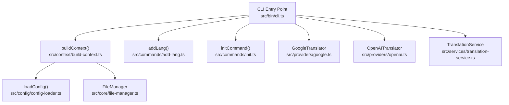
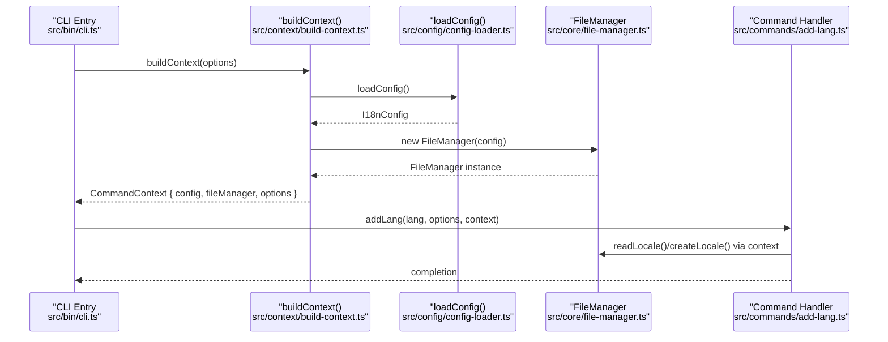
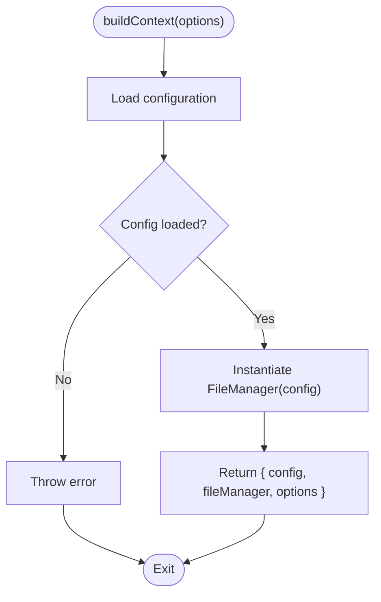
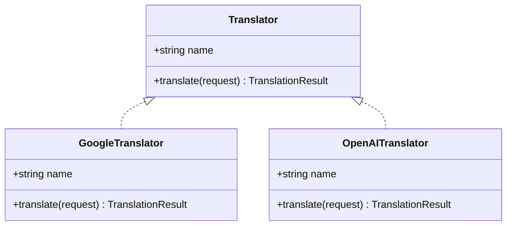
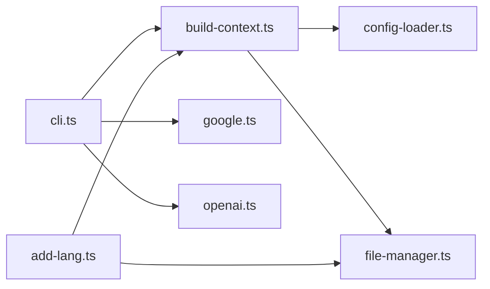

# Context Management

<cite>
**Referenced Files in This Document**
- [build-context.ts](file://src/context/build-context.ts)
- [types.ts](file://src/context/types.ts)
- [cli.ts](file://src/bin/cli.ts)
- [config-loader.ts](file://src/config/config-loader.ts)
- [types.ts](file://src/config/types.ts)
- [file-manager.ts](file://src/core/file-manager.ts)
- [translator.ts](file://src/providers/translator.ts)
- [google.ts](file://src/providers/google.ts)
- [openai.ts](file://src/providers/openai.ts)
- [translation-service.ts](file://src/services/translation-service.ts)
- [add-lang.ts](file://src/commands/add-lang.ts)
- [init.ts](file://src/commands/init.ts)
- [build-context.test.ts](file://unit-testing/context/build-context.test.ts)
- [package.json](file://package.json)
</cite>

## Table of Contents
1. [Introduction](#introduction)
2. [Project Structure](#project-structure)
3. [Core Components](#core-components)
4. [Architecture Overview](#architecture-overview)
5. [Detailed Component Analysis](#detailed-component-analysis)
6. [Dependency Analysis](#dependency-analysis)
7. [Performance Considerations](#performance-considerations)
8. [Troubleshooting Guide](#troubleshooting-guide)
9. [Conclusion](#conclusion)
10. [Appendices](#appendices)

## Introduction
This document provides comprehensive API documentation for the dependency injection and context management system used by the CLI. It focuses on the buildContext() function, service resolution patterns, and the dependency injection container. It also documents TypeScript interfaces for context types, service registration, and configuration binding. The guide includes examples of building contexts programmatically, accessing services, and managing dependencies, along with the factory pattern implementation, service lifecycle, and integration with the broader CLI architecture. Best practices for context initialization and service composition in automated environments are provided.

## Project Structure
The context management system centers around a small set of modules that orchestrate configuration loading, file system operations, and command execution. The CLI entry point wires up commands and delegates to context-aware command handlers.

**Diagram sources**
- [cli.ts:1-209](file://src/bin/cli.ts#L1-L209)
- [build-context.ts:1-16](file://src/context/build-context.ts#L1-L16)
- [config-loader.ts:1-176](file://src/config/config-loader.ts#L1-L176)
- [file-manager.ts:1-118](file://src/core/file-manager.ts#L1-L118)
- [add-lang.ts:1-98](file://src/commands/add-lang.ts#L1-L98)
- [init.ts:1-239](file://src/commands/init.ts#L1-L239)
- [google.ts:1-50](file://src/providers/google.ts#L1-L50)
- [openai.ts:1-60](file://src/providers/openai.ts#L1-L60)
- [translation-service.ts:1-18](file://src/services/translation-service.ts#L1-L18)

**Section sources**
- [cli.ts:1-209](file://src/bin/cli.ts#L1-L209)
- [build-context.ts:1-16](file://src/context/build-context.ts#L1-L16)
- [config-loader.ts:1-176](file://src/config/config-loader.ts#L1-L176)
- [file-manager.ts:1-118](file://src/core/file-manager.ts#L1-L118)
- [add-lang.ts:1-98](file://src/commands/add-lang.ts#L1-L98)
- [init.ts:1-239](file://src/commands/init.ts#L1-L239)
- [google.ts:1-50](file://src/providers/google.ts#L1-L50)
- [openai.ts:1-60](file://src/providers/openai.ts#L1-L60)
- [translation-service.ts:1-18](file://src/services/translation-service.ts#L1-L18)

## Core Components
- buildContext(options): Asynchronous function that constructs a CommandContext containing configuration, a FileManager instance, and global options. It loads configuration and instantiates FileManager with the loaded configuration.
- CommandContext: Interface representing the runtime context passed to commands, including config, fileManager, and options.
- GlobalOptions: Interface defining global CLI flags (yes, dryRun, ci, force) used to control behavior across commands.
- I18nConfig: Interface defining the validated configuration shape, including localesPath, defaultLocale, supportedLocales, keyStyle, usagePatterns, compiledUsagePatterns, and autoSort.
- FileManager: Class encapsulating file system operations for locale files, constructed with I18nConfig.
- Translator Provider Interfaces and Implementations: Interfaces and classes for translation providers (Google and OpenAI), enabling factory-style creation and optional DI-like composition.
- TranslationService: Thin wrapper around a Translator, demonstrating a simple service composition pattern.

**Section sources**
- [build-context.ts:5-16](file://src/context/build-context.ts#L5-L16)
- [types.ts:4-15](file://src/context/types.ts#L4-L15)
- [types.ts:3-11](file://src/config/types.ts#L3-L11)
- [file-manager.ts:5-12](file://src/core/file-manager.ts#L5-L12)
- [translator.ts:14-17](file://src/providers/translator.ts#L14-L17)
- [google.ts:9-15](file://src/providers/google.ts#L9-L15)
- [openai.ts:9-28](file://src/providers/openai.ts#L9-L28)
- [translation-service.ts:7-16](file://src/services/translation-service.ts#L7-L16)

## Architecture Overview
The CLI follows a minimal dependency injection pattern:
- buildContext() acts as the primary factory for CommandContext.
- Commands receive CommandContext and use config and fileManager.
- Translation providers are instantiated by commands based on options or environment, enabling flexible provider selection without hardcoding dependencies in buildContext().
- TranslationService demonstrates a simple service wrapper around a Translator.

**Diagram sources**
- [cli.ts:51-52](file://src/bin/cli.ts#L51-L52)
- [build-context.ts:8-15](file://src/context/build-context.ts#L8-L15)
- [config-loader.ts:24-66](file://src/config/config-loader.ts#L24-L66)
- [file-manager.ts:9-12](file://src/core/file-manager.ts#L9-L12)
- [add-lang.ts:31-32](file://src/commands/add-lang.ts#L31-L32)

## Detailed Component Analysis

### buildContext() API
- Purpose: Construct a CommandContext for command execution by loading configuration and instantiating FileManager.
- Inputs:
  - options: GlobalOptions (yes?, dryRun?, ci?, force?)
- Outputs:
  - Promise<CommandContext> with:
    - config: I18nConfig
    - fileManager: FileManager
    - options: GlobalOptions
- Behavior:
  - Loads configuration via loadConfig().
  - Instantiates FileManager with the loaded configuration.
  - Returns an object literal containing config, fileManager, and options.
- Error propagation:
  - Throws if loadConfig() fails (e.g., missing or invalid config).
- Factory pattern:
  - Creates a new FileManager per call, ensuring isolated state per command invocation.

**Diagram sources**
- [build-context.ts:5-16](file://src/context/build-context.ts#L5-L16)
- [config-loader.ts:24-66](file://src/config/config-loader.ts#L24-L66)
- [file-manager.ts:9-12](file://src/core/file-manager.ts#L9-L12)

**Section sources**
- [build-context.ts:5-16](file://src/context/build-context.ts#L5-L16)
- [config-loader.ts:24-66](file://src/config/config-loader.ts#L24-L66)
- [file-manager.ts:9-12](file://src/core/file-manager.ts#L9-L12)

### CommandContext and GlobalOptions Interfaces
- CommandContext:
  - config: I18nConfig
  - fileManager: FileManager
  - options: GlobalOptions
- GlobalOptions:
  - yes?: boolean
  - dryRun?: boolean
  - ci?: boolean
  - force?: boolean

Usage examples:
- Accessing config and fileManager in a command handler.
- Passing options to control behavior (e.g., skipping prompts, dry runs, CI mode).

**Section sources**
- [types.ts:11-15](file://src/context/types.ts#L11-L15)
- [types.ts:4-9](file://src/context/types.ts#L4-L9)

### I18nConfig Interface
- Fields:
  - localesPath: string
  - defaultLocale: string
  - supportedLocales: string[]
  - keyStyle: "flat" | "nested"
  - usagePatterns: string[]
  - compiledUsagePatterns: RegExp[]
  - autoSort: boolean
- Validation:
  - loadConfig() validates presence and uniqueness of defaultLocale in supportedLocales.
  - usagePatterns are compiled to RegExp[] with capturing groups validation.

**Section sources**
- [types.ts:3-11](file://src/config/types.ts#L3-L11)
- [config-loader.ts:8-15](file://src/config/config-loader.ts#L8-L15)
- [config-loader.ts:69-82](file://src/config/config-loader.ts#L69-L82)
- [config-loader.ts:84-109](file://src/config/config-loader.ts#L84-L109)

### FileManager Service
- Responsibilities:
  - Resolve locale file paths.
  - Ensure locales directory exists.
  - Read/write/delete/create locale files.
  - Sort keys recursively when autoSort is enabled.
- Constructor:
  - Accepts I18nConfig and resolves absolute localesPath.
- Dry-run support:
  - writeLocale(), deleteLocale(), createLocale() accept an options object with dryRun flag to preview changes.

**Section sources**
- [file-manager.ts:5-12](file://src/core/file-manager.ts#L5-L12)
- [file-manager.ts:31-61](file://src/core/file-manager.ts#L31-L61)
- [file-manager.ts:63-98](file://src/core/file-manager.ts#L63-L98)
- [file-manager.ts:100-115](file://src/core/file-manager.ts#L100-L115)

### Translator Provider Pattern
- Translator interface:
  - name: string
  - translate(request): Promise<TranslationResult>
- Implementations:
  - GoogleTranslator: Uses @vitalets/google-translate-api.
  - OpenAITranslator: Uses OpenAI SDK, requiring API key via constructor option or environment variable.
- Factory usage in CLI:
  - Commands instantiate translators based on options or environment variables, enabling runtime selection without injecting into buildContext().

**Diagram sources**
- [translator.ts:14-17](file://src/providers/translator.ts#L14-L17)
- [google.ts:9-15](file://src/providers/google.ts#L9-L15)
- [openai.ts:9-28](file://src/providers/openai.ts#L9-L28)

**Section sources**
- [translator.ts:14-17](file://src/providers/translator.ts#L14-L17)
- [google.ts:9-15](file://src/providers/google.ts#L9-L15)
- [openai.ts:9-28](file://src/providers/openai.ts#L9-L28)
- [cli.ts:80-98](file://src/bin/cli.ts#L80-L98)
- [cli.ts:116-136](file://src/bin/cli.ts#L116-L136)
- [cli.ts:176-194](file://src/bin/cli.ts#L176-L194)

### TranslationService Composition
- Purpose: Wrap a Translator to provide a simple translation service abstraction.
- Constructor: Accepts a Translator instance.
- Method: translate(request) delegates to the underlying Translator.

**Section sources**
- [translation-service.ts:7-16](file://src/services/translation-service.ts#L7-L16)

### CLI Integration and Command Usage
- Global options:
  - --yes, --dry-run, --ci, -f/--force are defined globally and passed to buildContext().
- Command handlers:
  - addLang(lang, options, context): Uses context.config and context.fileManager to create locales.
  - initCommand(options): Uses options for CI/dry-run behavior and writes configuration.

**Section sources**
- [cli.ts:25-32](file://src/bin/cli.ts#L25-L32)
- [cli.ts:51-52](file://src/bin/cli.ts#L51-L52)
- [cli.ts:114-115](file://src/bin/cli.ts#L114-L115)
- [cli.ts:148-149](file://src/bin/cli.ts#L148-L149)
- [cli.ts:159-160](file://src/bin/cli.ts#L159-L160)
- [cli.ts:174-175](file://src/bin/cli.ts#L174-L175)
- [add-lang.ts:31-32](file://src/commands/add-lang.ts#L31-L32)
- [init.ts:28-28](file://src/commands/init.ts#L28-L28)

## Dependency Analysis
- buildContext() depends on:
  - loadConfig() for configuration.
  - FileManager constructor for file operations.
- CLI entry point depends on:
  - buildContext() to construct CommandContext.
  - Translator implementations for optional translation tasks.
- Commands depend on:
  - CommandContext for config and fileManager.
  - GlobalOptions for behavior control.

**Diagram sources**
- [build-context.ts:1-3](file://src/context/build-context.ts#L1-L3)
- [config-loader.ts:1-4](file://src/config/config-loader.ts#L1-L4)
- [file-manager.ts:1-3](file://src/core/file-manager.ts#L1-L3)
- [cli.ts:3-16](file://src/bin/cli.ts#L3-L16)
- [add-lang.ts:3-4](file://src/commands/add-lang.ts#L3-L4)

**Section sources**
- [build-context.ts:1-3](file://src/context/build-context.ts#L1-L3)
- [config-loader.ts:1-4](file://src/config/config-loader.ts#L1-L4)
- [file-manager.ts:1-3](file://src/core/file-manager.ts#L1-L3)
- [cli.ts:3-16](file://src/bin/cli.ts#L3-L16)
- [add-lang.ts:3-4](file://src/commands/add-lang.ts#L3-L4)

## Performance Considerations
- Configuration loading:
  - loadConfig() performs synchronous validations and compiles usagePatterns; keep usagePatterns minimal to reduce compilation overhead.
- FileManager operations:
  - writeJson/readJson are I/O bound; avoid excessive writes by leveraging dry-run mode in CI.
- Translator instantiation:
  - OpenAITranslator constructor initializes an OpenAI client; reuse instances when possible to avoid repeated network initialization.
- Command execution:
  - Prefer batch operations where feasible to minimize repeated file system calls.

[No sources needed since this section provides general guidance]

## Troubleshooting Guide
Common issues and resolutions:
- Missing configuration file:
  - Symptom: Error indicating configuration file not found.
  - Resolution: Run the init command to create the configuration file.
- Invalid configuration:
  - Symptom: Error listing validation issues for configuration fields.
  - Resolution: Fix defaultLocale inclusion in supportedLocales and remove duplicates.
- Invalid usagePatterns:
  - Symptom: Error indicating invalid regex or missing capturing groups.
  - Resolution: Provide valid regex with capturing groups in usagePatterns.
- OpenAI API key missing:
  - Symptom: Error stating API key is required.
  - Resolution: Provide apiKey via constructor option or set OPENAI_API_KEY environment variable.
- Dry-run mode:
  - Symptom: No file changes observed.
  - Resolution: Verify --dry-run flag is not set unintentionally.

**Section sources**
- [config-loader.ts:27-32](file://src/config/config-loader.ts#L27-L32)
- [config-loader.ts:46-54](file://src/config/config-loader.ts#L46-L54)
- [config-loader.ts:70-81](file://src/config/config-loader.ts#L70-L81)
- [config-loader.ts:95-105](file://src/config/config-loader.ts#L95-L105)
- [openai.ts:17-21](file://src/providers/openai.ts#L17-L21)
- [cli.ts:170-173](file://src/bin/cli.ts#L170-L173)

## Conclusion
The context management system provides a clean, minimal dependency injection pattern centered on buildContext(). It separates concerns between configuration loading, file system operations, and command execution, while allowing flexible provider selection for translation services. The design supports CI-friendly workflows via dry-run and CI flags, and enables straightforward testing through factory-style construction and mocking.

[No sources needed since this section summarizes without analyzing specific files]

## Appendices

### TypeScript Interfaces Reference
- GlobalOptions
  - yes?: boolean
  - dryRun?: boolean
  - ci?: boolean
  - force?: boolean
- CommandContext
  - config: I18nConfig
  - fileManager: FileManager
  - options: GlobalOptions
- I18nConfig
  - localesPath: string
  - defaultLocale: string
  - supportedLocales: string[]
  - keyStyle: "flat" | "nested"
  - usagePatterns: string[]
  - compiledUsagePatterns: RegExp[]
  - autoSort: boolean

**Section sources**
- [types.ts:4-9](file://src/context/types.ts#L4-L9)
- [types.ts:11-15](file://src/context/types.ts#L11-L15)
- [types.ts:3-11](file://src/config/types.ts#L3-L11)

### Programmatic Context Building Example
- Build a context with options:
  - Call buildContext(options) to obtain CommandContext.
  - Access context.config and context.fileManager.
  - Pass context to command handlers.

**Section sources**
- [build-context.ts:5-16](file://src/context/build-context.ts#L5-L16)
- [add-lang.ts:31-32](file://src/commands/add-lang.ts#L31-L32)

### Service Resolution Patterns
- Factory pattern:
  - Commands instantiate translators based on options or environment variables.
- Composition:
  - TranslationService wraps a Translator for simplified usage.

**Section sources**
- [cli.ts:80-98](file://src/bin/cli.ts#L80-L98)
- [cli.ts:116-136](file://src/bin/cli.ts#L116-L136)
- [cli.ts:176-194](file://src/bin/cli.ts#L176-L194)
- [translation-service.ts:7-16](file://src/services/translation-service.ts#L7-L16)

### Testing Context Construction
- Unit tests validate:
  - Context creation with default and full options.
  - Propagation of configuration loading errors.
  - Correct passing of config to FileManager.
  - Creation of new FileManager instances per call.

**Section sources**
- [build-context.test.ts:39-51](file://unit-testing/context/build-context.test.ts#L39-L51)
- [build-context.test.ts:71-77](file://unit-testing/context/build-context.test.ts#L71-L77)
- [build-context.test.ts:79-90](file://unit-testing/context/build-context.test.ts#L79-L90)
- [build-context.test.ts:133-138](file://unit-testing/context/build-context.test.ts#L133-L138)

### Best Practices for Automated Environments
- CI mode:
  - Use --ci to disable interactive prompts and enforce non-interactive behavior.
  - Combine with --yes to automatically confirm actions.
- Dry-run:
  - Use --dry-run to preview changes without writing files.
- Configuration:
  - Ensure configuration file exists before running commands.
  - Validate usagePatterns and supported locales to prevent runtime errors.
- Provider selection:
  - Explicitly set provider options or rely on environment variables for deterministic behavior in CI.

**Section sources**
- [cli.ts:25-32](file://src/bin/cli.ts#L25-L32)
- [cli.ts:151-156](file://src/bin/cli.ts#L151-L156)
- [cli.ts:170-173](file://src/bin/cli.ts#L170-L173)
- [init.ts:149-149](file://src/commands/init.ts#L149-L149)