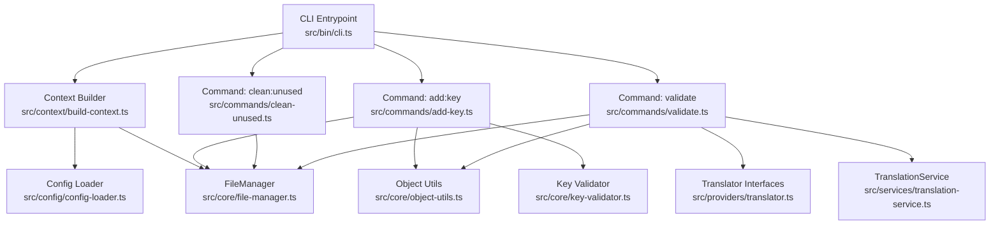
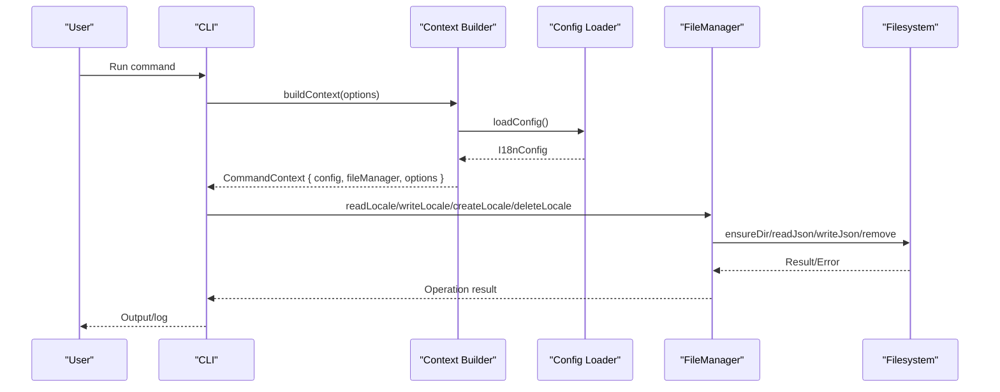
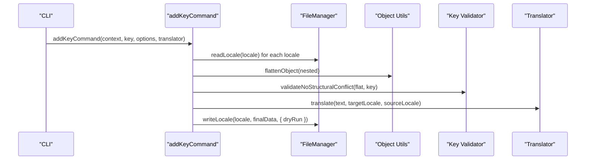
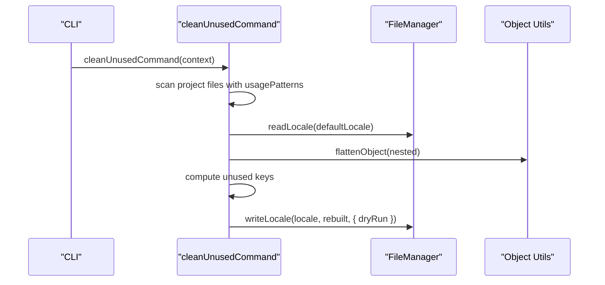
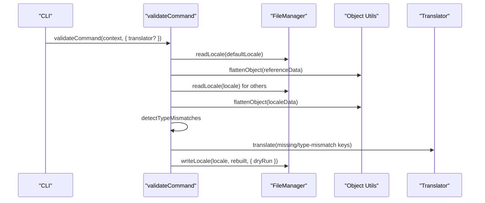
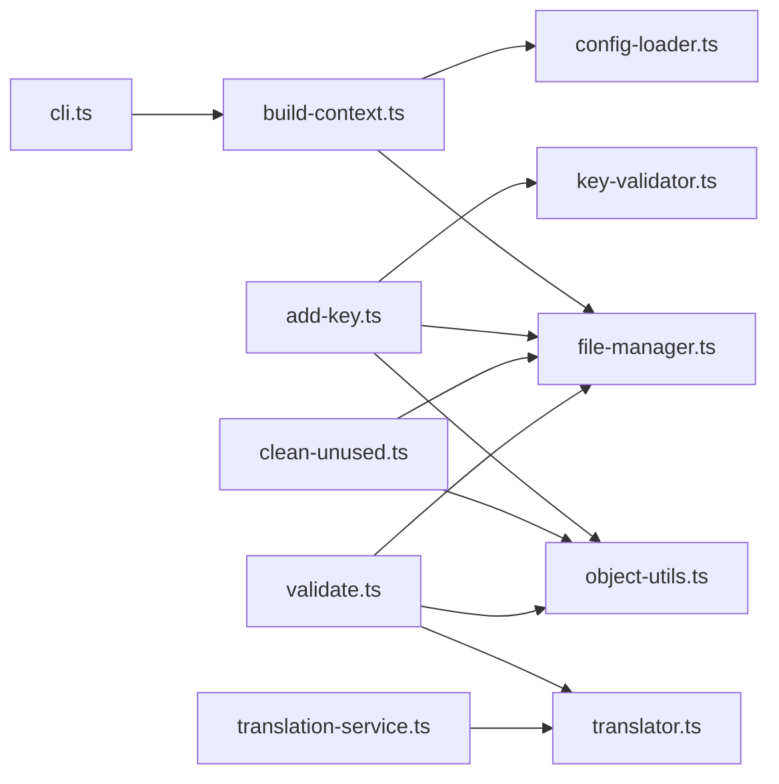

# File Operations

<cite>
**Referenced Files in This Document**
- [cli.ts](file://src/bin/cli.ts)
- [build-context.ts](file://src/context/build-context.ts)
- [types.ts](file://src/context/types.ts)
- [config-loader.ts](file://src/config/config-loader.ts)
- [types.ts](file://src/config/types.ts)
- [file-manager.ts](file://src/core/file-manager.ts)
- [key-validator.ts](file://src/core/key-validator.ts)
- [object-utils.ts](file://src/core/object-utils.ts)
- [translator.ts](file://src/providers/translator.ts)
- [translation-service.ts](file://src/services/translation-service.ts)
- [add-key.ts](file://src/commands/add-key.ts)
- [clean-unused.ts](file://src/commands/clean-unused.ts)
- [validate.ts](file://src/commands/validate.ts)
- [init.ts](file://src/commands/init.ts)
- [file-manager.test.ts](file://unit-testing/core/file-manager.test.ts)
- [object-utils.test.ts](file://unit-testing/core/object-utils.test.ts)
</cite>

## Table of Contents
1. [Introduction](#introduction)
2. [Project Structure](#project-structure)
3. [Core Components](#core-components)
4. [Architecture Overview](#architecture-overview)
5. [Detailed Component Analysis](#detailed-component-analysis)
6. [Dependency Analysis](#dependency-analysis)
7. [Performance Considerations](#performance-considerations)
8. [Troubleshooting Guide](#troubleshooting-guide)
9. [Conclusion](#conclusion)
10. [Appendices](#appendices)

## Introduction
This document provides comprehensive API documentation for file management operations in the i18n CLI. It focuses on the FileManager class and related utilities that enable reading, writing, validating, and manipulating translation files. It also covers JSON processing helpers, key validation functions, and object manipulation utilities. The guide includes TypeScript interfaces, error handling patterns, async/await usage, practical examples, and performance optimization techniques for working with translation workflows.

## Project Structure
The file operations are centered around a small set of cohesive modules:
- CLI entrypoint orchestrates commands and global options
- Context builder loads configuration and instantiates FileManager
- Core file manager handles filesystem operations for locale files
- Utilities support flattening/unflattening objects, validating keys, and removing empty structures
- Commands integrate FileManager with translation providers and user prompts
- Providers define translation interfaces and services

**Diagram sources**
- [cli.ts:1-209](file://src/bin/cli.ts#L1-L209)
- [build-context.ts:1-16](file://src/context/build-context.ts#L1-L16)
- [config-loader.ts:1-176](file://src/config/config-loader.ts#L1-L176)
- [file-manager.ts:1-118](file://src/core/file-manager.ts#L1-L118)
- [object-utils.ts:1-95](file://src/core/object-utils.ts#L1-L95)
- [key-validator.ts:1-33](file://src/core/key-validator.ts#L1-L33)
- [translator.ts:1-60](file://src/providers/translator.ts#L1-L60)
- [translation-service.ts:1-18](file://src/services/translation-service.ts#L1-L18)
- [add-key.ts:1-120](file://src/commands/add-key.ts#L1-L120)
- [clean-unused.ts:1-138](file://src/commands/clean-unused.ts#L1-L138)
- [validate.ts:1-254](file://src/commands/validate.ts#L1-L254)

**Section sources**
- [cli.ts:1-209](file://src/bin/cli.ts#L1-L209)
- [build-context.ts:1-16](file://src/context/build-context.ts#L1-L16)
- [config-loader.ts:1-176](file://src/config/config-loader.ts#L1-L176)

## Core Components
This section documents the primary APIs for file operations and supporting utilities.

- FileManager
  - Purpose: Encapsulates filesystem operations for locale files, including reading, writing, creating, deleting, and ensuring directories exist.
  - Key methods:
    - getLocaleFilePath(locale): Returns absolute path for a locale file.
    - ensureLocalesDirectory(): Ensures the locales directory exists.
    - localeExists(locale): Checks if a locale file exists.
    - listLocales(): Returns configured supported locales.
    - readLocale(locale): Reads and parses a locale file; throws if missing or invalid JSON.
    - writeLocale(locale, data, options?): Writes a locale file; respects autoSort and dryRun options.
    - deleteLocale(locale, options?): Deletes a locale file; validates existence and supports dryRun.
    - createLocale(locale, initialData, options?): Creates a new locale file; ensures directory and validates non-existence; supports dryRun.
  - Sorting behavior: When autoSort is enabled, keys are recursively sorted during write operations.

- JSON Processing Utilities
  - flattenObject(obj): Flattens nested objects into dot-delimited keys; enforces safety checks for dangerous key segments.
  - unflattenObject(flatObj): Converts flattened keys back into nested objects; enforces safety checks.
  - getAllFlatKeys(obj): Convenience to retrieve all flattened keys.
  - removeEmptyObjects(obj): Recursively removes empty objects and undefined values; enforces safety checks.

- Key Validation
  - validateNoStructuralConflict(flatObject, newKey): Validates that adding a key does not conflict with existing parent or child structures.

- TypeScript Interfaces
  - I18nConfig: Defines configuration shape for localesPath, defaultLocale, supportedLocales, keyStyle, usagePatterns, compiledUsagePatterns, and autoSort.
  - CommandContext: Provides config, fileManager, and global options to commands.
  - TranslationRequest/TranslationResult/Translator: Define translation contract for providers.
  - ValidationReport/LocaleIssues: Structure for validation reports and issue collections.

**Section sources**
- [file-manager.ts:1-118](file://src/core/file-manager.ts#L1-L118)
- [object-utils.ts:1-95](file://src/core/object-utils.ts#L1-L95)
- [key-validator.ts:1-33](file://src/core/key-validator.ts#L1-L33)
- [types.ts:1-12](file://src/config/types.ts#L1-L12)
- [types.ts:1-15](file://src/context/types.ts#L1-L15)
- [translator.ts:1-60](file://src/providers/translator.ts#L1-L60)

## Architecture Overview
The CLI composes a context that loads configuration and instantiates FileManager. Commands use FileManager to manipulate locale files, often combined with object utilities and optional translation providers.

**Diagram sources**
- [cli.ts:1-209](file://src/bin/cli.ts#L1-L209)
- [build-context.ts:1-16](file://src/context/build-context.ts#L1-L16)
- [config-loader.ts:1-176](file://src/config/config-loader.ts#L1-L176)
- [file-manager.ts:1-118](file://src/core/file-manager.ts#L1-L118)

## Detailed Component Analysis

### FileManager API Reference
- Constructor(config: I18nConfig)
  - Initializes FileManager with resolved localesPath and config.
- getLocaleFilePath(locale: string): string
  - Returns path to a locale file under localesPath.
- ensureLocalesDirectory(): Promise<void>
  - Ensures the locales directory exists.
- localeExists(locale: string): Promise<boolean>
  - Checks existence of a locale file.
- listLocales(): Promise<string[]>
  - Returns supported locales from configuration.
- readLocale(locale: string): Promise<Record<string, any>>
  - Reads and parses JSON; throws descriptive errors for missing or invalid files.
- writeLocale(locale: string, data: Record<string, any>, options?: { dryRun?: boolean }): Promise<void>
  - Writes JSON with indentation; applies recursive key sorting when autoSort is enabled; supports dryRun.
- deleteLocale(locale: string, options?: { dryRun?: boolean }): Promise<void>
  - Removes locale file; validates existence; supports dryRun.
- createLocale(locale: string, initialData: Record<string, any>, options?: { dryRun?: boolean }): Promise<void>
  - Creates locale file; ensures directory; validates non-existence; supports dryRun.

Behavioral notes:
- Recursive key sorting is applied during write operations when autoSort is enabled.
- Dry run mode prevents filesystem writes and logs preview actions.

**Section sources**
- [file-manager.ts:1-118](file://src/core/file-manager.ts#L1-L118)

### JSON Processing Utilities API Reference
- flattenObject(obj: Record<string, any>, parentKey?: string, result?: FlatObject): FlatObject
  - Flattens nested objects into dot-delimited keys; rejects dangerous key segments.
- unflattenObject(flatObj: FlatObject): Record<string, any>
  - Reconstructs nested objects from flattened keys; rejects dangerous key segments.
- getAllFlatKeys(obj: Record<string, any>): string[]
  - Returns all flattened keys.
- removeEmptyObjects(obj: any): any
  - Recursively removes empty objects and undefined values; rejects dangerous key segments.

Safety enforcement:
- Dangerous key segments (__proto__, constructor, prototype) are rejected in all utilities.

**Section sources**
- [object-utils.ts:1-95](file://src/core/object-utils.ts#L1-L95)

### Key Validation API Reference
- validateNoStructuralConflict(flatObject: Record<string, any>, newKey: string): void
  - Prevents conflicts where adding a key would overwrite or collide with existing parent/child structures.

Validation rules:
- Throws if any parent path is already a non-object value.
- Throws if adding the key would overwrite nested keys.

**Section sources**
- [key-validator.ts:1-33](file://src/core/key-validator.ts#L1-L33)

### Command Workflows Using FileManager

#### Add Key Workflow

Practical usage:
- Validates key structure across all locales.
- Translates default value into other locales using a translator.
- Supports dryRun and CI modes.

**Diagram sources**
- [add-key.ts:1-120](file://src/commands/add-key.ts#L1-L120)
- [file-manager.ts:1-118](file://src/core/file-manager.ts#L1-L118)
- [object-utils.ts:1-95](file://src/core/object-utils.ts#L1-L95)
- [key-validator.ts:1-33](file://src/core/key-validator.ts#L1-L33)
- [translator.ts:1-60](file://src/providers/translator.ts#L1-L60)

**Section sources**
- [add-key.ts:1-120](file://src/commands/add-key.ts#L1-L120)

#### Clean Unused Keys Workflow

Practical usage:
- Scans source files using compiled regex patterns.
- Compares against default locale keys to find unused entries.
- Removes unused keys from all locales and supports dryRun.

**Diagram sources**
- [clean-unused.ts:1-138](file://src/commands/clean-unused.ts#L1-L138)
- [file-manager.ts:1-118](file://src/core/file-manager.ts#L1-L118)
- [object-utils.ts:1-95](file://src/core/object-utils.ts#L1-L95)

**Section sources**
- [clean-unused.ts:1-138](file://src/commands/clean-unused.ts#L1-L138)

#### Validate and Auto-Correct Workflow

Practical usage:
- Compares locales against default reference.
- Detects missing, extra, and type mismatched keys.
- Optionally translates missing/type-mismatched keys and removes extras.

**Diagram sources**
- [validate.ts:1-254](file://src/commands/validate.ts#L1-L254)
- [file-manager.ts:1-118](file://src/core/file-manager.ts#L1-L118)
- [object-utils.ts:1-95](file://src/core/object-utils.ts#L1-L95)
- [translator.ts:1-60](file://src/providers/translator.ts#L1-L60)

**Section sources**
- [validate.ts:1-254](file://src/commands/validate.ts#L1-L254)

### Initialization and Configuration
- initCommand(options): Prompts for configuration or uses defaults; compiles usagePatterns; optionally initializes default locale file; supports dryRun and CI modes.
- loadConfig(): Loads and validates configuration file; compiles usagePatterns; enforces logical constraints.

Key behaviors:
- Validates defaultLocale inclusion and uniqueness of supportedLocales.
- Compiles regex patterns and ensures capturing groups.

**Section sources**
- [init.ts:1-239](file://src/commands/init.ts#L1-L239)
- [config-loader.ts:1-176](file://src/config/config-loader.ts#L1-L176)

## Dependency Analysis
The following diagram shows module-level dependencies among core file operations and utilities:

**Diagram sources**
- [cli.ts:1-209](file://src/bin/cli.ts#L1-L209)
- [build-context.ts:1-16](file://src/context/build-context.ts#L1-L16)
- [config-loader.ts:1-176](file://src/config/config-loader.ts#L1-L176)
- [file-manager.ts:1-118](file://src/core/file-manager.ts#L1-L118)
- [object-utils.ts:1-95](file://src/core/object-utils.ts#L1-L95)
- [key-validator.ts:1-33](file://src/core/key-validator.ts#L1-L33)
- [translator.ts:1-60](file://src/providers/translator.ts#L1-L60)
- [translation-service.ts:1-18](file://src/services/translation-service.ts#L1-L18)
- [add-key.ts:1-120](file://src/commands/add-key.ts#L1-L120)
- [clean-unused.ts:1-138](file://src/commands/clean-unused.ts#L1-L138)
- [validate.ts:1-254](file://src/commands/validate.ts#L1-L254)

## Performance Considerations
- Batch operations across locales: Commands iterate over supportedLocales; consider limiting concurrent filesystem operations if scaling to very large sets.
- JSON parsing and writing: All locale reads/writes use JSON; ensure localesPath is on fast storage for large projects.
- Recursive sorting: Enabling autoSort adds overhead proportional to key depth; disable for write-heavy scenarios where ordering is not required.
- Regex scanning: usagePatterns scanning uses compiled regex; keep patterns efficient and avoid excessive matches.
- Dry run mode: Use dryRun to preview changes and reduce unnecessary writes.

[No sources needed since this section provides general guidance]

## Troubleshooting Guide
Common issues and resolutions:
- Locale file does not exist
  - Symptom: readLocale throws an error indicating missing file.
  - Resolution: Use createLocale or ensure the file exists before reading.
- Invalid JSON in locale file
  - Symptom: readLocale throws an error about invalid JSON.
  - Resolution: Fix JSON syntax or recreate the file.
- Structural conflict when adding keys
  - Symptom: validateNoStructuralConflict throws an error.
  - Resolution: Adjust key path to avoid overwriting existing values or nested keys.
- Unsafe key segments
  - Symptom: flattenObject/unflattenObject/removeEmptyObjects throws an error for __proto__/constructor/prototype.
  - Resolution: Rename keys to avoid these segments.
- Configuration validation failures
  - Symptom: loadConfig or initCommand throws errors about defaultLocale or duplicates.
  - Resolution: Ensure defaultLocale is included in supportedLocales and that locales are unique.

**Section sources**
- [file-manager.ts:31-43](file://src/core/file-manager.ts#L31-L43)
- [file-manager.ts:89-91](file://src/core/file-manager.ts#L89-L91)
- [key-validator.ts:7-19](file://src/core/key-validator.ts#L7-L19)
- [object-utils.ts:9-15](file://src/core/object-utils.ts#L9-L15)
- [config-loader.ts:69-82](file://src/config/config-loader.ts#L69-L82)
- [init.ts:32-37](file://src/commands/init.ts#L32-L37)

## Conclusion
The FileManager and associated utilities provide a robust foundation for managing translation files. They support safe, structured key handling, flexible JSON transformations, and integration with translation providers. By leveraging dryRun, CI-friendly prompts, and configuration-driven behavior, teams can automate translation workflows with confidence.

[No sources needed since this section summarizes without analyzing specific files]

## Appendices

### Practical Examples and Patterns

- Programmatic file manipulation
  - Read a locale, modify values, and write back:
    - Use readLocale to load data.
    - Apply object-utils to flatten/unflatten as needed.
    - Use writeLocale with options to persist changes.
  - Example reference: [file-manager.ts:31-43](file://src/core/file-manager.ts#L31-L43), [file-manager.ts:45-61](file://src/core/file-manager.ts#L45-L61)

- Batch operations across locales
  - Iterate over supportedLocales and apply changes uniformly:
    - Use listLocales to retrieve locales.
    - Loop over locales and call readLocale/writeLocale.
  - Example reference: [add-key.ts:30-44](file://src/commands/add-key.ts#L30-L44), [validate.ts:143-156](file://src/commands/validate.ts#L143-L156)

- Integration with translation workflows
  - Validate and auto-correct missing or mismatched keys:
    - Use validateCommand with an optional translator.
    - Optionally translate missing/type-mismatched keys.
  - Example reference: [validate.ts:121-254](file://src/commands/validate.ts#L121-L254), [translation-service.ts:7-17](file://src/services/translation-service.ts#L7-L17)

- File format handling and validation rules
  - JSON format: All locale files are JSON with indentation.
  - Key styles: Nested vs flat; controlled by keyStyle in configuration.
  - Safety: Rejects dangerous key segments; validates regex patterns; enforces structural integrity.
  - Example reference: [config-loader.ts:84-109](file://src/config/config-loader.ts#L84-L109), [object-utils.ts:3-7](file://src/core/object-utils.ts#L3-L7), [key-validator.ts:5-19](file://src/core/key-validator.ts#L5-L19)

- Async/await usage patterns
  - All file operations are asynchronous; commands await FileManager methods and optional translator calls.
  - Example reference: [file-manager.ts:31-43](file://src/core/file-manager.ts#L31-L43), [validate.ts:102-119](file://src/commands/validate.ts#L102-L119)

- Performance optimization techniques
  - Disable autoSort for write-heavy workloads.
  - Use dryRun to preview changes before applying.
  - Keep usagePatterns concise and efficient.
  - Example reference: [file-manager.ts:52-54](file://src/core/file-manager.ts#L52-L54), [init.ts:170-173](file://src/commands/init.ts#L170-L173)

### TypeScript Interfaces Summary

- I18nConfig
  - Fields: localesPath, defaultLocale, supportedLocales, keyStyle, usagePatterns, compiledUsagePatterns, autoSort
  - Example reference: [types.ts:3-11](file://src/config/types.ts#L3-L11)

- CommandContext
  - Fields: config, fileManager, options
  - Example reference: [types.ts:11-15](file://src/context/types.ts#L11-L15)

- TranslationRequest/TranslationResult/Translator
  - Example reference: [translator.ts:1-17](file://src/providers/translator.ts#L1-L17)

- ValidationReport/LocaleIssues
  - Example reference: [translator.ts:46-59](file://src/providers/translator.ts#L46-L59)

**Section sources**
- [types.ts:1-12](file://src/config/types.ts#L1-L12)
- [types.ts:1-15](file://src/context/types.ts#L1-L15)
- [translator.ts:1-60](file://src/providers/translator.ts#L1-L60)

### Test Coverage Highlights
- FileManager
  - Directory creation, file existence checks, read/write/delete operations, recursive key sorting, dryRun behavior.
  - Example reference: [file-manager.test.ts:65-245](file://unit-testing/core/file-manager.test.ts#L65-L245)

- Object Utilities
  - Round-trip flattening/unflattening, safety checks, empty object removal.
  - Example reference: [object-utils.test.ts:9-447](file://unit-testing/core/object-utils.test.ts#L9-L447)

**Section sources**
- [file-manager.test.ts:1-297](file://unit-testing/core/file-manager.test.ts#L1-L297)
- [object-utils.test.ts:1-447](file://unit-testing/core/object-utils.test.ts#L1-L447)