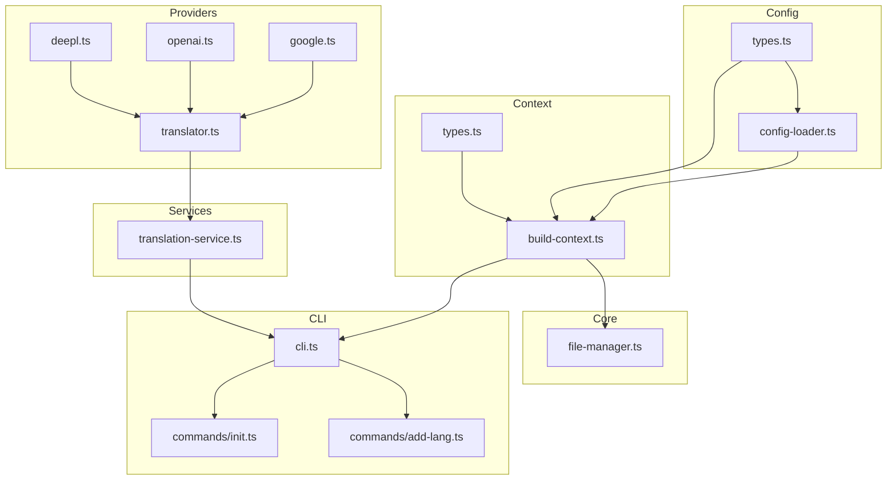
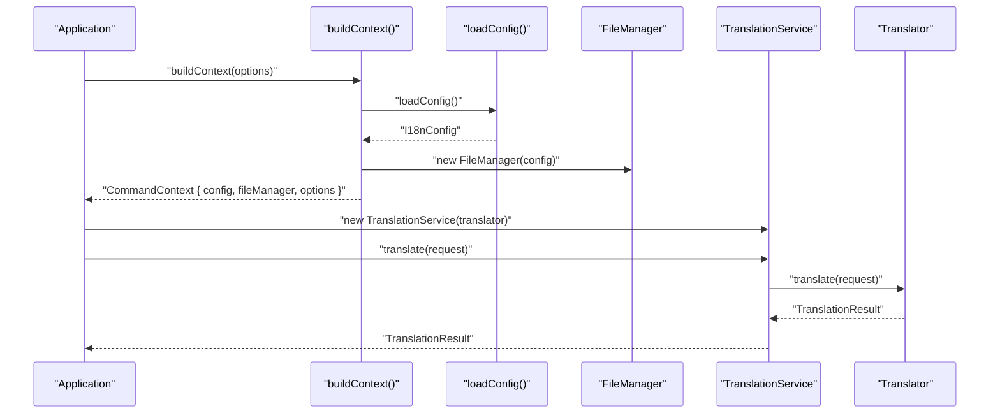
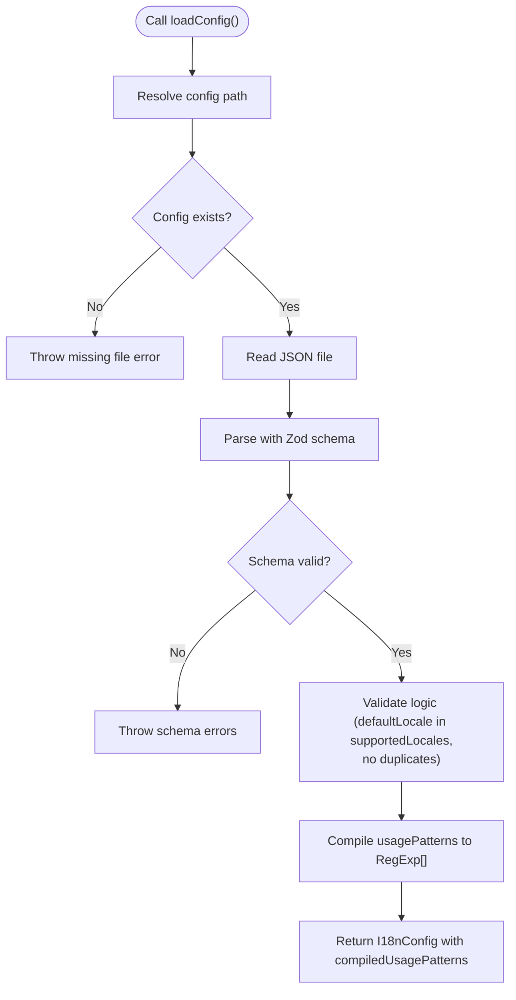
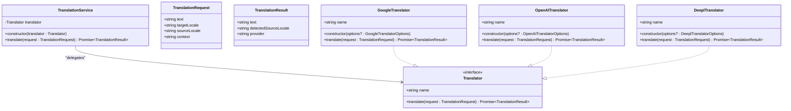
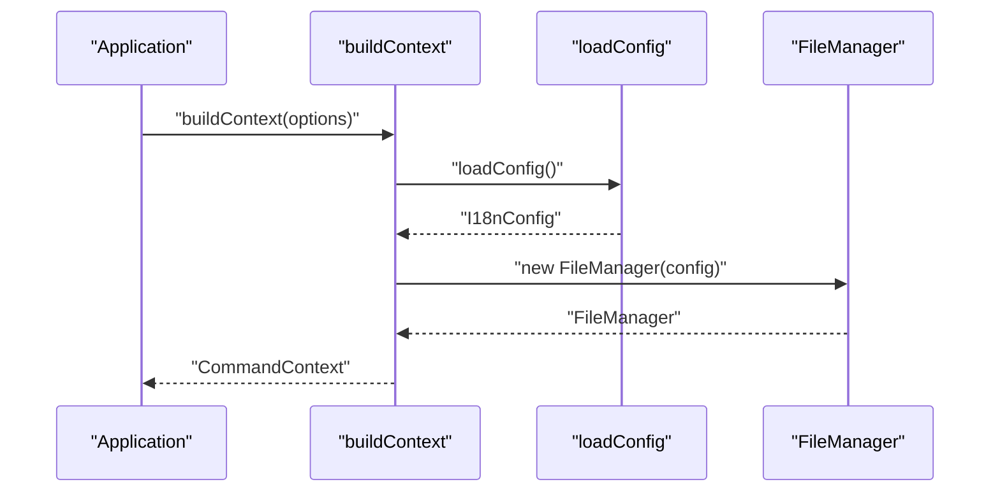
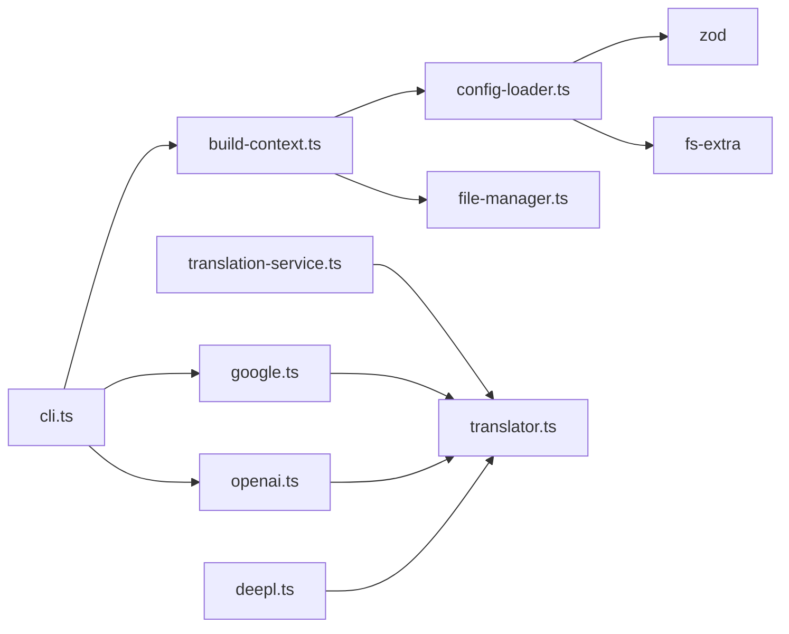

# Programmatic API

<cite>
**Referenced Files in This Document**
- [src/config/config-loader.ts](file://src/config/config-loader.ts)
- [src/config/types.ts](file://src/config/types.ts)
- [src/context/build-context.ts](file://src/context/build-context.ts)
- [src/context/types.ts](file://src/context/types.ts)
- [src/core/file-manager.ts](file://src/core/file-manager.ts)
- [src/services/translation-service.ts](file://src/services/translation-service.ts)
- [src/providers/translator.ts](file://src/providers/translator.ts)
- [src/providers/google.ts](file://src/providers/google.ts)
- [src/providers/openai.ts](file://src/providers/openai.ts)
- [src/providers/deepl.ts](file://src/providers/deepl.ts)
- [src/bin/cli.ts](file://src/bin/cli.ts)
- [src/commands/init.ts](file://src/commands/init.ts)
- [src/commands/add-lang.ts](file://src/commands/add-lang.ts)
- [package.json](file://package.json)
</cite>

## Table of Contents
1. [Introduction](#introduction)
2. [Project Structure](#project-structure)
3. [Core Components](#core-components)
4. [Architecture Overview](#architecture-overview)
5. [Detailed Component Analysis](#detailed-component-analysis)
6. [Dependency Analysis](#dependency-analysis)
7. [Performance Considerations](#performance-considerations)
8. [Troubleshooting Guide](#troubleshooting-guide)
9. [Conclusion](#conclusion)
10. [Appendices](#appendices)

## Introduction
This document provides comprehensive programmatic API documentation for i18n-ai-cli. It focuses on the public APIs that enable integrating the CLI programmatically in applications, build scripts, and automation tools. Covered areas include:
- Configuration loading via loadConfig()
- File operations via FileManager class
- Translation workflows via TranslationService and provider interfaces
- Context building via buildContext()
- TypeScript interfaces, method signatures, and parameter descriptions
- Practical integration examples, async/await patterns, error handling, and performance optimization
- Migration guidance for different usage patterns

## Project Structure
The project is organized into feature-based modules:
- config: configuration loading and validation
- context: shared context builder and global options
- core: file operations and utilities
- providers: translator implementations and interfaces
- services: service layer wrapping providers
- commands: CLI command handlers (for usage patterns)
- bin: CLI entrypoint wiring commands and providers



**Diagram sources**
- [src/config/config-loader.ts:1-176](file://src/config/config-loader.ts#L1-L176)
- [src/config/types.ts:1-12](file://src/config/types.ts#L1-L12)
- [src/context/build-context.ts:1-16](file://src/context/build-context.ts#L1-L16)
- [src/context/types.ts:1-15](file://src/context/types.ts#L1-L15)
- [src/core/file-manager.ts:1-118](file://src/core/file-manager.ts#L1-L118)
- [src/providers/translator.ts:1-60](file://src/providers/translator.ts#L1-L60)
- [src/providers/google.ts:1-50](file://src/providers/google.ts#L1-L50)
- [src/providers/openai.ts:1-60](file://src/providers/openai.ts#L1-L60)
- [src/providers/deepl.ts:1-26](file://src/providers/deepl.ts#L1-L26)
- [src/services/translation-service.ts:1-18](file://src/services/translation-service.ts#L1-L18)
- [src/bin/cli.ts:1-209](file://src/bin/cli.ts#L1-L209)
- [src/commands/init.ts:1-239](file://src/commands/init.ts#L1-L239)
- [src/commands/add-lang.ts:1-98](file://src/commands/add-lang.ts#L1-L98)

**Section sources**
- [src/config/config-loader.ts:1-176](file://src/config/config-loader.ts#L1-L176)
- [src/context/build-context.ts:1-16](file://src/context/build-context.ts#L1-L16)
- [src/core/file-manager.ts:1-118](file://src/core/file-manager.ts#L1-L118)
- [src/providers/translator.ts:1-60](file://src/providers/translator.ts#L1-L60)
- [src/services/translation-service.ts:1-18](file://src/services/translation-service.ts#L1-L18)
- [src/bin/cli.ts:1-209](file://src/bin/cli.ts#L1-L209)

## Core Components
This section documents the primary programmatic APIs exposed by the library.

- loadConfig(): Loads and validates the configuration file, returning a strongly typed I18nConfig with compiled usage patterns.
- FileManager: Encapsulates filesystem operations for locale files with support for dry-run and sorting.
- TranslationService: Thin wrapper around Translator implementations for translation requests.
- buildContext(): Creates a CommandContext containing config, file manager, and global options.

**Section sources**
- [src/config/config-loader.ts:24-67](file://src/config/config-loader.ts#L24-L67)
- [src/config/types.ts:3-11](file://src/config/types.ts#L3-L11)
- [src/core/file-manager.ts:5-118](file://src/core/file-manager.ts#L5-L118)
- [src/services/translation-service.ts:7-17](file://src/services/translation-service.ts#L7-L17)
- [src/context/build-context.ts:5-16](file://src/context/build-context.ts#L5-L16)

## Architecture Overview
The programmatic API follows a layered design:
- Configuration layer: loadConfig() and I18nConfig
- Context layer: buildContext() produces CommandContext
- Core layer: FileManager for file operations
- Provider layer: Translator interface and implementations
- Service layer: TranslationService wraps providers
- CLI layer: commands consume the context and providers



**Diagram sources**
- [src/context/build-context.ts:5-16](file://src/context/build-context.ts#L5-L16)
- [src/config/config-loader.ts:24-67](file://src/config/config-loader.ts#L24-L67)
- [src/core/file-manager.ts:5-12](file://src/core/file-manager.ts#L5-L12)
- [src/services/translation-service.ts:7-17](file://src/services/translation-service.ts#L7-L17)
- [src/providers/translator.ts:14-17](file://src/providers/translator.ts#L14-L17)

## Detailed Component Analysis

### Configuration Loading API
- Function: loadConfig()
  - Purpose: Load and validate the configuration file, ensuring correctness and compiling usage patterns.
  - Returns: Promise resolving to I18nConfig with compiledUsagePatterns.
  - Throws: Error on missing file, invalid JSON, schema mismatch, or logical inconsistencies.
  - Behavior: Validates defaultLocale inclusion in supportedLocales and absence of duplicates; compiles usagePatterns into RegExp[].
- Interfaces and Types
  - I18nConfig: localesPath, defaultLocale, supportedLocales, keyStyle, usagePatterns, compiledUsagePatterns, autoSort.
  - KeyStyle: "flat" | "nested".



**Diagram sources**
- [src/config/config-loader.ts:24-67](file://src/config/config-loader.ts#L24-L67)
- [src/config/config-loader.ts:69-82](file://src/config/config-loader.ts#L69-L82)
- [src/config/config-loader.ts:84-109](file://src/config/config-loader.ts#L84-L109)
- [src/config/types.ts:3-11](file://src/config/types.ts#L3-L11)

**Section sources**
- [src/config/config-loader.ts:24-67](file://src/config/config-loader.ts#L24-L67)
- [src/config/config-loader.ts:69-82](file://src/config/config-loader.ts#L69-L82)
- [src/config/config-loader.ts:84-109](file://src/config/config-loader.ts#L84-L109)
- [src/config/types.ts:3-11](file://src/config/types.ts#L3-L11)

### File Operations API
- Class: FileManager
  - Constructor: Takes I18nConfig to resolve localesPath.
  - Methods:
    - getLocaleFilePath(locale): Compute absolute path for a locale file.
    - ensureLocalesDirectory(): Ensure locales directory exists.
    - localeExists(locale): Check if a locale file exists.
    - listLocales(): Return configured supportedLocales.
    - readLocale(locale): Read and parse a locale JSON file; throws on missing or invalid JSON.
    - writeLocale(locale, data, options?): Write locale JSON with optional dryRun.
    - deleteLocale(locale, options?): Remove locale file with optional dryRun.
    - createLocale(locale, initialData, options?): Create a new locale file with optional dryRun.
  - Sorting: When autoSort is enabled, keys are sorted recursively before writing.

```mermaid
classDiagram
class FileManager {
-string localesPath
-I18nConfig config
+constructor(config : I18nConfig)
+getLocaleFilePath(locale : string) string
+ensureLocalesDirectory() Promise~void~
+localeExists(locale : string) Promise~boolean~
+listLocales() Promise~string[]~
+readLocale(locale : string) Promise~Record<string, any>~
+writeLocale(locale : string, data : Record<string, any>, options? : { dryRun? : boolean }) Promise~void~
+deleteLocale(locale : string, options? : { dryRun? : boolean }) Promise~void~
+createLocale(locale : string, initialData : Record<string, any>, options? : { dryRun? : boolean }) Promise~void~
-sortKeysRecursively(obj : any) any
}
```

**Diagram sources**
- [src/core/file-manager.ts:5-118](file://src/core/file-manager.ts#L5-L118)

**Section sources**
- [src/core/file-manager.ts:5-118](file://src/core/file-manager.ts#L5-L118)

### Translation Workflow API
- Service: TranslationService
  - Constructor: Accepts a Translator implementation.
  - Method: translate(request): Delegates to underlying translator.
- Provider Interface: Translator
  - Properties: name (readonly string)
  - Method: translate(request): Promise<TranslationResult>
- Request/Result Interfaces
  - TranslationRequest: text, targetLocale, sourceLocale?, context?
  - TranslationResult: text, detectedSourceLocale?, provider
- Providers
  - GoogleTranslator: Implements Translator using @vitalets/google-translate-api.
  - OpenAITranslator: Implements Translator using OpenAI chat completions; requires API key.
  - DeeplTranslator: Placeholder implementation indicating unimplemented provider.



**Diagram sources**
- [src/services/translation-service.ts:7-17](file://src/services/translation-service.ts#L7-L17)
- [src/providers/translator.ts:1-60](file://src/providers/translator.ts#L1-L60)
- [src/providers/google.ts:9-49](file://src/providers/google.ts#L9-L49)
- [src/providers/openai.ts:9-59](file://src/providers/openai.ts#L9-L59)
- [src/providers/deepl.ts:12-25](file://src/providers/deepl.ts#L12-L25)

**Section sources**
- [src/services/translation-service.ts:7-17](file://src/services/translation-service.ts#L7-L17)
- [src/providers/translator.ts:1-60](file://src/providers/translator.ts#L1-L60)
- [src/providers/google.ts:9-49](file://src/providers/google.ts#L9-L49)
- [src/providers/openai.ts:9-59](file://src/providers/openai.ts#L9-L59)
- [src/providers/deepl.ts:12-25](file://src/providers/deepl.ts#L12-L25)

### Context Building API
- Function: buildContext(options)
  - Purpose: Assemble a CommandContext from loaded configuration and a FileManager instance.
  - Parameters: GlobalOptions (yes, dryRun, ci, force)
  - Returns: Promise resolving to CommandContext with config, fileManager, and options.



**Diagram sources**
- [src/context/build-context.ts:5-16](file://src/context/build-context.ts#L5-L16)
- [src/config/config-loader.ts:24-67](file://src/config/config-loader.ts#L24-L67)
- [src/core/file-manager.ts:5-12](file://src/core/file-manager.ts#L5-L12)

**Section sources**
- [src/context/build-context.ts:5-16](file://src/context/build-context.ts#L5-L16)
- [src/context/types.ts:4-15](file://src/context/types.ts#L4-L15)

### TypeScript Interfaces and Signatures
- I18nConfig
  - localesPath: string
  - defaultLocale: string
  - supportedLocales: string[]
  - keyStyle: "flat" | "nested"
  - usagePatterns: string[]
  - compiledUsagePatterns: RegExp[]
  - autoSort: boolean
- GlobalOptions
  - yes?: boolean
  - dryRun?: boolean
  - ci?: boolean
  - force?: boolean
- CommandContext
  - config: I18nConfig
  - fileManager: FileManager
  - options: GlobalOptions
- TranslationRequest
  - text: string
  - targetLocale: string
  - sourceLocale?: string
  - context?: string
- TranslationResult
  - text: string
  - detectedSourceLocale?: string
  - provider: string
- Translator
  - name: string
  - translate(request: TranslationRequest): Promise<TranslationResult>

**Section sources**
- [src/config/types.ts:1-12](file://src/config/types.ts#L1-L12)
- [src/context/types.ts:4-15](file://src/context/types.ts#L4-L15)
- [src/providers/translator.ts:1-60](file://src/providers/translator.ts#L1-L60)

## Dependency Analysis
- loadConfig() depends on zod for schema validation and fs-extra for file IO.
- buildContext() depends on loadConfig() and FileManager.
- TranslationService depends on Translator implementations.
- CLI wiring demonstrates provider selection and context usage.



**Diagram sources**
- [src/config/config-loader.ts:1-3](file://src/config/config-loader.ts#L1-L3)
- [src/context/build-context.ts:1-3](file://src/context/build-context.ts#L1-L3)
- [src/core/file-manager.ts:1-3](file://src/core/file-manager.ts#L1-L3)
- [src/services/translation-service.ts:1-5](file://src/services/translation-service.ts#L1-L5)
- [src/providers/translator.ts:1-5](file://src/providers/translator.ts#L1-L5)
- [src/providers/google.ts:1-7](file://src/providers/google.ts#L1-L7)
- [src/providers/openai.ts:1-7](file://src/providers/openai.ts#L1-L7)
- [src/providers/deepl.ts:1-5](file://src/providers/deepl.ts#L1-L5)
- [src/bin/cli.ts:14-16](file://src/bin/cli.ts#L14-L16)

**Section sources**
- [src/config/config-loader.ts:1-3](file://src/config/config-loader.ts#L1-L3)
- [src/bin/cli.ts:14-16](file://src/bin/cli.ts#L14-L16)

## Performance Considerations
- Async I/O: All file operations are asynchronous; batch writes and minimize repeated reads.
- Sorting: Enabling autoSort ensures deterministic output but adds recursive traversal overhead; disable if not needed.
- Regex compilation: usagePatterns are compiled once during loadConfig(); reuse the returned config to avoid recompilation.
- Provider latency: TranslationService delegates to external providers; consider caching or rate limiting in automation contexts.
- Dry-run mode: Use options.dryRun to preview changes without disk writes.

[No sources needed since this section provides general guidance]

## Troubleshooting Guide
Common issues and resolutions:
- Missing configuration file: loadConfig() throws if the configuration file is absent; initialize via CLI or ensure the file exists.
- Invalid JSON or schema: loadConfig() validates JSON and schema; fix formatting or field types.
- Logical errors: defaultLocale must be in supportedLocales and duplicates are disallowed.
- Invalid regex patterns: usagePatterns must compile to RegExp and include capturing groups.
- Provider setup:
  - OpenAITranslator requires an API key via constructor option or environment variable.
  - GoogleTranslator relies on network availability and may require proxy/host options.
- File operations:
  - readLocale() throws on missing or invalid JSON.
  - createLocale() and deleteLocale() guard against overwriting or deleting non-existent files.

**Section sources**
- [src/config/config-loader.ts:27-54](file://src/config/config-loader.ts#L27-L54)
- [src/config/config-loader.ts:69-82](file://src/config/config-loader.ts#L69-L82)
- [src/config/config-loader.ts:84-109](file://src/config/config-loader.ts#L84-L109)
- [src/providers/openai.ts:14-21](file://src/providers/openai.ts#L14-L21)
- [src/core/file-manager.ts:31-43](file://src/core/file-manager.ts#L31-L43)
- [src/core/file-manager.ts:80-98](file://src/core/file-manager.ts#L80-L98)
- [src/core/file-manager.ts:63-78](file://src/core/file-manager.ts#L63-L78)

## Conclusion
The i18n-ai-cli exposes a clear, modular programmatic API centered around configuration loading, file operations, and translation services. By leveraging buildContext(), developers can integrate CLI capabilities into applications and automation workflows. The design emphasizes strong typing, validation, and extensibility through the Translator interface.

[No sources needed since this section summarizes without analyzing specific files]

## Appendices

### Practical Integration Examples
- Initialize configuration programmatically
  - Steps: Call loadConfig() to validate and load configuration; optionally compile usagePatterns; pass to buildContext().
  - Example path: [src/config/config-loader.ts:24-67](file://src/config/config-loader.ts#L24-L67), [src/context/build-context.ts:5-16](file://src/context/build-context.ts#L5-L16)
- Perform translations
  - Steps: Instantiate a Translator (Google or OpenAI); wrap with TranslationService; call translate() with appropriate request.
  - Example path: [src/providers/google.ts:9-49](file://src/providers/google.ts#L9-L49), [src/providers/openai.ts:9-59](file://src/providers/openai.ts#L9-L59), [src/services/translation-service.ts:7-17](file://src/services/translation-service.ts#L7-L17)
- Manage locale files
  - Steps: Build CommandContext; use fileManager methods for create/read/write/delete; leverage dryRun for previews.
  - Example path: [src/core/file-manager.ts:45-98](file://src/core/file-manager.ts#L45-L98)
- CLI wiring reference
  - Example path: [src/bin/cli.ts:34-198](file://src/bin/cli.ts#L34-L198)

**Section sources**
- [src/config/config-loader.ts:24-67](file://src/config/config-loader.ts#L24-L67)
- [src/context/build-context.ts:5-16](file://src/context/build-context.ts#L5-L16)
- [src/providers/google.ts:9-49](file://src/providers/google.ts#L9-L49)
- [src/providers/openai.ts:9-59](file://src/providers/openai.ts#L9-L59)
- [src/services/translation-service.ts:7-17](file://src/services/translation-service.ts#L7-L17)
- [src/core/file-manager.ts:45-98](file://src/core/file-manager.ts#L45-L98)
- [src/bin/cli.ts:34-198](file://src/bin/cli.ts#L34-L198)

### Migration and Usage Patterns
- From CLI to programmatic usage
  - Replace manual steps with buildContext() and FileManager calls.
  - Example path: [src/bin/cli.ts:50-53](file://src/bin/cli.ts#L50-L53), [src/commands/add-lang.ts:26-98](file://src/commands/add-lang.ts#L26-L98)
- Provider selection
  - Choose Google vs OpenAI based on environment and requirements; handle missing API keys gracefully.
  - Example path: [src/bin/cli.ts:80-99](file://src/bin/cli.ts#L80-L99), [src/providers/openai.ts:14-21](file://src/providers/openai.ts#L14-L21)
- Batch operations
  - Use TranslationService.translate() in loops with caution; consider rate limits and retries.
  - Example path: [src/services/translation-service.ts:14-16](file://src/services/translation-service.ts#L14-L16)

**Section sources**
- [src/bin/cli.ts:50-53](file://src/bin/cli.ts#L50-L53)
- [src/commands/add-lang.ts:26-98](file://src/commands/add-lang.ts#L26-L98)
- [src/providers/openai.ts:14-21](file://src/providers/openai.ts#L14-L21)
- [src/services/translation-service.ts:14-16](file://src/services/translation-service.ts#L14-L16)

### Node.js Version and Exports
- Engine requirement: Node >= 18
- Export entrypoint: dist/cli.js

**Section sources**
- [package.json:42-47](file://package.json#L42-L47)