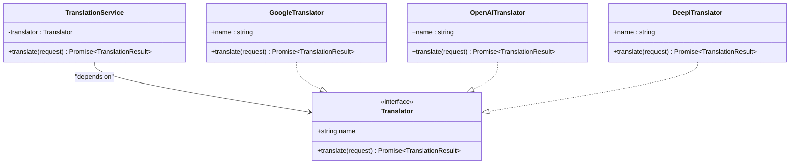
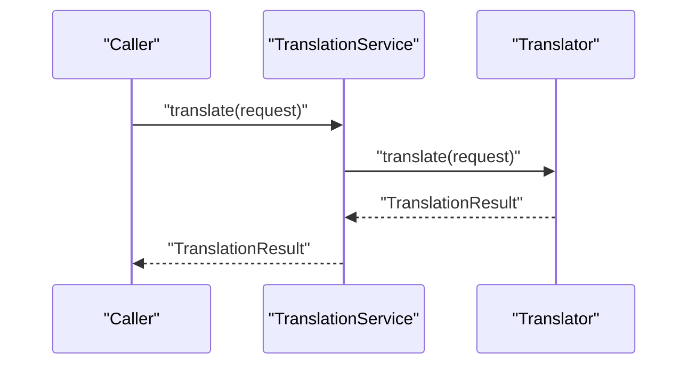
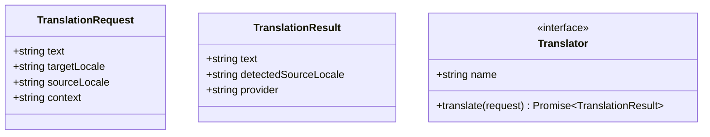
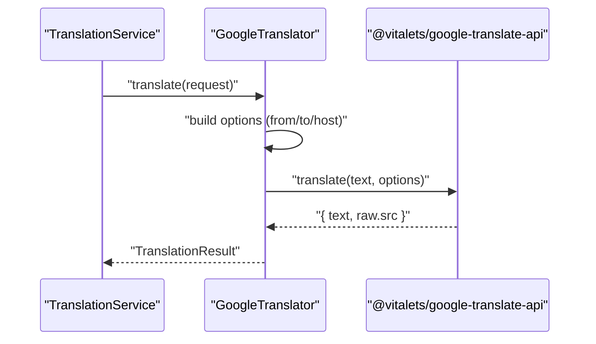
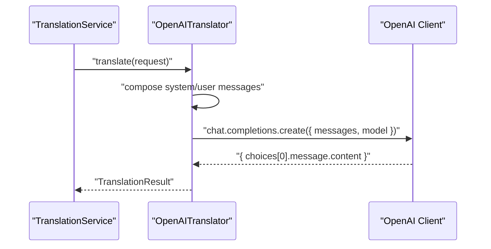
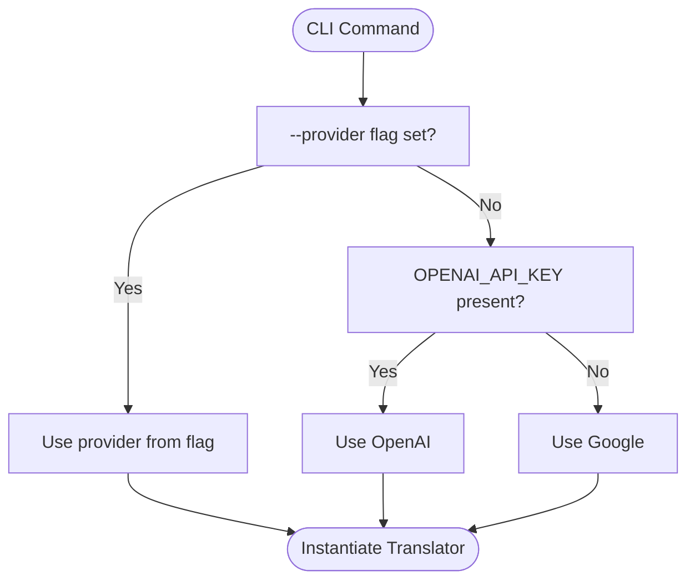
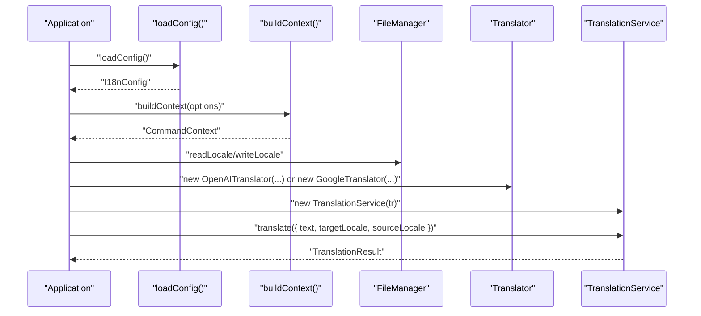
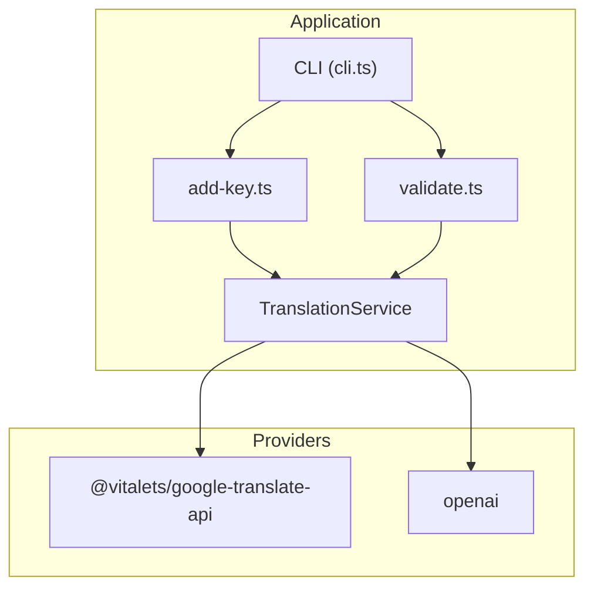

# Translation Service

<cite>
**Referenced Files in This Document**
- [translation-service.ts](file://src/services/translation-service.ts)
- [translator.ts](file://src/providers/translator.ts)
- [google.ts](file://src/providers/google.ts)
- [openai.ts](file://src/providers/openai.ts)
- [deepl.ts](file://src/providers/deepl.ts)
- [cli.ts](file://src/bin/cli.ts)
- [add-key.ts](file://src/commands/add-key.ts)
- [validate.ts](file://src/commands/validate.ts)
- [config-loader.ts](file://src/config/config-loader.ts)
- [types.ts](file://src/config/types.ts)
- [build-context.ts](file://src/context/build-context.ts)
- [types.ts](file://src/context/types.ts)
- [package.json](file://package.json)
- [README.md](file://README.md)
- [translation-service.test.ts](file://unit-testing/services/translation-service.test.ts)
</cite>

## Table of Contents
1. [Introduction](#introduction)
2. [Project Structure](#project-structure)
3. [Core Components](#core-components)
4. [Architecture Overview](#architecture-overview)
5. [Detailed Component Analysis](#detailed-component-analysis)
6. [Dependency Analysis](#dependency-analysis)
7. [Performance Considerations](#performance-considerations)
8. [Troubleshooting Guide](#troubleshooting-guide)
9. [Conclusion](#conclusion)
10. [Appendices](#appendices)

## Introduction
This document provides comprehensive API documentation for the translation service system. It focuses on the TranslationService class, the provider abstraction, and AI translation workflows. It covers provider interfaces, translation request/response schemas, error handling strategies, and practical examples of programmatic translation execution, provider selection logic, and fallback mechanisms. It also documents the strategy pattern implementation, provider configuration, integration with different AI services, and performance considerations including rate limiting and cost optimization techniques for automated translation workflows.

## Project Structure
The translation service system is organized around a small set of cohesive modules:
- Services: TranslationService orchestrates translation requests.
- Providers: Implementations for Google Translate and OpenAI, plus a placeholder for DeepL.
- Commands: CLI commands that use TranslationService and provider selection logic.
- Config and Context: Configuration loading and runtime context building.
- Tests: Unit tests validating TranslationService behavior and provider selection.

```mermaid
graph TB
subgraph "CLI"
CLI["CLI (cli.ts)"]
end
subgraph "Commands"
ADDKEY["add-key.ts"]
VALIDATE["validate.ts"]
end
subgraph "Services"
TS["TranslationService (translation-service.ts)"]
end
subgraph "Providers"
GT["GoogleTranslator (google.ts)"]
OT["OpenAITranslator (openai.ts)"]
DT["DeeplTranslator (deepl.ts)"]
TI["Translator Interface (translator.ts)"]
end
subgraph "Config & Context"
CL["config-loader.ts"]
CT["build-context.ts"]
TCFG["types.ts (config)"]
CTX["types.ts (context)"]
end
CLI --> ADDKEY
CLI --> VALIDATE
ADDKEY --> TS
VALIDATE --> TS
TS --> TI
TI --> GT
TI --> OT
TI --> DT
CLI --> CL
CLI --> CT
CT --> CL
CT --> TCFG
CT --> CTX
```

**Diagram sources**
- [cli.ts:1-209](file://src/bin/cli.ts#L1-L209)
- [add-key.ts:1-120](file://src/commands/add-key.ts#L1-L120)
- [validate.ts:1-254](file://src/commands/validate.ts#L1-L254)
- [translation-service.ts:1-18](file://src/services/translation-service.ts#L1-L18)
- [translator.ts:1-60](file://src/providers/translator.ts#L1-L60)
- [google.ts:1-50](file://src/providers/google.ts#L1-L50)
- [openai.ts:1-60](file://src/providers/openai.ts#L1-L60)
- [deepl.ts:1-26](file://src/providers/deepl.ts#L1-L26)
- [config-loader.ts:1-176](file://src/config/config-loader.ts#L1-L176)
- [build-context.ts:1-16](file://src/context/build-context.ts#L1-L16)
- [types.ts:1-12](file://src/config/types.ts#L1-L12)
- [types.ts:1-15](file://src/context/types.ts#L1-L15)

**Section sources**
- [translation-service.ts:1-18](file://src/services/translation-service.ts#L1-L18)
- [translator.ts:1-60](file://src/providers/translator.ts#L1-L60)
- [google.ts:1-50](file://src/providers/google.ts#L1-L50)
- [openai.ts:1-60](file://src/providers/openai.ts#L1-L60)
- [deepl.ts:1-26](file://src/providers/deepl.ts#L1-L26)
- [cli.ts:1-209](file://src/bin/cli.ts#L1-L209)
- [add-key.ts:1-120](file://src/commands/add-key.ts#L1-L120)
- [validate.ts:1-254](file://src/commands/validate.ts#L1-L254)
- [config-loader.ts:1-176](file://src/config/config-loader.ts#L1-L176)
- [build-context.ts:1-16](file://src/context/build-context.ts#L1-L16)
- [types.ts:1-12](file://src/config/types.ts#L1-L12)
- [types.ts:1-15](file://src/context/types.ts#L1-L15)

## Core Components
- TranslationService: Thin wrapper around the Translator interface, delegating translation requests to the configured provider.
- Translator interface: Defines the contract for translation providers, including provider metadata and the translate method.
- Provider implementations:
  - GoogleTranslator: Integrates with @vitalets/google-translate-api.
  - OpenAITranslator: Integrates with OpenAI Chat Completions API.
  - DeeplTranslator: Placeholder implementation indicating DeepL is not implemented.
- CLI integration: Provider selection logic and programmatic usage examples.

Key responsibilities:
- TranslationService encapsulates the strategy pattern by depending on the Translator interface.
- Providers implement provider-specific configuration and error handling.
- CLI commands demonstrate provider selection and fallback logic.

**Section sources**
- [translation-service.ts:7-17](file://src/services/translation-service.ts#L7-L17)
- [translator.ts:14-17](file://src/providers/translator.ts#L14-L17)
- [google.ts:9-49](file://src/providers/google.ts#L9-L49)
- [openai.ts:9-59](file://src/providers/openai.ts#L9-L59)
- [deepl.ts:12-25](file://src/providers/deepl.ts#L12-L25)

## Architecture Overview
The system follows a strategy pattern:
- Clients depend on the Translator interface.
- Concrete strategies are injected at runtime (Google or OpenAI).
- TranslationService acts as a façade that forwards requests to the selected strategy.



**Diagram sources**
- [translation-service.ts:7-17](file://src/services/translation-service.ts#L7-L17)
- [translator.ts:14-17](file://src/providers/translator.ts#L14-L17)
- [google.ts:9-49](file://src/providers/google.ts#L9-L49)
- [openai.ts:9-59](file://src/providers/openai.ts#L9-L59)
- [deepl.ts:12-25](file://src/providers/deepl.ts#L12-L25)

## Detailed Component Analysis

### TranslationService
- Purpose: Provide a unified translation API by delegating to a configured Translator.
- Behavior:
  - Accepts a Translator instance in the constructor.
  - Exposes a translate method that forwards the request to the underlying provider.
- Error propagation: Exceptions thrown by the provider are propagated to the caller.



**Diagram sources**
- [translation-service.ts:14-16](file://src/services/translation-service.ts#L14-L16)
- [translator.ts:14-17](file://src/providers/translator.ts#L14-L17)

**Section sources**
- [translation-service.ts:7-17](file://src/services/translation-service.ts#L7-L17)
- [translation-service.test.ts:20-96](file://unit-testing/services/translation-service.test.ts#L20-L96)

### Translator Interface and Schemas
- TranslationRequest: Defines the input shape for translation requests.
- TranslationResult: Defines the output shape returned by providers.
- Translator: Contract for provider implementations.



**Diagram sources**
- [translator.ts:1-6](file://src/providers/translator.ts#L1-L6)
- [translator.ts:8-12](file://src/providers/translator.ts#L8-L12)
- [translator.ts:14-17](file://src/providers/translator.ts#L14-L17)

**Section sources**
- [translator.ts:1-60](file://src/providers/translator.ts#L1-L60)

### GoogleTranslator
- Configuration: Supports optional source/target language hints and host override.
- Behavior:
  - Builds translation options from request and provider options.
  - Calls the external translation library and maps the result to TranslationResult.
- Error handling: Propagates errors from the underlying translation call.



**Diagram sources**
- [google.ts:17-48](file://src/providers/google.ts#L17-L48)
- [translator.ts:1-60](file://src/providers/translator.ts#L1-L60)

**Section sources**
- [google.ts:9-49](file://src/providers/google.ts#L9-L49)

### OpenAITranslator
- Configuration: Accepts API key, model, and base URL; validates presence of API key.
- Behavior:
  - Constructs system and user messages incorporating context and locale hints.
  - Invokes OpenAI chat completions with a deterministic prompt to return pure translation text.
- Error handling: Throws a descriptive error if API key is missing; otherwise propagates OpenAI errors.



**Diagram sources**
- [openai.ts:30-58](file://src/providers/openai.ts#L30-L58)
- [translator.ts:1-60](file://src/providers/translator.ts#L1-L60)

**Section sources**
- [openai.ts:9-59](file://src/providers/openai.ts#L9-L59)

### DeeplTranslator
- Status: Not implemented; throws an error indicating the adapter is missing.
- Use case: Placeholder for future DeepL integration.

**Section sources**
- [deepl.ts:12-25](file://src/providers/deepl.ts#L12-L25)

### Provider Selection Logic in CLI
The CLI selects a provider based on explicit flags, environment variables, or falls back to Google Translate:
- Priority order:
  1) Explicit --provider flag.
  2) OPENAI_API_KEY environment variable → use OpenAI.
  3) Fallback to Google.



**Diagram sources**
- [cli.ts:80-98](file://src/bin/cli.ts#L80-L98)
- [cli.ts:116-136](file://src/bin/cli.ts#L116-L136)
- [cli.ts:176-194](file://src/bin/cli.ts#L176-L194)

**Section sources**
- [cli.ts:80-98](file://src/bin/cli.ts#L80-L98)
- [cli.ts:116-136](file://src/bin/cli.ts#L116-L136)
- [cli.ts:176-194](file://src/bin/cli.ts#L176-L194)

### Programmatic Translation Execution
Programmatic usage involves:
- Loading configuration and building context.
- Creating a translator (OpenAI or Google).
- Using TranslationService to translate.



**Diagram sources**
- [config-loader.ts:24-67](file://src/config/config-loader.ts#L24-L67)
- [build-context.ts:5-16](file://src/context/build-context.ts#L5-L16)
- [openai.ts:14-28](file://src/providers/openai.ts#L14-L28)
- [google.ts:13-15](file://src/providers/google.ts#L13-L15)
- [translation-service.ts:10-16](file://src/services/translation-service.ts#L10-L16)

**Section sources**
- [README.md:306-332](file://README.md#L306-L332)
- [config-loader.ts:24-67](file://src/config/config-loader.ts#L24-L67)
- [build-context.ts:5-16](file://src/context/build-context.ts#L5-L16)
- [openai.ts:14-28](file://src/providers/openai.ts#L14-L28)
- [google.ts:13-15](file://src/providers/google.ts#L13-L15)
- [translation-service.ts:10-16](file://src/services/translation-service.ts#L10-L16)

### Error Handling Strategies
- Provider-level errors:
  - OpenAITranslator: Validates API key presence during construction; otherwise propagates OpenAI errors.
  - GoogleTranslator: Propagates errors from the translation library.
  - DeeplTranslator: Throws a descriptive error indicating lack of implementation.
- Command-level error handling:
  - add-key.ts: Catches translation errors per locale, logs warnings, and assigns empty strings for missing translations.
  - validate.ts: Provides graceful fallback by assigning empty strings when no translator is provided; translates missing/type mismatched keys when a translator is available.

**Section sources**
- [openai.ts:17-21](file://src/providers/openai.ts#L17-L21)
- [google.ts:41-48](file://src/providers/google.ts#L41-L48)
- [deepl.ts:20-24](file://src/providers/deepl.ts#L20-L24)
- [add-key.ts:75-90](file://src/commands/add-key.ts#L75-L90)
- [validate.ts:202-238](file://src/commands/validate.ts#L202-L238)

### Integration with Different AI Services
- OpenAI: Requires API key; supports configurable model and base URL.
- Google Translate: No setup required; integrates via a third-party translation library.
- DeepL: Placeholder implementation indicates DeepL is not implemented.

**Section sources**
- [openai.ts:14-28](file://src/providers/openai.ts#L14-L28)
- [google.ts:1-1](file://src/providers/google.ts#L1-L1)
- [deepl.ts:12-25](file://src/providers/deepl.ts#L12-L25)

## Dependency Analysis
External dependencies relevant to translation:
- @vitalets/google-translate-api: Enables Google Translate integration.
- openai: Enables OpenAI Chat Completions integration.
- commander: CLI framework used by the application.
- chalk, fs-extra, glob, inquirer, iso-639-1, leven, zod: Supporting libraries for CLI UX, file operations, validation, and configuration parsing.



**Diagram sources**
- [package.json:48-58](file://package.json#L48-L58)
- [google.ts:1-1](file://src/providers/google.ts#L1-L1)
- [openai.ts:1-1](file://src/providers/openai.ts#L1-L1)

**Section sources**
- [package.json:48-58](file://package.json#L48-L58)

## Performance Considerations
- Rate limiting:
  - OpenAI: Respect API rate limits and consider backoff strategies when invoking chat.completions.
  - Google Translate: Be mindful of external service rate limits; consider batching and retries with exponential backoff.
- Cost optimization:
  - Prefer shorter prompts and concise contexts to reduce token usage when using OpenAI.
  - Use appropriate models (e.g., gpt-4o-mini for cost-effective translations).
  - Batch operations where possible to minimize repeated calls.
- Concurrency:
  - Avoid synchronous loops across locales; consider concurrent translation calls with controlled concurrency to improve throughput while respecting provider limits.
- Caching:
  - Cache frequent translations keyed by (text, sourceLocale, targetLocale) to avoid redundant calls.
- Dry-run and CI modes:
  - Use --dry-run and --ci flags to preview changes and enforce non-interactive behavior in automated environments.

[No sources needed since this section provides general guidance]

## Troubleshooting Guide
Common issues and resolutions:
- Missing OpenAI API key:
  - Symptom: Constructor throws an error requiring API key.
  - Resolution: Set OPENAI_API_KEY environment variable or pass apiKey in options.
- Google Translate failures:
  - Symptom: Translation errors from the underlying library.
  - Resolution: Retry with backoff; verify network connectivity; consider switching providers.
- DeepL not implemented:
  - Symptom: Error indicating DeepL adapter is not implemented.
  - Resolution: Use Google or OpenAI providers; implement DeepLTranslator if needed.
- Provider selection confusion:
  - Symptom: Unexpected provider being used.
  - Resolution: Verify --provider flag precedence and OPENAI_API_KEY environment variable presence.

**Section sources**
- [openai.ts:17-21](file://src/providers/openai.ts#L17-L21)
- [google.ts:41-48](file://src/providers/google.ts#L41-L48)
- [deepl.ts:20-24](file://src/providers/deepl.ts#L20-L24)
- [cli.ts:80-98](file://src/bin/cli.ts#L80-L98)

## Conclusion
The translation service system cleanly separates concerns through the Translator interface and the TranslationService façade. Provider selection logic in the CLI enables flexible, environment-driven configuration with sensible fallbacks. The design supports extensibility for additional providers and integrates seamlessly with automated workflows. By applying the recommended performance and error-handling strategies, teams can achieve reliable, cost-conscious, and scalable translation automation.

[No sources needed since this section summarizes without analyzing specific files]

## Appendices

### API Definitions

- TranslationRequest
  - text: string
  - targetLocale: string
  - sourceLocale?: string
  - context?: string

- TranslationResult
  - text: string
  - detectedSourceLocale?: string
  - provider: string

- Translator
  - name: string
  - translate(request: TranslationRequest): Promise<TranslationResult>

- Provider Options
  - GoogleTranslatorOptions
    - from?: string
    - to?: string
    - host?: string
    - fetchOptions?: Record<string, unknown>
  - OpenAITranslatorOptions
    - apiKey?: string
    - model?: string
    - baseUrl?: string
  - DeeplTranslatorOptions
    - apiKey?: string
    - apiUrl?: string

**Section sources**
- [translator.ts:1-60](file://src/providers/translator.ts#L1-L60)
- [google.ts:19-24](file://src/providers/google.ts#L19-L24)
- [openai.ts:26-30](file://src/providers/openai.ts#L26-L30)
- [deepl.ts:7-10](file://src/providers/deepl.ts#L7-L10)

### Example Workflows

- Programmatic translation
  - Load configuration and build context.
  - Instantiate a translator (OpenAI or Google).
  - Wrap with TranslationService and call translate with a TranslationRequest.

- Provider selection in CLI
  - Use --provider flag to explicitly select a provider.
  - Rely on OPENAI_API_KEY environment variable to auto-select OpenAI.
  - Fallback to Google when no provider is specified and no OpenAI key is present.

- Validation with translation fallback
  - Run validate with or without a translator.
  - Missing keys are filled with empty strings when no translator is provided.
  - Missing/type mismatched keys are translated when a translator is provided.

**Section sources**
- [README.md:306-332](file://README.md#L306-L332)
- [cli.ts:80-98](file://src/bin/cli.ts#L80-L98)
- [cli.ts:116-136](file://src/bin/cli.ts#L116-L136)
- [cli.ts:176-194](file://src/bin/cli.ts#L176-L194)
- [validate.ts:202-238](file://src/commands/validate.ts#L202-L238)