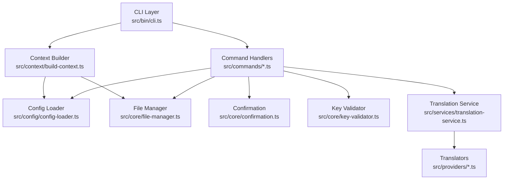
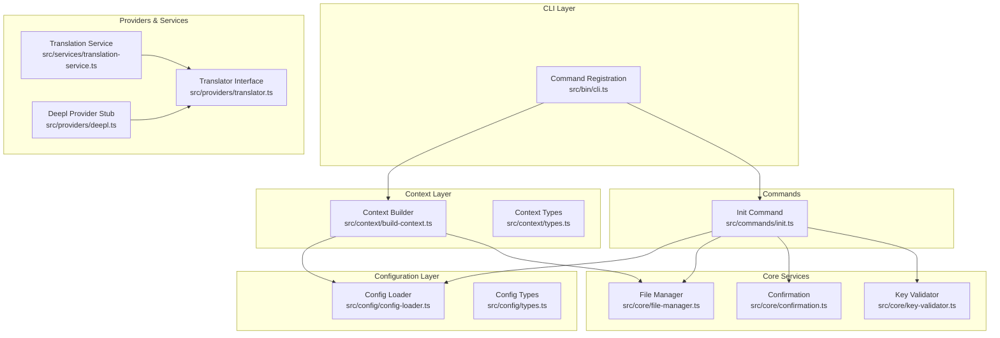
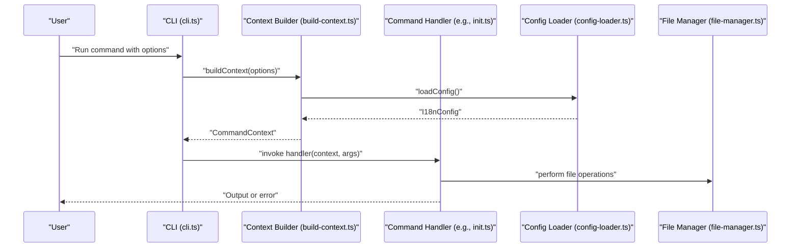
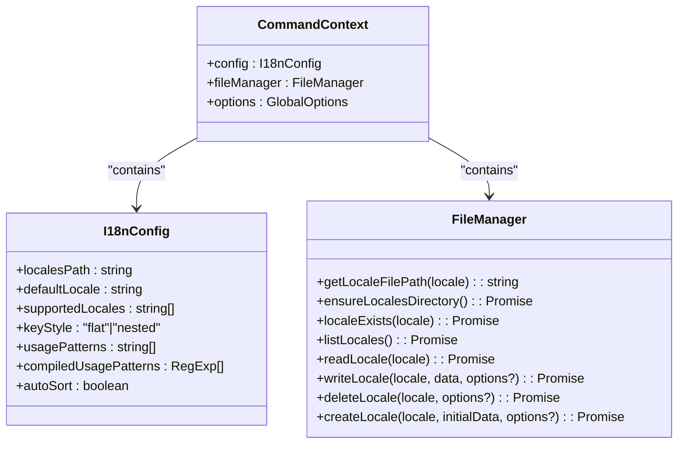
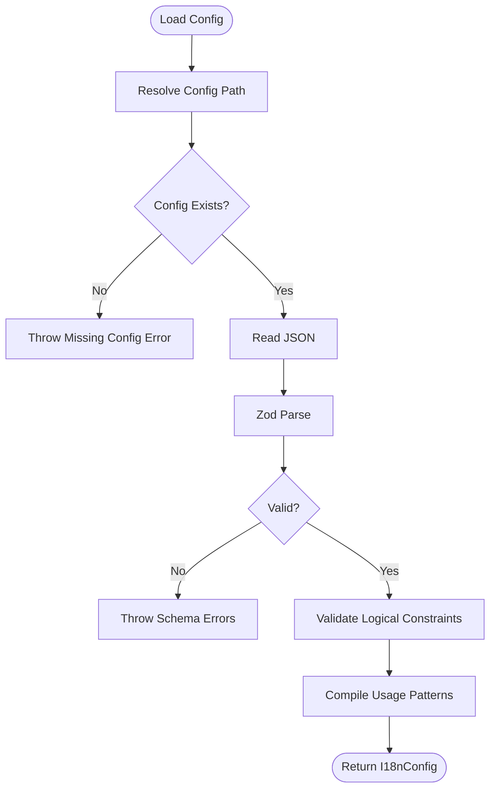
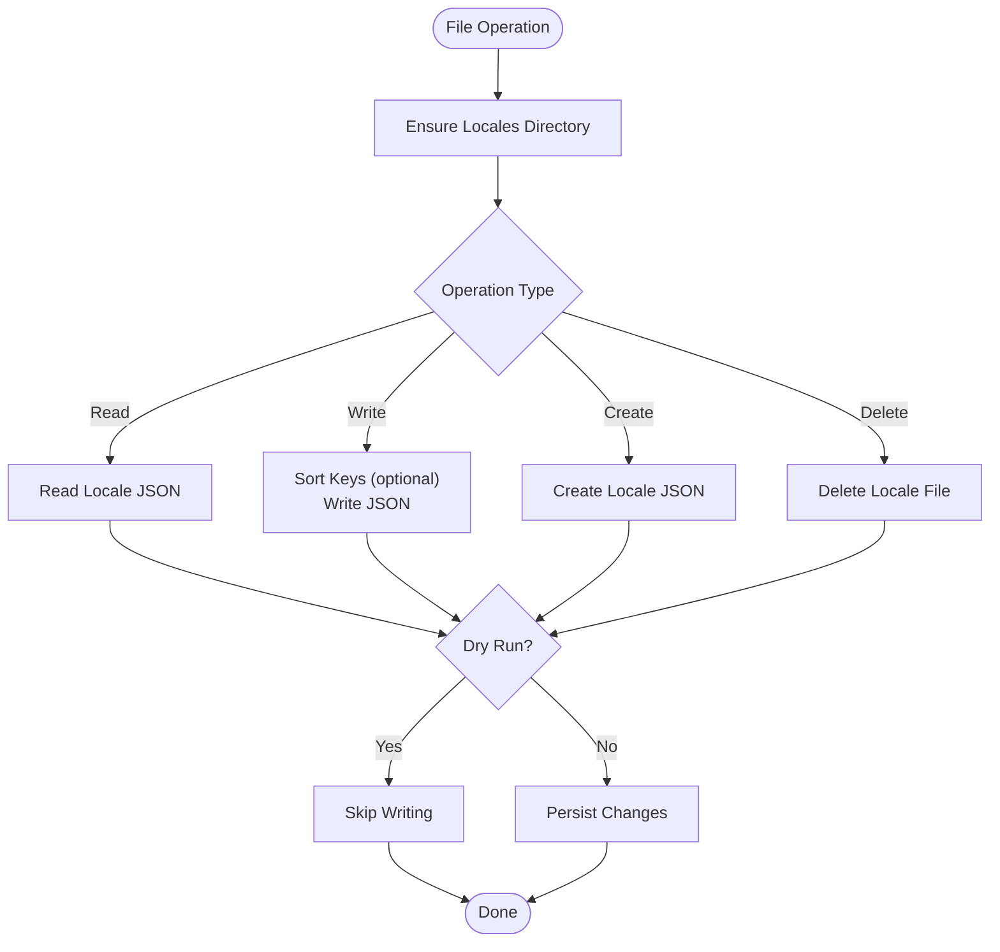
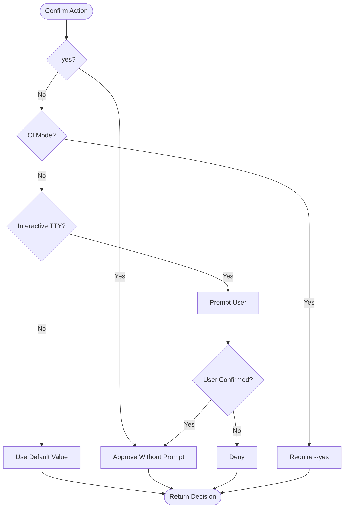
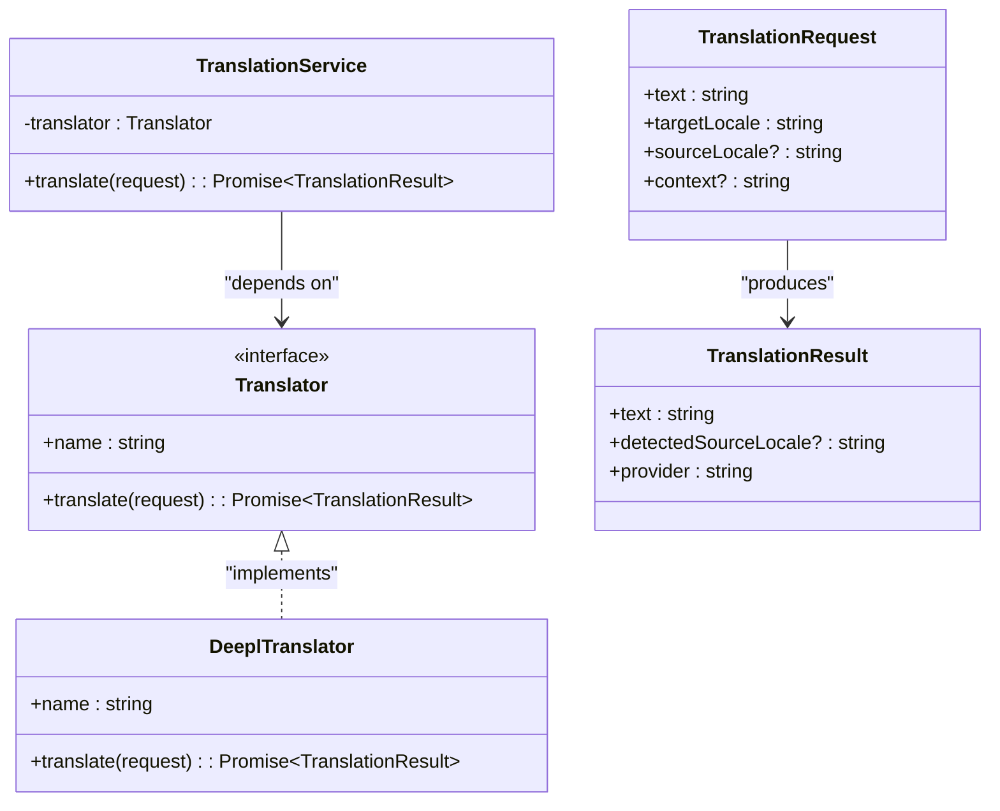
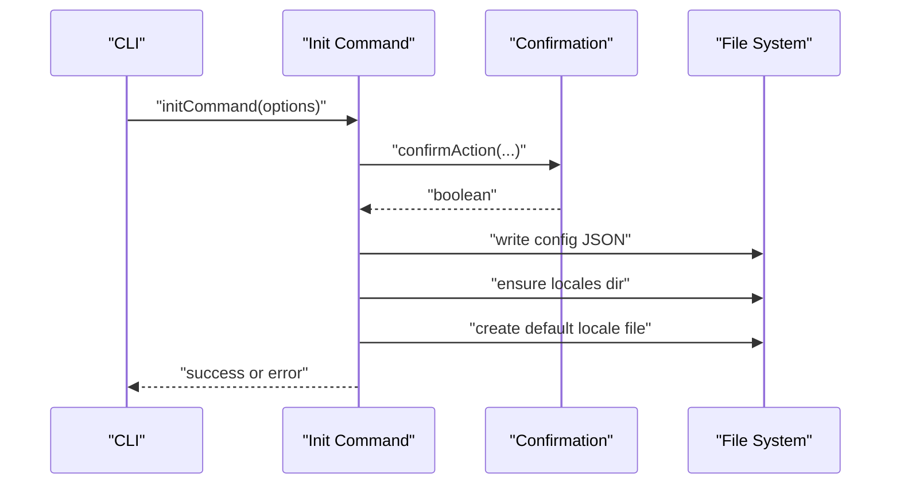
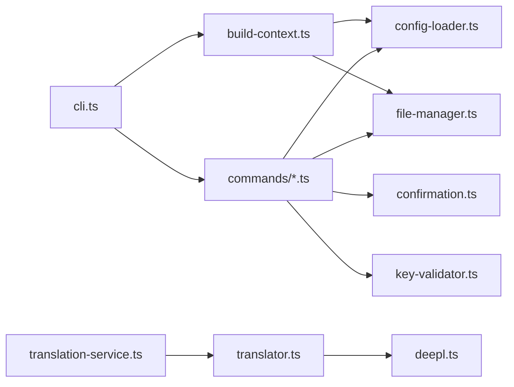

# Architecture Overview

<cite>
**Referenced Files in This Document**
- [cli.ts](file://src/bin/cli.ts)
- [build-context.ts](file://src/context/build-context.ts)
- [types.ts (context)](file://src/context/types.ts)
- [config-loader.ts](file://src/config/config-loader.ts)
- [types.ts (config)](file://src/config/types.ts)
- [file-manager.ts](file://src/core/file-manager.ts)
- [confirmation.ts](file://src/core/confirmation.ts)
- [key-validator.ts](file://src/core/key-validator.ts)
- [translator.ts](file://src/providers/translator.ts)
- [deepl.ts](file://src/providers/deepl.ts)
- [translation-service.ts](file://src/services/translation-service.ts)
- [init.ts](file://src/commands/init.ts)
- [package.json](file://package.json)
- [tsconfig.json](file://tsconfig.json)
- [README.md](file://README.md)
</cite>

## Table of Contents
1. [Introduction](#introduction)
2. [Project Structure](#project-structure)
3. [Core Components](#core-components)
4. [Architecture Overview](#architecture-overview)
5. [Detailed Component Analysis](#detailed-component-analysis)
6. [Dependency Analysis](#dependency-analysis)
7. [Performance Considerations](#performance-considerations)
8. [Troubleshooting Guide](#troubleshooting-guide)
9. [Conclusion](#conclusion)
10. [Appendices](#appendices)

## Introduction
This document presents the architecture of i18n-pro, a professional CLI tool for managing translation files. The system is designed around the Command Pattern with Dependency Injection, enabling a clean separation of concerns across layers: CLI, command handlers, context management, configuration, core services, and file operations. It emphasizes modularity, pluggable translation providers, and strong TypeScript typing to enforce type safety across the stack. The CLI entry point parses user input, constructs a runtime context, and dispatches commands to specialized handlers. Commands orchestrate validation, configuration loading, file operations, and user interaction, while core services encapsulate reusable logic such as file management and confirmation prompts.

## Project Structure
The project follows a feature-based and layer-based organization:
- CLI layer: Command registration and routing via Commander, with global options and error handling.
- Context layer: Centralized construction of runtime context (configuration, file manager, options).
- Configuration layer: Schema-driven configuration loading and validation.
- Core services: File operations, confirmation prompts, and structural validation.
- Providers: Pluggable translation providers implementing a common interface.
- Services: Orchestration of providers through a thin service wrapper.
- Commands: Feature-specific handlers implementing domain actions.

**Diagram sources**
- [cli.ts:1-122](file://src/bin/cli.ts#L1-L122)
- [build-context.ts:1-16](file://src/context/build-context.ts#L1-L16)
- [config-loader.ts:1-176](file://src/config/config-loader.ts#L1-L176)
- [file-manager.ts:1-118](file://src/core/file-manager.ts#L1-L118)
- [confirmation.ts:1-43](file://src/core/confirmation.ts#L1-L43)
- [key-validator.ts:1-33](file://src/core/key-validator.ts#L1-L33)
- [translation-service.ts:1-18](file://src/services/translation-service.ts#L1-L18)
- [translator.ts:1-18](file://src/providers/translator.ts#L1-L18)
- [init.ts:1-236](file://src/commands/init.ts#L1-L236)

**Section sources**
- [cli.ts:1-122](file://src/bin/cli.ts#L1-L122)
- [build-context.ts:1-16](file://src/context/build-context.ts#L1-L16)
- [config-loader.ts:1-176](file://src/config/config-loader.ts#L1-L176)
- [file-manager.ts:1-118](file://src/core/file-manager.ts#L1-L118)
- [confirmation.ts:1-43](file://src/core/confirmation.ts#L1-L43)
- [key-validator.ts:1-33](file://src/core/key-validator.ts#L1-L33)
- [translation-service.ts:1-18](file://src/services/translation-service.ts#L1-L18)
- [translator.ts:1-18](file://src/providers/translator.ts#L1-L18)
- [init.ts:1-236](file://src/commands/init.ts#L1-L236)

## Core Components
- CLI entry point: Registers commands, defines global options, and routes to handlers. Implements centralized error handling and exit overrides.
- Context builder: Assembles a CommandContext from configuration and file manager, injecting global options.
- Configuration loader: Loads and validates configuration using Zod, compiles usage patterns, and enforces logical constraints.
- File manager: Encapsulates filesystem operations for locales, including read/write/create/delete with dry-run support and key sorting.
- Confirmation utility: Provides interactive prompts respecting TTY availability, CI mode, and explicit flags.
- Key validator: Enforces structural integrity when adding keys to maintain compatibility with configured key styles.
- Translation service: Thin wrapper around pluggable translators, exposing a unified translation interface.
- Provider interfaces: Define translator contracts for pluggable translation backends.

**Section sources**
- [cli.ts:1-122](file://src/bin/cli.ts#L1-L122)
- [build-context.ts:1-16](file://src/context/build-context.ts#L1-L16)
- [config-loader.ts:1-176](file://src/config/config-loader.ts#L1-L176)
- [file-manager.ts:1-118](file://src/core/file-manager.ts#L1-L118)
- [confirmation.ts:1-43](file://src/core/confirmation.ts#L1-L43)
- [key-validator.ts:1-33](file://src/core/key-validator.ts#L1-L33)
- [translation-service.ts:1-18](file://src/services/translation-service.ts#L1-L18)
- [translator.ts:1-18](file://src/providers/translator.ts#L1-L18)

## Architecture Overview
The system adheres to the Command Pattern with Dependency Injection:
- CLI layer registers commands and delegates to specialized handlers.
- Each handler receives a CommandContext injected by the context builder.
- Handlers depend on configuration and file manager abstractions, ensuring loose coupling.
- Validation and user interaction are handled through dedicated utilities.
- Translation operations are decoupled via a provider interface and a service wrapper.

**Diagram sources**
- [cli.ts:1-122](file://src/bin/cli.ts#L1-L122)
- [build-context.ts:1-16](file://src/context/build-context.ts#L1-L16)
- [types.ts (context):1-15](file://src/context/types.ts#L1-L15)
- [config-loader.ts:1-176](file://src/config/config-loader.ts#L1-L176)
- [types.ts (config):1-12](file://src/config/types.ts#L1-L12)
- [file-manager.ts:1-118](file://src/core/file-manager.ts#L1-L118)
- [confirmation.ts:1-43](file://src/core/confirmation.ts#L1-L43)
- [key-validator.ts:1-33](file://src/core/key-validator.ts#L1-L33)
- [translator.ts:1-18](file://src/providers/translator.ts#L1-L18)
- [deepl.ts:1-26](file://src/providers/deepl.ts#L1-L26)
- [translation-service.ts:1-18](file://src/services/translation-service.ts#L1-L18)
- [init.ts:1-236](file://src/commands/init.ts#L1-L236)

## Detailed Component Analysis

### CLI Layer and Command Routing
- The CLI uses Commander to define commands and global options. Each command action:
  - Builds a CommandContext via the context builder.
  - Invokes the corresponding command handler with the context and arguments.
- Global options include confirmation skipping, dry-run preview, CI mode, and force operations.
- Centralized error handling prints formatted messages and sets appropriate exit codes.

**Diagram sources**
- [cli.ts:1-122](file://src/bin/cli.ts#L1-L122)
- [build-context.ts:1-16](file://src/context/build-context.ts#L1-L16)
- [config-loader.ts:1-176](file://src/config/config-loader.ts#L1-L176)
- [file-manager.ts:1-118](file://src/core/file-manager.ts#L1-L118)
- [init.ts:1-236](file://src/commands/init.ts#L1-L236)

**Section sources**
- [cli.ts:1-122](file://src/bin/cli.ts#L1-L122)
- [build-context.ts:1-16](file://src/context/build-context.ts#L1-L16)
- [init.ts:1-236](file://src/commands/init.ts#L1-L236)

### Context Management and Dependency Injection
- The context builder composes:
  - Loaded configuration (validated and normalized).
  - A FileManager bound to the resolved locales path.
  - Global options passed from the CLI.
- This design centralizes DI, enabling handlers to focus on domain logic without constructing dependencies.

**Diagram sources**
- [types.ts (context):1-15](file://src/context/types.ts#L1-L15)
- [types.ts (config):1-12](file://src/config/types.ts#L1-L12)
- [file-manager.ts:1-118](file://src/core/file-manager.ts#L1-L118)

**Section sources**
- [build-context.ts:1-16](file://src/context/build-context.ts#L1-L16)
- [types.ts (context):1-15](file://src/context/types.ts#L1-L15)
- [types.ts (config):1-12](file://src/config/types.ts#L1-L12)
- [file-manager.ts:1-118](file://src/core/file-manager.ts#L1-L118)

### Configuration System and Validation
- Configuration loading:
  - Resolves the config file path in the current working directory.
  - Reads and parses JSON, validates with Zod, and normalizes logical constraints.
  - Compiles usage patterns into RegExp arrays and validates capturing groups.
- Logical validation ensures:
  - The default locale is included in supported locales.
  - Supported locales do not contain duplicates.
- Usage patterns are validated to include at least one capturing group.

**Diagram sources**
- [config-loader.ts:1-176](file://src/config/config-loader.ts#L1-L176)

**Section sources**
- [config-loader.ts:1-176](file://src/config/config-loader.ts#L1-L176)
- [types.ts (config):1-12](file://src/config/types.ts#L1-L12)

### File Operations and Dry Run Semantics
- FileManager encapsulates filesystem operations:
  - Ensures locales directory exists.
  - Reads/writes locales with JSON validation.
  - Creates and deletes locales with existence checks.
  - Supports dry-run mode to preview changes without writing.
  - Recursively sorts keys when enabled by configuration.
- These operations are invoked by commands after context injection.

**Diagram sources**
- [file-manager.ts:1-118](file://src/core/file-manager.ts#L1-L118)

**Section sources**
- [file-manager.ts:1-118](file://src/core/file-manager.ts#L1-L118)

### Confirmation and User Interaction
- The confirmation utility:
  - Skips prompts when --yes is provided.
  - Requires explicit confirmation in CI mode.
  - Falls back to default values in non-interactive environments.
- Used pervasively by commands to gate destructive operations.

**Diagram sources**
- [confirmation.ts:1-43](file://src/core/confirmation.ts#L1-L43)

**Section sources**
- [confirmation.ts:1-43](file://src/core/confirmation.ts#L1-L43)

### Translation Provider Strategy
- The translator interface defines a common contract for translation providers.
- The TranslationService delegates translation requests to the configured provider.
- Provider implementations (e.g., Google, DeepL, OpenAI) can be swapped without changing consumers.

**Diagram sources**
- [translator.ts:1-18](file://src/providers/translator.ts#L1-L18)
- [translation-service.ts:1-18](file://src/services/translation-service.ts#L1-L18)
- [deepl.ts:1-26](file://src/providers/deepl.ts#L1-L26)

**Section sources**
- [translator.ts:1-18](file://src/providers/translator.ts#L1-L18)
- [translation-service.ts:1-18](file://src/services/translation-service.ts#L1-L18)
- [deepl.ts:1-26](file://src/providers/deepl.ts#L1-L26)

### Command Example: Initialization
- The init command:
  - Interacts with the user via inquirer when appropriate.
  - Validates and normalizes locales, compiles usage patterns.
  - Optionally initializes locales directory and default locale file.
  - Respects dry-run and CI modes, and supports force overwrites.

**Diagram sources**
- [init.ts:1-236](file://src/commands/init.ts#L1-L236)
- [confirmation.ts:1-43](file://src/core/confirmation.ts#L1-L43)

**Section sources**
- [init.ts:1-236](file://src/commands/init.ts#L1-L236)
- [confirmation.ts:1-43](file://src/core/confirmation.ts#L1-L43)

## Dependency Analysis
- Internal dependencies:
  - CLI depends on context builder and command handlers.
  - Context builder depends on config loader and file manager.
  - Commands depend on configuration, file manager, confirmation, and validators.
  - Translation service depends on translator interface.
- External dependencies:
  - Commander for CLI parsing.
  - Chalk for colored terminal output.
  - Inquirer for interactive prompts.
  - Zod for schema validation.
  - fs-extra for filesystem operations.
  - ISO 639-1 and leven for language and similarity utilities (referenced in README).

**Diagram sources**
- [cli.ts:1-122](file://src/bin/cli.ts#L1-L122)
- [build-context.ts:1-16](file://src/context/build-context.ts#L1-L16)
- [config-loader.ts:1-176](file://src/config/config-loader.ts#L1-L176)
- [file-manager.ts:1-118](file://src/core/file-manager.ts#L1-L118)
- [confirmation.ts:1-43](file://src/core/confirmation.ts#L1-L43)
- [key-validator.ts:1-33](file://src/core/key-validator.ts#L1-L33)
- [translation-service.ts:1-18](file://src/services/translation-service.ts#L1-L18)
- [translator.ts:1-18](file://src/providers/translator.ts#L1-L18)
- [deepl.ts:1-26](file://src/providers/deepl.ts#L1-L26)

**Section sources**
- [package.json:1-45](file://package.json#L1-L45)
- [cli.ts:1-122](file://src/bin/cli.ts#L1-L122)
- [build-context.ts:1-16](file://src/context/build-context.ts#L1-L16)
- [config-loader.ts:1-176](file://src/config/config-loader.ts#L1-L176)
- [file-manager.ts:1-118](file://src/core/file-manager.ts#L1-L118)
- [confirmation.ts:1-43](file://src/core/confirmation.ts#L1-L43)
- [key-validator.ts:1-33](file://src/core/key-validator.ts#L1-L33)
- [translation-service.ts:1-18](file://src/services/translation-service.ts#L1-L18)
- [translator.ts:1-18](file://src/providers/translator.ts#L1-L18)
- [deepl.ts:1-26](file://src/providers/deepl.ts#L1-L26)

## Performance Considerations
- File operations:
  - JSON reads/writes are synchronous per locale; batch operations can reduce overhead.
  - Sorting keys recursively adds O(n log n) cost per object; consider disabling autoSort for very large files.
- Validation:
  - Zod parsing and usage pattern compilation occur once during context initialization.
- I/O:
  - Ensure localesPath is on fast storage; avoid excessive disk churn by minimizing intermediate writes.
- Dry run:
  - Use --dry-run to avoid unnecessary I/O during development and CI verification.

## Troubleshooting Guide
- Configuration errors:
  - Missing or invalid configuration file: thrown when the config file is absent or malformed.
  - Schema validation failures: reported with specific field and issue details.
  - Logical validation failures: defaultLocale not in supportedLocales or duplicate locales.
- Usage patterns:
  - Invalid regex or missing capturing groups cause immediate failure during compilation.
- File operations:
  - Attempting to read non-existent locale files or write to existing ones triggers explicit errors.
  - Dry run mode prevents changes; verify output logs for previews.
- User interaction:
  - CI mode requires --yes for confirmation; otherwise throws an error.
  - Non-interactive environments fall back to default values or skip prompts.

**Section sources**
- [config-loader.ts:1-176](file://src/config/config-loader.ts#L1-L176)
- [file-manager.ts:1-118](file://src/core/file-manager.ts#L1-L118)
- [confirmation.ts:1-43](file://src/core/confirmation.ts#L1-L43)
- [cli.ts:113-122](file://src/bin/cli.ts#L113-L122)

## Conclusion
i18n-pro’s architecture cleanly separates concerns across layers, leveraging the Command Pattern with Dependency Injection to route CLI commands to specialized handlers. Strong TypeScript typing, Zod-based configuration validation, and pluggable providers enable a robust, extensible system. The design supports dry-run previews, CI-friendly operations, and modular composition, making it suitable for both interactive development and automated pipelines.

## Appendices

### Design Patterns Observed
- Command Pattern: CLI commands delegate to handlers that encapsulate domain actions.
- Dependency Injection: Context builder injects configuration and file manager into handlers.
- Factory Pattern: Context creation assembles dependencies from configuration and file manager.
- Strategy Pattern: Translator interface enables pluggable translation providers.
- Template Method: Base command behavior can be standardized through shared utilities (confirmation, dry-run, CI mode).

**Section sources**
- [cli.ts:1-122](file://src/bin/cli.ts#L1-L122)
- [build-context.ts:1-16](file://src/context/build-context.ts#L1-L16)
- [translator.ts:1-18](file://src/providers/translator.ts#L1-L18)
- [translation-service.ts:1-18](file://src/services/translation-service.ts#L1-L18)

### TypeScript Foundation and Type Safety
- Strict compiler options enforce:
  - Strict type checking and exact optional property types.
  - Isolated modules and verbatim module syntax for safer builds.
  - Indexed access checks and declaration generation for better DX.
- Interfaces and types define contracts across layers, ensuring consistent behavior and reducing runtime errors.

**Section sources**
- [tsconfig.json:1-24](file://tsconfig.json#L1-L24)
- [types.ts (context):1-15](file://src/context/types.ts#L1-L15)
- [types.ts (config):1-12](file://src/config/types.ts#L1-L12)
- [translator.ts:1-18](file://src/providers/translator.ts#L1-L18)