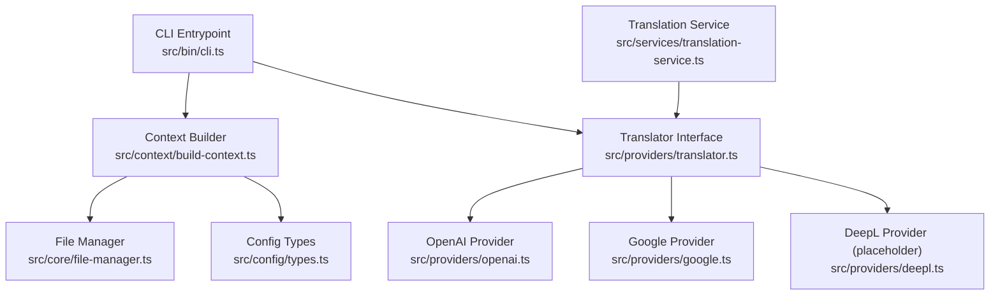
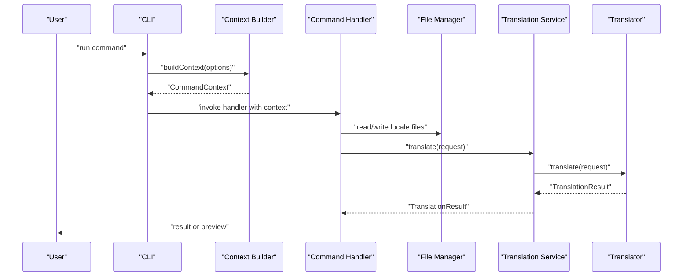
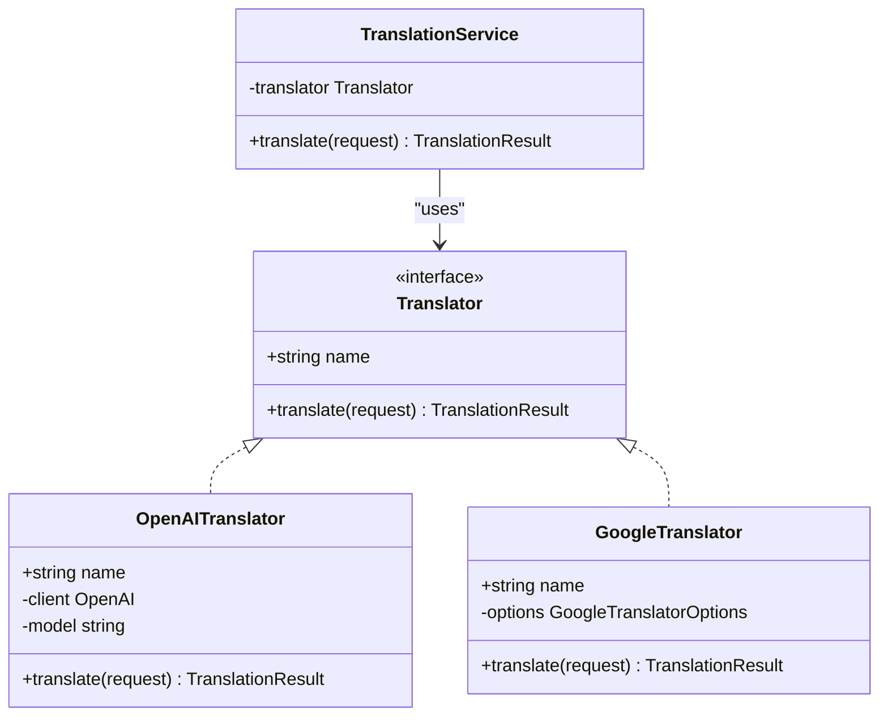
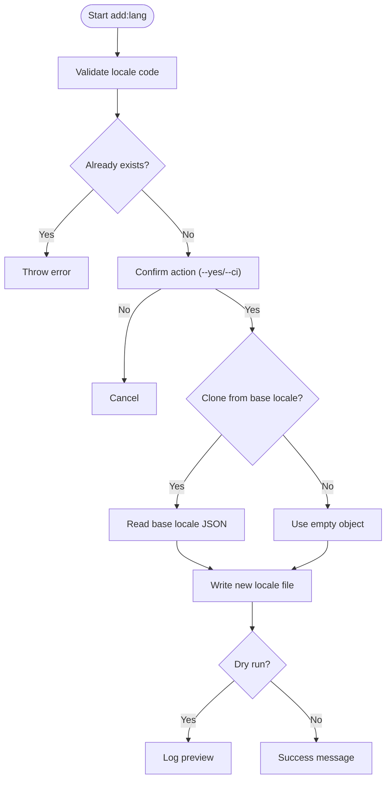
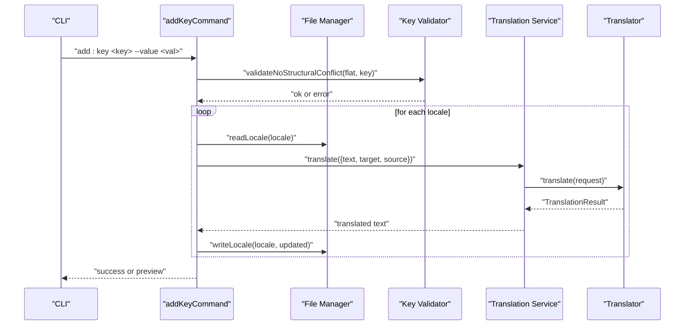
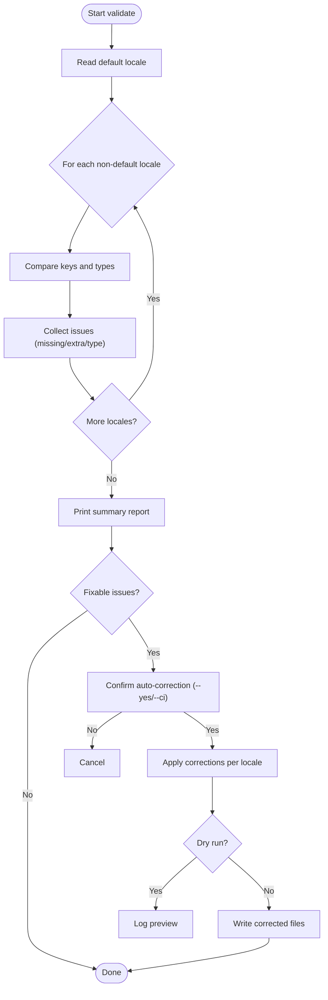
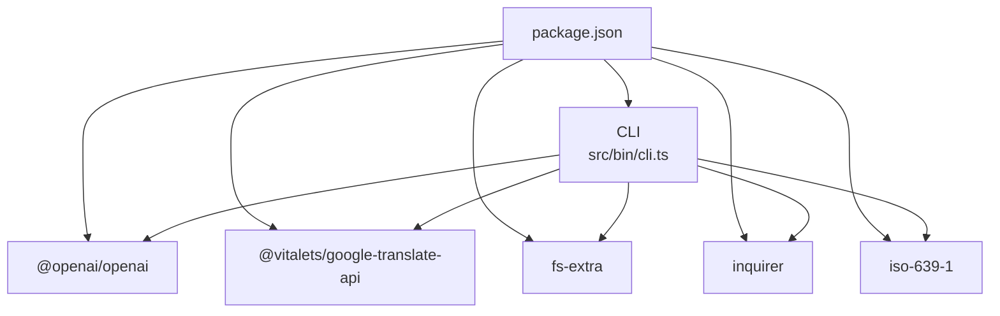

# Core Features and Capabilities

<cite>
**Referenced Files in This Document**
- [README.md](file://README.md)
- [package.json](file://package.json)
- [src/bin/cli.ts](file://src/bin/cli.ts)
- [src/context/build-context.ts](file://src/context/build-context.ts)
- [src/config/types.ts](file://src/config/types.ts)
- [src/core/file-manager.ts](file://src/core/file-manager.ts)
- [src/core/key-validator.ts](file://src/core/key-validator.ts)
- [src/providers/translator.ts](file://src/providers/translator.ts)
- [src/providers/openai.ts](file://src/providers/openai.ts)
- [src/providers/google.ts](file://src/providers/google.ts)
- [src/providers/deepl.ts](file://src/providers/deepl.ts)
- [src/services/translation-service.ts](file://src/services/translation-service.ts)
- [src/commands/add-lang.ts](file://src/commands/add-lang.ts)
- [src/commands/add-key.ts](file://src/commands/add-key.ts)
- [src/commands/validate.ts](file://src/commands/validate.ts)
</cite>

## Table of Contents
1. [Introduction](#introduction)
2. [Project Structure](#project-structure)
3. [Core Components](#core-components)
4. [Architecture Overview](#architecture-overview)
5. [Detailed Component Analysis](#detailed-component-analysis)
6. [Dependency Analysis](#dependency-analysis)
7. [Performance Considerations](#performance-considerations)
8. [Troubleshooting Guide](#troubleshooting-guide)
9. [Conclusion](#conclusion)
10. [Appendices](#appendices)

## Introduction
This document explains i18n-ai-cli’s core features and capabilities with a focus on the AI-powered translation system, language and key management, maintenance workflows, and developer experience features. It covers provider selection logic, cost considerations, quality differences between providers, locale validation, auto-translation cloning, strict validation modes, structural validation, unused key detection, auto-correction, conflict resolution, dry-run mode, CI/CD readiness, TypeScript support, and non-interactive operation modes. Practical examples are included to demonstrate capabilities and limitations.

## Project Structure
The project is organized around a CLI entrypoint, command modules, a configuration loader, a file manager, provider abstractions for translation, and validation/maintenance logic. The CLI wires global options and routes commands to specialized handlers. Context builders assemble configuration and file manager instances for each command.

**Diagram sources**
- [src/bin/cli.ts:1-209](file://src/bin/cli.ts#L1-L209)
- [src/context/build-context.ts:1-16](file://src/context/build-context.ts#L1-L16)
- [src/core/file-manager.ts:1-118](file://src/core/file-manager.ts#L1-L118)
- [src/config/types.ts:1-12](file://src/config/types.ts#L1-L12)
- [src/providers/translator.ts:1-60](file://src/providers/translator.ts#L1-L60)
- [src/providers/openai.ts:1-60](file://src/providers/openai.ts#L1-L60)
- [src/providers/google.ts:1-50](file://src/providers/google.ts#L1-L50)
- [src/providers/deepl.ts:1-26](file://src/providers/deepl.ts#L1-L26)
- [src/services/translation-service.ts:1-18](file://src/services/translation-service.ts#L1-L18)

**Section sources**
- [README.md:1-381](file://README.md#L1-L381)
- [package.json:1-68](file://package.json#L1-L68)
- [src/bin/cli.ts:1-209](file://src/bin/cli.ts#L1-L209)
- [src/context/build-context.ts:1-16](file://src/context/build-context.ts#L1-L16)
- [src/core/file-manager.ts:1-118](file://src/core/file-manager.ts#L1-L118)
- [src/config/types.ts:1-12](file://src/config/types.ts#L1-L12)
- [src/providers/translator.ts:1-60](file://src/providers/translator.ts#L1-L60)
- [src/providers/openai.ts:1-60](file://src/providers/openai.ts#L1-L60)
- [src/providers/google.ts:1-50](file://src/providers/google.ts#L1-L50)
- [src/providers/deepl.ts:1-26](file://src/providers/deepl.ts#L1-L26)
- [src/services/translation-service.ts:1-18](file://src/services/translation-service.ts#L1-L18)

## Core Components
- CLI Entrypoint: Defines global options and routes commands to handlers. Implements provider selection logic and passes translators to commands that require auto-translation.
- Context Builder: Loads configuration and instantiates the file manager for each command.
- File Manager: Reads/writes locale files, ensures directories, supports dry-run, and auto-sorts keys based on configuration.
- Translation Providers: Abstractions and implementations for OpenAI and Google Translate, plus a placeholder for DeepL.
- Translation Service: Thin wrapper delegating translation requests to the selected provider.
- Validation/Maintenance: Structural validation, unused key detection, auto-correction, and conflict resolution.

**Section sources**
- [src/bin/cli.ts:25-198](file://src/bin/cli.ts#L25-L198)
- [src/context/build-context.ts:5-16](file://src/context/build-context.ts#L5-L16)
- [src/core/file-manager.ts:31-98](file://src/core/file-manager.ts#L31-L98)
- [src/providers/translator.ts:14-59](file://src/providers/translator.ts#L14-L59)
- [src/providers/openai.ts:9-59](file://src/providers/openai.ts#L9-L59)
- [src/providers/google.ts:9-49](file://src/providers/google.ts#L9-L49)
- [src/services/translation-service.ts:7-17](file://src/services/translation-service.ts#L7-L17)
- [src/commands/validate.ts:121-253](file://src/commands/validate.ts#L121-L253)

## Architecture Overview
The CLI orchestrates commands that rely on a shared context (configuration and file manager). Commands requiring translation instantiate a translator based on explicit flags, environment variables, or defaults. Translation requests are delegated to the provider abstraction, returning normalized results consumed by commands for auto-correction and key management.

**Diagram sources**
- [src/bin/cli.ts:40-101](file://src/bin/cli.ts#L40-L101)
- [src/context/build-context.ts:5-16](file://src/context/build-context.ts#L5-L16)
- [src/core/file-manager.ts:31-98](file://src/core/file-manager.ts#L31-L98)
- [src/services/translation-service.ts:14-16](file://src/services/translation-service.ts#L14-L16)
- [src/providers/translator.ts:14-17](file://src/providers/translator.ts#L14-L17)
- [src/providers/openai.ts:30-58](file://src/providers/openai.ts#L30-L58)
- [src/providers/google.ts:17-48](file://src/providers/google.ts#L17-L48)

## Detailed Component Analysis

### AI-Powered Translation System and Provider Selection
- Provider selection logic:
  - Explicit provider flag takes highest priority.
  - If no flag is provided, the presence of an OpenAI API key determines the provider.
  - Otherwise, Google Translate is used as a fallback.
- Quality and cost considerations:
  - OpenAI offers higher-quality, context-aware translations but is paid.
  - Google Translate is free and used automatically when no OpenAI key is present.
- Implementation highlights:
  - Translator interface defines a uniform contract for translation requests and results.
  - OpenAI provider constructs a chat completion request with a concise system prompt and optional context.
  - Google provider wraps a third-party translation library and returns detected source locale when available.
  - Translation service delegates translation calls to the configured provider.

**Diagram sources**
- [src/providers/translator.ts:14-17](file://src/providers/translator.ts#L14-L17)
- [src/providers/openai.ts:9-28](file://src/providers/openai.ts#L9-L28)
- [src/providers/google.ts:9-15](file://src/providers/google.ts#L9-L15)
- [src/services/translation-service.ts:7-17](file://src/services/translation-service.ts#L7-L17)

**Section sources**
- [README.md:268-305](file://README.md#L268-L305)
- [src/bin/cli.ts:82-98](file://src/bin/cli.ts#L82-L98)
- [src/bin/cli.ts:118-136](file://src/bin/cli.ts#L118-L136)
- [src/bin/cli.ts:178-194](file://src/bin/cli.ts#L178-L194)
- [src/providers/translator.ts:1-60](file://src/providers/translator.ts#L1-L60)
- [src/providers/openai.ts:14-58](file://src/providers/openai.ts#L14-L58)
- [src/providers/google.ts:13-48](file://src/providers/google.ts#L13-L48)
- [src/services/translation-service.ts:7-17](file://src/services/translation-service.ts#L7-L17)

### Language Management: Adding and Removing Locales
- Locale addition:
  - Validates language codes against ISO 639-1 (accepts both base and region variants).
  - Supports cloning from an existing locale and translating nested content into the new locale.
  - Enforces uniqueness and existence checks; integrates with strict validation mode for structural conflicts.
  - Writes locale files with optional dry-run support.
- Locale removal:
  - Confirms deletion and supports dry-run mode.
  - Ensures the file exists before attempting removal.

**Diagram sources**
- [src/commands/add-lang.ts:34-96](file://src/commands/add-lang.ts#L34-L96)
- [src/core/file-manager.ts:80-98](file://src/core/file-manager.ts#L80-L98)

**Section sources**
- [README.md:95-130](file://README.md#L95-L130)
- [src/commands/add-lang.ts:11-98](file://src/commands/add-lang.ts#L11-L98)
- [src/core/file-manager.ts:22-98](file://src/core/file-manager.ts#L22-L98)

### Translation Key Management: Add, Update, Remove
- Add key:
  - Validates keys do not conflict structurally with existing keys.
  - Populates default locale with the provided value and auto-translates others using the selected provider.
  - Supports nested or flat key styles based on configuration.
- Update key:
  - Updates a single locale or syncs changes to all other locales using translation.
  - Integrates provider selection logic similar to add key.
- Remove key:
  - Removes a key from all locales with confirmation and dry-run support.

**Diagram sources**
- [src/commands/add-key.ts:8-120](file://src/commands/add-key.ts#L8-L120)
- [src/core/key-validator.ts:1-33](file://src/core/key-validator.ts#L1-L33)
- [src/core/file-manager.ts:31-61](file://src/core/file-manager.ts#L31-L61)
- [src/services/translation-service.ts:14-16](file://src/services/translation-service.ts#L14-L16)
- [src/providers/translator.ts:14-17](file://src/providers/translator.ts#L14-L17)
- [src/providers/openai.ts:30-58](file://src/providers/openai.ts#L30-L58)
- [src/providers/google.ts:17-48](file://src/providers/google.ts#L17-L48)

**Section sources**
- [README.md:131-187](file://README.md#L131-L187)
- [src/commands/add-key.ts:8-120](file://src/commands/add-key.ts#L8-L120)
- [src/core/key-validator.ts:1-33](file://src/core/key-validator.ts#L1-L33)
- [src/core/file-manager.ts:45-61](file://src/core/file-manager.ts#L45-L61)
- [src/services/translation-service.ts:7-17](file://src/services/translation-service.ts#L7-L17)

### Maintenance: Structural Validation, Unused Key Detection, Auto-Correction, Conflict Resolution
- Structural validation:
  - Compares each locale to the default locale, detecting missing, extra, and type-mismatched keys.
  - Reports issues per locale and totals.
- Auto-correction:
  - With a translator, fills missing keys and type mismatches by translating from the default locale.
  - Without a translator, fills missing keys with empty strings.
  - Removes extra keys and writes corrected files.
- Conflict resolution:
  - Uses strict validation to prevent structural conflicts during key creation.

**Diagram sources**
- [src/commands/validate.ts:121-253](file://src/commands/validate.ts#L121-L253)
- [src/core/file-manager.ts:31-61](file://src/core/file-manager.ts#L31-L61)

**Section sources**
- [README.md:188-219](file://README.md#L188-L219)
- [src/commands/validate.ts:11-253](file://src/commands/validate.ts#L11-L253)
- [src/core/file-manager.ts:31-61](file://src/core/file-manager.ts#L31-L61)

### Developer Experience: Dry-Run Mode, CI/CD Readiness, TypeScript Support, Non-Interactive Operation
- Dry-run mode:
  - Prevents file writes and logs previews for all mutating commands.
- CI/CD readiness:
  - Non-interactive mode disables prompts and exits with errors when changes would be made.
  - Requires explicit confirmation flags to apply changes.
- TypeScript support:
  - Full TypeScript typing for configuration, providers, and services.
- Non-interactive operation:
  - Commands enforce skipping prompts when the CI flag is set.

**Section sources**
- [README.md:220-235](file://README.md#L220-L235)
- [src/bin/cli.ts:25-32](file://src/bin/cli.ts#L25-L32)
- [src/commands/add-lang.ts:65-74](file://src/commands/add-lang.ts#L65-L74)
- [src/commands/validate.ts:172-185](file://src/commands/validate.ts#L172-L185)

## Dependency Analysis
External dependencies include OpenAI and Google Translate libraries, CLI parsing, file system utilities, and validation helpers. The CLI depends on provider implementations and the file manager. Commands depend on the context builder and file manager. Translation service depends on the translator interface.

**Diagram sources**
- [package.json:48-58](file://package.json#L48-L58)
- [src/bin/cli.ts:1-16](file://src/bin/cli.ts#L1-L16)

**Section sources**
- [package.json:48-58](file://package.json#L48-L58)
- [src/bin/cli.ts:1-16](file://src/bin/cli.ts#L1-L16)

## Performance Considerations
- Provider latency:
  - OpenAI translation involves network latency and token usage; batching or caching is not implemented in the current design.
  - Google Translate is immediate but may vary by region and rate limits.
- File I/O:
  - Reading and writing locale files is proportional to key count; auto-sorting introduces recursive traversal and sorting overhead.
- Recommendations:
  - Use dry-run to estimate work before applying changes.
  - Prefer smaller batches of keys for frequent updates.
  - Consider running validations in CI with non-interactive mode to avoid delays.

[No sources needed since this section provides general guidance]

## Troubleshooting Guide
- Missing OpenAI API key:
  - OpenAI provider requires a key via constructor option or environment variable; otherwise, provider instantiation fails.
- Unknown provider flag:
  - Using an unsupported provider raises an error; choose “openai” or “google”.
- Invalid locale code:
  - Only ISO 639-1 compliant codes are accepted; region variants are supported.
- Structural conflicts:
  - Attempting to create a key that conflicts with existing nested or flat structures triggers an error; resolve conflicts before retrying.
- JSON parse errors:
  - Reading malformed locale files throws errors; fix JSON before proceeding.
- CI mode rejections:
  - In CI mode without explicit confirmation, operations that would modify files are rejected; add the confirmation flag to apply.

**Section sources**
- [src/providers/openai.ts:14-21](file://src/providers/openai.ts#L14-L21)
- [src/bin/cli.ts:89-93](file://src/bin/cli.ts#L89-L93)
- [src/bin/cli.ts:127-130](file://src/bin/cli.ts#L127-L130)
- [src/bin/cli.ts:186-189](file://src/bin/cli.ts#L186-L189)
- [src/commands/add-lang.ts:36-38](file://src/commands/add-lang.ts#L36-L38)
- [src/core/key-validator.ts:12-18](file://src/core/key-validator.ts#L12-L18)
- [src/core/file-manager.ts:38-42](file://src/core/file-manager.ts#L38-L42)
- [src/commands/validate.ts:172-176](file://src/commands/validate.ts#L172-L176)

## Conclusion
i18n-ai-cli streamlines internationalization workflows by combining robust validation, auto-correction, and AI-powered translation. Its provider selection logic balances convenience and cost, while dry-run and CI/CD-friendly modes improve safety and automation readiness. The modular design with typed interfaces and a clear separation of concerns makes it extensible and maintainable.

[No sources needed since this section summarizes without analyzing specific files]

## Appendices

### Practical Examples and Limitations
- Initialize configuration and add a language cloned from another locale:
  - Example command paths: [Quick Start:32-52](file://README.md#L32-L52), [Add Language:97-117](file://README.md#L97-L117)
- Add a translation key with auto-translation:
  - Example command paths: [Add Key:133-152](file://README.md#L133-L152)
- Update a key and sync translations across locales:
  - Example command paths: [Update Key:153-174](file://README.md#L153-L174)
- Validate files and auto-correct with a provider:
  - Example command paths: [Validate:190-209](file://README.md#L190-L209)
- Clean unused keys:
  - Example command paths: [Clean Unused:210-219](file://README.md#L210-L219)
- Provider selection behavior:
  - Example command paths: [Provider Selection:277-282](file://README.md#L277-L282)
- CI/CD usage:
  - Example command paths: [CI/CD Integration:258-267](file://README.md#L258-L267)

[No sources needed since this section aggregates previously cited examples]